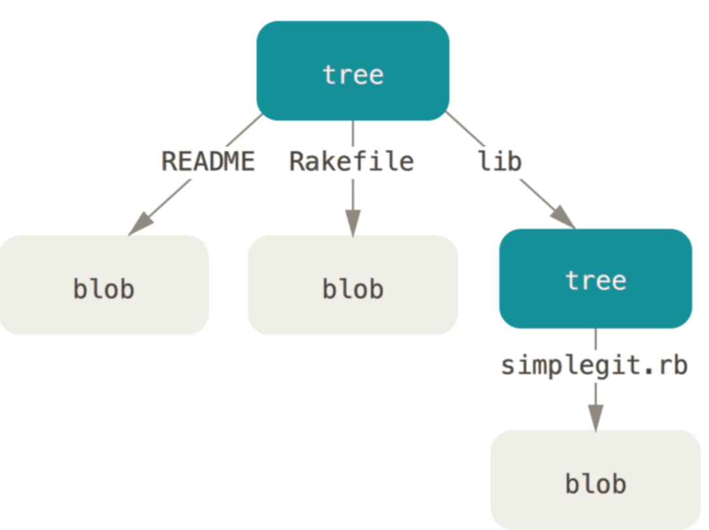
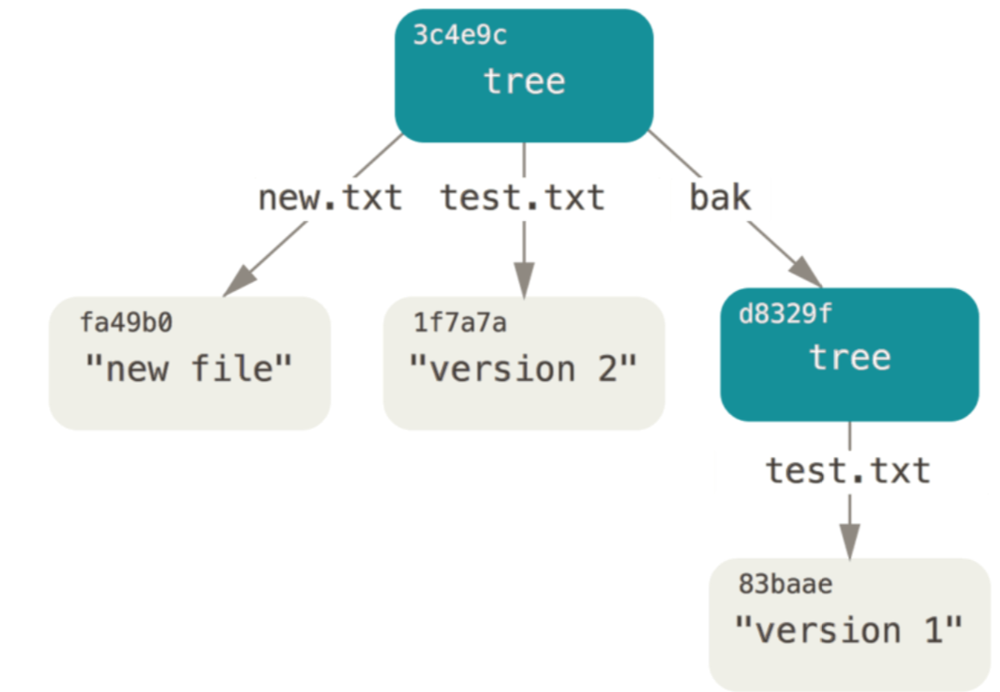
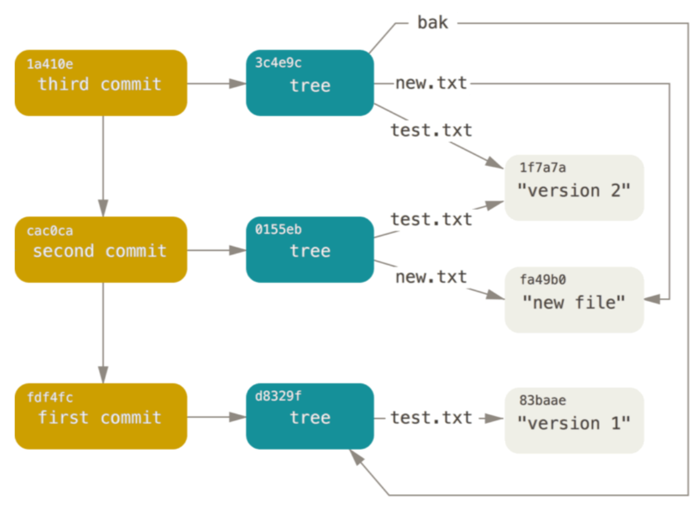
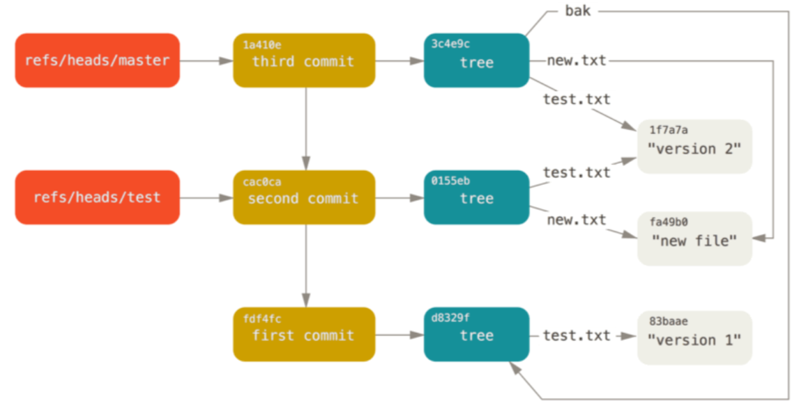

# git 内部原理
首先要弄明白一点，从根本上来讲 Git 是一个内容寻址 (content-addressable)文件系统，并在此之上提供了一个版本控制系统的用户界面。Git 的核心部分是一个简单的键值对数据库(key-value data store)。 可以向该数据库插入任意类型的内容，它会返回一个键值，通过该键值可以在任意时刻再次检索(retrieve)该内容。 可以通过底层命令 hash-object 来演示上述效果——该命令可 将任意数据保存于 .git 目录，并返回相应的键值。
## 底层命令和高层命令
通过 checkout、branch、remote 等大约 30 个诸如此类动词形式的命令来玩转 Git。 然而，由于 Git 最初是一套面向版本控制系统的工具集，而不是一个完整的、用户友好的版本控制系统，所以它还包含了一部分用于完成底层工作的命令。这些命令被设计成能以 UNIX 命令行的风格连接在一起，抑或藉由脚本调用，来完成工作。 这部分命令一般被称作“底层(plumbing)”命令，而那些更友好的命令则被称作“高层 (porcelain)”命令。

当在一个新目录或已有目录执行 `git init` 时，Git 会创建一个 .git 目录。 这个目录包含了几乎所有 Git 存储和操作的对象。 如若想备份或复制一个版本库，只需把这个目录拷贝至另一处即可。

	$ ls -F1
	  HEAD
	  config*
	  description
	  hooks/
	  info/
	  objects/
	  refs/
- description 文件仅供 GitWeb 程序使用。 
- config 文件包含项目特有的配置选项。 
- info 目录包含一个全局性排除(global exclude)文件，用以放置那些不希望被记录在 `.gitignore` 文件中的忽略模式(ignored patterns)。 
- hooks 目录包含客户端或服务端的钩子脚本(hook scripts)，在 Git 钩子中这部分话题已被详细探讨过。
- HEAD 文件

	指示目前被检出的分支
- (尚待创建的)index 文件

	保存暂存区信息
- objects 目录

	存储所有数据内容
- refs 目录

	存储指向数据(分支)的提交对象的指针

### Git 对象
需要初始化一个新的 Git 版本库，并确认 objects 目录为空:

	  $ git init test
	  Initialized empty Git repository in /tmp/test/.git/
	  
	  $ cd test
	  
	  $ find .git/objects
	  .git/objects
	  .git/objects/info
	  .git/objects/pack
	  
	  $ find .git/objects -type f
可以看到 Git 对 objects 目录进行了初始化，并创建了 pack 和 info 子目录，但均为空。 接着，往 Git 数据库存入一些文本

	$ echo 'test content' | git hash-object -w --stdin
	  d670460b4b4aece5915caf5c68d12f560a9fe3e4
- -w 选项指示 hash-object 命令存储数据对象;若不指定此选项，则该命令仅返回对应的键值。 
- --stdin 选项则指示该命令从标准输入读取内容;若不指定此选项，则须在命令尾部给出待存储文件的路径。 

该命令输出一个长度为 40 个字符的校验和。 这是一个 SHA-1 哈希值——一个将待存储的数据外加一个头部信息 (header)一起做 SHA-1 校验运算而得的校验和。

	$ find .git/objects -type f
	  .git/objects/d6/70460b4b4aece5915caf5c68d12f560a9fe3e4
objects 目录下看到一个文件,这就是开始时 Git 存储内容的方式——一个文件对应一条内容，以该内容加上特定头部信息一起的 SHA-1 校验和为文件命名。 校验和的前两个字符用于命名子目录，余下的 38 个字符 则用作文件名。

	$ git cat-file -p d670460b4b4aece5915caf5c68d12f560a9fe3e4
	  test content
可以通过 cat-file 命令从 Git 那里取回数据。为 cat- file 指定 -p 选项可指示该命令自动判断内容的类型

#### 简单的版本控制用例
- 创建一个新文件并将其内容存入数据库
	
		$ echo 'version 1' > test.txt
		$ git hash-object -w test.txt
		83baae61804e65cc73a7201a7252750c76066a30
- 向文件里写入新内容，并再次将其存入数据库

		$ echo 'version 2' > test.txt
		$ git hash-object -w test.txt
		1f7a7a472abf3dd9643fd615f6da379c4acb3e3a
- 查看对象

		$ find .git/objects -type f
		  .git/objects/1f/7a7a472abf3dd9643fd615f6da379c4acb3e3a
		  .git/objects/83/baae61804e65cc73a7201a7252750c76066a30
- 查看对象
	- version 1

			$ git cat-file -p 83baae61804e65cc73a7201a7252750c76066a30 > test.txt
			$ cat test.txt
			  version 1
	- version 2

			$ git cat-file -p 1f7a7a472abf3dd9643fd615f6da379c4acb3e3a > test.txt
			$ cat test.txt
			version 2 		  				
			
上述类型的对象称之为数据对象(blob object)。利用 `cat-file -t` 命令，可以让Git告诉我们其内部存储的任何对象类型，只要给定该对象的

	$ git cat-file -t 1f7a7a472abf3dd9643fd615f6da379c4acb3e3a
	blob
#### 树对象
它能解决文件名保存的问题，允许将多个文件组织到一起。 Git 以一种类似于 UNIX 文件系统的方式存储内容，但作了些许简化。所有内容均以树对象和数据对象的形式存储，其中树对象对应了 UNIX 中的目录项，数据对象则大致上对应了 inodes 或文件内容。一个树对象包含了一条或多条树对象记录(tree entry)，每条记录含有一个指向数据对象或者子树对象的 SHA-1 指针，以及相应的模式、类型、文件名信息。 例如，某项目当前对应的最新树对象可能是这样的:	

	$ git cat-file -p master^{tree}
	100644 blob a906cb2a4a904a152e80877d4088654daad0c859 README
	100644 blob 8f94139338f9404f26296befa88755fc2598c289 Rakefile
	040000 tree 99f1a6d12cb4b6f19c8655fca46c3ecf317074e0 lib	
master^{tree} 语法表示 master 分支上最新的提交所指向的树对象。 请注意，lib 子目录(所对应的那条 树对象记录)并不是一个数据对象，而是一个指针，其指向的是另一个树对象:

	$ git cat-file -p 99f1a6d12cb4b6f19c8655fca46c3ecf317074e0
	  100644 blob 47c6340d6459e05787f644c2447d2595f5d3a54b      simplegit.rb
Git 内部存储的数据结构

创建自己的树对象。 可以通过底层命令 `update-index` 为一个单独文件 test.txt 文件的首个版本——创建一个暂存区。 利用该命令，可以把 test.txt 文件的首个版本人为地加入一个新的暂存区。 

- 必须为上述命令指定 `--add` 选项，因为此前该文件并不在暂存区中;
- 同样必需的还有 `--cacheinfo` 选项，因为将要添加的文件位于 Git 数据库中，而不是位于当前目录下。 同时，需要指定文件模式、SHA-1 与文件名:

本例中，指定的文件模式为 100644，表明这是一个普通文件。 其他选择包括:100755，表示一个可执行文件; 120000，表示一个符号链接。 这里的文件模式参考了常见的 UNIX 文件模式，但远没那么灵活——上述三种模式即是 Git 文件(即数据对象)的所有合法模式

		$ git update-index --add --cacheinfo 100644 \
		    83baae61804e65cc73a7201a7252750c76066a30 test.txt
可以通过 write-tree 命令将暂存区内容写入一个树对象。 此处无需指定 -w 选项——如果某个树对象此前并不存在的话，当调用 write-tree 命令时，它会根据当前暂存区状态自动创建一个新的树对象

	$ git write-tree # 创建树是一个根
	  d8329fc1cc938780ffdd9f94e0d364e0ea74f579
	$ git cat-file -p d8329fc1cc938780ffdd9f94e0d364e0ea74f579
	  100644 blob 83baae61804e65cc73a7201a7252750c76066a30      test.txt

验证树

	$ git cat-file -t d8329fc1cc938780ffdd9f94e0d364e0ea74f579
	tree
创建一个新的树对象，它包括 test.txt 文件的第二个版本，以及一个新的文件

	$ echo 'new file' > new.txt
	$ git update-index --cacheinfo 100644 \
	    1f7a7a472abf3dd9643fd615f6da379c4acb3e3a test.txt
	$ git update-index --add new.txt
生成结构后，再查看

	$ git write-tree
	  0155eb4229851634a0f03eb265b69f5a2d56f341
	$ git cat-file -p 0155eb4229851634a0f03eb265b69f5a2d56f341
	  100644 blob fa49b077972391ad58037050f2a75f74e3671e92      new.txt
	  100644 blob 1f7a7a472abf3dd9643fd615f6da379c4acb3e3a      test.txt
新的树对象包含两条文件记录，同时 test.txt 的 SHA-1 值(1f7a7a)是先前值的“第二版”。可以将第一个树对象加入第二个树对象，使其成为新的树对象的一个子目录。 通过调用 read-tree 命令，可以把树对象读入暂存区。 本例中，可以通过对 read-tree 指定 --prefix 选项，将一个已有的树对象作为子树读入暂存区:	  		    	  	

	$ git read-tree --prefix=bak d8329fc1cc938780ffdd9f94e0d364e0ea74f579
	$ git write-tree
	  3c4e9cd789d88d8d89c1073707c3585e41b0e614
	$ git cat-file -p 3c4e9cd789d88d8d89c1073707c3585e41b0e614
	040000 tree d8329fc1cc938780ffdd9f94e0d364e0ea74f579 bak
	100644 blob fa49b077972391ad58037050f2a75f74e3671e92 new.txt
	100644 blob 1f7a7a472abf3dd9643fd615f6da379c4acb3e3a test.txt

#### 提交对象
有三个树对象，分别代表了我们想要跟踪的不同项目快照。然而问题依旧:若想重用这些快照，必须记住所有三个 SHA-1 哈希值。 并且也完全不知道是谁保存了这些快照，在什么时刻保存的，以及为什么保存这些快照。 而以上这些，正是提交对象(commit object)能为你保存的基本信息。

可以通过调用 commit-tree 命令创建一个提交对象，为此需要指定一个树对象的 SHA-1 值，以及该提交的父提交对象(如果有的话)。 

- 创建的第一个树对象开始

		$ echo 'first commit' | git commit-tree d8329f
		  fdf4fc3344e67ab068f836878b6c4951e3b15f3d
- 通过 cat-file 命令查看这个新提交对象

	提交对象的格式很简单:它先指定一个顶层树对象，代表当前项目快照;然后是作者/提交者信息(依据你的 user.name 和 user.email 配置来设定，外加一个时间戳);留空一行，最后是提交注释。

		  $ git cat-file -p fdf4fc3
		  tree d8329fc1cc938780ffdd9f94e0d364e0ea74f579
		  author Scott Chacon <schacon@gmail.com> 1243040974 -0700
		  committer Scott Chacon <schacon@gmail.com> 1243040974 -0700
		
		  first commit
- 接着将创建另两个提交对象，它们分别引用各自的上一个提交(作为其父提交对象)

		$ echo 'second commit' | git commit-tree 0155eb -p fdf4fc3
		  cac0cab538b970a37ea1e769cbbde608743bc96d
		$ echo 'third commit'  | git commit-tree 3c4e9c -p cac0cab
		  1a410efbd13591db07496601ebc7a059dd55cfe9

这三个提交对象分别指向之前创建的三个树对象快照中的一个。 现在，如果对最后一个提交的 SHA-1 值运行 git log 命令，会出乎意料的发现，你已有一个货真价实的、可由 git log 查看的Git提交历史了

	  $ git log --stat 1a410e
	  commit 1a410efbd13591db07496601ebc7a059dd55cfe9
	  Author: Scott Chacon <schacon@gmail.com>
	  Date:   Fri May 22 18:15:24 2009 -0700
	third commit
	   bak/test.txt | 1 +
	   1 file changed, 1 insertion(+)
	  commit cac0cab538b970a37ea1e769cbbde608743bc96d
	  Author: Scott Chacon <schacon@gmail.com>
	  Date:   Fri May 22 18:14:29 2009 -0700
	      second commit
	   new.txt  | 1 +
	   test.txt | 2 +-
	   2 files changed, 2 insertions(+), 1 deletion(-)
	  commit fdf4fc3344e67ab068f836878b6c4951e3b15f3d
	  Author: Scott Chacon <schacon@gmail.com>
	  Date:   Fri May 22 18:09:34 2009 -0700
	first commit
	   test.txt | 1 +
	   1 file changed, 1 insertion(+)
就在刚才没有借助任何上层命令，仅凭几个底层操作便完成了一个 Git 提交历史的创建。 这就是每次运行 `git add` 和 `git commit` 命令时，Git 所做的实质工作.

- 将被改写的文件保存为数据对象
- 更新暂存区
- 记录树对象
- 最后创建一个指明了顶层树对象和父提交的提交对象。 

这三种主要的 Git 对象

- 数据对象
- 树对象
- 提交对象

最初均以单独文件的形式保存在 `.git/objects` 目录下。 下面列出了目前示例目录内的所有对象，辅以各自所保存内容的注释:

	$ find .git/objects -type f
	  .git/objects/01/55eb4229851634a0f03eb265b69f5a2d56f341 # tree 2
	  .git/objects/1a/410efbd13591db07496601ebc7a059dd55cfe9 # commit 3
	  .git/objects/1f/7a7a472abf3dd9643fd615f6da379c4acb3e3a # test.txt v2
	  .git/objects/3c/4e9cd789d88d8d89c1073707c3585e41b0e614 # tree 3
	  .git/objects/83/baae61804e65cc73a7201a7252750c76066a30 # test.txt v1
	  .git/objects/ca/c0cab538b970a37ea1e769cbbde608743bc96d # commit 2
	  .git/objects/d6/70460b4b4aece5915caf5c68d12f560a9fe3e4 # 'test content'
	  .git/objects/d8/329fc1cc938780ffdd9f94e0d364e0ea74f579 # tree 1
	  .git/objects/fa/49b077972391ad58037050f2a75f74e3671e92 # new.txt
	  .git/objects/fd/f4fc3344e67ab068f836878b6c4951e3b15f3d # commit 1

	   

## 对象存储
通过在 Ruby 脚本语言中交互式地演示，看到一个数据对象本例中是字符串 “what is up, doc?” 是如何被存储的。

- 通过 irb 命令启动 Ruby 的交互模式:	

		$ irb
		  >> content = "what is up, doc?"
		  => "what is up, doc?"
- Git 以对象类型作为开头来构造一个头部信息，本例中是一个 “blob” 字符串。 接着 Git 会添加一个空格，随后是数据内容的长度，最后是一个空字节(null byte):

		  >> header = "blob #{content.length}\0"
		  => "blob 16\u0000"
- Git 会将上述头部信息和原始数据拼接起来，并计算出这条新内容的 SHA-1 校验和。 在 Ruby 中可以这样计算 SHA-1 值，先通过 require 命令导入 SHA-1 digest 库，然后对目标字符串调用Digest::SHA1.hexdigest():
	
		>> store = header + content
		  => "blob 16\u0000what is up, doc?"
		  >> require 'digest/sha1'
		  => true
		  >> sha1 = Digest::SHA1.hexdigest(store)
		  => "bd9dbf5aae1a3862dd1526723246b20206e5fc37"
- Git 会通过 zlib 压缩这条新内容。在 Ruby 中可以借助 zlib 库做到这一点。 先导入相应的库，然后对目标内容调用Zlib::Deflate.deflate():

		>> require 'zlib'
		  => true
		  >> zlib_content = Zlib::Deflate.deflate(store)
		  => "x\x9CK\xCA\xC9OR04c(\xCFH,Q\xC8,V(-\xD0QH\xC9O\xB6\a\x00_\x1C\a\x9D"
- 最后，需要将这条经由 zlib 压缩的内容写入磁盘上的某个对象。 要先确定待写入对象的路径(SHA-1 值的前两 个字符作为子目录名称，后 38 个字符则作为子目录内文件的名称)。 如果该子目录不存在，可以通过 Ruby 中 的 FileUtils.mkdir_p() 函数来创建它。 接着，通过 File.open() 打开这个文件。最后，对上一步中得 到的文件句柄调用 write() 函数，以向目标文件写入之前那条 zlib 压缩过的内容:

		>> path = '.git/objects/' + sha1[0,2] + '/' + sha1[2,38]
		  => ".git/objects/bd/9dbf5aae1a3862dd1526723246b20206e5fc37"
		  >> require 'fileutils'
		  => true
		  >> FileUtils.mkdir_p(File.dirname(path))
		  => ".git/objects/bd"
		  >> File.open(path, 'w') { |f| f.write zlib_content }
		  => 32
上面已创建了一个有效的 Git 数据对象。 所有的 Git 对象均以这种方式存储，区别仅在于类型标识——另两种对象类型的头部信息以字符串“commit”或“tree”开头，而不是“blob”。 另外，虽然数据对象的内容几乎可以是任何东西，但提交对象和树对象的内容却有各自固定的格式

## Git 引用
需要一个文件来保存 SHA-1 值，并给文件起一个简单的名字，然后用这个名字指针来替代原始的 SHA-1 值。这样的文件被称为“引用(references，或缩写为 refs)”;可以在 `.git/refs` 目录下找到这类含有 SHA-1 值的文件。 在目前的项目中，这个目录没有包含任何文件，但它包含了一个简单的目录结构:

		$ find .git/refs
		  .git/refs
		  .git/refs/heads
		  .git/refs/tags
		$ find .git/refs -type f
若要创建一个新 master 引用来帮助记忆最新提交所在的位置，操作如下

		$ echo "1a410efbd13591db07496601ebc7a059dd55cfe9" > .git/refs/heads/master
	现在就可以在 Git 命令中使用这个刚创建的新引用来代替 SHA-1 值了:
	
		$ git log --pretty=oneline  master
		  1a410efbd13591db07496601ebc7a059dd55cfe9 third commit
		  cac0cab538b970a37ea1e769cbbde608743bc96d second commit
		  fdf4fc3344e67ab068f836878b6c4951e3b15f3d first commit	
不提倡直接编辑引用文件。 如果想更新某个引用，Git 提供了一个更加安全的命令 `update-ref` 来完成此事，这基本就是 Git 分支的本质: 一个指向某一系列提交之首的指针或引用。 若想在第二个提交上创建一个分支，可以这么做:

		$ git update-ref refs/heads/master
	  	1a410efbd13591db07496601ebc7a059dd55cfe9

这个分支将只包含从第二个提交开始往前追溯的记录

	  $ git log --pretty=oneline test
	  cac0cab538b970a37ea1e769cbbde608743bc96d second commit
	  fdf4fc3344e67ab068f836878b6c4951e3b15f3d first commit	

当运行类似于 `git branch (branchname)` 这样的命令时，Git 实际上会运行 `update-ref` 命令，取得当前所在分支最新提交对应的 SHA-1 值，并将其加入你想要创建的任何新引用中。
### HEAD 引用
当执行 `git branch (branchname)` 时，Git 通过HEAD 文件知道最新提交的 SHA-1 值。

HEAD 文件是一个符号引用(symbolic reference)，指向目前所在的分支。 所谓符号引用，意味着它并不像普通引用那样包含一个 SHA-1 值——它是一个指向其他引用的指针。 如果查看 HEAD 文件的内容，看到的类似这样:

	$ cat .git/HEAD
	  ref: refs/heads/master
如果执行 `git checkout test`，Git会像这样更新HEAD文件:

	$ cat .git/HEAD
	ref: refs/heads/test
执行 `git commit` 时，该命令会创建一个提交对象并用 HEAD 文件中那个引用所指向的 SHA-1 值设置其父提交字段。可以使用手动更新，但更安全的命令 `symbolic-ref`。 可以借助此命令来查看 HEAD 引用对应的值:

	 $ git symbolic-ref HEAD
	  refs/heads/master
同样可以设置 HEAD 引用的值

	$ git symbolic-ref HEAD refs/heads/test
	  $ cat .git/HEAD
	  ref: refs/heads/test
下面方法就是错误的

	$ git symbolic-ref HEAD test
	  fatal: Refusing to point HEAD outside of refs/	
### 标签引用
Git 的三种主要对象类型，事实上还有第四种。 标签对象(tag object) 非常类似于一个提交对象，它包含一个标签创建者信息、一个日期、一段注释信息，以及一个指针。 主要的区别在于，标签对象通常指向一个提交对象，而不是一个树对象。 它像是一个永不移动的分支引用。永远指向同一个提交对象，只不过给这个提交对象加上一个更友好的名字罢了。

存在两种类型的标签:

- 轻量标签

	创建一个轻量标签，这就是轻量标签的全部内容——一个固定的引用:
	
		$ git update-ref refs/tags/v1.0 cac0cab538b970a37ea1e769cbbde608743bc96d
- 附注标签

	创建一个附注标签 Git 会创建一个标签对象，并记录一个引用来指向该标签对象，而不是直接指向提交对象。(-a 选项指定了要创建的是一个附注标签)
	
		$ git tag -a v1.1 1a410efbd13591db07496601ebc7a059dd55cfe9 -m 'test tag'		
	过程所建标签对象的 SHA-1 值

		$ cat .git/refs/tags/v1.1
		  9585191f37f7b0fb9444f35a9bf50de191beadc2 #标签对象并非必须指向某个提交对象，可以对任意类型的 Git 对象打标签
	对该 SHA-1 值运行 cat-file 命令

		$ git cat-file -p 9585191f37f7b0fb9444f35a9bf50de191beadc2
		  object 1a410efbd13591db07496601ebc7a059dd55cfe9 #object 条目指向打了标签的那个提交对象的 SHA-1 值
		  type commit
		  tag v1.1
		  tagger Scott Chacon <schacon@gmail.com> Sat May 23 16:48:58 2009 -0700
		  test tag

### 远程引用
第三种引用类型是远程引用(remote reference)。 如果你添加了一个远程版本库并对其执行过推送操作，Git 会记录下最近一次推送操作时每一个分支所对应的值，并保存在 `refs/remotes` 目录下。 例如，可以添加一个叫做 `origin` 的远程版本库，然后把 master 分支推送上去

	$ git remote add origin git@github.com:schacon/simplegit-progit.git
	$ git push origin master
	  Counting objects: 11, done.
	  Compressing objects: 100% (5/5), done.
	  Writing objects: 100% (7/7), 716 bytes, done.
	  Total 7 (delta 2), reused 4 (delta 1)
	  To git@github.com:schacon/simplegit-progit.git
	    a11bef0..ca82a6d  master -> master
如果查看 `refs/remotes/origin/master` 文件，可以发现 origin 远程版本库的 master 分支所对 应的 SHA-1 值，就是最近一次与服务器通信时本地 master 分支所对应的 SHA-1 值

	 $ cat .git/refs/remotes/origin/master
	  ca82a6dff817ec66f44342007202690a93763949
远程引用和分支(`refs/heads` 目录)之间最主要的区别在于，远程引用是只读的.虽然可以 `git checkout` 到某个远程引用，但是 Git 并不会将 HEAD 引用指向该远程引用。因此，永远不能通过 commit 命令来更新远程引用。 Git 将这些远程引用作为记录远程服务器上各分支最后已知位置状态的书签来管理。
## 包文件
Git 版本库的对象数据库,目前为止，可以看到有 11 个对象：

- 4 个数据对象
- 3 个树对象
- 3 个提交对象
- 1 个标签对象	  

如

	$ find .git/objects -type f
	  .git/objects/01/55eb4229851634a0f03eb265b69f5a2d56f341 # tree 2
	  .git/objects/1a/410efbd13591db07496601ebc7a059dd55cfe9 # commit 3
	  .git/objects/1f/7a7a472abf3dd9643fd615f6da379c4acb3e3a # test.txt v2
	  .git/objects/3c/4e9cd789d88d8d89c1073707c3585e41b0e614 # tree 3
	  .git/objects/83/baae61804e65cc73a7201a7252750c76066a30 # test.txt v1
	  .git/objects/95/85191f37f7b0fb9444f35a9bf50de191beadc2 # tag
	  .git/objects/ca/c0cab538b970a37ea1e769cbbde608743bc96d # commit 2
	  .git/objects/d6/70460b4b4aece5915caf5c68d12f560a9fe3e4 # 'test content'
	  .git/objects/d8/329fc1cc938780ffdd9f94e0d364e0ea74f579 # tree 1
	  .git/objects/fa/49b077972391ad58037050f2a75f74e3671e92 # new.txt
	  .git/objects/fd/f4fc3344e67ab068f836878b6c4951e3b15f3d # commit 1
	  	
Git 使用 zlib 压缩这些文件的内容，展示 Git 的一个很有趣的功能。添加 Grit 库中用到过的 repo.rb 文件添加进来——这是一个大小约为 22K 的源代码文件

	$ curl
	  https://raw.githubusercontent.com/mojombo/grit/master/lib/grit/repo.rb >
	  repo.rb
	  $ git add repo.rb
	  $ git commit -m 'added repo.rb'
	  [master 484a592] added repo.rb
	   3 files changed, 709 insertions(+), 2 deletions(-)
	   delete mode 100644 bak/test.txt
	   create mode 100644 repo.rb
	   rewrite test.txt (100%)	
查看生成的树对象，可以看到 repo.rb 文件对应的数据对象的 SHA-1 值

	   $ git cat-file -p master^{tree}
	  100644 blob fa49b077972391ad58037050f2a75f74e3671e92
	  100644 blob 033b4468fa6b2a9547a70d88d1bbe8bf3f9ed0d5
	  100644 blob e3f094f522629ae358806b17daf78246c27c007b
接下来可以使用 `git cat-file` 命令查看这个对象有多大

	$ git cat-file -s 033b4468fa6b2a9547a70d88d1bbe8bf3f9ed0d5
	22044
稍微修改这个文件:

	  $ echo '# testing' >> repo.rb
	  $ git commit -am 'modified repo a bit'
	  [master 2431da6] modified repo.rb a bit
	   1 file changed, 1 insertion(+)
查看这个提交生成的树对象，会看到一些有趣的东西

	  $ git cat-file -p master^{tree}
	  100644 blob fa49b077972391ad58037050f2a75f74e3671e92 new.txt
	  100644 blob b042a60ef7dff760008df33cee372b945b6e884e repo.rb
	  100644 blob e3f094f522629ae358806b17daf78246c27c007b test.txt
repo.rb 对应一个与之前完全不同的数据对象，这意味着，虽然只是在一个 400 行的文件后面加入一行新内容，Git 也会用一个全新的对象来存储新的文件内容

	$ git cat-file -s b042a60ef7dff760008df33cee372b945b6e884e
	  22054	
磁盘上现在有两个几乎完全相同、大小均为 22K 的对象。 如果 Git 只完整保存其中一个，再保存另一个对 象与之前版本的差异内容，岂不更好?

事实上 Git 可以那样做。 Git 最初向磁盘中存储对象时所使用的格式被称为“松散(loose)”对象格式。 但 Git 会时不时地将多个这些对象打包成一个称为“包文 (packfile)” 的二进制文件，以节省空间和提高效率。 当版本库中有太多的松散对象执行 `git gc` 命令或向远程服务器执行推送时，Git 都会这样做。 要看到打包过程，可以手动执行 `git gc` 命令让 Git 对对象进行打包	

	   $ git gc
	  Counting objects: 18, done.
	  Delta compression using up to 8 threads.
	  Compressing objects: 100% (14/14), done.
	  Writing objects: 100% (18/18), done.
	  Total 18 (delta 3), reused 0 (delta 0)
再查看 objects 目录大部分的对象都不见了，与此同时出现了一对新文件

	$ find .git/objects -type f
	  .git/objects/bd/9dbf5aae1a3862dd1526723246b20206e5fc37
	  .git/objects/d6/70460b4b4aece5915caf5c68d12f560a9fe3e4
	  .git/objects/info/packs
	  .git/objects/pack/pack-978e03944f5c581011e6998cd0e9e30000905586.idx
	  .git/objects/pack/pack-978e03944f5c581011e6998cd0e9e30000905586.pack

仍保留着的几个对象是未被任何提交记录引用的数据对象。在此例中是之前创建的“what is up, doc?”和 “test content”这两个示例数据对象。 因为从没将它们添加至任何提交记录中，所以 Git 认为它们是悬空 (dangling)的，不会将它们打包进新生成的包文件中。

剩下的文件是新创建的包文件和一个索引。

- 包文件包含了刚才从文件系统中移除的所有对象的内容。
- 索引文件包含了包文件的偏移信息，通过索引文件就可以快速定位任意一个指定对象。 

有意思的是运行 gc 命令前磁盘上的对象大小约为 22K，而这个新生成的包文件大小仅有 7K。通过打包对象减少了 2⁄3 的磁盘占用空间。

Git 打包对象时，会查找命名及大小相近的文件，并只保存文件不同版本之间的差异内容。可以查看包文件，观察它是如何节省空间的。`git verify-pack` 这个底层命令可以查看已打包的内容:

	 $ git verify-pack -v .git/objects/pack/pack-
	978e03944f5c581011e6998cd0e9e30000905586.idx
	2431da676938450a4d72e260db3bf7b0f587bbc1 commit 223 155 12
	69bcdaff5328278ab1c0812ce0e07fa7d26a96d7 commit 214 152 167
	80d02664cb23ed55b226516648c7ad5d0a3deb90 
	...
	b042a60ef7dff760008df33cee372b945b6e884e blob 22054 5799 1463
	033b4468fa6b2a9547a70d88d1bbe8bf3f9ed0d5 blob 9 20 7262 1 \
       b042a60ef7dff760008df33cee372b945b6e884e
	non delta: 15 objects
	  chain length = 1: 3 objects
	  .git/objects/pack/pack-978e03944f5c581011e6998cd0e9e30000905586.pack: ok

033b4 这个数据对象(即 repo.rb 文件的第一个版本，如果还记得的话)引用了数据对象 b042a，即该文件的第二个版本。

命令输出内容的第三列显示的是各个对象在包文件中的大小，可以看到 b042a 占用了 22K 空间，而 033b4 仅占用 9 字节。第二个版本完整保存了文件内容，而原始的版本反而是以差异方式保存的.这是因为大部分情况下需要快速访问文件的最新版本。

最妙之处是可以随时重新打包。 Git 时常会自动对仓库进行重新打包以节省空间。当然也可以随时手动执行 `git gc` 命令来这么做。
## 引用规格 
已经使用过一些诸如远程分支到本地引用的简单映射方式，但这种映射可以更复杂。假设添加了这样一个远程版本库

	$ git remote add origin https://github.com/schacon/simplegit-progit
上述命令会在 `.git/config` 文件中添加一个小节，并在其中指定远程版本库的名称(origin)、URL 和 一个用于获取操作的引用规格(refspec)

	   [remote "origin"]
	      url = https://github.com/schacon/simplegit-progit
	      fetch = +refs/heads/*:refs/remotes/origin/*
引用规格的格式由一个可选的 `+` 号和紧随其后的 `<src>:<dst>` 组成

- `<src>` 是一个模式(pattern)，代表远程版本库中的引用
- `<dst>` 是那些远程引用在本地所对应的位置。 
- `+` 号告诉 Git 即使在不能快进的情况下也要(强制)更新引用。

默认情况下，引用规格由 `git remote add` 命令自动生成，Git 获取服务器中 `refs/heads/` 下面的所有引 用，并将它写入到本地的 `refs/remotes/origin/` 中。 所以，如果服务器上有一个 master 分支，我们可以 在本地通过下面这种方式来访问该分支上的提交记录:

	$ git log origin/master
	$ git log remotes/origin/master
	$ git log refs/remotes/origin/master
三个命令作用相同，因为 Git 会把它们都扩展成 `refs/remotes/origin/master`

如果想让 Git 每次只拉取远程的 master 分支，而不是所有分支，可以把(引用规格的)获取那一行修改为

	fetch = +refs/heads/master:refs/remotes/origin/master
这仅是针对该远程版本库的 `git fetch` 操作的默认引用规格。 如果有某些只希望被执行一次的操作，也可以在命令行指定引用规格。若要将远程的 master 分支拉到本地的 `origin/mymaster` 分支，可以运行:

	$ git fetch origin master:refs/remotes/origin/mymaster
可以指定多个引用规格

	$ git fetch origin master:refs/remotes/origin/mymaster \
	       topic:refs/remotes/origin/topic
	  From git@github.com:schacon/simplegit
	   ! [rejected]        master     -> origin/mymaster  (non fast forward)
	   * [new branch]      topic      -> origin/topic
例子中对 master 分支的拉取操作被拒绝，因为它不是一个可以快进的引用。我们可以通过在引用规格之前指定 `+` 号来覆盖该规则。

也可以在配置文件中指定多个用于获取操作的引用规格。如果想在每次获取时都包括 master 和 experiment 分支，添加如下两行

	   [remote "origin"]
	      url = https://github.com/schacon/simplegit-progit
	      fetch = +refs/heads/master:refs/remotes/origin/master
	      fetch = +refs/heads/experiment:refs/remotes/origin/experiment
使用通配符违法

	fetch = +refs/heads/qa*:refs/remotes/origin/qa*
但可以使用命名空间(或目录)来达到类似目的。假设有一个 QA 团队，他们推送了一系列分支，同时你只想要获取 master 和 QA 团队的所有分支而不关心其他任何分支，那么可以使用如下配置

	[remote "origin"]
	      url = https://github.com/schacon/simplegit-progit
	      fetch = +refs/heads/master:refs/remotes/origin/master
	      fetch = +refs/heads/qa/*:refs/remotes/origin/qa/*
如果项目的工作流很复杂，有 QA 团队推送分支、开发人员推送分支、集成团队推送并且在远程分支上展开协作，就可以像这样(在本地)为这些分支创建各自的命名空间，非常方便
### 引用规格推送
如果 QA 团队最初应该如何将他们的分支放入远程的 qa/ 命名空间，可以通过引用规格推送来完成这个任务。

如果 QA 团队想把他们的 master 分支推送到远程服务器的 qa/master 分支上，可以运行

	$ git push origin master:refs/heads/qa/master	
如果他们希望 Git 每次运行 `git push origin` 时都像上面这样推送，可以在他们的配置文件中添加一条push 值

	[remote "origin"]
	      url = https://github.com/schacon/simplegit-progit
	      fetch = +refs/heads/*:refs/remotes/origin/*
	      push = refs/heads/master:refs/heads/qa/master	
设置会让 `git push origin` 默认把本地 master 分支推送到远程 `qa/master` 分支
### 删除引用
可以借助类似下面的命令通过引用规格从远程服务器上删除引用

	$ git push origin :topic
因为引用规格(的格式)是 `<src>:<dst>`，所以上述命令把 <src> 留空，意味着把远程版本库的 topic 分支定义为空值，也就是删除它。也可以使用 1.7版本以后的等价命令

	$ git push origin --delete topic
## 传输协议
Git 可以通过两种主要的方式在版本库之间传输数据:

- “哑(dumb)”协议
- “智能(smart)”协议。 

### 哑协议
如果正在架设一个基于 HTTP 协议的只读版本库，一般而言这种情况下使用的就是哑协议。这个协议之所以被称为“哑”协议，是因为在传输过程中，服务端不需要有针对 Git 特有的代码;抓取过程是一系列 HTTP 的 GET 请求，这种情况下，客户端可以推断出服务端 Git 仓库的布局。

现在已经很少使用哑协议了。使用哑协议的版本库很难保证安全性和私有化，所以大多数 Git 服务器宿主(包括云端和本地)都会拒绝使用它。 一般情况下都建议使用智能协议

通过 simplegit 版本库来看看 http-fetch 的过程

	$ git clone http://server/simplegit-progit.git
它做的第一件事就是拉取 `info/refs` 文件。 这个文件是通过 `update-server-info` 命令生成的，这也解释 了在使用HTTP传输时，必须把它设置为 `post-receive `钩子的原因

	=> GET info/refs
	  ca82a6dff817ec66f44342007202690a93763949     refs/heads/master
得到了一个远程引用和 SHA-1 值的列表。 接下来，要确定 HEAD 引用是什么，这样就知道在完成后应该被检出到工作目录的内容:

	   => GET HEAD
	  ref: refs/heads/master
说明在完成抓取后，需要检出 master 分支。 这时就可以开始遍历处理了。 因为从 `info/refs` 文件中所提到的 ca82a6 提交对象开始的，所以首要操作是获取它:

	=> GET objects/ca/82a6dff817ec66f44342007202690a93763949
	  (179 bytes of binary data)
取回了一个对象:这是一个在服务端以松散格式保存的对象，是通过使用静态 HTTP GET 请求获取的。可以使用 zlib 解压缩它，去除其头部，查看提交记录的内容:

	$ git cat-file -p ca82a6dff817ec66f44342007202690a93763949
	  tree cfda3bf379e4f8dba8717dee55aab78aef7f4daf
	  parent 085bb3bcb608e1e8451d4b2432f8ecbe6306e7e7
	  author Scott Chacon <schacon@gmail.com> 1205815931 -0700
	  committer Scott Chacon <schacon@gmail.com> 1240030591 -0700
	  changed the version number
接下来还要再获取两个对象

- 一个是树对象 cfda3b，它包含有我们刚刚获取的提交对象所指向的内容
- 另一个是它的父提交 085bb3

抓取父提交

		=> GET objects/08/5bb3bcb608e1e8451d4b2432f8ecbe6306e7e7
		  (179 bytes of data)

这样就取得了下一个提交对象。 再抓取树对象

	=> GET objects/cf/da3bf379e4f8dba8717dee55aab78aef7f4daf
	  (404 - Not Found)
看起来这个树对象在服务端并不以松散格式对象存在，所以得到了一个 404 响应，代表在 HTTP 服务端没有找到该对象。这有好几个可能的原因

- 这个对象可能在替代版本库里面
- 或在包文件里面

Git 会首先检查所有列出的替代版本库

	=> GET objects/info/http-alternates
	  (empty file)
如果这返回了一个包含替代版本库 URL 的列表，那么 Git 就会去那些地址检查松散格式对象和文件：这是一种能让派生项目共享对象以节省磁盘的好方法。然而，在这个例子中，没有列出可用的替代版本库。所以所需要的对象肯定在某个包文件中。要检查服务端有哪些可用的包文件，需要获取 `objects/info/packs` 文件，这里面有一个包文件列表(它也是通过执行 `update-server-info` 所生成的)

	=> GET objects/info/packs
	  P pack-816a9b2334da9953e530f27bcac22082a9f5b835.pack
服务端只有一个包文件，所以要的对象显然就在里面。但要先检查它的索引文件以确认。即使服务端有多个包文件，这也是很有用的，因为这样就可以知道所需要的对象是在哪一个包文件里面

	=> GET objects/pack/pack-816a9b2334da9953e530f27bcac22082a9f5b835.idx
	  (4k of binary data)
现在有这个包文件的索引可以查看要的对象是否在里面——因为索引文件列出了这个包文件所包含的所有对象的 SHA-1 值，和该对象存在于包文件中的偏移量。你的对象就在这里，接下来就是获取整个包文件

	=> GET objects/pack/pack-816a9b2334da9953e530f27bcac22082a9f5b835.pack
	  (13k of binary data)
现在也有了树对象,可以继续在提交记录上漫游。它们全部都在这个刚下载的包文件里面，所以不用继续向服务端请求更多下载了。 Git 会将开始时下载的 HEAD 引用所指向的 master 分支检出到工作目录。

### 智能协议
哑协议虽然很简单但效率略低，且它不能从客户端向服务端发送数据。智能协议是更常用的传送数据的方法，但它需要在服务端运行一个进程，而这也是 Git 的智能之处:它可以读取本地数据，理解客户端有什么和需要什么，并为它生成合适的包文件。总共有两组进程用于传输数据，它们分别负责上传和下载数据。
#### 上传数据
为了上传数据至远端，Git 使用 send-pack 和 receive-pack 进程。运行在客户端上的 send-pack 进程连接到远端运行的 receive-pack 进程。 
##### SSH
举例来说，在项目中使用命令 `git push origin master` 时,origin 是由基于 SSH 协议的 URL 所定义的。 Git 会运行 send-pack 进程，它会通过 SSH 连接服务器。 它会尝试通过 SSH 在服务端执行命令，就像这样

	$ ssh -x git@server "git-receive-pack 'simplegit-progit.git'"
	  00a5ca82a6dff817ec66f4437202690a93763949 refs/heads/master report-status \
	      delete-refs side-band-64k quiet ofs-delta \
	      agent=git/2:2.1.1+github-607-gfba4028 delete-refs
	  0000
`git-receive-pack` 命令会立即为它所拥有的每一个引用发送一行响应:在例子中，就只有 master 分支和它的 SHA-1 值。 第一行响应中也包含了一个服务端能力的列表(这里是 `report-status`、`delete-refs` 和一些其它的，包括客户端的识别码)。

每一行以一个四位的十六进制值开始，用于指明本行的长度。 

- 第一行以 005b 开始，这在十六进制中表示 91，意味着第一行有 91 字节。 
- 下一行以 003e 起始，也就是 62，所以下面需要读取 62 字节。 
- 再下一行是 0000，表示服务端已完成了发送引用列表过程。

现在它知道了服务端的状态，send-pack 进程会判断哪些提交记录是它所拥有但服务端没有的。send-pack 会告知 receive-pack 这次推送将会更新的各个引用。举个例子，如果你正在更新 master 分支，并且增加 experiment 分支，这个 send-pack 的响应将会是像这样

	0076ca82a6dff817ec66f44342007202690a93763949
	  15027957951b64cf874c3557a0f3547bd83b3ff6 \
	      refs/heads/master report-status
	  006c0000000000000000000000000000000000000000
	  cdfdb42577e2506715f8cfeacdbabc092bf63e8d \
	      refs/heads/experiment
	  0000	
Git 会为每一个将要更新的引用发送一行数据，包括该行长度，旧 SHA-1 值，新 SHA-1 值和将要更新的引用。 第一行也包括了客户端的能力。这里的全为 0 的 SHA-1 值表示之前没有过这个引用——因为正要添加新的 experiment 引用。 删除引用时，将会看到相反的情况:右边的 SHA-1 值全为 0。

接下来，客户端会发送一个包文件，它包含了所有服务端还没有的对象。 最后，服务端会以成功(或失败)响应:

	000eunpack ok
##### HTTP(S)
HTTPS 与 HTTP 相比较，除了在“握手”过程略有不同外，其他基本相似。 连接是从下面这个请求开始的:  	  

	=> GET http://server/simplegit-progit.git/info/refs?service=git-receive-pack
	  001f# service=git-receive-pack
	  00ab6c5f0e45abd7832bf23074a333f739977c9e8188 refs/heads/master report-status \
	      delete-refs side-band-64k quiet ofs-delta \
	      agent=git/2:2.1.1~vmg-bitmaps-bugaloo-608-g116744e
	  0000	
这完成了客户端和服务端的第一次数据交换。接下来客户端发起另一个请求，这次是一个 POST 请求，这个请求中包含了 git-upload-pack 提供的数据

	=> POST http://server/simplegit-progit.git/git-receive-pack
这个 POST 请求的内容是 send-pack 的输出和相应的包文件。 服务端在收到请求后相应地作出成功或失败的 HTTP 响应
#### 下载数据
当在下载数据时，fetch-pack 和 upload-pack 进程就起作用了。 客户端启动 fetch-pack 进程，连接至远端的 upload-pack 进程，以协商后续传输的数据。
##### SSH
如果通过 SSH 使用抓取功能，fetch-pack 会像这样运行

	$ ssh -x git@server "git-upload-pack 'simplegit-progit.git'"	
在 fetch-pack 连接后，upload-pack 会返回类似下面的内容

	00dfca82a6dff817ec66f44342007202690a93763949 HEAD multi_ack thin-pack \
	      side-band side-band-64k ofs-delta shallow no-progress include-tag \
	      multi_ack_detailed symref=HEAD:refs/heads/master \
	      agent=git/2:2.1.1+github-607-gfba4028
	  003fe2409a098dc3e53539a9028a94b6224db9d6a6b6 refs/heads/master
	  0000
这与 receive-pack 的响应很相似，但是这里所包含的能力是不同的。而且它还包含 HEAD 引用所指向内容(symref=HEAD:refs/heads/master)，这样如果客户端执行的是克隆，它就会知道要检出什么。

这时候，fetch-pack 进程查看它自己所拥有的对象，并响应 “want” 和它需要的对象的 SHA-1 值。它还会发送 “have” 和所有它已拥有的对象的 SHA-1 值。 在列表的最后，它还会发送 “done” 以通知 upload-pack 进程可以开始发送它所需对象的包文件

	003cwant ca82a6dff817ec66f44342007202690a93763949 ofs-delta
	  0032have 085bb3bcb608e1e8451d4b2432f8ecbe6306e7e7
	  0009done
	  0000	
##### HTTP(S)
抓取操作的握手需要两个 HTTP 请求。 第一个是向和哑协议中相同的端点发送 GET 请求

	   => GET $GIT_URL/info/refs?service=git-upload-pack
	  001e# service=git-upload-pack
	  00e7ca82a6dff817ec66f44342007202690a93763949 HEAD multi_ack thin-pack \
	      side-band side-band-64k ofs-delta shallow no-progress include-tag \
	      multi_ack_detailed no-done symref=HEAD:refs/heads/master \
	      agent=git/2:2.1.1+github-607-gfba4028
	  003fca82a6dff817ec66f44342007202690a93763949 refs/heads/master
	  0000 
这和通过 SSH 使用 git-upload-pack 是非常相似的，但是第二个数据交换则是一个单独的请求

	=> POST $GIT_URL/git-upload-pack HTTP/1.0
	  0032want 0a53e9ddeaddad63ad106860237bbf53411d11a7
	  0032have 441b40d833fdfa93eb2908e52742248faf0ee993
	  0000 
这个输出格式还是和前面一样的。这个请求的响应包含了所需要的包文件，并指明成功或失败
## 维护与数据恢复
有的时候需要对仓库进行清理：

- 使它的结构变得更紧凑
- 对导入的仓库进行清理
- 恢复丢失的内容

### 维护
Git 会不定时地自动运行一个叫做 “auto gc” 的命令。 大多数时候，这个命令并不会产生效果。 然而，如果有太多松散对象(不在包文件中的对象)或者太多包文件，Git会运行一个完整的 `git gc` 命令。“gc”代表垃圾回收，这个命令会做以下事情:

- 收集所有松散对象并将它们放置到包文件中
- 将多个包文件合并为一个大的包文件
- 移除与任何提交都不相关的陈旧对象

可以手动执行自动垃圾回收:

	$ git gc --auto

就像上面提到的，这个命令通常并不会产生效果。 大约需要 7000 个以上的松散对象或超过 50 个的包文件才能让 Git 启动一次真正的 gc 命令。 可以通过修改 gc.auto 与 gc.autopacklimit 的设置来改动这些数值。

gc 将会做的另一件事是打包引用到一个单独的文件。假设仓库包含以下分支与标签

	   $ find .git/refs -type f
	  .git/refs/heads/experiment
	  .git/refs/heads/master
	  .git/refs/tags/v1.0
	  .git/refs/tags/v1.1
如果执行了 `git gc` 命令，refs 目录中将不会再有这些文件。 为了保证效率 Git 会将它们移动到名为 `.git/packed-refs` 的文件中，就像这样

	$ cat .git/packed-refs
	  # pack-refs with: peeled fully-peeled
	  cac0cab538b970a37ea1e769cbbde608743bc96d refs/heads/experiment
	  ab1afef80fac8e34258ff41fc1b867c702daa24b refs/heads/master
	  cac0cab538b970a37ea1e769cbbde608743bc96d refs/tags/v1.0
	  9585191f37f7b0fb9444f35a9bf50de191beadc2 refs/tags/v1.1
	  ^1a410efbd13591db07496601ebc7a059dd55cfe9
如果更新了引用，Git 并不会修改这个文件，而是向 `refs/heads` 创建一个新的文件。为了获得指定引用的 正确 SHA-1 值，Git 会首先在 refs 目录中查找指定的引用，然后再到 packed-refs 文件中查找。 所以，如果在 refs 目录中找不到一个引用，那么它或许在 packed-refs 文件中。

注意这个文件的最后一行，它会以 ^ 开头。 这个符号表示它上一行的标签是附注标签，^ 所在的那一行是附注标 签指向的那个提交
### 数据恢复
在使用 Git 的时候，可能会意外丢失一次提交。通常这是因为强制删除了正在工作的分支，但是最后却发现你还需要这个分支;亦或者硬重置了一个分支，放弃了你想要的提交。

下面的例子将硬重置的测试仓库中的 master 分支到一个旧的提交，以此来恢复丢失的提交。

首先，看看仓库现在在什么地方:

	$ git log --pretty=oneline
	  ab1afef80fac8e34258ff41fc1b867c702daa24b modified repo a bit
	  484a59275031909e19aadb7c92262719cfcdf19a added repo.rb
	  1a410efbd13591db07496601ebc7a059dd55cfe9 third commit
	  cac0cab538b970a37ea1e769cbbde608743bc96d second commit
	  fdf4fc3344e67ab068f836878b6c4951e3b15f3d first commit
现在，将 master 分支硬重置到第三次提交

	  $ git reset --hard 1a410efbd13591db07496601ebc7a059dd55cfe9
	  HEAD is now at 1a410ef third commit
	  $ git log --pretty=oneline
	  1a410efbd13591db07496601ebc7a059dd55cfe9 third commit
	  cac0cab538b970a37ea1e769cbbde608743bc96d second commit
	  fdf4fc3344e67ab068f836878b6c4951e3b15f3d first commit
现在顶部的两个提交已经丢失了:没有分支指向这些提交。需要找出最后一次提交的 SHA-1 然后增加一个指向它的分支。 关键就是找到最后一次的提交的 SHA-1

最方便，也是最常用的方法，是使用一个名叫 `git reflog ` 的工具。当你正在工作时，Git 会默默地记录每一次你改变 HEAD 时它的值。每一次提交或改变分支，引用日志都会被更新。 引用日志(reflog)也可以通过 `git update-ref` 命令更新，在Git引用有提到使用这个命令而不是直接将 SHA-1 的值写入引用文件中的原因。可以在任何时候通过执行 `git reflog` 命令来了解曾经做过什么 

	$ git reflog
	  1a410ef HEAD@{0}: reset: moving to 1a410ef
	  ab1afef HEAD@{1}: commit: modified repo.rb a bit
	  484a592 HEAD@{2}: commit: added repo.rb
这里可以看到已经检出的两次提交，然而并没有足够多的信息。 为了使显示的信息更加有用，我们可以执行 `git log -g` ，这个命令会以标准日志的格式输出引用日志。	   

	$ git log -g
	  commit 1a410efbd13591db07496601ebc7a059dd55cfe9
	  Reflog: HEAD@{0} (Scott Chacon <schacon@gmail.com>)
	  Reflog message: updating HEAD
	  Author: Scott Chacon <schacon@gmail.com>
	  Date:   Fri May 22 18:22:37 2009 -0700
	third commit
	  commit ab1afef80fac8e34258ff41fc1b867c702daa24b
	  Reflog: HEAD@{1} (Scott Chacon <schacon@gmail.com>)
	  Reflog message: updating HEAD
	  Author: Scott Chacon <schacon@gmail.com>
	  Date:   Fri May 22 18:15:24 2009 -0700
	         modified repo.rb a bit
看起来下面的那个就是丢失的提交，可以通过创建一个新的分支指向这个提交来恢复它。 

例如，可以创建一个名为 recover-branch 的分支指向这个提交(ab1afef)

	  $ git branch recover-branch ab1afef
	  $ git log --pretty=oneline recover-branch
	  ab1afef80fac8e34258ff41fc1b867c702daa24b modified repo a bit
	  484a59275031909e19aadb7c92262719cfcdf19a added repo.rb
	  1a410efbd13591db07496601ebc7a059dd55cfe9 third commit
	  cac0cab538b970a37ea1e769cbbde608743bc96d second commit
	  fdf4fc3344e67ab068f836878b6c4951e3b15f3d first commit
现在有一个名为 recover-branch 的分支是 master 分支曾经指向的地方，再一次使得前两次提交可到达了。 接下来，假设丢失的提交因为某些原因不在引用日志中 :可以通过移除 recover-branch 分支并删除引用日志来模拟这种情况。 现在前两次提交又不被任何分支指向了

	$ git branch -D recover-branch
	$ rm -Rf .git/logs/
由于引用日志数据存放在 .git/logs/ 目录中，现在已经没有引用日志了。 这时该如何恢复那次提交? 一种方式是使用 git fsck 实用工具，将会检查数据库的完整性。如果使用一个 --full 选项运行它，它会向显示出所有没有被其他对象指向的对象:

	$ git fsck --full
	  Checking object directories: 100% (256/256), done.
	  Checking objects: 100% (18/18), done.
	  dangling blob d670460b4b4aece5915caf5c68d12f560a9fe3e4
	  dangling commit ab1afef80fac8e34258ff41fc1b867c702daa24b
	  dangling tree aea790b9a58f6cf6f2804eeac9f0abbe9631e4c9
	  dangling blob 7108f7ecb345ee9d0084193f147cdad4d2998293
例子中可以在 “dangling commit” 后看到丢失的提交。 现在可以用和之前相同的方法恢复这个提交，也就是添加一个指向这个提交的分支
### 移除对象
Git 有很多很棒的功能，但是其中一个特性会导致问题，git clone 会下载整个项目的历史，包括每一个文件的每一个版本。 如果所有的东西都是源代码那么这很好，因为 Git 被高度优化来有效地存储这种数据。 

然而， 如果某个人在之前向项目添加了一个大小特别大的文件，即使将这个文件从项目中移除了，每次克隆还是都要强制的下载这个大文件。 之所以会产生这个问题，是因为这个文件在历史中是存在的，它会永远在那里。

当迁移 Subversion 或 Perforce 仓库到 Git 的时候，这会是一个严重的问题。因为这些版本控制系统并不下载所有的历史文件，所以这种文件所带来的问题比较少。如果从其他的版本控制系统迁移到 Git 时发现仓库比预期的大得多，那么就需要找到并移除这些大文件。

警告:这个操作对提交历史的修改是破坏性的。 它会从必须修改或移除一个大文件引用最早的树对象开始重写每一次提交。 

- 如果在导入仓库后，在任何人开始基于这些提交工作前执行这个操作，那么将不会有任何问题 
- 否则，必须通知所有的贡献者他们需要将他们的成果变基到新提交上。

为了演示，将添加一个大文件到测试仓库中，并在下一次提交中删除它，现在需要找到它，并将它从仓库中永久删除。 首先，添加一个大文件到仓库中:	

	$ curl https://www.kernel.org/pub/software/scm/git/git-2.1.0.tar.gz >
	  git.tgz
	  $ git add git.tgz
	  $ git commit -m 'add git tarball'
	  [master 7b30847] add git tarball
	   1 file changed, 0 insertions(+), 0 deletions(-)
	   create mode 100644 git.tgz
现在将它移除

	$ git rm git.tgz
	  rm 'git.tgz'
	  $ git commit -m 'oops - removed large tarball'
	  [master dadf725] oops - removed large tarball
	   1 file changed, 0 insertions(+), 0 deletions(-)
	   delete mode 100644 git.tgz
执行 gc 来查看数据库占用了多少空间:

	$ git gc
	  Counting objects: 17, done.
	  Delta compression using up to 8 threads.
	  Compressing objects: 100% (13/13), done.
	  Writing objects: 100% (17/17), done.
	  Total 17 (delta 1), reused 10 (delta 0)
也可以执行 count-objects 命令来快速的查看占用空间大小

	$ git count-objects -v
	  count: 7
	  size: 32
	  in-pack: 17
	  packs: 1
	  size-pack: 4868
	  prune-packable: 0
	  garbage: 0
	  size-garbage: 0
size-pack 的数值指的是的包文件以 KB 为单位计算的大小，所以大约占用了 5MB 的空间。 在最后一次提交前，使用了不到 2KB：显然从之前的提交中移除文件并不能从历史中移除它。 每一次有人克隆这个仓库时，他们将必须克隆所有的 5MB 来获得这个微型项目，只因为意外地添加了一个大文件。 现在来彻底的移除这个文件。

首先必须找到它。在本例中已经知道是哪个文件了。但是假设不知道;该如何找出哪个文件或哪些文件占用了如此多的空间?

如果执行 `git gc` 命令，所有的对象将被放入一个包文件中，可以通过运行 `git verify-pack` 命令，然后对输出内容的第三列(即文件大小)进行排序，从而找出这个大文件。 也可以将这个命令的执行结果通过管道传送给 tail 命令，因为只需要找到列在最后的几个大对象。

	$ git verify-pack -v .git/objects/pack/pack-29...69.idx \
	    | sort -k 3 -n \
	    | tail -3
	  dadf7258d699da2c8d89b09ef6670edb7d5f91b4 commit 229 159 12
	  033b4468fa6b2a9547a70d88d1bbe8bf3f9ed0d5 blob   22044 5792 4977696
	  82c99a3e86bb1267b236a4b6eff7868d97489af1 blob   4975916 4976258 1438
可以看到这个大对象出现在返回结果的最底部:占用 5MB 空间。 为了找出具体是哪个文件，可以使用 rev-list 命令，在指定特殊的提交信息格式中曾提到过。 如果传递 --objects 参数给 rev-list 命令，它就会列出所有提交的 SHA-1、数据对象的 SHA-1 和与它们相关联的文件路径。 可以使用以下命令来找出数据对象的名字

	$ git rev-list --objects --all | grep 82c99a3
	  82c99a3e86bb1267b236a4b6eff7868d97489af1 git.tgz
现在只需要从过去所有的树中移除这个文件。 使用以下命令可以轻松地查看哪些提交对这个文件产生改动:

	$ git log --oneline --branches -- git.tgz
	  dadf725 oops - removed large tarball
	  7b30847 add git tarball
现在，必须重写 7b30847 提交之后的所有提交来从 Git 历史中完全移除这个文件。 为了执行这个操作，要使用 filter-branch 命令，这个命令在重写历史中也使用过

	$ git filter-branch --index-filter \
	    'git rm --ignore-unmatch --cached git.tgz' -- 7b30847^..
	  Rewrite 7b30847d080183a1ab7d18fb202473b3096e9f34 (1/2)rm 'git.tgz'
	  Rewrite dadf7258d699da2c8d89b09ef6670edb7d5f91b4 (2/2)
	  Ref 'refs/heads/master' was rewritten
--index-filter 选项类似于在重写历史中提到的的 --tree-filter 选项，不过这个选项并不会让命令将修改在硬盘上检出的文件，而只是修改在暂存区或索引中的文件。

必须使用 `git rm --cached` 命令来移除文件，而不是通过类似 `rm file` 的命令:因为需要从索引中移除它，而不是磁盘中。 

还有一个原因是速度:Git 在运行过滤器时，并不会检出每个修订版本到磁盘中，所以这个过程会非常快。如果愿意的话，也可以通过 --tree-filter 选项来完成同样的任务。

git rm 命令的 --ignore-unmatch 选项告诉命令:如果尝试删除的模式不存在时不提示错误。 最后使用 filter-branch 选项来重写自 7b30847 提交以来的历史，也就是这个问题产生的地方。否则，这个命令会从最旧的提交开始，这将会花费许多不必要的时间。

历史中将不再包含对那个文件的引用。 不过，引用日志和在 .git/refs/original 通过 filter- branch 选项添加的新引用中还存有对这个文件的引用，所以必须移除它们然后重新打包数据库。 在重新打包前需要移除任何包含指向那些旧提交的指针的文件:	

	$ rm -Rf .git/refs/original
	  $ rm -Rf .git/logs/
	  $ git gc
	  Counting objects: 15, done.
	  Delta compression using up to 8 threads.
	  Compressing objects: 100% (11/11), done.
	  Writing objects: 100% (15/15), done.
	  Total 15 (delta 1), reused 12 (delta 0)
看看省了多少空间

	$ git count-objects -v
	  count: 11
	  size: 4904
	  in-pack: 15
	  packs: 1
	  size-pack: 8
	  prune-packable: 0
	  garbage: 0
	  size-garbage: 0
打包的仓库大小下降到了 8K，比 5MB 好很多。 可以从 size 的值看出，这个大文件还在你的松散对象中，并没有消失;但是它不会在推送或接下来的克隆中出现，这才是最重要的。 如果真的想要删除它，可以通过有 --expire 选项的git prune 命令来完全地移除那个对象

	  $ git prune --expire now
	  $ git count-objects -v
	  count: 0
	  size: 0
	  in-pack: 15
	  packs: 1
	  size-pack: 8
	  prune-packable: 0
	  garbage: 0
	  size-garbage: 0	  	    
	  	   