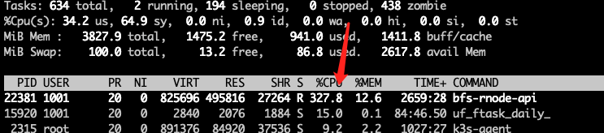
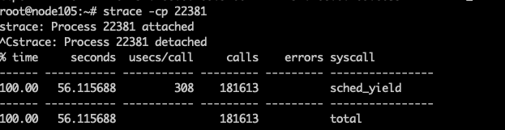
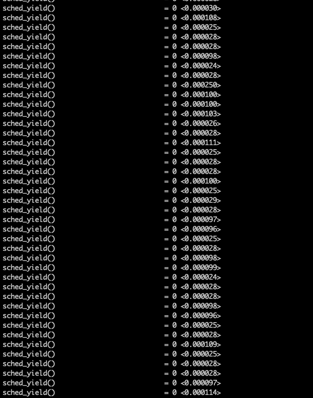
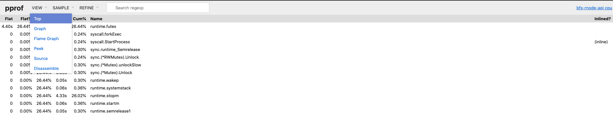
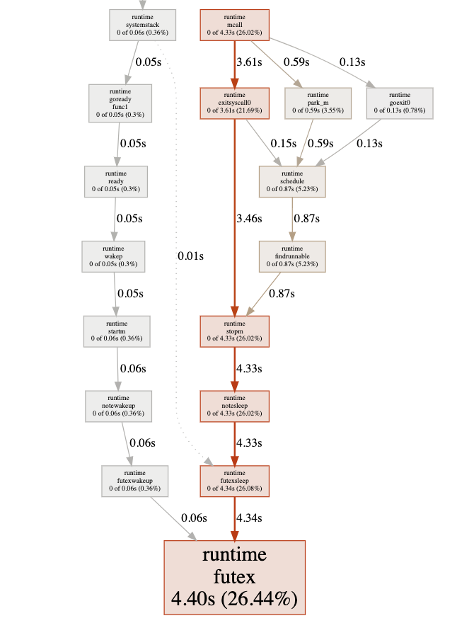
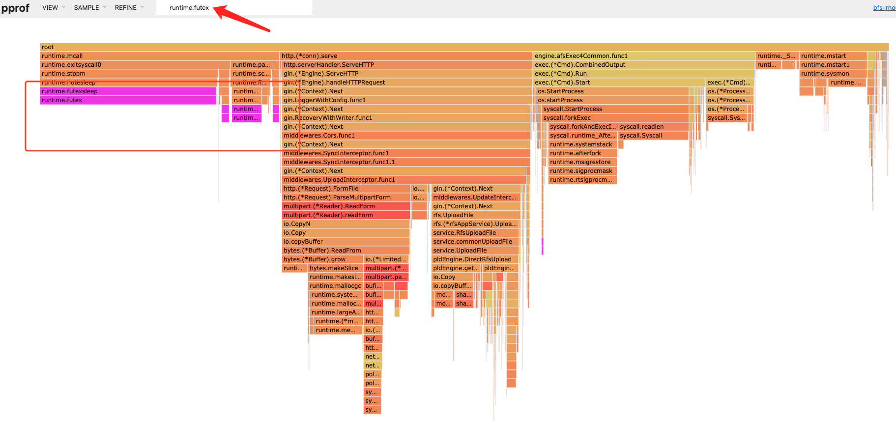
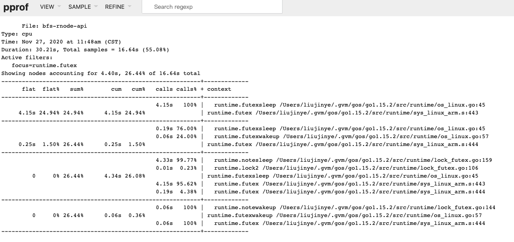

# golang 问题合集
## 内存不释放
- 问题描述

	程序在空载的时候，并没有释放多余的内存
- top

		top - 12:03:25 up 9 days, 21:42,  2 users,  load average: 1.09, 1.17, 1.10
		Tasks: 507 total,   1 running, 187 sleeping,   0 stopped, 319 zombie
		%Cpu(s):  5.6 us,  8.2 sy,  0.0 ni, 86.1 id,  0.1 wa,  0.0 hi,  0.1 si,  0.0 st
		MiB Mem :   3827.9 total,    627.4 free,   1880.7 used,   1319.8 buff/cache
		MiB Swap:    100.0 total,     54.2 free,     45.8 used.   3036.9 avail Mem
		
		  PID USER      PR  NI    VIRT    RES    SHR S  %CPU  %MEM     TIME+ COMMAND
		30076 1001      20   0 2039360   1.5g  27856 S   0.0  39.6  31:38.91 bfs-rnode-api
- 使用 go pprof 查询，发现程序占用很低，只有 15MB

		go tool pprof -inuse_space http://192.168.0.108:5144/debug/pprof/heap		(pprof) top 10
		Showing nodes accounting for 20472.07kB, 100% of 20472.07kB total
		Showing top 10 nodes out of 31
		      flat  flat%   sum%        cum   cum%
		15330.15kB 74.88% 74.88% 15330.15kB 74.88%  golang.org/x/net/webdav.(*memFile).Write
		 4097.37kB 20.01% 94.90%  4097.37kB 20.01%  github.com/syndtr/goleveldb/leveldb/memdb.New
		  532.26kB  2.60% 97.50%   532.26kB  2.60%  github.com/syndtr/goleveldb/leveldb/journal.NewWriter (inline)
		  512.28kB  2.50%   100%   512.28kB  2.50%  runtime.allocm
		         0     0%   100%  4629.63kB 22.61%  bfs-rnode-api/db/leveldb.List
		         0     0%   100%  4629.63kB 22.61%  bfs-rnode-api/db/leveldb.OpenDb
		         0     0%   100%  4629.63kB 22.61%  bfs-rnode-api/db/leveldb.getDb (inline)
		         0     0%   100%  4629.63kB 22.61%  bfs-rnode-api/service/task.ExpiredTimeScheduleJob.func1
		         0     0%   100%  4629.63kB 22.61%  bfs-rnode-api/service/task.deferredExpiredTask
		         0     0%   100%  4629.63kB 22.61%  github.com/robfig/cron/v3.(*Cron).startJob.func1
		         
## 程序空闲 CPU 占用过多
- 问题描述

	程序运行了一段未知的时间（数分钟至数小时），然后CPU变为100％，再也没有恢复正常
- 分析
	- top

		
	- 使用  go pprof 查询

			% go tool pprof -http=:1234 http://192.168.0.105:5144/debug/pprof/profile?seconds=10
			Fetching profile over HTTP from http://192.168.0.105:5144/debug/pprof/profile?seconds=10
			http://192.168.0.105:5144/debug/pprof/profile?seconds=10: Get http://192.168.0.105:5144/debug/pprof/profile?seconds=10: net/http: timeout awaiting response headers
	- 使用 strace 查询步骤
		- `strace -cp <PID>`

						
			 
		- `strace -T -e <syscall> -p <PID>`

			 

- 查询问题

	看似是一个 golang 的 bug
	
	- https://github.com/golang/go/issues/38023
	- https://github.com/golang/go/issues/38051
		
## 程序 cpu 效率低
- 问题描述

	程序运行效率异常低下
- 分析
	-  `top`

		查找问题程序进程 ID
	- 使用 strace 跟踪
		- `strace -cp <PID>`

				# strace -cp 9805
				strace: Process 9805 attached
				^Cstrace: Process 9805 detached
				% time     seconds  usecs/call     calls    errors syscall
				------ ----------- ----------- --------- --------- ----------------
				 84.28   32.649329      261194       125        63 futex
				  5.13    1.987257        6515       305        23 read
				  3.96    1.532289      117868        13           waitid
				  2.06    0.799300       79930        10           clone
				  1.85    0.717327       59777        12           wait4
				  1.64    0.635864        1215       523           rt_sigreturn
				  0.44    0.172092         370       465           clock_gettime
				  0.18    0.069568        2318        30           rt_sigprocmask
				  0.15    0.057642         914        63           close
				  0.12    0.045939        4593        10         4 fstatat64
				  0.08    0.031998         405        79           write
				  0.03    0.011289         389        29           fcntl
				  0.02    0.007437         929         8           epoll_wait
				  0.02    0.007113         148        48        16 epoll_ctl
				  0.01    0.004741         395        12           setsockopt
				  0.01    0.003807        3807         1           fsync
				  0.01    0.003530         588         6           sched_yield
				  0.00    0.001593         106        15           pipe2
				  0.00    0.000574          71         8           openat
				  0.00    0.000166          55         3           accept4
				  0.00    0.000163          54         3           getsockname
				  0.00    0.000127          12        10           getpid
				  0.00    0.000078          39         2           nanosleep
				  0.00    0.000016          16         1           setitimer
				------ ----------- ----------- --------- --------- ----------------
				100.00   38.739239                  1781       106 total
			- 这个调用占用 cpu 84% 的时间
		
					% time     seconds  usecs/call     calls    errors syscall
					------ ----------- ----------- --------- --------- ----------------
					84.28   32.649329      261194       125        63 futex
		- 查询  `-e futex`

				# strace -T -e futex -p 9805
				strace: Process 9805 attached
				--- SIGURG {si_signo=SIGURG, si_code=SI_TKILL, si_pid=1, si_uid=1001} ---
				futex(0x1d73314, FUTEX_WAIT_PRIVATE, 0, NULL) = ? ERESTARTSYS (To be restarted if SA_RESTART is set) <0.027471>
				--- SIGCHLD {si_signo=SIGCHLD, si_code=CLD_EXITED, si_pid=4687, si_uid=1001, si_status=0, si_utime=0, si_stime=6} ---
				--- SIGCHLD {si_signo=SIGCHLD, si_code=CLD_EXITED, si_pid=4692, si_uid=1001, si_status=0, si_utime=0, si_stime=5} ---
				futex(0x1d73314, FUTEX_WAIT_PRIVATE, 0, NULL) = 0 <0.113084>
				--- SIGURG {si_signo=SIGURG, si_code=SI_TKILL, si_pid=1, si_uid=1001} ---
				--- SIGURG {si_signo=SIGURG, si_code=SI_TKILL, si_pid=1, si_uid=1001} ---
				--- SIGURG {si_signo=SIGURG, si_code=SI_TKILL, si_pid=1, si_uid=1001} ---
				--- SIGURG {si_signo=SIGURG, si_code=SI_TKILL, si_pid=1, si_uid=1001} ---
				--- SIGURG {si_signo=SIGURG, si_code=SI_TKILL, si_pid=1, si_uid=1001} ---
				--- SIGURG {si_signo=SIGURG, si_code=SI_TKILL, si_pid=1, si_uid=1001} ---
				--- SIGURG {si_signo=SIGURG, si_code=SI_TKILL, si_pid=1, si_uid=1001} ---
				--- SIGURG {si_signo=SIGURG, si_code=SI_TKILL, si_pid=1, si_uid=1001} ---
				--- SIGURG {si_signo=SIGURG, si_code=SI_TKILL, si_pid=1, si_uid=1001} ---
				--- SIGURG {si_signo=SIGURG, si_code=SI_TKILL, si_pid=1, si_uid=1001} ---
				--- SIGURG {si_signo=SIGURG, si_code=SI_TKILL, si_pid=1, si_uid=1001} ---
				--- SIGURG {si_signo=SIGURG, si_code=SI_TKILL, si_pid=1, si_uid=1001} ---
				--- SIGURG {si_signo=SIGURG, si_code=SI_TKILL, si_pid=1, si_uid=1001} ---
				--- SIGURG {si_signo=SIGURG, si_code=SI_TKILL, si_pid=1, si_uid=1001} ---
				futex(0x1d73314, FUTEX_WAIT_PRIVATE, 0, NULL) = 0 <0.010874>
				futex(0x1d73314, FUTEX_WAIT_PRIVATE, 0, NULL) = 0 <0.005689>
				--- SIGCHLD {si_signo=SIGCHLD, si_code=CLD_EXITED, si_pid=4717, si_uid=1001, si_status=0, si_utime=0, si_stime=8} ---
				--- SIGURG {si_signo=SIGURG, si_code=SI_TKILL, si_pid=1, si_uid=1001} ---
				--- SIGCHLD {si_signo=SIGCHLD, si_code=CLD_EXITED, si_pid=4722, si_uid=1001, si_status=0, si_utime=0, si_stime=5} ---
				futex(0x1d73314, FUTEX_WAIT_PRIVATE, 0, NULL) = 0 <0.000259>
				--- SIGURG {si_signo=SIGURG, si_code=SI_TKILL, si_pid=1, si_uid=1001} ---
				--- SIGURG {si_signo=SIGURG, si_code=SI_TKILL, si_pid=1, si_uid=1001} ---
				--- SIGURG {si_signo=SIGURG, si_code=SI_TKILL, si_pid=1, si_uid=1001} ---
				--- SIGURG {si_signo=SIGURG, si_code=SI_TKILL, si_pid=1, si_uid=1001} ---
				--- SIGURG {si_signo=SIGURG, si_code=SI_TKILL, si_pid=1, si_uid=1001} ---
				--- SIGURG {si_signo=SIGURG, si_code=SI_TKILL, si_pid=1, si_uid=1001} ---
				--- SIGURG {si_signo=SIGURG, si_code=SI_TKILL, si_pid=1, si_uid=1001} ---
				--- SIGURG {si_signo=SIGURG, si_code=SI_TKILL, si_pid=1, si_uid=1001} ---
				--- SIGCHLD {si_signo=SIGCHLD, si_code=CLD_EXITED, si_pid=4729, si_uid=1001, si_status=0, si_utime=0, si_stime=5} ---
				--- SIGCHLD {si_signo=SIGCHLD, si_code=CLD_EXITED, si_pid=4750, si_uid=1001, si_status=0, si_utime=1, si_stime=6} ---
				futex(0x1d73314, FUTEX_WAIT_PRIVATE, 0, NULL) = 0 <0.000805>
				futex(0x1d73314, FUTEX_WAIT_PRIVATE, 0, NULL) = -1 EAGAIN (Resource temporarily unavailable) <0.000048>
				futex(0x1d73314, FUTEX_WAIT_PRIVATE, 0, NULL) = 0 <0.000057>
				--- SIGURG {si_signo=SIGURG, si_code=SI_TKILL, si_pid=1, si_uid=1001} ---
				--- SIGURG {si_signo=SIGURG, si_code=SI_TKILL, si_pid=1, si_uid=1001} ---
				--- SIGURG {si_signo=SIGURG, si_code=SI_TKILL, si_pid=1, si_uid=1001} ---
				--- SIGURG {si_signo=SIGURG, si_code=SI_TKILL, si_pid=1, si_uid=1001} ---
				--- SIGURG {si_signo=SIGURG, si_code=SI_TKILL, si_pid=1, si_uid=1001} ---
				--- SIGURG {si_signo=SIGURG, si_code=SI_TKILL, si_pid=1, si_uid=1001} ---
				--- SIGURG {si_signo=SIGURG, si_code=SI_TKILL, si_pid=1, si_uid=1001} ---
				--- SIGURG {si_signo=SIGURG, si_code=SI_TKILL, si_pid=1, si_uid=1001} ---
				--- SIGURG {si_signo=SIGURG, si_code=SI_TKILL, si_pid=1, si_uid=1001} ---
				--- SIGURG {si_signo=SIGURG, si_code=SI_TKILL, si_pid=1, si_uid=1001} ---
				--- SIGURG {si_signo=SIGURG, si_code=SI_TKILL, si_pid=1, si_uid=1001} ---
				--- SIGURG {si_signo=SIGURG, si_code=SI_TKILL, si_pid=1, si_uid=1001} ---
				--- SIGURG {si_signo=SIGURG, si_code=SI_TKILL, si_pid=1, si_uid=1001} ---
				--- SIGURG {si_signo=SIGURG, si_code=SI_TKILL, si_pid=1, si_uid=1001} ---
				--- SIGURG {si_signo=SIGURG, si_code=SI_TKILL, si_pid=1, si_uid=1001} ---
				--- SIGURG {si_signo=SIGURG, si_code=SI_TKILL, si_pid=1, si_uid=1001} ---
				--- SIGURG {si_signo=SIGURG, si_code=SI_TKILL, si_pid=1, si_uid=1001} ---
				--- SIGURG {si_signo=SIGURG, si_code=SI_TKILL, si_pid=1, si_uid=1001} ---
				--- SIGURG {si_signo=SIGURG, si_code=SI_TKILL, si_pid=1, si_uid=1001} ---
				--- SIGURG {si_signo=SIGURG, si_code=SI_TKILL, si_pid=1, si_uid=1001} ---
				--- SIGURG {si_signo=SIGURG, si_code=SI_TKILL, si_pid=1, si_uid=1001} ---
				--- SIGURG {si_signo=SIGURG, si_code=SI_TKILL, si_pid=1, si_uid=1001} ---
				--- SIGURG {si_signo=SIGURG, si_code=SI_TKILL, si_pid=1, si_uid=1001} ---
				futex(0x3d0830c, FUTEX_WAKE_PRIVATE, 1) = 1 <0.000063>
				--- SIGURG {si_signo=SIGURG, si_code=SI_TKILL, si_pid=1, si_uid=1001} ---
				--- SIGURG {si_signo=SIGURG, si_code=SI_TKILL, si_pid=1, si_uid=1001} ---
				--- SIGURG {si_signo=SIGURG, si_code=SI_TKILL, si_pid=1, si_uid=1001} ---
				--- SIGURG {si_signo=SIGURG, si_code=SI_TKILL, si_pid=1, si_uid=1001} ---
				--- SIGURG {si_signo=SIGURG, si_code=SI_TKILL, si_pid=1, si_uid=1001} ---
				--- SIGURG {si_signo=SIGURG, si_code=SI_TKILL, si_pid=1, si_uid=1001} ---
				--- SIGURG {si_signo=SIGURG, si_code=SI_TKILL, si_pid=1, si_uid=1001} ---
				--- SIGURG {si_signo=SIGURG, si_code=SI_TKILL, si_pid=1, si_uid=1001} ---
				--- SIGURG {si_signo=SIGURG, si_code=SI_TKILL, si_pid=1, si_uid=1001} ---
				--- SIGURG {si_signo=SIGURG, si_code=SI_TKILL, si_pid=1, si_uid=1001} ---
				--- SIGURG {si_signo=SIGURG, si_code=SI_TKILL, si_pid=1, si_uid=1001} ---
				futex(0x3d089cc, FUTEX_WAKE_PRIVATE, 1) = 1 <0.000118>
				--- SIGURG {si_signo=SIGURG, si_code=SI_TKILL, si_pid=1, si_uid=1001} ---
				--- SIGURG {si_signo=SIGURG, si_code=SI_TKILL, si_pid=1, si_uid=1001} ---
				futex(0x383108c, FUTEX_WAKE_PRIVATE, 1) = 1 <0.000053>
				futex(0x1d73314, FUTEX_WAIT_PRIVATE, 0, NULL) = ? ERESTARTSYS (To be restarted if SA_RESTART is set) <0.000942>
				--- SIGCHLD {si_signo=SIGCHLD, si_code=CLD_EXITED, si_pid=4802, si_uid=1001, si_status=0, si_utime=0, si_stime=8} ---
				futex(0x1d73314, FUTEX_WAIT_PRIVATE, 0, NULL) = ? ERESTARTSYS (To be restarted if SA_RESTART is set) <0.074330>
				--- SIGCHLD {si_signo=SIGCHLD, si_code=CLD_EXITED, si_pid=4813, si_uid=1001, si_status=0, si_utime=0, si_stime=6} ---
				futex(0x1d73314, FUTEX_WAIT_PRIVATE, 0, NULL) = 0 <0.069891>
				futex(0x1d73314, FUTEX_WAIT_PRIVATE, 0, NULL) = 0 <0.053696>
				--- SIGURG {si_signo=SIGURG, si_code=SI_TKILL, si_pid=1, si_uid=1001} ---
				--- SIGURG {si_signo=SIGURG, si_code=SI_TKILL, si_pid=1, si_uid=1001} ---
				futex(0x1d73314, FUTEX_WAIT_PRIVATE, 0, NULL) = 0 <0.000771>
				futex(0x1d73314, FUTEX_WAIT_PRIVATE, 0, NULL) = 0 <0.046415>
				--- SIGURG {si_signo=SIGURG, si_code=SI_TKILL, si_pid=1, si_uid=1001} ---
				--- SIGURG {si_signo=SIGURG, si_code=SI_TKILL, si_pid=1, si_uid=1001} ---
				--- SIGURG {si_signo=SIGURG, si_code=SI_TKILL, si_pid=1, si_uid=1001} ---
				futex(0x1d73314, FUTEX_WAIT_PRIVATE, 0, NULL) = 0 <0.001028>
				futex(0x1d73314, FUTEX_WAIT_PRIVATE, 0, NULL) = 0 <0.007667>
				futex(0x1d73314, FUTEX_WAIT_PRIVATE, 0, NULL) = 0 <0.001866>
				futex(0x1d73314, FUTEX_WAIT_PRIVATE, 0, NULL) = 0 <0.261866>
				--- SIGURG {si_signo=SIGURG, si_code=SI_TKILL, si_pid=1, si_uid=1001} ---
				--- SIGURG {si_signo=SIGURG, si_code=SI_TKILL, si_pid=1, si_uid=1001} ---
				--- SIGURG {si_signo=SIGURG, si_code=SI_TKILL, si_pid=1, si_uid=1001} ---
				--- SIGURG {si_signo=SIGURG, si_code=SI_TKILL, si_pid=1, si_uid=1001} ---
				--- SIGURG {si_signo=SIGURG, si_code=SI_TKILL, si_pid=1, si_uid=1001} ---
				--- SIGURG {si_signo=SIGURG, si_code=SI_TKILL, si_pid=1, si_uid=1001} ---
				--- SIGURG {si_signo=SIGURG, si_code=SI_TKILL, si_pid=1, si_uid=1001} ---
				--- SIGURG {si_signo=SIGURG, si_code=SI_TKILL, si_pid=1, si_uid=1001} ---
				--- SIGURG {si_signo=SIGURG, si_code=SI_TKILL, si_pid=1, si_uid=1001} ---
				--- SIGURG {si_signo=SIGURG, si_code=SI_TKILL, si_pid=1, si_uid=1001} ---
				--- SIGURG {si_signo=SIGURG, si_code=SI_TKILL, si_pid=1, si_uid=1001} ---
				--- SIGURG {si_signo=SIGURG, si_code=SI_TKILL, si_pid=1, si_uid=1001} ---
				--- SIGURG {si_signo=SIGURG, si_code=SI_TKILL, si_pid=1, si_uid=1001} ---
				--- SIGURG {si_signo=SIGURG, si_code=SI_TKILL, si_pid=1, si_uid=1001} ---
				--- SIGURG {si_signo=SIGURG, si_code=SI_TKILL, si_pid=1, si_uid=1001} ---
				--- SIGURG {si_signo=SIGURG, si_code=SI_TKILL, si_pid=1, si_uid=1001} ---
				--- SIGURG {si_signo=SIGURG, si_code=SI_TKILL, si_pid=1, si_uid=1001} ---
				--- SIGURG {si_signo=SIGURG, si_code=SI_TKILL, si_pid=1, si_uid=1001} ---
				--- SIGURG {si_signo=SIGURG, si_code=SI_TKILL, si_pid=1, si_uid=1001} ---
				--- SIGURG {si_signo=SIGURG, si_code=SI_TKILL, si_pid=1, si_uid=1001} ---
				--- SIGURG {si_signo=SIGURG, si_code=SI_TKILL, si_pid=1, si_uid=1001} ---
				--- SIGURG {si_signo=SIGURG, si_code=SI_TKILL, si_pid=1, si_uid=1001} ---
				--- SIGURG {si_signo=SIGURG, si_code=SI_TKILL, si_pid=1, si_uid=1001} ---
				--- SIGCHLD {si_signo=SIGCHLD, si_code=CLD_EXITED, si_pid=4919, si_uid=1001, si_status=0, si_utime=1, si_stime=4} ---
				futex(0x1d73314, FUTEX_WAIT_PRIVATE, 0, NULL) = 0 <0.037926>
				--- SIGCHLD {si_signo=SIGCHLD, si_code=CLD_EXITED, si_pid=4929, si_uid=1001, si_status=0, si_utime=0, si_stime=5} ---
				--- SIGURG {si_signo=SIGURG, si_code=SI_TKILL, si_pid=1, si_uid=1001} ---
				--- SIGURG {si_signo=SIGURG, si_code=SI_TKILL, si_pid=1, si_uid=1001} ---
				--- SIGURG {si_signo=SIGURG, si_code=SI_TKILL, si_pid=1, si_uid=1001} ---
				--- SIGURG {si_signo=SIGURG, si_code=SI_TKILL, si_pid=1, si_uid=1001} ---
				--- SIGURG {si_signo=SIGURG, si_code=SI_TKILL, si_pid=1, si_uid=1001} ---
				--- SIGURG {si_signo=SIGURG, si_code=SI_TKILL, si_pid=1, si_uid=1001} ---
				--- SIGURG {si_signo=SIGURG, si_code=SI_TKILL, si_pid=1, si_uid=1001} ---
				--- SIGURG {si_signo=SIGURG, si_code=SI_TKILL, si_pid=1, si_uid=1001} ---
				--- SIGURG {si_signo=SIGURG, si_code=SI_TKILL, si_pid=1, si_uid=1001} ---
				--- SIGURG {si_signo=SIGURG, si_code=SI_TKILL, si_pid=1, si_uid=1001} ---
				--- SIGURG {si_signo=SIGURG, si_code=SI_TKILL, si_pid=1, si_uid=1001} ---
				--- SIGURG {si_signo=SIGURG, si_code=SI_TKILL, si_pid=1, si_uid=1001} ---
				--- SIGURG {si_signo=SIGURG, si_code=SI_TKILL, si_pid=1, si_uid=1001} ---
				--- SIGURG {si_signo=SIGURG, si_code=SI_TKILL, si_pid=1, si_uid=1001} ---
				--- SIGURG {si_signo=SIGURG, si_code=SI_TKILL, si_pid=1, si_uid=1001} ---
				--- SIGURG {si_signo=SIGURG, si_code=SI_TKILL, si_pid=1, si_uid=1001} ---
				--- SIGURG {si_signo=SIGURG, si_code=SI_TKILL, si_pid=1, si_uid=1001} ---
				--- SIGURG {si_signo=SIGURG, si_code=SI_TKILL, si_pid=1, si_uid=1001} ---
				--- SIGURG {si_signo=SIGURG, si_code=SI_TKILL, si_pid=1, si_uid=1001} ---
				--- SIGURG {si_signo=SIGURG, si_code=SI_TKILL, si_pid=1, si_uid=1001} ---
				--- SIGURG {si_signo=SIGURG, si_code=SI_TKILL, si_pid=1, si_uid=1001} ---
				--- SIGCHLD {si_signo=SIGCHLD, si_code=CLD_EXITED, si_pid=4937, si_uid=1001, si_status=0, si_utime=0, si_stime=5} ---
				--- SIGCHLD {si_signo=SIGCHLD, si_code=CLD_EXITED, si_pid=4948, si_uid=1001, si_status=0, si_utime=0, si_stime=6} ---
				futex(0x1d73314, FUTEX_WAIT_PRIVATE, 0, NULL) = 0 <0.001320>
				futex(0x1d73314, FUTEX_WAIT_PRIVATE, 0, NULL) = 0 <0.041176>
				futex(0x1d73314, FUTEX_WAIT_PRIVATE, 0, NULL) = 0 <0.208252>
				futex(0x1d73314, FUTEX_WAIT_PRIVATE, 0, NULL) = 0 <0.000334>
				futex(0x1d73314, FUTEX_WAIT_PRIVATE, 0, NULL) = ? ERESTARTSYS (To be restarted if SA_RESTART is set) <0.059167>
				futex(0x1d73314, FUTEX_WAIT_PRIVATE, 0, NULL) = 0 <0.001183>
				futex(0x1d73314, FUTEX_WAIT_PRIVATE, 0, NULL) = 0 <0.051551>
				futex(0x1d73314, FUTEX_WAIT_PRIVATE, 0, NULL) = 0 <0.041172>
				--- SIGURG {si_signo=SIGURG, si_code=SI_TKILL, si_pid=1, si_uid=1001} ---
				--- SIGURG {si_signo=SIGURG, si_code=SI_TKILL, si_pid=1, si_uid=1001} ---
				--- SIGURG {si_signo=SIGURG, si_code=SI_TKILL, si_pid=1, si_uid=1001} ---
				--- SIGURG {si_signo=SIGURG, si_code=SI_TKILL, si_pid=1, si_uid=1001} ---
				--- SIGURG {si_signo=SIGURG, si_code=SI_TKILL, si_pid=1, si_uid=1001} ---
				--- SIGURG {si_signo=SIGURG, si_code=SI_TKILL, si_pid=1, si_uid=1001} ---
				--- SIGURG {si_signo=SIGURG, si_code=SI_TKILL, si_pid=1, si_uid=1001} ---
				--- SIGURG {si_signo=SIGURG, si_code=SI_TKILL, si_pid=1, si_uid=1001} ---
				--- SIGURG {si_signo=SIGURG, si_code=SI_TKILL, si_pid=1, si_uid=1001} ---
				--- SIGURG {si_signo=SIGURG, si_code=SI_TKILL, si_pid=1, si_uid=1001} ---
				--- SIGURG {si_signo=SIGURG, si_code=SI_TKILL, si_pid=1, si_uid=1001} ---
				--- SIGURG {si_signo=SIGURG, si_code=SI_TKILL, si_pid=1, si_uid=1001} ---
				--- SIGURG {si_signo=SIGURG, si_code=SI_TKILL, si_pid=1, si_uid=1001} ---
				--- SIGURG {si_signo=SIGURG, si_code=SI_TKILL, si_pid=1, si_uid=1001} ---
				--- SIGURG {si_signo=SIGURG, si_code=SI_TKILL, si_pid=1, si_uid=1001} ---
				--- SIGURG {si_signo=SIGURG, si_code=SI_TKILL, si_pid=1, si_uid=1001} ---
				--- SIGURG {si_signo=SIGURG, si_code=SI_TKILL, si_pid=1, si_uid=1001} ---
				--- SIGURG {si_signo=SIGURG, si_code=SI_TKILL, si_pid=1, si_uid=1001} ---
				--- SIGURG {si_signo=SIGURG, si_code=SI_TKILL, si_pid=1, si_uid=1001} ---
				--- SIGURG {si_signo=SIGURG, si_code=SI_TKILL, si_pid=1, si_uid=1001} ---
				futex(0x1d73314, FUTEX_WAIT_PRIVATE, 0, NULL) = 0 <0.000315>
				futex(0x1d73314, FUTEX_WAIT_PRIVATE, 0, NULL) = 0 <0.002798>
				futex(0x1d73314, FUTEX_WAIT_PRIVATE, 0, NULL) = 0 <0.012525>
				--- SIGURG {si_signo=SIGURG, si_code=SI_TKILL, si_pid=1, si_uid=1001} ---
				--- SIGURG {si_signo=SIGURG, si_code=SI_TKILL, si_pid=1, si_uid=1001} ---
				futex(0x1d73314, FUTEX_WAIT_PRIVATE, 0, NULL) = 0 <0.120517>
				futex(0x1d73314, FUTEX_WAIT_PRIVATE, 0, NULL) = 0 <0.038112>
				futex(0x383108c, FUTEX_WAKE_PRIVATE, 1) = 1 <0.000353>
				--- SIGURG {si_signo=SIGURG, si_code=SI_TKILL, si_pid=1, si_uid=1001} ---
				--- SIGURG {si_signo=SIGURG, si_code=SI_TKILL, si_pid=1, si_uid=1001} ---
				--- SIGURG {si_signo=SIGURG, si_code=SI_TKILL, si_pid=1, si_uid=1001} ---
				--- SIGCHLD {si_signo=SIGCHLD, si_code=CLD_EXITED, si_pid=5137, si_uid=1001, si_status=0, si_utime=0, si_stime=6} ---
				--- SIGURG {si_signo=SIGURG, si_code=SI_TKILL, si_pid=1, si_uid=1001} ---
				--- SIGURG {si_signo=SIGURG, si_code=SI_TKILL, si_pid=1, si_uid=1001} ---
				--- SIGURG {si_signo=SIGURG, si_code=SI_TKILL, si_pid=1, si_uid=1001} ---
				--- SIGURG {si_signo=SIGURG, si_code=SI_TKILL, si_pid=1, si_uid=1001} ---
				--- SIGURG {si_signo=SIGURG, si_code=SI_TKILL, si_pid=1, si_uid=1001} ---
				futex(0x1d73314, FUTEX_WAIT_PRIVATE, 0, NULL) = ? ERESTARTSYS (To be restarted if SA_RESTART is set) <0.259726>
				futex(0x1d73314, FUTEX_WAIT_PRIVATE, 0, NULL) = 0 <0.091953>
				futex(0x1d73314, FUTEX_WAIT_PRIVATE, 0, NULL) = 0 <0.009421>
				futex(0x1d73314, FUTEX_WAIT_PRIVATE, 0, NULL) = -1 EAGAIN (Resource temporarily unavailable) <0.000956>
				futex(0x1d73314, FUTEX_WAIT_PRIVATE, 0, NULL) = 0 <0.016449>
				futex(0x1d73314, FUTEX_WAIT_PRIVATE, 0, NULL) = 0 <0.013520>
				--- SIGURG {si_signo=SIGURG, si_code=SI_TKILL, si_pid=1, si_uid=1001} ---
				--- SIGURG {si_signo=SIGURG, si_code=SI_TKILL, si_pid=1, si_uid=1001} ---
				--- SIGURG {si_signo=SIGURG, si_code=SI_TKILL, si_pid=1, si_uid=1001} ---
				--- SIGURG {si_signo=SIGURG, si_code=SI_TKILL, si_pid=1, si_uid=1001} ---
				--- SIGURG {si_signo=SIGURG, si_code=SI_TKILL, si_pid=1, si_uid=1001} ---
				--- SIGURG {si_signo=SIGURG, si_code=SI_TKILL, si_pid=1, si_uid=1001} ---
				--- SIGURG {si_signo=SIGURG, si_code=SI_TKILL, si_pid=1, si_uid=1001} ---
				--- SIGURG {si_signo=SIGURG, si_code=SI_TKILL, si_pid=1, si_uid=1001} ---
				--- SIGURG {si_signo=SIGURG, si_code=SI_TKILL, si_pid=1, si_uid=1001} ---
				--- SIGURG {si_signo=SIGURG, si_code=SI_TKILL, si_pid=1, si_uid=1001} ---
				--- SIGURG {si_signo=SIGURG, si_code=SI_TKILL, si_pid=1, si_uid=1001} ---
				futex(0x1d73314, FUTEX_WAIT_PRIVATE, 0, NULL) = 0 <0.137151>
				futex(0x3d0830c, FUTEX_WAKE_PRIVATE, 1) = 1 <0.000044>
				futex(0x1d73314, FUTEX_WAIT_PRIVATE, 0, NULL) = -1 EAGAIN (Resource temporarily unavailable) <0.000037>
				futex(0x1d73314, FUTEX_WAIT_PRIVATE, 0, NULL) = 0 <0.018567>
				futex(0x1d73314, FUTEX_WAIT_PRIVATE, 0, NULL) = 0 <0.011968>
				futex(0x383108c, FUTEX_WAKE_PRIVATE, 1) = 1 <0.000030>
				futex(0x1d73314, FUTEX_WAIT_PRIVATE, 0, NULL) = 0 <0.008387>
				futex(0x383108c, FUTEX_WAKE_PRIVATE, 1) = 1 <0.000029>
				futex(0x1d73314, FUTEX_WAIT_PRIVATE, 0, NULL) = 0 <0.054968>
				--- SIGURG {si_signo=SIGURG, si_code=SI_TKILL, si_pid=1, si_uid=1001} ---
				--- SIGURG {si_signo=SIGURG, si_code=SI_TKILL, si_pid=1, si_uid=1001} ---
				--- SIGURG {si_signo=SIGURG, si_code=SI_TKILL, si_pid=1, si_uid=1001} ---
				--- SIGCHLD {si_signo=SIGCHLD, si_code=CLD_EXITED, si_pid=5359, si_uid=1001, si_status=0, si_utime=0, si_stime=7} ---
				futex(0x1d73314, FUTEX_WAIT_PRIVATE, 0, NULL) = 0 <0.000755>
				futex(0x1d73314, FUTEX_WAIT_PRIVATE, 0, NULL) = 0 <0.175286>
				futex(0x1d73314, FUTEX_WAIT_PRIVATE, 0, NULL) = 0 <0.000351>
				futex(0x1d73314, FUTEX_WAIT_PRIVATE, 0, NULL) = 0 <0.011458>
				futex(0x1d73314, FUTEX_WAIT_PRIVATE, 0, NULL) = 0 <0.537003>
				--- SIGURG {si_signo=SIGURG, si_code=SI_TKILL, si_pid=1, si_uid=1001} ---
				--- SIGCHLD {si_signo=SIGCHLD, si_code=CLD_EXITED, si_pid=5462, si_uid=1001, si_status=0, si_utime=0, si_stime=5} ---
				--- SIGURG {si_signo=SIGURG, si_code=SI_TKILL, si_pid=1, si_uid=1001} ---
				futex(0x1d73314, FUTEX_WAIT_PRIVATE, 0, NULL) = 0 <0.243080>
				--- SIGURG {si_signo=SIGURG, si_code=SI_TKILL, si_pid=1, si_uid=1001} ---
				--- SIGURG {si_signo=SIGURG, si_code=SI_TKILL, si_pid=1, si_uid=1001} ---
				--- SIGURG {si_signo=SIGURG, si_code=SI_TKILL, si_pid=1, si_uid=1001} ---
				--- SIGURG {si_signo=SIGURG, si_code=SI_TKILL, si_pid=1, si_uid=1001} ---
				--- SIGURG {si_signo=SIGURG, si_code=SI_TKILL, si_pid=1, si_uid=1001} ---
				--- SIGURG {si_signo=SIGURG, si_code=SI_TKILL, si_pid=1, si_uid=1001} ---
				--- SIGURG {si_signo=SIGURG, si_code=SI_TKILL, si_pid=1, si_uid=1001} ---
				--- SIGURG {si_signo=SIGURG, si_code=SI_TKILL, si_pid=1, si_uid=1001} ---
				--- SIGURG {si_signo=SIGURG, si_code=SI_TKILL, si_pid=1, si_uid=1001} ---
				--- SIGURG {si_signo=SIGURG, si_code=SI_TKILL, si_pid=1, si_uid=1001} ---
				--- SIGURG {si_signo=SIGURG, si_code=SI_TKILL, si_pid=1, si_uid=1001} ---
				--- SIGURG {si_signo=SIGURG, si_code=SI_TKILL, si_pid=1, si_uid=1001} ---
				--- SIGURG {si_signo=SIGURG, si_code=SI_TKILL, si_pid=1, si_uid=1001} ---
				--- SIGURG {si_signo=SIGURG, si_code=SI_TKILL, si_pid=1, si_uid=1001} ---
				--- SIGCHLD {si_signo=SIGCHLD, si_code=CLD_EXITED, si_pid=5518, si_uid=1001, si_status=0, si_utime=0, si_stime=6} ---
				futex(0x1d73314, FUTEX_WAIT_PRIVATE, 0, NULL) = -1 EAGAIN (Resource temporarily unavailable) <0.000232>
				--- SIGURG {si_signo=SIGURG, si_code=SI_TKILL, si_pid=1, si_uid=1001} ---
				--- SIGCHLD {si_signo=SIGCHLD, si_code=CLD_EXITED, si_pid=5550, si_uid=1001, si_status=0, si_utime=1, si_stime=5} ---
				futex(0x1d73314, FUTEX_WAIT_PRIVATE, 0, NULL) = 0 <0.121615>
				--- SIGURG {si_signo=SIGURG, si_code=SI_TKILL, si_pid=1, si_uid=1001} ---
				--- SIGURG {si_signo=SIGURG, si_code=SI_TKILL, si_pid=1, si_uid=1001} ---
				--- SIGURG {si_signo=SIGURG, si_code=SI_TKILL, si_pid=1, si_uid=1001} ---
				--- SIGURG {si_signo=SIGURG, si_code=SI_TKILL, si_pid=1, si_uid=1001} ---
				--- SIGURG {si_signo=SIGURG, si_code=SI_TKILL, si_pid=1, si_uid=1001} ---
				--- SIGURG {si_signo=SIGURG, si_code=SI_TKILL, si_pid=1, si_uid=1001} ---
				--- SIGURG {si_signo=SIGURG, si_code=SI_TKILL, si_pid=1, si_uid=1001} ---
				--- SIGURG {si_signo=SIGURG, si_code=SI_TKILL, si_pid=1, si_uid=1001} ---
				--- SIGURG {si_signo=SIGURG, si_code=SI_TKILL, si_pid=1, si_uid=1001} ---
				--- SIGURG {si_signo=SIGURG, si_code=SI_TKILL, si_pid=1, si_uid=1001} ---
				--- SIGURG {si_signo=SIGURG, si_code=SI_TKILL, si_pid=1, si_uid=1001} ---
				--- SIGURG {si_signo=SIGURG, si_code=SI_TKILL, si_pid=1, si_uid=1001} ---
				--- SIGURG {si_signo=SIGURG, si_code=SI_TKILL, si_pid=1, si_uid=1001} ---
				--- SIGURG {si_signo=SIGURG, si_code=SI_TKILL, si_pid=1, si_uid=1001} ---
				--- SIGURG {si_signo=SIGURG, si_code=SI_TKILL, si_pid=1, si_uid=1001} ---
				futex(0x1d73314, FUTEX_WAIT_PRIVATE, 0, NULL) = -1 EAGAIN (Resource temporarily unavailable) <0.000235>
				--- SIGCHLD {si_signo=SIGCHLD, si_code=CLD_EXITED, si_pid=5608, si_uid=1001, si_status=0, si_utime=0, si_stime=7} ---
				futex(0x1d73314, FUTEX_WAIT_PRIVATE, 0, NULL) = 0 <0.001314>
				--- SIGURG {si_signo=SIGURG, si_code=SI_TKILL, si_pid=1, si_uid=1001} ---
				--- SIGURG {si_signo=SIGURG, si_code=SI_TKILL, si_pid=1, si_uid=1001} ---
				--- SIGURG {si_signo=SIGURG, si_code=SI_TKILL, si_pid=1, si_uid=1001} ---
				--- SIGURG {si_signo=SIGURG, si_code=SI_TKILL, si_pid=1, si_uid=1001} ---
				--- SIGURG {si_signo=SIGURG, si_code=SI_TKILL, si_pid=1, si_uid=1001} ---
				--- SIGURG {si_signo=SIGURG, si_code=SI_TKILL, si_pid=1, si_uid=1001} ---
				--- SIGURG {si_signo=SIGURG, si_code=SI_TKILL, si_pid=1, si_uid=1001} ---
				--- SIGURG {si_signo=SIGURG, si_code=SI_TKILL, si_pid=1, si_uid=1001} ---
				--- SIGURG {si_signo=SIGURG, si_code=SI_TKILL, si_pid=1, si_uid=1001} ---
				--- SIGCHLD {si_signo=SIGCHLD, si_code=CLD_EXITED, si_pid=5637, si_uid=1001, si_status=0, si_utime=0, si_stime=5} ---
				futex(0x1d73314, FUTEX_WAIT_PRIVATE, 0, NULL) = 0 <0.160957>
				futex(0x1d73314, FUTEX_WAIT_PRIVATE, 0, NULL) = 0 <0.012097>
				futex(0x1d73314, FUTEX_WAIT_PRIVATE, 0, NULL^Cstrace: Process 9805 detached
				 <detached ...>			
	- 使用 pprof 查看
		- 监控

			程序运行中，生成数据，程序30秒后会自动打开游览器
			
				go tool pprof -http=:1234 http://192.168.0.105:5144/debug/pprof/profile?seconds=30
			
			- 报错

				可能因为程序异常资源占用超时
				
					http://192.168.0.105:5144/debug/pprof/profile?seconds=10: Get http://192.168.0.105:5144/debug/pprof/profile?seconds=10: net/http: timeout awaiting response headers
			- 解决

				重启正常			
		- top

			
		- 图示
			- 在 top 中选中 runtime.futex
			
					
			- 点击 view 	 -> graph

				
			- 点击 view-> flamgraph
				- 筛选 `runtime.futex`

				
		- peek

			
					
					
		
				 