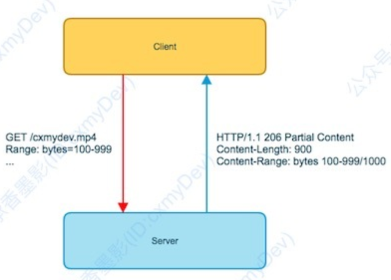
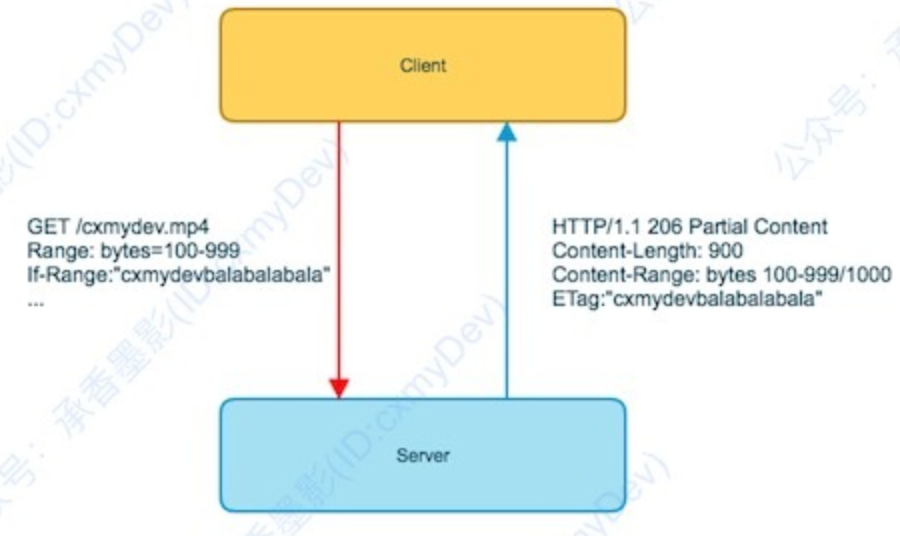
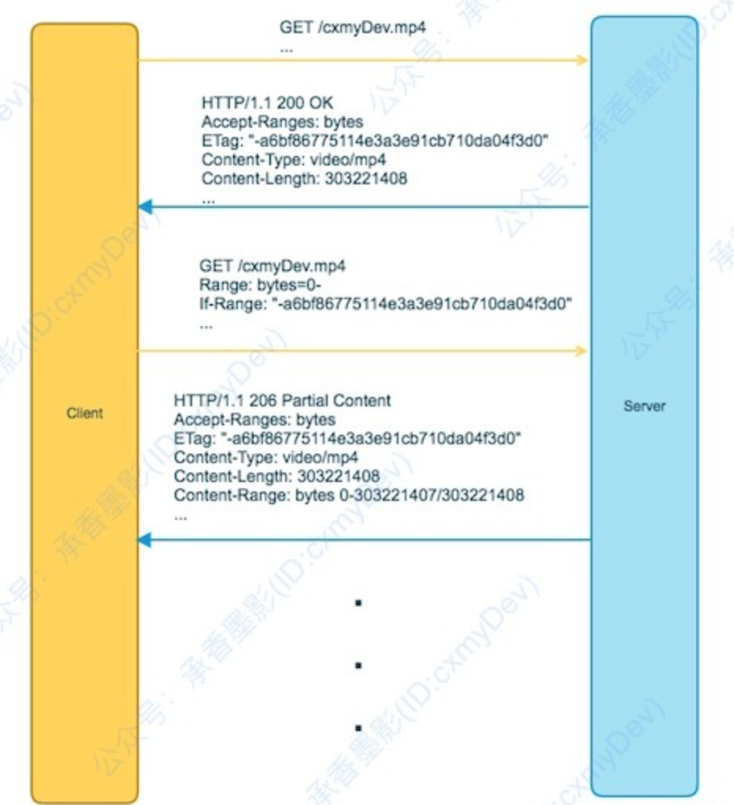
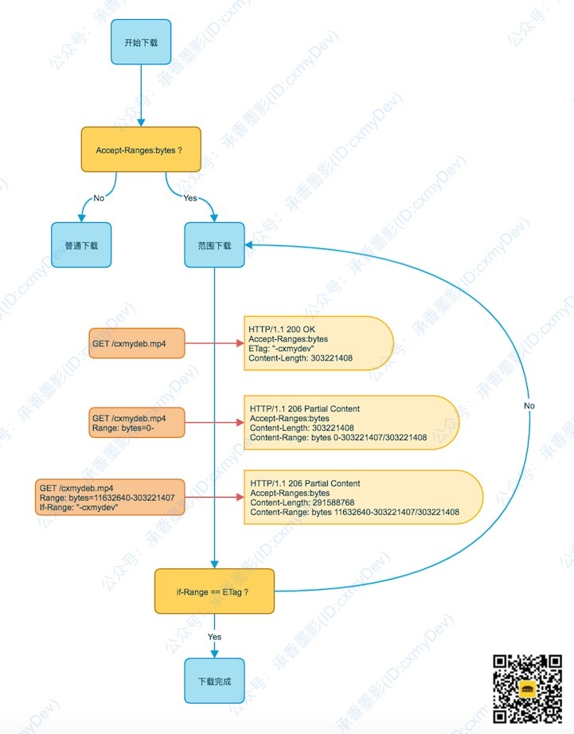

# HTTP 的范围(HTTP Range)
因为最近开发产品使用了 http 大文件，所以需要用到这块的测试, 下面是对于这块的总汇
## 协议说明
HTTP 协议在网络知识中占据了重要的地位，HTTP 协议最基础的就是请求和响应的报文，而报文又是由报文头（Header）和实体组成。大多数 HTTP 协议的使用方式，都是依赖设置不同的 HTTP 请求/响应 的 Header 来实现的。

HTTP 协议是一种无状态的“松散协议”，它不会记录不同请求的状态，并且因为它本身包含了两端（客户端和服务端），根据请求和响应来区分，它大部分的内容都只是一个建议，其实双边是可以不遵守此建议的。

http 范围请求主要是针对较大的文件的请求或者上传，可以仅操作它的某一段。

- 场景1

	主要场景是断点续传/下载，这块因为互联网网络问题，在下载文件的时候有很大几率没有传输完成就会断线或者超时，如果没有范围请求只能重头下载，但如果有范围请求就，客户端就可以重试而不需要重头下载。
- 场景2

	多线程下载，对大型文件，开启多个线程，每个线程下载其中的某一段，最后下载完成之后，在本地拼接成一个完整的文件，可以更有效的利用资源。

## HTTP 的范围请求
### 是否支持范围请求
HTTP 本身是一种无状态的“松散”协议，而在经历了很多版本的迭代之后，只在 HTTP/1.1（RFC2616） 之上，才支持范围请求。所以如果客户端或者服务端两端的某一端低于 HTTP/1.1，就不应该使用范围请求的功能。

而在 HTTP/1.1 中，很明确的声明了一个响应头部 `Access-Ranges` 来标记是否支持范围请求，它只有一个可选参数 bytes。

类似这样

	% curl -I http://xxxxx/1e005115a027980f10cc1db7-bfs.mp4
	HTTP/1.1 200 OK
	Date: Wed, 29 Apr 2020 11:31:29 GMT
	Server: Apache/2.4.6 (CentOS) PHP/5.4.16
	Last-Modified: Tue, 28 Apr 2020 01:29:45 GMT
	ETag: "7cf65c5-5a44fc43b7ac0"
	Accept-Ranges: bytes  <--- 这里
	Content-Length: 131032517
	Content-Type: video/mp4
### 使用范围请求
如果已经确定双端都支持范围请求，就可以在请求资源的时候使用它。

所有的文件最终都是存储在磁盘或者内存中的字节，对于待操作的文件可以将其以字节为单位分割。这样只需要 HTTP 支持请求该文件从 n 到 n+x 这个范围内的资源，就可以实现范围请求了。

HTTP/1.1 中定义了一个 Ranges 的请求头，来指定请求实体的范围。它的范围取值是在 `0 - Content-Length` 之间，使用 `-`分割。。

如已经下载了 1000 bytes ，想接着继续下载之后的资源内容，只要在 HTTP 请求头部，增加 `Ranges:bytes=1000-` 就可以了。

Range 还有几种不同的方式来限定范围，可以根据需要灵活定制：

1. 500-1000

	指定开始和结束的范围，一般用于多线程下载。
2. 500-

	指定开始区间，一直传递到结束。这个就比较适用于断点续传、或者在线播放等等。
3. -500

	无开始区间，只意思是需要最后 500 bytes 的内容实体。
4. 100-300,1000-3000

	指定多个范围，这种方式使用的场景很少，了解一下就好了。

HTTP 协议是一种双边协商的协议，既然请求头部已经确定是使用 Ranges 了，还有响应头部中，也需要使用 `Content-Ragne` 这个响应头来标记响应的实体内容范围。

`Content-Range` 的格式也很清晰，首先标记它的单位是 bytes 然后标记当前传递的内容实体范围和总长度。

	Content-Range: bytes 100-999/1000
	
例中，会传递 100 ~ 999 范围的内容实体，而该资源文件的总大小是 1000 bytes。并且此时的 HTTP 响应状态码为 `206 Partial Content`

- `HTTP 206 Partial Content`

	成功状态响应代码表示请求已成功，并且主体包含所请求的数据区间，该数据区间是在请求的 Range 首部指定的。

有关 206 状态码的解释可以[参考](https://developer.mozilla.org/zh-CN/docs/Web/HTTP/Status/206)

注意这里的每个 HTTP 事务中的响应头里，都是会包含 `Content-Length` 的，只是它包含的是当前范围请求响应的内容实体长度，而非此资源完整的长度。

### 资源变化
当在一些下载工具中，下载大尺寸资源的时候，偶尔中间暂停过再重新下载，可能会遇见它又重头开始下载的情况。

这看似是 HTTP 的范围请求失效了，但是实际上并不一定如此，很可能是因为请求的资源，在请求的这个过程中，发生了改变。

如下载的过程中，下载的源资源文件发生了变化，但是 URL 没有改变，此时文件长度可能已经变化了（这是非常容易发现的），极端情况下就算没有长度没有变化，再继续下载，很可能最终下载完成之后，无法将下载的内容拼接成需要的文件。

如果需要从服务器上下载某个资源，一定要预防此资源可能发生的变动。在之前讲 HTTP 缓存的时候讲到，在 HTTP 协议中，可以通过 `ETag` 或者 `Last-Modified` 来标识当前资源是否变化。

- ETag

	当前文件的一个验证令牌指纹，用于标识文件的唯一性
- Last-Modified

	标记当前文件最后被修改的时间
	
在 HTTP 的范围请求中，也可以使用这两个字段来区分分段请求的资源，是否有修改过，只需要在请求头中，将它放在 If-Range 这个请求报文头中即可。`If-Range` 使用 `ETag` 或者 `Last-Modified` 两个参数任意一个，原样填入即可。

此时，如果两次操作的都是同一个资源文件，就会继续返回 206 状态码，开始后续的操作，反之则会返回 200 状态码，表示文件发生改变，要从头下载。

需要注意的是 `If-Range` 需要和 `Range` 配合起来使用，否则会被服务端忽略

再额外提一点，如果客户端请求报文头中，对 `Range` 填入的范围错误，会返回 416 状态码。

- `HTTP 416 Range Not Satisfiable` 
	
	错误状态码意味着服务器无法处理所请求的数据区间。最常见的情况是所请求的数据区间不在文件范围之内，也就是说，Range 首部的值，虽然从语法上来说是没问题的，但是从语义上来说却没有意义。

	有关 416 状态码，可以[参考](https://developer.mozilla.org/zh-CN/docs/Web/HTTP/Status/416)

## 范围请求的例子
### 用 Chrome 播放一个适配
例中，找了一个视频的播放地址，直接在 Chrome 中进行播放。正常播放之后，再随手拖动视频进度，之后无操作让其自动播放一段时间，来看看 HTTP 的事务报文。

抽象了一下流程，如下图所示：

	
- get /cxmdev.mp4...

	客户端会首先想资源的 URL 发送请求
- http/1.1 200 ok...

	服务端返回 200 的响应码，并带有 Accept-Ranges http 头数据
- get /cxmdev.mp4... 

	客户端会去使用 Range 发送范围请求
-  http/1.1 206...

	得到的响应码就是 206，并返回对应范围的实体内容。
	
而在每次拖动进度的时候，都会去重新发送一个范围请求，依照拖动的进度来计算请求范围。此处不存在资源被修改的情况，所以不会出现重新请求下载的情况。一次资源下载其实包含了很多次的请求过程，需要站在全局的角度来看

## http 范围小结
到这里就已经把 HTTP 范围请求的整个流程都说明清楚了。

再重新整理一下关键点：

1. HTTP 范围请求，需要 HTTP/1.1 及之上支持，如果双端某一段低于此版本，则认为不支持。
2. 通过响应头中的 Accept-Ranges 来确定是否支持范围请求。
3. 通过在请求头中添加 Range 这个请求头，来指定请求的内容实体的字节范围。
4. 在响应头中，通过 Content-Range 来标识当前返回的内容实体范围，并使用 Content-Length 来标识当前返回的内容实体范围长度。
5. 在请求过程中，可以通过 If-Range 来区分资源文件是否变动，它的值来自 ETag 或者 Last-Modifled。如果资源文件有改动，会重新走下载流程。

## 使用 curl 检查是否支持 http 范围响应 
- 测试 curl 是否支持

		curl -I http://mirrors.ustc.edu.cn/debian-cd/current/amd64/iso-cd/debian-mac-10.3.0-amd64-netinst.iso
		HTTP/1.1 200 OK
		Server: openresty
		Date: Wed, 29 Apr 2020 11:00:23 GMT
		Content-Type: application/octet-stream
		Content-Length: 350224384 <- 必须有
		Last-Modified: Sat, 08 Feb 2020 13:47:06 GMT
		Connection: keep-alive
		ETag: "5e3ebbda-14e00000"
		Accept-Ranges: bytes <--有则支持 HTTP Range Request，没有或者返回为 Accept-Ranges: none 均不支持
- 按段下载测试

	可以根据自己主机的情况来制定下载大文件大小

		curl --range 0-5000 -o part1 <url>
		curl --range 5001- -o part2 <url>	
- 块合并
	- 使用 cat 
		
		将上面下载的分块合并成最终使用的文件，注意这里的分块文件是有顺序的
		
			cat part1 part2... > outputfile	
	- 使用 dd

			dd if=part1 of=outputfile bs=4M conv=notrunc oflag=append status=progress
			dd if=part2 of=outputfile bs=4M conv=notrunc oflag=append status=progress
			
		- bs=4M 表示每次读写的块大小为 4M
		- oflag=append 表示将文件追加到输出文件的末尾
		- conv=notrunc 表示不截断文件
		- status=progress 表示显示进度

## 参考
- [利用 cURL 分块下载大文件](https://butui.me/post/split-download-large-file-with-curl/)
- [How to Split and Download a Large File with cURL](https://www.maketecheasier.com/split-download-large-file-curl/)
- [HTTP 范围请求，助力断点续传、多线程下载的核心原理](https://www.cnblogs.com/plokmju/p/http_range.html)