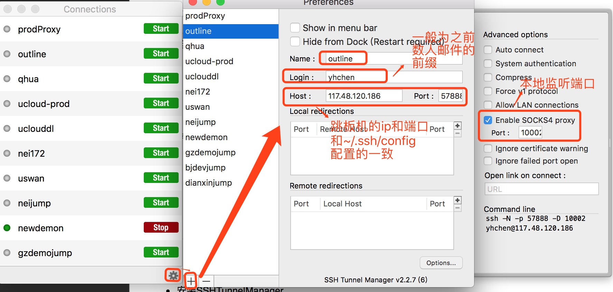
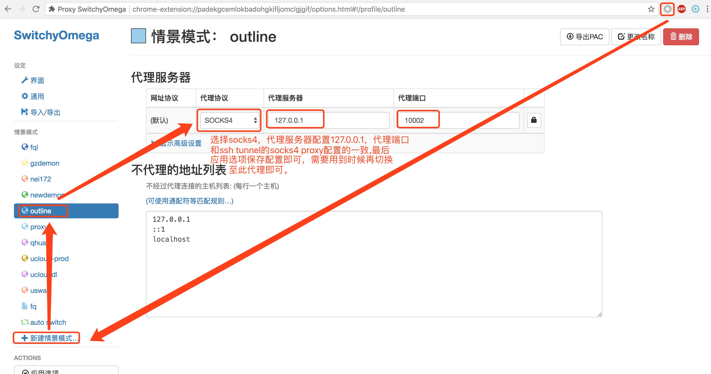

# 远程连接到公司内部进行开发配置(mac)

## 1. 配置ssh config文件

### 1. vi ~/.ssh/config    

    Host outline gongsijump 117.48.120.186
    User xxx
    HostName 117.48.120.186
    Port 57888
    IdentityFile ~/.ssh/yyy

    请将以下替换为自己的：
    User： 用户名
    IdentityFile：私钥证书文件路径(证书文件权限确保为：600)
    ssh 访问：
    ssh outline
    其中outline为Host对应项,这样就直接远程登录至跳板机，再从跳板机登录到内网服务器。
    ssh-add -K ~/.ssh/yhchen
    --- 此命令用来保存证书密码，方便后续连接，不过机器重启后需要重新执行。
    
### 2. 本地程序连接远端服务器隧道创建    

    1. 创建隧道：    
        ssh -NL 8443:192.168.1.237:8443 117.48.120.186
        
        命令解析：
        8443： 本地监听端口
        192.168.1.237:8443: 远端服务的ip:port
        117.48.120.186: 跳板机ip
    2. 本地程序连接远端服务设置举例：    
        将要连接远端的url处设置为： localhost:9999
        若涉及到域名要求的可以(举例)sudo vi /etc/hosts
        127.0.0.1 master237.dmos.dataman
        
        注意： 需要将其他相同域名的域名解析注释掉。
        
        程序连接远端的url处设置为：master237.dmos.dataman:8443
    
### 3. 浏览器访问远端服务    

+ 安装SSHTunnelManager    
    + 解压SSHTunnelManager-227.006.zip
    + 将解压出来的程序移动到访达-->应用程序
    + 配置ssh tunnel：    
        
         
        
    + 点击start按钮，提示输入密码，输入私有证书解压密码(解压密码也是私有证书密码),注意点击密码框下保存密码。
+ 按SwitchyOmega.crx chrome插件    
    + 将SwitchyOmega.crx 拖至chrome就提示你是否安装，点击继续即可。
    + 配置SwitchyOmega
       
           
       
### 4. mac全局代理设置    
    
    点击网络图标-->打开网络偏好设置-->选中当前连接的网络-->高级-->代理--> 勾选SOCKS-->ip
    填写127.0.0.1，端口填写和ssh tunnel中设置的端口一致-->点击"好"按钮即可。     
       
附：引用windows设置隧道    
[windows设置隧道](https://www.vandyke.com/support/tips/socksproxy.html)    

[SSH隧道应用, 突破网络限制](https://www.jianshu.com/p/90c10a242199)
        