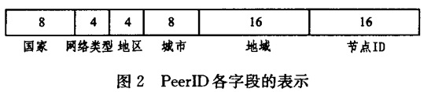
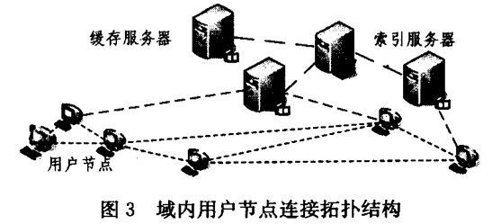
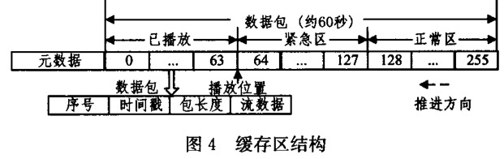
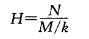
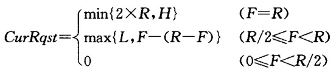
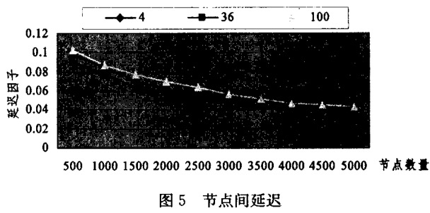
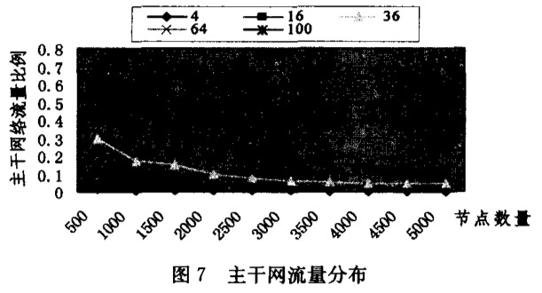
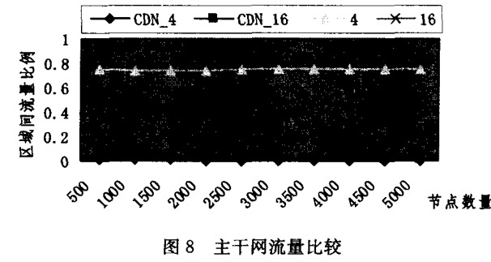

# 基于 P2P 和 CDN 的流媒体直播系统的设计与实现
## 简介
互联网传统流媒体主要采用的是 C/S 模式

- 由于传输流媒体占用带宽巨大
- 持续时间长
- 而服务器可利用的网络资源是有限的
- 加之其处理能力
- 缓存大小
- I/O 速率等因素的影响

在大量用户获取数据的时候，导致整个系统出现网络瓶颈。为了改善网络效率，IP 组播技术加入了 TCP/IP 协议，通过路由器复制数据包，避免数据在链路上的冗余传输，获取更高的网络效率。然而，由于协议的复杂性以及拥塞控制、可靠性管理不足，导致应用依然使用其困难。

CDN 是用户能够从位于本地的服务器上获取流媒体数据，从而提高用户访问性能，并减轻主干网络流量的同时，增加系统容量，但由于收到整个系统依然受制于 C/S 架构因素，代理服务器能够提供的能力依然有限，同时增加代理服务器数量的建设成本昂贵。

P2P 流媒体分发系统虽然成本低、扩展性好，但由于 P2P 系统的开放性、匿名性、节点自身不稳定性，导致提供服务的质量 (Qos) 严重下降，更有甚者采用恶意节点，滥用 P2P 资源传播广告、病毒等文件来危害其他节点，同时 P2P 应用的盛行带来网络流量风暴、监管缺失、涉及版权等问题。

但因为 CDN 和 P2P 技术有互补性，如果在 CDN 技术引入 P2P 技术必然是一种更完善的系统。

## 系统结构设计
系统核心设计思想是在 CDN 网络中引入 P2P 自制域，由单个或者若干缓存服务器于覆盖用户节点作为对等节点，共同构成一个 P2P 自治域。

- 在域内利用 P2P 技术实现资源共享，而自治域之间的用户节点不发生流量交换。
- 将 CDN 的缓存服务器以 P2P 的方式组织，利用 P2P 的目录服务和多点传输能力，实现 CDN Cache 设备之间的内容交换，提升 CDN 的内容分发能力。
- 同时将 CDN 的管理机制和服务能力引入 P2P 网络，形成以 CDN  为可靠的内容核心，以 P2P 为服务边缘的架构

通过这种架构，可以在不增加 CDN 成本的同时，有效提升服务能力。

### 架构拓扑

如图拓扑，网络架构采用3层结构，分为

- 控制层

	控制层部署路由选择服务器以及服务管理中心，实现对系统进行统一管理
- 中心层

	中心层部署缓存服务器和索引服务器，实现内容分发和传输
- 应用层

	应用层实现 p2p 的内容服务、视频发布于观看等功能，并通过缓存服务器和索引服务器进行管理、控制、服务保障。
	
### 服务类型名称
- 路由选择服务器
	- 接受用户节点下载或上传流媒体的请求，返回其所在区域内的索引服务器地址。
	- 接受索引服务器获取流媒体的请求，返回给具有相应数据的其他域缓存服务器的列表
- 索引服务器

	索引当前本域内具有流媒体数据的在线用户节点，管理节点的位置信息，为节点加入时提供域内节点的信息列表。当接收到节点的请求，
	
	- 如果所请求的流媒体数据已经在本域中的某台缓存服务器中存在，则记录下该节点信息，返回其所需要的节点信息列表，并将请求转发到相应的缓存服务器为其提供服务。	
	- 如果域内的缓存服务器没有所需要的数据，则访问路由选择服务器，获取其他域内的缓存服务器中的相应缓存服务器信息列表，根据当前状况决定启动某台负载低的缓存服务器并将列表传递给它，使缓存服务器间的利用 P2P 方式链接获取数据。
- 缓存服务器

	从用户节点或其他域的缓存服务器获取流媒体数据，作为域内数据源为普通用户提供服务。在普通节点看来，缓存服务器也是 P2P 网络中的一个对等节点。
- 用户节点

	从域内其他节点获取流媒体数据，或发布流媒体数据到缓存服务器。
	
	- 获取数据
		- 首先访问路由选择服务，获取 PeerID 和域内索引服务器地址。
		- 获取数据时，通过索引服务器获得域内节点信息列表，节点间互连以 P2P 方式共享下载数据
	- 发布数据时
		- 请求域内索引服务器分配一台缓存服务器，与其建立连接并上传数据 

## 关键技术与策略
### 节点管理策略
节点管理最基本的思想是提高覆盖网络与底层物理网络的匹配程度，使其上层网络拓扑和节点之间的物理网络拓扑尽量匹配，达到在流媒体网络中相临近节点在物理网络中也临近，从而有效的减少媒体数据传输的负载压力和端对端传输延迟。

- 节点标示(PeerID)的生成

	在网络中，节点对之间的信息是巨大的，难以存储和计算，但可以根据 ISP、自治域或地址前缀等信息加以划分成不相交的区域，每个区域都为1组 IP 地址的集合。 Peer ID 数据结构如下，采用 56 位2进制表示，利用固定的位来分别物理信息。如国家、网络类型、地区等
	
	 
	
	路由选择服务器中包含一个 IP 地址到地里位置信息转换数据库，该数据库中包含 IP 地址的地理信息，其中，网络类型根据国内的七大运营商进行划分，节点 ID 字段随机生成。当系统中有新节点请求加入时，为请求节点生成一个 PeerID 以唯一标识此节点。
- 用户节点加入

	根据 SCAMP 协议，为了保证节点拥有网络局部视图同覆盖网络规模保持一致性增长，可以计算出维护的覆盖网络局部视图大小
	
		ViewNum=(c+1)*logN
	- ViewNum

		节点局部视图大小
	- N

		为覆盖网络节点总数
	- c

		参数
		
	当用户节点加入网络时，从索引服务器获取域网络规模大小，此后，当索引服务器发现节点数量发生一定规模变化时，将网络规模信息通知所有节点，使各个节点能够动态调整局部视图大小。
	
	用户节点管理的节点分为
	
	- 成员节点

		成员节点只保存节点相关主机信息，不建立网络连接，成员列表由用户加入网络时访问索引服务器获得的节点列表进行初始化。
	- 伙伴节点

		伙伴列表时成员列表的子集，选取其中与子集 PeerID 接近的节点建立连接并进行数据交互。
	
	用户节点加入网络时，
	
	- 首先访问路由选择服务器，获取域内索引服务器的地址和自己的 PeerID
	- 然后向索引服务器发出请求，获得域内缓存有相应流媒体数据的节点列表，加入到成员列表中。

	系统运行中，成员列表会动态更新，
	
	- 用户节点通过自己向伙伴节点周期性发出请求以获取新节点信息并将其加入成员列表。
	- 同时，定期向索引服务器发送心跳报文保活信息

	用户节点从成员列表中选取节点加入伙伴列表时，
	
	- 先从与自己 PeerID 中国家、网络类型、地区、城市、地域字段完全相同的节点中选取
	- 如果数量不够，再从国家、网络类型、地区、城市完全相同的节点中选取
	- 以此类推

	向伙伴列表中的节点发起连接请求，节点之间建立连接就形成了一个网络拓扑结构
	
	
- 用户节点的退出
	- 正常退出

		当一个用户节点正常退出时，会向伙伴节点发送退出请求，收到请求的节点将其信息从自己的伙伴节点列表和成员列表中删除。
	- 异常退出	
		
		同时，节点周期性的向伙伴节点发送心跳消息，这样如果用户节点没有正常退出或没有接到退出请求，则连接节点在一段时间内没有收到心跳信息后，就会把其从自己的伙伴列表和成员列表中删除。
- 节点信息的动态更新

	当收到其他节点的连接请求时，如果连接数小于下面公式计算的阈值时，则接收连接请求，建立伙伴关系，将其信息加入伙伴列表和成员列表。如果超过阈值，则将自己的伙伴列表发送给请求节点。
	
		Limit=BW/S-1
	- Limit

		设置为阈值
	- BW

		节点可用带宽
	- S

		流媒体数据的编码率
	
	周期性的对节点当前成员列表进行监控，
	
	- 如果发现当前成员少于 3logN (N 为域内节点数量)，则向当前的伙伴发送请求，获取其伙伴列表信息，添加到自己的成员列表当中
	- 当发现当前成员大于 3logN 时，会淘汰部分节点，会淘汰部分节点，使成员数量基本保持在 3LogN

	同时定期根据伙伴的性能来动态替换表现不佳的节点，并从成员列表中随机选取相应的节点作为新的伙伴，使其伙伴数量基本保持在 logN ，其中伙伴性能评估指标由下面公式得出
	
		PW=((1-p)*upload+p*download)/durtime
	- PW(Peer Weight) 

		节点权重
	- upload

		为上传数据包的数量
	- downlad

		下载数据包数量
	- durTime

		经历时间
	- p

		为节点所占权重(0<p<1)
	
	分数低的伙伴将被淘汰替换，每次淘汰的数量为  
	
		k*curNo
	- curNo

		为现在伙伴列表中的节点数量
	- k

		为参数， 0<k<1/2
		
	由于保持连接的节点数量波动比率为 k，可以保证媒体播放连续性不为节点的替换所影响

### 缓冲区管理
- 数据表示

	系统基于 Gossip 协议的 P2P 流媒体网络，数据传输方向不固定，节点从一个或多个伙伴节点中获取自己所需要的数据，同时向伙伴节点提供自己拥有的数据。这样节点之间根据各自缓存数据情况进行数据交换，流媒体数据分割成相同时间片段，用一个缓存映射来表示节点中是否拥有某个片段数据，节点之间交换数据时通过检查彼此的缓存映射来进行。
	
	每个节点都要缓存一定大小的数据，
	
	- 缓存的数据越多数据传输的可靠性越强
	- 但服务器的延迟也会越大。
	
	同时，缓存区分为若干个数据分段，分别向伙伴节点索取，
	
	- 片段越小，描述片段的头部信息占用数据的比重越大，导致节点间链路开销增大
	- 相反，若片段太大，就无法分配较小的数据量，降低了获取数据的及时性。

	缓存区用一个滑动窗口来存储 256 个数据分段，每个分段大约是 200ms 数据片，用 256 个 bit 的 Bitmap 表示， 256*200ms= 51.2s 数据， 
	
	- bit 值为1表示该数据节点拥有此段，
	- 0表示没有

	缓存区存储固定时间长度的数据片，占用的空间大小呈动态变化，为保证系统中表示的数据同步，用两个字节来记录 bitmap 中第一个片段的序号，每个片段序号是发布节点、发布数据时打的标记。
- 缓冲区的组织

	缓冲区组织结构如下图，每个片段是 200 ms 的数据量，整个窗口每 200ms 向前滑动一次， Bitmap 中被移除缓存区的那个 bit 被认为是`过期` 数据，本地不用再缓存它，新移入的那个 bit 认为是自己现在还没有而期望缓存的数据，最初的时候，缓存映射为0，随后它将从伙伴节点获取若干片段把相应位置为1
	
		
	
	当缓存映射最前面有 ４８个连续的1时，就启动滑动机制，这样每个bit 在本地缓冲区至少有 ４８×２００ｍｓ= 10ｓ的存活时间，在它的存活期内,可以给其伙伴节点提供该 bit 的数据 ,同时任何一个 bit 至少有 10ｓ的时间用来从网络中搜索该 bit 的数据并获取它 。在 每个Gossip 周 期 ，节点会将本地的 Bitmap 信息状况写入一张表内，记录了每个片段在该节点保存的情况 ，节点之间就是通过这张表的传递来相互感知对方　 数据存储的情况 。

### 数据调度
- 请求数据片的数量

	节点根据自己的伙伴节点的 Bitmap,从伙伴获取所需要的数据，向伙伴节点请求数据片的数量是依据邻居节点上次完成的情况周期性动态计算的，如下公式
	
		
	
	- M

		为伙伴节点数量
	- N
	
		需要数据片的总数
	- H 

		每次请求数据片的上限
	- k

		参数(1<k<M)

		
		
	- R 为上次请求的数据
	- F 为上次完成的数据
	- CurRqst 为本次将请求的数目
	- H 为每次请求数据的上限
	- L 为每次请求数据片的下限(1<L<H)
- 选择数据块

	为了保证数据的及时性，把缓冲窗口分为3个部分，如下图。
	
	- 第一个部分

		当播放位置之前的数据共其他节点索取
	- 第二个部分

		之后 1/3 为紧急区，区中数据必须立即获取
	- 第三个部分
	
		此后为正常区，依据最少优先的选取策略请求。
		
	首先选择伙伴节点数目最少的片，如果遇到多个片相同的伙伴节点数目就随机选择，这样使得数量少的分段能够多，从而在网络中达到平衡。
	
## 仿真实验
采用基于周期驱动的 p2p 网络仿真系统 Peersim 模拟大规模网络环境，实现了覆盖网络建立和节点之间数据交换协议。
### 数据传输延迟
数据传输延迟是流媒体数据在伙伴节点间交换数据时，从一个节点到另一个节点的延迟，该性能反应出系统中数据传输的实时性，延迟越小的系统的实时性越高，节点能及时获取请求数据，系统的Qos 就能保证。

如图所示，

- 纵坐标节点延迟因子来表示数据传输延迟，这是在模拟实际物理网络中节点间数据传输的平均时间得到的数值，延迟因子越小，系统延迟也就用越小，实时性也就越高。
- 横坐标表示节点数量，模拟分别在 4、16、36、64、100 个物理网络区域中，分布从 500到 5000个节点的情况。从图中可以清晰看到，每个区域内节点数目多少对于数据传输延迟影响并不大，随着网络节点数量的增加，节点的数据传输延迟会明显减少，这是由于覆盖网络中观看的节点伙伴节点优先选取和自己地理相近的节点，网络中节点的规模增大，网络距离就会越近，数据传输延迟也就越小。

与未采用 CDN 的基于 Gossip 协议的 P2P 流媒体分发系统进行比较，当在具有 16 个区域的物理网络环境中，

- 采用 CDN 的 P2P 系统具有 500 个节点时，延迟因子只有 0.1 左右，而随着节点数量的增加逐步减少
- 而未采用 CDN 的 P2P 系统始终在 0.4-0.5 之间	 

### 区域间流量
系统根据底层物理网络划分为若干个区域，区域以骨干网络为边界，而节点之间的数据传输的流量

- 一部分就分布于区域内部
- 一部分分布于区域之间，区域间的流量就构成了骨干网上的流量。当骨干网的带宽资源占用过大时，会影响整个网络系统的性能，因此要尽量减少主干网络带宽占用。	

每个节点需要观看流媒体，就需要占用编码率的带宽 m,整个系统需要  `m*N` 的带宽(N 为节点)，骨干网带宽占用可以通过统计单位时间内，区域间数据传输量得到，从而可以计算骨干网占用总共需要的带宽比例，比例越小，占用骨干网络带宽越小，网络性能越好。

相同数量节点分布在越多的物理区域，区间流量就会越大，同时，随网络节点数量增加，区域间的流量比例会减少，最后达到一个平衡。

				  

 采用 CDN 的 P2P 系统根据地层物理网络划分为若干个区域的选点策略，与未采用相比，当节点分布在 4，16 个区域时，区域间的流量明显减少，大大缓解了骨干网络带宽压力
 
 
 
## 结论
P2P 技术充分利用了用户闲置的上行带宽，提高了流媒体传输效率，这样大大降低了边缘服务器的压力，可以通过减少边缘服务器，提供更多的业务量为更多的用户服务，降低了原 CDN 模式的成本。通过对网络进行 P2P 自制域划分，将 P2P 流量严格限制在同一个区域内，避免骨干网络的流量无需性和风暴，可以实现对用户的监控、流量管理，增强了网络的可管理性。

采用分布式系统结构，可以方便的为自制域添加缓存服务器，实现域扩容，同时只要在路由选择服务器中简单的更改域划分设置，即可增加新域，轻松的满足整个系统的扩容需求。因为 p2p 和 cdn 网络技术的互补性，本方案将 p2p 的扩展性和 cdn 的稳定性结合在一起，设计实现了一种高效、扩展性高、稳定性强、可管理的可靠流媒体直播系统。

用户节点和缓存服务器中缓存替换算法、缓存服务器间的协作机制、安全认证等内容需要进一步研究。			
	

## 替换
覆盖网络  overlay 网络

## 参考
[基于 P2P 和 CDN 的流媒体直播系统的设计与实现](http://www.jsjkx.com/CN/article/openArticlePDF.jsp?id=7382)