# SwitchyOmega 配置详细图文教程
## 安装并设置 shadowsocks
本软件主要目的是为了建立翻墙管道

- 解压缩后放到自己使用的目录
- win
	- 制作快捷方式

		进入解压目录，设置 shadowsocks.exe 为快捷目标
	- 将快捷方式推拽到自己习惯使用的地方，比如桌面
- 启动
	- 临时设置全域模式

			注意这个模式是将所有流量全域代理翻墙，会大量浪费翻墙带宽，仅初期安装翻墙软件和测试使用 

		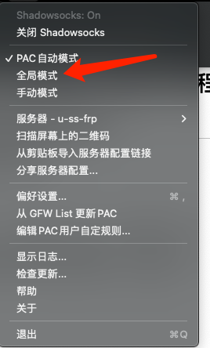
	- 检查服务
		- 检查服务启动情况
		- 检查服务器设置情况 

		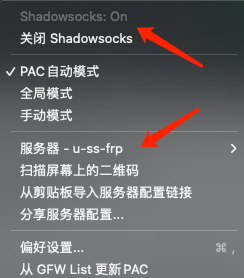
- 打开游览器测试翻墙

	打开 chrome，输入  www.google.com,打开即可翻墙
	
## 安装 SwitchyOmega 流量切割器
本软件主要目的是为了将流量分流，将不需要翻墙流量与需要翻墙流量分开，降低翻墙带宽损耗
### 安装
- Chrome

	Chrome 应用商店：https://chrome.google.com/webstore/detail/padekgcemlokbadohgkifijomclgjgif

	- 点击安装
	
		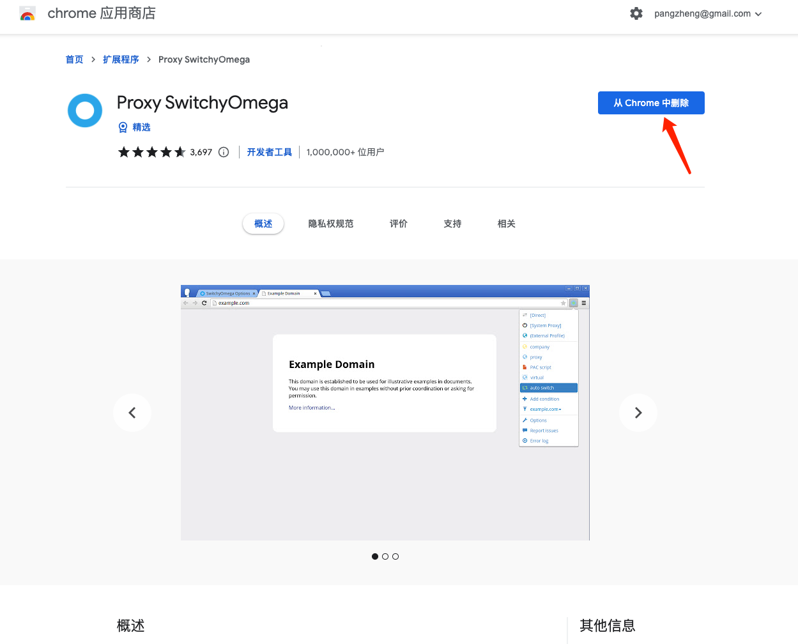	
- Firefox

	Mozilla Add-Ons: https://addons.mozilla.org/en-US/firefox/addon/switchyomega/

### 配置
- 设置插件显示

	点击游览器插件管理，点击显示 SwitchyOmega

	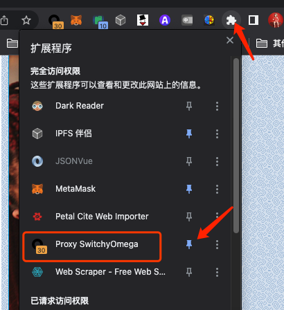	
- 点击插件，进入设置

	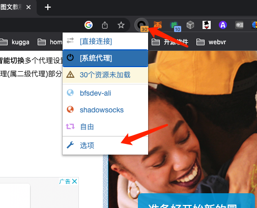	
- 设置代理服务

	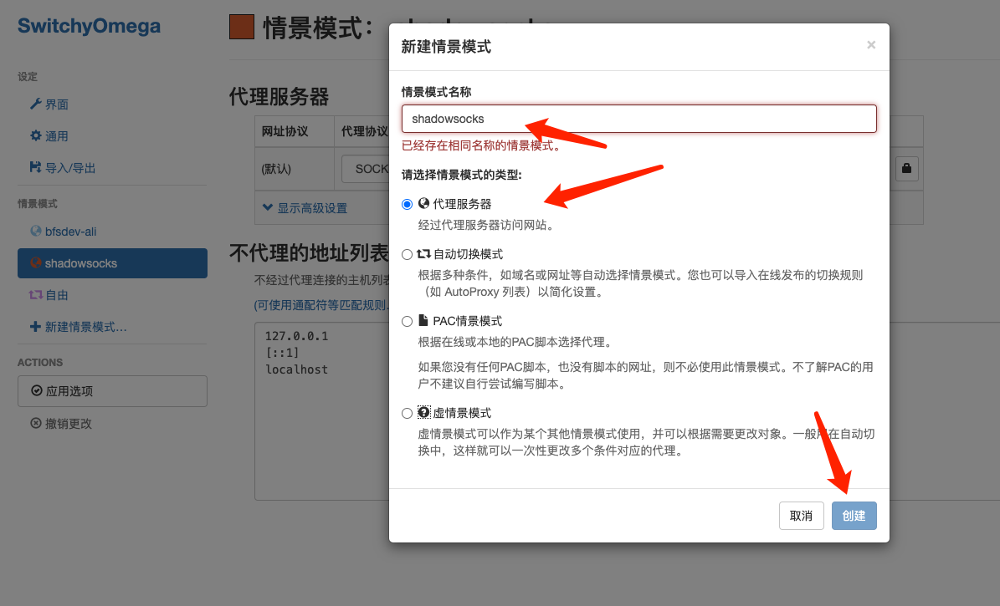	
	
	- 详细配置		

		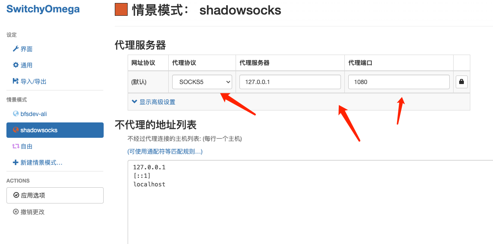	
- 设置自由切换模式

	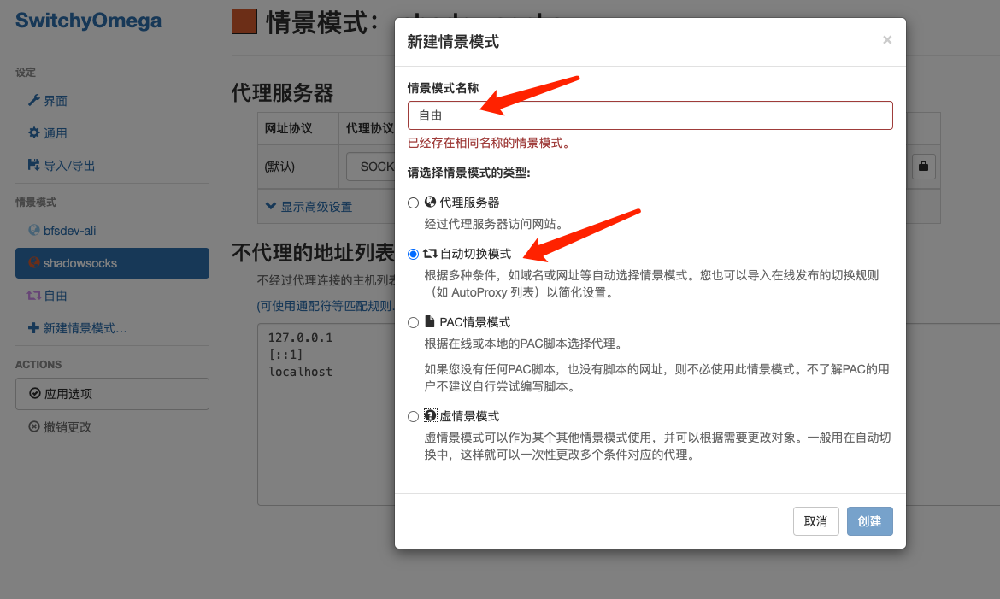	
	
	- 导入在线规则列表

		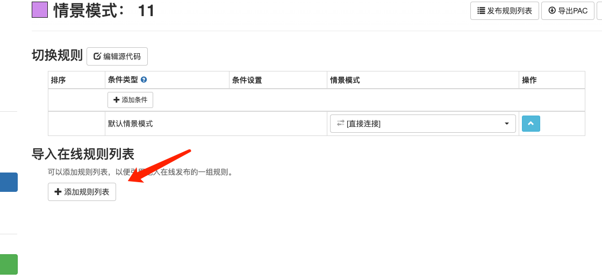
	- 设置规则列表地址

			https://raw.githubusercontent.com/gfwlist/gfwlist/master/gfwlist.txt
			
		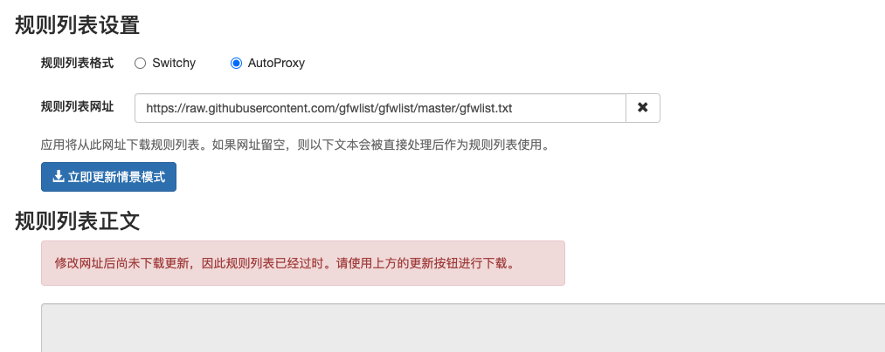	
	- 在线更新

		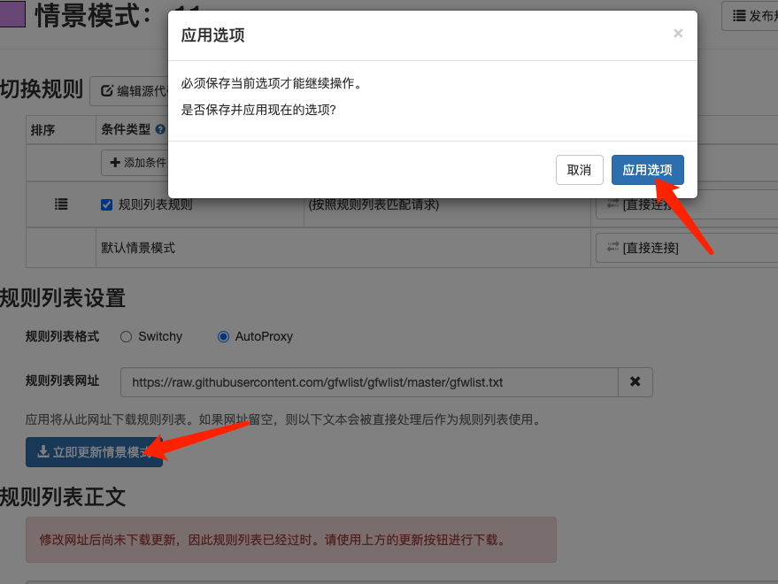
	- 规则列表更新成功

		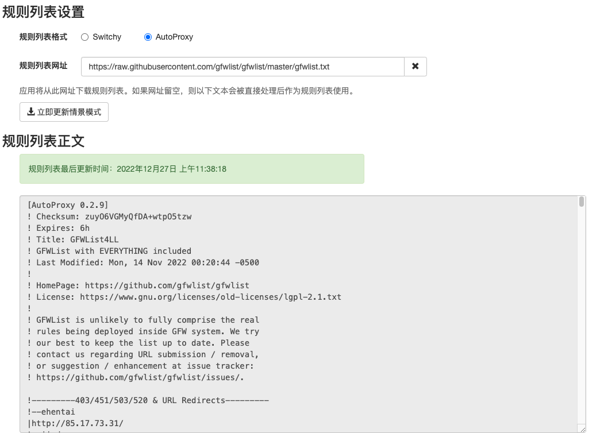
	- 设置规则列表规则

		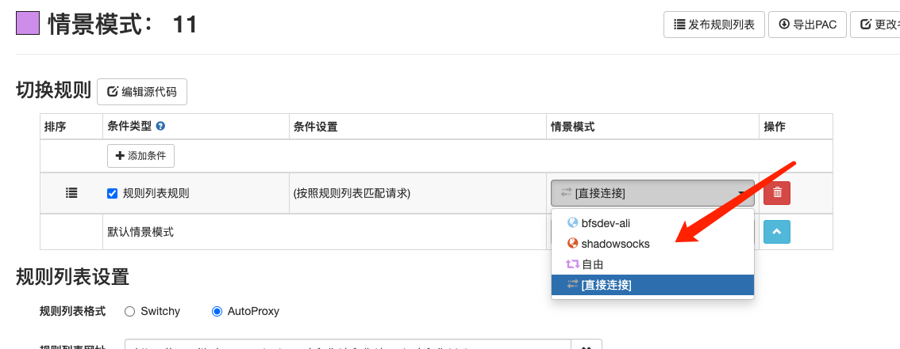
	- 保存应用选项

		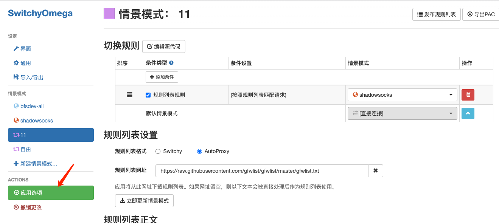
	- 切换 SwitchyOmega 为自由切换模式

		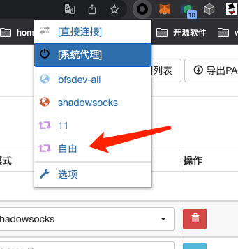
	- 关闭 ss 全域模式

			这步非常重要

		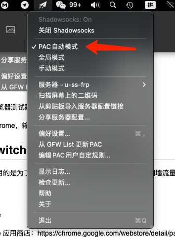 	
	- 访问 google 正常即可

## 手动添加非列表翻墙地址
如果访问的网站需要翻墙且列表没有，那么就需要手动添加，方法如下

- 打开翻墙网站无法打开,可以查看插件提示

	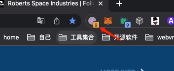 
- 点击打开提示

	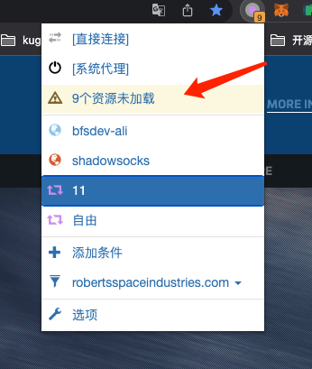 
- 下面是访问异常列表，可以选择需要翻墙的地址，并且选择翻墙模式，点击添加条件

	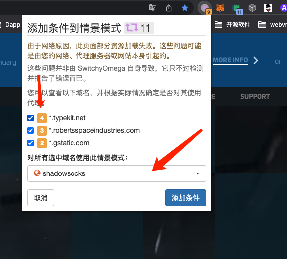 
- 刷新页面

	正常
- 查看规则

	点开切换详情，可以看到手动增加的规则，如果有问题，可以修改或者删除
	
	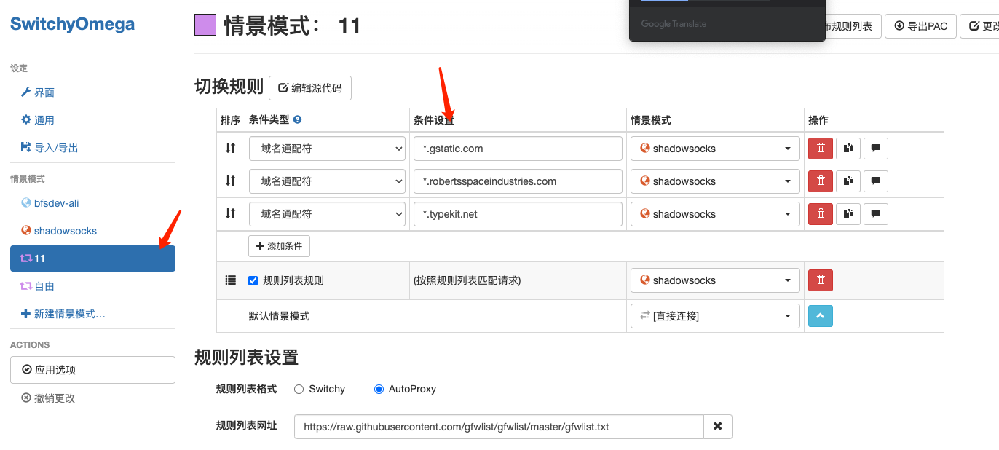 

		
			

				

				

		
					
				
		

	
			