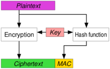
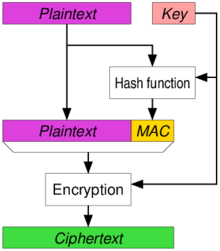

# AEAD 加密
Authenticated Encryption with Associated Data (AEAD) 是一种同时具备保密性，完整性和可认证性的加密形式。

AEAD 产生的原因很简单，单纯的对称加密算法，其解密步骤是无法确认密钥是否正确的。也就是说，加密后的数据可以用任何密钥执行解密运算，得到一组疑似原始数据，而不知道密钥是否是正确的，也不知道解密出来的原始数据是否正确。

因此，需要在单纯的加密算法之上，加上一层验证手段，来确认解密步骤是否正确。

简单地把加密算法和认证算法组合，可以实现上述目的，并由此产生了几个方案

## 方案一 EtM (Encryption then MAC)
- 加密
	- 对原始数据执行加密
	- 对密文进行 MAC 运算(一般用各种 HMAC)
	- 把二者拼接起来，发给接收方
- 解密
	- 先验证 MAC，如果验证通过，则证明密钥是正确的
	- 然后执行解密运算
	

## 方案二 E&M  (Encryption and MAC)
- 加密
	- 对明文进行 MAC 运算(一般用各种 HMAC)
	- 对原始数据执行加密
	- 把二者拼接起来，发给接收方
- 解密 
	- 先解密
	- 然后对解密结果执行 MAC 运算，比对发来的 MAC，验证正确性。

## 方案三 MtE (MAC then Encryption)(EtM 相反)
- 加密
	-  原始数据执行 MAC 运算与原始数据拼接后
	-  执行加密算法，将密文发送给接收方
- 解密
	- 先进行解密
	- 执行 MAC 运算，验证解密结果是否正确

业内逐渐意识到以上通过组合加密和认证算法来实现 AEAD 的方案都是有安全问题的,从 2008 年起提出，需要在一个算法在内部同时实现加密和认证,基于这个思想，一些新的算法被提出，这些算法被称为真正的 AEAD 算法

常见的 AEAD 算法如下：

- AES-128-GCM
- AES-192-GCM
- AES-256-GCM
- ChaCha20-IETF-Poly1305
- XChaCha20-IETF-Poly1305

- 在具备 AES 加速的 CPU（桌面，服务器）上，建议使用 AES-XXX-GCM 系列
- 移动设备建议使用 ChaCha20-IETF-Poly1305 系列。

在设计加密系统的时候，请务必选用 AEAD 算法，抛弃旧的 MtE，EtM，E&M 方案

## 参考
- [什么是AEAD加密](https://zhuanlan.zhihu.com/p/28566058)
 