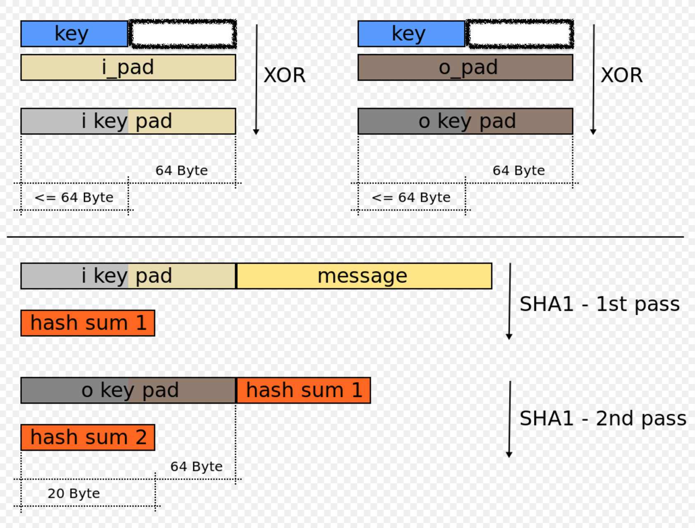

# HMAC 
## 简介
HMAC(散列消息身份验证码: Hashed Message Authentication Code)，它不是散了函数，而是利用哈希摘要算法加上一个密钥和一个消息为输入，生成一个摘要作为输出，该输出是一种基于密钥的报文完整性的验证方法 ，其安全性是建立在哈希摘要算法(可以是任意摘要函数)基础上的。 可以认为是一种单向非可逆加密算法

它要求通信双方

- 共享密钥
- 约定算法
- 对报文进行 Hash 运算，形成固定长度的认证码。

通信双方通过认证码的校验来确定报文的合法性。 HMAC 算法可以用来作加密、数字签名、报文验证等 。

## HMAC 算法的定义
HMAC 算法是一种执行“校验和”的算法，它通过对数据进行“校验”来检查数据是否被更改了。在发送数据以前，HMAC 算法对数据块和双方约定的公钥进行“散列操作”，以生成称为“摘要”的东西，附加在待发送的数据块中。当数据和摘要到达其目的地时，就使用 HMAC 算法来生成另一个校验和，如果两个数字相匹配，那么数据未被做任何篡改。否则，就意味着数据被更改

HMAC 算法公式表示如下：

	HMAC(Key,Message)=Hash((Key’⊕o_pad),Hash((Key’⊕i_pad),Message))
	
参数说明

- Hash

	hash算法，比如（MD5，SHA-1，SHA-256）
- B

	块字节的长度，块是 hash 操作的基本单位。这里 B=64
- L

	hash 算法计算出来的字节长度。(MD5 16 字节, SHA-1 20 字节)
- Key(密钥)

	共享密钥，K 的长度可以是任意的，但是为了安全考虑，Key 的长度应该大于 >B。
	
	- 密钥的长度可以小于等于数据块长B，小于将使用零子节补位
	- 如果大于数据块长度，可以使用 hash 函数对 key 进行转换，结果就是一个 L 长的 key
- Message

	要加密的内容
- o_pad

	外部填充常量，是 0x5C 重复B次(0x5c5c5c…5c5c, 一个block长度的十六进制常数 constant)。
- ipad

	内部填充常量，是0x36 重复B次  (0x363636…3636,一个block长度的十六进制常数constant)。
- ⊕

	XOR 异或运算。
		
## HMAC 算法的加密
### 图表示

### 步骤
-  在密钥 K 后面添加0或者对密钥 K 用 H 进行处理来创建一个字长为 B 的字符串
	- 如果 K 的字长是 20 字节，B＝64 字节，则 K 后会加入 44 个零字节 0x00
	- 如果 K 的字长是 120 字节，B＝64字节，则会用 H 作用于 K 后产生 64 字节的字符串

- 图的上半部分左边
	- 将上一步生成的 B 字长的字符串与 i_pad 做异或运算得到 `i key pad`
	- 将数据流 `message` 填充至 `i key pad` 字符串中
- 图的下半部分左边
	- 用 H 和上一步生成的结果生成 `hash sum 1`
- 图的上半部分右边
	- 将 B 字长字符串与 opad 做异或运算
- 图的下半部分右边
	- 将 `hash sum 1` 填充进上一步的结果中
	- 用 H 作用于上一步生成的数据流，输出最终结果 `hash sum2`

### 伪码实现
	function hmac (key, message) {
		if (length(key) > blocksize) {
			key = hash(key) // 超过块大小的密钥将被缩短
		}
	
		if (length(key) < blocksize) {
		//小于块大小的密钥将被用0补齐 (其中 ∥ 是串联使用)
			key = key ∥ [ 0x00 * (blocksize - length(key))] // * 是重复.
		}
		
		o_pad = [ 0x5c * blocksize] // 块大小是底层哈希函数的大小
	
		i_pad = [ 0x36 * blocksize]
	
		o_key_pad = o_pad ⊕ key // ⊕是异或或（XOR）
		i_key_pad = i_pad ⊕ key
	
		return hash(o_key_pad ∥ hash(i_key_pad ∥ message)) 
	}

## 算法场景
HMAC 算法的一个典型应用是用在用户登陆场景( “挑战/响应”（Challenge/Response）身份认证中)流程如下：

1. 先由客户端向服务器发出一个验证请求
- 服务器接到此请求后生成一个随机数并通过网络传输给客户端（此为挑战）。
- 客户端将收到的随机数与自己的密钥(k)进行 HMAC-SHA1 运算并得到一个结果作为认证证据传给服务器（此为响应）。
- 与此同时，服务器也使用该随机数与存储在服务器数据库中的该客户密钥(k)进行 HMAC-SHA1 运算，如果服务器的运算结果与客户端传回的响应结果相同，则认为客户端是一个合法用户,验证 key 相同。

## HMAC算法的安全性
HMAC 算法引入了密钥，其安全性已经不完全依赖于所使用的 HASH 算法，安全性主要有以下几点保证：

- 使用的密钥是双方事先约定的，第三方不可能知道。由上面介绍应用流程可以看出，作为非法截获信息的第三方，能够得到的信息只有作为“挑战”的随机数和作为“响应”的 HMAC 结果，无法根据这两个数据推算出密钥。由于不知道密钥，所以无法仿造出一致的响应。
- 在 HMAC 算法的应用中，第三方不可能事先知道输出（如果知道，不用构造输入，直接将输出送给服务器即可）。
- HMAC 算法与一般的加密重要的区别在于它具有“瞬时”性，即认证只在当时有效，而加密算法被破解后，以前的加密结果就可能被解密。

## 参考
- [HMAC算法原理](https://www.cnblogs.com/shoshana-kong/p/11497676.html)
- [HMAC的原理和应用](https://blog.csdn.net/yasi_xi/article/details/19968449)
- [手动构建登录流程](https://developers.facebook.com/docs/facebook-login/manually-build-a-login-flow)