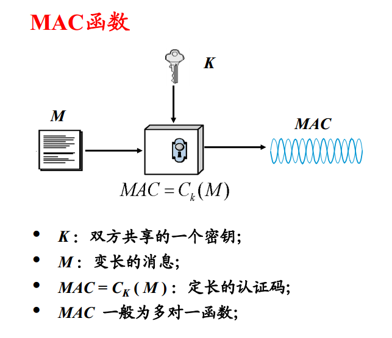

# MAC
## MAC 简介
基于密钥作完整性校验的方法常称为 MAC(Message Authentication Code)。通常 MAC 在共享密钥的双方之间，校验相互传递的信息。

消息认证码（MAC）,在加密的过程中有两种方法

- 一种是用单向散列函数的实现,MAC 函数用单项hash函数加密时，MAC 被称为 `HMAC(Hash Message Authentication Code).`特定 HMAC 实现需要选择一个特定的 hash 函数。这些不同的 HMAC 实现通常标记为：
	- HMAC-MD5
	- HMAC-SHA1
	- HMAC-SHA256
	- 等等

	
- 另一种是分组密码的实现基于 AES,比如 CBC-MAC

## 实现过程
使用 MAC 验证消息完整性的具体过程是

- 生成加密验证
	- 假设通信双方 A 和 B 共享密钥 K
	- A 用消息认证码算法将 K 和消息 M 计算出消息验证码 Mac
	- 然后将 Mac 和 M 一起发送给 B
- 生成解密验证
	- B 接收到 Mac 和 M 
	- 利用 M 和 K 计算出新的验证码 Mac*
	- 若 Mac*和Mac 相等则验证成功，证明消息未被篡改。

由于攻击者没有密钥 K，攻击者修改了消息内容后无法计算出相应的消息验证码，因此 B 就能够发现消息完整性遭到破坏。

## CBC-MAC 简介
CBC-MAC 是最为广泛使用的消息认证算法之一，同时它也是一个ANSI标准（X9.17）。CBC-MAC 实际上就是对消息使用 CBC 模式进行加密，取密文的最后一块作为认证码。

当取 AES 作为加密的分组密码时，称为基于 AES 的 CBC-MAC，若需要产生认证码的消息为 x，加密的 AES 密钥为 k，则生成 MAC 的过程如下图所示

- 填充和分组

	对消息 x 进行分组，如果不足8字节的整数倍进行填充，将消息分为 t 个 128 比特的分组，记为 `x1, x2,…, xt`
- 密码分组链接

	 Ek 表示以 k 为密钥的加密算法 AES，用以下方式计算 Hi：

		H1=Ek(x1)
		Hi=Ek(Hi-1+xi),2≤i≤t
	则 Ht 就是 x 的消息认证码

## OMAC
OMAC(One-key CBC-MAC)，是从 CBC-MAC 改进而来，克服了 CBC-MAC 的一些缺陷。在2005年被NIST(美国国家标准与技术研究生院)列为推荐标准。

OMAC 算法的核心是 CBC-MAC 的一种变种，是基于一种叫 xcbc 的算法改进的。xcbc 算法有效的解决了cbc-mac 的一些安全方面的缺陷，但是需要三个密钥。有人在此基础上，改进了 xcbc 算法，并把它命名为 one-key cbc-mac(omac). 之后提交了 omac1，在 omac 的基础了做了精简，并做了一些安全性分析。

	
## 参考
- [CBC-MAC](https://blog.csdn.net/weixin_38664664/article/details/78016243)
- [MAC、HMAC、CBC-MAC、OMAC的介绍](https://blog.csdn.net/wfzlry/article/details/90812331)