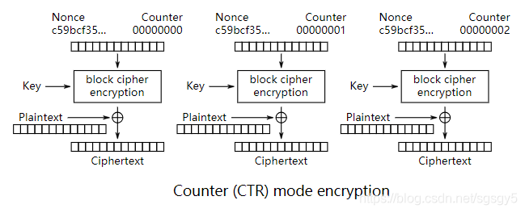
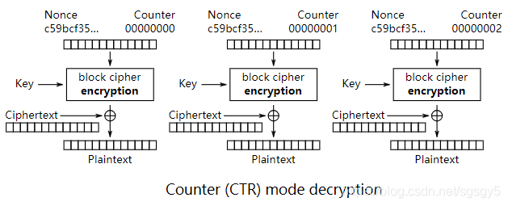

# AES 加密
## 简介
AES（Advanced Encryption Standard，高级加密标准，选择标准的时候，Rijndael 算法胜出，但是标准并没有直接用)，是美国联邦政府采用的一种区块加密标准用来代替 DES。由美国国家标准与技术研究院（NIST）于2001年11月26日发布于FIPS PUB 197，并在2002年5月26日成为有效的标准。

AES 使用的是代换-置换网络，而非 Feistel 架构，基于排列和置换运算。排列是对数据重新进行安排，置换是将一个数据单元替换为另一个，大多数 AES 计算是在一个特别的有限域完成的

常见 AES 分组模式有 ECB、CBC、CFB、OFB、CTR、CCM、GCM、AES_NI，工作模式解决的问题就是明文数据流怎么切分，数据不对齐的情况下如何处理等，NIST 在最早的 FIPS 81 中公布了 ECB、CBC、CFB、OFB 4种模式。2001年又加入了 CTR

- CFB、OFB 都带反馈，做流加密用的多
- CBC、CTR、ECB 多用于独立 block 加密，由于 ECB 算法有点小缺点，所以 CBC 和 CTR 这两种加解密方式用的较多，也是很多标准规范要求的实现算法
- AES_NI 硬件加速，这是针对AES加密算法的硬件加解密CPU指令集,根据 inter 白皮书，AES-NI 性能比完全软件快2到10倍。

AES 是一个迭代的、对称密钥分组的密码

- 密钥长度可以支持 128(16字节)、192(24字节) 或 256(32字节)位。
- 固定块（block size）为128bits（16字节）（原 Rijndael 块大小更灵活）可用于分组加密和解密数据。

	AES 加密过程是在一个 4×4 的字节矩阵上运作，这个矩阵又称为“体（state）”，其初值就是一个明文区块（矩阵中一个元素大小就是明文区块中的一个Byte）。16字节=128位

DES\AES 只能用于固定长度明文的加密，如果需要加密任意长度的明文，就需要对分组密码进行迭代，而分组密码的迭代方式就成为分组密码的模式.

## 算法说明
- 明文分组固定长度 128 位，每组 16 字节(每个字节 8 位)。(Rijndael 加密法可以变动？)
- 密钥长度可变 128、192、256 位，与 DES 加密一样，超出和缺少会进行补齐‘
	- 密钥长度超过指定长度时，超出部分无效
	- 密钥长度不够时，会自动以 `\0` 补齐
	- 迭代轮，轮数越多，当然安全性越好，但也更耗费时间

	AES|密钥长度|分组长度|迭代轮数(Nr)
	---|---|---|---|
	AES128|128|128|10
	AES192|192|128|12
	AES256|256|128|14
	
	AES 中 128 位密钥版本有10个加密循环，192比特密钥版本有12个加密循环，256比特密钥版本则有14个加密循环。至2006年为止，最著名的攻击是针对 AES 7次加密循环的128位密钥版本，8次加密循环的192比特密钥版本，和9次加密循环的256比特密钥版本所作的攻击。
- 初始化向量

	在密码学的领域里，初始向量（英语：initialization vector，缩写为IV），或译初向量，又称初始变量（starting variable，缩写为SV），是一个固定长度的输入值。一般的使用上会要求它是随机数或拟随机数（pseudorandom）。使用随机数产生的初始向量才能达到语义安全（消息验证码也可能用到初始向量），并让攻击者难以对原文一致且使用同一把密钥生成的密文进行破解。

	有些密码运算只要求初始向量不要重复，并只要求它用是内部求出的随机数值（这类随机数实际上不够乱）。在这类应用下，初始向量通常被称为 nonce（临时使用的数值），是可控制的（stateful）而不是随机数。这种作法是因为初始向量不会被寄送到密文的接收方，而是收发两方透过事前约定的机制自行计算出对应的初始向量（不过，实现上还是经常会把 nonce 送过去以便检查消息的遗漏）。计数器模式中使用序列的方式来作为初始向量，它就是一种可控制之初始向量的加密模式。

	初始向量的长度依密码运算的所需决定。对加密而言，一组难以预期并且与密钥等长的初始向量能够避免遭受TMD破译法（简单的说，是花时间（Time）观察被攻击者的密文，并将可能的密文预先算出来放在存储器（Memory）中与之比对，然后推导出被攻击者的明文或密钥资料（Data）；这种破译法比起用每一把密钥试误还来得快；不过只要密文的产生中伴随机的因子就可以避免此类攻击）。使用随机数作为初始向量时，还必须考量碰撞的问题以避免生日攻击法（简单的说，就是当样本空间够大的时候，要找到两个生日同一天者并非难事；同样的状况也发生在密码学中，会影响密文的强度）。对于传统、不支持初始向量的资料流加密法，实现上是将原密钥与初始向量先运算后，计算出新的密钥。然而有些实现已被认为不安全；比如有线等效加密（WEP）协议就遭受到关连式钥匙攻击。
- 算法核心操作
	- AddRoundKey（密钥扩展）

		该模块的作用是将输入的 128 位密钥扩展为 128 位×11 的密钥序列。整个密钥扩展完毕后，得到的是一个 44 个每单元 32 位的数组。将其顺序排列，每 4 个单元作为 roundkey，构成一个新的数组 roundkey[11]，并将其存在寄存器中，供运算时顺序取用。这样，就得到了addroundkey 运算中所需要的 roundkey。
	- SubTytes（字节变换）

		字节变换可以分为两步实现，先进行 GF(2^8)域的求逆运算，然后进行在 GF(2^8)域上定义的一个特定的乘法。
	- ShiftRows（行位移变换）

		行位移是在状态矩阵中，以行为单位进行横向位移，第一行保持原状。
	-  MixColumns（列混合变换）

		列混合变换是对状态矩阵中的各列进行如下图所示的 GF(2^8)矩阵乘法。	
## 分组模式说明
### ECB-Electronic CodeBook mode(电子密码模式)
ECB（Electronic Codebook，电码本）模式是分组密码的一种最基本的工作模式。在该模式下，将明文分组加密后，结果直接成为密文分组。当最后一个明文分组的内容小于分组长度时，就需要用特定的数据进行填补(padding)。

- 明文分组

	分组密码算法中被加密的明文
- 密文分组 

	分组密码算法中，加密之后生成的密文

一个巨大的明文和密文的对应表，所以 ECB 模式也称为`电子密码本模式`，由于其分组的独立性，利于实现并行处理，并且能很好地防止误差传播。另一方面由于所有分组的加密方式一致，明文中的重复内容会在密文中有所体现，因此难以抵抗统计分析攻击。因此，ECB模式一般只适用于小数据量的字符信息的安全性保护，例如密钥保护。

- 攻击方式

	ECB 并不能防御内容替换攻击。攻击者可以通过某种方式获得一个数据的加密形式（选择明文）B’，然后将某个加密后的块B’替换原始块B。以此，虽然攻击者并不知道原始内容，但是可以替换其中的部分内容。

### CBC-Cipher Block Chaining mode(密码分组链接模式)
CBC 全称 Cipher Block Chaining 密文分组链接模式，即加密算法的输入是上一个密文分组和下一个明文分组的异或。因为是将上一个密文和下一个明文分组的内容混淆加密，所以避免了 ECB 缺陷。

`当加密第一个明文分组时，由于不存在上一个密文分组，因此需要准备一个与明文分组等长的初始化向量 IV ，代替上一个密文分组`。如果分组长度不够，需要对明文块大小进行 Padding（补位），由于前后加密的相关性，只能实施串行化动作，无法并行运算。另外，CBC 需要参量：密钥和初始化向量	

- 加解密原理

	明文跟向量(如果是第一个明文就是初始化向量)异或，再用异或的结果和加密密钥进行加密，结果作为下个分组的向量。
	
	- 密钥生成原理
		- 固定长度 k,iv

			指定情况下，salt 时无效的，注意这里 k 是根据算法而定，算法是 128 就是 128 位，256就是 256 位。但是因为明文是固定128 位长度，所以 IV 是32个16进制，也就是 128 位，而 k,iv 会分别以 0 进行补位长度
		- 动态 salt 生成

			随机生成 8个字节的 `salt` ，然后基于 `salt+passwd` 生成 `k,iv`，使用 `hexdump` 可以看见在密文 8-16 字节是 salt，注意看两次执行的 salt  不一样，但是密文1-8字节都是固定的。17-最后字节是加密后的文件
	
			- `salt + passwd`  生成 `k,iv` 算法是不一定的
				- openssl 0.* 使用 md5 算法
					
						hash1_128 = md5(passwd+salt)
						hash2_128 = md5(hash1_128+passwd+salt) 
						hash3_128 = md5(hash2_128+passwd+salt) 
						key = hash1_128+hash2_128
						IV = hash3_128
				- openshift11.1* 使用 sha256
		
						key = sha256(passwd+salt)
						IV = sha256(key+passwd+salt)[0:16]
- 解密原理

	使用密钥先对密文第一个分组解密，解密后再同向量异或得到明文，假设密文分组中有一个分组损坏了。在这种情况下，只要 `密文分组的长度没有发生变化`，则解密时最多只有2个分组受到数据损坏的影响。
	
	
	
	但是如果密文长度发生改变，则后续分组将无法解密。
	
	其次还有一个特性，就是初始化向量只影响第一个加密分组，后续加密分组因为向量使用的是前一个加密数据，所以只要加密数据是准的，向量就是准的。
- 初始化向量

	当加密第一个明文分组时，由于不存在“前一个密文分组”，因此需要事先准备一个长度为一个分组的比特序列来代替“前一个密文分组”，这个比特序列称为初始化向量（Initialization Vector），通常缩写为IV，一般来说，每次加密时都会随机产生一个不同的比特序列来作为初始化向量
- CBC 优缺点
	- 优点 
		- 明文加密前一定会与向量异或运算，因此即使明文分组1和2都是相等的，密文1和2也不一定相等增加了随机性，解决了 ECB 的缺陷。
		- 无法单独堆中间明文分组进行加密。例如生成密文分组3，必须拥有明文 3 之前的所有明文。
		- 可并行解密计算
	- 缺点
		- 无法并行加密计算
		- 一个分组损坏，但是密文长度不变，则2个分组不能解密 
		- 一个分组损坏，但密文分组中一些比特缺失，即使缺少1比特，导致密文长度改变，则后续所有分组无法解密 
- 攻击方式

	假设主动攻击者的目的是通过修改密文来操纵解密后的明文。如果攻击者能够对初始化向量中的任意比特进行反转（将1变成0，将0变成1），则明文分组中相应的比特也会被反转。这是因为在CBC模式的解密过程中，第一个明文分组会和初始化向量进行XOR运算。见下图。
	
	
	
	但是想对密文分组也进行同样的攻击就非常困难了。例如，如果攻击者将密文分组1中的某个比特进行反转，则明文分组2中相应比特也会被反转，然而这一比特的变化却对解密后的明文分组1中的多个比特造成了影响，也就是说，只让明文分1中所期望的特定比特发生变化是很困难的。
	
	- 填充提示攻击

		填充提示攻击是一种利用分组密码中填充部分来进行攻击的方法。在分组密码中，当明文长度不为分组长度的整数倍时，需要在最后一个分组中填充一些数据使其凑满一个分组长度。在填充提示攻击中，攻击者会反复发送一段密文，每次发送时都对填充数据进行少许改变。由于接收者（服务器）在无法正确解密时会返回一个错误消息，攻击者通过这一错误消息就可以获得一部分与明文相关的信息。这一攻击并不仅限于CBC模式，而是适用所有需要进行分组填充的模式。

		2014年对 SSL3.0 造成了重大影响 POODLE 攻击实际上就是一种填充示攻击。
	- 对初始化向量（IV）进行攻击

		初始化向量（IV）必须使用不可预测的随机数。然而在 SSL/TLS 的 TLS1.0 版本协议中，IV 并没有使用不可预测的随机数，而是使用上一次 CBC 模式加密时的最后一个分组。为了防御攻击者对此进行攻击，TLS1.1 以上的版本中改为了必须显示传送 IV。
- CBC 对比 ECB

	
	
### CTR CounTeR mode(计数器模式)
CTR 模式（Counter mode，CM）也被称为 ICM 模式（Integer Counter Mode，整数计数模式）和 SIC 模式（Segmented Integer Counter）。

CTR 模式中，每个分组对应一个逐次累加的计数器(“nonce”或称为初始向量)，注意`这里和 ECB 和 CBC 是反向操作，它使用 “nonce” 和加密密钥进行加密，然后再和明文做异或得到密文。也就是说，最终的密文分组是通过将计数器加密后得到的数据与明文分组进行XOR而得到的。`

与 OFB 相似 CTR 将块密码通过递增一个加密计数器以产生连续的密钥流,再和明文异或加密。其中，计数器可以是任意保证长时间不产生重复输出的函数，但使用一个普通的计数器是最简单和最常见的做法。但使用简单的、定义好的输入函数是有争议的：批评者认为它“有意的将密码系统暴露在已知的、系统的输入会造成不必要的风险”。

目前，CTR 已经被广泛的使用了，由输入函数造成的问题被认为是使用的块密码的缺陷，而非 CTR 模式本身的弱点。无论如何，有一些特别的攻击方法，例如基于使用简单计数器作为输入的硬件差错攻击。

CTR 模式的特征类似于 OFB，但它允许在解密时进行随机存取。由于不需要 Padding，加密和解密过程均可以进行并行处理，适合运用于多处理器的硬件上。

`注意图中的 “nonce” 等同于 IV（初始化向量）功能，密码学也可以叫成 IV。`

- 加密原理 

	用密钥对输入的计数器加密，然后同明文异或得到密文。
	
	
	
	
- 解密原理

	`解密注意首先用用密钥和输入计数器加密,不是加密`，然后同密文异或得到明文。

	
	
	

- 计数器的生成方法
	- 每次加密时都会生成一个不同的值（nonce）来作为计数器的初始值。当分组长度为128比特（16字节）时，计数器的初始值可能是像下面这样的形式。
	
			8f f9 2c bd c5 67 26 7d 00 00 00 00 00 00 00 01
			|----- nonce/IV-----| |-----ß 分组序号------|
	- 其中前8个字节为 nonce（随机数），这个值在每次加密时必须都是不同的，后8个字节为分组序号，这个部分是会逐次累加的。在加密的过程中，计数器的值会产生如下变化

			8f f9 2c bd c5 67 26 7d 00 00 00 00 00 00 00 01  明文分组1的计数器(初始值)
			8f f9 2c bd c5 67 26 7d 00 00 00 00 00 00 00 02  明文分组1的计数器
			8f f9 2c bd c5 67 26 7d 00 00 00 00 00 00 00 03  明文分组1的计数器
			8f f9 2c bd c5 67 26 7d 00 00 00 00 00 00 00 04  明文分组1的计数器
			
		按照上述生成方法，可以保证计数器的值每次都不同。由于计数器的值每次都不同，因此每个分组中将计数器进行加密所得到的密钥流也是不同的。就是说，这种方法就是用分组密码来模拟生成随机的比特序列。

- CTR 特点
	- 加密和解密使用了完全相同的结构，因此在程序实现上比较容易。这一特点和同为流密码的 OFB 模式是一样。
	- 可以以任意顺序对分组进行加密和解密，因此在加密和解密时需要用到的“计数器"的值可以由 nonce 和分组序号直接计算出来。这一性质是 OFB 模式所不具备的。
	- 能够以任意顺序处理分组，就意味着能够实现并行计算。在支持并行计算的系统中，CTR 模式的速度是非常快的。

CTR 涉及参量：

- Nounce\IV 是随机数生成
- Counter 计数器
- key 密钥

Nounce 随机数和 Counter 计数器整体可看作计数器，因为只要算法约定好，就可以回避掉串行化运算。

### CCM Counter with CBC-MAC 
#### 简介
CCM 是 Cipher Block Chaining Message Authentication Code (CBC-MAC 认证) 和 Counter模式（CTR 加密）的组合。它是经过身份验证的加密算法，旨在提供身份验证和机密性。CCM 定义在 RFC 3610 广泛用于互联网和物联网中对传输数据进行保护。而且很多 MCU 中都实现了对 CCM 的硬件支持，使用也比较方便。

CCM 模式仅针对块长度为 128 位的块密码定义。必须仔细选择 CCM 的随机数，以免给定密钥多次使用。采用 AES-CCM 加密模式，能够为系统提供数据保密、数据完整性保护、身份认证和反重放保护等功能，从而能够达到保护网络安全通信的目的。

[CCM 加密算法 openssl 函数库](https://wiki.openssl.org/index.php/EVP_Authenticated_Encryption_and_Decryption), openssl 例子使用的算法与RFC 3610规定的有些配置上的差异，下面是我根据RFC 3610写的AES-CCM加密算法测试例子

#### 名词概念
在数据通信中，传输中的数据包由两部分构成

- 数据包头
- 用户数据（payload）

用户数据一般需要加密以防止窃听。但传输路上的设备（路由器、交换机等）往往需要参照数据包头以保证把数据包能正确地送到目的地，因此数据包头不能加密。网络通信中的风险除了窃听，还有恶意篡改、伪造等其他行为。因此为了保证收到的数据包没有被篡改，需要对整个数据、包括包头进行认证。

#### 数据认证
认证采用 CBC-MAC 模式。需要指定两个参数：

- 长度域的长度（大小）L

	L 是信息量最大值和 Nounce 域大小之间的权衡值。长度域，取值为 2~8 ，openssl 中缺省的为 8。
	
	- 编码方式
	
			L-1
- 认证域的长度 M

	M 是信息量与攻击者模仿信息的能力之间所做的权衡值，tag 的长度，合法的值为：4,6,8,10,12,14 和16。openssl 中缺省的为 12

	- 编码方式

			(M-2)/2

#### 认证处理需要的信息
- 算法
	- 加密算法 (Cipher)
	- 计数器算法( conuter generation)
	- 格式化函数(formatting )
	- MAC 比特长度 Tlen
- 输入
	- 密钥 (K)
	- 随机数 Nonce (N)

		长度为：15-L。Nonce 在一个密钥的使用周期内必须确保唯一
	- 信息 m, 长度为 Plen 比特
	
		其长度 l(m) 的范围为 0≤l(m)＜2^(8L)，目的是其长度确保可以由 L 字节的长度域保存
	- 关联数据 A（data 一般为数据包的报头）
	
		其长度为 l(a)，大小范围为：0≤l(a)＜2^(64)。这部分数据只认证（Authenticate），不加密。因此也不包含在该模式的输出中。主要是用于认证明文的报头或影响消息解析的上下文信息。
- 输出
	- 密文 (C)

		包含了 P 对应的密文和 MAC 信息 

CCM 是将明文数据通过 CTR 模式加密成密文，然后在密文后再附加上认证数据，最终的密文比明文要长。具体流程

- 先对明文数据认证并产生一个 tag
- 加密过程中使用此 tag 和 IV 生成校验值 U
- 然后再用 CTR 模式来加密明文
- 再在密文后附上校验码 U

其中对消息长度有

	0<= len(Msg)<= 2^(8L);
对附加数据长度有
	
	0<= len(AAD)< 2^64;

### GCM
GCM 模式是 CTR和GHASH组合，GHASH操作定义为密文结果与密钥以及消息长度在 GF(2^128)域相乘。GCM比CCM的优势是在于更高并行度以及更好的性能。TLS1.2标准使用的就是 AES-GCM 算法，并且 inter cpu 提供了 GHASH 的硬件加速

### 硬件加速
高级加密标准指令集（或称英特尔高级加密标准新指令，简称AES-NI）是一个x86指令集架构的扩展，用于Intel和AMD微处理器，由Intel在2008年3月提出。[1]该指令集的目的是改进应用程序使用高级加密标准（AES）执行加密和解密的速度。

提升效率

- CBC 加密无法并行计算，可以提供比完全软件方法高2-3倍的性能
- CTR 和 CBC 解密，可以提升一个数量级

支持型号

- x86

	几乎最新的 cpu 全系列都支持(intel 和 amd)
- 其他硬件
	- Allwinner

		使用“安全系统”的A10和A20。[21]
	- Broadcom

		使用“安全处理器”的BCM5801/BCM5805/BCM5820。[18]
	- 高通

		Snapdragon 805（和以后）。
	- 三星电子

		Exynos 3系列（和以后）。	 

## 模式对比
模式|名称|优点|缺点|备注
---|---|---|---|---|---|---
ECB| Electronic Code Book 电子账本|1. 简单 2. 快速 3. 加解密并行计算|1.明文中的重复排列会反应在密文中 2.通过删除、替换密文分组可以对明文进行操作 3. 对包含某些比特错误的密文进行解密，对应的分组会出错 4.不能抵御重放攻击|不应该使用
CBC| Cipher Block Chaining 密文分组链接模式|1.明文的重复排列不会反应在密文中 2. 解密支持并行计算 3. 能够解密任意密文分组 | 1. 对包含某些错误比特的密文进行解密时，第一个分组的全部比特以及后一个分组的相应比特会出错。 2. 加密不支持并行计算|推荐使用
CTR|CounTeR 计数器模式|1.不需要填充(padding) 2.可事先进行加解密准备 3.加解密使用相同结构 4.对包含某些错误比特的密文进行解密时，只有明文中相应的比特会出错 5. 加解密支持并行计算 | 主动攻击者反转密文分组中的某些比特时，明文分组中相应的比特也会被反转(也就是反转攻击)|推荐使用
CFB|Cipher FeedBack 密文反馈模式|1. 不需要填充(padding) 2.解密支持并行计算 3.能够解密任意密文分组|1. 加密不支持并行激素三 2. 对包含某些错误比特的密文进行解密时，第一个分组的全部比特以及后一个分组的相应比特会出错。3.不能抵御重放攻击|推荐使用 CTR 代替
OFB|Output FeedBack 输出反馈模式|1. 不需要填充(padding) 2.可事先进行加解密准备 3. 加解密使用相同结构 4.对包含某些错误比特的密文进行解密时，只有明文中相应的比特会出错|1.不支持并行计算 2.主动攻击者反转密文分组中的某些比特时，明文分组中相应的比特也会被反转(也就是反转攻击)|推荐使用 CTR 代替

## openssl 命令行参数
- 参数
	
		openssl enc -ciphername [-in filename] [-out filename] [-pass arg] [-e] [-d] [-a/-base64] [-k password] [-S salt] [-salt] [-md] [-p/-P]
	
		选项说明：
		-ciphername：指定对称加密算法(如des3)，可独立于enc直接使用，如openssl des3或openssl enc -des3。推荐在enc后使用，这样不依赖于硬件
		-in filename ：输入文件，不指定时默认是stdin
		-out filename：输出文件，不指定时默认是stdout
		-e：对输入文件加密操作，不指定时默认就是该选项
		-d：对输入文件解密操作，只有显示指定该选项才是解密
		-pass：传递加、解密时的明文密码。若验证签名时实用的公钥或私钥文件是被加密过的，则需要传递密码来解密。密码的格式见"openssl 密码格式"
		-k     ：已被"-pass"替代，现在还保留是为了兼容老版本的openssl
		-base64：在加密后和解密前进行base64编码或解密，不指定时默认是二进制。注意，编码不是加解密的一部分，而是加解密前后对数据的格式"整理"
		-a：等价于-base64
		-salt：单向加密时使用salt复杂化单向加密的结果，此为默认选项，且使用随机salt值
		-S salt：不使用随机salt值，而是自定义salt值，但只能是16进制范围内字符的组合，即"0-9a-fA-F"的任意一个或多个组合
		-p：打印加解密时salt值、key值和IV初始化向量值（也是复杂化加密的一种方式），解密时还输出解密结果，见后文示例
		-P：和 -p 选项作用相同，但是打印时直接退出工具，不进行加密或解密操作
		-md：指定单向加密算法，默认md5。该算法是拿来加密key部分的，见后文分析。

- 支持的摘要算法

		-md4            to use the md4 message digest algorithm
		-md5            to use the md5 message digest algorithm
		-ripemd160      to use the ripemd160 message digest algorithm
		-sha            to use the sha message digest algorithm
		-sha1           to use the sha1 message digest algorithm
		-sha224         to use the sha224 message digest algorithm
		-sha256         to use the sha256 message digest algorithm
		-sha384         to use the sha384 message digest algorithm
		-sha512         to use the sha512 message digest algorithm
		-whirlpool      to use the whirlpool message digest algorithm
- 支持的对称加密算法

		-aes-128-cbc               -aes-128-cbc-hmac-sha1     -aes-128-cfb             
		-aes-128-cfb1              -aes-128-cfb8              -aes-128-ctr             
		-aes-128-ecb               -aes-128-gcm               -aes-128-ofb             
		-aes-128-xts               -aes-192-cbc               -aes-192-cfb             
		-aes-192-cfb1              -aes-192-cfb8              -aes-192-ctr             
		-aes-192-ecb               -aes-192-gcm               -aes-192-ofb             
		-aes-256-cbc               -aes-256-cbc-hmac-sha1     -aes-256-cfb             
		-aes-256-cfb1              -aes-256-cfb8              -aes-256-ctr             
		-aes-256-ecb               -aes-256-gcm               -aes-256-ofb             
		-aes-256-xts               -aes128                    -aes192                  
		-aes256                    -bf                        -bf-cbc                  
		-bf-cfb                    -bf-ecb                    -bf-ofb                  
		-blowfish                  -camellia-128-cbc          -camellia-128-cfb        
		-camellia-128-cfb1         -camellia-128-cfb8         -camellia-128-ecb        
		-camellia-128-ofb          -camellia-192-cbc          -camellia-192-cfb        
		-camellia-192-cfb1         -camellia-192-cfb8         -camellia-192-ecb        
		-camellia-192-ofb          -camellia-256-cbc          -camellia-256-cfb        
		-camellia-256-cfb1         -camellia-256-cfb8         -camellia-256-ecb        
		-camellia-256-ofb          -camellia128               -camellia192             
		-camellia256               -cast                      -cast-cbc                
		-cast5-cbc                 -cast5-cfb                 -cast5-ecb               
		-cast5-ofb                 -des                       -des-cbc                 
		-des-cfb                   -des-cfb1                  -des-cfb8                
		-des-ecb                   -des-ede                   -des-ede-cbc             
		-des-ede-cfb               -des-ede-ofb               -des-ede3                
		-des-ede3-cbc              -des-ede3-cfb              -des-ede3-cfb1           
		-des-ede3-cfb8             -des-ede3-ofb              -des-ofb                
		-des3                      -desx                      -desx-cbc                
		-id-aes128-GCM             -id-aes128-wrap            -id-aes128-wrap-pad      
		-id-aes192-GCM             -id-aes192-wrap            -id-aes192-wrap-pad      
		-id-aes256-GCM             -id-aes256-wrap            -id-aes256-wrap-pad      
		-id-smime-alg-CMS3DESwrap  -idea                      -idea-cbc                 
		-idea-cfb                  -idea-ecb                  -idea-ofb                
		-rc2                       -rc2-40-cbc                -rc2-64-cbc              
		-rc2-cbc                   -rc2-cfb                   -rc2-ecb                 
		-rc2-ofb                   -rc4                       -rc4-40                  
		-rc4-hmac-md5              -seed                      -seed-cbc                
		-seed-cfb                  -seed-ecb                  -seed-ofb

## 攻击
截至2006年，针对 AES 唯一的成功攻击是旁道攻击或社会工程学攻击。美国国家安全局审核了所有的参与竞选AES的最终入围者（包括Rijndael），认为他们均能够满足美国政府传递非机密文件的安全需要。2003年6月，美国政府宣布AES可以用于加密机密文件。AES 加密算法（使用128，192，和256比特密钥的版本）的安全性，在设计结构及密钥的长度上俱已到达保护机密信息的标准。最高机密信息的传递，则至少需要 192 或 256 比特的密钥长度。许多大众化产品只使用128位密钥当作默认值；注意这里的加密破解主要取决于时间和算力发展，所以当时 128 位安全仅限于当时的算力在可预估时间内无法计算完毕。

- 内存与交换

	程序如果将密钥存储在可交换内存页中，在内存吃紧的情况下有可能会交换出来并写入磁盘。如辅以代码逆向等，密钥很有可能会泄露。

	- 解决方法

		应用层最好用 mlock(Linux) 或 VirtualLock(Windows) 来防止内存页被交换至磁盘。
		
	但因为密钥在内存中，所以任何能访问内存的方式均有可能导致密钥的泄漏。曾流行的一种攻击是通过 1394 DMA 方式来访问目标机内存，Linux/Windows Login bypass，Windows bitlock 等漏洞均由起引起。较新的 CPU 为硬件虚拟化所引入的 IO MMU （Intel VT-d or AMD-Vi）可以有效地限制硬件对内存的访问权限。

- 传统攻击(暴力破解)

	AES 从产生至今依然是最安全的加密算法，传统攻击手段依然无法撼动其安全性。虽然已有攻击手段显示可以将 AES-256 的暴力搜索次数从 2^256 次降至2^119 次，但依然没有实际操作价值。

	不过随着计算力的提升，特别是量子计算机的发展，AES将不再是安全的。当然可以肯定的是：一定会出现更安全的加密算法。	

- 旁道攻击

	在密码学中，旁道攻击又称侧信道攻击、边信道攻击（英语：Side-channel attack）是一种攻击方式，它基于从密码系统的物理实现中获取的信息而非暴力破解法或是算法中的理论性弱点（较之密码分析）。例如：时间信息、功率消耗、电磁泄露或甚是声音可以提供额外的信息来源，这可被利用于对系统的进一步破解。某些侧信道攻击还要求攻击者有关于密码系统内部操作的技术性信息，不过，其他诸如差分电力分析的方法在黑盒攻击中效果明显。许多卓有成效的侧信道攻击基于由保罗·科切开拓的统计学方法。需要注意的是，如果破解密码学系统使用的信息是通过与其使用人的合法交流获取的，这通常不被认为是旁路攻击，而是社会工程学攻击。
	
	根据借助的介质，旁路攻击分为多个大类，包括：

	- 缓存攻击
	
		通过获取对缓存的访问权而获取缓存内的一些敏感信息，例如攻击者获取云端主机物理主机的访问权而获取存储器的访问权；
	- 计时攻击
	
		通过设备运算的用时来推断出所使用的运算操作，或者通过对比运算的时间推定资料位于哪个存储设备，或者利用通信的时间差进行资料窃取
	- 基于功耗监控的旁路攻击
	
		同一设备不同的硬件电路单元的运作功耗也是不一样的，因此一个程序运行时的功耗会随着程序使用哪一种硬件电路单元而变动，据此推断出资料输出位于哪一个硬件单元，进而窃取资料；
	- 电磁攻击
	
		设备运算时会泄漏电磁辐射，经过得当分析的话可解析出这些泄漏的电磁辐射中包含的信息（比如文本、声音、图像等），这种攻击方式除了用于密码学攻击以外也被用于非密码学攻击等窃听行为，如TEMPEST攻击（例如范·埃克窃听、辐射监测）；
	- 声学密码分析
	
		通过捕捉设备在运算时泄漏的声学信号捉取信息（与功率分析类似）；
	- 差别错误分析
	
		隐密资料在程序运行发生错误并输出错误信息时被发现；
	- 数据残留
	
		可使理应被删除的敏感资料被读取出来（例如冷启动攻击）；
	- 软件初始化错误攻击
	
		现时较为少见，行锤攻击是该类攻击方式的一个实例，在这种攻击实现中，被禁止访问的存储器位置旁边的存储器空间如果被频繁访问将会有状态保留丢失的风险；
	- 光学方式
	
		即隐密资料被一些视觉光学仪器（如高清晰度相机、高清晰度摄影机等设备）捕捉。

	所有的攻击类型都利用了加密/解密系统在进行加密/解密操作时算法逻辑没有被发现缺陷，但是通过物理效应提供了有用的额外信息（这也是称为“旁路”的缘由），而这些物理信息往往包含了密钥、密码、密文等隐密资料。
- 社会工程学

	在计算机科学，社会工程学指的是通过与他人的合法交流，来使其心理受到影响，做出某些动作或者是透露一些机密信息的方式。这通常被认为是欺诈他人以收集信息、行骗和入侵计算机系统的行为。在英美普通法系，这一行为一般是被认作侵犯隐私权的。历史上，社会工程学是隶属于社会学，不过其影响他人心理的效果引起了计算机安全专家的注意。		
	
		
## 参考
- [ECB模式详解](https://blog.csdn.net/sunqiujing/article/details/75066924)
- [CBC模式和ECB模式解读](https://www.cnblogs.com/wangle1001986/p/11468419.html)
- [旁路攻击](https://zh.wikipedia.org/wiki/%E6%97%81%E8%B7%AF%E6%94%BB%E5%87%BB)
- [社会工程学](https://zh.wikipedia.org/wiki/%E7%A4%BE%E4%BC%9A%E5%B7%A5%E7%A8%8B%E5%AD%A6)
- [初始向量](https://zh.wikipedia.org/wiki/%E5%88%9D%E5%A7%8B%E5%90%91%E9%87%8F)
- [企业安全AES-NI白皮书](http://www.intel.com/content/dam/doc/white-paper/enterprise-security-aes-ni-white-paper.pdf?spm=a2c6h.12873639.0.0.2a375475hUvRMj&file=enterprise-security-aes-ni-white-paper.pdf)
- [AES简介](https://github.com/matt-wu/AES)
- [Another New AES Attack](https://www.schneier.com/blog/archives/2009/07/another_new_aes.html)
