# ceph 
## 基础概念
### 什么是 Ceph
- 简介

	利用一个分布式集群来提供对象，块和文件存储的统一存储平台。Ceph 是一种基于软件的分布式存储解决方案，并在“商品硬件”上运行。该系统被设计成自动修复和智能管理，最初是 SageWeil 一项关于存储系统的PhD研究项目(2004年发表)。目标：没有单点故障的完全分布式存储系统，使数据能容错和无缝的复制，可扩展EB水平(EB,PB,TB,GB)，并且降低成本。

- 特点
	- 高性能
		-  ceph 摒弃了从元数据中寻址的方案，采用 CRUSH 算法，数据分布均衡，并行度高。
		-  考虑了容灾域的隔离，可以实现各类的副本分布规则，如跨机房、机架感知等。
		-  能够支持上千个存储节点的规模，支持TB到EB级的数据。
	- 高可用性
		- 副本数可以灵活控制
		- 支持故障域分隔，数据强一致性
		- 多种故障场景自动进行修复自愈
		- 没有单点故障，自动管理
	- 高可扩展性
		- 去中心化
		- 扩展灵活
		- 随着节点增加而线性增长
	- 特性丰富
		- 支持三种存储接口：块存储、文件存储、对象存储
		- 支持自定义接口，支持多种语言驱动。

### Ceph 架构设计
Ceph 通过 RADOS 组件，在核心层实现了分布式存储的能力，然后在客户端提供三种存储方式来使用它。
生态系统可以大致划分为四部分：

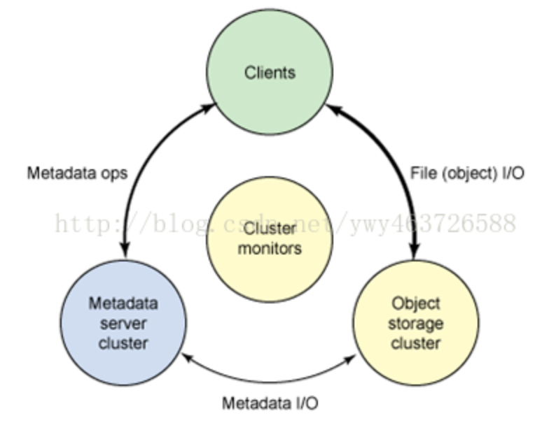
### 存储方式的基本概念

1. Filesystem
	- 典型设备(磁盘阵列，硬盘)

		主要是将裸磁盘空间映射给主机使用的。
	- 优点
		- 通过Raid与LVM等手段，对数据提供了保护
		- 多块廉价的硬盘组合起来，提高容量
		- 多块磁盘组合出来的逻辑盘，提升读写效率
	- 缺点
		- 采用SAN架构组网时，光纤交换机，造价成本高
		- 主机之间无法共享数据。
	- 使用场景
		- 操作系统存储 
		- docker容器、虚拟机磁盘存储分配
		- 日志存储
		- 数据库存储
		- 文件存储
			…
2. Block Device
	- 典型设备(FTP、NFS服务器)

		为了克服块存储文件无法共享的问题，所以有了文件存储。
在服务器上架设FTP与NFS服务，就是文件存储。
	- 优点
		- 造价低，随便一台机器就可以了
		- 方便文件共享
	- 缺点
		- 读写速率低
		- 传输速率慢
	- 使用场景
		- 日志存储
		- 有目录结构的文件存储
			…
3. Object Storage
	- 典型设备(内置大容量硬盘的分布式服务器swift, s3)

		多台服务器内置大容量硬盘，安装上对象存储管理软件，对外提供读写访问功能
	- 优点
		- 具备块存储的读写高速
		- 具备文件存储的共享等特性
	- 使用场景(适合更新变动较少的数据)
		- 图片存储
		- 视频存储
			…

### ceph 核心概念
1. client 

	客户端使用元数据服务器，执行元数据操作（来确定数据位置）
2. metadata server

	MDS 元数据服务器, Ceph FS 依赖的元数据服务，管理数据位置，以及在何处存储新数据。
3. Object Storage Device

	OSD 全称对象存储设备，也就是负责响应客户端请求返回具体数据的进程。一个 Ceph 集群一般都有很多个 OSD，最少2个
4. monitor

	一个 Ceph 集群需要多个 Monitor 组成的小集群，它们通过Paxos 同步数据，用来保存 OSD 的元数据。
5. Object

	Ceph 最底层的存储单元，每个 Object 均包含元数据和原始数据
6. Placement Grouops

	PG 安置组是一个逻辑的概念，一个 PG 包含多个 OSD。引入 PG 这一层为了更好的分配数据和定位数据
7. Reliable Autonomic Distributed Object Store

	RADOS 可靠的自主分布式对象存储协议 ，Ceph 的核心，实现数据分配、Failover 等集群操作。
8. Libradio

	Librados 是 Rados 提供库，因为 RADOS 是协议很难直接访问，因此上层的 RBD、RGW 和 CephFS 都是通过 librados 访问的，目前提供 PHP、Ruby、Java、Python、C 和 C++ 支持
9. CRUSH

	CRUSH 是 Ceph 使用的数据分布算法，类似一致性哈希，让数据下发的调度算法
10. RADOS block device(块存储)

	RBD全称RADOS 块设备，是 Ceph 对外提供的块设备服务。块设备将信息存储在固定大小的块中，每个块都有自己的地址。数据块的大小通常在 512 - 32768 字节之间。块设备的基本特征是每个块都能独立于其它块而读写。磁盘是最常见的块设备。
11. RADOS gateway(对象存储)

	RGW 全称 RADOS 网关，是 Ceph 对外提供的对象存储服务，接口与 S3 和 Swift 兼容。对象存储系统（Object-Based StorageSystem）是综合了 NAS(Network Storage Technologies) 和 SAN(Storage AreaNetwork) 的优点，同时提供高速直接访问(san)和数据共享(nas)等优势，提供了高可靠性、跨平台性以及安全的数据共享的存储体系结构。
12. Ceph File System（文件存储）

	CephFS 是 Ceph 对外提供的文件系统服务，一个 POSIX 兼容的文件系统,使用 RADOS 集群存储其数据,使用存储设备与块设备存储和对象存储相同,至少需要配置一个 MDS
13. Cluster Map

	RADOS 的核心数据结构，指定了 OSDs 和数据分布信息，在 monitor 上存有最新副本，依靠 epoch 增加来维护及时更新增量信息。数据包括

	1. Monitor Map

		包括集群的 FSID、位置、名字地址和每个监控器的端口
	2. OSD Map

		包括集群的 FSID、pool 列表、副本信息、pg号码、osd 列表和它们的状态。
	3. PG Map

		包括 pg 版本、时间戳、最后一个 osd map 的 epoch，全部比率、每个pg的相信信息(pgid、Up Set、 Acting Set、pg 状态和每个 pool 的数据统计信息)
	4. CRUSH Map

		包括设备列表、故障域层次结构(硬盘、主机、机架、机架所在行、所在机房房间信息等)和存储数据时遍历层次结构的规划
	5. MDS Map

		MDS map epoch、用于存储元数据的pool、元数据服务器列表、元数据服务器启动状态。
14. pools

	Pool是 ceph 存储数据时的逻辑分区，它起到namespace的作用。其他分布式存储系统，比如Mogilefs、Couchbase、Swift都有pool的概念，只是叫法不同。每个pool包含一定数量的PG，PG里的对象被映射到不同的OSD上，因此pool是分布到整个集群的。
	
	pool 有两种方法增强数据的可用性，可以设置其中之一，默认是副本。
	
	- 一种是副本(replicas)
	- 一种是EC(erasure coding 纠删码）
	
## 数据存读机制
#### ceph 存储流程
1. 需要将保存的文件切分成大小一致的对象块(默认以4M切分一个块)。(File->Object映射)
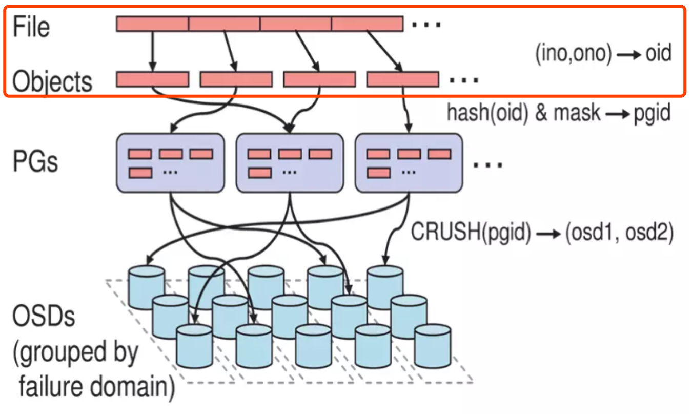

	- inode number(INO)
	
		是 File 的元数据，File 的唯一 ID
	- object number（ONO）

		单个文件切分对象块的 id,用对象名加序号
	- oid
	
		oid 推导公式 `object id=ino(文件id)+ono(对象块id)`		
2. Object 是 RADOS 需要的对象。Ceph 指定一个静态 hash 函数计算 oid 的值，将 oid 映射成一个近似均匀分布的伪随机值，然后和 mask 按位相与，得到 pgid。(Object->PG映射)
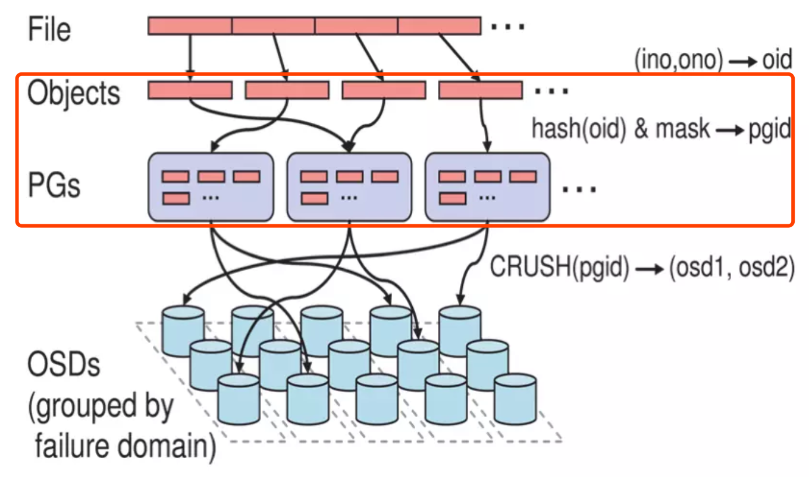
	- hash(oid) & mask -> pgid
	- mask=PG总数m(m为2的整数幂)-1
	- 总数 PGs = (Total_number_of_OSD * 100)/ max_replication_count
		- 例子 15 osd，副本3的 gp
			- PG 总数=15*100/3=500的整数幂=512
3. PG(Placement Group),用途是对 object 的存储进行组织和位置映射, (类似于redis cluster 的 slot) 一个 PG 里面会有很多 object。采用 CRUSH 算法，将 pgid 代入其中，然后得到一组 OSD。PG->OSD映射
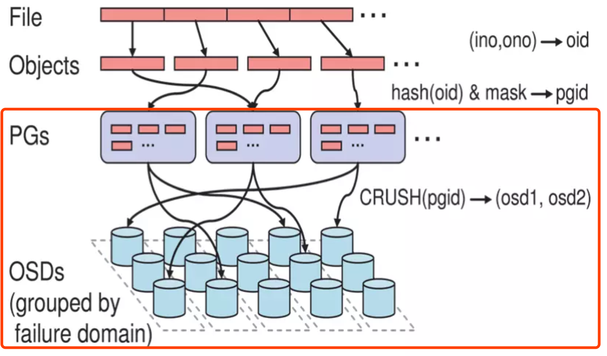

	- CRUSH(pgid)->(osd1,osd2,osd3)

然后主副本和其他副本就从这里选择对应的 osd，整体的伪代码流程为

	locator = object_name
	obj_hash =  hash(locator)
	pg = obj_hash % num_pg
	osds_for_pg = crush(pg)  # 返回一个 osds 的列表
	primary = osds_for_pg[0]
	replicas = osds_for_pg[1:]
	
### ceph 服务交互流程
#### 节点均正常情况下
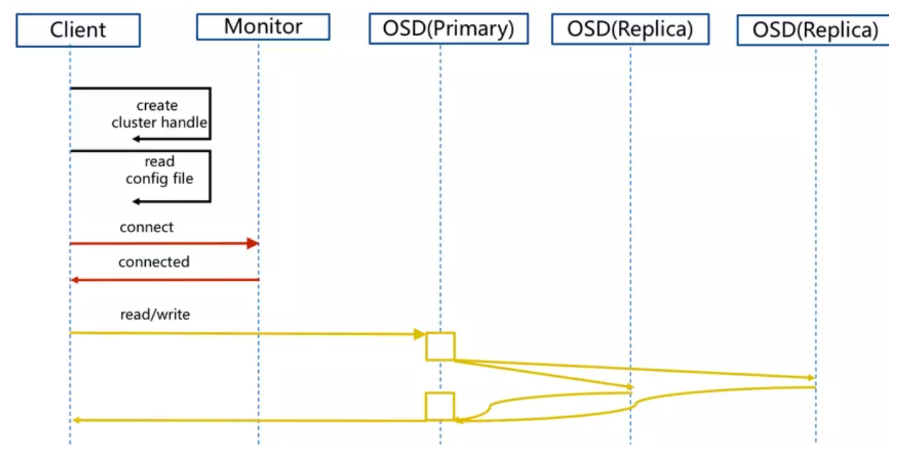

- client 创建 cluster handler(本机)
- client 读取配置文件(本机)
- client 连接上monitor，获取集群 map 信息
- client 读写io 根据 crushmap 算法请求对应的主 osd 数据节点
- 主 osd 数据节点同时写入另外两个副本节点数据
- 等待主节点以及另外两个副本节点写完数据状态
- 主节点及副本节点写入状态都成功后，返回给 client，io 写入完成

#### 主节点异常情况下
 

- client 连接 monitor 获取集群 map 信息
- 原主 osd4 异常，新主 osd1 代替，同时由于 osd1 没有 pg 数据会主动上报 monitor 告知让 osd2 临时接替为主
- 临时主 osd2 会把数据全量同步给新主 osd1
- client IO 读写直接连接临时主 osd2 进行读写
- osd2 收到读写 io，同时写入另外两副本节点
- 等待 osd2 以及另外两副本写入成功
- osd2 三份数据都写入成功返回给 client, 此时 client io 读写完毕
- 如果 osd1 数据同步完毕，临时主 osd2 会交出主角色
- osd1 成为主节点，osd2变成副本

### RBD 客户端写数据过程
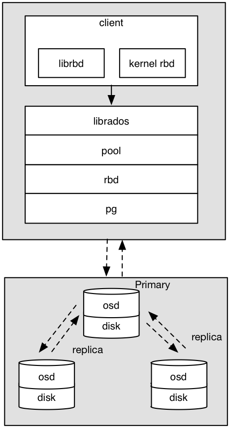 

1. 采用的是 librbd 的形式，使用 librbd 创建一个块设备，向这个块设备中写入数据
2. 在客户端本地同过调用 librados 接口，然后经过 pool，rbd，object、pg 进行层层映射,在 PG 层中，可知数据保存在哪 几个 OSD 上以及主从关系
3. 客户端与 primay OSD 建立 SOCKET 通信，将要写入的数据传给 primary OSD，由 primary OSD 再将数据发送给其他 replica OSD 数据节点
4. 所有数据节点写入完毕返回后，再返回给客户端正常

### RBD 服务端写入数据过程
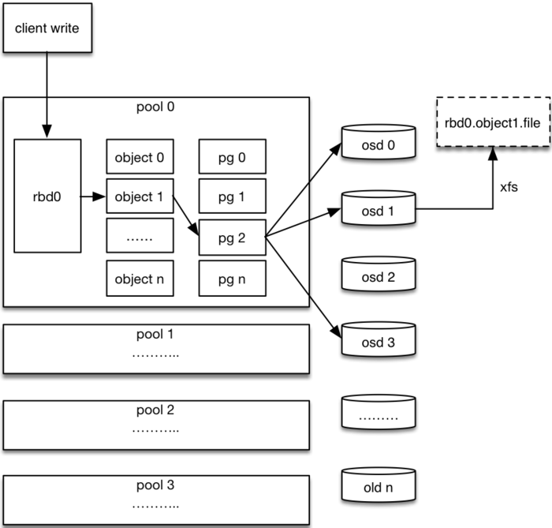 

1. 客户端创建一个 pool，需要为这个 pool 指定 pg 的数量
2. 创建 pool 中的 image rbd(图中rbd0) 设备进行挂载
3. 客户端对写入的文件进行切块(块默认大小为4M)，并且每个块都有一个名字，名字就是object+序号(ONO)
4. 将每个 object 数据块通过 pg 进行副本位置的分配
5. pg 根据 cursh 算法会寻找 3 个 osd，把这个 object 分别保存在这三个 osd 上，注意这里的 cursh 算法可以根据设备物理位置给出合理的分配规则，避开一台、一个机柜、一个机房区域高可用问题
6. osd 把底层的 disk 进行了格式化操作，一般部署工具会将它格式化为 xfs 文件系统
7. object 的存储就变成了存储一个文 rbd0.object1.file

### Pool 和 PG 分布情况
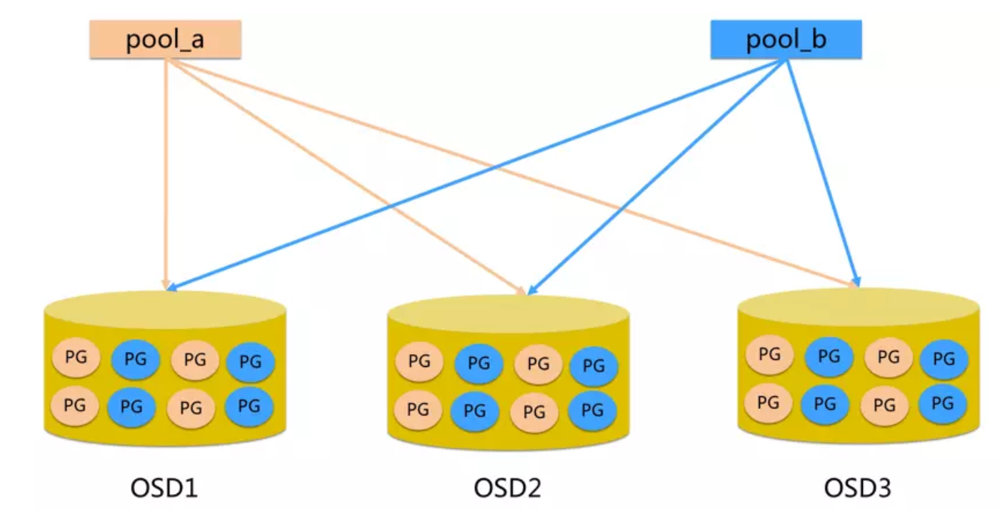

1. pool 是 ceph 存储数据时的逻辑分区，起 namespace 的作用
2. 每个 pool 包含一定数量的PG(可配置)
3. PG 里的对象被映射到不同的 Object 上
4. pool 里的数据分布到整个集群
5. pool 可以做障隔离域，根据不同的用户场景不一进行隔离

### OSD 扩容
- 扩容前

	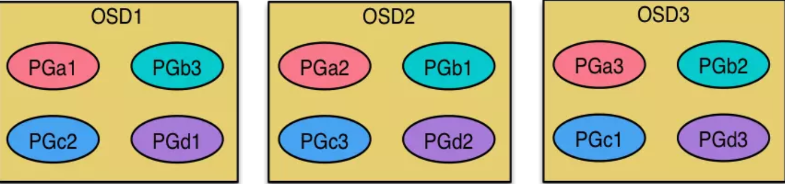
- 扩容后
	
	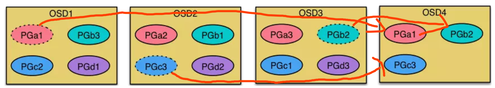

扩容 OSD 后，ceph 会均衡每个 osd 上的 PG 数量来达到压力平均分配。	

### Ceph CRUSH 算法
#### 需要解决的问题
- 数据分布和负载均衡
	1. 数据分布均衡

		使数据能均匀的分布到各个节点上
	2. 负载均衡

		使数据访问读写操作的负载在各个节点和磁盘的负载均衡
- 灵活应对集群伸缩
	1. 系统可以方便的增加或者删除节点设备，并且对节点失效进行处理
	2. 增加或者删除节点设备后，能自动实现数据的均衡，并且尽可能少的迁移数据
- 支持大规模集群
	1. 要求数据分布算法维护的元数据相对较小，并且计算量不能太大。随着集群规模的增加，数据分布算法开销相对比较小

#### Ceph CRUSH 算法说明
- CRUSH 算法的全称为：Controlled Scalable Decentralized Placement of Replicated Data，可控的、可扩展的、分布式的副本数据放置算法
- PG 到 OSD 的映射的过程算法叫做 CRUSH 算法。(一个 Object 需要保存三个副本，也就是需要保存在三个 osd 上)
- CRUSH 算法是一个伪随机的过程，它可以从所有的 OSD 中，随机性选择一个 OSD 集合，但是同一个 PG 每次随机选择的结果是不变的，也就是映射的 OSD 集合是固定的

#### Ceph CRUSH 算法原理
- CRUSH 算法因子
	- 层次化的 Cluster Map

		反映了存储系统层级的物理拓扑结构。定义了 OSD 集群具有层级关系的静态拓扑结构。OSD 层级使得 CRUSH 算法在选择 OSD 时实现了机架感知能力，也就是通过规则定义，使得副本可以分布在不同的机架、不同的机房中、提供数据的安全性。
		
		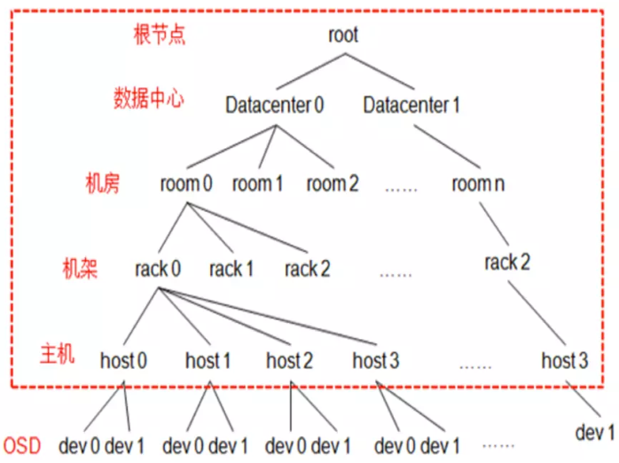
	
		CRUSH Map 是一个树形结构，OSDMap 更多记录的是 OSDMap 的属性(epoch/fsid/pool信息以及osd 的 ip 等等)。

		- 叶子节点
	
			就是最终的 OSD
		- bucket 节点

			bucket 是虚构的节点，可以根据物理结构进行抽象
		- root 节点

			树形结构只有一个最终的根节点称之为 root 节点，中间虚拟的 bucket 节点可以是数据中心抽象、机房抽象、机架抽象、主机抽象等
	- 数据分布策略 Placement Rules

		决定了一个 PG 的对象副本如何选择的规则，通过这些可以自己设定规则，用户可以自定义设置副本在集群中的分布。Placement Rules 主要有特点
		
		- 从 CRUSH Map 中的哪个节点开始查找
		- 使用那个节点作为故障隔离域
		- 定位副本的搜索模式
			- 广度优先
			- 深度优先
			
		配置规则
		
			rule replicated_ruleset  	  # 规则集的命名，创建 pool 时可以指定 rule 集
			{
			    ruleset 0                # rules 集的编号，顺序编即可   
			    type replicated          # 定义 pool 类型为 replicated (还有 erasure 模式)   
			    min_size 1               # pool 中最小指定的副本数量不能小 1
			    max_size 10              # pool 中最大指定的副本数量不能大于 10       
			    step take default        # 查找 bucket 入口点，默认是 root 类型的 bucket    
			    step chooseleaf  firstn  0  type  host # 选择一个 host,并递归选择叶子节点 osd     
			    step emit        		   # 结束
			}
	- Bucket 随机算法类型
		- 映射速度说明和添加或删除项目时不同桶类型的数据重组

			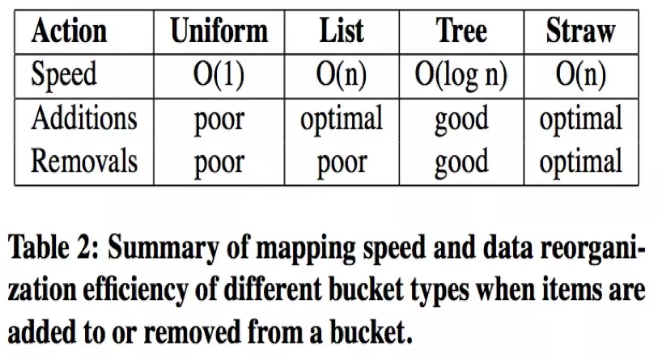
		
			- uniform
			
				一般桶 ,适合所有子节点权重相同，而且很少添加删除 item，时间复杂度最低
			- list	
				
				列表桶 ,适用于集群扩展类型。增加 item，产生最优的数据移动，查找item，时间复杂度 O(n)。
			- tree 
			
				树桶 ,添加删除叶子节点时，其他节点 node_id 不变,查找时间复杂度 O(log n)
			- straw 
		
				straw 桶 ,允许所有项通过类似抽签的方式来与其他项公平“竞争”。定位副本时，bucket 中的每一项都对应一个随机长度的 straw，且拥有最长长度的 straw 会获得胜利（被选中），添加或者重新计算，子树之间的数据移动提供最优的解决方案

#### Ceph CRUSH 算法案例
集群中有部分 sas 和 ssd 磁盘，现在有个业务线性能及可用性优先级高于其他业务线，让这个高优业务线的数据都存放在ssd磁盘上,如下图

- 普通用户

	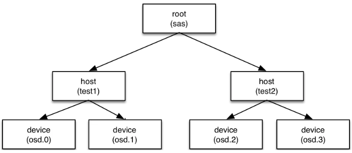
- 高优用户

	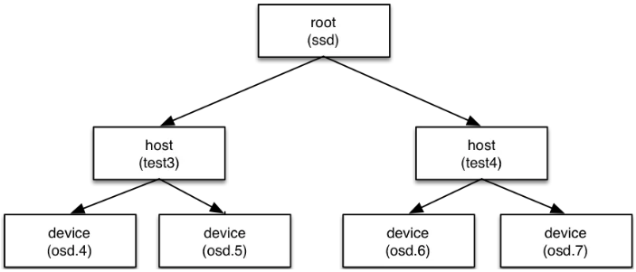

规则

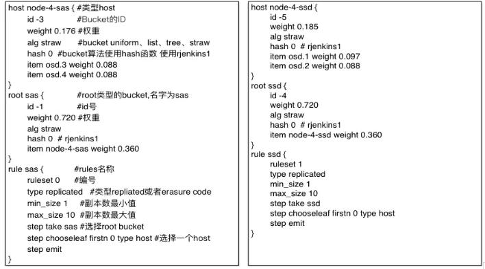

### 定制化 Ceph RBD QOS
#### QOS 介绍
QoS （Quality of Service，服务质量）起源于网络技术，它用来解决网络延迟和阻塞等问题，能够为指定的网络通信提供更好的服务能力。

Ceph集群的IO能力是有限的，比如带宽，IOPS。如何避免用户争取资源，如何保证集群所有用户资源的高可用性，以及如何保证高优用户资源的可用性。这里就需要引入 QOS。
#### Ceph IO 操作类型
- ClientOp

	来自客户端的读写 I/O 请求
- SubOp

	osd 之间的 I/O 请求，主要包括
	
	- 客户端 I/O 产生的副本间数据读写请求
	- 数据同步
	- 数据扫描
	- 负载均衡
	
	等引起的I/O请求。
- SnapTrim

	快照数据删除。从客户端发送快照删除命令后，删除相关元数据直接返回，之后由后台线程删除真实的快照数据。通过控制 snaptrim 的速率，间接控制删除速率。
- Scrub

	用于发现对象的静默数据错误，扫描元数据的 Scrub 和对象整体扫描的 deep Scrub。
- Recovery

	数据恢复和迁移、集群扩/缩容、osd失效/从新加入等过程。

#### 官方 QOS 原理
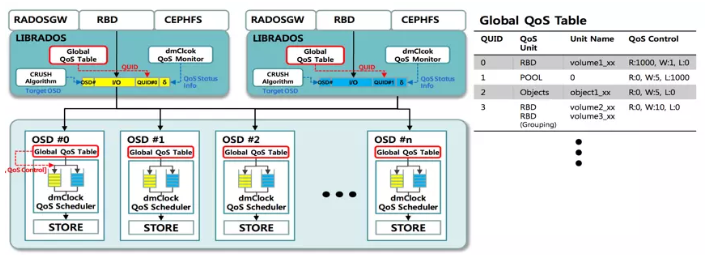
mClock 是一种基于时间标签的 I/O 调度算法，最先被 Vmware 提出来的用于集中式管理的存储系统。(目前官方QOS模块属于半成品)。

- 基本思想
	- reservation 预留

		表示客户端获得的最低I/O资源。
	- weight 权重

		表示客户端所占共享I/O资源的比重。
	- limit 上限

		表示客户端可获得的最高I/O资源。

#### 定制化QOS原理
- 令牌桶算法介绍

	基于令牌桶算法(TokenBucket)实现了一套简单有效的 qos 功能，满足了云平台用户的核心需求。

	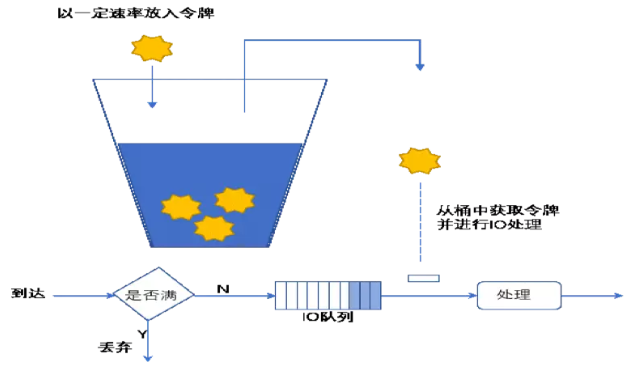
	
	- 基本思想
		- 按特定的速率向令牌桶投放令牌
		- 根据预设的匹配规则先对报文进行分类，不符合匹配规则的报文不需要经过令牌桶的处理，直接发送。
		- 符合匹配规则的报文，则需要令牌桶进行处理。当桶中有足够的令牌则报文可以被继续发送下去，同时令牌桶中的令牌量按报文的长度做相应的减少。
		- 当令牌桶中的令牌不足时，报文将不能被发送，只有等到桶中生成了新的令牌，报文才可以发送。这就可以限制报文的流量只能是小于等于令牌生成的速度，达到限制流量的目的。
	- 令牌桶工作流程
	
		
		
		- 客户端发起请求异步 IO 到达 Image
		- 请求到达 ImageRequestWQ 队列中
		- 在 ImageRequestWQ 出队列的时候加入令牌桶算法 TokenBucket
		- 通过令牌桶算法进行限速，然后发送给 ImageRequest 进行处理
	- 框架图
		- 现有算法

			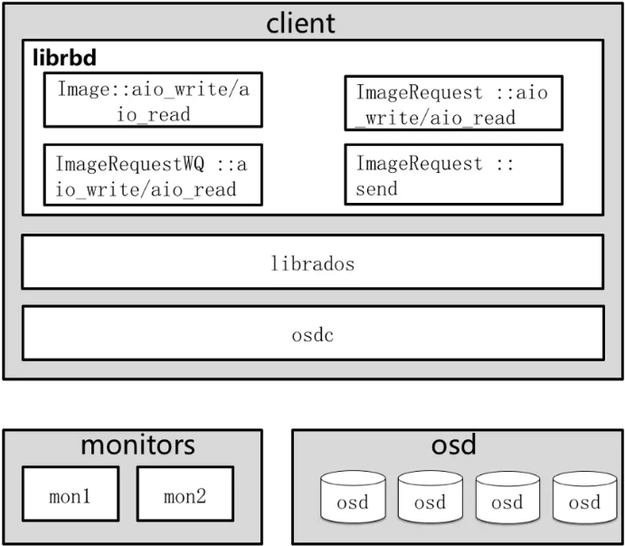
		- 令牌桶框架图

			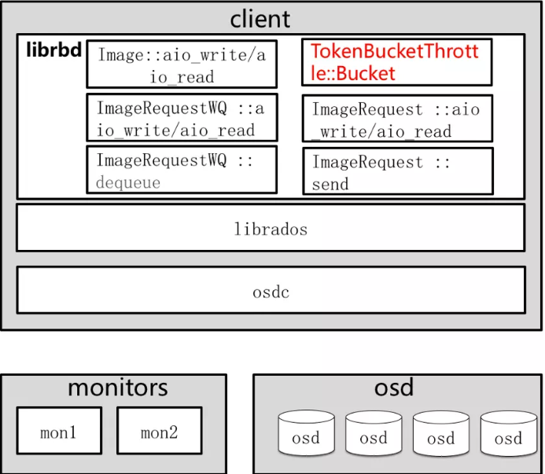

## 心跳机制
### 心跳介绍
心跳是用于节点间检测对方是否故障的，以便及时发现故障节点进入相应的故障处理流程。
### 需要解决问题
- 故障检测时间和心跳报文与系统负载之间做权衡
	- 频率太高则过多的报文会影响系统性能
	- 频率过低则会延长发现故障节点的时间，从而影响可用性

### 故障检测策略需要做到
- 及时

	节点发生异常如宕机或网络中断时，集群可以在可接受的时间范围内感知
- 适当的压力

	包括对节点和网络的压力不能太高
- 容忍网络抖动

	容忍网络偶尔延迟
- 扩散机制

	节点存活状态改变导致的元信息变化需要通过某种机制扩散到整个集群

### 检测端口说明	 
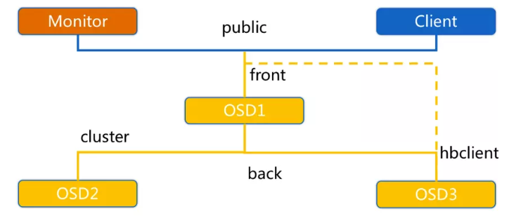
OSD节点会监听public、cluster、front和back四个端口

- public

	监听来自 Monitor 和 Client 的连接。
- cluster
	
	监听来自 OSD Peer 的连接。
- front

	供客户端连接集群使用的网卡, 这里临时给集群内部之间进行心跳。
- back

	供客集群内部使用的网卡。集群内部之间进行心跳。
- hbclient

	发送 ping 心跳的 messenger

### OSD之间相互心跳检测	
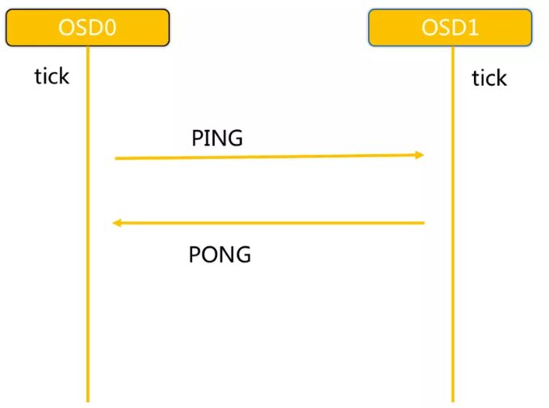

- 同一个 PG 内 OSD 互相心跳，OSD互相发送 PING/PONG 信息
- 每隔 6s 检测一次(实际会在这个基础上加一个随机时间来避免峰值)
- 20s 没有检测到心跳回复，加入 failure 队列

### OSD与Mon心跳检测
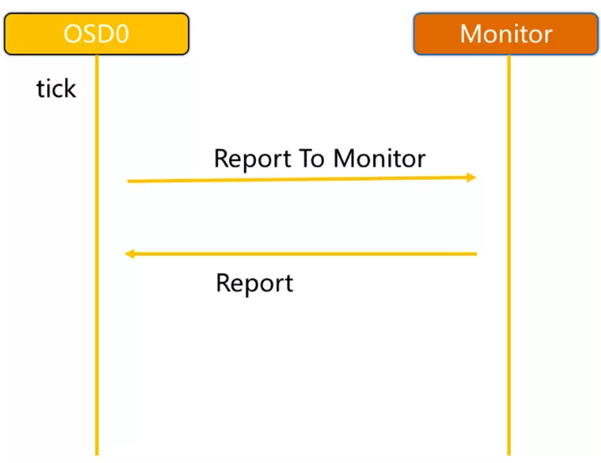
OSD 报告给 Monitor

- OSD 有事件发生时（比如故障、PG变更）
- 启动后 5 秒内
- OSD 周期性的上报给 Monito
	- OSD 检查 failure_queue 中的伙伴 OSD 失败信息
	- 向 Monitor 发送失效报告，并将失败信息加入 failure_pending 队列，然后将其从 failure_queue 移除。
	- 收到来自 failure_queue 或者 failure_pending 中的 OSD 的心跳时，将其从两个队列中移除，并告知 Monitor 取消之前的失效报告。
	- 当发生与 Monitor 网络重连时，会将 failure_pending 中的错误报告加回到 failure_queue 中，并再次发送给 Monitor。
- Monitor 统计下线 OSD
	- Monitor 收集来自 OSD 的伙伴失效报告
	- 当错误报告指向的 OSD 失效超过一定阈值，且有足够多的 OSD 报告其失效时，将该 OSD 下线

### 心跳检测总结
通过伙伴 OSD 汇报失效节点和 Monitor 统计来自 OSD 的心跳两种方式判定 OSD 节点失效。

- 及时性

	伙伴 OSD 可以在秒级发现节点失效并汇报 Monitor，并在几分钟内由 Monitor 将失效 OSD 下线。
- 适当的压力

	由于有伙伴 OSD 汇报机制，Monitor 与 OSD 之间的心跳统计更像是一种保险措施，因此 OSD 向 Monitor 发送心跳的间隔可以长达600秒，Monitor 的检测阈值也可以长达900秒。Ceph 实际上是将故障检测过程中中心节点的压力分散到所有的 OSD 上，以此提高中心节点 Monitor 的可靠性，进而提高整个集群的可扩展性。
- 容忍网络抖动

	Monitor 收到 OSD 对其伙伴 OSD 的汇报后，并没有马上将目标 OSD 下线，而是周期性的等待几个条件
	
	- 目标 OSD 的失效时间大于通过固定量 osd_heartbeat_grace 和历史网络条件动态确定的阈值
	- 来自不同主机的汇报达到 mon_osd_min_down_reporters
	- 满足前两个条件前失效汇报没有被源 OSD 取消
- 扩散
	
	作为中心节点的 Monitor 并没有在更新 OSDMap 后尝试广播通知所有的 OSD 和 Client，而是惰性的等待 OSD 和 Client 来获取。以此来减少 Monitor 压力并简化交互逻辑。

## 通信框架
### 通信框架种类介绍
网络通信框架三种不同的实现方式

- Simple 线程模式
	- 特点

		每一个网络链接，都会创建两个线程，一个用于接收，一个用于发送
	- 缺点

		大量的链接会产生大量的线程，会消耗CPU资源，影响性能
- Async 事件的 I/O 多路复用模式
	- 特点

		这种是目前网络通信中广泛采用的方式。k版默认已经使用 Asnyc 了。
- XIO 方式使用了开源的网络通信库 accelio 来实现
	- 特点

		这种方式需要依赖第三方的库 accelio 稳定性，目前处于试验阶段。

### 通信框架设计模式(Subscribe/Publish)
订阅发布模式又名观察者模式，它意图是 “定义对象间的一种一对多的依赖关系，当一个对象的状态发生改变时，所有依赖于它的对象都得到通知并被自动更新”。

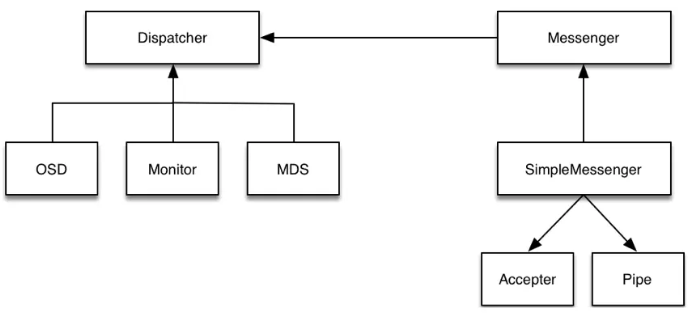
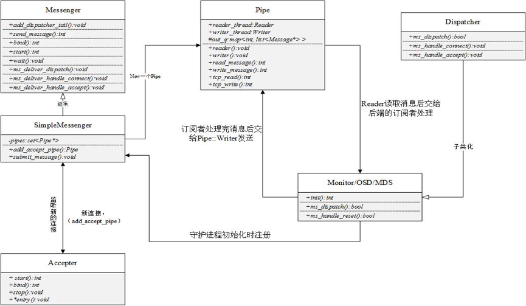

- Accepter 监听 peer 的请求, 调用 SimpleMessenger::add_accept_pipe() 创建新的 Pipe 到 SimpleMessenger::pipes 来处理该请求。
- Pipe 用于消息的读取和发送。该类主要有两个组件，Pipe::Reader，Pipe::Writer 用来处理消息读/发。
- Messenger 作为消息的发布者, 各个 Dispatcher 子类作为消息的订阅者, Messenger 收到消息之后，通过 Pipe 读取消息，然后转给 Dispatcher 处理。
- Dispatcher 是订阅者的基类，具体的订阅后端继承该类,初始化的时候通过 Messenger::add_dispatcher_tail/head 注册到 Messenger::dispatchers. 收到消息后，通知该类处理。
- DispatchQueue 类用来缓存收到的消息, 然后唤醒 DispatchQueue::dispatch_thread 线程找到后端的 Dispatch 处理消息。

### 通信数据格式
通信协议格式需要双方约定数据格式。消息的内容主要分为三部分：

- header //消息头类型消息的信封
- user data //需要发送的实际数据
	- payload     //操作保存元数据
	- middle      //预留字段
	- data       //读写数据
- footer       //消息的结束标记

代码

	class Message : public RefCountedObject {
	protected:
	  ceph_msg_header  header;      // 消息头
	  ceph_msg_footer  footer;      // 消息尾
	  bufferlist       payload;  // "front" unaligned blob
	  bufferlist       middle;   // "middle" unaligned blob
	  bufferlist       data;     // data payload (page-alignment will be preserved where possible)
	
	  /* recv_stamp is set when the Messenger starts reading the
	   * Message off the wire */
	  utime_t recv_stamp;       //开始接收数据的时间戳
	  /* dispatch_stamp is set when the Messenger starts calling dispatch() on
	   * its endpoints */
	  utime_t dispatch_stamp;   //dispatch 的时间戳
	  /* throttle_stamp is the point at which we got throttle */
	  utime_t throttle_stamp;   //获取throttle 的slot的时间戳
	  /* time at which message was fully read */
	  utime_t recv_complete_stamp;  //接收完成的时间戳
	
	  ConnectionRef connection;     //网络连接
	
	  uint32_t magic = 0;           //消息的魔术字
	
	  bi::list_member_hook<> dispatch_q;    //boost::intrusive 成员字段
	};
	
	struct ceph_msg_header {
	    __le64 seq;       // 当前session内 消息的唯一 序号
	    __le64 tid;       // 消息的全局唯一的 id
	    __le16 type;      // 消息类型
	    __le16 priority;  // 优先级
	    __le16 version;   // 版本号
	
	    __le32 front_len; // payload 的长度
	    __le32 middle_len;// middle 的长度
	    __le32 data_len;  // data 的 长度
	    __le16 data_off;  // 对象的数据偏移量
	
	
	    struct ceph_entity_name src; //消息源
	
	    /* oldest code we think can decode this.  unknown if zero. */
	    __le16 compat_version;
	    __le16 reserved;
	    __le32 crc;       /* header crc32c */
	} __attribute__ ((packed));
	
	struct ceph_msg_footer {
	    __le32 front_crc, middle_crc, data_crc; //crc校验码
	    __le64  sig; //消息的64位signature
	    __u8 flags; //结束标志
	} __attribute__ ((packed));

## 参考
- [Ceph介绍及原理架构分享](https://www.jianshu.com/p/cc3ece850433)

	- 计算 PG 的 ID
		1. Client 输入 pool ID 和对象 ID（如pool=‘liverpool’，object-id=‘john’）
		2. CRUSH 获得对象 ID 并对其 hash
		3. CRUSH 计算 OSD 个数 hash 取模获得 PG 的 ID（如 0x58）
		4. CRUSH 获得已命名 pool 的 ID（如 liverpool=4）
		5. CRUSH 预先考虑到 pool ID 相同的 PG ID（如4.0x58）

 
