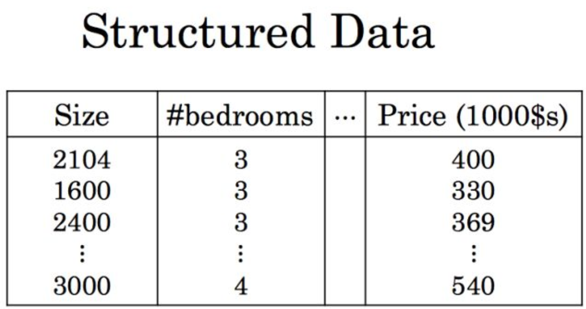
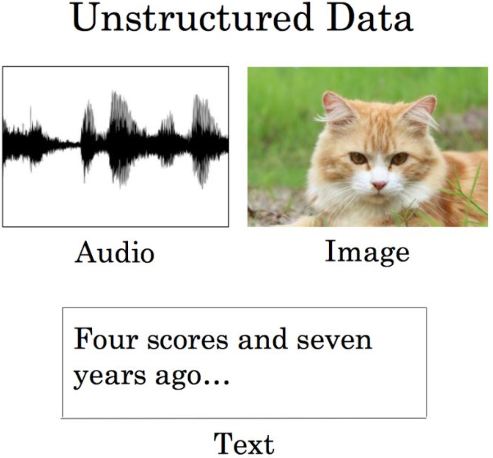

# 存储类型的区别
## 结构化数据和非结构化数据的区别
- 结构化数据

	结构化数据是数据的数据库(即行数据,存储在数据库里,可以用二维表结构来逻辑表达实现的数据)，可以清楚的看到存储在数据库中的数据，每一个列都有具体的含义。
	
	
- 非结构化数据

	非结构化数据,包括所有格式的办公文档、文本、图片、XML、HTML、各类报表、图像和音频/视频信息等等，非结构数据与结构化数据相比较而言，更难让计算机理解。
	
		
	
## 块存储
块存储主要用于存储结构化数据，在相对小的容量空间上可以提供更高的 IO 性能，所以从后端存储产品形态上来看，一般是多控多活的紧耦合集中式 SAN 架构，存储介质大多采用高速的 SAS 和近年来已成主流的固态硬盘，前端多采用 FC 光纤协议组网，另外，存储双活、存储虚拟化、存储复制等技术也支撑着这块的生态。

块存储使用方法主要是将裸磁盘空间整个映射给主机使用的，就是说例如磁盘阵列里面有5块硬盘（为方便说明，假设每个硬盘1G），然后可以通过划逻辑盘、做Raid、或者LVM（逻辑卷）等种种方式逻辑划分出N个逻辑的硬盘。（假设划分完的逻辑盘也是5个，每个也是1G，但是这5个1G的逻辑盘已经于原来的5个物理硬盘意义完全不同了。例如第一个逻辑硬盘A里面，可能第一个200M是来自物理硬盘1，第二个200M是来自物理硬盘2，所以逻辑硬盘A是由多个物理硬盘逻辑虚构出来的硬盘。）

块存储会采用映射的方式将这几个逻辑盘映射给主机，主机上面的操作系统会识别到有5块硬盘，但是操作系统是区分不出到底是逻辑还是物理的，它一概就认为只是5块裸的物理硬盘而已，跟直接拿一块物理硬盘挂载到操作系统没有区别的，至少操作系统感知上没有区别。

此种方式下，操作系统还需要对挂载的裸硬盘进行分区、格式化后，才能使用，与平常主机内置硬盘的方式完全无异。

- 典型设备
	- 磁盘阵列
	- 硬盘
	- SAN 
- 存储接口

	这种接口通常以 QEMU Driver 或者 Kernel Module 的方式存在，这种接口需要实现 Linux 的 Block Device 的接口或者QEMU 提供的 Block Driver 接口，如AWS的EBS，iscsi 还有Ceph的RBD（RBD 是 Ceph 面向块存储的接口）

### 优点
- 这种方式的好处是因为通过了 Raid 与 LVM 等手段，对数据提供了保护。
- 另外也可以将多块廉价的硬盘组合起来，成为一个大容量的逻辑盘对外提供服务，提高了容量。
- 写入数据的时候，由于是多块磁盘组合出来的逻辑盘，所以几块磁盘可以并行写入的，提升了读写效率。
- 很多时候块存储采用 SAN 架构组网，传输速率以及封装协议的原因，使得传输速度与读写速率得到提升。

### 缺点
- 采用 SAN 架构组网时，需要额外为主机购买光纤通道卡，还要买光纤交换机，造价成本高。
- 主机之间的数据无法共享，在服务器不做集群的情况下，块存储裸盘映射给主机，再格式化使用后，对于主机来说相当于本地盘，那么主机 A 的本地盘根本不能给主机 B 去使用，无法共享数据。
- 不利于不同操作系统主机间的数据共享：另外一个原因是因为操作系统使用不同的文件系统，格式化完之后，不同文件系统间的数据是共享不了的。例如一台装了 WIN7/XP，文件系统是 FAT32/NTFS，而 Linux 是 EXT4，EXT4 是无法识别 NTFS 的文件系统的。就像一只 NTFS 格式的U盘，插进 Linux 的笔记本，根本无法识别出来。所以不利于文件共享。

## 文件存储
主要是集中式或分布式的 NAS 类应用，以灵活的共享文件系统为特色(主要解决文件共享问题)，承载百万文件量和TB级别的文件类应用。

文件存储也有软硬一体化的设备，也可以直接装在普通的操作系统中。数据管理与块存储不同，上传客户端是不需要再对文件存储进行格式化的，因为文件管理功能已经由文件存储自己搞定了。

- 典型设备
	- NAS(硬件)
	- NFS
	- GFS
- 存储接口

	通常意义是支持 POSIX 接口，它跟传统的文件系统如 Ext4 是一个类型的，但区别在于分布式存储提供了并行化的能力。如 NFS ,glusterfs

### 优点
- 造价交低

	随便一台机器就可以了，另外普通以太网就可以，根本不需要专用的 SAN 网络，所以造价低。
- 方便文件共享

	例如主机 A（WIN7，NTFS文件系统），主机 B（Linux，EXT4文件系统），想互拷一部电影，本来不行。加了个主机C（NFS服务器），然后可以先A拷到C，再C拷到B就OK了。（例子比较肤浅，请见谅……）
	
### 缺点
- 读写速率低，传输速率慢

	以太网，上传下载速度较慢，另外所有读写都要单点硬盘来承担，相比起磁盘阵列动不动就几十上百块硬盘同时读写，速率慢了许多。

## 对象存储
对象存储特定行业的海量非结构化数据的应用场景。由于对象存储采用扁平的文件组织方式，所以在文件量上升至千万、亿级别，容量在PB级别的时候，这种文件组织方式下的性能优势就显现出来了，文件不在有目录树深度的问题，历史和近线数据有同样的访问效率。另外，对象存储多采用分布式架构，可以在商用x86服务器上轻松构建对象存储，磁盘介质也大多采用低速的 SATA 盘，所以在成本上也具优势。

差别对象存储实际上更贴近http的应用。文件存储通常需要一个app 的服务器将文件存储挂载到本地。

- 典型设备
	- S3
- 存储接口

	也就是通常意义的键值存储，其接口就是简单的 GET、PUT、DEL 和其他扩展，典型 aws S3

对象存储最常用的方案，就是多台服务器内置大容量硬盘，再装上对象存储软件，然后再额外搞几台服务作为管理节点，安装上对象存储管理软件。管理节点可以管理其他服务器对外提供读写访问功能。出现了对象存储本质原因是为了克服块存储与文件存储各自的缺点，发扬它俩各自的优点，当然还有海量数据共享的问题。

- 块存储
	- 读写快
	- 不利于共享
	- 扩展能力弱
- 文件存储
	- 读写慢
	- 利于共享
	- 扩展能力弱
- 对象存储
	- 学写块
	- 利于共享 
	- 扩展能力强

### 原理
### 文件存储原理
首先，一个文件包含了属性（术语叫 metadata，元数据，例如该文件的大小、修改时间、存储路径等）以及内容（以下简称数据）。像 FAT32 这种文件系统，是直接将一份文件的数据与 metadata 一起存储，存储过程是

- 先将文件按照文件系统的最小块大小来打散（如 4M 的文件，假设文件系统要求一个块 4K，那么就将文件打散成为1000 个小块）
- 再写进硬盘里面，过程中不区分 `/metadata` 数据。而每个块最后会告知下一个要读取的块的地址
- 然后一直这样顺序地按图索骥，最后完成整份文件的所有块的读取。
	
	这种情况下读写速率很慢，因为就算有 100 个机械手臂在读写，但是由于只有读取到第一个块，才能知道下一个块在哪里，其实相当于只能有1个机械手臂在实际工作。

### 对象存储原理
对象存储则将元数据独立了出来

- 控制节点叫元数据服务器（服务器+对象存储管理软件），里面主要负责存储对象的属性（主要是对象的数据被打散存放到了那几台分布式服务器中的信息）
- 而其他负责存储数据的分布式服务器存储节点，cehp 中叫做 OSD，主要负责存储文件的数据部分。

### 优点
#### 性能问题
- 当用户访问对象时，会先访问元数据服务器，元数据服务器只负责反馈对象存储在哪些存储节点中，假设反馈文件 A 存储在 B、C、D 三台，那么用户就会再次直接访问3台服务器去读取数据。

- 这时因为响应服务器变成了 3 台，所以 3 台存储服务器同时对外传输数据，传输的速度对比文件存储自然就快了。当存储服务器数量越多，这种读写速度的提升就越大，通过此种方式，实现了读写快的目的。

#### 共享问题
另一方面，对象存储软件是有专门的文件系统的，所以数据服务器对外又相当于文件服务器，那么就不存在文件共享方面的困难了，也解决了文件共享方面的问题。所以对象存储的出现，很好地结合了块存储与文件存储的优点。

### 缺点
最后为什么对象存储兼具块存储与文件存储的好处，还要使用块存储或文件存储呢？

- 有一类应用是需要存储直接裸盘映射的，例如数据库。因为数据库需要存储裸盘映射给自己后，再根据自己的数据库文件系统来对裸盘进行格式化的，所以是不能够采用其他已经被格式化为某种文件系统的存储的。此类应用更适合使用块存储。
- 对象存储的成本比起普通的文件存储还是较高，需要购买专门的对象存储软件以及大容量硬盘。如果对数据量要求不是海量，只是为了做文件共享的时候，直接用文件存储的形式好了，性价比高。

## 参考
- [机器学习算法与自然语言处理](https://zhuanlan.zhihu.com/p/29856645)
- [对象存储和文件存储究竟有哪些区别？](https://cloud.tencent.com/developer/news/337397)