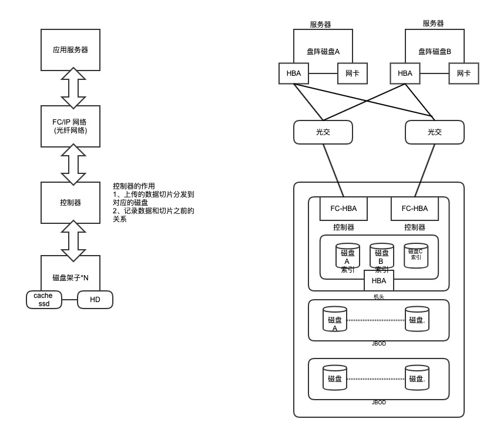
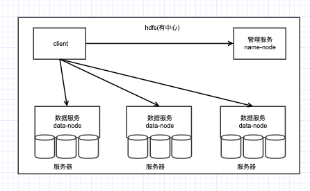
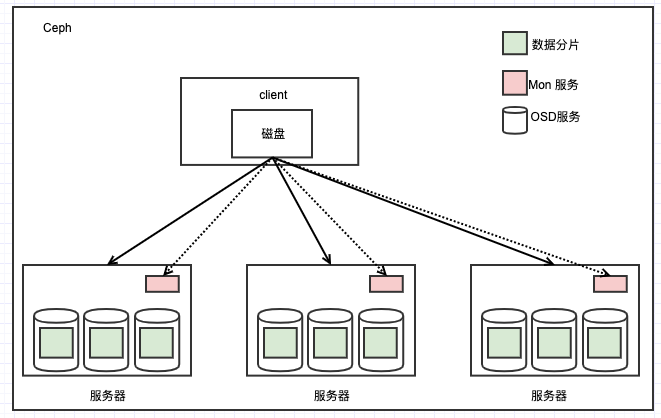
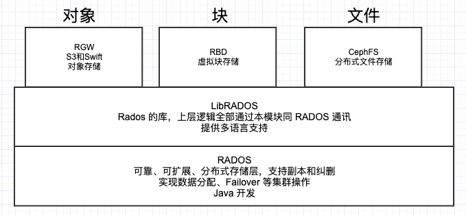
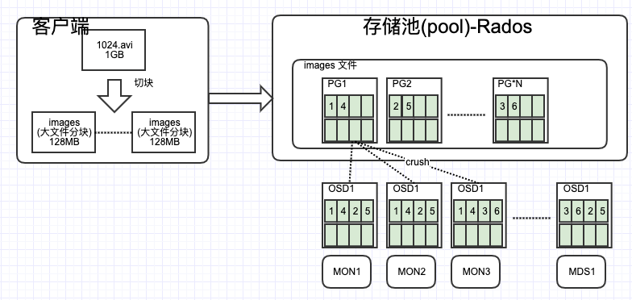
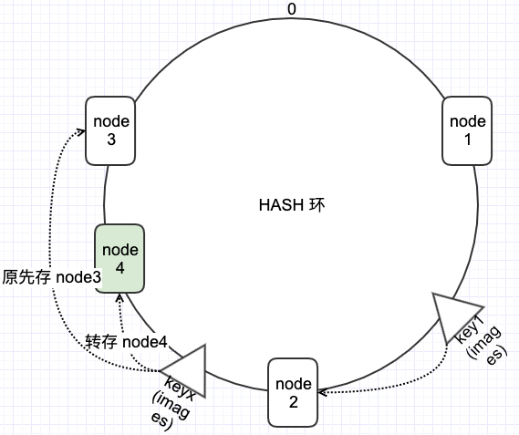
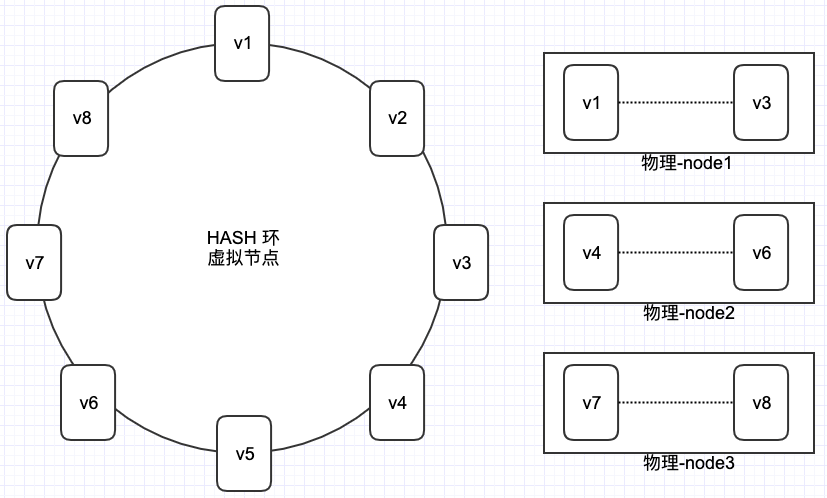

# 存储架构分析 
## 传统存储
### NAS
- 协议类型
	- NFS
	- CIFS
- 优点
	- 使用简单
	- 可以使用 IP 协议实现相互访问，多机同时共享相同存储
- 劣势
	- 性能有限
	- 可靠性低
	- 不可扩展
	     
### SAN
#### 架构
传统存储通过物理硬件控制器+磁盘柜+光纤组成

#### 传统存储优劣
- 协议类型
	- IP-SAN
	- FC-SAN 
- 优点
	- 性能好
	- 可以扩展
	- 数据可靠性高
	- 架构经受住考验
	- 统一入口
- 劣势
	- 计算力瓶颈
		- 控制器数量有限: 几十个
	- cache 瓶颈 
	- 总带宽瓶颈
		-  100 GB
	- 价格太贵  

## 分布式存储
包含很多存储，HDFS,FastDFS,swift,Cehp
### 有中心

- HDFS(Java 开发)
	- namenode(元数据节点)
		- 数据打散的规则 
	- datanode (据节点)
		- 数据存储的节点 
	- 客户端分片？切割 128 MB
	- 3副本
	- 优缺点
		- 缺点
			- namenode 就不能读写数据
		- 优点
			- 结构简单易于维护
		   
### 无中心

- Ceph( 底层是 Java 开发)
	-  协议类型
		- S3
		- 原生 put/get   
	- 优缺点
		- 缺点
			- 不支持 win
			- 只有
		- 优点
			- 扩展性极强 
			- 并发性能好
			- 可以简单的通过 put 和 get 实现上下传
	- 服务层架构 

		
		
		- mon
			- 监控节点，数据分布规则, 监控 osd 故障、容量等
			- 高可用是主备机制(paxos算法选举) 
		- osd
			- 数据存储节点
			- 一个硬盘一个 osd
		- mds(ceph fs)
			- 存放文件元数据服务？
		- 客户端
			- 通过哈希环下发数据
			- 直接和 osd 通讯
		- images
			- 客户端将大文件切分数据块(images = 128MB)
		- PG
			- 虚拟硬盘块,通过 crush 算法将数据分发到对应的物理磁盘
			- 每个 PG 包含多个物理磁盘
		- 算法
			- crush 算法

				
			
				- 一致性 hash 算法，通过16 进制值 hash 结果
					- 建立集群步骤
						- 构造一个 0-2的32次方-1 的数据空间，首尾相连(哈希环)
						- 将节点的名字？进行 hash 计算,结果匹配到 hash 环中
							- 节点入哈希环的方法 
						- 将每个数据进行 hash 得到值为 key，key 落入 hash 环后，数据将存储到匹配对应 hash 环之后(正循环)的节点        
							- 数据落 hash 环的方法
					- 新增节点
						- 新增节点添加后同方法插入到 hash 环中
						- 新插入节点后和环中遇到第一个存在节点之间的数据，需要从原节点转存到新节点上
					- 删除节点
						- 存在和新增节点一样的问题，但是是从删除节点的数据迁入到之前的节点
					- 存在问题
						- 物理节点 hash 结果并不能均匀的分配 hash 环的空间，可能导致某些节点环空间分配多，某些节点环分配空间少
							- 解决方案
								- 提供虚拟节点
								
									
									
									- 一台服务里服务器对应1个或者多个虚拟节点，可根据不同的物理节点所提供的硬盘大小来确定虚拟节点和物理节点的对应关系。            
	
	