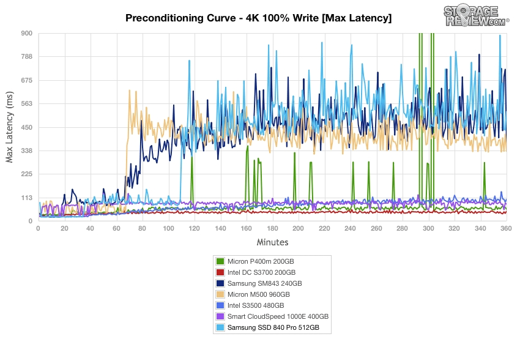

# 磁盘性能指标--IOPS、吞吐量及测试
## 问题
使用阿里云跑我们自己存储的时候发现在单目录文件数据超过一定数量(几百万，虽然是分层目录)，对该目录操作性能持续下降。但系统和阿里云给的 IOPS 监控并没有跑满。所以需要找到问题根源，进行解决。预计和存储的随机 IOPS 性能有关。
## 什么是 IOPS
IOPS (Input/Output Per Second) 即每秒的输入输出量(或读写次数)，是衡量磁盘性能的主要指标之一。IOPS 指单位时间内系统能处理的 I/O 请求数量，一般以每秒处理的 I/O 请求数量为单位，I/O 请求通常为读或写数据操作请求。

随机读写频繁的应用，如小文件存储(图片)、OLTP 数据库、邮件服务器，关注随机读写性能，IOPS 是关键衡量指标。

顺序读写频繁的应用，传输大量连续数据，如电视台的视频编辑，视频点播VOD(Video On Demand)，关注连续读写性能。数据吞吐量是关键衡量指标。

IOPS 和数据吞吐量适用于不同的场合：

- 读取10000个1KB文件，用时10秒  Throught(吞吐量)=1MB/s ，IOPS=1000  追求IOPS
- 读取1个10MB文件，用时0.2秒  Throught(吞吐量)=50MB/s, IOPS=5  追求吞吐量

## HD 说明
### 基础知识
传统磁盘本质上一种机械装置，如 FC, SAS, SATA 磁盘，转速通常为 5400/7200/10K/15K rpm 不等。影响磁盘的关键因素是磁盘服务时间，即磁盘完成一个 I/O 请求所花费的时间，它由寻道时间、旋转延迟和数据传输时间三部分构成。

- 寻道时间 Tseek 

	指将读写磁头移动至正确的磁道上所需要的时间。寻道时间越短，I/O 操作越快，目前磁盘的平均寻道时间一般在 3－15ms。
	
	常见磁盘平均物理寻道时间为：
	
	磁盘类型|磁盘转速(rpm)|寻道时间(ms)
	---|---|---|---|---|---|
	sata|7200|9
	sata|10000|6
	sas|15000|4
- 旋转延迟 Trotation

	指盘片旋转将请求数据所在扇区移至读写磁头下方所需要的时间。旋转延迟取决于磁盘转速，通常使用磁盘旋转一周所需时间的1/2表示。比如，7200 rpm 的磁盘平均旋转延迟大约为60*1000/7200/2 = 4.17ms，而转速为 15000 rpm 的磁盘其平均旋转延迟为 2ms。
	
	硬盘旋转延迟时间为：

	磁盘转速(rpm)|延迟计算公式(ms)
	---|---|---|---|---|---|
	7200 | 60*1000/7200/2 = 4.17
	10000 | 60*1000/10000/2 = 3
	15000 | 60*1000/15000/2 = 2
	
- 数据传输时间 Ttransfer

	指完成传输所请求的数据所需要的时间，它取决于数据传输率，其值等于数据大小除以数据传输率。目前 IDE/ATA 能达到 133MB/s，SATA II 可达到 300MB/s 的接口数据传输率，数据传输时间通常远小于前两部分消耗时间。简单计算时可忽略。

### HD 最大 IOPS 的理论计算方法
- 公式

		IOPS = 1000 ms/ (寻道时间 + 旋转延迟)。可以忽略数据传输时间。
		
	磁盘转速(rpm) | IOPS
	---|---|---|---|---|---|
	7200 | 1000 / (9 + 4.17)  = 76
	10000 | 1000 / (6+ 3) = 111
	15000 | 1000 / (4 + 2) = 166

## IOPS 测试说明
### 影响测试的因素
实际测量中，IOPS 数值会受到很多因素的影响，包括 I/O 负载特征(读写比例，顺序和随机，工作线程数，队列深度，数据记录大小)、系统配置、操作系统、磁盘驱动等等。因此对比测量磁盘 IOPS 时，必须在同样的测试基准下进行，即便如此也会产生一定的随机不确定性。

- 队列深度说明 NCQ、SCSI TCQ、PATA TCQ和SATA TCQ技术解析 

	是一种命令排序技术，一次给设备更多的IO请求，让电梯算法和设备有机会来安排合并以及内部并行处理，提高总体效率。

	- SCSI TCQ 的队列深度支持256级
	- ATA TCQ 的队列深度支持32级 （需要8M以上的缓存）
	- NCQ 最高可以支持命令深度级数为32级，NCQ可以最多对32个命令指令进行排序。
    
    大多数的软件都是属于同步 I/O 软件，也就是说程序的一次 I/O 要等到上次 I/O 操作的完成后才进行，这样在硬盘中同时可能仅只有一个命令，也是无法发挥这个技术的优势，这时队列深度为1。
    
    随着 Intel 的超线程技术的普及和应用环境的多任务化，以及异步 I/O 软件的大量涌现。这项技术可以被应用到了，实际队列深度的增加代表着性能的提高。在测试时，队列深度为1是主要指标，大多数时候都参考1就可以。实际运行时队列深度也一般不会超过4.

### IOPS 可细分为如下6个指标
- 数据量为 n 字节，队列深度为 k 时，随机读取的 IOPS
- 数据量为 n 字节，队列深度为 k 时，随机写入的 IOPS

## 存储系统模型	
为了更好的测试，需要先了解存储系统，块存储系统本质是一个排队模型
### 比喻
1. 去前台取单号
2. 等待排在之前的人办完业务
3. 轮到你去某个柜台
4. 柜台职员帮你办完手续1
5. 柜台职员帮你办完手续2
6. 柜台职员帮你办完手续3
7. 办完业务，从柜台离开

如何评估银行的效率呢：

- 服务时间 = 手续1 + 手续2 + 手续3
- 响应时间 = 服务时间 + 等待时间
- 性能 = 单位时间内处理业务数量

那银行如何提高效率呢:

- 增加柜台数
- 降低服务时间

因此，排队系统或存储系统的优化方法是

- 增加并行
- 降低服务时间

### 硬盘原理
应该如何测试 HD 硬盘

- 每个硬盘都有一个磁头(相当于银行的柜台)，硬盘的工作方式是
- 收到 IO 请求，得到地址和数据大小
- 移动磁头(寻址)
- 找到相应的磁道(寻址)
- 读取数据
- 传输数据

则磁盘的随机IO服务时间:

	服务时间 = 寻道时间 + 旋转时间 + 传输时间

对于 10000 转速 HD 硬盘来说

- 寻道时间是7 ms
- 旋转时间是3 ms
- 64KB传输时间是 0.8 ms

		SATA硬盘每秒可以进行随机IO操作是 1000/(7 + 3 + 0.8) = 93
所以估算硬盘 64KB 随机写的 IOPS 是 93 一般的硬盘厂商都会标明顺序读写的 MBPS。

在列出 IOPS 时，需要说明 IO 大小，寻址空间，读写模式，顺序/随机，队列深度。一般常用的 IO 大小是 4KB，这是因为文件系统常用的块大小是 4KB

### 什么是磁盘的队列深度？
#### 使用 dd 实验

- 使用dd命令来测量磁盘写速度

		dd if=/dev/zero of=/tmp/test1.img bs=1G count=1 oflag=dsync
- 使用dd命令测量磁盘延迟 

		dd if=/dev/zero of=/tmp/test2.img bs=512 count=1000 oflag=dsync
- 参数说明
	- if=/dev/zero (if=/dev/input.file) 

		输入文件名 
	- of=/tmp/test1.img (of=/path/to/output.file)

		输出文件的名字 
	- bs=1G (bs=block-size) 

		读取的块的大小。例子中为1个G。 
	- count=1 (count=number-of-blocks)

		读取的块的个数。 
	- oflag=dsync

		可选参数包含(sync/dsync)，是真正的每写一次就写一次磁盘
		
		- dsync 

			对数据使用同步的 I/O。 对于输出文件，这将强制在每次写入时对输出数据进行物理磁盘写入。 对于输入文件，当从某个其他进程已同步写入的远程文件中读取该标志时可能很重要。
		- sync

			不光写数据，还写元数据，也是强制写硬件
	- conv=fsync

		在dd结束前会写到磁盘，并不是每次都写

对于测试工具来说如何得到 IOPS 和 MBPS 峰值。先用 dd 测试一下 SATA 硬盘的 MBPS(吞吐量)。
		
			#dd if=/dev/zero of=/tmp/test1.img bs=4k count=300000 oflag=direct
			记录了300000+0 的读入 记录了300000+0 的写出 1228800000字节(1.2 GB)已复制，17.958 秒，68.4 MB/秒
			
			#iostat -x sdd 5 10
			...
			Device: rrqm/s wrqm/s r/s w/s rsec/s wsec/s avgrq-sz avgqu-sz await svctm %util
			sdd 0.00 0.00 0.00 16794.80 0.00 134358.40 8.00 0.79 0.05 0.05 78.82... 
为什么这块硬盘的 MBPS 只有 68MB/s? 这是因为磁盘利用率是 78%，没有到达 95% 以上，还有部分时间是空闲的。当 dd 在前一个 IO 响应之后，在准备发起下一个 IO 时，SATA 硬盘是空闲的。那么如何才能提高利用率，让磁盘不空闲呢？只有一个办法，那就是增加硬盘的队列深度。相对于 CPU 来说，硬盘属于慢速设备，所有操作系统会有给每个硬盘分配一个专门的队列用于缓冲 IO 请求

#### 队列深度说明
在某个时刻,有 N 个 inflight 的 IO 请求,包括在队列中的 IO 请求、磁盘正在处理的 IO 请求。N 就是队列深度。加大硬盘队列深度就是让硬盘不断工作，减少硬盘的空闲时间。

	加大队列深度 -> 提高利用率 -> 获得IOPS和MBPS峰值 -> 注意响应时间在可接受的范围内
增加队列深度的办法

- 使用异步 IO，同时发起多个 IO 请求，相当于队列中有多个 IO 请求
- 多线程发起同步 IO 请求，相当于队列中有多个 IO 请求
- 增大应用 IO 大小，到达底层之后，会变成多个 IO 请求，相当于队列中有多个 IO 请求

#### 继续实验
队列深度增加了，IO 在队列的等待时间也会增加，导致 IO 响应时间变大，这需要权衡。通过增加 IO 大小来增加 dd 的队列深度，看有没有效果

	dd if=/dev/zero of=/tmp/test1.img bs=2M count=1000 oflag=direct
	记录了1000+0 的读入 记录了1000+0 的写出 2097152000字节(2.1 GB)已复制，10.6663 秒，197 MB/秒
	
	Device: rrqm/s wrqm/s r/s w/s rsec/s wsec/s avgrq-sz avgqu-sz await svctm %util
	sdd 0.00 0.00 0.00 380.60 0.00 389734.40 1024.00 2.39 6.28 2.56 97.42
可以看到 2MB 的 IO 到达底层之后，会变成多个 512KB (为什么会变成 512KB 的 IO，Google 内核参数 max_sectors_kb )的 IO，平均队列长度为 2.39，这个硬盘的利用率是 97%，MBPS达到了 197MB/s。

就是说增加队列深度，是可以测试出硬盘的峰值
#### 使用 fio 实验
- 简介

	fio是一种 I/O 工具，用于基准测试和压力/硬件验证。它支持19种不同类型的 I/O 引擎（sync，mmap，libaio，posixaio，SG v3，splice，null，network，syslet，guasi，solarisaio等），I/O 优先级（适用于较新的Linux内核） ，评估 I/O，分叉或线程作业等等。它可以在块设备和文件上工作。

	fio以简单易懂的文本格式接受职位描述。包含几个示例作业文件。fio显示各种I / O性能信息，包括完整的IO延迟和百分位数。Fio在许多地方广泛使用，用于基准测试，QA和验证目的。它支持Linux，FreeBSD，NetBSD，OpenBSD，OS X，OpenSolaris，AIX，HP-UX，Android和Windows。
fio 官网地址：http://freshmeat.net/projects/fio/
- 安装

        yum install fio –y
- 参数说明
	- ioengine
	
		它支持19种不同类型的 I / O 引擎（sync，mmap，libaio，posixaio，SG v3，splice，null，network，syslet，guasi，solarisaio等），I / O优先级（适用于较新的Linux内核） ，评估I / O，分叉或线程作业等等。它可以在块设备和文件上工作。默认值是sync同步阻塞I/O，libaio是Linux的native异步I/O，一般使用 libaio。
	- bs
	
		IO 块大小，默认4k，文件系统最小
	- direct
	
		设置为1 关闭 cache 直写，绕过操作系统 Cache。
	- rw
	
		读写模式
		
		- 顺序写 write
		- 顺序读 read
		- 随机写 randwrite
		- 随机读 randread
		- 混合随机读写模式  randrw
	- size
	
		寻址空间，IO 会落在 [0, size)这个区间的硬盘空间上。这是一个可以影响 IOPS 的参数。一般设置为硬盘的大小。
	- filename(注意)

		 filename 参数指定某个要测试的裸设备（硬盘或分区）纯硬件性能，切勿在正式系统分区做测试，会破坏系统分区，而导致系统崩溃。
		
		在正式服务测试使用一个空目录测试，在测试命令中使用 directory 参数指定该目录，而不使用 filename 参数
	- iodepth
	
		如果 ioengine 采用异步方式，比如 libaio 才有效。 该参数表示一批提交保持的 io 单元数。队列深度
	- runtime
	
		指定在多少秒后停止进程。如果未指定该参数，fio将执行至指定的文件读写完全完成。
	- group_reporting
	
		当同时指定了numjobs了时，输出结果按组显示
	-  numjobs

		指定job的克隆数(线程)
	- time_based

		如果在 runtime 指定的时间还没到时文件就被读写完成，将继续重复知道 runtime 时间结束			
测试 SATA 硬盘的 4KB 随机写的 IOPS。Linux使用 FIO 来测试

- 裸设备测试(磁盘没有格式化使用，严禁测试已上线系统)
	
		fio -ioengine=libaio -bs=4k -direct=1 -thread -rw=randwrite -size=10G -filename=/dev/vda -name=test -iodepth=1 -runtime=60
- 目录测试(测试系统使用)	
		
		mkdir /test/
		$fio -ioengine=libaio -bs=4k -direct=1 -thread -rw=randwrite -size=10G -directory=/test/ -name=test -iodepth=1 -runtime=60

#### 深度影响
		fio -ioengine=libaio -bs=4k -direct=1 -thread -rw=randwrite-size=10G -directory=/test/ -name=test  -iodepth=1 -runtime=60
		4K randwrite test: (g=0): rw=randwrite, bs=(R) 4096B-4096B, (W) 4096B-4096B, (T) 4096B-4096B, ioengine=libaio, iodepth=1 #深度1
		fio-3.7
		Starting 1 thread
		Jobs: 1 (f=1): [w(1)][100.0%][r=0KiB/s,w=3804KiB/s][r=0,w=951 IOPS][eta 00m:00s]
		4K randwrite test: (groupid=0, jobs=1): err= 0: pid=54500: Wed Jul 22 18:28:56 2020
		  write: IOPS=901# 这里测试 IOPS, BW=3608KiB/s (3694kB/s)(211MiB/60001msec)
		    slat (usec): min=8, max=1576, avg=31.41, stdev=20.15
		    clat (usec): min=513, max=90743, avg=1061.83#每个 iops 响应时1ms, stdev=1411.41
		     lat (usec): min=530, max=90776, avg=1095.80, stdev=1412.47
		    clat percentiles (usec):
		     |  1.00th=[  594],  5.00th=[  635], 10.00th=[  668], 20.00th=[  701],
		     | 30.00th=[  734], 40.00th=[  766], 50.00th=[  807], 60.00th=[  857],
		     | 70.00th=[  930], 80.00th=[ 1074], 90.00th=[ 1434], 95.00th=[ 2114],# 百分之95的响应 2.4ms
		     | 99.00th=[ 4752], 99.50th=[ 7111], 99.90th=[19530], 99.95th=[26608],
		     | 99.99th=[58459]
		   bw (  KiB/s): min= 2456, max= 4232, per=99.88%, avg=3602.79, stdev=363.79, samples=119
		   iops        : min=  614, max= 1058, avg=900.68, stdev=90.96, samples=119
		  lat (usec)   : 750=34.24%, 1000=41.78%
		  lat (msec)   : 2=18.55%, 4=3.97%, 10=1.14%, 20=0.23%, 50=0.08%
		  lat (msec)   : 100=0.01%
		  cpu          : usr=2.31%, sys=5.45%, ctx=54116, majf=0, minf=6
		  IO depths    : 1=100.0%, 2=0.0%, 4=0.0%, 8=0.0%, 16=0.0%, 32=0.0%, >=64=0.0%
		     submit    : 0=0.0%, 4=100.0%, 8=0.0%, 16=0.0%, 32=0.0%, 64=0.0%, >=64=0.0%
		     complete  : 0=0.0%, 4=100.0%, 8=0.0%, 16=0.0%, 32=0.0%, 64=0.0%, >=64=0.0%
		     issued rwts: total=0,54114,0,0 short=0,0,0,0 dropped=0,0,0,0
		     latency   : target=0, window=0, percentile=100.00%, depth=1
		
		Run status group 0 (all jobs):
		  WRITE: bw=3608KiB/s (3694kB/s), 3608KiB/s-3608KiB/s (3694kB/s-3694kB/s), io=211MiB (222MB), run=60001-60001msec
		
		Disk stats (read/write):
		  vda: ios=0/54026, merge=0/31, ticks=0/54997, in_queue=54249, util=90.41%  #磁盘利用率 90%	  
- 深度测试
	- sata裸设备
	
		队列深度|IOPS|平均响应时间|磁盘占用率
		---|---|---|---|---|---|
		1|332|3|98%
		4|332|5|98%
		8|332|12|98%
		
		结论:
	
		SATA硬盘，当增加队列深度时，并不会增加IOPS，只会增加响应时间。这是因为硬盘只有一个磁头，并行度是1， 所以当IO请求队列变长时，每个IO请求的等待时间都会变长，导致响应时间也变长
	- 树莓派 ssd
		- 裸设备测试 

			队列深度|IOPS|平均响应时间|磁盘占用率
			---|---|---|---|---|---|
			1|7858|91.50|75.89%
			4|20000|161|99.44%
			8|17600|406.54|99.25%
		- 目录测试
		
			队列深度|IOPS|平均响应时间|磁盘占用率
			---|---|---|---|---|---|
			1|4712|116.05|43.40%
			4|20000|161|99.44%
			8|17600|406.54|99.25%
	- 阿里 100G 网盘裸设备
		
		队列深度|IOPS|平均响应时间|磁盘占用率
		---|---|---|---|---|---|
		1|901|1061|93.02%
		4|2550|1538.19|95.38%
		8|2602|3048.04|88.59%
		
		结论:
		
		阿里网盘，队列增加 IOPS 增加，但网络有响应限制

#### 寻指空间影响
设置 size 参数为1G
		
	fio -ioengine=libaio -bs=4k -direct=1 -thread -rw=randwrite -size=1G -directory=/test/ -name=test -iodepth=1 -runtime=60		

SATA 当“写入”设置 size=1GB 时 ，写入的 IOPS 会显著提高到 568，IO 平均响应时间会降到 7ms (队列深度为 4)。这是因为当寻址空间为 1GB 时，磁头需要移动的距离变小了，每次 IO 请求的服务时间就降低了，这就是空间局部性原理。假如我们测试的RAID 卡或者是磁盘阵列 (SAN)，它们可能会用 Cache 把这 1GB 的数据全部缓存，极大降低了写 IO 请求的服务时间 (内存的写操作比硬盘的写操作快很 1000 倍)。 

所以设置寻址空间为 1GB 对 HD 的意义不大，因为要测试硬盘的是磁盘性能，而不是 Cache (内存) 的性能。

但测试阿里网盘的时候，得到的数据并没有变化，说明原理不同。

- 阿里 100G 网盘裸设备测试
		
	队列深度|IOPS|平均响应时间|磁盘占用率
	---|---|---|---|---|---|
	4|2548|1539.34|94.11%
	
## 硬件优化
硬盘厂商提高硬盘性能的方法主要是降低服务时间(延迟)

- 提高转速 (降低旋转时间和传输时间)
- 增加 Cache (降低写延迟，但不会提高 IOPS)
- 提高单磁道密度 (变相提高传输时间)

### RAID
RAID0/RAID5/RAID6的多块磁盘可以同时服务(网盘)，其实就是提高并行度，这样极大提高了性能(相当于银行有多个柜台)。

以前测试过12块RAID0，100GB的寻址空间，4KB随机写，逐步提高队列深度，IOPS会提高，因为它有12块磁盘(12个磁头同时工作)，并行度是12。

队列深度|IOPS|平均响应时间
---|---|---|---|---|---|
1|1215|0.82
2|4657|0.4
4|5369|0.7
8|5377|1.4
16|5487|2.9

RAID卡厂商优化的方法也是降低服务时间：

- 使用大内存 Cache
- 使用 IO 处理器，降低 XOR 操作的延迟
- 使用更大带宽的硬盘接口

### SAN
对于低端磁盘阵列，使用单机 IOmeter 就可以测试出它的 IOPS 和 MBPS 的峰值，但是对于高端磁盘阵列，就需要多机并行测试才能得到 IOPS 和 MBPS 的峰值(IOmeter支持多机并行测试)。

磁盘阵列厂商通过以下手段降低服务时间

- 更快的存储网络，比如 FC 和 IB，延时更低
- 读写 Cache。写数据到 Cache 之后就马上返回，不需要落盘。 而且磁盘阵列有更多的控制器和硬盘，大大提高了并行度。
- 现在的存储厂商会找 SPC 帮忙测试自己的磁盘阵列产品(或全闪存阵列)， 并给 SPC 支付费用，这就是赤裸裸的标准垄断。国内也有做存储系统测试的，假如要测试磁盘阵列，可以找 NSTC。

### SSD
SSD 的延时很低，并行度很高(多个 nand 块同时工作)，缺点是寿命和 GC 造成的响应时间不稳定

推荐用 IOMeter 进行测试，使用大队列深度，并进行长时间测试，这样可以测试出 SSD 的真实性能

下图是 storagereview 对一些 SSD 硬盘做的 4KB 随机写的长时间测试，可以看出有些 SSD 硬盘的最大响应时间很不稳定，会飙高到几百 ms，这是不可接受的。

### 云硬盘
通过两方面来提高云硬盘的性能的：

- 降低延迟(使用SSD，使用万兆网络，优化代码，减少瓶颈)
- 提高并行度(数据分片，同时使用整个集群的所有 SSD)

### 云硬盘的响应时间
当前云硬盘写操作的主要延迟是

- 网络传输
- 多副本，写三份(数据强一致性)  - 不可优化
- 三份数据都落盘(数据持久化)之后返回  - 不可优化
- IO 处理逻辑

当前主要是优化 IO 处理逻辑，并没有去优化2和3，这是因为需要把用户数据的安全性放在第一位。

128MB/s VS 170MB/s

回到最开始的问题 “为什么使用dd命令测试云硬盘只有128MB/s”， 这是因为目前云硬盘在处理超大 IO 请求时的延迟比SSD 高，现在有两种方法来获得更高的 MBPS (写入大文件)

- 设置 max_sectors_kb 为 256 (系统默认为512)，降低延迟
- 使用 fio 来测试，加大队列深度

## 测试硬盘，RAID，SAN，SSD，云硬盘 iops
UOS 公有云开放以来，一些用户反应用 dd 命令测试出来的 1TB 云硬盘的吞吐率(MBPS)只有 128MB/s，而不是 SLA 保证的 170MB/s ，这是为什么？下面会简单介绍如何测试硬盘，RAID，SAN，SSD，云硬盘等，然后再来回答上面的问题。
### 测试前提
- 测试对象：要区分硬盘、SSD、RAID、SAN、云硬盘等，因为它们有不同的特点
- 测试指标：IOPS 和 MBPS (吞吐率)
- 测试工具：Linux 下常用 Fio、dd 工具,  Windows 下常用 IOMeter,
- 测试参数:  IO 大小，寻址空间，队列深度，读写模式，随机/顺序模式
- 测试方法：
	- 测试工具 dd
		- 阿里云 100G
			- 4k
				
					dd if=/dev/zero of=/dev/vda  bs=4k count=300000 oflag=direct
					
					1228800000 bytes (1.2 GB) copied, 283.534 s, 4.3 MB/s
					
					
					Device:         rrqm/s   wrqm/s     r/s     w/s    rkB/s    wkB/s avgrq-sz avgqu-sz   await r_await w_await  svctm  %util
					vda               0.00     0.00    0.00 1042.00     0.00  4168.00     8.00     0.91    0.87    0.00    0.87   0.87  90.90
			- 2M
		
					# dd if=/dev/zero of=/dev/vda  bs=2M count=1000 oflag=direct

					2097152000 bytes (2.1 GB) copied, 17.4313 s, 120 MB/s
					
					Device:         rrqm/s   wrqm/s     r/s     w/s    rkB/s    wkB/s avgrq-sz avgqu-sz   await r_await w_await  svctm  %util
					vda               0.00     0.00    0.00  275.00     0.00 112640.00   819.20     4.73   17.60    0.00   17.60   3.46  95.20
						
	- 测试工具 fio
		- 顺序读
			- 测试命令
 			
					fio -name iops -rw=read -bs=4k -runtime=60 -iodepth 32 -filename /dev/sda6 -ioengine libaio -direct=1
			- 测试结果，4KB数据包进行连续					
				- SATA
					
					SATA其速度可以达到124MB/S，IOPS达到31K/S
						
						Jobs: 1 (f=1): [R] [16.4% done] [124.1M/0K /s] [31.3K/0  iops] [eta 00m:51s]
				- SAS
				
					SAS其速度可以达到190MB/S，IOPS达到41K/S
						
						Jobs: 1 (f=1): [R] [16.4% done] [190M/0K /s] [41.3K/0  iops] [eta 00m:51s]
				- SSD
				
					SSD其速度可以达到404MB/S，IOPS达到103K/S
					
						Jobs: 1 (f=1): [R] [100.0% done] [404M/0K /s] [103K /0  iops] [eta 00m:00s] 
				- 阿里云盘 100G
					- 裸设备
						
							Jobs: 1 (f=1): [R(1)][100.0%][r=10.1MiB/s][r=2587 IOPS][eta 00m:00s]
					- 卷

							Jobs: 1 (f=1): [r(1)][100.0%][r=8888KiB/s,w=0KiB/s][r=2222,w=0 IOPS][eta 00m:00s]
				- 阿里云盘 500G
					
					???
		- 随机读
			- 测试命令 
				
					fio -name iops -rw=randread -bs=4k -runtime=60 -iodepth 32 -filename /dev/sda6 -ioengine libaio -direct=1
				- SATA
				
						Jobs: 1 (f=1): [r] [41.0% done] [466K/0K /s] [114 /0  iops] [eta 00m:36s]
				- SAS
				
						Jobs: 1 (f=1): [r] [41.0% done] [1784K/0K /s] [456 /0  iops] [eta 00m:36s]
				- SSD
				
						Jobs: 1 (f=1): [R] [100.0% done] [505M/0K /s] [129K /0  iops] [eta 00m:00s]
				- 阿里云盘 100G
					- 裸设备		
						
							Jobs: 1 (f=1): [r(1)][100.0%][r=9.90MiB/s,w=0KiB/s][r=2535,w=0 IOPS][eta 00m:00s]
					- 对卷

							Jobs: 1 (f=1): [r(1)][100.0%][r=8888KiB/s,w=0KiB/s][r=2222,w=0 IOPS][eta 00m:00s]
				- 阿里云盘 500G
					
					???
		- 顺序写
			- 测试命令
				
					fio -name iops -rw=write -bs=4k -runtime=60 -iodepth 32 -filename /dev/vda -ioengine libaio -direct=1
				- SATA
				
						Jobs: 1 (f=1): [W] [21.3% done] [0K/124.9M /s] [0 /31.3K iops] [eta 00m:48s]
				- SAS
				
						Jobs: 1 (f=1): [W] [21.3% done] [0K/190M /s] [0 /36.3K iops] [eta 00m:48s]
				- SSD
				
						Jobs: 1 (f=1): [W] [100.0% done] [0K/592M /s] [0 /152K  iops] [eta 00m:00s]
				- 阿里云盘 100G
						
						Jobs: 1 (f=1): [W(1)][100.0%][r=0KiB/s,w=17.7MiB/s][r=0,w=4526 IOPS][eta 00m:00s]
				- 阿里云盘 500G
					
					???
		- 随机写
			- 测试命令

					fio -name iops -rw=randwrite -bs=4k -runtime=60 -iodepth 32 -filename /dev/sda -ioengine libaio -direct=1
				- SATA
				
						Jobs: 1 (f=1): [w] [100.0% done] [0K/548K /s] [0 /134  iops] [eta 00m:00s]
				- SAS
				
						Jobs: 1 (f=1): [w] [100.0% done] [0K/2000K /s] [0 /512  iops] [eta 00m:00s]
				- SSD
				
						Jobs: 1 (f=1): [W] [100.0% done] [0K/549M /s] [0 /140K  iops] [eta 00m:00s]
				- 阿里云盘 100G
						
						Jobs: 1 (f=1): [w(1)][100.0%][r=0KiB/s,w=9.80MiB/s][r=0,w=2509 IOPS][eta 00m:00s]
				- 阿里云盘 500G
					
					???

## 参考
- [磁盘性能指标--IOPS、吞吐量及测试](https://blog.51cto.com/wushank/1708168?source=drt)
- [fio 命令入门到跑路](https://blog.51cto.com/shaonian/2319175)
- [dd命令的conv=fsync,oflag=sync/dsync](https://blog.csdn.net/menogen/article/details/38059671?utm_medium=distribute.pc_relevant.none-task-blog-BlogCommendFromMachineLearnPai2-1.nonecase&depth_1-utm_source=distribute.pc_relevant.none-task-blog-BlogCommendFromMachineLearnPai2-1.nonecase)		
		  			

				