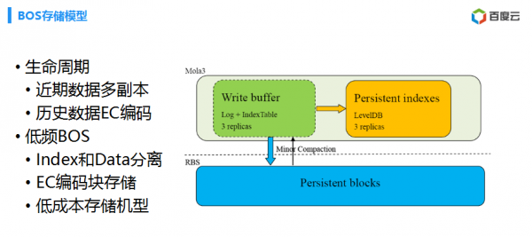
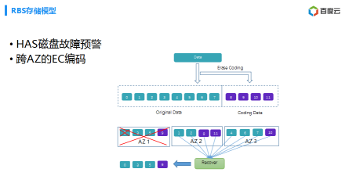
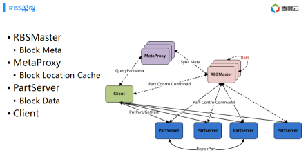
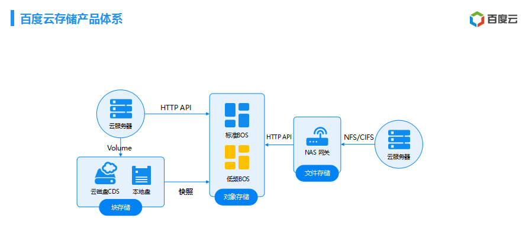
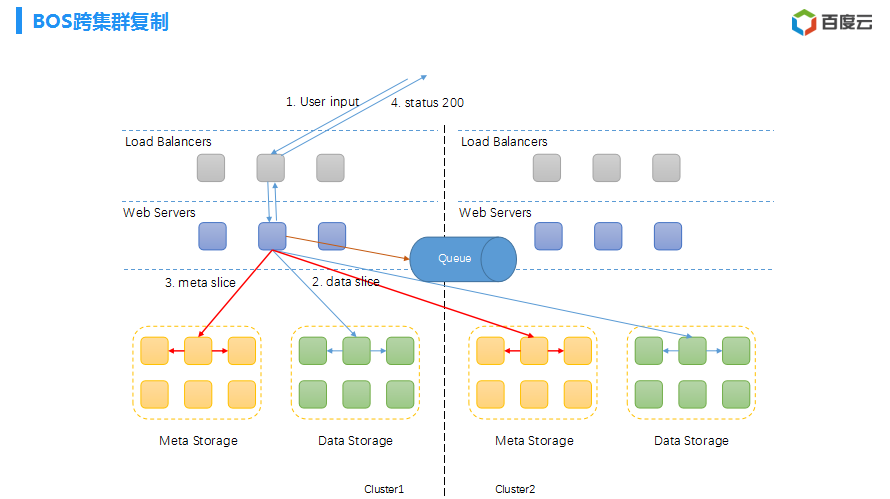
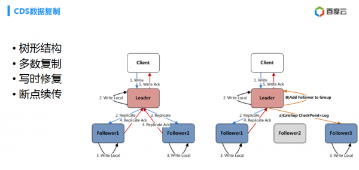
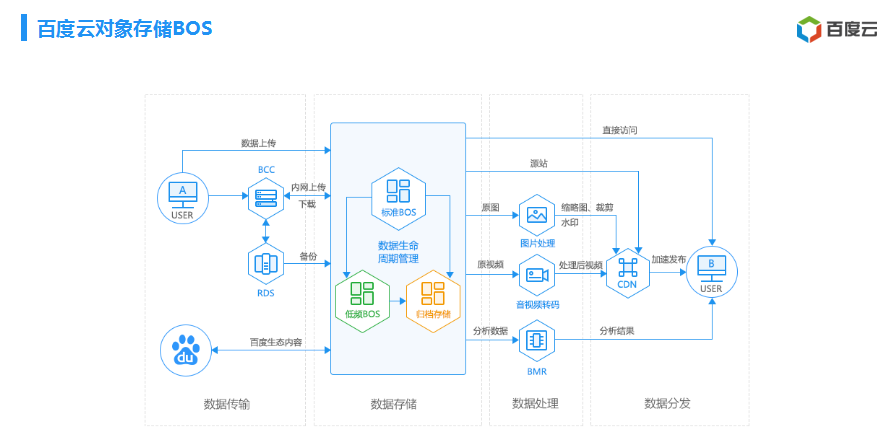
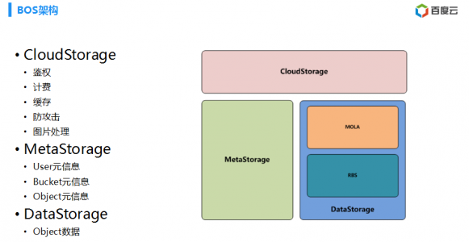

# 百度网盘架构
- 降低成本
	- 通过 arm 做低存储功耗
	- 通过编码降低成本
- 2b  手机备份场景
	- apple
	- 小米

## 存储模型

- 高频存储

	标准的对象存储，提供多副本存储形式，将近期或者比较频繁访问的数据放在里面，比如图片视频等
- 低频存储

	访问不是很高的数据存储，采用 ec 编码降，索引跟数据是分离。依赖内部一个故障预警一个系统，就是可以做到 85% 正确率，就是对应这个数据，这样不用读 8 份数据低成本

	- 
	- 
## 网关中间件
用户使用 http api 存储数据到对象存储，再通过网关提供的 NAS 接口，如 NFS/CIFS 直接挂载到服务器上，直接读取文件，这样不用拷贝。
	

 
##  云存储的目标
- 接口简单
- 数据高可靠，不能丢
- 高可用提供4个9服务(单机房99.95)
	- 单机房不可靠
	- 交换机、电源、服务器故障 
		
		
		
		单机房有一个隔离的策略
		
		- 第一级交换机、电源(机柜)
		- 第二集服务器

			故障率很高。买的部件也是会出现问题，还有就是节点，因为电源故障，总是有一些故障的。
		- 第三级磁盘

			磁盘有一些故障，磁盘故障率都是有千分之五故障率，头三年，还没有过保修范围之内。
		
- 降低成本

## 高可用
- 跨地域
	- 三个地域
- 每个地域多机房 

	对象存储提供这种跨地域容灾，上面就是一个接入层，用户数据，先写入接入层。这个时候数据可以双写。把原型机双写，接下来，写成功了，这个消息队列就是分布式，也是跨区域容灾的。
	
	
	

## 算法保证
Raft 一致性协议，解决 master 修复，复制，节点变更。

- 数据写入机制

	

## BOS 对象存储生态
- 业务结构图

	
- 系统架构
	- 第一个系统就是接入系统，CloudStorage，等等一系列接入事情
	- 第二个 MetaStorage，对象存储提供一种目录数的概念
	- 最后一个叫做 DataStorage，难度比较高，提供对应的一些数据存储

	
	

## 百度网盘的 TB 存储存储成本
- 服务器投入折合 = 319/TB
- 电费+带宽费 = 106/TB/年

## 计费计算
- DBOX 2TB = 70 RMB/月
- applecloud 2TB = 68 RMB/月
	
## 参考
[百度云资深架构师聊百度云存储架构特点](https://blog.csdn.net/shudaqi2010/article/details/70766179)