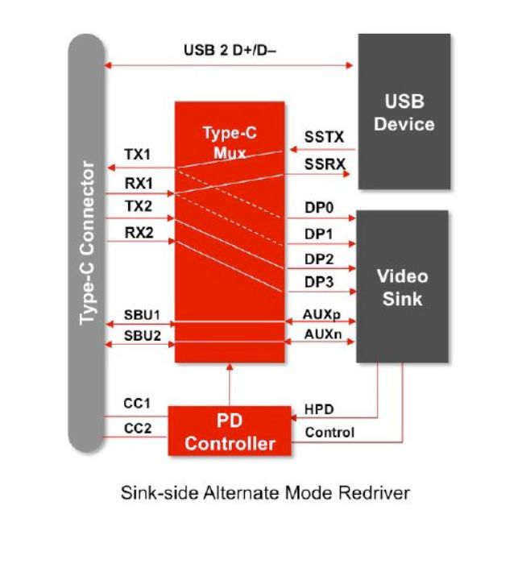
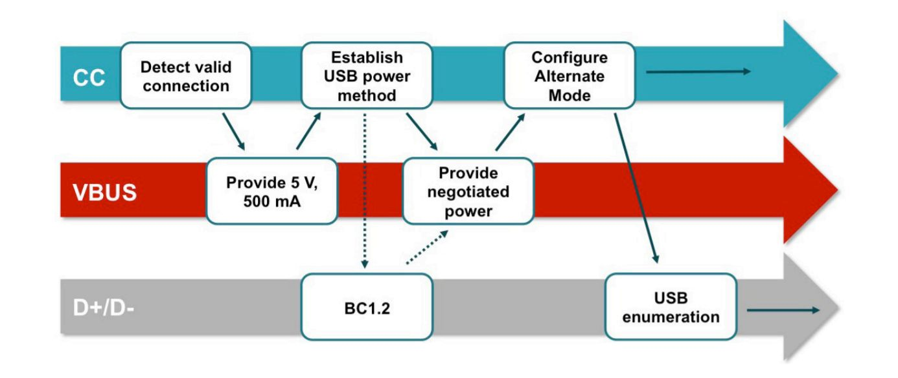
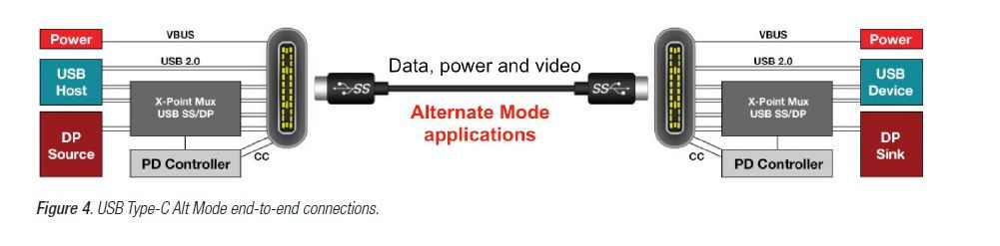

- Alt Mode USB
	
	DP Alt Mode 配件不需要驱动就可以外接显示器，但只能在支持的 Type-C 主机接口上运行正常。（咋一看Display Link 确实适用范围更广，但是性能缺陷是绕不开的问题）
	
	- Type-C Alt Mode 中常见的USB 带宽模式有以下几种
		- USB3.2 Gen1 （5Gbps） 比如15~17年的12英寸 Macbook，比如 19年华为Matebook 13，14 以及一加 7 Pro 等手机应用
		- USB3.2 Gen2 （10Gbps） 比如所有计算机搭载的雷电3及雷电4接口，桌面PC 可以使用的UPD2018 DP alt mode Type C扩展卡，Surface Laptop 3 等应用
		- 理论上目前的技术是可以使Alt Mode支持 仅USB2.0 以及USB3.2 Gen2x2 模式的
	
		例如 USB 带宽方面，12英寸 Macbook 之所以只能支持到 5Gbps 的 USB 3.2 Gen1 传输，是因为上游的 USB Host 只支持到 5Gbps。
		
		而 UPD2018 的上游 USB Host 采用的是 ASM1142，一颗 USB3.2 Gen2主控，因此可以支持到 10Gbps，但是Host 上游的 PCIe 带宽只给了 PCIe 3.0 X1，因此实际上也是不满 10Gbps 的
		
	- 视频带宽：

		既然名为 DP Alt Mode，那么在激活状态下输出的视频信号则为 DP 信号，类似于 USB 协议，DP 协议的迭代也可以提高相同接口下的传输速率
		
		- HBR2（DP1.2） 每 Lane 5.4G bps 的理论传输速率，由于 8b/10b 编码，有效带宽为 4.32Gbps
		- HBR3（DP1.3&DP1.4） 每 Lane 8.1Gbps [6] 的理论传输速率，由于 8b/10b 编码，有效带宽为 6.48Gbps
		
		常见分辨率带宽，分辨率	所需的最小带宽
		
		- 1 x FHD (1920 x 1080) 显示屏 @60 Hz	3.2 Gbps
		- 1 x QHD (2560 x 1440) 显示屏 @60 Hz	5.6 Gbps
		- 1 x 4K (3840 x 2160) 显示屏 @30 Hz	6.2 Gbps
		- 1 x 4K (3840 x 2160) 显示屏 @60 Hz	12.5 Gbps

		4K@60Hz所需带宽仅需2 Lane 的 HBR3 DP 通道即可满足，而HBR2 则不行。这是买了 支持 4k@60Hz实际却只能30Hz 这个问题的核心所在。详细表
		
			DisplayPort 2.0 (20 GHz)	Ok (1%)	Ok (1%)	Ok (1%)	Ok (1%)	Max BW 77,575 Mbit/s
			DisplayPort HBR3 (8.1 GHz)	Ok (2%)	Ok (2%)	Ok (2%)	Ok (2%)	Max BW 25,920 Mbit/s
			DisplayPort HBR2 (5.4 GHz)	Ok (3%)	Ok (3%)	Ok (3%)	Ok (3%)	Max BW 17,280 Mbit/s
			DisplayPort HBR (2.7 GHz)	Ok (7%)	Ok (7%)	Ok (6%)	Ok (6%)	Max BW 8,640 Mbit/s
			DisplayPort RBR (1.64 GHz)	Ok (11%)	Ok (11%)	Ok (10%)	Ok (10%)	Max BW 5,240 Mbit/s
			DP 2.0 Type-C Alt Mode (20 GHz)	Ok (1%)	Ok (1%)	Ok (1%)	Ok (1%)	Max BW 38,787 Mbit/s
			DP HBR3 Type-C Alt Mode (8.1 GHz)	Ok (4%)	Ok (4%)	Ok (4%)	Ok (4%)	Max BW 12,960 Mbit/s
			DP HBR2 Type-C Alt Mode (5.4 GHz)	Ok (7%)	Ok (7%)	Ok (6%)	Ok (6%)	Max BW 8,640 Mbit/s
			DP HBR Type-C Alt Mode (2.7 GHz)	Ok (13%)	Ok (13%)	Ok (12%)	Ok (12%)	Max BW 4,320 Mbit/s
			DP RBR Type-C Alt Mode (1.64 GHz)	Ok (22%)	Ok (21%)	Ok (20%)	Ok (19%)	Max BW 2,620 Mbit/s
			HDMI 2.1 FRL (12 GHz)	Ok (1%)	Ok (1%)	Ok (1%)	Ok (1%)	Max BW 42,667 Mbit/s
			HDMI 2.1 FRL (10 GHz)	Ok (2%)	Ok (2%)	Ok (1%)	Ok (1%)	Max BW 35,556 Mbit/s
			HDMI 2.1 FRL (8 GHz)	Ok (2%)	Ok (2%)	Ok (2%)	Ok (2%)	Max BW 28,444 Mbit/s
			HDMI 2.1 FRL (6 GHz)	Ok (3%)	Ok (3%)	Ok (2%)	Ok (2%)	Max BW 21,333 Mbit/s
			HDMI 2.0 (600 MHz)	Ok (4%)	Ok (4%)	Ok (4%)	Ok (3%)	Max BW 14,400 Mbit/s
			HDMI 1.3/1.4 (340 MHz)	Ok (7%)	Ok (7%)	Ok (6%)	Ok (6%)	Max BW 8,160 Mbit/s
			HDMI 1.0/1.1/1.2 (165 MHz)	Ok (14%)	Ok (14%)	Ok (13%)	Ok (13%)	Max BW 3,960 Mbit/s
			DVI-DL (330 MHz)	Ok (7%)	Ok (7%)	Ok (6%)	Ok (6%)	Max BW 7,920 Mbit/s
			DVI-D	Ok (14%)	Ok (14%)	Ok (13%)	Ok (13%)	Max BW 3960 Mbit/s
			RFC4175/100M Ethernet	No (467%)	No (467%)	No (471%)	No (471%)	Max BW 94 Mbit/s
			RFC4175/1 GigE	Ok (47%)	Ok (47%)	Ok (47%)	Ok (47%)	Max BW 938 Mbit/s
			RFC4175/10 GigE	Ok (5%)	Ok (5%)	Ok (5%)	Ok (5%)	Max BW 9384 Mbit/s
		
		DP （视频）带宽方面，很简单粗暴，直接看主机 GPU 的 DP 支持就可以了

	例如英特尔10代之前的移动端处理器核显仅支持DP1.2（HBR2）输出，因此导致18年19年款的13英寸 Macbook Pro 即使装备了支持DP1.4（HBR3）的Titan Ridge 雷电控制器，由于核显的拖累，依旧只能DP1.2 输出（笑）

	- 主机接口
	
		
	- 设备接口
	
		
	
	
	Type-C Alt Mode 大致配置流程如下：
	
	
	
	- USB 连接 通过 CC 侦测到
	- VBUS 引脚 提供默认电源配置 5V@500mA‘
	- VBUS 所需的额外USB电力传输可以进行协商，Battery Charge 1.2（BC 1.2）或USB PD 都可以选择
	- 使用 结构化 供应商定义报文（VDM） 需要USB PD 来发送来协商 Alt Mode 握手
	- USB 枚举
	- 如果 DP Alt Mode 协商已经完成，继续进行DP link training来建立DP连接
	- USB和DP频道准备就绪进行Type-C 数据和视频信号传输。

- Display Link
	- Display Link 的配件可以在 Type-A 接口上正常工作，在系统中需要安装 Display Link 驱动（Chrome OS 已集成） 才能输出视频信号 

- type-c 涉及的产品主要形态如下：
	1. Type C 转换为任意视频接口的单转单线缆
	2. 便携型适配器，无论有或没有PD Pass Through 功能，都可以无需外接电源使用
	3. 坞站，通常需要大型的外置DC电源支持才能使用	
- type-c mode

		

# 自我需求(hp G2)
- 工作
	- 最少85w充电
	- 双屏(是不是4k60不重要)
	- 键盘鼠标
	- 有时候有U盘需求
- 家里
	- 最少85w充电
	- 双屏？
	- 对接转接器 1个转接器  
