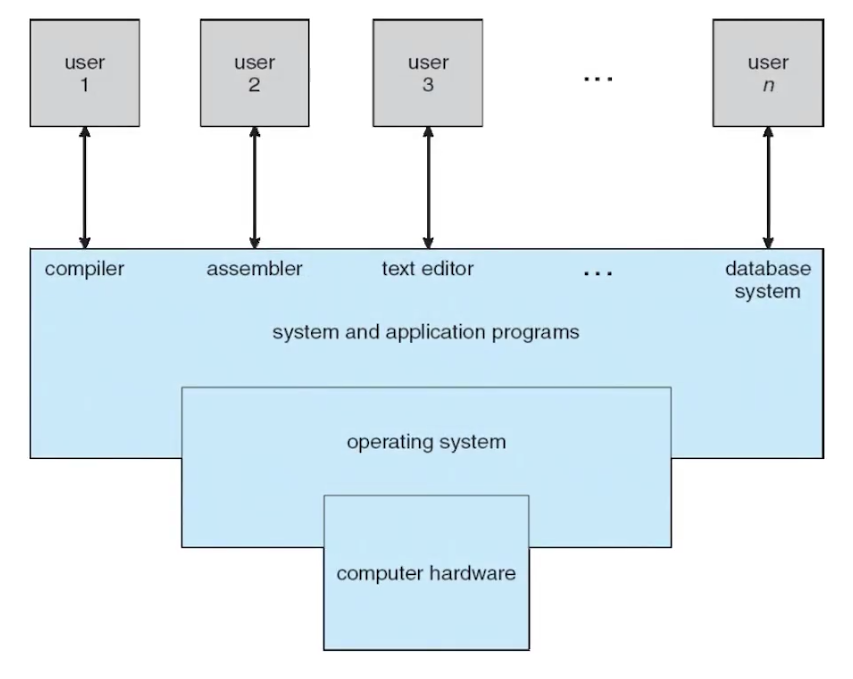
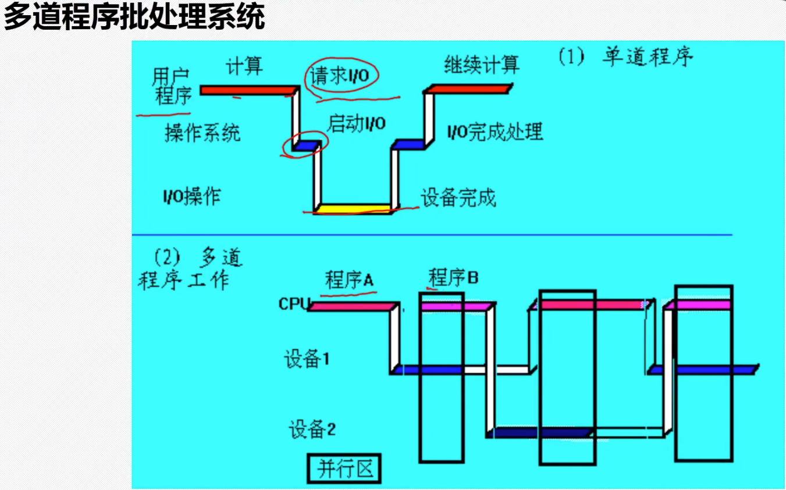
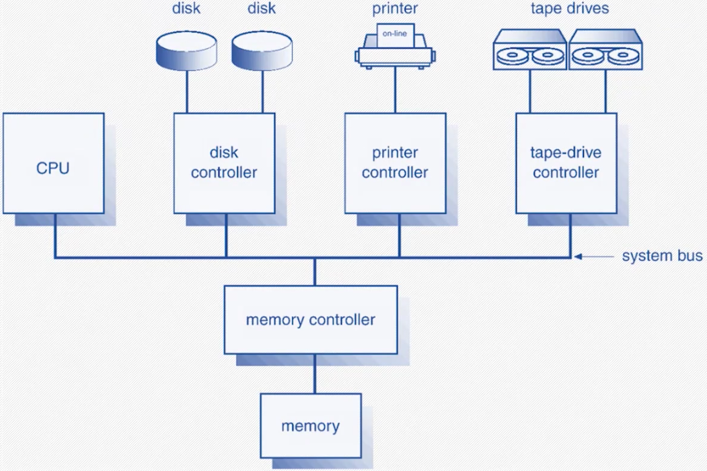
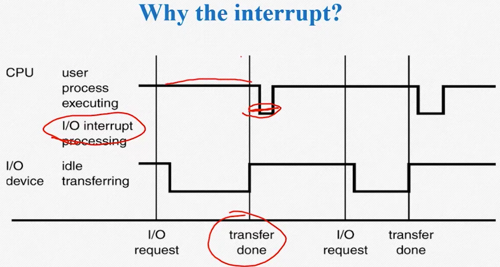
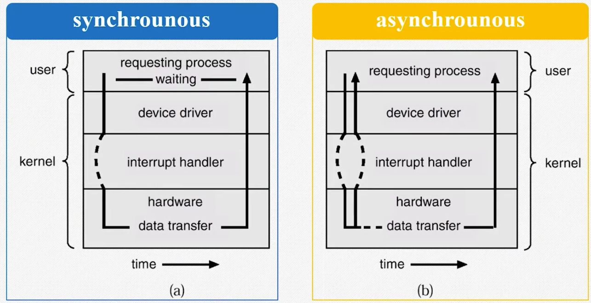

# 操作系统原理
## 操作系统基本概念
- 为什么要用操作系统？

	计算机硬件很难使用，解决一下问题
	
	- 用户不能使用裸机
	- 硬件只能识别机器码
	- 机器码直观性差，容易出错，难交流
	- 计算机硬件之上覆盖一层软件，解决用户与硬件交互问题
- 什么是操作系统
	
	操作系统是计算机软件核心，是计算机系统大脑，整个计算机系统的控制中心，是计算机系统中，最重要，最复杂的系统软件。
	
	- 管理硬件的程序
	- 用户与硬件之间起媒体作用的一种程序
	- 硬件之上的第一层软件，对硬件的首次扩充，又是其他软件运行的基础
		- 抽象
		
			
			
			- 硬件

				提供基本的运算资源(cpu、内存、io)
			- 操作系统

				在各应用程序和用户之间控制与协调对硬件的使用
			- 应用程序

				定义解决用户问题的资源使用方式
			- 用户

				人、机、其他计算机
- 操作系统目标
	- 执行用户程序并使用户问题更容易解决
	- 使计算机系统更容易使用
	- 以一种有效率的方式使用硬件
	- 资源分配者，管理和分配资源
	- 控制程序，控制用户程序的运行和i/o设备的操作
	- 内核，在全时运行的一个程序
- 操作系统的作用
	- 计算机硬软件资源的管理者
	- 用户使用计算机硬软件的接口

## 操作系统发展
- 操作系统从无到有，从简单到复杂、完善的过程
- 操作系统随着计算机硬件技术的发展而发展
- 为满足不同的需求，出现了多种类型的操作系统

### 发展动力:由需求推动发展
- 资源利用角度

	为了提高计算机资源利用率和系统性能
	
	- 从单道到多道
	- 集中到分布
	- 从专用到多用途
- 用户角度
	- 方便用户，人机交互
- 技术角度
	- 硬件发展如
		- cpu (位宽、指令集、数据)
		- 快速外存
		- 光器件
		- 等
	- 计算机结构不断发展
		- 单处理
		- 多处理
		- 多核
		- 计算机网络
	
### 过程
- 真空管时代(第一代) 

	无操作系统，通过手工操作、集中式、用户独占全机器，第一台计算机名 ENIAC(1000次/s，数万真空管，100平方米)
	
	- 没有操作系统和汇编，人工操作方式
	- 用户(计算机专业人员)预约时间使用，全程独占
	- 使用方法通过插板物理插入道计算机里运行
		- 编程语言：机器语言
		- I/O 是纸带或卡片 
- 晶体管时代(第二代) 

	单道批处理系统，把一批作业以脱机输入方式输入道磁带上，再利用磁带或磁盘把任务分类编成作业顺序执行，每批作业由专门的监督程序(monitor)自动依次处理。解决了高速计算机的运算、处理能力与人工干预之间的速度矛盾，实现了作业自动过度
	
	特征
	
	- 顺序性，磁带上的各道作业是顺序的进入内存，顺序执行
	- 单道性，内存只有一道程序
	- 自动性 
- 集成电路时代(第三代) 
	 
	多道程序设计，内存中同时存放几个祖业，使之都处于执行的开始点和结束点之间，多个作业共享 cpu、内存、外设等资源。目的是利用多个批处理任务提高资源的利用率。
	
	- 特征
		- 多道性

			内存中同时驻留多道程序并发执行，只要系统中总是存在可执行作业，cpu 就不会空闲提高性能,从而有效的提高了资源利用率和系统吞吐量
		- 无序性

			作业的完成顺序与它进入内存的顺序无严格对应关系
		- 调度性

			作业调度、进程调度
	- 新增技术
	
		通道和中断技术的出现，解决了输入输出等待计算的问题
	
		- 通道
	
			一种专用部件，负责外部设备与内存之间的信息传输
		- 中断
	
			指主机接到外界信号(cpu外部或内部)时，立即终止原来的工作，转去处理这一外来事件，处理完后，主机又回到原来工作点继续工作。
	- 单道和多道的区别	
			
- 大规模和超大规模集成电路时代(第四代) 

	分时系统，多个用户分享使用一台计算机，分时共享硬件和软件资源，通常按时间片(time slice)分配，各程序在 cpu 上执行轮换时间。实现方式：
	
	- 多个用户分时

		单个用户使用计算机效率低，因此允许多个应用程序同时在内存中，分别服务于不同的用户。有用户输入时由 cpu 执行，处理完一次用户输入后程序暂停，等待下一次用户输入 
	- 前后台程序分时

		后台程序不占用终端输入输出，不与用户交互。除当前交互程序外，其他程序均为后台程序。
	
	分时系统解决的两个问题
	
	- 及时接收

		有多路输入，有缓冲，主机轮流来处理
	- 及时处理

		能及时处理的设计需求
			
		- 作业直接进入内存，不能在磁盘上
		- 每个作业一次只运行很短的时间
		- 分时技术
		
			把 cpu 响应时间分若干个大小相等或不等的时间单位，为时间片，如 100毫秒。当每个终端用户获 cpu 时间分片后开始运行，当时间片到，该用户程序暂停运行，等待下一次运行
- 未来系统

	向着巨形、微型、并行、分布、网络化、智能化发展
	
### 操作系统历史
- 无操作系统
	- 缺点
		- 人机矛盾，人工操作方式与机器利用率问题
		- cpu与io速度不匹配
	- 待提高
		- 批处理
		- 脱机io
		
			i/o 工作在主机之外的设备(外围、卫星机)上完成，使用磁带作为输入输出中介，具有输入输出不需要在主计算机上进行。     
- 单道批处理系统
	- 优点
		- 减少了 cpu 空闲时间，提高了主机 cpu 和 io 设备使用率，提高了吞吐
	- 缺点
		- 因为内存中同时只存放一个作业，所以 cpu 和 io 设备使用忙闲不均，cpu 执行的时候，io是空闲, io使用的时候 cpu 又是空闲
	- 待提高
		- 同时存放多个作业
- 多道程序批处理系统
	- 优点
		- 多道通过组织作业，让cpu 总执行其中一个作业，从而提高了 cpu 的利用率
		- 吞吐量大
	- 缺点
		- 无交互能力，用户响应时间长
		- 作业平均周转时间长
	- 多道对操作系统提出的要求
		- 存储管理，系统必须为若干作业分派空间
		- cpu调度，系统必须在就绪作业中挑选
		- 资源竞争和共享
		- 设备分派
		- 系统提供 io 程序
		- 文件管理
	- 待提高
		- 多任务或多用户
		- 交互服务      
- 分时系统
	- 优点
		- 多路性

			共多个用户同时使用一台计算机
		- 独占性

			各终端用户感觉到自己独占了计算机
		- 交互性

			用户与计算机之间可会话
		- 及时性

			用户的请求可以在很短的时间内获得响应，人机交互好 
- 未来系统	
	- 实时系统
	- 嵌入式系统
	- 并行系统
	- 分布式系统

## 计算机硬件架构
 
### 计算机系统操作
- io 设备与 cpu 可并行运行
- 每个设备控制器负责一个设备类型
- 每个设备控制器有一个局部缓存(用来做 cpu 和 io 设备之间的交互)
- cpu 通过局部缓存与主存交换数据
- io 设备也可以通过设备控制器的局部缓存来进行数据交换
- 设备控制器通过引起中断通知 cpu 操作已完成

### 中断机制
中断机制带来更高效，响应性更好

- 硬件中断

	由设备控制器向 cpu 告知任务完成来触发中断
	
	[硬中断操作](https://www.bilibili.com/video/BV1CJ411M7VL?p=5)
	
			
- 软件中断
	- trap 或者 exception(异常) 

		软件在系统中运行出现错误而出现的退出，比如内存错误
	- 系统调用(system call)

		比如 read(),write()
- 中断服务程序

	现在操作系统都是中断驱动，cpu 收到中断信号后将中断控制权转移到中断服务程序(需要处理中断信号的代码)，中断操作顺序
	
	- 有一个独立的代码，当中断触发以后，每种中断要做什么操作	- 有一个通用的逻辑检查中断信息，当有中断出现，会调用特殊的句柄(这个句柄就是中断服务程序)
	- 中断向量存储了中断服务程序的地址和地址对应的是每一种类型中断的处理程序(中断服务程序)

		

### IO 结构
- 设备与设备控制器相连
- 一个控制器里有本地缓冲器和一组寄存器
- 设备驱动程序

### IO中断
两种 IO 操作模式

- 同步模式

	在程序触发 IO 开始到 IO 结束，控制权才会返回给用户程序
- 异步模式 				

	在程序触发 IO 开始后，控制权已经返回给用户程序，不会等待 IO 结束，可以通过中断的方式告知程序(消息和callback 功能)已经完成
	
	

## 参考
[操作系统原理](https://www.bilibili.com/video/BV1CJ411M7VL?p=6)			

			 	