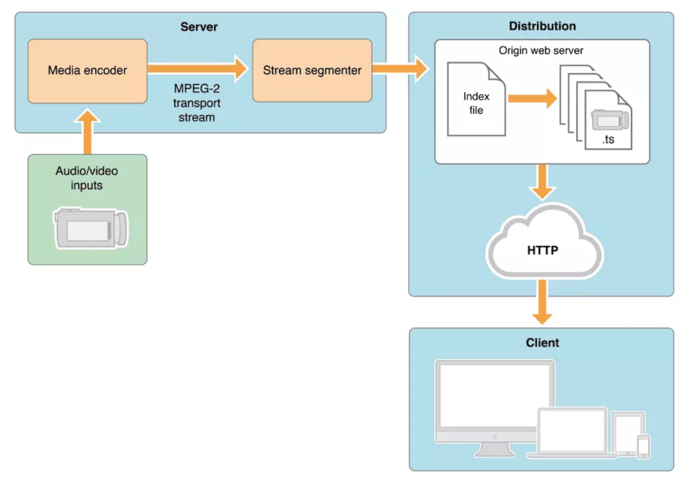
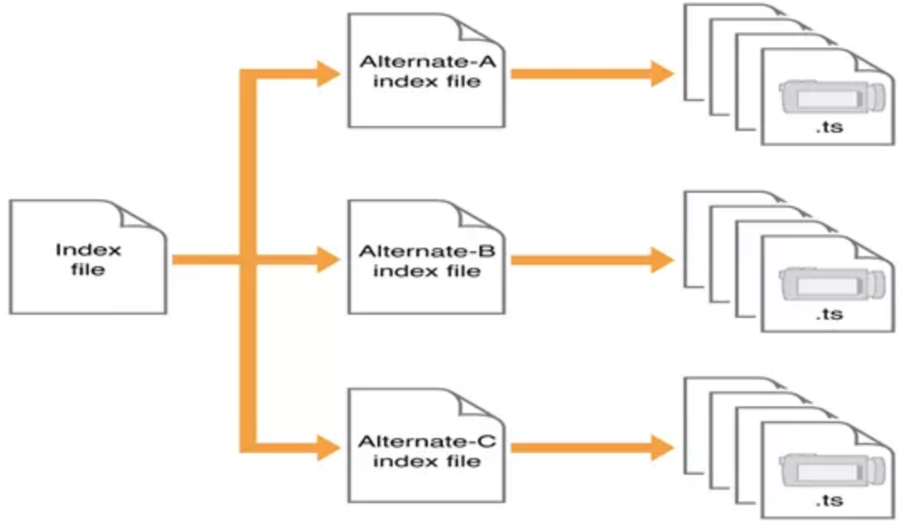
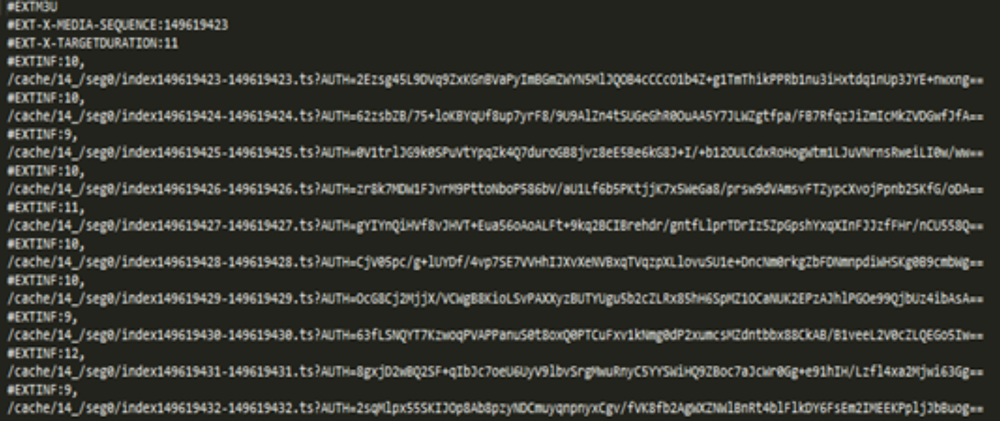
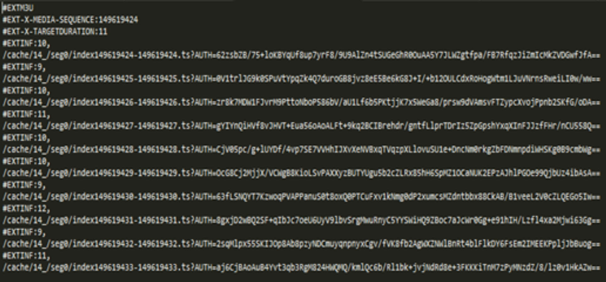
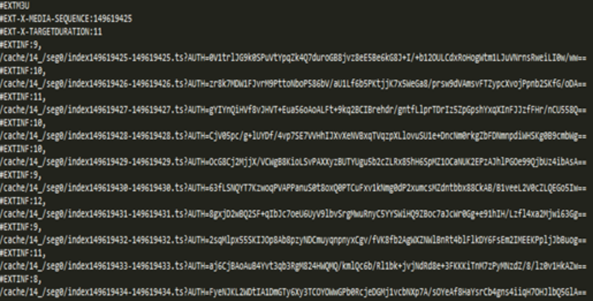
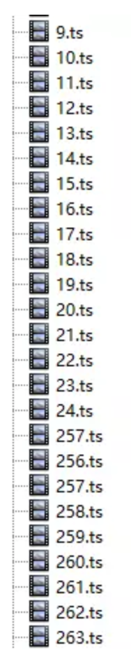

# HLS
HTTP Live Streaming（缩写是HLS）是一个由苹果公司提出的基于HTTP的流媒体网络传输协议。

- HLS协议规定：
	- 视频的封装格式是TS
	- 视频的编码格式为H264,音频编码格式为MP3、AAC或者AC-3
	- 除了TS视频文件本身，还定义了用来控制播放的m3u8文件（文本文件）

- 优点
	- 协议本身实现了码率自适应，不同带宽的设备可以自动切换到最适合自己码率的视频播放
	- 使用标准的 http 接口，穿透防火墙使用
	- 基于无状态协议(http)封装，可以很好的使用现有4-7层的负载均衡进行扩展。
- 缺点

	直播延迟最少10秒		
## 原理
简单讲就是把整个流分成一个个小段，基于 HTTP 的文件来下载，每次只下载一些，传输内容包括两部分：

- m3u8纯文本索引文件
- TS媒体文件。

简单的传输方式就是在一个 m3u8 中包含 ts 切片的 url 列表，依次下载播放。如下图所示：

还有就是有多级索引，如下图所示，客户端先下载一级 Index file，它里面记录了二级索引文件（Alternate-A、Alternate-B、Alternate-C）的地址，然后客户端再去下载二级索引文件。该文件是按照带宽不同划分了不同分辨率的切片文件，然后客户端就可以根据实际的带宽来调整自己需要使用的码率源连续播放以实现码率自适应。

一般为了加快速度，.m3u8 放在 web 服务器上，ts 文件放在 cdn 上。.m3u8 文件，其实就是以 UTF-8 编码的 m3u 文件，这个文件本身不能播放，只是存放了播放信息的文本文件，可以认为是个播放文件的索引：

- 一级索引

		#EXTM3U
		#EXT-X-STREAM-INF:PROGRAM-ID=1,BANDWIDTH=1064000
		1000kbps.m3u8
		#EXT-X-STREAM-INF:PROGRAM-ID=1,BANDWIDTH=564000
		500kbps.m3u8
		#EXT-X-STREAM-INF:PROGRAM-ID=1,BANDWIDTH=282000
		250kbps.m3u8
		#EXT-X-STREAM-INF:PROGRAM-ID=1,BANDWIDTH=2128000
		2000kbps.m3u8

	- 参数含义
		- bandwidth 指定视频流的比特率
		- PROGRAM-ID 无用无需关注
		- EXT-X-STREAM-INF 对应的是的下一行是二级index 文件的路径，可以用相对路径也可以用绝对路径。
	
	例子中用的是相对路径。这个文件中记录了不同比特率视频流的二级index 文件路径，客户端可以自己判断自己的现行网络带宽，来决定播放哪一个视频流。也可以在网络带宽变化的时候平滑切换到和带宽匹配的视频流。

- 二级索引

		#EXTM3U
		#EXT-X-PLAYLIST-TYPE:VOD
		#EXT-X-TARGETDURATION:10
		#EXTINF:10,
		2000kbps-00001.ts
		#EXTINF:10,
		2000kbps-00002.ts
		#EXTINF:10,
		2000kbps-00003.ts
		#EXTINF:10,
		2000kbps-00004.ts
		#EXTINF:10,
		
		... ...
		
		#EXTINF:10,
		2000kbps-00096.ts
		#EXTINF:10,
		2000kbps-00097.ts
		#EXTINF:10,
		2000kbps-00098.ts
		#EXTINF:10,
		2000kbps-00099.ts
		#EXTINF:10,
		2000kbps-00100.ts
		#ZEN-TOTAL-DURATION:999.66667
		#ZEN-AVERAGE-BANDWIDTH:2190954
		#ZEN-MAXIMUM-BANDWIDTH:3536205
		#EXT-X-ENDLIST	
	
	- 参数含义
		- EXTINF
		
			指示出下面 TS 片的时间长度，单位是秒，可以是整数也可以浮点数，浮点数一般精确到小数点后面3位。例中，第一个 ts 的时长为 8 秒。
		
			同时，`#EXTINF` 也影响了播放器刷新 M3U8 文件的间隔，正常情况下，播放器会把当前下载的 TS 片的 EXTINF 的值作为每次刷新 M3U8 文件的间隔；如果播放器发现本次取到的M 3U8 文件内容没有更新，会在 1-2 秒内再次刷新。
		- EXT-X-TARGETDURATION
		
			ts 切片的时长不能大于的值
		- EXT-X-ENDLIST
		
			表示视频结束，有这个标志同时也说明当前的流是一个非直播流（有结束的意思）。
		- EXT-X-PLAYLIST-TYPE:VOD
		
			当前的视频流并不是一个直播流，而是点播流。
		
			- 点播VOD

				特点就是当前时间点可以获取到所有 index 文件和 ts 文件，二级 index 文件中记录了所有 ts 文件的地址。这种模式允许客户端访问全部内容。上面的例子中就是一个点播模式下的m3u8的结构。
			- Live 
			
				实时生成 M3u8 和 ts 文件。它的索引文件一直处于动态变化的，播放的时候需要不断下载二级 index 文件，以获得最新生成的 ts 文件播放视频。如果一个二级 index 文件的末尾没有 #EXT-X-ENDLIST 标志，说明它是一个 Live 视频流。

## 直播和点播的区别
### 直播
1. http 请求 m3u8 的 url（包含部分播放列表，没有结束标识）。
2. 服务端返回一个 m3u8 的播放列表，这个播放列表是实时更新的（类似于滑动窗口机制），一般一次给出5段数据的 url。
3. 客户端解析 m3u8 的播放列表，再按序请求每一段的 url，获取 ts 数据流。
4. hls 协议是将直播流分成一段一段的小段视频去下载播放的，所以假设列表里面的包含5个 ts 文件，每个 TS 文件包含5秒的视频内容，那么整体的延迟就是25秒。因为当你看到这些视频时，已经将视频录制好上传上去了，所以时这样产生的延迟。当然可以缩短列表的长度和单个 ts 文件的大小来降低延迟，极致来说可以缩减列表长度为1，并且 ts 的时长为1s，但是这样会造成请求次数增加，增大服务器压力，当网速慢时回造成更多的缓冲，所以苹果官方推荐的ts时长时10s，所以这样就会大概有30s的延迟。

### 点播
1. http 请求 m3u8 的 url。（包含所有播放列表，有结束标识）
2. 解析 m3u8 的播放列表，再按序请求每一段的 url，获取 ts 数据流。

### 问题
- 采用 HLS 协议直播的视频延迟时间无法下到 10 秒以下，所以说对直播延迟比较敏感的服务请慎用HLS。
2. 对于点播服务来说, 由于 TS 切片通常较小, 海量碎片在文件分发, 一致性缓存, 存储等方面都有较大挑战。

## 测试：（央视网H5）
### 直播测试
- 测试环境：
	- 操作系统 win10 64位
	- 测试平台 chorm
	- 播放器类型：H5
	- 测试协议：HLS协议
- 测试结果：（测试类型：直播）

	M3u8 每次更新一个，类似于滑动窗口机制，第一次是列表 12345，第二次 23456，第三次 34567，然后按列表地址下载 ts 切片，直播暂停，m3u8 文件继续更新，ts 文件停止下载。直播继续播放，继续下载 ts 切片。下图为央视网直播时`连续更新`三次m3U8文件的截图：

	
	
	

### 点播测试
M3u8 一次性包含所有 ts 文件播放列表，依次进行下载播放，暂停的时候ts切片不下载，播放继续下载，seek 进度条的时候，ts 切片会从选择位置开始下载。下图为某视网点播 `seek` 的 ts 片段，注意文件不是连续的，因为使用 seek 跳转了。如下图

	
		
## 参考
[流媒体协议：互联网视频分发协议介绍（渐进式、HLS、DASH、HDS、RTMP协议）](https://www.jianshu.com/p/8b803ba0e526)

[HLS协议介绍](https://www.jianshu.com/p/426425cad08a)