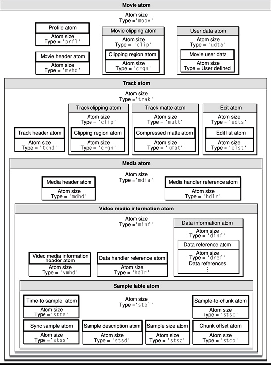
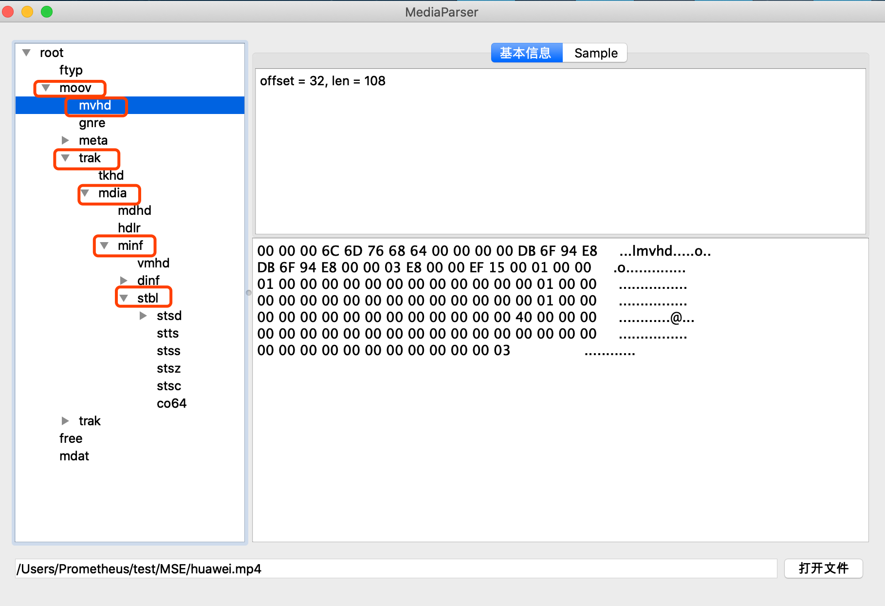
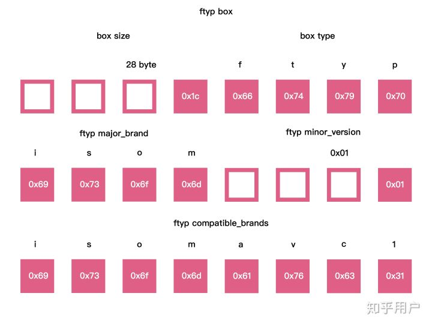
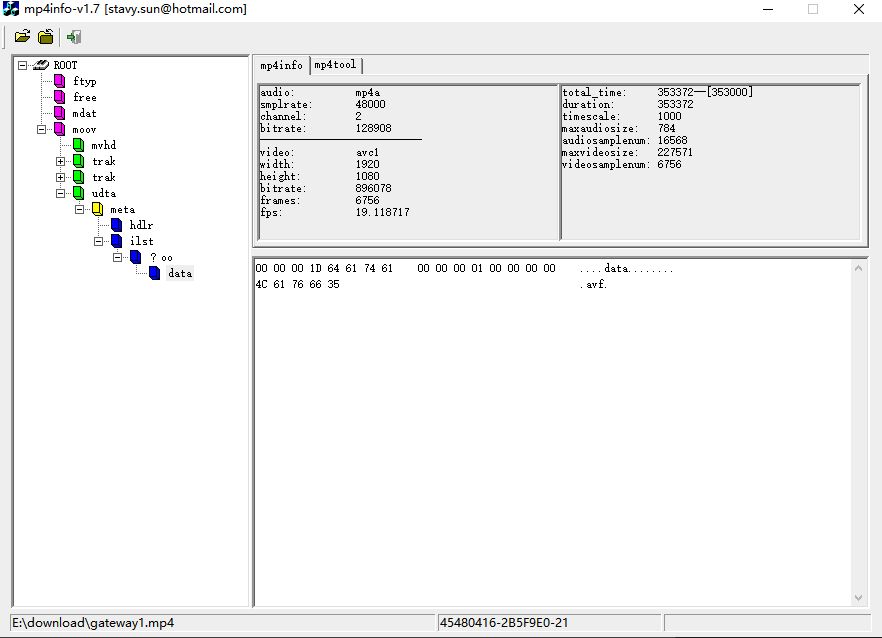
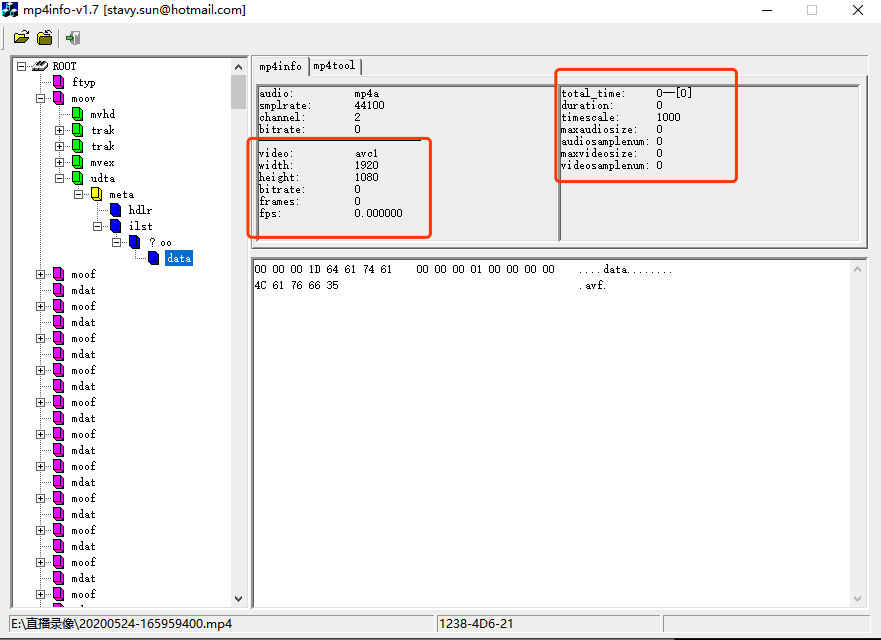
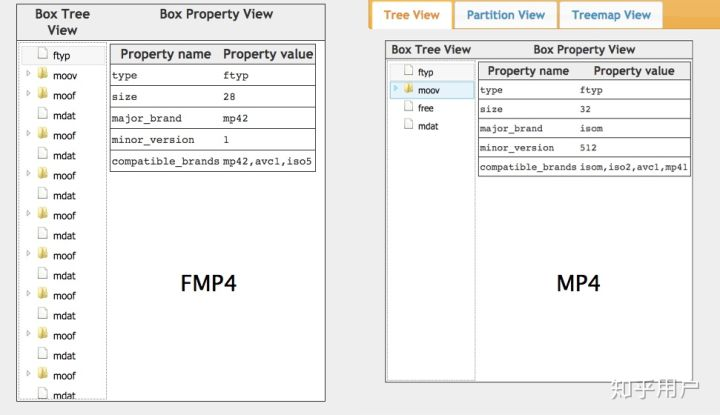

# MP4
## 什么是 Moving Picture Experts Group
MP4 实际上代表的含义是 MPEG-4 Part14 。它只是 MPEG 标准中的 14 部分。主要作用是可以实现快进快放，边下载边播放的效果。基于 MOV 发展成自己的格式内容。最基本的单元是 Box,它内部是各个 Box 拼接而成的。它是一种描述较为全面的容器格式，被认为可以在其中嵌入任何形式的数据、编码视音频等。

常见的大部分的 MP4 文件存放的 AVC(H.264) 或 MPEG-4(Part 2) 编码的视频和 AAC 编码的音频。官方文件后缀名是“.mp4”，还有其他的以 mp4 为基础进行的扩展或者是阉割版的格式，如：M4V, 3GP, F4V 等。

MP4 是由一个个 “Box” 也有人称其为“Atom”(QuickTime 中的称呼) 组成的，大 Box 中存放小 Box，一级嵌套一级来存放媒体信息。Box 分为不同类型，部分类型的 Box 嵌套在另一些类型的 Box 中。所以 MP4 文件的数据单元可以认为是按树形结构组织的。

or 

## MP4 中 BOX 结构
处于第一层级的 Box

- 主要包括如下 4 个
	- ftyp
	
		标示文件类型及兼容性信息
	- moov
	
		保存 Track、Index 等元数据
	- free

		空数据，可以忽略
	- mdat
	
		存放真正的媒体数据
- 可能出现
	- wide QuickTime
		
		定义的 Box，一般的 MP4 中不会出现这个 Box，这个主要是用来扩展 MP4 可支持的文件最大尺寸（图中这个 MP4 文件是我用 iPhone 录制的视频）
		
	- skip
	
		用于存放用户自定义数据，例如版权信息
	- meta
	
		保存媒体本身的一些元数据
	- meco
	
		额外的一些元数据
		
	在用于流播的 Fragment MP4 场景下（例如 Smooth Streaming 应用中），媒体数据不是全部放在同一个 mdat Box 中，而是按 Fragment 分成多个 mdat Box 保存。会包含新的 Box。
	
	- moof 

		在每个 Fragment 中都会存在，类似于 moov，但保存的仅为当前分片的元数据
	- mfra 

		Movie Fragment Random Access，可以认为是分片索引

## Box 自身概念
- MP4 文件由许多个 Box 与 FullBox 组成。
	- Box 

		由 Header 和 Data 两部分组成。当一个 Box 中 Data 是一系列的子 Box 时，这个 Box 又可以称为 Container（容器）Box
		
		- Header 

			包含了整个 Box 的长度的大小（size）和类型（type）
			
			- 当 size=0 时，这个 Box 是文件的最后一个 Box。
			- 当 size=1 时，说明 Box 长度需要更多的位来描述，在后面会自定义一个 64 位的 largesize 用来描述 Box 的长度。当 type 等于 uuid 时，说明这个 Box 中的数据是用户自定义扩展类型。
		- Data 

			为 Box 的实际数据，可以是纯数据，也可以是更多的子 Box。
	- FullBox 

		是 Box 的扩展，其在 Box 结构的基础上，在 Header 中增加8位 version 标志和24的 flags 标志。

MP4常用参考标准 Box [排列方式](https://github.com/renhui/Thinking-in-AV/tree/master/多媒体格式/MP4)。

## 查看 BOX
### 工具(Mac)
- [MediaParser](https://github.com/ksvc/MediaParser)

	模拟 win 的 mp4info，有 GUI,类似 
	
	
- mp4box

	命令行,安装 `brew install mp4box`	

### BOX 详情
- ftyp Box

	主要告诉解码器数据的基本解码版本，兼容格式。一般都是 mp4 的第一个 box。
	
	

	- major_brand 推荐兼容性
	- minor_version 最低兼容版本
	- compatible_brands 包含的额外格式，比如 AVC,AAC 等音视频解码格式
- moov Box

	媒体数据的元数据都统一保存在 moov Box 中，内部有多个 Box,主要包含了视频的一些信息
	
	- 视频创建时间
	- 视频修改时间
	- 播放速率
	- 视频时长
	- 音量大小
	- 视频宽高
	- 字幕语言
	- 声道
	- 视频/音频位置
	- 等
- mdat Box

	包含视频数据，mdat 中的帧依次存放，每个帧的位置、时间、长度都由 moov 中的信息指定。 mdat Box 基本上占据了视频大小的 95%以上，得益于边下载边播放，只要游览器获取到部分 mdat Box 就可以播放
		
## 流媒体问题
最近做一个项目需要 web 支持 mp4 流媒体播放，但发现有的 mp4 视频可以支持流媒体播放(边下边看)，有的 mp4 视频必须要全部下完才可以播放。根据上面的资料发现，mp4 文件中包含 moov 的元数据(数据长度、时间、编码等信息)位置差异，如果 moov 被放到了真实数据前，那么就可以支持流播放，如果放到了数据后，那么就必须全部下完才可以播放。(当然播放器可以做双读支持)

- 支持流播放视频

	
- 不支持流播放视频

	

解决 `moov box` 在 `mdat box` 前边的 MP4 类型做网络点播，支持拖拽 seek 的话，需要把 `moov box` 挪到 `mdat box` 之前

## MP4 支持流播放后使用 HLS 的意义
1. HTML5 直接支持 m3u8 协议
2. m3u8 里面包括的多是视频块索引，可以通过网络状态自动切换码率。
3. m3u8 允许客户在进行播放时，从许多不同的备用源中下载视频块。
4. m3u8 是 HLS 协议的部分内容。是一种能够通过 http 报文就能够请求和访问了。MP4 如果要实现在线播放那么就需要 RTP 协议来实现。两种手段有比较大的区别。
5. 更高性能上能够将部分 m3u8 的播放块切块之后直接加载到服务器内存中，让客户端可以更快的得到数据。
6. m3u8 由于是采用切块技术，那么下载的播放文件就可以少很多，只有当前播放的部分。这一点用在在线直播上有很大优势。

## FMp4
fmp4 基于 MPEG-4 Part 12 的流媒体格式

fmp4与mp4的区别

- 不需要一个 moov Box 来进行初始化，fmp4 的 moov Box 只包含了一些 track 信息
- 音视频 metadata 信息与数据都存在一个个 moof、mdat 中，它是一个流封装格式
- 需要转码

## 参考
- [音视频开发知识库](https://github.com/renhui/Thinking-in-AV)
- [MP4 格式简介及 MOOV 解析](https://blog.ulenium.com/2018/05/20/introduce-to-mp4-moov/)
