# Video 播放器
## 1 传统 html5 播放原理
在最早 html 5 不支持的时候，大家都各显神通，那时候最火的就是 flash 播放器，后来 html5 出来，对多媒体进行了加强，支持了多媒体标签 ，如 `<video>` 都不会陌生，在以下 HTML 片段中，我们声明了一个 `<video>` 元素并设置相关的属性，然后通过 `<source>` 标签设置视频源和视频格式：

			<video id="mse" autoplay=true playsinline controls="controls">
			   <source src="https://h5player.bytedance.com/video/mp4/xgplayer-demo-720p.mp4" type="video/mp4">
			   你的浏览器不支持Video标签
			</video>

渲染出来就是

<video id="mse" autoplay=true playsinline controls="controls">
   <source src="" type="video/mp4">
</video>

通过游览器工具，可以看到视频的多个 http 请求，头两个 HTTP 请求响应的状态码是 206。
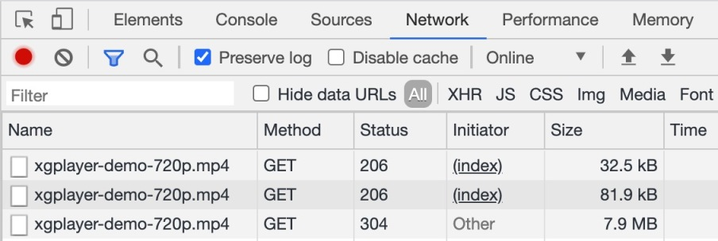
分析第一个 HTTP 请求的请求头和响应头：

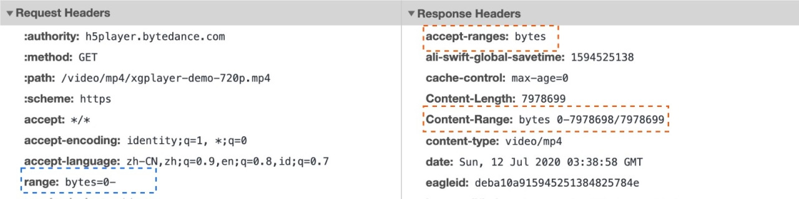

在上面的请求头中，有一个 `range: bytes=0-` 首部信息，该信息用于检测服务端是否支持 `Range` 请求。如果在响应中存在 `Accept-Ranges` 首部（并且它的值不为 “none”），那么表示该服务器支持范围请求。

在上面的响应头中， `Accept-Ranges: bytes` 表示界定范围的单位是 `bytes` 。这里 `Content-Length` 也是有效信息，因为它提供了要下载的视频的完整大小。
### 从服务器端请求特定的范围
服务器支持范围请求的话，可以使用 Range 首部来生成该类请求。该首部指示服务器应该返回文件的哪一或哪几部分。

- 单一范围

	可以请求资源的某一部分，对于使用 REST Client 发起的 单一范围请求，服务器端会返回状态码为 206 Partial Content 的响应。而响应头中的 Content-Length 首部现在用来表示先前请求范围的大小（而不是整个文件的大小）。Content-Range 响应首部则表示这一部分内容在整个资源中所处的位置。
	
	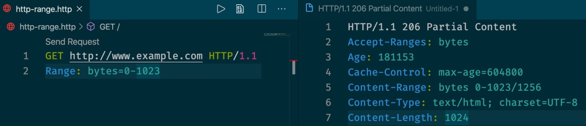
- 多重范围

	Range 头部也支持一次请求文档的多个部分。请求范围用一个逗号分隔开。比如：
		
		$ curl http://www.example.com -i -H "Range: bytes=0-50, 100-150"
	每个部分都会拥有独立的 Content-Type 和 Content-Range 信息，并且使用 boundary 参数对响应体进行划分。
	
	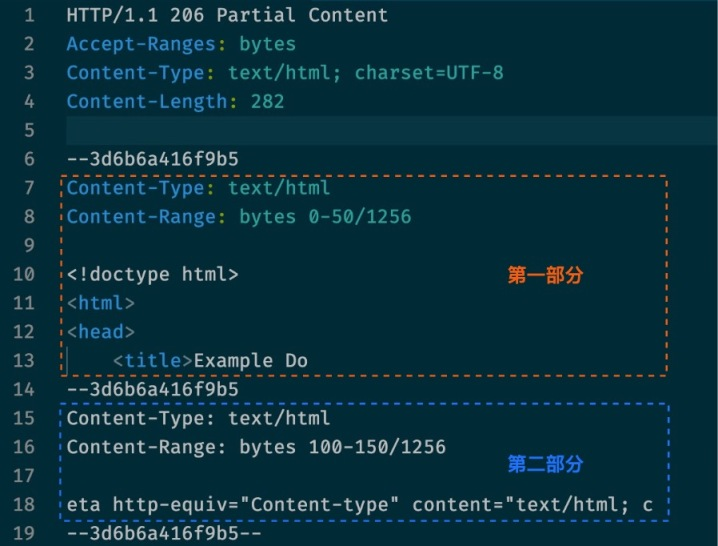
- 条件式范围请求

	当重新开始请求更多资源片段的时候，必须确保自从上一个片段被接收之后该资源没有进行过修改。

	`If-Range` 请求首部可以用来生成条件式范围请求：
	
	- 假如条件满足的话，条件请求就会生效，服务器会返回状态码为 206 Partial 的响应，以及相应的消息主体。
	- 假如条件未能得到满足，那么就会返回状态码为 200 OK 的响应，同时返回整个资源。该首部可以与 Last-Modified 验证器或者 ETag 一起使用，但是二者不能同时使用。
- 范围请求的响应

	与范围请求相关的有三种状态：

	- 在请求成功的情况下，服务器会返回 206 Partial Content 状态码。
	- 在请求的范围越界的情况下（范围值超过了资源的大小），服务器会返回 416 Requested Range Not Satisfiable （请求的范围无法满足） 状态码。
	- 在不支持范围请求的情况下，服务器会返回 200 OK 状态码。

## 2 流媒体
流媒体是指将一连串的媒体数据压缩后，经过网上分段发送数据，在网上即时传输影音以供观赏的一种技术与过程，此技术使得数据包得以像流水一样发送；如果不使用此技术，就必须在使用前下载整个媒体文件。

流媒体实际指的是一种新的媒体传送方式，有声音流、视频流、文本流、图像流、动画流等，而非一种新的媒体。流媒体最主要的技术特征就是流式传输，它使得数据可以像流水一样传输。流式传输是指通过网络传送媒体技术的总称。实现流式传输主要有两种方式：

- 顺序流式传输（Progressive Streaming）
- 实时流式传输（Real Time Streaming）

流媒体有众多协议，比如 HTTP-FLV、HLS 等，不同的协议有着不同的优缺点。在实际使用过程中，我们通常会在平台兼容的条件下选用最优的流媒体传输协议。比如，

- 在浏览器里做直播，选用 HTTP-FLV 协议是不错的，性能优于 RTMP+Flash，延迟可以做到和 RTMP+Flash 一样甚至更好。
- 由于 HLS 延迟较大，一般只适合视频点播的场景，但由于它在移动端拥有较好的兼容性，所以在接受高延迟的条件下，也是可以应用在直播场景。

### 流媒体与传统播放模式的区别
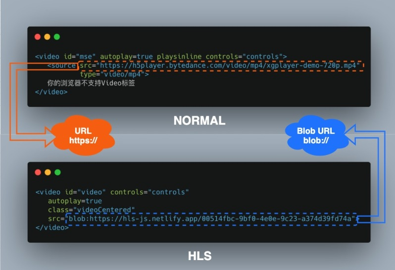
当使用 HLS 流媒体网络传输协议时，<video> 元素 src 属性使用的是 blob:// 协议。
#### 基础知识
- Blob
	
	Blob（Binary Large Object）表示二进制类型的大对象。在数据库管理系统中，将二进制数据存储为一个单一个体的集合。Blob 通常是影像、声音或多媒体文件。在 JavaScript 中 Blob 类型的对象表示`不可变`的类似文件对象的原始数据。
	
	Blob 由一个可选的字符串 type（通常是 MIME 类型）和 blobParts 组成

	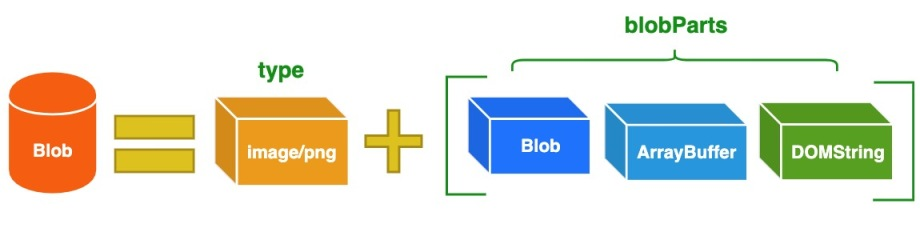
	
	- MIME（Multipurpose Internet Mail Extensions）多用途互联网邮件扩展类型，是设定某种扩展名的文件用一种应用程序来打开的方式类型，当该扩展名文件被访问的时候，浏览器会自动使用指定应用程序来打开。多用于指定一些客户端自定义的文件名，以及一些媒体文件打开方式。

		常见的 MIME 类型有：超文本标记语言文本 .html text/html、PNG图像 .png image/png、普通文本 .txt text/plain 等。
	- Blob 构造函数

		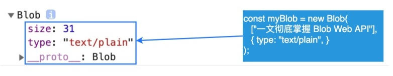
		
		myBlob 对象含有两个属性：
		
		- size

			size 属性用于表示数据的大小（以字节为单位）
		- typy

			type 是 MIME 类型的字符串。
		
		Blob 表示的不一定是 JavaScript 原生格式的数据。比如 File 接口基于 Blob，继承了 blob 的功能并将其扩展使其支持用户系统上的文件
- Blob URL/Object URL

	Blob URL/Object URL 是一种伪协议，允许 Blob 和 File 对象用作图像，下载二进制数据链接等的 URL 源。在浏览器中，使用 `URL.createObjectURL` 方法来创建 Blob URL，该方法接收一个 Blob 对象，并为其创建一个唯一的 URL，其形式为 `blob:<origin>/<uuid>`，对应的示例如下：
	
		blob:https://example.org/40a5fb5a-d56d-4a33-b4e2-0acf6a8e5f641
	
	浏览器内部为每个通过 `URL.createObjectURL` 生成的 URL 存储了一个 URL → Blob 映射。因此，此类 URL 较短，但可以访问 Blob。生成的 URL 仅在当前文档打开的状态下才有效。但如果你访问的 Blob URL 不再存在，则会从浏览器中收到 404 错误。

	上述的 Blob URL 看似很不错，但实际上它也有副作用。
	
	- 虽然存储了 URL → Blob 的映射，但 Blob 本身仍驻留在内存中，浏览器无法释放它。
	- 映射在文档卸载时自动清除，因此 Blob 对象随后被释放。但是，如果应用程序寿命很长，那不会很快发生。
	
	因此，如果我们创建一个 Blob URL，即使不再需要该 Blob，它也会存在内存中。针对这个问题，可以调用 `URL.revokeObjectURL(url)`  方法，从内部映射中删除引用，从而允许删除 Blob（如果没有其他引用），并释放内存。
- Blob vs ArrayBuffer

	其实在前端除了 `Blob` 对象 之外，还可能会遇到 `ArrayBuffer` 对象。它用于表示通用的，`固定长度的原始二进制数据缓冲区`。不能直接操纵 `ArrayBuffer` 的内容，而是需要创建一个 `TypedArray `对象或 `DataView` 对象，该对象以特定格式表示缓冲区，并使用该对象读取和写入缓冲区的内容。
	
	`Blob` 对象与 `ArrayBuffer` 对象拥有各自的特点，它们之间的区别如下：

	- 除非需要使用 `ArrayBuffer` 提供的写入/编辑的能力，否则 `Blob` 格式可能是最好的。
	- Blob 对象是不可变的，而 ArrayBuffer 是可以通过 TypedArrays 或 DataView 来操作。
	- ArrayBuffer 是存在内存中的，可以直接操作。而 Blob 可以位于磁盘、高速缓存内存和其他不可用的位置。
	- 虽然 Blob 可以直接作为参数传递给其他函数，比如 `window.URL.createObjectURL()`。但是，你可能仍需要 `FileReader` 之类的 File API 才能与 Blob 一起使用。
	- Blob 与 ArrayBuffer 对象之间是可以相互转化的：
		- 使用 `FileReader` 的 `readAsArrayBuffer()` 方法，可以把 Blob 对象转换为 ArrayBuffer 对象；
		- 使用 Blob 构造函数，如 `new Blob([new Uint8Array(data])`;，可以把 ArrayBuffer 对象转换为 Blob 对象。

	在前端 AJAX 场景下，除了常见的 JSON 格式之外，我们也可能会用到 Blob 或 ArrayBuffer 对象：

	function GET(url, callback) {
	  let xhr = new XMLHttpRequest();
	  xhr.open('GET', url, true);
	  xhr.responseType = 'arraybuffer'; // or xhr.responseType = "blob";
	  xhr.send();
	  xhr.onload = function(e) {
	    if (xhr.status != 200) {
	      alert("Unexpected status code " + xhr.status + " for " + url);
	      return false;
	    }
	    callback(new Uint8Array(xhr.response)); // or new Blob([xhr.response]);
	  };
	}	
在以上示例中，通过为 `xhr.responseType` 设置不同的数据类型，我们就可以根据实际需要获取对应类型的数据了。

## 3 流媒体几大协议
流媒体协议主要解决的就是用户更好的体验，如何解决，就是通过提前将视频转码，生成索引文件和多个清晰度并切分的小视频文件，再根据用户的情况优化用户接收的数据

由于大厂之间的竞争，市面上形成了多种流媒体协议，包含

- HLS

	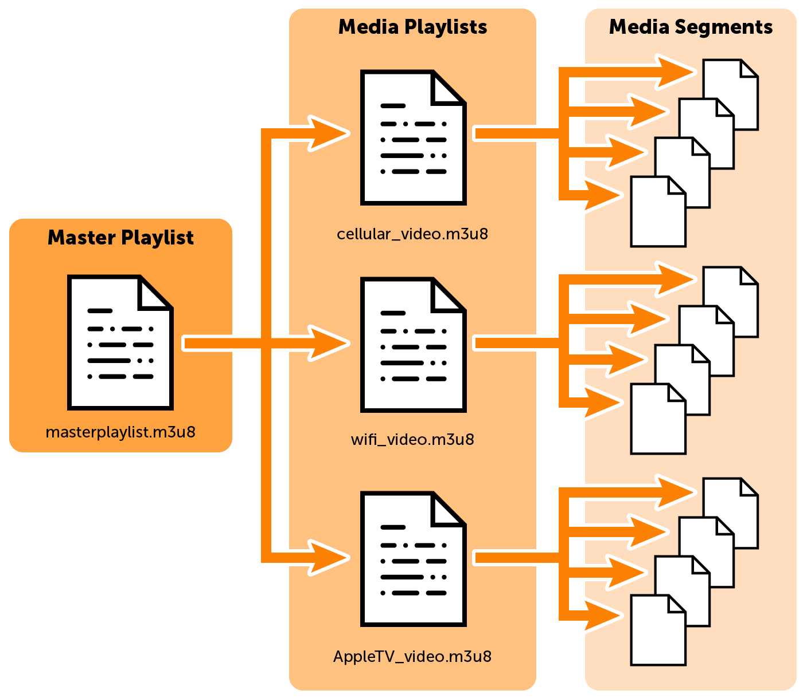
- DASH

	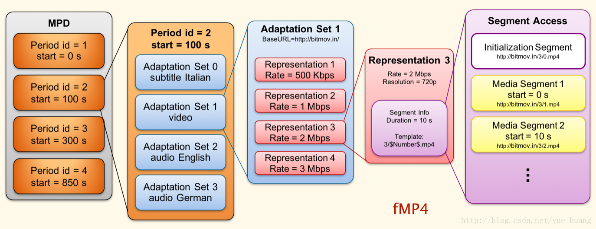
- FLV
	- FLV 文件结构

		FLV 是 FLASH Video 的简称，FLV 流媒体格式是随着 Flash MX 的推出发展而来的视频格式。由于它形成的文件极小、加载速度极快，使得网络观看视频文件成为可能，它的出现有效地解决了视频文件导入 Flash 后，使导出的 SWF 文件体积庞大，不能在网络上很好的使用等问题。
		
		FLV 文件由两部分构成
			
		- FLV Header
			
			FLV 头文件：（9 字节）

			- 1-3

				前 3 个字节是文件格式标识（FLV 0x46 0x4C 0x56）。
			- 4-4

				第 4 个字节是版本（0x01）。
			- 5-5

				第 5 个字节的前 5 个 bit 是保留的必须是 0。
				
				- 第 5 个字节的第 6 个 bit 音频类型标志（TypeFlagsAudio）。
				- 第 5 个字节的第 7 个 bit 也是保留的必须是 0。
				- 第5个字节的第8个bit视频类型标志（TypeFlagsVideo）。
			- 6-9

				第 6-9 的四个字节还是保留的，其数据为 00000009。
			- 整个文件头的长度，一般是 9（3+1+1+4）
		-  FLV Body 
		
			FLV Body 由一系列的 Tag 构成： 
		
			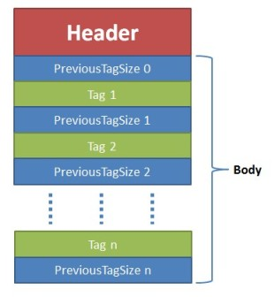
			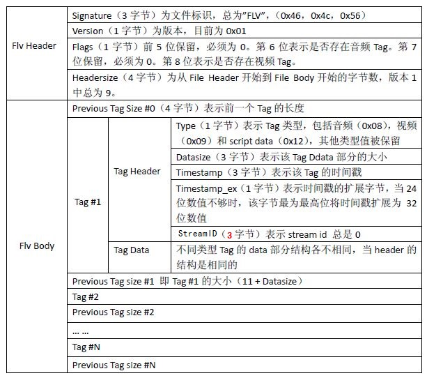
			
			tag 类型信息，固定长度为 15 字节：
			
			- 1-4

				前一个 tag 长度（4字节），第一个 tag 就是 0。
			- 5-5

				tag 类型（1 字节）；0x8 音频；0x9 视频；0x12 脚本数据。
			- 6-8

				tag 内容大小（3 字节）。
			- 9-11

				时间戳（3 字节，毫秒）（第 1 个 tag 的时候总是为 0，如果是脚本 tag 就是 0）。
			- 12-12

				时间戳扩展（1 字节）让时间戳变成 4 字节（以存储更长时间的 flv 时间信息），本字节作为时间戳的最高位。
				
				在 flv 回放过程中，播放顺序是按照 tag 的时间戳顺序播放。任何加入到文件中时间设置数据格式都将被忽略。
			- 13-15

				streamID（3 字节）总是 0。

## 4 flv.js 播放器
### 简介
在浏览器中 HTML5 的 `<video>` 是不支持直接播放 FLV 视频格式，需要借助 flv.js 这个开源库来实现播放 FLV 视频格式的功能。

 flv.js 是用纯 JavaScript 编写的 HTML5 Flash Video（FLV）播放器，它底层依赖于 Media Source Extensions。在实际运行过程中，它会自动解析 FLV 格式文件并喂给原生 HTML5 Video 标签播放音视频数据，使浏览器在不借助 Flash 的情况下播放 FLV 成为可能。
 
 - flv.js 的特性
	 - 支持播放 H.264 + AAC / MP3 编码的 FLV 文件；
	 - 支持播放多段分段视频；
	 - 支持播放 HTTP FLV 低延迟实时流；
	 - 支持播放基于 WebSocket 传输的 FLV 实时流；
	 - 兼容 Chrome，FireFox，Safari 10，IE11 和 Edge；
	 - 极低的开销，支持浏览器的硬件加速。
- flv.js 的限制
	- MP3 音频编解码器无法在 IE11/Edge 上运行；
	- HTTP FLV 直播流不支持所有的浏览器。
	
### 使用
	
	
	<video id="videoElement"></video>
	
### 工作原理
flv.js 的工作原理是将 FLV 文件流转换为 ISO BMFF（Fragmented MP4）片段，然后通过 Media Source Extensions API 将 mp4 段喂给 HTML5 `<video>` 元素。

#### MSE
flv.js 播放器对接游览器播放视频，主要使用的是 MSE,所以先介绍下 MSE
##### MSE API
媒体源扩展 API（Media Source Extensions） 提供了实现无插件且基于 Web 的流媒体的功能。使用 MSE，媒体串流能够通过 JavaScript 创建，并且能通过使用 audio 和 video 标签进行播放。

虽然可以在  Web 应用程序上无插件地播放视频和音频了，但现有架构过于简单，只能满足一次播放整个曲目的需要，无法实现拆分/合并数个缓冲文件。早期的流媒体主要使用 Flash 进行服务，以及通过 RTMP 协议进行视频串流的 Flash 媒体服务器。

媒体源扩展（MSE）实现后，情况就不一样了。MSE 可以把通常的单个媒体文件的 src 值替换成引用 MediaSource 对象（一个包含即将播放的媒体文件的准备状态等信息的容器），以及引用多个 SourceBuffer 对象（代表多个组成整个串流的不同媒体块）的元素。

基础的 MSE 数据流：

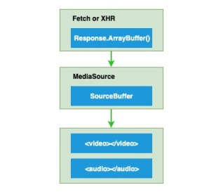
##### MediaSource 接口
MediaSource 是 Media Source Extensions API 表示媒体资源 HTMLMediaElement 对象的接口。MediaSource 对象可以附着在 HTMLMediaElement 在客户端进行播放

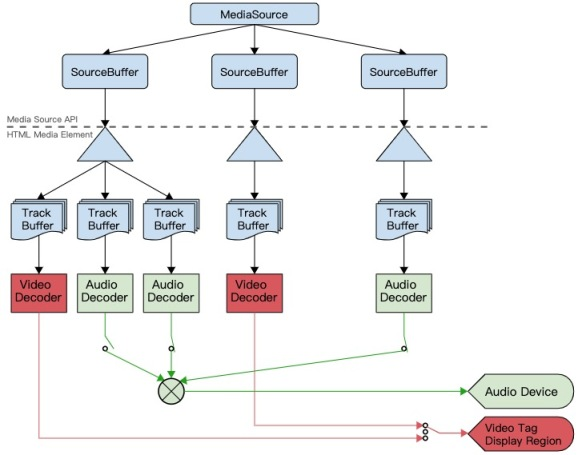

客户端音视频播放器播放一个视频流的主要流程

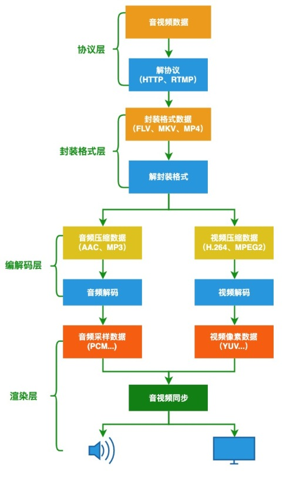

由于采集的原始音视频数据比较大，为了方便网络传输，通常会使用编码器，如常见的 H.264 或 AAC 来压缩原始媒体信号。最常见的媒体信号是视频，音频和字幕。比如，日常生活中的电影，就是由不同的媒体信号组成，除运动图片外，大多数电影还含有音频和字幕。

- 常见的视频编解码器有：H.264，HEVC，VP9 和 AV1
- 常见音频编解码器有：AAC，MP3 或 Opus

每个媒体信号都有许多不同的编解码器。

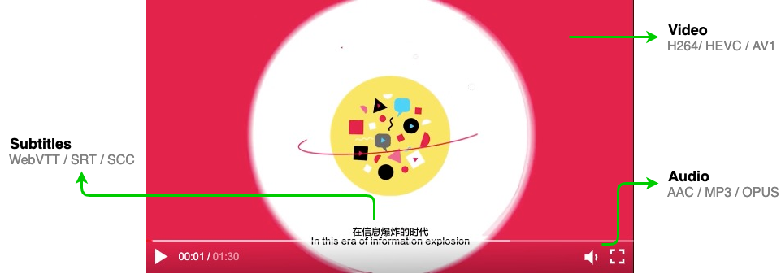

- 接口信息
	- 状态
	
			enum ReadyState {
			    "closed", // 指示当前源未附加到媒体元素。
			    "open", // 源已经被媒体元素打开，数据即将被添加到SourceBuffer对象中
			    "ended" // 源仍附加到媒体元素，但endOfStream()已被调用。
			};
	- 流终止异常
		
			enum EndOfStreamError {
			    "network", // 终止播放并发出网络错误信号。
			    "decode" // 终止播放并发出解码错误信号。
			};		
	- 构造器

			[Constructor]
			interface MediaSource : EventTarget {
			    readonly attribute SourceBufferList    sourceBuffers;
			    readonly attribute SourceBufferList    activeSourceBuffers;
			    readonly attribute ReadyState          readyState;
			             attribute unrestricted double duration;
			             attribute EventHandler        onsourceopen;
			             attribute EventHandler        onsourceended;
			             attribute EventHandler        onsourceclose;
			  
			    SourceBuffer addSourceBuffer(DOMString type);
			    void         removeSourceBuffer(SourceBuffer sourceBuffer);
			    void         endOfStream(optional EndOfStreamError error);
			    void         setLiveSeekableRange(double start, double end);
			    void         clearLiveSeekableRange();
			    static boolean isTypeSupported(DOMString type);
			};
- 属性
	- MediaSource.sourceBuffers 

		只读：返回一个 SourceBufferList 对象，包含了这个 MediaSource 的SourceBuffer 的对象列表。
	- MediaSource.activeSourceBuffers

		只读：返回一个 SourceBufferList 对象，包含了这个MediaSource.sourceBuffers 中的 SourceBuffer 子集的对象—即提供当前被选中的视频轨（video track），启用的音频轨（audio tracks）以及显示/隐藏的字幕轨（text tracks）的对象列表
	- MediaSource.readyState

		只读：返回一个包含当前 MediaSource 状态的集合，即使它当前没有附着到一个 media 元素（closed），或者已附着并准备接收 SourceBuffer 对象（open），亦或者已附着但这个流已被 MediaSource.endOfStream() 关闭。
	- MediaSource.duration

		获取和设置当前正在推流媒体的持续时间。
	- onsourceopen：设置 sourceopen 事件对应的事件处理程序。
	- onsourceended：设置 sourceended 事件对应的事件处理程序。
	- onsourceclose：设置 sourceclose 事件对应的事件处理程序。
- 方法
	- MediaSource.addSourceBuffer()
	
		创建一个带有给定 MIME 类型的新的 SourceBuffer 并添加到 MediaSource 的 SourceBuffers 列表。
	- MediaSource.removeSourceBuffer()

		删除指定的 SourceBuffer 从这个 MediaSource 对象中的 SourceBuffers 列表。
	- MediaSource.endOfStream()

		表示流的结束。
	- MediaSource.isTypeSupported()

		返回一个 Boolean 值表明给定的 MIME 类型是否被当前的浏览器支持—— 这意味着是否可以成功的创建这个 MIME 类型的 SourceBuffer 对象	

- demo

		var vidElement = document.querySelector('video');
		
		if (window.MediaSource) { // (1)
		  var mediaSource = new MediaSource();
		  vidElement.src = URL.createObjectURL(mediaSource);
		  mediaSource.addEventListener('sourceopen', sourceOpen); 
		} else {
		  console.log("The Media Source Extensions API is not supported.")
		}
		
		function sourceOpen(e) {
		  URL.revokeObjectURL(vidElement.src);
		  var mime = 'video/mp4; codecs="avc1.42E01E, mp4a.40.2"';
		  var mediaSource = e.target;
		  var sourceBuffer = mediaSource.addSourceBuffer(mime); // (2)
		  var videoUrl = 'hello-mse.mp4';
		  
		  fetch(videoUrl) // (3)
		    .then(function(response) {
		      return response.arrayBuffer();
		    })
		    .then(function(arrayBuffer) {
		      sourceBuffer.addEventListener('updateend', function(e) { (4)
		        if (!sourceBuffer.updating && mediaSource.readyState === 'open') {
		          mediaSource.endOfStream(); 
		        }
		      });
		      sourceBuffer.appendBuffer(arrayBuffer); // (5)
		    });
		}
	demo 流程
	
	- 判断是否支持 Media Source Extensions API，若支持的话，则创建 MediaSource 对象，且绑定 sourceopen 事件处理函数。
	- 创建一个带有给定 MIME 类型的新的 SourceBuffer 并添加到 MediaSource 的 SourceBuffers 列表。
	- 从远程流服务器下载视频流，并转换成 ArrayBuffer 对象。
	- 为 sourceBuffer 对象添加 updateend 事件处理函数，在视频流传输完成后关闭流。
	- 往 sourceBuffer 对象中添加已转换的 ArrayBuffer 格式的视频流数据。

## 5 多媒体封装格式
一般情况下，一个完整的视频文件是由音频和视频两部分组成的。

- 封装格式

	常见的有 AVI、RMVB、MKV、ASF、WMV、MP4、3GP、FLV 
- 视频编码格式

	H.264，HEVC，VP9 和 AV1 等
- 音频编码格式

	MP3、AAC 和 Opus 等

比如：将一个 H.264 视频编码文件和一个 AAC 音频编码文件按 MP4 封装标准封装以后，就得到一个 MP4 后缀的视频文件，也就是我们常见的 MP4 视频文件了。

音视频编码的主要目的是压缩原始数据的体积，而封装格式（也称为多媒体容器），比如 MP4，MKV，是用来存储/传输编码数据，并按一定规则把音视频、字幕等数据组织起来，同时还会包含一些元信息，比如当前流中包含哪些编码类型、时间戳等，播放器可以按照这些信息来匹配解码器、同步音视频。

### 视频播放器原理
视频播放器是指能播放以数字信号形式存储的视频的软件，也指具有播放视频功能的电子器件产品。大多数视频播放器（除了少数波形文件外）携带解码器以还原经过压缩的媒体文件，视频播放器还要内置一整套转换频率以及缓冲的算法。大多数的视频播放器还能支持播放音频文件。

视频播放基本处理流程大致包括以下几个阶段：

- 解协议

	从原始的流媒体协议数据中删除信令数据，只保留音视频数据，如采用 RTMP 协议传输的数据，经过解协议后输出 flv 格式的数据。
- 解封装

	分离音频和视频压缩编码数据，常见的封装格式 MP4、MKV、RMVB、FLV、AVI 这些格式。从而将已经压缩编码的视频、音频数据放到一起。例如 FLV 格式的数据经过解封装后输出 H.264 编码的视频码流和 AAC 编码的音频码流。
- 解码

	视频、音频压缩编码数据，还原成非压缩的视频，音频原始数据，音频的压缩编码标准包括 AAC，MP3，AC-3 等，视频压缩编码标准包含 H.264，MPEG2，VC-1 等经过解码得到非压缩的视频颜色数据如 YUV420P，RGB 和非压缩的音频数据如 PCM 等。
- 视频同步

	将同步解码出来的音频和视频数据分别送至系统声卡和显卡播放。


### 多媒体封装格式
对于数字媒体数据来说，容器就是一个可以将多媒体数据混在一起存放的东西，就像是一个包装箱，它可以对音、视频数据进行打包装箱，将原来的两块独立的媒体数据整合到一起，当然也可以单单只存放一种类型的媒体数据。

多媒体容器也称封装格式，它只是为编码后的多媒体数据提供了一个 “外壳”，也就是将所有的处理好的音频、视频或字幕都包装到一个文件容器内呈现给观众，这个包装的过程就叫封装。 常用的封装格式有： MP4，MOV，TS，FLV，MKV 等。这里介绍大家比较熟悉的 MP4 封装格式。

- MP4 封装格式

	MPEG-4 Part 14（MP4）是最常用的容器格式之一，通常以 .mp4 文件结尾。它用于 HTTP（DASH）上的动态自适应流，也可以用于 Apple 的 HLS 流。MP4 基于 ISO 基本媒体文件格式（MPEG-4 Part 12），该格式基于 QuickTime 文件格式。MPEG 代表动态图像专家组，是国际标准化组织（ISO）和国际电工委员会（IEC）的合作。MPEG 的成立是为了设置音频和视频压缩与传输的标准。

	MP4 支持多种编解码器，常用的视频编解码器是 H.264 和 HEVC，而常用的音频编解码器是 AAC，AAC 是著名的 MP3 音频编解码器的后继产品。

	MP4 是由一些列的 box 组成，它的最小组成单元是 box。MP4 文件中的所有数据都装在 box 中，即 MP4 文件由若干个 box 组成，每个 box 有类型和长度，可以将 box 理解为一个数据对象块。box 中可以包含另一个 box，这种 box 称为 container box。
	
	一个 MP4 文件首先会有且仅有 一个 ftype 类型的 box，作为 MP4 格式的标志并包含关于文件的一些信息，之后会有且只有一个 moov 类型的 box（movie box），它是一种 container box，可以有多个，也可以没有，媒体数据的结构由 metadata 进行描述。
	
	MP4 文件内部的结构：		

	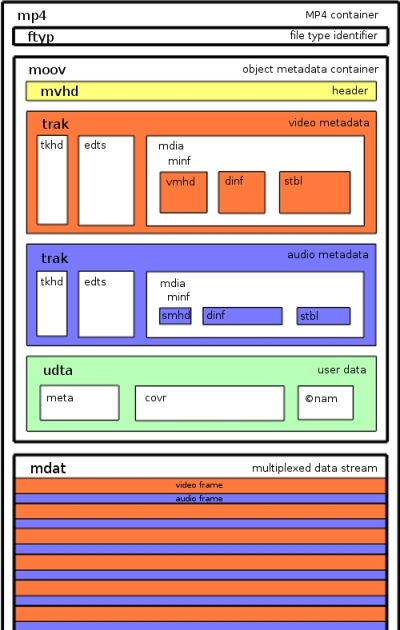
- Fragmented MP4

	MP4 ISO Base Media 文件格式标准允许以 fragmented 方式组织 box，这也就意味着 MP4 文件可以组织成这样的结构，由一系列的短的 metadata/data box 对组成，而不是一个长的 metadata/data 对。Fragmented MP4 文件结构如下图所示，图中只包含了两个 fragments
	
	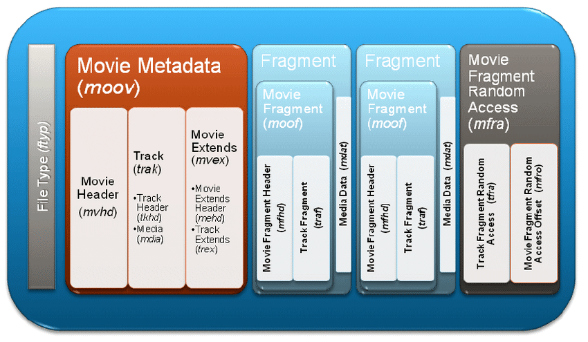

	在 Fragmented MP4 文件中含有三个非常关键的 boxes：moov、moof 和 mdat。
	
	- moov（movie metadata box）

		用于存放多媒体 file-level 的元信息。
	- mdat（media data box）

		和普通 MP4 文件的 mdat 一样，用于存放媒体数据，不同的是普通 MP4 文件只有一个 mdat box，而 Fragmented MP4 文件中，每个 fragment 都会有一个 mdat 类型的 box。
	- moof（movie fragment box）

		用于存放 fragment-level 的元信息。该类型的 box 在普通的 MP4 文件中是不存在的，而在 Fragmented MP4 文件中，每个 fragment 都会有一个 moof 类型的 box。

	Fragmented MP4 文件中的 fragment 由 moof 和 mdat 两部分组成，每个 fragment 可以包含一个音频轨或视频轨，并且也会包含足够的元信息，以保证这部分数据可以单独解码。Fragment 的结构如下图所示：
	
	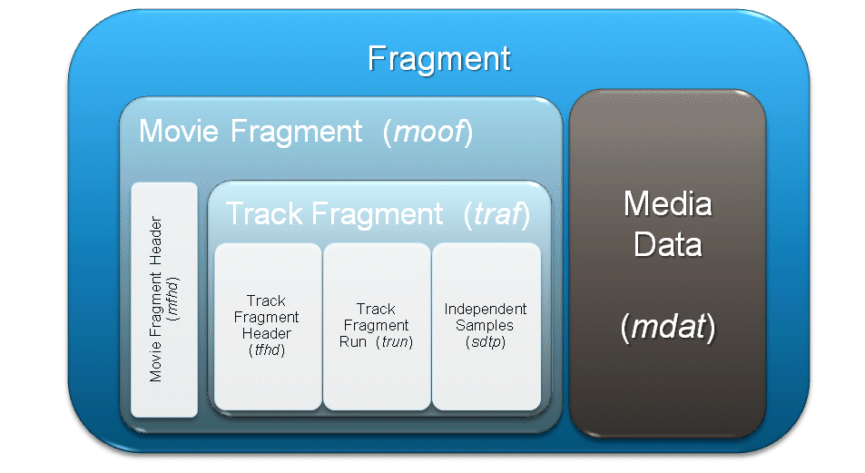

mp4 与 fmp4 的区别

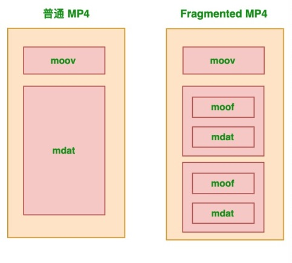

## 6 播放器的各种实现
- 实现视频本地预览

	视频本地预览的功能主要利用 URL.createObjectURL() 方法来实现。URL.createObjectURL() 静态方法会创建一个 DOMString，其中包含一个表示参数中给出的对象的 URL。这个 URL 的生命周期和创建它的窗口中的 document 绑定。 这个新的 URL 对象表示指定的 File 对象或 Blob 对象。
	
		<!DOCTYPE html>
		<html>
		  <head>
		    <meta charset="UTF-8" />
		    <meta name="viewport" content="width=device-width, initial-scale=1.0" />
		    <title>视频本地预览示例</title>
		  </head>
		  <body>
		    <h3>视频本地预览示例</h3>
		    <input type="file" accept="video/*" onchange="loadFile(event)" />
		    <video
		      id="previewContainer"
		      controls
		      width="480"
		      height="270"
		      style="display: none;"
		    ></video>
		
		    
		  </body>
		</html>	
- 如何实现播放器截图

	播放器截图功能主要利用 CanvasRenderingContext2D.drawImage() API 来实现。Canvas 2D API 中的 CanvasRenderingContext2D.drawImage()  方法提供了多种方式在 Canvas 上绘制图像。
	
	drawImage API 的语法如下：
	
		void ctx.drawImage(image, dx, dy);
		void ctx.drawImage(image, dx, dy, dWidth, dHeight);
		void ctx.drawImage(image, sx, sy, sWidth, sHeight, dx, dy, dWidth, dHeight);
	其中 image 参数表示绘制到上下文的元素。允许任何的 canvas 图像源（CanvasImageSource），例如：CSSImageValue，HTMLImageElement，SVGImageElement，HTMLVideoElement，HTMLCanvasElement，ImageBitmap 或者 OffscreenCanvas
	
		<!DOCTYPE html>
		<html lang="en">
		  <head>
		    <meta charset="UTF-8" />
		    <meta name="viewport" content="width=device-width, initial-scale=1.0" />
		    <title>播放器截图示例</title>
		  </head>
		  <body>
		    <h3>播放器截图示例</h3>
		    <video id="video" controls="controls" width="460" height="270" crossorigin="anonymous">
		      <!-- 请替换为实际视频地址 -->
		      <source src="https://xxx.com/vid_159411468092581" />
		    </video>
		    <button onclick="captureVideo()">截图</button>
		    
		  </body>
		</html>

	现在已经知道如何获取视频的每一帧，其实在结合 gif.js 这个库提供的 GIF 编码功能，就可以快速地实现截取视频帧生成 GIF 动画的功能。
- 如何实现 Canvas 播放视频

	使用 Canvas 播放视频主要是利用 ctx.drawImage(video,  x,  y, width, height) 来对视频当前帧的图像进行绘制，其中 video 参数就是页面中的 video 对象。所以如果按照特定的频率不断获取 video 当前画面，并渲染到 Canvas 画布上，就可以实现使用 Canvas 播放视频的功能。
	
		<!DOCTYPE html>
		<html>
		  <head>
		    <meta charset="UTF-8" />
		    <meta name="viewport" content="width=device-width, initial-scale=1.0" />
		    <title>使用 Canvas 播放视频</title>
		  </head>
		  <body>
		    <h3>使用 Canvas 播放视频</h3>
		    <video id="video" controls="controls" style="display: none;">
		      <!-- 请替换为实际视频地址 -->
		      <source src="https://xxx.com/vid_159411468092581" />
		    </video>
		    <canvas
		      id="myCanvas"
		      width="460"
		      height="270"
		      style="border: 1px solid blue;"
		    ></canvas>
		    

		      <button id="playBtn">播放</button>
		      <button id="pauseBtn">暂停</button>
		    

		    
		  </body>
		</html>
- 如何实现色度键控（绿屏效果）

	上一个示例介绍了使用 Canvas 播放视频，那么为什么要通过 Canvas 绘制视频，Video 标签不可以麽？这是因为 Canvas 提供了 getImageData 和 putImageData 方法使得开发者可以动态地更改每一帧图像的显示内容。这样的话，就可以实时地操纵视频数据来合成各种视觉特效到正在呈现的视频画面中。
	
	比如 MDN 上的 ”使用 canvas 处理视频“ 的教程中就演示了如何使用 JavaScript 代码执行色度键控（绿屏或蓝屏效果）。所谓的色度键控，又称色彩嵌空，是一种去背合成技术。Chroma 为纯色之意，Key 则是抽离颜色之意。把被拍摄的人物或物体放置于绿幕的前面，并进行去背后，将其替换成其他的背景。此技术在电影、电视剧及游戏制作中被大量使用，色键也是虚拟摄影棚（Virtual studio）与视觉效果（Visual effects）当中的一个重要环节。
	
	下面我们来看一下关键代码：

	
		processor.computeFrame = function computeFrame() {
		    this.ctx1.drawImage(this.video, 0, 0, this.width, this.height);
		    let frame = this.ctx1.getImageData(0, 0, this.width, this.height);
		    let l = frame.data.length / 4;
		
		    for (let i = 0; i < l; i++) {
		      let r = frame.data[i * 4 + 0];
		      let g = frame.data[i * 4 + 1];
		      let b = frame.data[i * 4 + 2];
		      if (g > 100 && r > 100 && b < 43)
		        frame.data[i * 4 + 3] = 0;
		    }
		    this.ctx2.putImageData(frame, 0, 0);
		    return;
		}
	以上的 computeFrame() 方法负责获取一帧数据并执行色度键控效果。利用色度键控技术，我们还可以实现纯客户端实时蒙版弹幕。

## 参考
- [「1.4 万字」玩转前端 Video 播放器 | 多图预警](https://xie.infoq.cn/article/8d2b0ba59ea03dd458a902ef0)
- 自己做播放器
	- [花椒开源项目实时互动流媒体播放器](https://juejin.im/post/6844904019379372040)
	- [从零开始写一个 Web 视频播放器](https://juejin.im/entry/6844903550607163400)
	- [Support for ISOBMFF-based MIME types in Browsers](https://cconcolato.github.io/media-mime-support/)
	- [Media Source Extensions](https://www.webq.top/doc/mse)