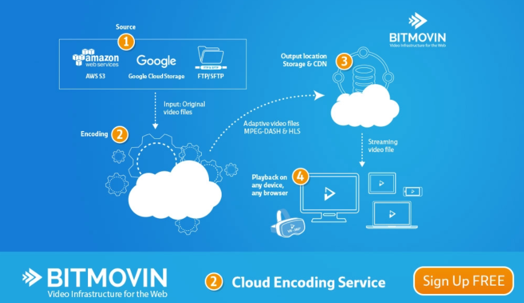

# 自适性流
## 介绍
自适性流（英语：ABS, adaptive bitrate streaming），是一种在电脑网络使用的一种技术流技术。过去的流媒体技术多使用 RTP/RTSP，但现在的技术则大多基于 HTTP，并为更高效在大型分布式 HTTP 网络（例如互联网）分发而设计。

此技术根据实时检测的用户的带宽和 CPU 使用率，调整视频流的质量。这需要使用一种可以将单一视频源输出为多码率的编码器。播放器客户端依赖可用资源在不同码率的流之间切换。"结果就是：更少缓存、更快的开始播放、为低端和高端链接都提供良好的体验。"

根据当前广泛使用的实现，更具体来说，自适应流（ABS）：

- 使用 HTTP 传送视频流
- 使用多码率编码源内容
- 每个单码率的流被切成小的，几秒钟的小切片

流媒体客户端首先获取所有码率的切片索引信息。一开始，客户端先请求最低码率的流。如果客户端判断下载速度比当前码率的切片流快，它就去请求下一个更高码率的流。随着播放的进行，如果客户端发现下载速度比当前码率的切片流慢，转而请求下一个较低码率的流。

切片大小和具体实现密切相关，不过一般都在 2～10 秒之间。每个切片由一个完整的 GOP 序列组成，一个GOP序列里面有1个或者多个I帧，GOP序列的第一个帧必须是I帧，并且每个切片都能单独的解码播放显示。

## 技术的实现
方式现在有四种方案

- Apple HTTP Live Streaming (HLS)

	HTTP Live Streaming 在 iPhone 3.0 及更新版中成为标准功能，支持直播和时移。
	
	- 索引文件为 .m3u8 
	- 文件切片帧式为TS
- Microsoft Smooth Streaming (MSS)

	Smooth Streaming 是IIS的媒体服务扩展，用于支持基于HTTP的自适应流。

	在2010年11月发布的 IIS Media Services 4.0 中，微软引入了一项使 Live Smooth Streaming H.264/AAC 视频动态封装成 Apple HLS 格式的功能，直接提供给 iOS 设备，而不需要再次编码，支持直播和时移。

	- 索引文件为 ism/ismc

		ism文件格式 demo：

			<?xml version="1.0" encoding="utf-16"?>
			<smil xmlns="http://www.w3.org/2001/SMIL20/Language">
			  <head>
			    <meta name="clientManifestRelativePath" content="LiveSmoothStream.ismc" />
			  </head>
			  <body>
			    <switch>
			      <audio src="stream101.isma" systemBitrate="64000" systemLanguage="eng">
			        <param name="manifestOutput" value="false" valuetype="data" />
			        <param name="trackID" value="101" valuetype="data" />
			        <param name="trackName" value="audio101_eng" valuetype="data" />
			      </audio>
			      <video src="stream201.ismv" systemBitrate="1200000" systemLanguage="und">
			        <param name="manifestOutput" value="false" valuetype="data" />
			        <param name="trackID" value="201" valuetype="data" />
			        <param name="trackName" value="video" valuetype="data" />
			      </video>
			      <video src="stream202.ismv" systemBitrate="600000" systemLanguage="und">
			        <param name="manifestOutput" value="false" valuetype="data" />
			        <param name="trackID" value="202" valuetype="data" />
			        <param name="trackName" value="video" valuetype="data" />
			      </video>
			    </switch>
			  </body>
			</smil>
	- 文件切片帧式为 mp4
- Adobe HTTP Dynamic Streaming (HDS)

	Flash Player 和 Flash Media Server 的最新版支持传统的 RTMP 协议和 HTTP 协议。后者和 Apple 和微软基于 HTTP 的方案类似。，支持直播和时移。
	
	- 索引文件为  f4m

		f4m 文件格式：
			
			<manifest xmlns="http://ns.adobe.com/f4m/2.0">
			<media href="../hds-vod/sample1_150kbps.f4v.f4m" bitrate="150"/>
			<media href="../hds-vod/sample1_700kbps.f4v.f4m" bitrate="700"/>
			<media href="../hds-vod/sample1_1000kbps.f4v.f4m" bitrate="1000"/>
			</manifest>
	- 文件切片帧式为 FLV/F4V/MP4

	基于 HTTP 的流的优势是
	
	- 不需要防火墙开 web 所需端口以外的任何端口
	- 允许视频切片在浏览器、网关和 CDN 的缓存，从而显著降低源服务器的负载。
	- HDS 的文件格式为 FLV/F4V/MP4，索引文件为 f4m，同时支持直播和时移。
- MPEG DASH

	HTTP 的动态自适应流(DASH-Dynamic Adaptive Streaming over HTTP）是首个基于 HTTP 的自适应比特率流解决方案，它也是一项国际标准。MPEG-DASH 是基于 该方案实现。
	
	它类似于苹果的 HLS，DASH 会通过 media presentation description (MPD) 将视频内容切片成一个很短的文件片段，每个切片都有多个不同的码率，DASH Client 可以根据网络的情况选择一个码率进行播放，支持在不同码率之间无缝切换，Youtube，B站都是用的这个方案。这个方案索引文件通常是 mpd 文件。
	
	MPEG-DASH 技术由 MPEG 主导开发，它基于 3GPP 第9版的 Adaptive HTTP streaming（AHS）和 Open IPTV Forum 第2版的 HTTP Adaptive Streaming (HAS)。作为与 MPEG 合作的一部分，3GPP 第10版采用了 DASH（采用特别的编码和操作模式），用于无线网络。
	
	不同于 HLS、HDS和Smooth Streaming，DASH 不关心编解码器，因此它可以接受任何编码格式编码的内容，如H.265、H.264、VP9等
	
	MPEG-DASH 转码实现
	
	- bitmovin GmbH 的开源 DASH 客户端库 [libdash](https://zh.wikipedia.org/w/index.php?title=Libdash&action=edit&redlink=1) 
	- [DASHEncoder](https://github.com/slederer/DASHEncoder)
	
		

## 播放协议对比	
播放协议|播放url
---|---
MSS| http://www.example.com/LiveSmoothStream.isml/Manifest
HLS|http://www.example.com/video.m3u8
Adobe HTTP Dynamic Streaming|http://www.example.com/video.f4m
MPEG DASH|http://www.example.com/video.mpd

## 参考
- [自适性流](https://zh.wikipedia.org/wiki/%E8%87%AA%E9%81%A9%E6%80%A7%E4%B8%B2%E6%B5%81)
- [HTTP Adaptive Streaming](https://web.archive.org/web/20140203042325/http://www.cnblogs.com/aHuner/p/3216160.html)
		
