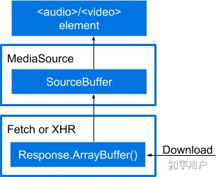
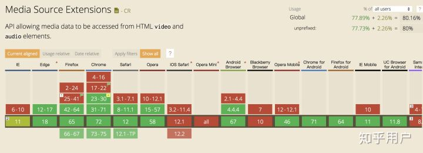

# 视频链接地址是 blob
HTML5 提供了 video 标签，只要一个 video 标签，src 属性设置为视频的地址就可有。src 指向真实的视频网络地址，在早期网站不通过 referer 设置防盗链。现在云存储服务商大部分都支持 referer 防盗链。原理就是在访问资源时，请求头会带上发起请求的页面地址，判断其不存在（表示直接访问资源地址）或不在白名单内，即为盗链。

## Blob 和 ArrayBuffer
- Blob

	在web领域，Blob 对象表示一个只读原始数据的类文件对象，虽然是二进制原始数据但是类似文件的对象，因此可以像操作文件对象一样操作 Blob 对象。(早期数据库直接用 Blob 来存储二进制数据对象，这样就不用关注存储数据的格式了。)

- ArrayBuffer

	ArrayBuffer 对象用来表示通用的、固定长度的原始二进制数据缓冲区。可以通过 `new ArrayBuffer(length)` 来获得一片连续的内存空间，它不能直接读写，但可根据需要将其传递到 `TypedArray` 视图或 `DataView` 对象来解释原始缓冲区。实际上视图只是给你提供了一个某种类型的读写接口，让你可以操作 `ArrayBuffer` 里的数据。`TypedArray` 需指定一个数组类型来保证数组成员都是同一个数据类型，而 `DataView` 数组成员可以是不同的数据类型。
	
TypedArray 视图的类型数组对象有以下几个

- Int8Array：8位有符号整数，长度1个字节。
- Uint8Array：8位无符号整数，长度1个字节。
- Uint8ClampedArray：8位无符号整数，长度1个字节，溢出处理不同。
- Int16Array：16位有符号整数，长度2个字节。
- Uint16Array：16位无符号整数，长度2个字节。
- Int32Array：32位有符号整数，长度4个字节。
- Uint32Array：32位无符号整数，长度4个字节。
- Float32Array：32位浮点数，长度4个字节。
- Float64Array：64位浮点数，长度8个字节。

Blob 与 ArrayBuffer 的区别是，除了原始字节以外它还提供了 mime type 作为元数据，Blob 和 ArrayBuffer 之间可以进行转换。

而 File 对象其实继承自 Blob 对象，并提供了 name ， lastModifiedDate， size ，type 等基础元数据

	创建 Blob 对象并转换成 ArrayBuffer
	
	//创建一个以二进制数据存储的 html 文件
	const text = "
hello world
";
	const blob = new Blob([text], { type: "text/html" }); // Blob {size: 22, type: "text/html"}
	
	//以文本读取
	const textReader = new FileReader();
	textReader.readAsText(blob);
	textReader.onload = function() {
	  console.log(textReader.result); // 
hello world

	};
	
	//以 ArrayBuffer 形式读取
	const bufReader = new FileReader();
	bufReader.readAsArrayBuffer(blob);
	bufReader.onload = function() {
	  console.log(new Uint8Array(bufReader.result)); // Uint8Array(22) [60, 100, 105, 118, 62, 104, 101, 108, 108, 111, 32, 119, 111, 114, 108, 100, 60, 47, 100, 105, 118, 62]
	};
创建一个相同数据的 ArrayBuffer，并转换成 Blob

	//我们直接创建一个Uint8Array并填入上面的数据
	const u8Buf = new Uint8Array([60, 100, 105, 118, 62, 104, 101, 108, 108, 111, 32, 119, 111, 114, 108, 100, 60, 47, 100, 105, 118, 62]);
	const u8Blob = new Blob([u8Buf], { type: "text/html" }); // Blob {size: 22, type: "text/html"}
	const textReader = new FileReader();
	
	textReader.readAsText(u8Blob);
	textReader.onload = function() {
	  console.log(textReader.result); // 同样得到div>hello world

	};

其他参考资料

- [MDN Blob](https://developer.mozilla.org/zh-CN/docs/Web/API/Blob)
- [MDN ArrayBuffer](https://developer.mozilla.org/zh-CN/docs/Web/JavaScript/Reference/Global_Objects/ArrayBuffer)
- [阮一峰js标准参考教程二进制数组](http://javascript.ruanyifeng.com/stdlib/arraybuffer.html)

## URL.createObjectURL
video 标签，audio 标签还是 img 标签的 src 属性，不管是相对路径，绝对路径，或者一个网络地址，归根结底都是指向一个文件资源的地址。既然知道了 Blob 其实是一个可以当作文件用的二进制数据，那么只要可以生成一个指向 Blob 的地址，是不是就可以用在这些标签的 src 属性上，答案肯定是可以的，这里我们要用到的就是 URL.createObjectURL()。

	const objectURL = URL.createObjectURL(object); //blob:http://localhost:1234/abcedfgh-1234-1234-1234-abcdefghijkl

这里的 object 参数是用于创建  URL 的 File 对象、Blob 对象或者 MediaSource 对象，生成的链接就是以 blob 开头的一段地址，表示指向的是一个二进制数据。

参数说明
 
 - localhost:1234 是当前网页的主机名称和端口号，也就是 location.host 
 - Blob URL 是可以直接访问的。

 	需要注意即使同样的二进制数据，每调用一次 `URL.createObjectURL` 方法，就会得到一个不一样的 Blob URL。这个 URL 的存在时间，等同于网页的存在时间，一旦网页刷新或卸载，这个 `Blob URL` 就失效。
 	
通过 `URL.revokeObjectURL(objectURL)` 可以释放 URL 对象。当结束使用某个 URL 对象之后，应该通过调用这个方法来让浏览器知道不用在内存中继续保留对这个文件的引用了,允许平台在合适的时机进行垃圾收集。

如果是以文件协议打开的 html 文件（即url为file://开头），则地址中 http://localhost:1234 会变成 null，而且此时这个 Blob URL 是无法直接访问的

### demo
- 上传图片预览

	通过 input 上传图片文件之前，会希望可以预览一下图片，这个时候就可以通过前面所学到的东西实现，而且非常简单
	
	- html

			<input id="upload" type="file" />
			
	- javascript
	
			const upload = document.querySelector("#upload");
			const preview = document.querySelector("#preview");
			
			upload.onchange = function() {
			  const file = upload.files[0]; //File对象
			  const src = URL.createObjectURL(file); 
			  preview.src = src;
			};

- 以 Blob URL 加载网络视频

	现在有一个网络视频的地址，怎么能将这个视频地址变成 Blob URL 是形式呢，思路肯定是先要拿到存储这个视频原始数据的 Blob 对象，但是不同于 input 上传可以直接拿到 File 对象，只有一个网络地址。

	平时请求接口可以使用xhr（jquery 里的 ajax 和 axios 就是封装的这个）或 fetch，请求一个服务端地址可以返回相应的数据，那如果用 xhr 或者 fetch 去请求一个图片或视频返回图片和视频的数据，只不过要设置正确 `responseType` 才能拿到想要的格式数据。

		function ajax(url, cb) {
		  const xhr = new XMLHttpRequest();
		  xhr.open("get", url);
		  xhr.responseType = "blob"; // "text"-字符串 "blob"-Blob对象 "arraybuffer"-ArrayBuffer对象
		  xhr.onload = function() {
		    cb(xhr.response);
		  };
		  xhr.send();
		}
注意 XMLHttpRequest 和 Fetch API 请求会有跨域问题，可以通过跨域资源共享(CORS)解决。

看到 responseType 可以设置 blob 和 arraybuffer 应该就有谱了，请求返回一个 Blob 对象，或者返回 ArrayBuffer 对象转换成 Blob 对象，然后通过 createObjectURL 生成地址赋值给视频的 src 属性就可以了,这里直接请求一个 Blob 对象。

	ajax('video.mp4', function(res){
	    const src = URL.createObjectURL(res); 
	    video.src = src;
	})
用调试工具查看视频标签的 src 属性已经变成一个 Blob URL，表面上看起来是不是和各大视频网站形式一致了，但是考虑一个问题，这种形式要等到请求完全部视频数据才能播放，小视频还好说，要是视频资源大一点岂不爆炸，显然各大视频网站不可能这么干。

解决这个问题的方法就是流媒体，其带给我们最直观体验就是使媒体文件可以边下边播，web端如果要使用流媒体，有多个流媒体协议可以供我们选择。
		
### MediaSource
不管是 HLS 还是 DASH，都有对应的库甚至是高级的播放器方便使用，但其实是想要学习一点实现。其实抛开掉索引文件的解析拿到实际媒体文件的传输地址，只有一个如何将多个视频数据合并让 video 标签可以无缝播放
	
video 标签 src 指向一个视频地址，视频播完了再将 src 修改为下一段的视频地址然后播放，这显然不符合我们无缝播放的要求。其实有了我们前面 Blob URL 的学习，我们可能就会想到一个思路，用 Blob URL 指向一个视频二进制数据，然后不断将下一段视频的二进制数据添加拼接进去。这样就可以在不影响播放的情况下，不断的更新视频内容并播放下去，想想是不是有点流的意思出来了。
要实现这个功能我们要通过 MediaSource 来实现，MediaSource 接口功能也很纯粹，作为一个媒体数据容器可以和HTMLMediaElement 进行绑定。基本流程就是通过 URL.createObjectURL 创建容器的 BLob URL，设置到 video 标签的 src 上，在播放过程中，仍然可以通过 MediaSource.appendBuffer 方法往容器里添加数据，达到更新视频内容的目的。

	const video = document.querySelector('video');
	//视频资源存放路径，假设下面有5个分段视频 video1.mp4 ~ video5.mp4，第一个段为初始化视频init.mp4
	const assetURL = "http://www.demo.com";
	//视频格式和编码信息，主要为判断浏览器是否支持视频格式，但如果信息和视频不符可能会报错
	const mimeCodec = 'video/mp4; codecs="avc1.42E01E, mp4a.40.2"'; 
	if ('MediaSource' in window && MediaSource.isTypeSupported(mimeCodec)) {
	  const mediaSource = new MediaSource();
	  video.src = URL.createObjectURL(mediaSource); //将video与MediaSource绑定，此处生成一个Blob URL
	  mediaSource.addEventListener('sourceopen', sourceOpen); //可以理解为容器打开
	} else {
	  //浏览器不支持该视频格式
	  console.error('Unsupported MIME type or codec: ', mimeCodec);
	}
	
	function sourceOpen () {
	  const mediaSource = this;
	  const sourceBuffer = mediaSource.addSourceBuffer(mimeCodec);
	  let i = 1;
	  function getNextVideo(url) {
	    //ajax代码实现翻看上文，数据请求类型为arraybuffer
	    ajax(url, function(buf) {
	      //往容器中添加请求到的数据，不会影响当下的视频播放。
	      sourceBuffer.appendBuffer(buf);
	    });
	  }
	  //每次appendBuffer数据更新完之后就会触发
	  sourceBuffer.addEventListener("updateend", function() {
	    if (i === 1) {
	      //第一个初始化视频加载完就开始播放
	      video.play();
	    }
	    if (i < 6) {
	      //一段视频加载完成后，请求下一段视频
	      getNextVideo(`${assetURL}/video${i}.mp4`);
	    }
	    if (i === 6) {
	      //全部视频片段加载完关闭容器
	      mediaSource.endOfStream();
	      URL.revokeObjectURL(video.src); //Blob URL已经使用并加载，不需要再次使用的话可以释放掉。
	    }
	    i++;
	  });
	  //加载初始视频
	  getNextVideo(`${assetURL}/init.mp4`);
	};

这段代码修改自 MDN 的 MediaSource 词条中的示例代码，原例子的一段视频修改为了多段视频

此时已经基本实现了一个简易的流媒体播放功能，如果愿意可以再加入 m3u8 或 mpd 文件的解析，设计一下UI界面，就可以实现一个流媒体播放器了。

最后提一下一个坑，很多人跑了 MDN 的 MediaSource 示例代码，可能会发现使用官方提供的视频是没问题的，但是用了自己的mp4 视频就会报错，这是因为 fmp4 文件扩展名通常为 .m4s 或直接用 .mp4，但却是特殊的 mp4 文件。
				    
## MSE(Media Source Extensions)
## 什么是 MSE

MSE 是解决 HTML5 的流问题，W3C 的 HTML 媒体扩展工作组（HTML Media Extensions Working Group）发布了媒体源扩展（Media Source Extensions™）的正式推荐标准。
	
在介绍 MSE 之前，先介绍 HTML5<audio> 和 <video> 的标签的限制

- 不支持流
- 不支持 DRM 和加密
- 很难自定义控制, 以及保持跨浏览器的一致性
- 编解码和封装在不同浏览器支持不同

MSE 是解决 HTML5 的流问题，W3C 的 HTML 媒体扩展工作组（HTML Media Extensions Working Group）发布了媒体源扩展（Media Source Extensions™）的正式推荐标准。

该规范允许通过 JavaScript 为 <audio> 和 <video> 动态构造媒体源，它定义了把通常的单个媒体文件的 src 值替换成引用 MediaSource（一个包含即将播放的媒体文件的准备状态等信息的容器） 对象，作为 HTML 5中 HTMLMediaElement 的媒体数据源。

MediaSource 对象可以有一个或多个 SourceBuffer 对象以及引用多个 SourceBuffer 对象（代表多个组成整个串流的不同媒体块）的元素。应用程序可以向 SourceBuffer 对象动态添加数据片段，并可以根据系统性能及其他因素自适应调整所添加媒体数据的数据质量(HLS也有相同功能)。

SourceBuffer 对象的数据可以解码为音频、视频或文本数据，并由浏览器或播放器处理。与媒体源扩展一同使用的，还是包括媒体原扩展字节流格式注册表及一组预定义的字节流格式规范。

MSE 让我们能够根据内容获取的大小和频率，或是内存占用详情（例如什么时候缓存被回收），进行更加精准地控制。 它是基于它可扩展的 API 建立自适应比特率流客户端（例如DASH 或 HLS 的客户端）的基础。

有了 Blob URL 就可以动态的往 <video> 标签中塞入视频二进制数据，来实现一些功能

### MSE 流程
	Download ---》 Response.arrayBuffer(适用fetch/xhr等异步获取流媒体数据) ---》 SourceBuffer(添加到MediaSource的buffer中) ---》 <vedio/> or <autio/>
	

这图反着看

1. 通过 Range 请求数据
2. 通过 MadiaSource 处理数据
3. 将数据流交给 <audio> 和 <video> 标签播放

### MSE 可以做什么？ 
- 动态清晰度切换
- 视频拼接-例如视频插入广告 
- 音频语言切换 
- 动态控制视频加载 
- 等

MSE 并不是全部兼容，以下兼容

### MSE 使用
- 格式报错

		Uncaught DOMException: Failed to execute ‘endOfStream’ on ‘MediaSource’: The MediaSource’s readyState is not ‘open

	并不是所有的 MP4 文件都支持，而必须是 framented mp4，才支持这种MSE的播放形式。使用如下命令查看, [mp4info 官方地址](https://www.bento4.com/downloads/)

		./mp4info frag_bunny.mp4 | grep Codec
		
	- 视频 avc1.42E01E
	- 音频 mp4a.40.2

## Fragmented MP4
通常使用的 mp4 文件是嵌套结构的，客户端必须要从头加载一个 MP4 文件，才能够完整播放，不能从中间一段开始播放。整个mp4文件的的 meta 数据都在文件头，所有媒体数据为整体一块。对于视频播放网站而言，用户的播放器必须下载全 meta 数据才能开始播放，这就意味着用户的缓冲时间将因为 mp4 文件的存储结构而延长。当文件比较大的时候，meta数据就比较大。

Fragmented MP4（简称fmp4）解决方法是将大的 mp4 文件切成物理分离的多段，使得每段的 meta 都比较小，从而在一定程度上减少缓冲时间。

- 优点：

	mp4 文件被分成多个frag分片，而原来的单一的 meta 数据大大变小，且每个 frag 都可以单独索引、传输和播放，这样就可以解决 mp4 不能流式传输播放的问题。对用户体验比较好。

- 缺点：

	目前 fmp4 这种格式并不被多数解码器完整支持，部分播放器加载文件时间过长，而且浏览器内嵌播放器也可能不支持播放。
- 验证 fmp4 格式方法
	- 网站 

		通过这个网站判断一个 mp4 文件是否为 Fragmented MP4，[网站地址](http://nickdesaulniers.github.io/mp4info/)。但支持的面比较小，有些视频格式不支持，也没反馈
	- 命令行	

- 转换

	通过 FFmpeg 或 Bento4 的 mp4fragment 来将普通 mp4 转换为 Fragmented MP4，

	- Bento4 的 mp4fragment
	
			mp4fragment video.mp4 video-fragmented.mp4
	- FFmpeg 会需要设置一些参数，命令如下：
		- mp4
			
				ffmpeg -i video.mp4 -movflags empty_moov+default_base_moof+frag_keyframe video-fragmented.mp4
		- 非 mp4	
			
				ffmpeg -i trailer_1080p.mov -c:v copy -c:a copy -movflags frag_keyframe+empty_moov bunny_fragmented.mp4
	
		网上大部分的资料中转换时是不带 `default_base_moof` 这个参数的，虽然可以转换成功，但是经测试如果不添加此参数网页中 MediaSource 处理视频时会报错
	
	视频的切割分段可以使用 Bento4 的 mp4slipt，命令如下：
	
		mp4split video.mp4 --media-segment video-%llu.mp4 --pattern-parameters N

	- ffmpeg 转换 demo
		- 使用小米手机录制一段视频生成 mp4
		- 转换不带 	`default_base_moof`	    		
	
				ffmpeg -i xiaomi.mp4  -movflags empty_moov+frag_keyframe xiaomi-fragmented.mp4
		- 转换带 `default_base_moof`

				ffmpeg -i xiaomi.mp4  -movflags empty_moov+default_base_moof+frag_keyframe xiaomid-fragmented.mp4
		- md5 检查

				% md5 xiaomi.mp4(9MB)
					MD5 (xiaomi.mp4) = c694ea44c01feb20842d66b1b187a5ba
				
				% md5 xiaomi-fragmented.mp4(2.5MB)
					MD5 (xiaomi-fragmented.mp4) = 6a911486510a1433df136cf8671dcc97
				
				% md5 xiaomid-fragmented.mp4(2.5MB)
					MD5 (xiaomid-fragmented.mp4) = d8c9bddd2fc79aa688308a27bc98297a
		- 检查格式

				% ./mp4info xiaomi.mp4|grep Codec
				    Codecs String: avc1.64002A
				    Codecs String: mp4a.40.2
				% ./mp4info xiaomi-fragmented.mp4 | grep Codec
				    Codecs String: avc1.64002A
				    Codecs String: mp4a.40.2
				% ./mp4info xiaomid-fragmented.mp4 | grep Codec
				    Codecs String: avc1.64002A
				    Codecs String: mp4a.40.2
		- 播放测试

			通过 `default_base_moof ` 转码可在[MDN在线DEMO bufferAll](https://nickdesaulniers.github.io/netfix/demo/bufferAll.html)中播，其他均不可播
			
						    

## 参考
- [为什么视频网站的视频链接地址是blob？](https://juejin.im/post/6844903880774385671)
- [「媒体源扩展(Media Source Extensions)」是什么，有什么应用场景？](https://www.zhihu.com/question/314810515/answer/618143543)
- [WebSocket+MSE——HTML5 直播技术解析](https://zhuanlan.zhihu.com/p/27248188)
