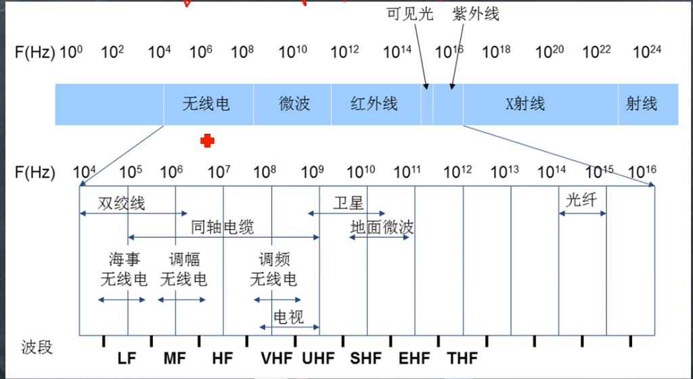
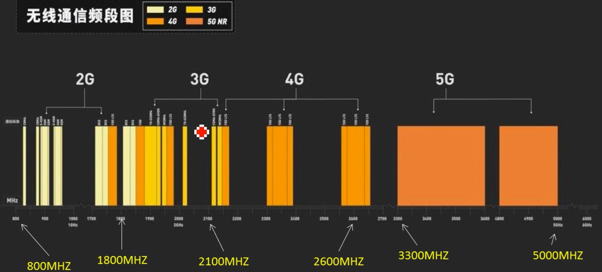
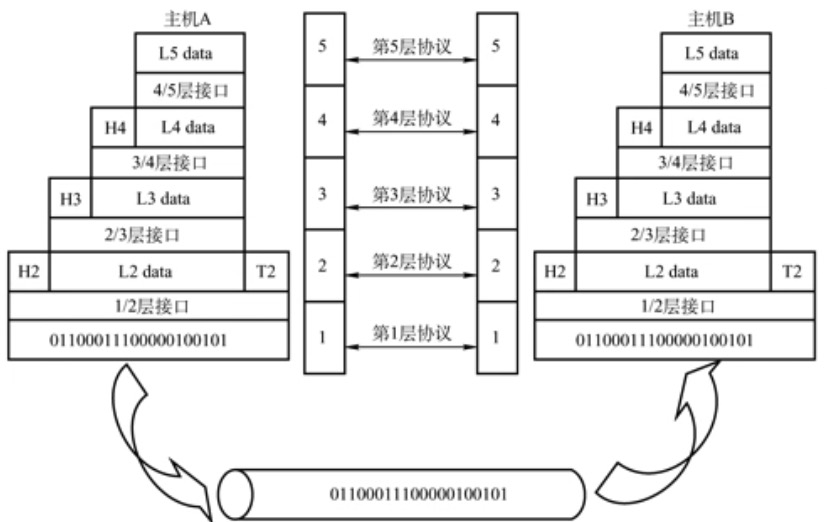
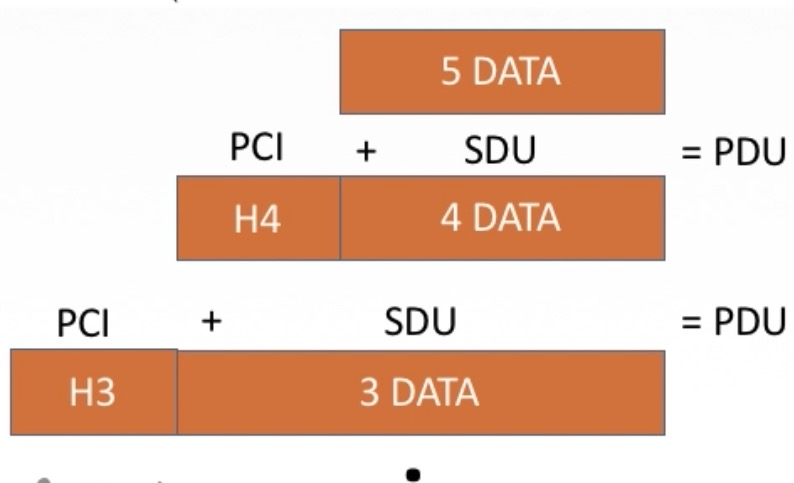
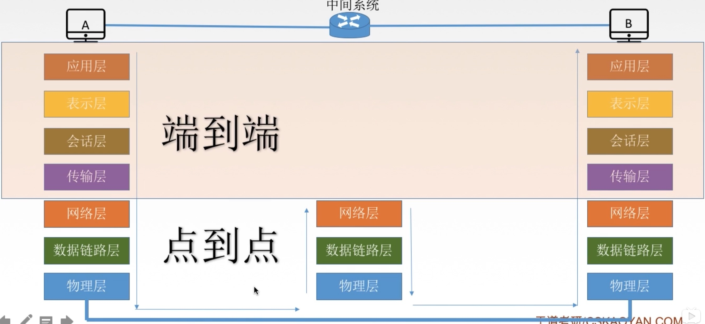
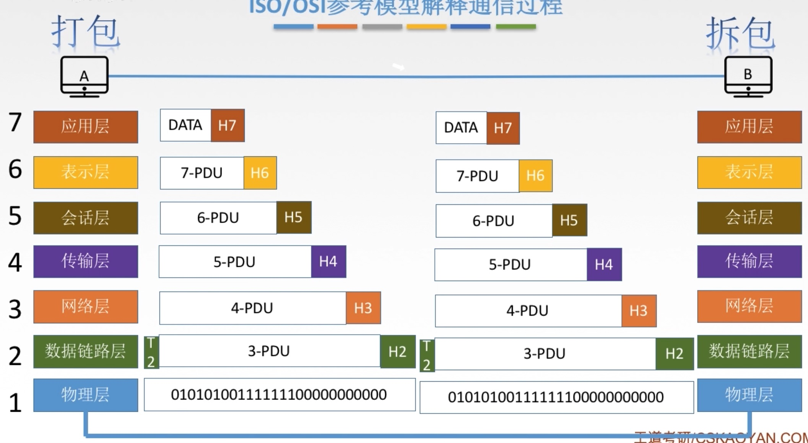
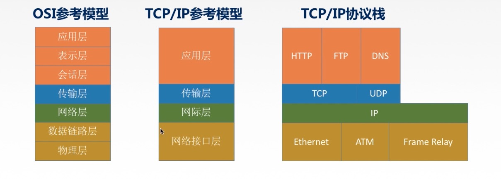
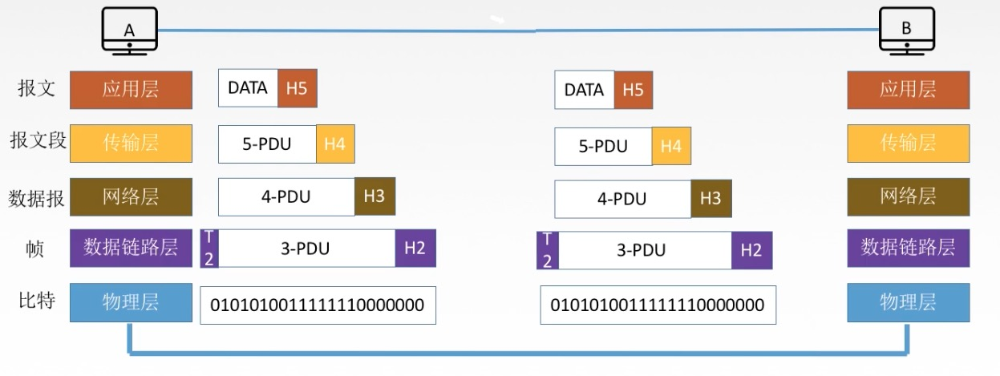

# 考研-计算机网络 第一章 概念、组成、功能和分类
## ARM 中的字、字节、半字
- bit 升级换算是10的3次方
- 字节升级换算是2的10次方

### ARM 采用的是32位架构. 约定:
- Byte ： 8 bits
- Halfword ：16 bits (2 byte)
- Word : 32 bits (4 byte)

- Arm 定义说明：
	- 字（Word）
		
		在ARM体系结构中，字的长度为32位，而在8位/16位处理器体系结构中，字的长度一般为16位。
	- 半字（Half-Word）
	
		在ARM体系结构中，半字的长度为16位，与8位/16位处理器体系结构中字的长度一致。
	- 字节（Byte）
	
		在ARM体系结构和8位/16位处理器体系结构中，字节的长度均为8位。
- 开发定义说明
	- 字节，byte，8bit，就是8个二进制位，一个ASCII字母占用的空间
	- 字，word，16bit，一个汉字占用的空间
	- 双字,dword,32bit

#### 注意
操作系统的位数和硬件 cpu 的位数可以不同，比如 inter cpu 位数是16或32位，而系统是64位，而arm 是16位，而系统也是 32/64位

### 电磁波
电磁波频率越低，绕射和穿透能力越强

## 性能指标
包含

- 带宽
- 速率
- 吞吐量
- 利用率
- 时延
- 时延带宽积
- 往返时间 RTT

### 带宽
带宽指的是发送数据的速率

- 1Mb/s=1us发送1bit数据
- 2Mb/s=1us发送2bit数据（带宽大，注入的数据量就多了，而不会影响比特在练路上传播的速度）

传播速率=`2*10的8次方 米/s` < `3*10的8次方/s` 光速（介质损耗） ～= 电磁波1us可向前传播 200m

### 吞吐量
单位时间通过某个网络的数据量，b/s kb/s Mb/s,收到网络带宽限制

- 带宽100Mb/s
- 服务器处理速度只有 10Mb/s

那么接收端的吞吐量就是 10Mb/s

### 时延
数据才能够网络的一段传输到另一段的时间，也叫延迟，单位 s,包含四类时延，总时延加起来

- 发送(传输)时延(主机内部工作)

	从发送分组第一个bit开始，到最后一个bit结束，所需要的时间。也就是把数据推到信道上为止
	
		公式:数据长度/信道带宽(真实场景比有衰减，比带宽小)=发送时延迟
		
		数据总长度为 10bit 
		带宽 10bit/s
		发送总时延为  10(bit)/10(bit/s)=1(s)
	带宽增加了会减小发送时延(速度链路发送速度的提高)
- 传播时延(网络传输介质的长度)

	从数据推送到链路到碰到转发路由为止称为传播时间延，取决于电磁波传输的速度(2.x*10的8次方)和链路的长度，信号会通过转换已电磁波的方式在物理网络上传播
	
		公式：信道长度/电磁波传播速率=传播时延
	
		距离是100米
		比如电磁波传输速度是10m/s
		
		100(m)/10(m/s)=10(s)
	注意光纤和同轴电缆传说速率是一样的			 
- 排队时延(路由器)

	等待路由器响应的延时
- 处理时延(路由器)

	检错和找出口
	
### 时延带宽积
时延带宽积(bit)=传播时延(s)*带宽(b/s)
 
时延带宽积又称为"比特为单位的链路长度",可以理解某段时间链路中有多少比特(容量)。

- 带宽 10mb/s
- 链路长度为100米,比如电磁波传输速度是10m/s，传输延时是10s

时延带宽积=100*10=1gb
### 往返 RTT
从发送方发送数据开始，到发送方收到接收方确认的总共时延

测试就是ping得到的数据就是 rtt

- RTT 包括：
	- 往返传输时延=传输时延*2 
	- 末端处理时间
RTT 不包含发送时延

### 利用率
分两种

- 信道利用率=有数据通过时间/有无数据通过时间
- 网络利用率=所有信道利用率加权平均值

利用率越高，时延越大

## 分层结构
- 网络体系结构是从功能上描述计算机网络结构
- 计算机网络结构简称网络体系结构，是分层结构
- 每层遵循某个/些网络协议以完成本层功能
- 计算机网络体系结构是计算机网络的各层以及其协议的集合
- 第n层向n+1层提供的功能时，不光包含第n层本身功能，还包含下层所有层功能
- 仅仅在相邻层间有接口，并且提供服务的具体实现细节对上层完全屏蔽。
- 体系结构是抽象的，而实现是只能运行的一些软件和硬件

### 发送数据前的准备工作
- 发起通讯的主机必须讲数据通信的通路进行激活
- 告诉网络如何识别目的主机
- 发起主机查明目标主机是否联入网络
- 发起主机查明目的主机文件管理程序是否可以做好接收工作(准备接收和是否有空间接收？)
- 确保差错和意外解决方案
- 等等

计算机程序设计的就是将大问题分成小问题解决，解决方法就是分层：

	实体----对等实体----	实体
	｜	-----协议------	｜
	接口					接口
	｜						｜
	服务(上层使用下级服务)	服务
	实体----对等实体----	实体
	｜						｜
	...						...
	｜--------传输-------｜

### 分层的基本原则
- 各层之间相互独立，每层只实现一种相对独立的功能
- 每层之间洁面自然清晰，易于理解，相互交流尽可能少
- 结构上可分割开。每层都采用最合适的技术来实现
- 保持下层对上层的独立性，上层单向使用下层提供的服务
- 这个分层结构应该能促进标准化工作

### 分层结构
	

- 实体

	第n层中的活动元素称为n层实体。同层的实体叫做对等实体。
- 协议

	为进行网络中的对等实体数据交换而建立的规则、标准或约定称为网络协议，协议是按层水平工作，不能跨层工作。协议包含3大要素
	
	- 语法：规定传输数据格式

		规定是什么编码格式、规定数据的分割段，比如01010101规定二进制是编码格式，规定从那个段进行分割和启始、结束来规定意义
	- 语意：规定所要完成的功能

		根据语法分割出来的段，规定意义，能实现什么功能
	- 同步：规定各种操作的顺序

		比如规定那个数据包先发那个数据包后发
- 接口(访问服务点 sap)

	上层使用下层服务的入口
- 服务

	下层为相邻上层提供的功能调用。	服务为单项，只有下层为上层提供，上层只使用。服务是垂直。
	
	每个一中间层，使用下层的服务，为上层提供服务。

### 数据包含关系

- SDU 服务数据单元

	为完成用户所要求的功能而应传输的数据。注意每层的 sdu 包含上层的全部数据
- pci 协议控制信息

	控制协议操作的信息
- pdu 协议数据单元

	对等层次之间传送的数据单位			
	
### 协议
？？
## 计算机网络分层结构
- 7层 osi 参考模型 (法定标准)
- 4层 tcp/ip 参考模型 (事实标准)

### osi 参考模型
为了解决网络大问题，将大问题划分成小问题而采用分层结构，按功能划分。又因为各厂商实现自己的网络结构而相互不兼容没有标准导致相互无法通信，所以提出了支持异构网络系统的互联互通，iso 在1984年提出了开放(全球通用)系统互连(osi)参考模型。结果理论成功，而市场失败。失败原因

- 缺乏实际经验，构想很好
- 实现复杂，运行效率很低
- 标准制定周期太长，模型无法及时占领市场
- 层次划分不合理，多个功能多个层出现

osi 七层模型结构，每层完成特定功能，1-3 层通信子网处理数据通信，5-7 层资源子网数据处理	

- 7 应用层 用		
- 6 表示层 示 		 
- 5 会话层 会	
- 4 传输层 输
- 3 网络层 网		
- 2 数据链路层  链
- 1 物理层  物

### osi 通讯过程

- 通信端主机均使用用全7层，而中间的网络设备只需要实现部分功能，比如路由器实现1-3层，而交换机只需要实现1-2层。
- 每个对等层都会有一个协议来规定相互实现的功能是一样的
- 7-4 层实现的是端到端通讯，因为中间系统不介入
- 1-3 层实现是点到点通讯，只负责管理下一步我走到哪里，不会去管终点在哪里

#### 每层都对数据做了什么操作
7-2层每层都给原有数据包贴了一个控制信息(头部)，控制信息可能包括

- 检验差错
- 找下一步地址
- 规定数据包优先级
	
而数据链路层不光加了头部，还加了尾部。记忆方法是数据链库层比其他层描述多了2个字，方便记忆。

物理层只会将数据进行2进制并还原成电磁波方式进行物理传到对应物理连接的物理设备上。

#### 应用层
用户与网络的界面，所有能和用户交互并产生网络流量的程序，不需要联网的程序就不算网络应用层程序

典型协议

- ftp
- smtp
- http
- 等

#### 表示层
用于处理两个通信系统中交换信息的表示方式(语法和语义)，表示层没有单独协议，但可以把 jpeg、ascii 当成

- 功能1

	数据格式变换
- 功能2

	数据加秘解密
- 数据压缩和恢复

#### 会话层
向表示层的实体/用户进程提供建立连接并在连接上有序的传输数据，数据传输的过程就称会话，也是建立同步(syn)

- 功能1

	建立、管理、终止会话
- 功能2

	使用校验点可使会话在通讯失效时从校验点/同步点继续恢复通讯，实现数据同步
	
	适用于传输大文件
	
典型协议

- adsp
- asp

#### 传输层
负责主机中两个进程(固定端口通信)的通信，即端到端的通信。传输单位时报文段或用户数据报 	

- 功能1	可

	可靠传输、不可靠传输
- 功能2	差

	差错控制，检测是否出错，并修复
- 功能3	流

	流量控制，检测是否流量处理不了而需要降速
- 功能4 用

	复用分用,方法通过端口号
	
	- 复用

		多个应用层进程可同时使用运输层的服务
	- 分用

		运输层把收到的信息分别交付给上面的应用层中相应的进程
		
典型协议

- tcp
- udp

#### 网络层
主要任务是把 分组从源端传输到目的端，为分组交换网络上的不同主机提供通信服务，网络传输单位是数据报。

- 功能1

	路由选择，选择最佳路径
- 功能2

	流量控制，协调发送端和接收端速度，限制发送端的速度
- 功能3

	差错控制，通信两节点之间约定的一些规则，接收方根据规则来检查收到的数据分组有没有错误，如果有错误是否可以纠错，不能纠错将抛弃，确保传输层提交的数据没问题
- 阻塞控制

	如果所有节点来不及接受分组，而丢弃大量分组，网络就处于拥塞状态，因此要采取一定措施缓解拥塞。
	
典型协议

- ip
- ipx
- icmp
- arp
- igmp
- ospf
- rarp

#### 数据链路层
主要任务是把网络层传下来的数据报组装成帧。数据链路层/连路层的传输单位是帧。

- 功能1
	
	成帧(定义开始和结束的01组合)
- 功能2

	差错控制，错误包括(帧错+位错)，可以检查出错误和纠错
- 功能3

	流量控制
- 功能4

	访问(接入)控制，控制对信道的访问
	
典型协议

- sdlc
- hdlc
- ppp
- stp

#### 物理层
主要任务是在物理媒体上实现比特流的透明传输，物理层传输单位是比特。

- 物理媒体
	- 同轴
	- 光线
	- 双脚
	- 无线点波
- 透明传输

	指不管所传输数据是什么样的比特组合，都应当能够在练路上传送，它仅将比特流转换成电信号并发送出去	
- 功能
	- 定义接口特性

		比如网线排序如何接
	- 定义传输模式
		
		单工、半双工、全双工
	- 定义传输速率

		100m/10m
	- 比特同步

		发送1接收也收到1
	- 比特编码

		什么样的电压表示1什么样的电压表示0

典型协议

- RJ45
- 802.3					
		
## TCP/IP 模型
### TCP/IP 协议栈

- 应用程

	对应 osi 应用、表示、会话3层
	
	- http
	- ftp
	- dns 
- 传输层

	对应 osi 传输层
	
	- tcp
	- udp
- 网际层	

	对应 osi 网络层
	
	- ip
- 网络接口层

	对应 osi 链路和物理层
	
	- ethernet
	- atm
	- frame relay

### tcp/ip和 osi 对比
#### 相同点
- 都是分层结构
- 基于独立的协议栈概念
- 可以实现异构网络互联(实现不同厂家设备通讯) 		

#### 不同点
- osi 定义三点：服务、协议、接口
- osi 先出现，参考模型先于协议发明，不偏向特定协议(tcp/ip 先发明协议，后定架构)
- TCP/IP 设计之初就考虑了异构互联问题，将ip作为重要层次,在网络层是无连接
- osi 与 tcp/ip 通讯方式不同

|osi|tcp/ip
---|---|---
网络层|无连接+面向连接|无连接
传输层|面向连接|无连接+面向连接

- 面向连接(tcp)

	分3个阶段
	
	- 建立连接

		在此阶段，发出一个建立连接的请求
	- 发送数据

		只有在连接成功建立后，才开始传输数据。
	- 释放连接

		当数据传输完成，释放连接
- 无连接(udp)

	直接传输数据
	
### 5层参考模型
综合了 osi 和 tcp/ip 的优点

- 应用层

	支持各种网络应用 ftp/smtp/http
- 传输层

	传输层 tcp/udp
- 网络层

	源主机到目标主机数据分组路由与转发  ip、icmp 、ospf 等
- 数据链路层

	把网络层传下来的数据报组装成帧 ethernet\ppp
- 物理层

	比特传输
	
### 5层参考模型的数据封装与解封

	
	
链接:https://pan.baidu.com/s/14xjdYvFRWdUvE9ZwyH-oZw  密码:mk0t							
			
##  参考
- [计算机网络](https://www.bilibili.com/video/BV19E411D78Q?p=1)