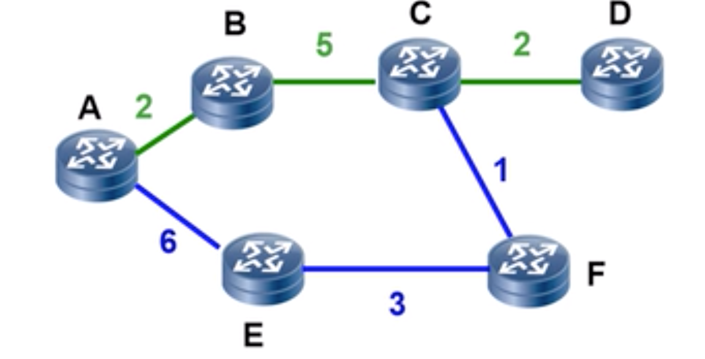
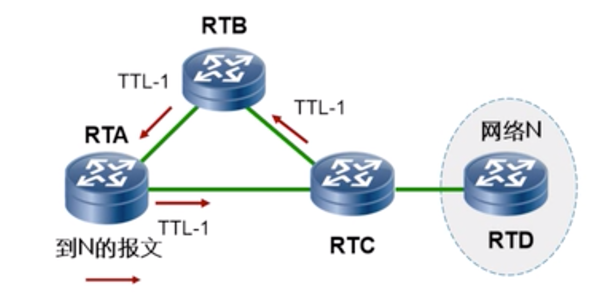

# 路由协议学习
## 路由器
- 支持各种路由协议
- 通过路由协议填充路由表
- 根据路由表进行数据转发

## 路由器关键功能
- 检查IP数据包目的地
	- 如果路由表没有查到地址，那么就会被返回数据包不可达的消息。 
- 确定信息源
- 发现可能的路由(动态路由、路由协议)
	- 尝试查找路由后，把路由放到路由表中 
- 选择最佳路由
- 转发数据包
- 验证和维护路由表信息

## 路由表
### 路由表字段
- 目标地址加子网
- 原(proto)
- 优先级(pre)
	- 越小越优
	- 每种路由协议都会有约定好的路由协议的值 
- 开销(cost)
	- 越小越优
- 标示(Flags)
	- 标示位
	- D (标示下载到本地了) 
- 下一跳(nexthop)
- 出口(interfece)

### 建立路由表
1. 链路层发现

	物理层链接后，接口默认发现的物理设备(直连)，要求物理状态和协议状态都是up
	
	- 原(proto)
		- 直连
	- 优先级(pre)
		- 0 最高 
	- 下一跳接口(interfece)
		- serial 0/0/0  
2. 静态路由

	管理员手工配置路由，当 top 发生改变时，需要手动更新路由表。
	
	- 原(proto)
		- 静态
	- 优先级(pre)
		- 60 
	- 下一跳接口(interfece)
		- ethernet0

	注意：
	
	- 这里数据是双向的，所以配置需要两边一起配置
	- 路由的行是逐跳，因此需要保证每跳路由都有路由信息(关键)
3. 动态路由协议

	路由使用路由协议从其他路由器获取路由，自动学习非直链。当网络top 发生改变时，路由信息会自动更新。有效和最优的，优先级和开销值来判断选择哪一条路由放入路由表
	
	- eigrp(思科私有) 
	- isis
	- bgp
	- rip
	- ospf

## 默认路由(缺省路由)
设置一条缺省路由 0.0.0.0 0 指向下跳路由
## 路由协议
路由相互通信的双方必须使用一种语言才能交互路由信息。路由协议就是路由之间交互信息的一种语言，这里注意必须是同一种路由协议才能相互交互。路由器之间通过路由协议共享网络状态和网络可达性的一些信息。

 路由协议定义了一套路由之间通信时使用的规则，路由协议维护路由表、提供最佳转发路径。
### 路由协议的分类
- 根据作用范围分类
	- IGP:内部网关路由协议，所有设备都在一个 AS 内(自治区)
		- RIP
		- OSPF
		- ISIS
		- eigrp(思科私有) 
	- EGP:外部网关路由协议，解决两个不同的 AS 之间的信息传递，建立在 AS 之上
		- BGP
- 根据协议算法分类
	- 距离矢量路由选择协议(distance-vector)
		- RIP
		- BGP

			路径矢量协议(path-vector)
	- 链路状态路由选择协议(link-state)
		- OSPF 和 ISIS 最短路径优先路由选择协议 
- 根业务应用区分
	- 单播路由协议-1对1
		- RIP
		- OSPF
		- BGP
		- ISIS  
	- 组播路由协议-1对多
		- DVMRP
		- PIM-SM
		- PIM-DM

### 路由优先级
当存在多个路由来源时，具有较高优先级，值越小，优先级越高。路由来源提供的路由将被激活，用于指导报问的转发。

路由协议|优先级
---|---
direct|0
ospf|10
is-is|15
static|60
rip|100
ospf ase|150

### 路由度量(cost)
由 A 路由到 D 路由有两条路由

   

- path1

	a-b-c-d 路由度量是 9
- path2

	a-e-f-c-d 路由数度量是 12

路由器优选较小值的路由加入路由表

### 等价路由 ECMP
A 到 D cost 都是18如下

- a-b-c-d cost 18
- a-c-d 	cost 18

使用同一个路由协议，同一个目的地有几条相同的度量值的路由，都会被放到路由表中，ip包会在几个链路负载均衡。

- 流的负载分担

	按照数据流不同，qq 微信分开走 
- 包的复杂分担

	数据包按照轮训负载

### 最长匹配原则
查找路由表使用，如果目标一样，路由到2相同的网断，但是掩码不一样，那么就是匹配掩码最长的。因为掩码越长，描述网络越精确。这块不看优先级和cost。
### 路由环路
路由环路:报文在两个或多个路由之间循环，直到 ttl 为零丢弃。

A 找 D，但是 A-C-B-A 循环

		 	   