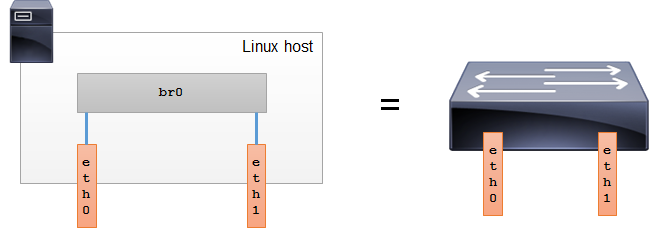
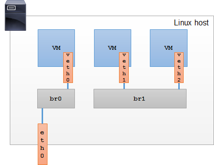
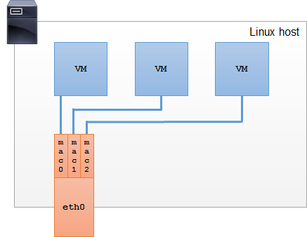
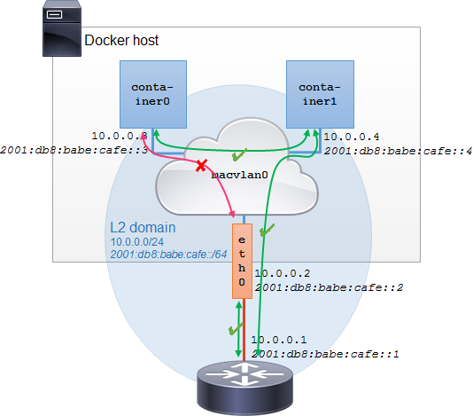

## MacVlan
### 网桥
网桥是将两个二层段(网卡)连接在一起的二层设备，基于二层地址(MAC 地址)转发两个段之间的帧。网桥是一个有效的的交换机，(交换等同于网桥)。网桥根据 MAC 地址做出转发决定。网桥根据查看主机通讯中的帧头来学习 MAC 地址。网桥可以是物理设备，也可以是软件实现。linux 可以通过创建网桥将多个物理或虚拟接口在二层联通，这样做可以有效的将带有两个物理网卡的linux主机变成交换机。

物理交换机的出现使网桥模式变得无用，但是虚拟化中，物理主机上运行的虚拟机需要和其他虚拟机进行2层连接。使用桥接模式可以将虚拟以太网接口和物理以太网设备进行连接，它们将是同层2层设备。

可以使用 `brctl` 查看主机网桥设置，如果主机没有安装可以使用 `yum install bridge-utils -y` 。

    # brctl show
    bridge name  bridge id          STP enabled  interfaces
    br0          8000.080006ad34d1  no           eth0
                                                 veth0
    br1          8000.080021d2a187  no           veth1
                                                 veth2
桥接可以创建二层循环，通过打开 `STP` 选项。
### Macvlan
Macvlan 允许在单个物理接口配置多个二层地址(mac 地址)。Macvlan 允许父接口(上层设备)上的子接口(从设备)，每个接口都有唯一的 Mac地址和IP 地址。运行应用程序的虚拟机或者容器可以通过绑定特定的子接口，直接使用绑定子接口的 mac 地址和 ip 连接到物理网络。

Macvlan 的子接口不能与父接口直接通讯，也就是说宿主机和宿主机上面的服务无法直接通讯。如果需要通讯则需要建立另外一个 macvlan 的子接口。

Macvlan 子接口使用 `mac0@eth0` 表达式，可以清楚的标识子接口和父接口的关系，如果父接口关闭，绑定上面的子接口也会关闭。

#### Macvlan 的模式
Macvlan 有四种模式

- 私有模式

    所有父接口的子接口不能相互通讯，子接口的所有帧都通过父接口转发，即使物理交换机转发了帧的来源是从一个子接口到另外一个子接口，这帧也会被丢弃。
    
        
- VEPA

    子接口的所有帧都通过父接口转发.VEPA 模式需要一个 IEEE 802.1Qbg aka 虚拟以太网端口聚合到物理交换机。支持 VEPA 的交换机将源和目标的所有帧都将返回到 macvlan 接口。因此同一父接口上的mavvlan子接口能够通过物理交换相互通讯。通过父接口进入的广播帧在 VEPA 模式下将散播到所有的 macvlan 接口上。当物理交换实施策略希望所有的子接口流量穿过物理交换机时，VEPA 模式很有用。
    
    
- 网桥模式

    Macvlan 使用简单的桥接器连接父接口上的所有子接口。从一个接口到另一个接口的帧将被直接传递而不会被发送出去。广播帧将被发布到所有的其它的网桥接口和物理接口，但当他们从 VEPA 的交换机回来时将被丢弃。由于所有的 macvlan 的子接口 Mac 地址已知，所以 macvlan 的网桥模式不需要学习 Mac 地址。而不需要 STP。桥接模式提供了一种快速的通讯，但缺陷是无法和父接口直接通讯。当物理接口断开时，子接口也将被断开。
    
     
- Passthru 模式

    允许单个虚拟机接口直连物理接口。这种模式的优点是虚拟机可以改变 mac 地址和其它接口参数。
    
     

#### 何时使用 Macvlan
- 使用 macvlan

    当只需要提供提供物理网络到虚拟机和容器出口连接时。因为提供更好的吞吐能力和更少的cpu消耗。[PPT](http://events.linuxfoundation.org/sites/events/files/slides/LinuxConJapan2014_makita_0.pdf)
- 使用网桥

    当需要在同一台主机上连接虚拟机和容器时，对于具有多网桥和混合模式环境(同一个二层中主机位于同一个主机和外部主机时)的复杂拓扑，并且需要高级放洪设置，如 FDB.

## Docker-MacVlan
### 简介
从 docker 版本 1.12 开始开放了2个新功能给用户使用, [`macvlan`](http://hicu.be/docker-networking-macvlan-bridge-mode-configuration) & [`ipvlan`](http://hicu.be/macvlan-vs-ipvlan)。1.12 之前，docker 的 `bridge` 是 [NAT模式](https://docs.docker.com/engine/userguide/networking/dockernetworks/#a-bridge-network)，而这两种功能才是真正的桥接功能。 它可以使容器获得连接物理二层网络的能力。

### 快速入门
- 准备工作
    - macvlan 模块检查
    
            # lsmod | grep macvlan
            macvlan                19233  0     
    - 网卡混淆模式
    
        因为需要设置在一台物理主机或者虚拟主机模拟多个 mac 地址，所以需要将网卡设置为混淆模式，步骤如下
        
        - 检查网卡混淆模式
        
            使用 `ifconfig -a` 检查现有系统使用网卡模式，默认是没有开放混淆模式
                
                # ifconfig -a
                ...
                eno16777984: flags=4163<UP,BROADCAST,RUNNING,MULTICAST>  mtu 1500
                inet 192.168.1.163  netmask 255.255.255.0  broadcast 192.168.1.255
                ...
        - 网卡设置混淆

                ip link set eno16777984 promisc on       
        - 虚拟 vlan 设置混淆
                
                ip link set eth0.100 promisc on
        - 检查混淆模式开放状态
        
            混淆模式开放后，同样使用 `ifconfig -a` 查看是否已经增加了 `PROMISC`，具体结果如下
            
                ...
                eno16777984: flags=4419<UP,BROADCAST,RUNNING,PROMISC,MULTICAST>  mtu 1500
                inet 192.168.1.163  netmask 255.255.255.0  broadcast 192.168.1.255
                ...        
        - 注意
            
            `注意测试结果虚拟机不需要开放混淆模式也可以通讯，说明混淆模式主要对物理网卡有效`
    - 虚拟机设置
        - vmware
            - vswith
        
                需要打开`混杂模式`和`伪传输`，打开方法:登陆`vcenter`->`主机和集群`-> 选择要打开的主机 ->选择`管理`->选择`网络`->选择`虚拟交换机`-> 选择网卡对应`vSwithX`-> 点击`编辑`-> 点击 `安全`-> 开放`混杂模式`和`伪传输`
            - dswith
            
                暂时未知                                
- 第一步 创建 `macvlan` 网络
        
        docker network create -d macvlan --subnet=192.168.1.0/24 --gateway=192.168.1.1 --ip-range=192.168.1.31/27 -o parent=eno16777984 -o macvlan_mode=bridge macvlan_01
    - `-d`
        
        设置驱动，这里指定macvlan
    - `--subnet`
    
        子网设置
    - `--gateway`
    
        网关设置
    - `--ip-range`
    
        网络范围，设置一个与现在不冲突的网段设置，或者传递一个 `--ip <address>` 指定ip
    - `-o parent`
    
        指定绑定网卡接口
    - `-o macvlan_mode`
    
        设定运行模式，这里指定网桥模式                                     
- 第二步 启动服务

        docker run -it --net=macvlan_01 --ip=192.168.1.31 centos7-docker-macvlan /bin/bash

### docker macvlan 配置
macvlan 虽然有多个模式，但是 docker 驱动只支持网桥模式,例子中都使用 ipv6+v4 堆叠展示，如果只有 ipv4，可以忽略。 

- 权限确认

    首先确认是否有管理员权限。
    
        sudo su -
- 查看容器网络

        # docker network ls
        NETWORK ID          NAME                DRIVER
        7fca4eb8c647        bridge              bridge
        9f904ee27bf5        none                null
        cf03ee007fb4        host                host 
- 检查接口

    macvlan 网络将容器接口和父接口/物理接口连接，所以需要检查物理接口是否已经运行中。
    
        ifconfig -a 
        ...
        em1: flags=4163<UP,BROADCAST,RUNNING,MULTICAST>  mtu 1500
        ...
- 创建 macvlan 网络

    创建一个带 ipv6 的 macvlan 网络

        docker network create -d macvlan \
        --subnet=10.0.0.0/24 --gateway=10.0.0.1 \
        --subnet=2001:db8:babe:cafe::/64 --gateway=2001:db8:babe:cafe::1 \
        -o parent=eth0 \
        --ipv6 \
        macvlan0 
- ipam

    docker 通过 [ipam 驱动程序](https://github.com/docker/libnetwork/blob/master/docs/ipam.md)控制网络和端点接口的 ip 地址分配。libnetwork 默认内置 ipam 驱动程序，并允许第三方动态插入 ipam 程序。在创建网络时用户可以指定使用哪种 ipam 驱动管理 ip 地址。目前还没有 ipam 的程序支持外部 dhcp 服务通讯，因此需要依赖容器的 ipam 驱动用于 ip 地址管理。默认情况下，容器将使用宿主机的dns设置，因此不需要额外配置。如果需要 dhcp 支持，macvlan 暂时不支持，请使用 [pipework](https://github.com/jpetazzo/pipework)
    
    - 注意
    
        在 macvlan 的网络中不应该存在 dhcp 服务，因为 macvlan 网络并不知道 dhcp 的存在，所以可能会有ip地址冲突。
- 创建后检查

        # docker network ls    
        NETWORK ID          NAME                DRIVER
        7fca4eb8c647        bridge              bridge
        9f904ee27bf5        none                null
        cf03ee007fb4        host                host
        f08ca9e2eb1b        macvlan0            macvlan

        # docker network inspect macvlan0
        [
            {
        "Name": "macvlan0",
        "Id": "f08ca9e2eb1b66fdbe0f231235d8879465804e7b702fe3702f2fd22a06f5fdcb",
        "Scope": "local",
        "Driver": "macvlan",
        "EnableIPv6": true,
        "IPAM": {
            "Driver": "default",
            "Options": {},
            "Config": [
                {
                    "Subnet": "10.0.0.0/24",
                    "Gateway": "10.0.0.1"
                },
                {
                    "Subnet": "2001:db8:babe:cafe::/64",
                    "Gateway": "2001:db8:babe:cafe::1"
                }
            ]
        },
        "Internal": false,
        "Containers": {},
        "Options": {
            "parent": "eth0"
        },
        "Labels": {}
            }
        ]                
- 创建一个 macvlan 实例

        docker run \
          --name='container0' \        
          --hostname='container0' \
          --net=macvlan0 \
          --detach=true \
          phusion/baseimage:latest
 - 验证容器实例
 
         # docker ps
        CONTAINER ID  IMAGE                     COMMAND          CREATED        STATUS        NAMES
        4eddd1fca8e5  phusion/baseimage:latest  "/sbin/my_init"  1 minutes ago  Up 1 minutes  container0
   
        # docker network inspect macvlan0
        [
            {
        "Name": "macvlan0",
        "Id": "f08ca9e2eb1b66fdbe0f231235d8879465804e7b702fe3702f2fd22a06f5fdcb",
        "Scope": "local",
        "Driver": "macvlan",
        "EnableIPv6": true,
        "IPAM": {
            "Driver": "default",
            "Options": {},
            "Config": [
                {
                    "Subnet": "10.0.0.0/24",
                    "Gateway": "10.0.0.1"
                },
                {
                    "Subnet": "2001:db8:babe:cafe::/64",
                    "Gateway": "2001:db8:babe:cafe::1"
                }
            ]
        },
        "Internal": false,
        "Containers": {
            "4eddd1fca8e53c016fd742bb67a721126b401906c45b4239c827901fd91ce108": {
                "Name": "container0",
                "EndpointID": "932d4d412bcd1d26926709d5932ab1994d09e9b684e07482bf30c0e791c9ec74",
                "MacAddress": "02:42:0a:0a:28:02",
                "IPv4Address": "10.0.0.3/24",
                "IPv6Address": "2001:db8:babe:cafe::3/64"
            }
        },
        "Options": {
            "parent": "eth0"
        },
        "Labels": {}
            }
        ]  
- 从实例网络

        # docker exec -ti container0 ip a | grep 'mtu|inet'
         [...]
        26: eth0@if2:  mtu 1500 qdisc noqueue state UNKNOWN group default
         [...]
- 验证 ipv4 实例路由

        # docker exec -ti container0 ip route
        default via 10.0.0.1 dev eth0
        10.0.0.0/24 dev eth0  proto kernel  scope link  src 10.0.0.3
- 验证 ipv6 实例路由

        # docker exec -ti container0 ip -6 route
        2001:db8:babe:cafe::/64 dev eth0  proto kernel  metric 256
- 手动配置ip

        docker run \
          --name='container1' \
          --hostname='container1' \
          --net=macvlan0 \
          --detach=true \
          --ip=10.0.0.4 \
          --ip6=2001:db8:babe:cafe::4 \
          phusion/baseimage:latest
- 检查容器网络

        # docker network inspect macvlan0
        [
        {
        "Name": "macvlan0",
        "Id": "f08ca9e2eb1b66fdbe0f231235d8879465804e7b702fe3702f2fd22a06f5fdcb",
        "Scope": "local",
        "Driver": "macvlan",
        "EnableIPv6": true,
        "IPAM": {
            "Driver": "default",
            "Options": {},
            "Config": [
                {
                    "Subnet": "10.0.0.0/24",
                    "Gateway": "10.0.0.1"
                },
                {
                    "Subnet": "2001:db8:babe:cafe::/64",
                    "Gateway": "2001:db8:babe:cafe::1"
                }
            ]
        },
        "Internal": false,
        "Containers": {
            "1feb1a57f1b8225ac0409fe4a10d7468d6097f5f739ccf4e42fd569ccf246837": {
                "Name": "container1",
                "EndpointID": "e05c02ce744ca66d45d60d732e3fc3609d5fe0d67f1bb55b15269de7378ebb48",
                "MacAddress": "02:42:0a:0a:28:04",
                "IPv4Address": "10.0.0.4/24",
                "IPv6Address": "2001:db8:babe:cafe::3/64"
            },
            "4eddd1fca8e53c016fd742bb67a721126b401906c45b4239c827901fd91ce108": {
                "Name": "container0",
                "EndpointID": "932d4d412bcd1d26926709d5932ab1994d09e9b684e07482bf30c0e791c9ec74",
                "MacAddress": "02:42:0a:0a:28:02",
                "IPv4Address": "10.0.0.3/24",
                "IPv6Address": "2001:db8:babe:cafe::3/64"
            }
        },
        "Options": {
            "parent": "eth0"
        },
        "Labels": {}
        }
        ]
- 网关通讯验证

        # docker exec -ti container0 ping -c 4 10.0.0.1
        PING 10.0.0.1 (10.0.0.1) 56(84) bytes of data.
        64 bytes from 10.0.0.1: icmp_seq=1 ttl=64 time=0.502 ms
- 验证宿主机通讯

        # docker exec -ti container0 ping -c 4 10.0.0.2
        PING 10.0.0.2 (10.0.0.2) 56(84) bytes of data.
        From 10.10.40.3 icmp_seq=1 Destination Host Unreachable
    验证失败，因为不能和宿主机直接通讯，如果需要请使用 docker 其它网络类型或者配置到宿主机其它接口。
- 验证和其它主机通讯

        # docker exec -ti container1 ping -c 4 10.0.0.3
        PING 10.0.0.3 (10.0.0.3) 56(84) bytes of data.
        64 bytes from 10.0.0.3: icmp_seq=1 ttl=64 time=0.098 ms

- 最后检查网关上的 arp 表

    使用ping后检查网关的 arp 表，将会存在所有 mac 地址，包括宿主机和容器
    
        router# show ip arp 
        Protocol  Address   Age (min)  Hardware Addr   Type  Interface
        Internet  10.0.0.2         7   b8ae.dead.beef  ARPA  Gi0
        Internet  10.0.0.3         3   0242.0a0a.2802  ARPA  Gi0
        Internet  10.0.0.4         2   0242.0a0a.2804  ARPA  Gi0 
         
### 注意
- 每个容器只能绑定一个 macvlan 或 ipvlan
- macvlan 网络不能连接容器所在的宿主机
- 1.11 版本中的 macvlan 还是测试，不能使用生产
- macvlan 需要内核版本在 `Linux Kernel 3.9` 之上，可以通过 `uname -r` 查看
- 不支持外部 dhcp 作为 ipam 

## 在 marathon 上发布 macvlan 服务

    {
      "id": "/macvlan-macvlan-2048",
      "cmd": null,
      "cpus": 0.01,
      "mem": 16,
      "disk": 0,
      "instances": 4,
      "constraints": [
        [
          "vcluster",
          "LIKE",
          "macvlan"
        ],
        [
          "hostname",
          "LIKE",
          "192.168.1.135|192.168.1.163"
        ],
        [
          "type",
          "UNLIKE",
          "swarm"
        ]
      ],
      "ipAddress": {
          "discovery": {
              "ports": [
                  {
                    "number": 80,
                    "name": "http",
                    "protocol": "tcp"
                  }
              ]
          }
      },
      "container": {
        "type": "DOCKER",
        "volumes": [],
        "docker": {
          "image": "offlineregistry.dataman-inc.com:5000/library/blackicebird-2048:latest",
          "network": "BRIDGE",
          "privileged": false,
          "parameters": [
            {
              "key": "net",
              "value": "macvlan"
            },
            {
              "key": "label",
              "value": "APP_ID=macvlan-macvlan-2048"
            },
            {
              "key": "label",
              "value": "VCLUSTER=macvlan"
            }
          ],
          "forcePullImage": false
        }
      },
      "labels": {
        "GROUP_ID": "1",
        "USER_ID": "1",
        "VCLUSTER": "macvlan"
      },
      "portDefinitions": []
    }

## 参考
[Docker Container Network Types](http://hicu.be/docker-container-network-types)
[Experimental Docker Libnetwork DHCP Driver](https://gist.github.com/nerdalert/3d2b891d41e0fa8d688c)
[Docker 1.12 - Macvlan](https://raesene.github.io/blog/2016/07/23/Docker-MacVLAN/)
[Bridge vs Macvlan](http://hicu.be/bridge-vs-macvlan)