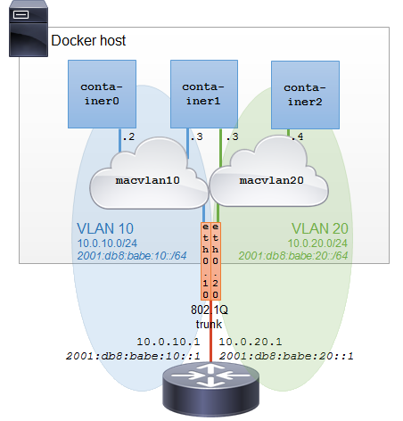
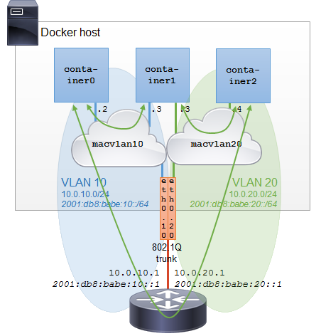

# Docker Macvlan 的 Vlans
在虚拟化解决方案中，mac地址\端口\二层网络都将有严格的限制。Docker 的 macvlan 解决方案和linux 实现完全一致，支持 802.1Q trunk 连接网络。可以将每个容器映射到一个 macvlan 的网络中。这将二层 vlan 域扩展到 macvlan 中。
## 多个 macvlan 与 vlan 的设置

### 例
中有一个 docker 宿主机的 eth0 网口连接到了路由器。路由器上配置 vlan10和vlan20 之间的连接。在路由器配置以下地址配置三层接口。

    10.0.10.1/24 和 2001:db8:babe:10::1/64 配置到 vlan10
    10.0.20.1/24 和 2001:db8:babe:20::1/64 配置到 vlan20
- 思科路由配置

        router(config)# interface fastEthernet 0/0
        router(config-if)# no shutdown

        router(config)# interface fastEthernet 0/0.10
        router(config-subif)# encapsulation dot1Q 10
        router(config-subif)# ip address 10.0.10.1 255.255.255.0
        router(config-subif)# ipv6 address 2001:db8:babe:10::1/64

        router(config)# interface fastEthernet 0/0.20
        router(config-subif)# encapsulation dot1Q 20
        router(config-subif)# ip address 10.0.20.1 255.255.255.0
        router(config-subif)# ipv6 address 2001:db8:babe:20::1/64
- 思科三层交换配置

        switch# configure terminal
        switch(config)# vlan 10
        switch(config)# vlan 20

        switch(config)# interface fastEthernet0/0
        switch(config-if)# switchport mode trunk
        switch(config-if)# switchport trunk native vlan 1

        switch(config)# interface vlan 10
        switch(config-if)# ip address 10.0.10.1 255.255.255.0
        switch(config-if)# ipv6 address 2001:db8:babe:10::1/64

        switch(config)# interface vlan 20
        switch(config-if)# ip address 10.0.20.1 255.255.255.0
        switch(config-if)# ipv6 address 2001:db8:babe:20::1/64
- 设置三个容器接口
    - container0 连接到 vlan10
    - container2 连接到 vlan20
    - container1 将有两个接口连接2个vlan
    - 注意
    
        1Q 子接口已经在 docker 主机上配置，docker 需要使用现在的 vlan 配置，只需要确保子接口配置到预定的vlan标记即可，如果不熟悉 ` Linux .1Q`，没关系，它现在由 docker macvlan 驱动来处理。
        
- 验证宿主机网卡接口

        # ifconfig -a 
- 创建两个 macvlan 网络

    macvlan10 使用 eth0.10 子接口做为网络父接口，macvlan20 使用 eth0.20 子接口做为网络父接口
    
    
        docker network create -d macvlan 
        --subnet=10.0.10.0/24 --gateway=10.0.10.1 
        --subnet=2001:db8:babe:10::/64 --gateway=2001:db8:babe:10::1 
        -o parent=eth0.10
        --ipv6 
        macvlan10

        docker network create -d macvlan 
        --subnet=10.0.20.0/24 --gateway=10.0.20.1 
        --subnet=2001:db8:babe:20::/64 --gateway=2001:db8:babe:20::1 
        -o parent=eth0.20
        --ipv6 
        macvlan20
- 宿主机检查网络情况

        # ip -d addr show | grep 'mtu\|vlan'
        [...]
        29: eth0.10@eth0:  mtu 1500 qdisc noqueue state UP group default
            vlan protocol 802.1Q id 10 
        33: eth0.20@eth0:  mtu 1500 qdisc noqueue state UP group default
            vlan protocol 802.1Q id 20 
        [...] 
- 容器验证网络情况

        # docker network ls
        NETWORK ID          NAME                DRIVER
        7fca4eb8c647        bridge              bridge
        9f904ee27bf5        none                null        
        cf03ee007fb4        host                host
        0a8dff61d189        macvlan10           macvlan
        06c603d82b7d        macvlan20           macvlan 
- 查看 macvlan10 详情

        # docker network inspect macvlan10
        [
        {
        "Name": "macvlan10",
        "Id": "0a8dff61d18965158f4ef7fd519b06494d551b592479dec00501336d91b64af4",
        "Scope": "local",
        "Driver": "macvlan",
        "EnableIPv6": true,
        "IPAM": {
            "Driver": "default",
            "Options": {},
            "Config": [
                {
                    "Subnet": "10.0.10.0/24",
                    "Gateway": "10.0.10.1"
                },
                {
                    "Subnet": "2001:db8:babe:10::/64",
                    "Gateway": "2001:db8:babe:10::1"
                }
            ]
        },
        "Internal": false,
        "Containers": {},
        "Options": {
            "parent": "eth0.10"
        },
        "Labels": {}
        }
        ] 
- 启动 container0/container2 两个实例

        docker run \
          --name='container0' \
          --hostname='container0' \
          --net=macvlan10 \
          --ip=10.0.10.2 \
          --ip6=2001:db8:babe:10::2 \
          --detach=true \
          phusion/baseimage:latest
          
        docker run \
          --name='container2' \
          --hostname='container2' \
          --net=macvlan20 \
          --ip=10.0.20.4 \
          --ip6=2001:db8:babe:20::4 \
          --detach=true \
          phusion/baseimage:latest 

    如果不配置地址，docker 将从内置的 ipam 获取到地址。
- 启动 container1 加入两个vlan
    在 docker 1.12 版本后，不能在 `--net` 中增加两个地址
    - 创建一个
       
            docker run \
              --name='container1' \
              --hostname='container1' \
              --net=macvlan10 \
              --ip=10.0.10.3 \
              --ip6=2001:db8:babe:10::3 \
              --detach=true \
              phusion/baseimage:latest 
    - 加入另一个
    
            docker network connect \
              --ip=10.0.20.3 \
              --ip6=2001:db8:babe:20::3 \
              macvlan20 \
              container1   
- 验证实例

        # docker ps
        CONTAINER ID  IMAGE                     COMMAND          STATUS              NAMES
        db1151ada129  phusion/baseimage:latest  "/sbin/my_init"  Up About a minute   container1
        d4ac80b7f3f7  phusion/baseimage:latest  "/sbin/my_init"  Up 3 minutes  container2
        8ead470a825b  phusion/baseimage:latest  "/sbin/my_init"  Up 3 minutes  container0
- 验证 container 1 实例网络
    
        # docker inspect container1
        [...]
            "Networks": {
                "macvlan10": {
                    "IPAMConfig": null,
                    "Links": null,
                    "Aliases": [
                        "db1151ada129"
                    ],
                    "NetworkID": "0a8dff61d18965158f4ef7fd519b06494d551b592479dec00501336d91b64af4",
                    "EndpointID": "d43ab3307f73d9377288b3b9bc6ebe208bb87bd1b30cfae7937b7be12e8ddc54",
                    "Gateway": "10.0.10.1",
                    "IPAddress": "10.0.10.3",
                    "IPPrefixLen": 24,
                    "IPv6Gateway": "2001:db8:babe:10::1",
                    "GlobalIPv6Address": "2001:db8:babe:10::3",
                    "GlobalIPv6PrefixLen": 64,
                    "MacAddress": "02:42:0a:0a:3c:04"
                },
                "macvlan20": {
                    "IPAMConfig": {},
                    "Links": null,
                    "Aliases": [
                        "db1151ada129"
                    ],
                    "NetworkID": "06c603d82b7d821b3aaa240e2c00d309ee3fb420d644591a483b067270fbb7ef",
                    "EndpointID": "c341ceec2fa5c2087f784811c8e75b186d847cb2b9ce4616c70b78e22024e46f",
                    "Gateway": "10.0.20.1",
                    "IPAddress": "10.0.20.3",
                    "IPPrefixLen": 24,
                    "IPv6Gateway": "2001:db8:babe:20::1",
                    "GlobalIPv6Address": "2001:db8:babe:20::3",
                    "GlobalIPv6PrefixLen": 64,
                    "MacAddress": "02:42:0a:0a:46:03"
                }
            }
        [...]
- 验证 container 1 接口

        # docker exec -ti container1 ip addr | grep 'mtu\|inet'
        [...]
        40: eth0@if29:  mtu 1500 qdisc noqueue state UNKNOWN group default
            inet 10.0.10.3/24 scope global eth0
            inet6 2001:db8:babe:10::3/64 scope global nodad
            inet6 fe80::42:aff:fe0a:3c04/64 scope link
        41: eth1@if33:  mtu 1500 qdisc noqueue state UNKNOWN group default
            inet 10.0.20.3/24 scope global eth1
            inet6 2001:db8:babe:20::3/64 scope global nodad
            inet6 fe80::42:aff:fe0a:4603/64 scope link 
       
        # docker exec -ti container1 ip addr | grep mtu
        [...]
        29: eth0.10@eth0:  mtu 1500 qdisc noqueue state UP group default
        33: eth0.20@eth0:  mtu 1500 qdisc noqueue state UP group default
- 检查路由

        # docker exec -ti container1 ip route
        default via 10.0.10.1 dev eth0
        10.0.10.0/24 dev eth0  proto kernel  scope link  src 10.0.10.3
        10.0.20.0/24 dev eth1  proto kernel  scope link  src 10.0.20.3

        # docker exec -ti container1 ip -6 route
        2001:db8:babe:10::/64 dev eth0  proto kernel  metric 256
        2001:db8:babe:20::/64 dev eth1  proto kernel  metric 256
        fe80::/64 dev eth0  proto kernel  metric 256
        fe80::/64 dev eth1  proto kernel  metric 256
        default via 2001:db8:babe:10::1 dev eth0  metric 1024
- 检查连通性

        # docker exec -ti container1 ping -c 4 10.0.10.2
        PING 10.0.10.2 (10.0.10.2) 56(84) bytes of data.
        64 bytes from 10.0.10.2: icmp_seq=1 ttl=64 time=0.060 ms

        # docker exec -ti container1 ping -c 4 10.0.20.4
        PING 10.0.20.4 (10.0.20.4) 56(84) bytes of data.
        64 bytes from 10.0.20.4: icmp_seq=1 ttl=64 time=0.061 ms

        # docker exec -ti container1 ping -c 4 10.0.10.1
        PING 10.0.10.1 (10.0.10.1) 56(84) bytes of data.
        64 bytes from 10.0.10.1: icmp_seq=1 ttl=64 time=0.503 ms
        
        # docker exec -ti container1 ping -c 4 10.0.20.1
        PING 10.0.20.1 (10.0.20.1) 56(84) bytes of data.
        64 bytes from 10.0.20.1: icmp_seq=1 ttl=64 time=0.486 ms 
- 使用 traceroute 检查路由

  container0和container1 之间有 macvlan10 一跳连接
  
        # docker exec -ti container0 traceroute 10.0.10.3
        traceroute to 10.0.10.3 (10.0.10.3), 30 hops max, 60 byte packets
         1  container1.macvlan10 (10.0.10.3)  0.045 ms  0.012 ms  0.008 ms

  containet0 到其它两个在 vlan20 的接口均需要增加一跳路由
  
        # docker exec -ti container0 traceroute 10.0.20.3
        traceroute to 10.0.20.3 (10.0.20.3), 30 hops max, 60 byte packets
         1  10.0.10.1 (10.0.10.1)  0.229 ms  0.279 ms  0.310 ms
         2  10.0.20.3 (10.0.20.3)  0.725 ms  0.754 ms  0.743 ms

        # docker exec -ti container0 traceroute 10.0.20.4
        traceroute to 10.0.20.4 (10.0.20.4), 30 hops max, 60 byte packets
         1  10.0.10.1 (10.0.10.1)  0.265 ms  0.261 ms  0.323 ms
         2  10.0.20.4 (10.0.20.4)  0.725 ms  0.756 ms  0.745 ms 

      

- 在三层交换上做 arp 检查   

        l3switch# show ip arp 
        Protocol  Address   Age (min)  Hardware Addr   Type  Interface
        Internet  10.0.10.2        9   0242.0a0a.2602  ARPA  Vlan10
        Internet  10.0.10.3        4   0242.0a0a.3c04  ARPA  Vlan10
        Internet  10.0.20.3        3   0242.0a0a.4603  ARPA  Vlan20
        Internet  10.0.20.4        1   0242.0a0a.5c04  ARPA  Vlan20

## 参考
[Docker Networking: macvlans with VLANs](http://hicu.be/docker-networking-macvlan-vlan-configuration)
     
    