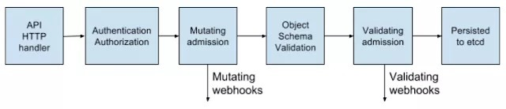
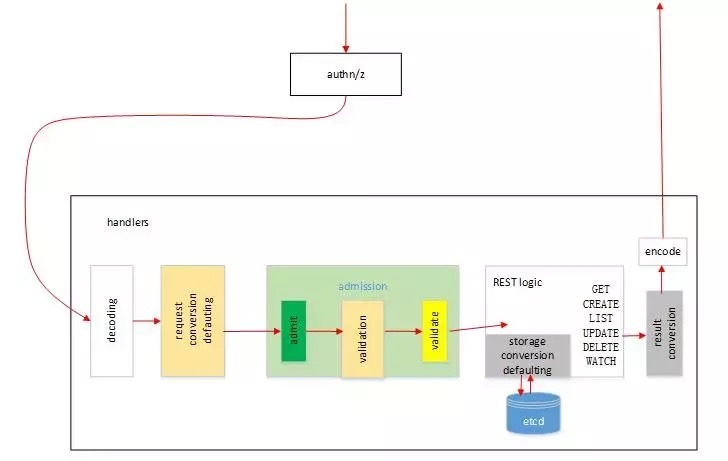
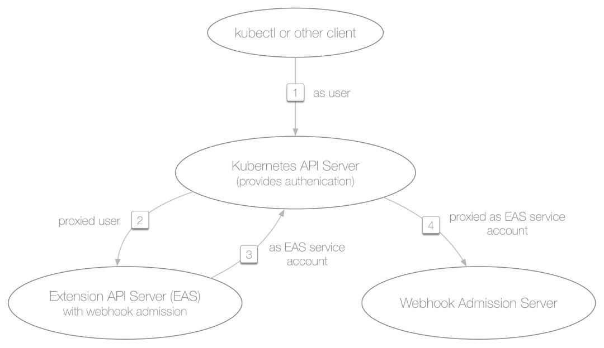

# Kubernetes 准入控制介绍
通过 Adminssion Webhook 扩展准入控制
## 什么是准入控制
准入控制（Admission Controller）是 Kubernetes API Server 用于拦截请求的一种手段。Admission 可以做到对请求的资源对象进行校验，修改。`service mesh` 最近很火的项目 `Istio` 天生支持 Kubernetes，利用的就是 Admission 对服务实例自动注入 sidecar。

假如对 Kubernetes 有一定的了解的话，应该会知道在 Kubernetes 中还有 `authn/authz`，为什么还会引入 admission 这种机制？

- `authn/authz` 是 Kubernetes 的认证和鉴权，运行在 `filter` 中，只能获取 http 请求 header 以及证书，并不能获取请求的 body。所以 `authn/authz` 只能对客户端进行认证和鉴权，不可以对请求的对象进行任何操作，因为这里根本还获取不到对象。
- Admission 运行在 API Server 的增删改查 `handler` 中，可以自然地操作 API resource。它是在经过授权之后，资源持久化之前的一个处理 API server 请求的步骤。准入过程能获取到和认证过程一致的信息（用户、URL 等），以及绝大多数 API 请求的完整报文。

准入阶段由不同的插件组成，每个插件都能 “各司其职”，并明确知道自己要检查的对象结构。例如：

-  `PodNodeSelector`（影响调度决策）
-  `PodSecurityPolicy`（防止升级的容器）
-  `ResourceQuota`（为每个 Namespace 限制资源配额）。

准入分为两阶段

- 修改 (Mutation) 阶段 : 在对象持久化之前修改对象的主体内容以及拒绝 API 请求。
- 验证 (Validation) 阶段 ：在对象持久化之前进行校验以及拒绝 API 请求。

一个准入插件可以在这两个阶段应用，但是所有的修改阶段都发生在验证阶段之前。

### 修改 (Mutation) 阶段
Admission 的 Mutation 阶段允许在资源内容生成前进行修改。因为同一个字段在 Admission 链上可以被多次修改，因此 Admission 插件的执行顺序很重要。

准入修改插件（Mutating Admission Plugin）中的一个例子就是 `PodNodeSelector`，它使用 Namespace 的一个 `annotation：namespace.annotations[“scheduler.alpha.kubernetes.io/node-selector”] `来查找标签选择器并将其添加到 `pod.spec.nodeselector` 字段。这一功能正向限制了特定 Namespace 中的 pod 能够落在哪个节点上，这与提供反向限制的 `taints` 正相反（也是通过 Admission 插件来实现的）。
### 验证 （Validating）阶段
可以在 Admisson 的验证阶段来检查特定 API 资源以保证其不变。验证阶段在所有的 mutators 完成之后运行，以确保资源在做完验证之后不会被再次改变。

准入验证插件（Validation Admission Plugin）的一个例子也是 `PodNodeSelector` 插件，它可以确保所有 pod 的 `spec.nodeSelector` 字段都能符合 Namespace 上节点选择器的约束。即使在 Mutating 链中运行 `PodNodeSelector` 之后，有其他修改插件试图更改 `spec.nodeSelector` 字段，验证链中的 `PodNodeSelector` 插件也会因验证失败而阻止 API 资源的创建。

准入控制流程图

API Server 接收到客户端请求后首先进行认证鉴权，认证鉴权通过后才会进行后续的 `endpoint handler` 处理。

- 当 API Server 接收到对象后首先根据 http 的路径可以知道对象的版本号，然后将 `request body` 反序列化成 `versioned object`。
- `versioned object` 转化为 `internal object`，即没有版本的内部类型，这种资源类型是所有 versioned 类型的超集。只有转化为 internal 后才能适配所有的客户端 `versioned object` 的校验。
- Admission Controller 具体的 admit 操作，可以通过这里修改资源对象，例如为 Pod 挂载一个默认的 Service Account 等。
- `API Server internal object validation`，校验某个资源对象数据和格式是否合法，例如：Service Name 的字符个数不能超过 63 等。
- `Admission Controller validate`，可以自定义任何的对象校验规则。
- internal object 转化为 versioned object，并且持久化存储到 etcd。

## 如何使用准入控制
Kubernetes 1.10 之前的版本可以使用 `--admission-control` 打开准入控制。同时 `--admission-control` 的顺序决定 Admission 运行的先后。其实这种方式对于用户来讲其实是挺复杂的，因为这要求用户对所有的准入控制器需要完全了解。

如果使用 Kubernetes 1.10 之后的版本，`--admission-control` 已经废弃，建议使用 `--enable-admission-plugins` 和 `--disable-admission-plugins` 指定需要打开或者关闭的准入控制器。 同时用户指定的顺序并不影响实际准入控制器的执行顺序，对用户来讲非常友好。

值得一提的是，有些准入控制器可能会使用 Alpha 版本的 API，这时必须首先使能其使用的 API 版本。否则准入控制器不能工作，可能会影响系统功能。
## Admission Webhook
目前 Kubernetes 中已经有非常多的 Admission 插件， 但是并不能保证满足所有开发者的需求。 众所周知，Kbernetes 之所以受到推崇，它的可扩展能力功不可没。Admission 也提供了一种 webhook 的扩展机制。

- MutatingAdmissionWebhook ：在对象持久化之前进行修改
- ValidatingAdmissionWebhook ：在对象持久化之前进行校验

Admission Webhook 允许 Kubernetes 安装人员或集群管理员，不需要进行重新编译，就可以直接添加修改（Mutation）和验证（Validation）这两种插件到 kube-apiserver 和任何基于 `k8s.io/apiserver 1.9` 扩展的 apiserver (如 `metrics`, `service-catalog`, `kube-projects` 等) 准入链中。这两种 Admission Webhook 插件分别会在修改和验证链的最后执行，与编译的准入插件具有相同的功能。

还有另外一种动态可扩展的机制 `Initializers`，不过至今还是 Apha 特性，社区讨论有可能会把它移除。所以选择动态 Admission 首选 webhook。

## Webhook Admission 插件的优势
Webhook Admission 插件允许对任何 API server 的任何资源进行修改和验证，所以应用场景非常广泛，比较常见的用例包括：

- 修改如 pod 这样的资源

	Istio 通过修改 pod 资源，把 sidecar 容器注入到 pod 中
- 命名限制

	在多租户系统上，保留 Namespace 已经成为一种用例。
- 复杂的 CustomResource 验证

	因为整个对象是可见的，所以插件可以对字段间依赖（A 需要 B）甚至外部资源（对比 LimitRanges）进行复杂的验证。
- 安全响应

	如果把镜像 tag 改成了 SHA，可以通过写一个插件来阻止对应某些 SHA 的镜像运行。

### 注册
这两种类型的 Webhook Admission 插件都需要在 API 中注册，所有 API servers（kube-apiserver 和所有扩展 API servers ）都共享一个通用配置。在注册过程中，一个 Webhook Admission 插件描述了以下信息：

- 如何连接到 Webhook Admission Server
- 如何验证 Webhook Admission Server（是否是我们期望的 server）
- 数据应该发送到 Server 的哪个 URL 路径
- 它将处理哪些资源和哪些 HTTP 动词
- API server 在连接失败后应该做什么（例如果 Webhook Admission Server 停止服务了）

		apiVersion: admissionregistration.k8s.io/v1beta1
		kind: ValidatingWebhookConfiguration
		metadata:
		  name: namespacereservations.admission.online.openshift.io
		webhooks:
		- name: namespacereservations.admission.online.openshift.io # Webhook 的名称。mutating Webhooks 会根据名称进行排序
		  clientConfig:  #提供关于如何连接、信任以及发送数据给 Webhook Admission Server 的信息
		    service:
		      namespace: default
		      name: kubernetes
		      path: /apis/admission.online.openshift.io/v1alpha1/namespacereservations
		    caBundle: KUBE\_CA\_HERE #注意 API server 调用 Webhook 时一定是通过 TLS 认证的，所以 MutatingWebhookConfiguration 中一定要配置 caBundle。
		  rules:  # 用来描述 API server 应该在什么时候调用 Admission 插件。在这个例子中，只有创建 Namespace 的时候才触发。但可以指定任何资源，例如 serviceinstances.servicecatalog.k8s.io 的 create 操作也是可行的。
		  - apiGroups:
		    - ""
		    apiVersions:
		    - ""
		    operations:
		    - CREATE
		    resources:
		    - namespaces
		  failurePolicy: Fail  # 如果 Webhook Admission Server 无法连接时如何处理。有两个选项分别是 “Ignore”（故障时开放） 和 “Fail”（故障时关闭）。注意“故障时开放”可能会导致无法预测的行为。
对比 `initializerConfiguration`，`ValidatingWebhookConfiguration` 和 `MutatingWebhookConfiguration` 在 `rule` 的定义时，增加了 operations field，在 resources 定义时候可以指定 `subresource`，格式为 resource/subresource。

### 认证和信任
由于 Webhook Admission 插件具有强大的功能（可以查看 API 资源内容中任何发给他们的请求，并可以通过插件进行修改），所以在使用时需要考虑的重点是：

- 各个 API servers 如何验证其与 Webhook Admission Server 的连接。
- Webhook Admission Server 如何准确地认证哪个 API server 正在与它连接。
- 该特定的 API server 是否有权进行请求。

连接可以分为以下三大类：

- 从 kube-apiserver 或 extension-apiservers 到运行在集群外部的 Admission Webhooks
- 从 kube-apiserver 到运行在集群内部的 Admission Webhooks。
- 从 extension-apiservers 到运行在集群内部的 Admission Webhooks。

为了支持这三大类连接，Webhook Admission 插件可以支持从 `kubeconfig` 文件中读取连接各个 server 的信息。由于认证/授权和访问路径是由用户所连接的服务器所决定的，因此为了与运行在集群外部的 Admission Webhooks 进行交互，除了手动配置这个文件之外，实际上没有其他选择。

对于在集群内运行的 Admission Webhook 来说，一个巧妙构建的 Webhook Admission Server 和拓扑结构，就是能够利用 Admission 插件中内置的安全默认值，并具有可从任何 API server 运行的安全、可移植和零配置的拓扑结构。

## 简单安全，可移植的拓扑结构
如果你建立的 Webhook Admission Server 也是一个 extension API server，就有可能把它作为一个普通的 API server 来聚合。这具有许多优点：

- 你的 Webhook 在默认 kube-apiserver 服务 `kubernetes.default.svc` 下变得可用 （例如，`https://kubernetes.default.svc/apis/admission.example.com/v1/mymutatingadmissionreviews`）。另一个好处是，你可以使用 kubectl 进行测试。
- 你的 Webhook 会自动（无需任何配置）使用 kube-apiserver 提供的集群内认证和授权。你可以使用正常的 RBAC 规则限制对 Webhook 的访问。
- 你的 extension API servers 和 kube-apiserver （无需任何配置）可以自动利用其集群内的凭证与 Webhook 进行通信。
- 因为中间会经过 kube-apiserver 这个安全的前端代理，所以 extension API servers 不会将其 service account token 泄漏给 Webhook。

简而言之：一个安全的拓扑结构可以使用 API server 聚合 (API server aggregation) 的所有安全机制，不需要额外的配置。其他的拓扑结构也是可行的，但是需要额外的手动配置以及创建安全设置工作。尤其是像 service catalog 这种 extension API servers，上面的拓扑结构就是零配置，并且可移植到任何 Kubernetes 集群中。

## 如何使用 Admission Webhook
Webhook Admission 属于同步调用，需要用户部署自己的 webhook server，创建自定义的配置资源对象： `ValidatingWebhookConfiguration` 或 `MutatingWebhookConfiguration`。
### 开发 Webhook Server
这里我推荐参考社区 e2e 测试用的 server，对细节源代码感兴趣的读者可以自行参考 [点这里](https://github.com/kubernetes/kubernetes/blob/v1.10.0-beta.1/test/images/webhook/main.go)，这里面利用 golang 标准库实现的一个基本的 http server，并注册多个路由，同时服务于多种 resource 的准入控制。重点关注一下资源对象的 `decode` 过程，这是 `k8s apimachinery` 的高级功能。利用了 apimachinery 的 `scheme` 的能力，使用之前必须要将 api 注册到 scheme 中，代码详见：[点这里](https://github.com/kubernetes/kubernetes/blob/v1.10.0-beta.1/test/images/webhook/scheme.go)。

一个典型的 webhook 修改资源对象（Pod）的样例代码如下所示。

	 func mutatePods(ar v1beta1.AdmissionReview) *v1beta1.AdmissionResponse {
	   glog.V(2).Info("mutating pods")
	   podResource := metav1.GroupVersionResource{Group: "", Version: "v1", Resource: "pods"}
	   if ar.Request.Resource != podResource {
	      glog.Errorf("expect resource to be %s", podResource)
	      return nil
	   }
	
	   raw := ar.Request.Object.Raw
	   pod := corev1.Pod{}
	   deserializer := codecs.UniversalDeserializer()
	// pod的解码，利用apimachinery
	   if _, _, err := deserializer.Decode(raw, nil, &pod); err != nil {
	      glog.Error(err)
	      return toAdmissionResponse(err)
	   }
	   reviewResponse := v1beta1.AdmissionResponse{}
	   reviewResponse.Allowed = true
	   if pod.Name == "webhook-to-be-mutated" {
	      reviewResponse.Patch = []byte(addInitContainerPatch)
	      pt := v1beta1.PatchTypeJSONPatch
	      reviewResponse.PatchType = &pt
	   }
	   return &reviewResponse
	   }
### 部署 Webhook Server
创建 webhook server Deployment 以及 Service，供 API Server 调用

	vi webhook-server.yaml 
	apiVersion: v1
	kind: Namespace
	metadata:
	  name: e2e-tests-webhook-gbgt6
	spec:
	  finalizers:
	  - kubernetes
	---
	apiVersion: extensions/v1beta1
	kind: Deployment
	metadata:
	  labels:
	    app: sample-webhook
	    webhook: "true"
	  name: sample-webhook-deployment
	  namespace: e2e-tests-webhook-gbgt6
	spec:
	  replicas: 1
	  selector:
	    matchLabels:
	      app: sample-webhook
	      webhook: "true"
	  template:
	    metadata:
	      labels:
	        app: sample-webhook
	        webhook: "true"
	    spec:
	      containers:
	      - args:
	        - --tls-cert-file=/webhook.local.config/certificates/tls.crt
	        - --tls-private-key-file=/webhook.local.config/certificates/tls.key
	        - --alsologtostderr
	        - -v=4
	        - 2>&1
	        image: gcr.io/kubernetes-e2e-test-images/k8s-sample-admission-webhook-amd64:1.10v2
	        imagePullPolicy: IfNotPresent
	        name: sample-webhook
	        volumeMounts:
	        - mountPath: /webhook.local.config/certificates
	          name: webhook-certs
	          readOnly: true
	      volumes:
	      - name: webhook-certs
	        secret:
	          defaultMode: 420
	          secretName: sample-webhook-secret
	---
	apiVersion: v1
	kind: Service
	metadata:
	  labels:
	    test: webhook
	  name: e2e-test-webhook
	  namespace: e2e-tests-webhook-gbgt6
	spec:
	  ports:
	  - port: 443
	    protocol: TCP
	    targetPort: 443
	  selector:
	    webhook: "true"
	  sessionAffinity: None
	  type: ClusterIP
	  
	  $ kubectl create –f webhook-server.yaml

### 创建 MutatingWebhookConfiguration
	vi webhook-config.yaml
	
	apiVersion: admissionregistration.k8s.io/v1beta1
	kind: MutatingWebhookConfiguration
	metadata:
	  name: e2e-test-mutating-webhook-pod
	webhooks:
	- clientConfig:
	    caBundle: LS0tLS1CRUdJTiBDRVJUSUZJQ0FURS0tLS0tCk1JSUMyRENDQWNDZ0F3SUJBZ0lCQURBTkJna3Foa2lHOXcwQkFRc0ZBREFkTVJzd0dRWURWUVFERXhKbE1tVXQKYzJWeWRtVnlMV05sY25RdFkyRXdIaGNOTVRnd056RTVNRGMwT1RJeFdoY05Namd3TnpFMk1EYzBPVEl4V2pBZApNUnN3R1FZRFZRUURFeEpsTW1VdGMyVnlkbVZ5TFdObGNuUXRZMkV3Z2dFaU1BMEdDU3FHU0liM0RRRUJBUVVBCkE0SUJEd0F3Z2dFS0FvSUJBUURFVVFEWVN6SGl3SUFHU1dHSWRBSmVBbnMrNFhaYjlZc3VuQlBVTkJPdHZqeFoKV3NSbUxydE0zVU9lcEszeGsvMzZCSS96RkdXdUNpMlJ0TWUxSWtEa2tVMzNEZE83K0ExVyt2NVZNVnFqL0lDTApsc29USml3TFhTcGowTHNwSUNVdGtqT1dlRjVhK3lJVHgyR01TMG9ZbWtuaHB0RXMrc2tKQjFMWm1uVTBaWFpzClRKak9Lb05ueHdVaTl4QnRUTXBQRWw2cVhmb3dCWlpvYjlkUzNtNzFLbjJCdU5Ec0s3YnVRcGJvdk9XdUQyNDAKdzNLQVJnT04xcjA4Vm4zd1I1MHVXS09tSkVsLzRUZ2JnSTRkaG85WHNIWUhUdnk4R3JRMXhYZE43ZEhSTlpHNQo5aDhmOUUzdjg1VWxwSEVWQThqUHB4RE5SSm9qRXVGQk9raFJEZEY1QWdNQkFBR2pJekFoTUE0R0ExVWREd0VCCi93UUVBd0lDcERBUEJnTlZIUk1CQWY4RUJUQURBUUgvTUEwR0NTcUdTSWIzRFFFQkN3VUFBNElCQVFDWWl4VUsKYkhsRUpCK2t4THdqdktySDQ1OVVsNUJjb0VXZE1BNnArUC8yWXVZa2NuWC9GRVNjUFRxUS9vdkF3ejU1ZG1FUwpJTjVZOWd2ZlJxdWhZcEdWOHVFSWpzVkczTjdKQm1wM0NyclEyd3FYeHV3cndkVXV1dDltQSt2RkQ4Q2FQSE8xCmVad1J6NEkzTktFQ0xHMHJXQWxseEVvUm9tQ2UvaWZIUnRNRklTRk5sSnZVNlhIbzFDVWNFQ2FwOG9hYXN2cFcKT2JBQjVqQzc5WWJXN2lWVm54cjZGMnRvOG9oSEdNSEpXR1pwSTNKbVpNbGVOK01kVm5ySFdXSXBkOG9iS2E3TgpqSlZTczgzRmlDMzd4d2dqMUQyaTNHUnh5bHNKZEdJWTl4WVpQVmNNUTh6Z2FMMUpJUk1BdVZYbHczUkRzSDR0Cms5WmFybGY1NG9BOUN0Nk8KLS0tLS1FTkQgQ0VSVElGSUNBVEUtLS0tLQo=
	    service:
	      name: e2e-test-webhook
	      namespace: e2e-tests-webhook-gbgt6
	      path: /mutating-pods #/mutating-pods 是指调用 webhook server 执行 mutatePods，为 pod 增加 init initContainers。
	  failurePolicy: Ignore
	  name: adding-init-container.k8s.io
	  namespaceSelector: {}
	  rules: #表示对于 core/v1/pods 资源对象创建的时候调用 mutating webhook。server 的地址及路径通过 clientConfig 指明。
	  - apiGroups:
	    - ""
	    apiVersions:
	    - v1
	    operations:
	    - CREATE
	    resources:
	    - pods
	
	$ kubectl create –f webhook-config.yaml
	
mutating 代码

	func mutatePods(ar v1beta1.AdmissionReview) *v1beta1.AdmissionResponse {
	   glog.V(2).Info("mutating pods")
	   podResource := metav1.GroupVersionResource{Group: "", Version: "v1", Resource: "pods"}
	   if ar.Request.Resource != podResource {
	      glog.Errorf("expect resource to be %s", podResource)
	      return nil
	   }
	
	   raw := ar.Request.Object.Raw
	   pod := corev1.Pod{}
	   deserializer := codecs.UniversalDeserializer()
	   if _, _, err := deserializer.Decode(raw, nil, &pod); err != nil {
	      glog.Error(err)
	      return toAdmissionResponse(err)
	   }
	   reviewResponse := v1beta1.AdmissionResponse{}
	   reviewResponse.Allowed = true
	   if pod.Name == "webhook-to-be-mutated" {
	      reviewResponse.Patch = []byte(addInitContainerPatch)
	      pt := v1beta1.PatchTypeJSONPatch
	      reviewResponse.PatchType = &pt
	   }
	   return &reviewResponse
	}
### 测试
- 创建 Pod
	
		vi pod.yaml
		apiVersion: v1
		kind: Pod
		metadata:
		  name: webhook-to-be-mutated
		  namespace: e2e-tests-webhook-gbgt6
		spec:
		  containers:
		  - image: k8s.gcr.io/pause:3.1
		    name: example
		    
		$ kubectl create –f pod.yaml
- 查询结果，可以看出，创建成功的pod已经多了一个名字为 webhook-added-init-container 的 initContainers

		$ kubectl get pod webhook-to-be-mutated –n e2e-tests-webhook-gbgt6 -o yaml
		
		apiVersion: v1
		kind: Pod
		metadata:
		  creationTimestamp: 2018-07-19T07:49:37Z
		  name: webhook-to-be-mutated
		  namespace: e2e-tests-webhook-gbgt6
		  resourceVersion: "806"
		  selfLink: /api/v1/namespaces/e2e-tests-webhook-gbgt6/pods/webhook-to-be-mutated
		  uid: 48d2e91d-8b28-11e8-b16d-286ed488dc10
		spec:
		  containers:
		  - image: k8s.gcr.io/pause:3.1
		    imagePullPolicy: IfNotPresent
		    name: example
		    resources: {}
		    terminationMessagePath: /dev/termination-log
		    terminationMessagePolicy: File
		    volumeMounts:
		    - mountPath: /var/run/secrets/kubernetes.io/serviceaccount
		      name: default-token-jhqlb
		      readOnly: true
		  dnsPolicy: ClusterFirst
		  initContainers:
		  - image: webhook-added-image
		    imagePullPolicy: Always
		    name: webhook-added-init-container
		    resources: {}
		    terminationMessagePath: /dev/termination-log
		    terminationMessagePolicy: File
		  nodeName: 127.0.0.1
		  priority: 0
		  restartPolicy: Always
		  schedulerName: default-scheduler
		  securityContext: {}
		  serviceAccount: default
		  serviceAccountName: default
		  terminationGracePeriodSeconds: 30
		  tolerations:
		  - effect: NoExecute
		    key: node.kubernetes.io/not-ready
		    operator: Exists
		    tolerationSeconds: 300
		  - effect: NoExecute
		    key: node.kubernetes.io/unreachable
		    operator: Exists
		    tolerationSeconds: 300
		  volumes:
		  - name: default-token-jhqlb
		    secret:
		      defaultMode: 420
		      secretName: default-token-jhqlb

Istio 就是使用 ValidatingAdmissionWebhooks 验证 Istio 配置，使用 MutatingAdmissionWebhooks 自动将 sidecar 代理注入至用户 pod。可以参考：动态准入 Webhooks 概述。

## 总结
最后我们来总结下 webhook Admission 的优势：

- webhook 可动态扩展 Admission 能力，满足自定义客户的需求。
- 不需要重启 API Server，可通过创建 webhook configuration 热加载 webhook admission。

## 参考文档
- [Kubernetes 准入控制 Admission Controller 介绍](https://juejin.im/post/5ba3547ae51d450e425ec6a5)
- [Kubernetes 1.9 |可扩展准入机制进入 Beta 阶段](http://www.k8smeetup.com/article/VJauja@tV)

## 参考
- [Kubernetes 准入控制介绍](https://www.yangcs.net/posts/kubernetes-extensible-admission/)		