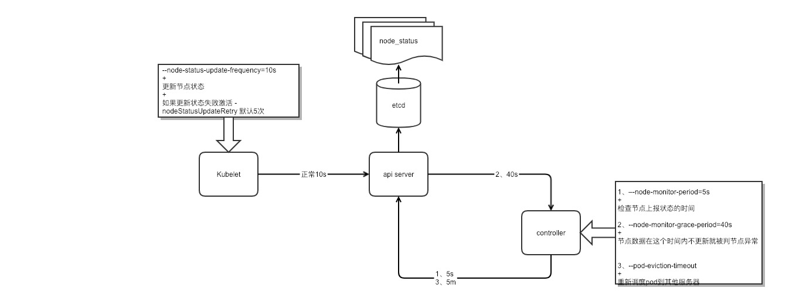

# Node 异常调度逻辑
## Node 内部状态检查
`kubelet` 会将一个或者多个[信号](https://kubernetes.io/docs/concepts/architecture/nodes/)，如`OutOfDisk`.`MemoryPressure` 等映射到对应的节点状态。

1. `kubelet` 指定更新状态频率由 `--node-status-update-frequency` 决定，默认10秒。
- 为了防止检测这些状态震荡，使用 `eviction-pressure-transition-period` 控制压力检测的震荡，默认5分钟。
- 如果超过了这个值，`kubelet` 将会启动回收资源机制来尝试恢复异常压力检测。[回收方法包含但不限于](https://k8smeetup.github.io/docs/tasks/administer-cluster/out-of-resource/#%E8%8A%82%E7%82%B9%E7%8A%B6%E6%80%81)。
- 如果回收后还无法得到足够资源，它将开始移除 pod，按照 pod 排名来决定。
	- BestEffort 最先先被移除
	- Guaranteed 会尽可能的保证不被回收资源被移除，除非 node 上只有  Guaranteed。
- 回收触发阈值设置 `--eviction-hard`,默认 ` imagefs.available<15%,memory.available<100Mi,nodefs.available<10%,nodefs.inodesFree<5%`
	- 使用 `--eviction-minimum-reclaim` 为了防止磁盘被重复回收，可以限定回收结束的最小标尺，默认为 0 。可以设置例如 `memory.available=0Mi,nodefs.available=500Mi,imagefs.available=2Gi` 
	- 当处于回收触发情况时，将禁止 pod 调度到本节点
- 因为 kubelet 没办法区分 daemonset pod ，所以不要创建 `BestEffort ` pod 
### 最佳实践
- 场景
	- 节点内存容量：10Gi
	- 操作员希望为系统守护进程保留 10% 内存容量
	- 操作员希望在内存用量达到 95% 时移除 pod，以减少对系统的冲击并防止系统 OOM 的发生
	- 设置参数

			--eviction-hard=memory.available<500Mi
			--system-reserved=memory=1.5Gi
			  
### 已知问题
- kubelet 可能无法立即发现内存压力

	可能在轮询周期中就就导致 oom 而没有触发 `MemoryPressure`，防止这个问题可以设置回收限制为 75% 或更低，这块主要和 node 节点内存有关。
- 由于采集器时间查，可能会移除过多的 pod

	可以使用[这个方式](https://github.com/google/cadvisor/issues/1247)减缓
- kubelet 响应 inode 耗尽对待移除 pod 排名

	现在无法知道容器内部的 inode 消耗，所以这块触发会按照 pod 的优先级进行处理，新版本也许解决了，待观察

## NODE 故障(导致 NODE 无法上报状态)
### 相关参数
- –node-status-update-frequency，默认值10s

	kubelet 周期性的更新自身状态到 apiserver	
- nodeStatusUpdateRetry 默认5次

	kubelet 在更新自身状态的时候将会有重试，当前 nodeStatusUpdateRetry 设置的默认值为5次
	
所以将会发生 nodeStatusUpdateRetry * –node-status-update-frequency 才能更新一次 node 的状态。

- –-node-monitor-period ，默认值为5s

	controller manager将会每个会检查 kubelet 上报 –node-monitor-period 周期内检查 nodeStatusUpdateRetry 次。

- 	–node-monitor-grace-period，默认值为40s

	node 的状态将周期内更新 controller manager 中的设置，当 –node-monitor-grace-period 周期之后没被更新，将会认为 node unhealthy. 它将会根据 –pod-eviction-timeout 时间来移除pods

### 故障流程
- 正常
	- 节点更新节点状态
	- 控制器获取状态判断正常
	- 结束
- 异常
	- 节点无法更新状态
	- –-node-monitor-period 检查时间 5s
	- 发现状态没更新，触发 --node-monitor-grace-period 超时40s 
	- 触发 --pod-eviction-timeout 回收

- 逻辑图

	

### 调优场景
- 默认

	参数|值
	---|---
	-–node-status-update-frequency|10s
	--node-monitor-period|5s
	--node-monitor-grace-period|40s
	--pod-eviction-timeout|5m

	节点异常40秒被控制器视为关闭，然后会触发驱离 pod 进程。5分40秒开始驱离 pod
	
- 调优方案
	- 快

		参数|值
		---|---
		-–node-status-update-frequency|4s
		--node-monitor-period|2s
		--node-monitor-grace-period|20s
		--pod-eviction-timeout|30s
		
		节点异常20秒被控制器视为关闭，然后会触发驱离 pod 进程。50秒开始驱离 pod
	- 中

		参数|值
		---|---
		-–node-status-update-frequency|20s
		--node-monitor-period|5s
		--node-monitor-grace-period|2m
		--pod-eviction-timeout|1m
		
		
	- 低

		参数|值
		---|---
		-–node-status-update-frequency|1m
		--node-monitor-period|5m
		--node-monitor-grace-period|2m
		--pod-eviction-timeout|1m
		
		Kubelet 将会 1m 更新一次 node 的状态，在认为不健康之后会有 5m/1m*5=25 次重试更新的机会。Node 为不健康的时候，1m 之后pod 开始 evict.

## 参考		
[参考资料](https://github.com/kubernetes-incubator/kubespray/blob/master/docs/kubernetes-reliability.md)