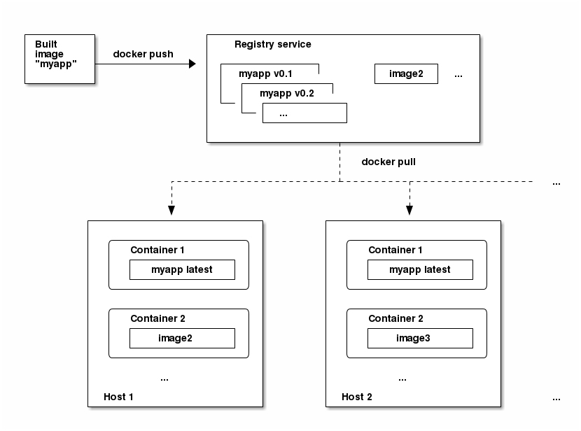

# 核心概念
以下是有关使用 ocp 时遇到的核心概念和对象的高级架构信息。

- [容器和镜像](https://docs.openshift.com/container-platform/3.6/architecture/core_concepts/containers_and_images.html#architecture-core-concepts-containers-and-images)是部署应用程序的基础
- [pod和服务](https://docs.openshift.com/container-platform/3.6/architecture/core_concepts/pods_and_services.html#architecture-core-concepts-pods-and-services)允许容器相互通讯和代理连接
- [项目和用户](https://docs.openshift.com/container-platform/3.6/architecture/core_concepts/projects_and_users.html#architecture-core-concepts-projects-and-users)提供了组织和管理其内容的空间和手段
- [构建和镜像流](https://docs.openshift.com/container-platform/3.6/architecture/core_concepts/builds_and_image_streams.html#architecture-core-concepts-builds-and-image-streams)允许构建工作镜像并对新镜像作出反应
- [部署](https://docs.openshift.com/container-platform/3.6/architecture/core_concepts/deployments.html#architecture-core-concepts-deployments)增加了对软件开发和部署生命周期的扩展支持
- [路由](https://docs.openshift.com/container-platform/3.6/architecture/core_concepts/routes.html#architecture-core-concepts-routes) 对外服务的接口
- [模版](https://docs.openshift.com/container-platform/3.6/architecture/core_concepts/templates.html#architecture-core-concepts-templates) 允许根据定义自定义参数一次创建多个对象

## 容器和镜像
### 容器
ocp 应用程序的基本单位称为容器。 ocp 和 k8s 增加了在多主机安装中编排 docker 格式的容器能力。
### 初始容器
一个 pod 可以有除应用程序容器之外的初始容器。初始化容器允许重新组织安装脚本和绑定代码。初始化容器与常规容器不同之处在于它总是运行到完成。每个初始化容器必须在下一个启动之前成功完成。
### 镜像
ocp 的容器基于 docker 格式的镜像。镜像是包含运行单个容器的所有要求的二进制文件，以及描述其需求的功能的元数据。 ocp 可以通过跨多个主机在多个容器中部署相同的镜像，并在它们之间进行负载均衡，ocp 可以为打包成镜像的服务提供冗余和水平缩放。
### 镜像版本标签策略
docker 允许应用镜像名称之外的标签，如(v1, v2.1, GA, latest),进一步指定所需的镜像，可能会看到相同的图像 `centos:centos7`。不要对任何官方的 openshift 镜像使用 latest 标签。镜像策略：

- vX.Y

	这个表示标签为 `X.Y.Z- <number>`,例子:版本是 `v3.4` 应该设置为 `3.4.1-8`
- X.Y.Z

	类似上面，`X.Y.Z- <number>`,例子:版本是 `3.4.1` 应该设置为 `3.4.1-8`
- `X.Y.Z-<number>`

	标签是唯一的，不会改变，使用标签时，如果更新镜像，则镜像不会更新。例如 版本是 `3.4.1-8` 应该设置为 `3.4.1-8`

### 镜像仓库
镜像仓库用于存储和检索 docker 格式的容器镜像服务。

## POD 和服务
### pod
ocp 利用了 k8s 中 pod 的概念，它是在一个主机上部署在一起的一个或多个容器，以及可以被定义\部署\管理的最小计算单元。每个 pod 分配了自己内部ip地址，因此拥有其整个端口空间， pod 中的容器可以共享其本地存储和网络。

pod 是一个生命周期，它们被定义，则它们被分配为在节点上运行，然后直到退出或者因其他原因被删除。 pod 根据策略和退出代码，退出可能会被删除或者可以保留以便访问其容器的日志。 ocp 将 pod 视为绝对不变的， pod 定义在运行时不能进行修改。 ocp 通过终止现有的 pod 并修改的配置、镜像来对 pod 进行修改。 pod 被视为消耗品，并且在重新创建时不保持状态。因此，pod 通常由更高级别的控制器管理，而不是由直接由用户管理。 每个 ocp 计算节点主机建议最大 pod 数为 110个。

以下提供长期时间运行的服务的 pod 的例子定义，实际上是 ocp 基础结构的一部分：集成的容器仓库。它展示了 pod 的许多功能，其中大部分在其他主题中讨论，因此仅简单介绍

```
apiVersion: v1
kind: Pod
metadata:
  annotations: { ... }
  labels: # pod 可以用一个或者多个标签标记，然后可以将其用在单个操作中选择和管理 pod 组。标签以元数据哈希中的密钥/值格式存储。此例中的一个标签是 docker-registry: default                               
    deployment: docker-registry-1
    deploymentconfig: docker-registry
    docker-registry: default
  generateName: docker-registry-1-  # pod 必须定义命名空间中具有唯一的名称， pod 定义可以指定具有 generateName 属性的名称的基础，并且将自动添加随机字符以生成唯一的名称     
spec:
  containers:  # 容器指定容器定义的数组，在这种情况下只有一个                          
  - env: # 容器环境变量                                
    - name: OPENSHIFT_CA_DATA
      value: ...
    - name: OPENSHIFT_CERT_DATA
      value: ...
    - name: OPENSHIFT_INSECURE
      value: "false"
    - name: OPENSHIFT_KEY_DATA
      value: ...
    - name: OPENSHIFT_MASTER
      value: https://master.example.com:8443
    image: openshift/origin-docker-registry:v0.6.2  #容器镜像
    imagePullPolicy: IfNotPresent
    name: registry
    ports:             # 容器绑定 pod ip 上的端口                 
    - containerPort: 5000
      protocol: TCP
    resources: {}
    securityContext: { ... }  # ocp 定义了一个容器安全上下文，指定是否允许它们作为特权容器运行，作为他们选择的用户运行等等。默认上下文是非常严格的，但管理员可以根据需要进行修改。          
    volumeMounts:  #容器指定外部存储卷应该安装在容器内部的位置。这种情况下，有一个用于存储registry 的卷，另外一个用于访问 registry 对于 ocp api 发出请求所需的凭证。                     
    - mountPath: /registry
      name: registry-storage
    - mountPath: /var/run/secrets/kubernetes.io/serviceaccount
      name: default-token-br6yz
      readOnly: true
  dnsPolicy: ClusterFirst
  imagePullSecrets:
  - name: default-dockercfg-at06w
  restartPolicy: Always
  serviceAccount: default   #对于 ocp api 发出请求的 pod 是足够常见的模式，有一个 serviceAccount 字段用于指定在进行请求时，pod应该认证那个人服务器账户用户。这使自定义基础架构组件的细粒度访问控制成为可能。          
  volumes:   # 这里定义了容器可用的存储容量，在这种情况下，它为 registry 存储和服务账户凭证的  secret 卷提供临时卷                         
  - emptyDir: {}
    name: registry-storage
  - name: default-token-br6yz
    secret:
      secretName: default-token-br6yz
```	
这些 pod 定义不包含在被创建和生命周期开始后 pod 自动填充 ocp 属性。 [k8s api 文档](https://docs.openshift.com/container-platform/3.6/rest_api/kubernetes_v1.html#rest-api-kubernetes-v1)具有 pod rest api 对象属性的完整信息，[k8s pod 文档](https://kubernetes.io/docs/concepts/workloads/pods/pod/)
### 初始化容器
初始化容器是 pod 应用程序容器启动之前启动的容器。在容器启动之前，初始化容器可以共享卷，执行网络操作并执行计算。初始化容器还可以阻止或延迟应用程序容器的启动，直到满足某些必要条件。当一个容器启动时，在初始化网络和容器之后，初始化容器按顺序启动。在下一个被调用之前，每个初始化容器必须成功退出。如果初始化容器无法启动或者失败退出，则根据 pod [restartPolicy](https://docs.openshift.com/container-platform/3.6/dev_guide/configmaps.html#consuming-configmap-in-pods) 重试该容器:

- Always

	尝试连续重新启动，以 10／20/40 秒的指数回退延迟，直到重新启动 pod
- Never

	不尝试重新启动， pod 失败将立即退出。
- OnFailure

	在5分钟后以 10／20/40 秒的指数回退延迟
	
在所有初始化容器成功之前，将不会启动任何一个应用容器。有关初始化使用用例，请参考[k8s文档](https://kubernetes.io/docs/concepts/workloads/pods/init-containers/#examples)，以下用例描述了一个具有两个初始化容器的简单 pod。第一个初始化容器等待 myservice，第二个等待 mydb,一但两个容器都成功， pod 就会启动。

```
apiVersion: v1
kind: Pod
metadata:
  name: myapp-pod
  labels:
    app: myapp
spec:
  containers:
  - name: myapp-container
    image: busybox
    command: ['sh', '-c', 'echo The app is running! && sleep 3600']
  initContainers:
  - name: init-myservice #指定 myservcie 容器
    image: busybox
    command: ['sh', '-c', 'until nslookup myservice; do echo waiting for myservice; sleep 2; done;']
  - name: init-mydb  #指定 mydb 容器
    image: busybox
    command: ['sh', '-c', 'until nslookup mydb; do echo waiting for mydb; sleep 2; done;']
```	

每个初始化容器都包含除了 `readinessProbe` 之外的所有应用容器的字段[fields of an app container ](https://docs.openshift.com/container-platform/3.6/architecture/core_concepts/pods_and_services.html#example-pod-definition)，初始化容器必须退出以使 pod 启动继续，除了完成之外无法定义准备就绪。

初始化容器可以包含 pod 上的 [activeDeadlineSeconds](https://docs.openshift.com/container-platform/3.6/dev_guide/jobs.html#jobs-setting-maximum-duration) 和容器上的 [livenessProbe](https://docs.openshift.com/container-platform/3.6/dev_guide/application_health.html#container-health-checks-using-probes)，以防止初始化容器永远失败。

### 服务
k8s 服务用做内部负载均衡器。它标记了一组复制 pod，以便代理它接收到的连接。可以在服务保持一致可用的情况下，将 pod 添加到服务中或者从服务中删除，任何访问这个服务的请求都将引用这个地址。默认服务器集群ip地址来自 ocp 内部网络，它们用于允许集群被访问。

为了允许外部访问，添加 `externalIP` 和 `ingressIP` 分配给这个服务。这些 `externalIP` 的地址也可以使虚拟 ip 地址，提供服务的高可用访问接口。

服务被分配一个地址和端口，当被访问时，代理将转发到到一个适当的副本 pod。服务标签选择器来查找所有在特定端口上提供特定网络服务的容器。

像 pod 一样，服务也是 rest 对象。下面定义了服务中的 pod。

```
apiVersion: v1
kind: Service
metadata:
  name: docker-registry   # 服务名称 docker-registry 也被用来构造一个环境变量，其中服务 ip 被插入到同一个命名空间的其他 pod 中。 名称长度 63个字符串。   
spec:
  selector: # 标签选择器用标识 docker-registry: default 描述所有 pod，标签将被添加到所有该服务下的 pod 中。                 
    docker-registry: default
  portalIP: 172.30.136.123   #虚拟 ip 服务，从内部 ip 地址池创建时自动分配。
  ports:
  - nodePort: 0
    port: 5000  #服务监听端口             
    protocol: TCP
    targetPort: 5000   服务转发到 pod 上的端口      
```

### 服务外部ip-externalIPs
除集群的内部 ip 地址外，用户还可以配置集群外部的 ip 地址。管理员负责确保流量到达到具有此 ip 的节点。

外部的 ip 地址必须由集群管理员从 `master-config.yaml` 文件中配置的 `ExternalIPNetworkCIDRs` 范围中选择。当 `master-config.yaml` 更改时，必须重启启动 master 服务。

- ExternalIPNetworkCIDR /etc/origin/master/master-config.yaml

	```
networkConfig:
  ExternalIPNetworkCIDR: 172.47.0.0/24
```
- 服务 externalIPs 定义 (JSON)

	```
{
    "kind": "Service",
    "apiVersion": "v1",
    "metadata": {
        "name": "my-service"
    },
    "spec": {
        "selector": {
            "app": "MyApp"
        },
        "ports": [
            {
                "name": "http",
                "protocol": "TCP",
                "port": 80,
                "targetPort": 9376
            }
        ],
        "externalIPs" : [
            "80.11.12.10"  #除了内部 ip 地址外，端口将暴露在外部 ip 地址列表。      
        ]
    }
}
```

### 服务入口ip-ingressIPs
在非云集群中，外部地址可以从一个地址池中自动分配。该池在 `/etc/origin/master/master-config.yaml` 文件中配置。更改这个配置文件需要重启 master 服务。 `ingressIPNetworkCIDR` 默认设置为 `172.29.0.0/16`。如果集群环境尚未使用此专用范围，请使用默认范围或者设置自定义范围。如果使用高可用，则范围必须小于 256 个地址。

- ingressIPNetworkCIDR /etc/origin/master/master-config.yaml

```
networkConfig:
  ingressIPNetworkCIDR: 172.29.0.0/16	
```

### 服务节点端口
设置服务 `type=NodePort` 将从标志配置的范围(默认:30000-32767)中分配一个端口，并且每个节点会将该端口(每个节点上相同的端口号)代理到服务中。

所选的端口将在服务的配置中 `spec.ports[*].nodePort` 中报告。

要指定自定义端口，只需要将端口号放在 `nodePort` 字段中。自定义端口号必须在 `nodePorts` 的配置范围内。当 `master-config.yaml` 更改时， master 服务必须重新启动。

- servicesNodePortRange /etc/origin/master/master-config.yaml

	```
kubernetesMasterConfig:
  servicesNodePortRange: ""
```		

	服务将作为 `<NodeIP>:spec.ports[].nodePort` 和 `spec.clusterIp:spec.ports[].port` 设置一个 `nodePort` 是特权操作
	
### 服务代理模式
 ocp 由两种不同的服务路由基础结构实现。
 
 - iptables-based

 	默认实现完全基于 iptables 的，并使用概率 iptables 重写规则来分配端点和 pod 之间的传入服务连接。基于 ` iptables-based ` 的实现效率要高得多，但要所有端点始终能够接受连接。如果有良好的[准备检查](https://docs.openshift.com/container-platform/3.6/dev_guide/application_health.html#dev-guide-application-health)，那么基于 ` iptables-based ` 服务代理是最好的选择。
 
 - space-based

 	较早的实现使用用户空间进程来接受传入连接，然后在客户端和其中一个端点 pod 之间进行代理。用户空间实现比较慢，但是可以依次尝试多个端点，直到找到一个能工作的端点。 如果没有准备检查则，可以在安装时启用基于用户空间的代理 `space-based` ，也可以通过编辑节点配置文件来部署集群之后启用基于用户空间的代理。

### 标签
标签用于组织，组，选择 api 对象。例如，pod 被标记为 `tagged`,然后服务使用标签选择器来识别它们代理的 pod。这使得服务可以参考 pod 组，甚至将具有潜在不同的 pod作为相关实体处理。大多数对象可以在其元数据中包含标签。所以标签可以用来分组任意相关的对象。例如可以对特定的一个你哟功能程序所有 pod，服务,复制控制器(rc)，部署配置(dc)进行分组。标签时简单的 kv，如

```
labels:
  key1: value1
  key2: value2
``` 
考虑：

- 一个由 nginx 容器组成的 pod，标签为 `role=webserver`
- 一个由 http 容器组成的 pod，具有相同的标签 `role=webserver`

定义为使用 `role=webserver` 标签的 pod 的服务或者复制控制器将这 2个 pod 视为同一组的一部分。

### 端点 
支持服务的服务器称为端点，并由具有相同名称的端点类型的对象指定作为服务。当服务由 pod 支持，这些 pod 通常由服务规范中的标签选择器指定， ocp 自动创建指向这些 pod 端点的对象。在某些情况下，可能需要创建一个服务，但要让它由外部主机而不是 ocp 中的pod 来支持。这种情况下，可以省略服务中的选择器字段，并手动创建端点对象。请注意， ocp 不会让大多数用户手动创建一个端点对象，该对象指向为 [pod 和服务 ip 保留的网络中的 ip 地址](https://docs.openshift.com/container-platform/3.6/install_config/configuring_sdn.html#configuring-the-pod-network-on-masters)。只有[集群管理员](https://docs.openshift.com/container-platform/3.6/architecture/additional_concepts/authorization.html#roles)或具有在 ` endpoints/restricted ` 下创建资源权限的其他用户才能创建此端点对象。
## 项目和用户
### 用户
与 ocp 交互是通过用户相关联。 ocp 用户对象表示一个角色，可以通过像角色或者角色组添加角色来授权系统功能权限。可以存在几种类型的用户:

- 普通用户

	大多数与 ocp 交互的用户表达方式。常规用户在首次登录时会自动在系统中创建，或者可以通过 api 创建。通常用户由用户对象表示。例子：`joe alice`
- 系统用户

	其中许多在定义基础架构时自动创建，主要为了使用基础架构能够安全的与 api 交互。它们包括一个 集群管理员(可以访问所有内容)，一个每个节点的用户，路由和镜像仓库的用户，各种其他用户。最后还有一个匿名 `anonymous ` 的系统用户默认使用未经身份验证请求。例如: `system:admin` `system:openshift-registry` `system:node:node1.example.com`
- 服务账户

	这些是与项目相关的特殊系统用户，有些是在项目第一次创建时自动创建的，而项目管理员可以创建更多的目的是为每个项目内容的访问。服务账户由 `ServiceAccount` 对象表示。例如 `system:serviceaccount:default:deployer` `system:serviceaccount:foo:builder`

每个用户都必须以某种方式进行身份验证才能访问 ocp。没有身份验证或者无效的身份验证的 api 请求会被匿名 `anonymous` 系统用户认证为请求。一但通过身份验证，策略将确定用户被授权执行的操作。

### 命名空间
k8s 命名空间提供了一种机制来限制集群中的资源。在 ocp 中，一个项目是一个 k8s 的命名空间，带有额外的注释。命名空间提供了一个独特的范围:

- 命名资源，以避免基本的命名冲突
- 委托管理权限给受信任的用户
- 限制资源的能力

系统中的大多数对象都是以名称空间作为范围的，但是有些是例外的，没有命名空间，包括节点和用户。

### 项目
一个项目是一个 k8s 的命名空间，带有额外的注释和通常使用者获取资源的中心管理工具。一个项目允许用户社区与其他社区隔离和管理它们的内容。必须由管理员授予用户对项目的访问权限或如果允许创建项目将自动获得自己的项目。项目可以由一个单独的`name, displayName, description`。  

- name

	强制名称是项目唯一标识符，在使用 cli 工具或者 api 时最为明显。最大名称长度是 63 个字符。
- displayName

	可选，项目在 web 控制台中国年显示的方式，默认为(name)
- description 			

	可选，可以对项目进行更加详细的描述，也可以在控制台看到。

每个项目都有自己的一套设置

- 对象

	pod,service,rc等等
- 策略

	用户可以或不可以对对象执行操作的规则
- 约束

	可以限制每种对象的配额。
- 服务账户

	服务账户自动执行，并指定访问项目中的对象。

集群管理员可以[创建项目](https://docs.openshift.com/container-platform/3.6/dev_guide/projects.html#dev-guide-projects)并将项目的[管理权委派](https://docs.openshift.com/container-platform/3.6/admin_guide/manage_authorization_policy.html#managing-role-bindings)给用用户社区的任何成员。集群管理员还可以允许普通用户创建[自己的项目](https://docs.openshift.com/container-platform/3.6/admin_guide/managing_projects.html#selfprovisioning-projects)。普通用户和管理员可以使用 cli 或者 web 控制台与项目进行交互。

## 构建和镜像流
### 构建
构建是将输入的参数转换成结果对象的过程。通常，该过程用于将输入参数或源代码转换为可运行的镜像。一个 `BuildConfig` 对象是整个构建过程的定义。 ocp 通过构建 docker 格式的容器镜像并将其推送到镜像仓库来用 k8s。 构建对象具有共同的特性: 投入建设，需要完成一个过程，记录构建过程，发布成功构建的资源，并发布构建的最终状态。构建利用资源限制，指定资源的限制，如 cpu 使用率，内存使用率，构建或 pod 执行时间。

ocp 构建系统提供了可扩展的支持，用于构建基于 api 中指定的可选类型的构建策略。主要由三种构建策略可用。

-  docker 构建
- S2I 构建	
- 自定义构建

默认情况下，支持 docker 构建和 S2I 构建。构建结果对象取决于用于创建它的构建器。对于docker和 S2I 构建，生成对象是可运行的镜像。对于自定义构建，结果对象是构建镜像用户指定的任何对象。另外，管道构建策略可以用于实现复杂的工作流：

- 持续整合
- 持续部署

构建命令列表，请参考[开发人员指南](https://docs.openshift.com/container-platform/3.6/dev_guide/builds/index.html#dev-guide-how-builds-work)

### docker 构建
docker 构建策略调用 docker build 命令，因此它需要一个具有 dockerfile 和其中所需的必要工具的镜像仓库生成可运行的镜像。
### S2I 构建
S2I 是一种用于可重复性构建的工具。它通过将应用程序源注入到容器镜像中并组装新的镜像来生成准备运行的镜像。新的镜像合并了基本镜像(构建器)和内置的源代码，可以使用 docker run 命令。S2I 支持增量构建，重新使用以前下载依赖的关系，以前构建的镜像等等。本功能的优点:

- 镜像的灵活性

	可以编写 S2I 脚本，以便将应用程序代码注入几乎任何现有的 docker 镜像中，充分利用现有生态。请注意，目前 S2I 依靠 tar 来注入应用程序源，所以镜像需要能够处理 tar 内容。
- 速度

	使用 S2I，编译过程中可以执行大量复杂的操作，而无需在每个步骤创建新的镜像，从而实现快速的过程。另外，可以编写 S2I 脚本来重新使用存储在以前版本的应用镜像中的工具，而不必每次运行构建时下载或构建它们。
- 补丁能力

	如果由于安全问题而导致基础镜像需要修补程序，则 S2I 允许一致的重建应用程序。
- 运营效率

	通过限制构建操作而不是允许任意操作，dockerfile 允许 paas 操作员可以避免意外和滥用构建系统。
- 操作安全

	构建一个任意的 dockerfile 将主机系统公开为 root 权限。这可能被恶意用户利用，因此整个 dockerfile 构建过程具有 docker 特权用户运行。 s2i 限制作为 root 用户执行的操作，并可以作为非 root 用户运行脚本。
- 用户效率

	s2i 阻止开发者在应用程序构建期间执行任意的 yum 安装类操作，这可能会减慢开发迭代。
- 生态系统

	si2 鼓励建立一个共享的镜像生态系统，在这里可以利用应用的最佳实践。
- 再生性

	生成的图像可以包括所有输入，包括特定版本的构建工具和依赖项。这确保镜像可以被精确的再现。

### 自定义构建
自定义构建允许开发人员定义负责整个构建过程的特定构建器镜像。使用自己的构建起镜像可以让用户自定义构建过程。自定义构建镜像是一个普通的 docker 格式的镜像，嵌入了构建过程的逻辑，例如用于构建 rpm 或基本镜像。作为自定义构建镜像的展示， docker hub 中提供了 `openshift/origin-custom-docker-builder` 镜像。
### pipline 构建
pipline 构建策略允许开发人员定义 jenkins 管道插件以及 jenkins 管道插件的执行。构建可以通过 ocp 与其他构建类型相同的方式启动，监视和管理。

pipline 工作流在 jenkins 文件中定义，可以直接嵌入到构建配置中，也可以在 git 仓库中提供，并构建配置引用。在项目首次使用 pipline 构建策略定义构建配置时， ocp 实例化一个 jenkins 服务来执行管道。项目中的后续管道生成配置共享此 jenkins 服务器。 jenkins 不会自动删除，即使所有的 pipline 构建配置都被删除。它必须手工删除。
### 镜像流
镜像流包括标签标示的任意数量的docker镜像。它呈现了一个相关镜像的虚拟视图，类似镜像库，并肯能包含以下任何镜像:

- ocp 集成镜像仓库拥有自己的镜像 repo
- 其他镜像流
- 外部镜像仓库镜像 repo

镜像流可以用于在创建新镜像时自动执行操作。构建和部署可以监视镜像流，以在添加新镜像流时接收通知，并分别通过执行构建或者部署来做出反应。对于精心设计的一组镜像流，请阅读 ocp [镜像流和模版库](https://github.com/openshift/library),比如有新镜像版本后自动部署。下面是镜像流对象定义

```
apiVersion: v1
kind: ImageStream
metadata:
  annotations:
    openshift.io/generated-by: OpenShiftNewApp
  creationTimestamp: 2016-01-29T13:33:49Z
  generation: 1
  labels:
    app: ruby-sample-build
    template: application-template-stibuild
  name: origin-ruby-sample
  namespace: test
  resourceVersion: "633"
  selflink: /oapi/v1/namespaces/test/imagestreams/origin-ruby-sample
  uid: ee2b9405-c68c-11e5-8a99-525400f25e34
spec: {}
status:
  dockerImageRepository: 172.30.56.218:5000/test/origin-ruby-sample
  tags:
  - items:
    - created: 2016-01-29T13:40:11Z
      dockerImageReference: 172.30.56.218:5000/test/origin-ruby-sample@sha256:47463d94eb5c049b2d23b03a9530bf944f8f967a0fe79147dd6b9135bf7dd13d
      generation: 1
      image: sha256:47463d94eb5c049b2d23b03a9530bf944f8f967a0fe79147dd6b9135bf7dd13d
    tag: latest
```
### 镜像流镜像
一个镜像流镜像是一个虚拟的资源，允许从一个特定的镜像流中检索镜像。它通常缩写为 `isimage`,由两部分组成: `<image stream name>@<image name>` 。参考上面的例子中图片， `isimage` 看起来像:

	origin-ruby-sample@sha256:47463d94eb5c049b2d23b03a9530bf944f8f967a0fe79147dd6b9135bf7dd13d
用户没有权限读取和列出集群级别的镜像，仍然可以检索它们有权访问的项目中国年使用此资源标记的镜像。
### 镜像流 tag
镜像流 tag 是镜像流中镜像的命名指针。通常缩写为 `istag`。它可以引用任何本地或者外部管理的镜像。包含一个镜像的历史记录，表示 tag 所指向的所有镜像堆栈。每当新的或者现有镜像在特定的标签下被 tag 时，它只放在历史堆栈的第一位，原先的就变成第二位可用。这允许简单的回滚，使标签再次指向历史镜像。

标签也是由两部分组成: `<image stream name>:<tag>` istag 指的是上面例子中的镜像 `sha256:47463d94eb5c049b2d23b03a9530bf944f8f967a0fe79147dd6b9135bf7dd13d` 将是 `origin-ruby-sample:latest`

历史上有两个镜像的镜像流 tag

```
  tags:
  - items:
    - created: 2016-03-02T10:15:09Z
      dockerImageReference: 172.30.56.218:5000/test/origin-ruby-sample@sha256:909de62d1f609a717ec433cc25ca5cf00941545c83a01fb31527771e1fab3fc5
      generation: 2
      image: sha256:909de62d1f609a717ec433cc25ca5cf00941545c83a01fb31527771e1fab3fc5
    - created: 2016-01-29T13:40:11Z
      dockerImageReference: 172.30.56.218:5000/test/origin-ruby-sample@sha256:47463d94eb5c049b2d23b03a9530bf944f8f967a0fe79147dd6b9135bf7dd13d
      generation: 1
      image: sha256:47463d94eb5c049b2d23b03a9530bf944f8f967a0fe79147dd6b9135bf7dd13d
    tag: latest
```
### 镜像流映射
当 ocp 集成的镜像仓库收到一个新的镜像时，它创建一个 `ImageStreamMapping`，并将其发送到 ocp，提供镜像的命名空间(项目),名称，tag和镜像元数据。这个信息被用来创建一个新的镜像(如果不存在)并且将惊喜那个 tag 到镜像流中。 ocp 存储有关每个镜像的完整元数据，例如 命令，入口点和环境变量。 ocp 中的镜像时不可辨的，最大长度 63 个字符。

以下 `ImageStreamMapping` 例子中导致镜像被 tag 为 `test/origin-ruby-sample:latest`

镜像流映射对象定义

```
apiVersion: v1
kind: ImageStreamMapping
metadata:
  creationTimestamp: null
  name: origin-ruby-sample
  namespace: test
tag: latest
image:
  dockerImageLayers:
  - name: sha256:5f70bf18a086007016e948b04aed3b82103a36bea41755b6cddfaf10ace3c6ef
    size: 0
  - name: sha256:ee1dd2cb6df21971f4af6de0f1d7782b81fb63156801cfde2bb47b4247c23c29
    size: 196634330
  - name: sha256:5f70bf18a086007016e948b04aed3b82103a36bea41755b6cddfaf10ace3c6ef
    size: 0
  - name: sha256:5f70bf18a086007016e948b04aed3b82103a36bea41755b6cddfaf10ace3c6ef
    size: 0
  - name: sha256:ca062656bff07f18bff46be00f40cfbb069687ec124ac0aa038fd676cfaea092
    size: 177723024
  - name: sha256:63d529c59c92843c395befd065de516ee9ed4995549f8218eac6ff088bfa6b6e
    size: 55679776
  - name: sha256:92114219a04977b5563d7dff71ec4caa3a37a15b266ce42ee8f43dba9798c966
    size: 11939149
  dockerImageMetadata:
    Architecture: amd64
    Config:
      Cmd:
      - /usr/libexec/s2i/run
      Entrypoint:
      - container-entrypoint
      Env:
      - RACK_ENV=production
      - OPENSHIFT_BUILD_NAMESPACE=test
      - OPENSHIFT_BUILD_SOURCE=https://github.com/openshift/ruby-hello-world.git
      - EXAMPLE=sample-app
      - OPENSHIFT_BUILD_NAME=ruby-sample-build-1
      - PATH=/opt/app-root/src/bin:/opt/app-root/bin:/usr/local/sbin:/usr/local/bin:/usr/sbin:/usr/bin:/sbin:/bin
      - STI_SCRIPTS_URL=image:///usr/libexec/s2i
      - STI_SCRIPTS_PATH=/usr/libexec/s2i
      - HOME=/opt/app-root/src
      - BASH_ENV=/opt/app-root/etc/scl_enable
      - ENV=/opt/app-root/etc/scl_enable
      - PROMPT_COMMAND=. /opt/app-root/etc/scl_enable
      - RUBY_VERSION=2.2
      ExposedPorts:
        8080/tcp: {}
      Labels:
        build-date: 2015-12-23
        io.k8s.description: Platform for building and running Ruby 2.2 applications
        io.k8s.display-name: 172.30.56.218:5000/test/origin-ruby-sample:latest
        io.openshift.build.commit.author: Ben Parees <bparees@users.noreply.github.com>
        io.openshift.build.commit.date: Wed Jan 20 10:14:27 2016 -0500
        io.openshift.build.commit.id: 00cadc392d39d5ef9117cbc8a31db0889eedd442
        io.openshift.build.commit.message: 'Merge pull request #51 from php-coder/fix_url_and_sti'
        io.openshift.build.commit.ref: master
        io.openshift.build.image: centos/ruby-22-centos7@sha256:3a335d7d8a452970c5b4054ad7118ff134b3a6b50a2bb6d0c07c746e8986b28e
        io.openshift.build.source-location: https://github.com/openshift/ruby-hello-world.git
        io.openshift.builder-base-version: 8d95148
        io.openshift.builder-version: 8847438ba06307f86ac877465eadc835201241df
        io.openshift.expose-services: 8080:http
        io.openshift.s2i.scripts-url: image:///usr/libexec/s2i
        io.openshift.tags: builder,ruby,ruby22
        io.s2i.scripts-url: image:///usr/libexec/s2i
        license: GPLv2
        name: CentOS Base Image
        vendor: CentOS
      User: "1001"
      WorkingDir: /opt/app-root/src
    Container: 86e9a4a3c760271671ab913616c51c9f3cea846ca524bf07c04a6f6c9e103a76
    ContainerConfig:
      AttachStdout: true
      Cmd:
      - /bin/sh
      - -c
      - tar -C /tmp -xf - && /usr/libexec/s2i/assemble
      Entrypoint:
      - container-entrypoint
      Env:
      - RACK_ENV=production
      - OPENSHIFT_BUILD_NAME=ruby-sample-build-1
      - OPENSHIFT_BUILD_NAMESPACE=test
      - OPENSHIFT_BUILD_SOURCE=https://github.com/openshift/ruby-hello-world.git
      - EXAMPLE=sample-app
      - PATH=/opt/app-root/src/bin:/opt/app-root/bin:/usr/local/sbin:/usr/local/bin:/usr/sbin:/usr/bin:/sbin:/bin
      - STI_SCRIPTS_URL=image:///usr/libexec/s2i
      - STI_SCRIPTS_PATH=/usr/libexec/s2i
      - HOME=/opt/app-root/src
      - BASH_ENV=/opt/app-root/etc/scl_enable
      - ENV=/opt/app-root/etc/scl_enable
      - PROMPT_COMMAND=. /opt/app-root/etc/scl_enable
      - RUBY_VERSION=2.2
      ExposedPorts:
        8080/tcp: {}
      Hostname: ruby-sample-build-1-build
      Image: centos/ruby-22-centos7@sha256:3a335d7d8a452970c5b4054ad7118ff134b3a6b50a2bb6d0c07c746e8986b28e
      OpenStdin: true
      StdinOnce: true
      User: "1001"
      WorkingDir: /opt/app-root/src
    Created: 2016-01-29T13:40:00Z
    DockerVersion: 1.8.2.fc21
    Id: 9d7fd5e2d15495802028c569d544329f4286dcd1c9c085ff5699218dbaa69b43
    Parent: 57b08d979c86f4500dc8cad639c9518744c8dd39447c055a3517dc9c18d6fccd
    Size: 441976279
    apiVersion: "1.0"
    kind: DockerImage
  dockerImageMetadataVersion: "1.0"
  dockerImageReference: 172.30.56.218:5000/test/origin-ruby-sample@sha256:47463d94eb5c049b2d23b03a9530bf944f8f967a0fe79147dd6b9135bf7dd13d
```
## 部署
### 复制控制器 Replication Controllers  rc
复制控制器始终运行指定数目的副本。如果 pod 退出或者删除，则复制控制器将执行更多的实例化操作，直到定义的数字为止。同样如果有多出的运行 pod 超出预期，它会删除多余的保证定义数字。复制控制器配置包括：

- 所需的副本数量(可运行时调整)
- 创建复制 pod 使用的 pod 定义
- 用于识别管理 pod 的选择器

选择器时分配给复制控制器管理容器的一组标签。这些标签包含在复制控制器实例化 pod 定义中。复制控制器使用选择器来确定已经运行了多少 pod 实例，以便根据需求进行调整。复制控制器不会根据负载和流量执行自动扩缩，因为它不跟踪。相反这将通过自动缩放器来调整其副本计数。复制控制器是 k8s 核心对象。下面是复制控制器的定义:

```
apiVersion: v1
kind: ReplicationController
metadata:
  name: frontend-1
spec:
  replicas: 1  # 副本数量
  selector:   # 选择器 
    name: frontend
  template:   #控制器创建 pod 模版 
    metadata:
      labels:  # pod 的标签，应该包含选择器的标签
        name: frontend  #任意参数最大长度 63 字符
    spec:
      containers:
      - image: openshift/hello-openshift
        name: helloworld
        ports:
        - containerPort: 8080
          protocol: TCP
      restartPolicy: Always
```

### 作业
作业类似于复制控制器，其目的是为了指定的原因创建 pod。不同之处在于复制控制器是连续运行 pod 设计的，而作业是为了一次性 pod。一份作业跟踪任何成功完成，当到指定数量的完成时，作业完成。下面是计算  π 到 2000个位置打印出来，然后完成:

```
apiVersion: extensions/v1
kind: Job
metadata:
  name: pi
spec:
  selector:
    matchLabels:
      app: pi
  template:
    metadata:
      name: pi
      labels:
        app: pi
    spec:
      containers:
      - name: pi
        image: perl
        command: ["perl",  "-Mbignum=bpi", "-wle", "print bpi(2000)"]
      restartPolicy: Never
```

### 部署和部署配置
基于复制控制器， ocp 平台通过部署的概念为软件开发和部署生命周期增加了更多的支持。简单情况下，部署只是创建了一个新的复制控制器，并让它启动 pod 。但 ocp 部署还提供了从现在映射部署过度到新的部署的能力，还可以定义在创建复制控制器之前和之后运行的钩子。 ocp `DeploymentConfiguration` 对象定义了部署的以下细节:

- 复制控制器定义的元素
- 触发器自动创建新的部署
- 部署之间的转换策略
- 生命周期的钩子

每次触发部署时，无论是手动还是自动部署，部署 pod 管理部署包括缩小旧的复制器，扩展新的复制器，并运行挂连。完成后，部署 pod 将保留无限期的时间，以保留其部署日志。当一个部署被另外一个部署所取代时，前面的复制控制器将保留，以便在需要的时候轻松回滚。如何创建和部署交互详细说明，请看[部署](https://docs.openshift.com/container-platform/3.6/dev_guide/deployments/basic_deployment_operations.html#dev-guide-basic-deployment-operations)。下面例子中 `DeploymentConfiguration` 定义，其中一些省略和标注

```
apiVersion: v1
kind: DeploymentConfig
metadata:
  name: frontend
spec:
  replicas: 5
  selector:
    name: frontend
  template: { ... }
  triggers:
  - type: ConfigChange #ConfigChange 触发器会导致在复制控制器模版更改时创建新的部署
  - imageChangeParams:
      automatic: true
      containerNames:
      - helloworld
      from:
        kind: ImageStreamTag
        name: hello-openshift:latest
    type: ImageChange  #ImageChange 每次在命名的镜像流中有可用的支持镜像的新版本时，ImageChange 触发器会进行新镜像部署
  strategy:
    type: Rolling #默认的滚动策略使部署之前无需停机     
```      