# Bookinfo on istio
Istio 项目有一个名为 [bookinfo](https://istio.io/docs/examples/bookinfo) 的示例教程，该教程由四个独立的微服务组成，用于演示各种 Istio 功能。Bookinfo 应用程序显示有关书籍的信息，类似于在线书店的单个商品。页面上显示的是书籍，书籍详细信息（ISBN，页数和其他信息）以及书评。

架构图

架构图说明

- 示例是一个多语言开发的微服务应用
- 首先有一个 python 实现的 ProductPage 入口应用展示书籍的详细信息和评价
- 它会调用 Ruby 实现的 Detail 应用获取书籍详情，同时调用 Java 实现的 reviews 评价应用获取书籍的评价。

Bookinfo 应用程序包含四个独立的微服务：

- productpage 微服务调用 details 和 reviews 微服务来填充页面。
- details 微服务包含图书信息。
- reviews 微服务包含了书评。它也称为 ratings 微服务。
- ratings 微服务包含伴随书评书排名信息。

评论微服务有三个版本：

- 版本 v1 不会调用 ratings 服务。
- 版本 v2 调用 ratings 服务并将每个评级显示为一到五个黑色星。
- 版本 v3 调用 ratings 服务并将每个评级显示为一到五个红星。

## 部署实验
### 先决条件
- 安装了 OCP 3.11 或更高版本。
- 安装 Service Mesh 0.8.0 以上版本。
- Red Hat OpenShift Service Mesh 以与上游 Istio 项目不同的方式实现自动注入，因此该过程使用 bookinfo.yaml 注释文件的一个版本来启用 Istio sidecar 的自动注入。

### 步骤
1. 为Bookinfo应用程序创建项目。

		$ oc new-project bookinfo 	
- 通过增加使用的 BookInfo 的服务帐户在 “bookinfo” 命名空间更新 anyuid 和 privileged 的安全上下文约束（SCC）

		$ oc adm policy add-scc-to-user anyuid -z default -n bookinfo
		$ oc adm policy add-scc-to-user privileged -z default -n bookinfo
- 下载 bookinfo 发布文件

		git clone https://github.com/pangzheng/bookinfo
- 通过应用文件 bookinfo.yaml 在 “bookinfo” 命名空间中部署 Bookinfo 应用程序，这里的发布程序只是带了版本以及 istio 注入策略的普通 deployment 发布程序

		$ oc apply -n bookinfo -f bookinfo.yaml
- 检查
	- 使用命令行检查 pod && svc ，已经可以看到 sidecat 注入
		- pod 
	
				# oc get pod -n bookinfo
				NAME                              READY     STATUS    RESTARTS   AGE
				details-v1-54b6b58d9c-csqlx       2/2       Running   0          7m
				productpage-v1-69b749ff4c-mwpcs   2/2       Running   0          7m
				ratings-v1-7ffc85d9bf-dgf67       2/2       Running   0          7m
				reviews-v1-fcd7cc7b6-r9wht        2/2       Running   0          7m
				reviews-v2-655cc678db-wfxld       2/2       Running   0          7m
				reviews-v3-645d59bdfd-jdzb7       2/2       Running   0          7m
			
		- svc

				# oc get svc
				NAME          TYPE        CLUSTER-IP       EXTERNAL-IP   PORT(S)    AGE
				details       ClusterIP   172.30.230.207   <none>        9080/TCP   22h
				productpage   ClusterIP   172.30.69.180    <none>        9080/TCP   22h
				ratings       ClusterIP   172.30.26.133    <none>        9080/TCP   22h
				reviews       ClusterIP   172.30.80.137    <none>        9080/TCP   22h	
	- 使用 kiali 检查
		- 使用游览器访问 kiali
		
				https://$openshift-route-ip/console/workloads?namespaces=bookinfo
		- 输入账户名密码(在之前的 istio operator install 文件找)
		- 看到所有服务是否正常

			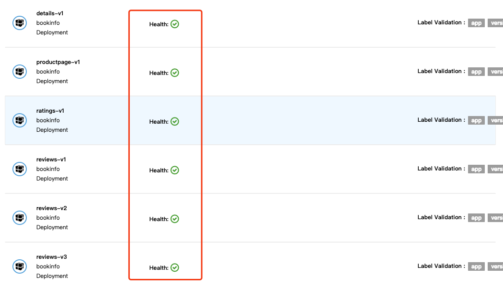
		- 还可以点击到一个服务看具体情况，比如istio 情况，流量描述等
			
			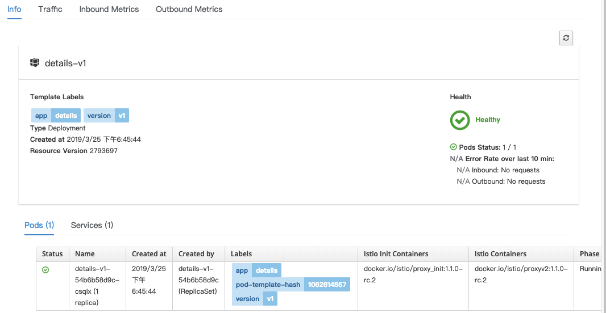
- 请求流量
	- istio 
	
		Istio 假定进入和离开服务网络的所有流量都会通过 Envoy 代理进行传输。通过将 Envoy 代理部署在服务之前，运维人员可以针对面向用户的服务进行 A/B 测试、部署金丝雀服务等。类似地，通过使用 Envoy 将流量路由到外部 Web 服务（例如，访问 Maps API 或视频服务 API）的方式，运维人员可以为这些服务添加超时控制、重试、断路器等功能，同时还能从服务连接中获取各种细节指标。
		
		下图显示了对外进出口都是经过 envoy 模拟的网关，从而接受 istio 统一管理的。
		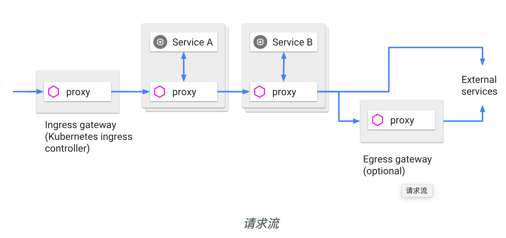
		
	- istio on openshift

		因为 envoy 单点无法对外保证高可用，所以需要增加外部 LB 来做出口，默认 openshift 会设置 route 来做 ingress-gateway 的出口设置。所以从逻辑上稍微有点混乱，就是 ingress-gateway 是对所有 istio 内部的服务的出口网关，而不是单一一个服务的。
	
		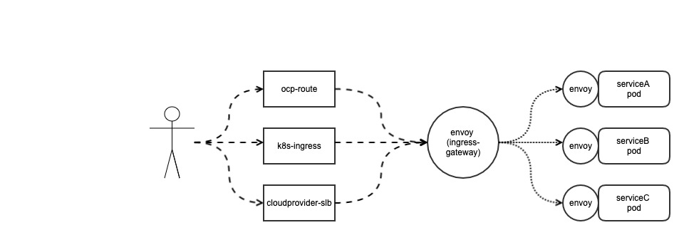					
- 通过应用 bookinfo-gateway.yaml 文件为 Bookinfo 创建  istio gateway 规则。 包含负载均衡器设置的 Gateway 和 Gateway 配置的 VirtualService。

		$ oc apply -n bookinfo -f bookinfo-gateway.yaml

		apiVersion: networking.istio.io/v1alpha3
		kind: Gateway
		metadata:
		  name: bookinfo-gateway
		spec:
		  selector:
		    istio: ingressgateway # 使用 pod 标签，筛选的是红帽服务网格默认的网格网关
		  servers:
		  - port:
		      number: 80
		      name: http
		      protocol: HTTP
		    hosts:
		    - "*"
		---
		apiVersion: networking.istio.io/v1alpha3
		kind: VirtualService
		metadata:
		  name: bookinfo
		spec:
		  hosts:
		  - "*"
		  gateways:
		  - bookinfo-gateway
		  http:
		  - match:
		    - uri:
		        exact: /productpage # 匹配条件a
		    - uri:
		        exact: /login # 或者匹配条件b
		    - uri:
		        exact: /logout # 或者匹配条件c
		    - uri:
		        prefix: /api/v1/products #或者根据请求 URI 前缀匹配
		    route:
		    - destination:
		        host: productpage
		        port:
		          number: 9080
- 查看导入结果
	- 网关
		
			# oc get gateway -n bookinfo
			NAME               AGE
			bookinfo-gateway   22d
	- 路由

			# oc get virtualservices -n bookinfo
			NAME          GATEWAYS             HOSTS           AGE
			bookinfo      [bookinfo-gateway]   [*]             22d		          
### 验证 BOOKINFO 安装
要确认应用程序已成功部署，请运行以下命令

- 设置网关 `GATEWAY_URL` 参数

		$ export GATEWAY_URL=$(oc get route -n istio-system istio-ingressgateway -o jsonpath='{.spec.host}')

- 确认结果
	- 命令行

			$ curl -o /dev/null -s -w "%{http_code}\n" http://$GATEWAY_URL/productpage
	- 可以通过游览器访问

		请注意，默认情况下请求被随机负载到这三个不同版本的实例上，多次刷新会循环3个版本，随机会出现“红色的五颗小星星”、“黑色的五颗小星星”、“没有小星星”，分别对应v3、v2、v1

			http://$GATEWAY_URL/productpage

以上已经完成了所有 bookinfo 的测试场景部署。下面开始使用 istio 来做项目管理任务。在尝试此任务之前，应该熟悉一些重要的术语，例如 `destination rule` 、`virtual service` 和 `subset`，不了解点击[概念文档](https://istio.io/zh/docs/concepts/traffic-management)进行查看。 下面是简介

Istio 中包含有四种流量管理配置资源，分别是 `VirtualService`、`DestinationRule`、`ServiceEntry` 以及 `Gateway`。
	 
### 添加默认目标规则
在使用 Istio 控制 Bookinfo 版本路由之前，需要在目标规则中定义好可用的版本

- 下载规则

		wget https://raw.githubusercontent.com/istio/istio/release-1.0/samples/bookinfo/networking/destination-rule-all.yaml
		wget https://raw.githubusercontent.com/istio/istio/release-1.0/samples/bookinfo/networking/destination-rule-all-mtls.yaml
- 查看规则(已不启动 TLS 为例)

		apiVersion: networking.istio.io/v1alpha3
		kind: DestinationRule
		metadata:
		  name: productpage
		spec:
		  host: productpage # productpage 
		  subsets: # 设置了一个 v1 版本
		  - name: v1 
		    labels:
		      version: v1
		---
		apiVersion: networking.istio.io/v1alpha3
		kind: DestinationRule
		metadata:
		  name: reviews
		spec:
		  host: reviews
		  subsets: # 设置了三个版本
		  - name: v1
		    labels:
		      version: v1
		  - name: v2
		    labels:
		      version: v2
		  - name: v3
		    labels:
		      version: v3
		---
		apiVersion: networking.istio.io/v1alpha3
		kind: DestinationRule
		metadata:
		  name: ratings
		spec:
		  host: ratings
		  subsets: # 设置了四个版本
		  - name: v1
		    labels:
		      version: v1
		  - name: v2
		    labels:
		      version: v2
		  - name: v2-mysql
		    labels:
		      version: v2-mysql
		  - name: v2-mysql-vm
		    labels:
		      version: v2-mysql-vm
		---
		apiVersion: networking.istio.io/v1alpha3
		kind: DestinationRule
		metadata:
		  name: details
		spec:
		  host: details
		  subsets: # 设置了两个版本
		  - name: v1
		    labels:
		      version: v1
		  - name: v2
		    labels:
		      version: v2		
      
- 导入规则(注意要使用带 TLS 的，否则服务无法正常)
	- 如果不需要启用双向TLS，请执行以下命令

			oc apply -f destination-rule-all.yaml
	- 如果需要启用双向TLS，请执行以下命令

			oc apply -f destination-rule-all-mtls.yaml
- 查看规则
	- 查看列表
		
			oc get destinationrule			 
	- 查看全文

			oc get destinationrule -o yaml
		
做完这一步就可以使用这个应用来体验 Istio 的特性了，其中包括了流量的路由、错误注入、速率限制等。

注意这里导入规则后实际项目是就无法访问了，需要继续设置智能路由

### 设置路由
- 下载规则

		wget https://raw.githubusercontent.com/istio/istio/release-1.0/samples/bookinfo/networking/virtual-service-all-v1.yaml
- 查看规则

		apiVersion: networking.istio.io/v1alpha3
		kind: VirtualService
		metadata:
		  name: productpage
		spec:
		  hosts:
		  - productpage # 访问 productpage 
		  http: # 路由指向 productpage v1
		  - route:
		    - destination:
		        host: productpage
		        subset: v1
		---
		apiVersion: networking.istio.io/v1alpha3
		kind: VirtualService
		metadata:
		  name: reviews
		spec:
		  hosts:
		  - reviews # 访问 reviews
		  http:
		  - route: # 路由指向 reviews v1
		    - destination:
		        host: reviews
		        subset: v1
		---
		apiVersion: networking.istio.io/v1alpha3
		kind: VirtualService
		metadata:
		  name: ratings
		spec:
		  hosts:
		  - ratings # 访问 ratings
		  http:
		  - route: # 路由指向 ratings v1
		    - destination:
		        host: ratings
		        subset: v1
		---
		apiVersion: networking.istio.io/v1alpha3
		kind: VirtualService
		metadata:
		  name: details
		spec:
		  hosts:
		  - details # 访问 details
		  http:
		  - route: # 路由指向 details v1
		    - destination:
		        host: details
		        subset: v1
- 导入路由

		# oc apply -f virtual-service-all-v1.yaml
		virtualservice.networking.istio.io/productpage created
		virtualservice.networking.istio.io/reviews created
		virtualservice.networking.istio.io/ratings created
		virtualservice.networking.istio.io/details created

- 检查导入的路由列表

		# oc get virtualservices -n bookinfo
		NAME          GATEWAYS             HOSTS           AGE
		bookinfo      [bookinfo-gateway]   [*]             22d  # 网关路由
		details                            [details]       20d  # 新设置的路由
		productpage                        [productpage]   20d  # 新设置的路由
		ratings                            [ratings]       20d  # 新设置的路由
		reviews                            [reviews]       20d  # 新设置的路由
 - 查看具体路由规则

		# oc get virtualservices -n bookinfo details -o yaml
		apiVersion: networking.istio.io/v1alpha3
		kind: VirtualService
		metadata:
		  annotations:
		    kubectl.kubernetes.io/last-applied-configuration: |
		      {"apiVersion":"networking.istio.io/v1alpha3","kind":"VirtualService","metadata":{"annotations":{},"name":"details","namespace":"bookinfo"},"spec":{"hosts":["details"],"http":[{"route":[{"destination":{"host":"details","subset":"v1"}}]}]}}
		  creationTimestamp: 2019-03-27T13:59:06Z
		  generation: 1
		  name: details
		  namespace: bookinfo
		  resourceVersion: "3160182"
		  selfLink: /apis/networking.istio.io/v1alpha3/namespaces/bookinfo/virtualservices/details
		  uid: 7c8c7e35-5098-11e9-b31d-00163e0382f7
		spec:
		  hosts:
		  - details
		  http:
		  - route:
		    - destination:
		        host: details
		        subset: v1

### 部署检查
- 在 bookinfo 服务可以解析的 liunx 或者 mac (`brew install watch`)上面执行以下命令来模拟请求

		watch -n 1 "time curl -s http://${istio-ingressgateway}/productpage > /dev/null"
- 游览器打开 kiali 地址,并登录 

		https://${KIALI}
- 点击 Graph,应该可以看到动态统计图表

	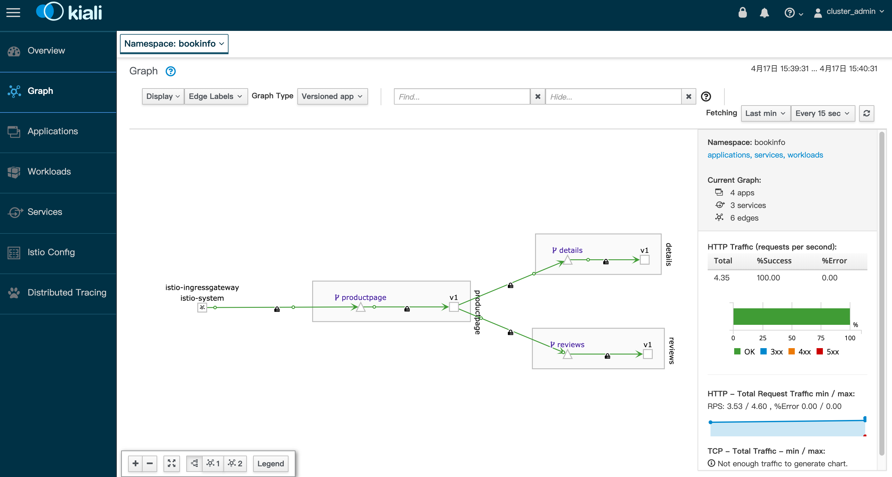	
		
## bookinfo 实验1-智能路由
### 1.1 配置请求路由
#### 1.1.1 测试新的路由配置
- 实验说明

	Istio Bookinfo 示例包含四个独立的微服务，每个微服务都有多个版本。 其中一个微服务 `reviews` 的三个不同版本已经部署并同时运行。 上面初始化后，已经将 `reviews` 的目标是应用将所有流量路由到微服务的 `v1` 版本的规则。实验将修改到 `v2` 路由。

- 修改路由规则
	- 编辑
	
			# vi review-vs-v2.yaml
			
			apiVersion: networking.istio.io/v1alpha3
			kind: VirtualService
			metadata:
			  name: reviews
			spec:
			  hosts:
			  - reviews
			  http:
			  - route:
			    - destination:
			        host: reviews
			        subset: v2					        
	- 执行
		
			# oc apply -f review-vs-v2.yaml -n bookinfo
- 实验结果验证

	再回到 kiali 查看流量，看到流量从 v1 切换到 v2 了
		
	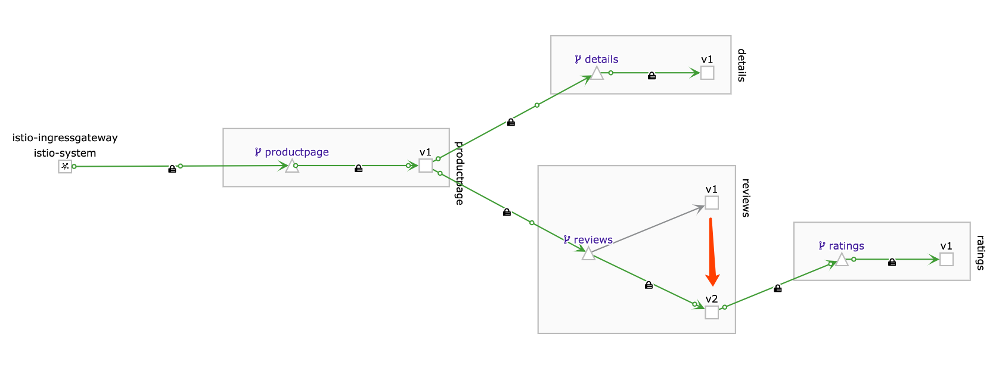
		
#### 1.1.2 基于用户身份的路由
- 实验说明

	将更改路由配置，以便将来自特定用户的所有流量路由到特定服务版本。在这种情况下，来自名为 Jason 的用户的所有流量将被路由到服务 `reviews:v2`。

	请注意，Istio 对用户身份没有任何特殊的内置机制。这个例子的基础在于， `productpage` 服务在所有针对 `reviews` 服务的调用请求中都加自定义的 HTTP header，从而达到在流量中对最终用户身份识别的这一效果。

请记住，reviews:v2 是包含星级评分功能的版本。

- 修改路由规则
	- 编辑
	
			# vi review-vs-v2.yaml
			
			apiVersion: networking.istio.io/v1alpha3
			kind: VirtualService
			metadata:
			  name: reviews
			spec:
			  hosts:
			  - reviews
			  http:
			  - match:
			    - headers:
			        end-user:
			          exact: jason
			    route:
			    - destination:
			        host: reviews
			        subset: v2
			  - route:
			    - destination:
			        host: reviews
			        subset: v1					        
	- 执行
		
			# oc apply -f review-vs-v2.yaml -n bookinfo
	- 实验结果验证
		1. 通过游览器登录 bookinfo 地址，注意添加后缀 `/productpage`,可以看到 review 服务显示的是 v1 版本，没有评星

			
		2. 再通过 signin 按钮登录以用户 jason 身份登录，可以看到 review 服务已经切换 v2 版本，到有评星 			
			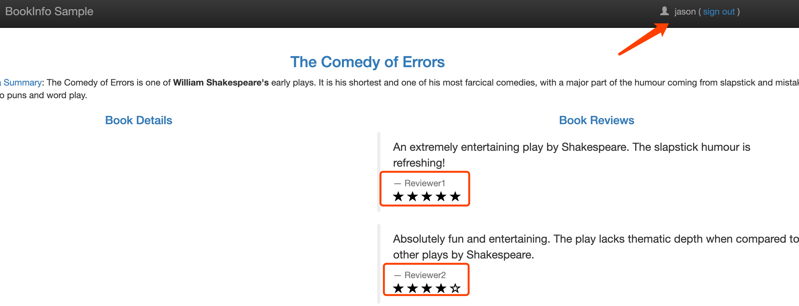
		3. 用其他用户登录再看，发现评星又消失了

			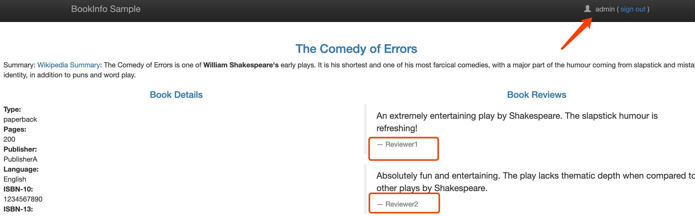	

#### 原理说明			
在此实验中，首先使用 Istio 将 100% 的请求流量都路由到了 `reviews` 服务的 `v1` 版本。 然后再设置了一条路由规则，在 `productpage` 服务中添加了路由规则，这一规则根据请求的 `end-user` 自定义 header 内容，选择性地将特定的流量路由到了 `reviews` 服务的 `v2` 版本。

请注意，为了利用 Istio 的 L7 路由功能，Kubernetes 中的服务（如本任务中使用的 Bookinfo 服务）必须遵守某些特定限制。 参考 [sidecar 注入文档](https://istio.io/zh/docs/setup/kubernetes/additional-setup/requirements)了解详情。

### 1.2 故障注入 
#### 前提条件
本实验的实验环境初始化是以实验环境1为基础，最后请求流程为

	productpage → reviews:v2 → ratings (jason 用户)
	productpage → reviews:v1 (其他用户)
#### 1.2.1-使用 HTTP 延迟进行故障注入
- 实验说明

	将为用户 `jason` 在 `reviews:v2` 和 `ratings` 服务之间注入一个 7 秒的延迟。 这个测试将会发现故意引入 Bookinfo 应用程序中的错误。

由于 `reviews:v2` 服务对其 `ratings` 服务的调用具有 10s 的硬编码连接超时，比 7s 延迟要大，因此期望端到端流程是正常的（没有任何错误）

- 注入故障
	- 编辑
	
			# vi virtual-service-ratings-test-delay.yaml
	
				apiVersion: networking.istio.io/v1alpha3
				kind: VirtualService
				metadata:
				  name: ratings
				spec:
				  hosts:
				  - ratings
				  http:
				  - match:
				    - headers:
				        end-user:
				          exact: jason
				    fault:
				      delay:
				        percentage:
				          value: 100.0
				        fixedDelay: 7s
				    route:
				    - destination:
				        host: ratings
				        subset: v1
				  - route:
				    - destination:
				        host: ratings
				        subset: v1
	- 执行
		
			# oc apply -f virtual-service-ratings-test-delay.yaml -n bookinfo
- 实验结果验证
	- 通过浏览器打开 Bookinfo 应用。
	- 使用用户 jason 登陆到 /productpage 界面。
	- 期望 Bookinfo 主页在大约 7 秒钟加载完成并且没有错误。但是，出现了一个问题，Reviews 部分显示了错误消息：

			Error fetching product reviews!
			Sorry, product reviews are currently unavailable for this book.		
	- 打开啊游览器的开发模式查看总体加载时间
	
		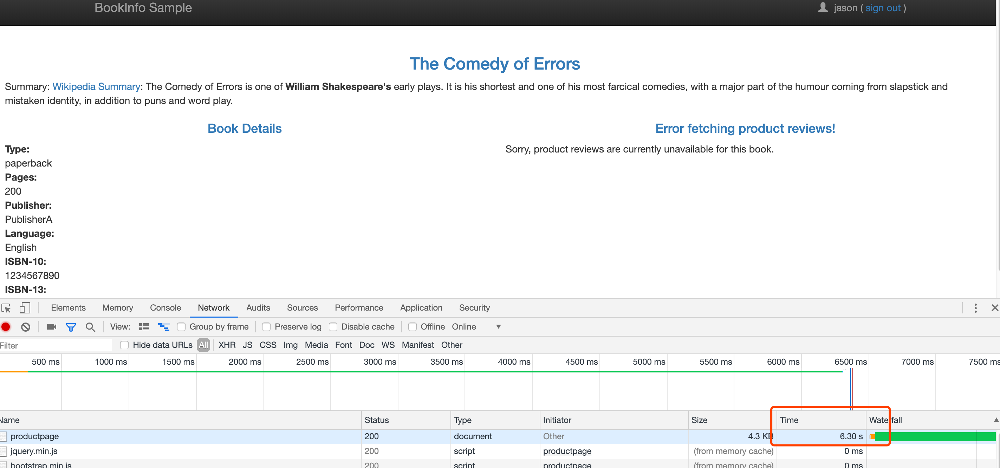
	- 这里是发现了一个实验预流的一个bug

		在 bookinfo 微服务中有硬编码超时，导致 reviews 服务失败。在 `productpage` 和 `reviews` 服务之间超时时间是 6s (编码 3s + 1 次重试总共 6s) ，`reviews` 和 `ratings` 服务之间的硬编码连接超时为 10s 。由于引入的延时，`/productpage` 提前超时并引发错误。

		这些类型的错误可能发生在典型的企业应用程序中，其中不同的团队独立地开发不同的微服务。Istio 的故障注入规则可帮助用户识别此类异常，而不会影响最终用户。
	- 修复错误
		- 这里需要修复 `reviews` 到 `ratings` 之间的超时问题并重启服务。实验中 `review:v3` 版本已经修复了这个问题，将之前的延迟规则更改为使用 2.8 秒延迟，然后针对 v3 版本的 reviews 运行它，后解决。
 		
			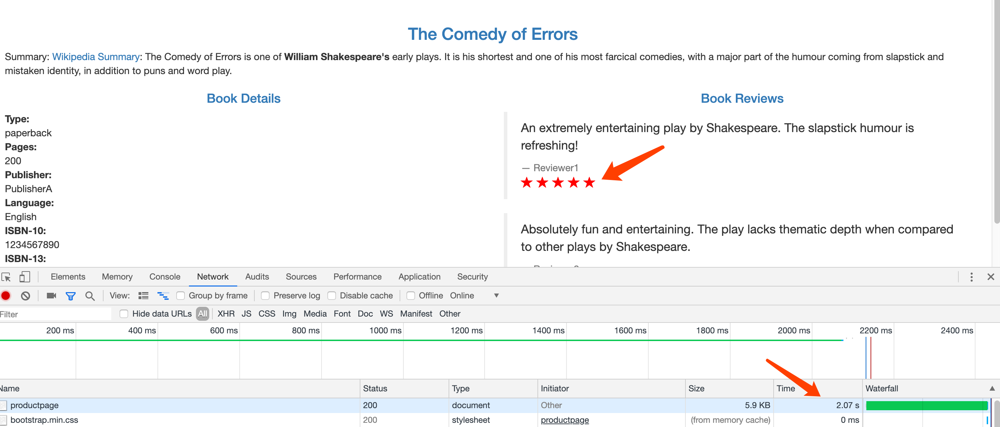

#### 1.2.2-使用 HTTP abort 进行故障注入
- 实验说明

	测试微服务弹性的另一种方法是引入 HTTP abort 故障。在这个任务中，在 `ratings` 微服务中引入 HTTP abort ，测试用户为 `jason` 。

在这个案例中，希望页面能够立即加载，同时显示 `Ratings service is currently unavailable` 这样的消息。			
			
- 注入故障
	- 编辑

			# vim virtual-service-ratings-test-abort.yaml
			
			apiVersion: networking.istio.io/v1alpha3
			kind: VirtualService
			metadata:
			  name: ratings
			spec:
			  hosts:
			  - ratings
			  http:
			  - match:
			    - headers:
			        end-user:
			          exact: jason
			    fault:
			      abort:
			        percentage:
			          value: 100.0
			        httpStatus: 500
			    route:
			    - destination:
			        host: ratings
			        subset: v1
			  - route:
			    - destination:
			        host: ratings
			        subset: v1
	- 执行

			oc apply -f virtual-service-ratings-test-abort.yaml -n bookinfo
- 实验结果验证

	使用 `jason` 访问可以看到一下一行字，而其他用户将看不到这个信息

				
						         		
### 1.3 流量转移
- 实验说明

	本任务将演示如何逐步将流量从一个版本的微服务迁移到另一个版本。例如，可以将流量从旧版本迁移到新版本。

	一个常见的用例是将流量从一个版本的微服务逐渐迁移到另一个版本。在 Istio 中，可以通过配置一系列规则来实现此目标，这些规则将一定百分比的流量路由到一个或另一个服务。在此任务中，将 50％ 的流量发送到 reviews:v1，另外 50％ 的流量发送到 reviews:v3。然后将 100％ 的流量发送到 reviews:v3 来完成迁移。

- 系统还原

	需要将系统还原成所有服务都是用 `v1` 版本
	
		oc apply -f virtual-service-all-v1.yaml
- 切换50% 流量到 `review:v1`,50% 到 `review:v3`
	- 编辑
	
			# vi virtual-service-reviews-50-v3.yaml
			
			apiVersion: networking.istio.io/v1alpha3
			kind: VirtualService
			metadata:
			  name: reviews
			spec:
			  hosts:
			    - reviews
			  http:
			  - route:
			    - destination:
			        host: reviews
			        subset: v1
			      weight: 50
			    - destination:
			        host: reviews
			        subset: v3
			      weight: 50
	- 执行

			# oc apply -f virtual-service-reviews-50-v3.yaml -n bookinfo
- 实验结果验证

	可以通过游览器访问，会发现一半一半。但是从 kiali 看，流量并没有平分开。这块估计主要是统计算法问题。后面数据量大了就好了。
	
	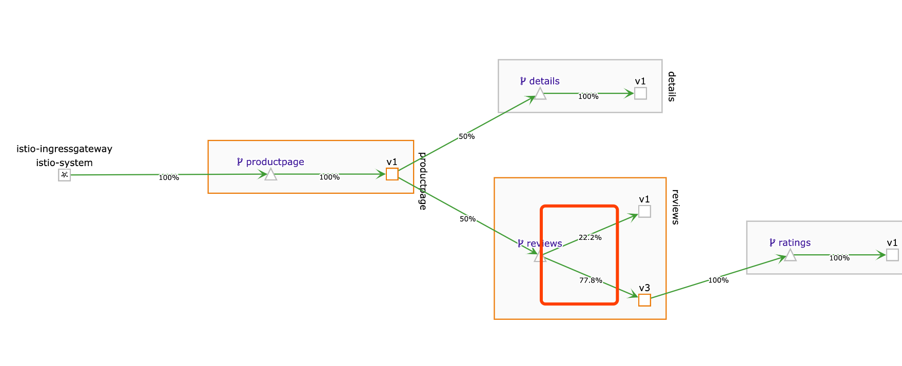			

#### 结论
使用 Istio 的加权路由功能将流量从旧版本的 reviews 服务迁移到新版本。请注意，这和使用容器编排平台的部署功能来进行版本迁移完全不同，后者使用了实例扩容来对流量进行管理。

使用 Istio，两个版本的 reviews 服务可以独立地进行扩容和缩容，并不会影响这两个版本服务之间的流量分发。

如果想了解支持自动伸缩的版本路由的更多信息，请查看[使用 Istio 的 Canary Deployments](https://istio.io/blog/2017/0.1-canary/) 。

### 1.4 请求超时
- 实验说明

	可以在[路由规则](https://istio.io/zh/docs/reference/config/istio.networking.v1alpha3/#httproute)的 `timeout` 字段中来给 http 请求设置请求超时。缺省情况下，超时被设置为 15 秒钟，本文任务中，会把 `reviews` 服务的超时设置为一秒钟。为了能观察设置的效果，还需要在对 `ratings` 服务的调用中加入两秒钟的延迟。

- 还原实验场景

		# oc apply -f virtual-service-all-v1.yaml -n bookinfo
- 设置 `review:v2` 服务的路由定义
	- 编辑

			vi review-vs-v2.yaml
			
			apiVersion: networking.istio.io/v1alpha3
			kind: VirtualService
			metadata:
			  name: reviews
			spec:
			  hosts:
			  - reviews
			  http:
			  - route:
			    - destination:
			        host: reviews
			        subset: v2
	- 执行

			# oc apply -f review-vs-v2.yaml -n bookinfo
- 设置 `ratings` 服务加入延迟
	- 编辑

			vi ratings-vs-v1-delay.yaml		
			apiVersion: networking.istio.io/v1alpha3
			kind: VirtualService
			metadata:
			  name: ratings
			spec:
			  hosts:
			  - ratings
			  http:
			  - fault:
			      delay:
			        percent: 100
			        fixedDelay: 2s
			    route:
			    - destination:
			        host: ratings
			        subset: v1
	- 执行

			# oc apply -f ratings-vs-v1-delay.yaml -n bookinfo
- 打开游览器访问 `http://$GATEWAY_URL/productpage` 可以发现 `ratings` 服务有两秒延迟，再看 kiali 跟踪

	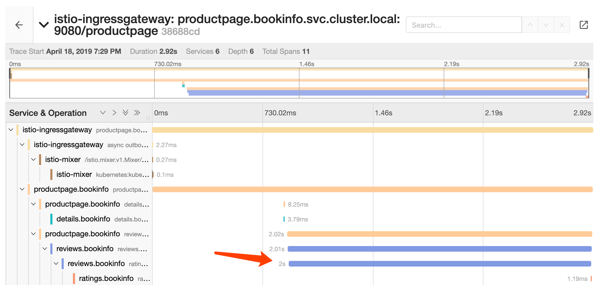
- 接下来在目的为 `reviews:v2` 服务的请求加入一秒钟的请求超时
	- 编辑

			vim review-vs-v2.yaml
			apiVersion: networking.istio.io/v1alpha3
			kind: VirtualService
			metadata:
			  name: reviews
			spec:
			  hosts:
			  - reviews
			  http:
			  - route:
			    - destination:
			        host: reviews
			        subset: v2
			    timeout: 0.5s
	- 执行

			# oc apply -f review-vs-v2.yaml -n bookinfo
- 刷新 bookinfo

	这样就会看到 Bookinfo 的页面（ 页面由 reviews 服务生成）上没有出现 reviews 服务的显示内容，取而代之的是错误信息：`Sorry, product reviews are currently unavailable for this book` ，出现这一信息的原因就是因为来自 `reviews:v2` 服务的超时错误。					    
					        
	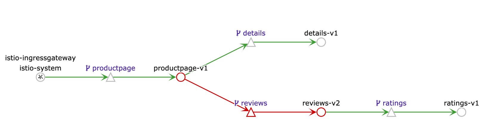
- 高级用法

	除了像本文一样在路由规则中进行超时设置之外，还可以进行请求一级的设置，只需在应用的外发流量中加入 x-envoy-upstream-rq-timeout-ms Header 即可。在这个 Header 中的超时设置单位是毫秒而不是秒	
		
## bookinfo 实验2-深入遥测
### 2.1 收集指标
注意前提 `Mixer` 使用的是缺省配置（`--configDefaultNamespace=istio-system`)

- 收集新的遥测数据
	- 配置说明

		配置中让 Mixer 按照自定义的要求生成新指标，并且会被 prometheus 获取。配置中使用了三种 Mixer 功能：
			
		- 从 Istio 属性中生成 `instance`（这里是指标值以及日志条目）
		- 创建 `handler`（配置 Mixer 适配器），用来处理生成的 `instance`
		- 根据一系列的 `rule`，把 `instance` 传递给 `handler`。  
	- 创建 YAML 文件，用来配置新的指标以及数据流。

			vim new_telemetry.yaml
					
			# 指标 instance 的配置，配置告诉 Mixer 如何为所有请求生成指标。指标来自于 Envoy 汇报的属性（然后由 Mixer 生成）。
			apiVersion: "config.istio.io/v1alpha2"
			kind: metric  # 用来定义指标值的结构
			metadata:
			  name: doublerequestcount # 定义指标的名明
			  namespace: istio-system
			spec:
			  value: "2" # 每个请求计数两次。因为 Istio 为每个请求都会生成 instance，这就意味着这个指标的记录的值等于收到请求数量的两倍
			  dimensions: # 提供了一种为不同查询和需求对指标数据进行分割、聚合以及分析的方式，很简单就是给指标打上了各种标签。让 Mixer 根据属性值和常量为 dimension 生成数值
			    reporter: conditional((context.reporter.kind | "inbound") == "outbound", "client", "server")
			    source: source.workload.name | "unknown" # 首先尝试从 envoy 的 source.workload.name 属性中取值，如果取值失败，则会使用缺省值 "unknown"
			    destination: destination.workload.name | "unknown"
			    message: '"twice the fun!"'  #所有的 instance 都会得到一个常量值："twice the fun!"
			  monitored_resource_type: '"UNSPECIFIED"'
			---
			
			# prometheus handler 的配置，定义 instance 指标翻译成 prometheus 的指标
			apiVersion: "config.istio.io/v1alpha2"
			kind: prometheus
			metadata:
			  name: doublehandler #定义了叫做 doublehandler 的 handler
			  namespace: istio-system
			spec: #spec 中配置了 Prometheus 适配器收到指标之后，如何将指标 instance 转换为 Prometheus 能够处理的指标数据格式的方式。
			  metrics:
			  - name: double_request_count # 配置中生成了一个新的 Prometheus 指标，取名为 double_request_count ，并且会给指定标名加上了 _istio 的前缀，因此这个指标明为 istio_double_request_count
			    instance_name: doublerequestcount.metric.istio-system # Mixer 中的 instance 通过 instance_name 来匹配 Prometheus 指标。instance_name 必须是一个全限定名称（例如：doublerequestcount.metric.istio-system）
			    kind: COUNTER
			    label_names: #指标的标签和 doublerequestcount.metric 的 dimension 配置相匹配
			    - reporter
			    - source
			    - destination
			    - message
			---
			
			# 将指标 Instance 发送给 prometheus handler 的 rule 对象，因为 rule 中没有包含 match 字段，并且身处缺省配置的命名空间内（istio-system），所以这个 rule 对象对所有的网格内通信都会生效。
			apiVersion: "config.istio.io/v1alpha2"
			kind: rule
			metadata:
			  name: doubleprom # 定义了叫做 doubleprom 的 rule 对象
			  namespace: istio-system
			spec: #设置要求 Mixer 把所有的 doublerequestcount.metric 发送给 doublehandler.prometheus
			  actions:
			  - handler: doublehandler.prometheus
			    instances:
			    - doublerequestcount.metric
	- 执行

			# oc apply -f new_telemetry.yaml
	- 制造流量		
	- 登录 prometheus 界面并查询 `istio_double_request_count` 的值,参考[查询 Istio 指标](https://istio.io/zh/docs/tasks/telemetry/metrics/querying-metrics/)
	
		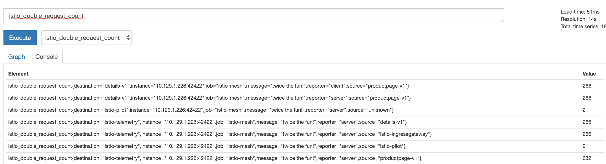
	- 指标分析	

			istio_double_request_count{destination="details-v1",instance="10.129.1.226:42422",job="istio-mesh",message="twice the fun!",reporter="client",source="productpage-v1"}
		- source
		- destination
		- message
		- reporter
		- instance
		- job		

### 2.2 收集日志(没有用例，后面找到再做实验)
- 配置说明

	日志配置是要求 Mixer 把日志发送给 stdout。它也使用了三个部分的配置：

	- instance 配置
	- handler 配置
	- rule 配置
- 创建一个 yaml 文件

		vim new_logs.yaml
		
		#logentry（日志条目）的 instance 配置,配置告知 Mixer 如何根据请求过程中 Envoy 报告的属性生成日志条目。
		apiVersion: "config.istio.io/v1alpha2"
		kind: logentry # 自定义定义生成日志条目
		metadata:
		  name: newlog # 名字为 newlog
		  namespace: istio-system
		spec:
		  severity: '"warning"' #用来指定生成的 logentry 的日志级别,例子中制定的是一个常量 "warning"，这个值会被映射到支持日志级别数据的 logentry handler 中
		  timestamp: request.time # 为所有日志条目提供了时间信息。尝试从 Envoy 的 request.time 属性取值。
		  variables: #让运维人员可以配置每个 logentry 中应该包含什么数据。一系列的表达式控制了从 Istio 属性以及常量映射和组成 logentry 的过程
		    source: source.labels["app"] | source.workload.name | "unknown"
		    user: source.user | "unknown"
		    destination: destination.labels["app"] | destination.workload.name | "unknown"
		    responseCode: response.code | 0
		    responseSize: response.size | 0
		    latency: response.duration | "0ms" # 这个字段是从 response.duration 属性中得来的。如果 response.duration 中没有值就会设置为 0ms
		  monitored_resource_type: '"UNSPECIFIED"'
		---
		
		# stdio（标准输入输出）handler 的配置
		apiVersion: "config.istio.io/v1alpha2"
		kind: stdio
		metadata:
		  name: newhandler # 定义了一个叫做 newhandler 的 handler
		  namespace: istio-system
		spec: # spec 配置了 stdio 适配器收到 logentry instance 之后的处理方法
		 severity_levels: # 参数控制了 logentry 中 severity 字段的映射方式。这里的常量 "warning" 映射为 WARNING 日志级别。
		   warning: 1 # Params.Level.WARNING
		 outputAsJson: true # 参数要求适配器生成 JSON 格式的日志
		---
		
		# 将 logentry instance 发送到 stdio 的 rule 对象配置
		apiVersion: "config.istio.io/v1alpha2"
		kind: rule
		metadata:
		  name: newlogstdio #定义了命名为 newlogstdio 的 rule 对象
		  namespace: istio-system
		spec:
		  match: "true" # 因为 match 参数取值为 true，所以网格中所有的请求都会执行这一对象。
		  actions: #这个对象引导 Mixer 把所有 newlog.logentry instance 发送给 newhandler.stdio handler
		   - handler: newhandler.stdio
		     instances:
		     - newlog.logentry
		---
- 执行

		# oc apply -f new_logs.yaml
- 制造流量
- 查看 istio-telemetry pods 中搜索日志
	
		{"level":"warn","time":"2019-04-18T08:05:17.572055Z","instance":"newlog.logentry.istio-system","destination":"telemetry","latency":"1.69521ms","responseCode":200,"responseSize":5,"source":"details","user":"unknown"}
		{"level":"warn","time":"2019-04-18T08:05:17.581562Z","instance":"newlog.logentry.istio-system","destination":"telemetry","latency":"1.328966ms","responseCode":200,"responseSize":5,"source":"productpage","user":"unknown"}
		{"level":"warn","time":"2019-04-18T08:05:17.572758Z","instance":"newlog.logentry.istio-system","destination":"telemetry","latency":"2.192291ms","responseCode":200,"responseSize":5,"source":"productpage","user":"unknown"}

### 属性和语法
- 属性

	日志和监控使用的属性对应的列表请查看[这里](https://istio.io/zh/docs/reference/config/policy-and-telemetry/attribute-vocabulary/)
- 表达式

	日志和监控使用的表达式对应的列表请查看[这里](https://istio.io/zh/docs/reference/config/policy-and-telemetry/expression-language/)
	
### 2.3 查询指标
如何使用 Prometheus 查询 Istio 指标, 作为此任务的一部分，使用基于 Web 的界面进行指标查询。

- 登录 openshift 查询 istio prometheus 网页		
	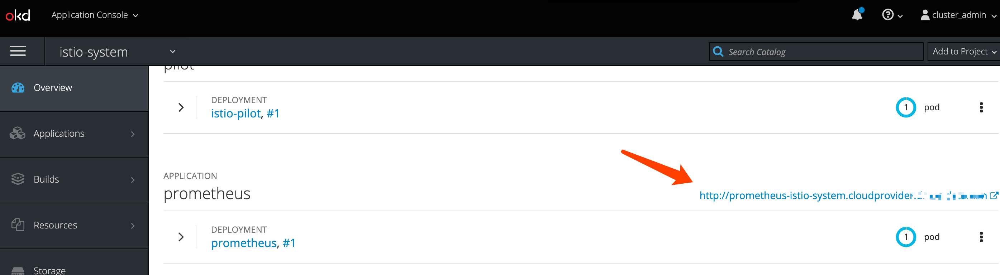
- 访问网页，注意如果是私有域名，请设置 dns 或 hosts 文件
- 执行 Prometheus 查询

	在网页顶部的 “Expression” 输入框中，输入文本： `istio_requests_total` , 然后，单击 `Execute` 按钮。
	
	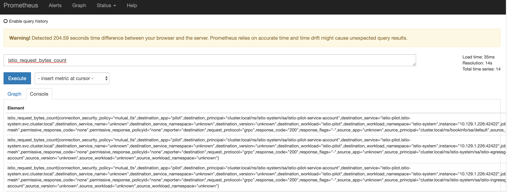
	还可以转化图形
	
	
- 其他查询尝试
	- 对 productpage 服务的所有请求的总数,注意这里会按照状态返回码和安全策略区分
	
			istio_requests_total{destination_service="productpage.bookinfo.svc.cluster.local"}
	
	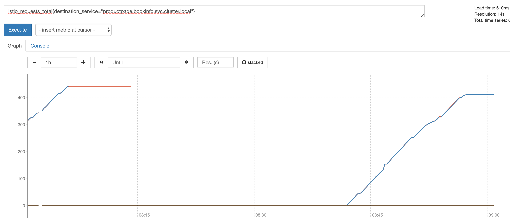			
			
	- 对 reviews 服务的 v3 的所有请求的总数，此查询返回 reviews 服务 v3 的所有请求的当前总计数。

			istio_requests_total{destination_service="reviews.bookinfo.svc.cluster.local",destination_version="v3"}
			
		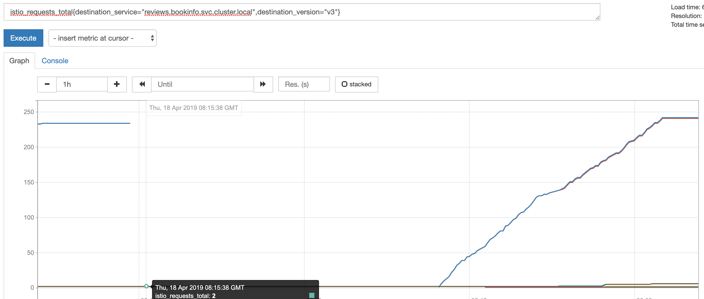			
	- 过去 5 分钟内对所有 productpage 服务的请求率：

			rate(istio_requests_total{destination_service=~"productpage.*", response_code="200"}[5m])	
		
		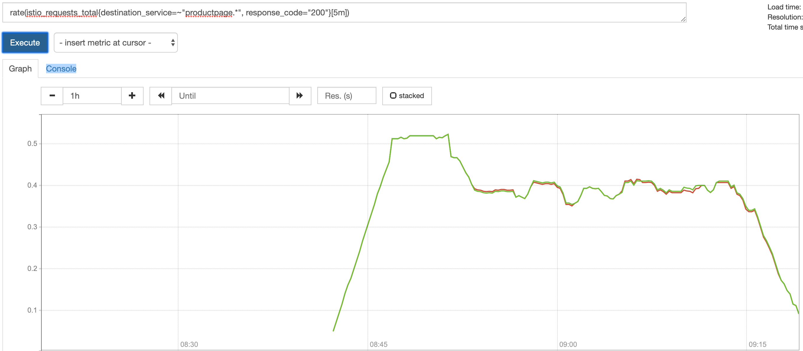

#### Mixer 和 prometheus 的关系
- Mixer 中内置可以生成成 Prometheus 识别的指标值统计页面
- Prometheus 插件则是一个预配置的 Prometheus 服务器
	- 一方面从上述 Mixer 端点抓取 Istio 指标
	- 另一方面还为 Istio 指标提供了持久化存储和查询的服务

配置好的 Prometheus 插件会抓取以下的端点：

- istio-mesh (istio-telemetry.istio-system:42422)

	所有 Mixer 生成的网格指标。
- mixer (istio-telemetry.istio-system:10514)

	所有特定于 Mixer 的指标, 用于监控 Mixer 本身。
- envoy (istio-proxy:15090)

	envoy 生成的原始统计数据。Prometheus 从 envoy 暴露的端口获取统计数据，过滤掉不想要的数据。
- pilot (istio-pilot.istio-system:10514)

	所有 pilot 的指标。
- galley (istio-galley.istio-system:10514)

	所有 galley 的指标。
- istio-policy (istio-policy.istio-system:10514)

	所有 policy 的指标。
		
### 2.4 追踪实验
#### 原理
虽然 Istio 代理能够自动发送 span，但仍然需要一些数据来将整个追踪衔接起来。所以应用程序需要分发 istio 可以识别和跟踪的的 HTTP header，以便当代理发送 span 信息时，span 可以被正确的关联到一个追踪中。

应用程序需要收集传入请求中的 header，并将其传播到任何传出请求。header 如下所示：

- x-request-id
- x-b3-traceid
- x-b3-spanid
- x-b3-parentspanid
- x-b3-sampled
- x-b3-flags
- x-ot-span-context

应用程序中进行下游调用时，请确保包含了这些 header。类似代码如下：

		def getForwardHeaders(request):
		    headers = {}
		
		    if 'user' in session:
		        headers['end-user'] = session['user']
		
		    incoming_headers = [ 'x-request-id',
		                         'x-b3-traceid',
		                         'x-b3-spanid',
		                         'x-b3-parentspanid',
		                         'x-b3-sampled',
		                         'x-b3-flags',
		                         'x-ot-span-context'
		    ]
		
		    for ihdr in incoming_headers:
		        val = request.headers.get(ihdr)
		        if val is not None:
		            headers[ihdr] = val
		            #print "incoming: "+ihdr+":"+val
		
		    return headers
#### 采样优化
Istio 默认捕获所有请求的追踪信息。例如，当使用 Bookinfo 示例应用程序时，每次访问 `/productpage` 时，都会看到相应的追踪仪表板。此采样率适用于测试或低流量网格。对于高流量网格，可以以两种方式之一来降低追踪采样百分比：

- 在使用 Helm 安装网格时，使用 `pilot.traceSampling` Helm 选项来设置追踪采样百分比。请查看 Helm [安装文档](https://istio.io/zh/docs/setup/kubernetes/install/helm/)获取配置选项的详细信息。
- 在一个运行中的网格中，编辑 `istio-pilot` deployment，通过下列步骤改变环境变量：
	1. 运行以下命令打来文本编辑器并加载 deployment 配置文件：

			$ oc -n istio-system edit deploy istio-pilot
	2. 找到 `PILOT_TRACE_SAMPLING` 环境变量，并修改 value: 为期望的百分比。

在这两种情况下，有效值都是 0.0 到 100.0，可以设置精度为 0.01。		   
#### 2.4.1 介绍
Jaeger 是一个开源的分布式跟踪系统。 Jaeger 用于监视和排除基于微服务的分布式系统的故障。使用 Jaeger，可以执行跟踪，该跟踪遵循构成应用程序的各种微服务的请求路径。Jaeger 默认安装为 Service Mesh 的一部分。

本教程使用 Service Mesh 和 bookinfo 教程演示如何使用  Jaeger 组件执行跟踪。
#### 2.4.2 生成跟踪并分析跟踪数据
部署 Bookinfo 应用程序后，通过访问 `http://$GATEWAY_URL/productpage` 并刷新页面几次来生成一些活动。

已存在访问 Jaeger 仪表板的路径。查询路线的详细信息：

- 得到 jaege 地址
  
		$ export JAEGER_URL=$(oc get route -n istio-system jaeger-query -o jsonpath='{.spec.host}')
- 打开游览器访问 `https://${JAEGER_URL}`

	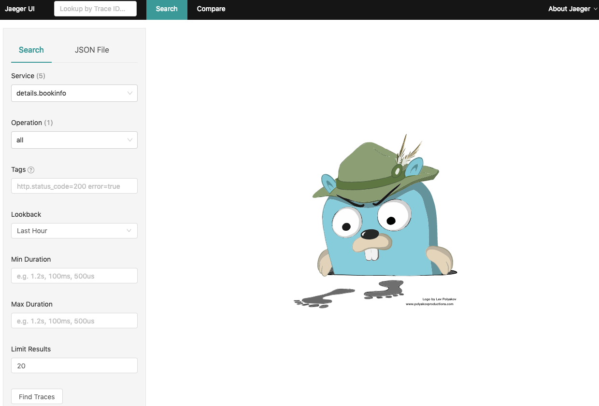
- 在 Jaeger 仪表板的左侧导航中，从 service 菜单中选择 productpage，然后单击底部的 Find Traces 按钮。将显示跟踪列表
	
	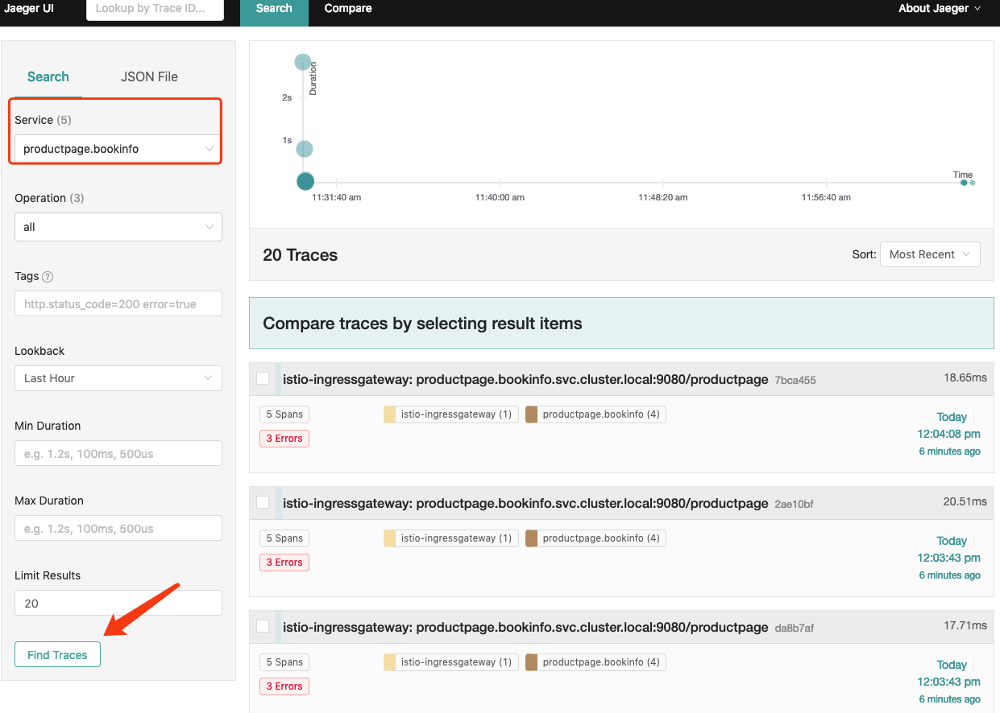
- 单击列表中的一个跟踪以打开该跟踪的详细视图。如果单击顶部（最近的）跟踪，则会看到与最新刷新对应的详细信息 /productpage

	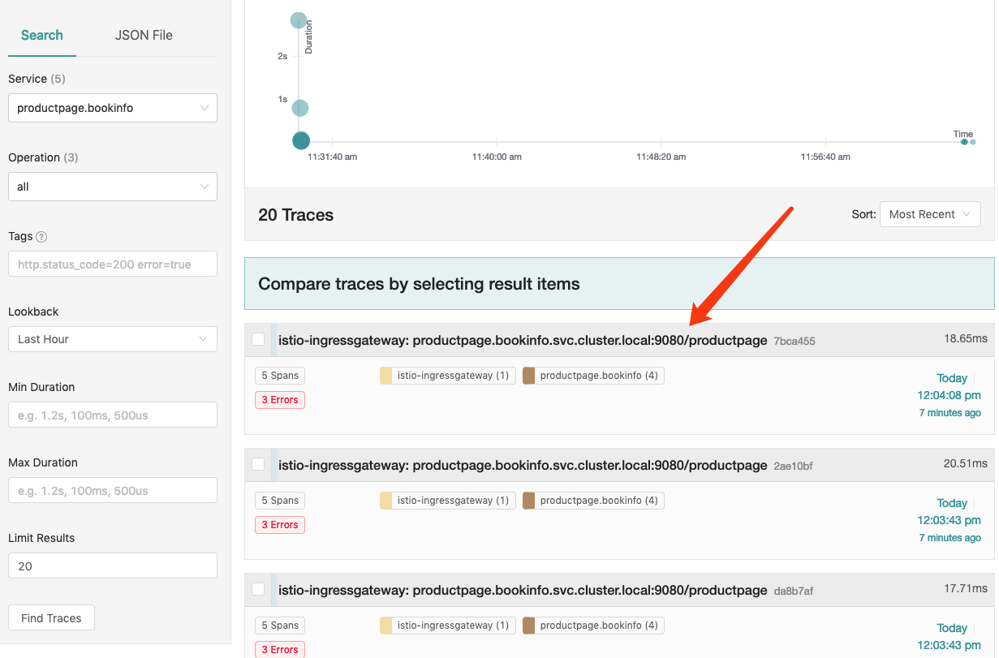
	
	
	上图中的跟踪由几个嵌套跨度组成，每个嵌套跨度对应于一个 Bookinfo 服务调用，所有这些都是为响应 /productpage 请求而执行的。
	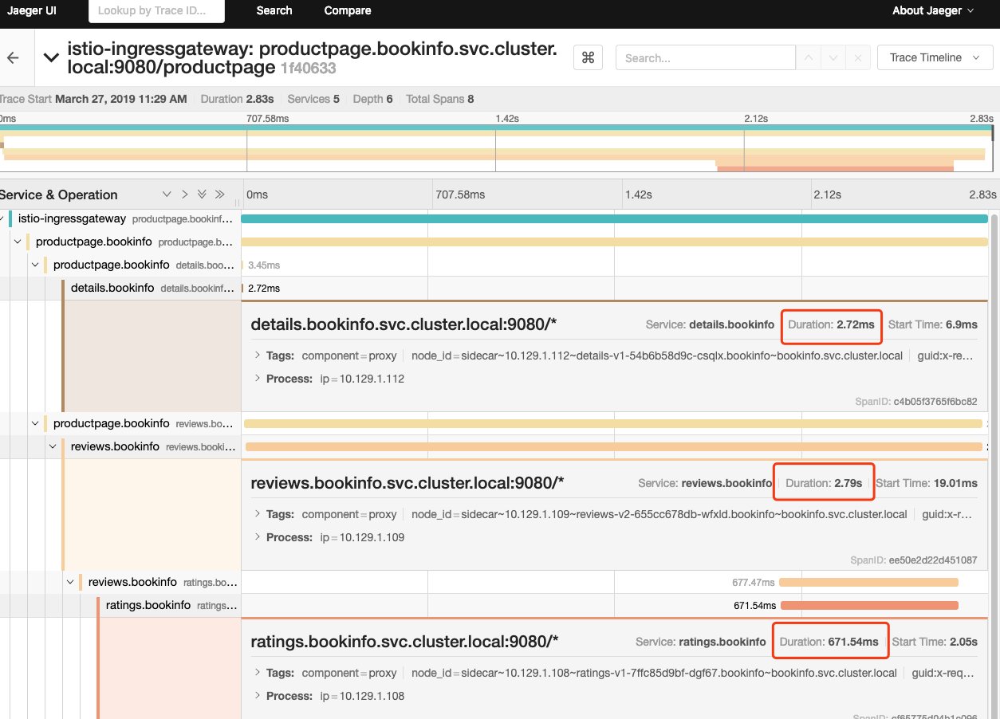
	
	- 整体处理时间为 2.83s
	- details 服务时间为 2.72ms
	- reviews 服务时间为 2.79s
	- ratings 服务时间为 617.54ms
	
	每个远程服务调用都由客户端和服务器端跨度表示。例如，
	
	1. 标记了客户端跨度的 details 信息 
	
			productpage details.myproject.svc.cluster.local:9080
	- 标记为嵌套在其下方对应于请求的服务器端处理的

			details details.myproject.svc.cluster.local:9080
	- 跟踪还显示对 istio-policy 的调用，它反映了 Istio 进行的授权检查。
- kiali 也集成了 Jaeger 也可以用来查询，方法相同

	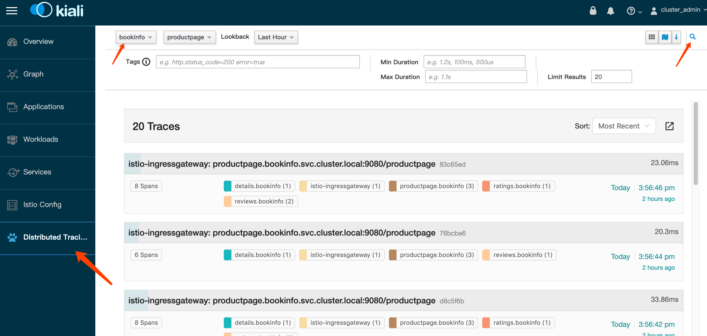

#### 2.4.3 其他追踪软件
文档里，除了 jaeger 还有 zipkin 和 LightStep [𝑥]PM 等软件， 因为功能相同，就不研究了。

### 2.5 可视化度量		
openshift istio 也是通过 grafana 来进行度量可视化的。Istio 仪表盘由三个主要部分组成：

- 网格摘要视图

	此部分提供网格的全局摘要视图，并在网格中显示 HTTP/gRPC 和 TCP 工作负载。

	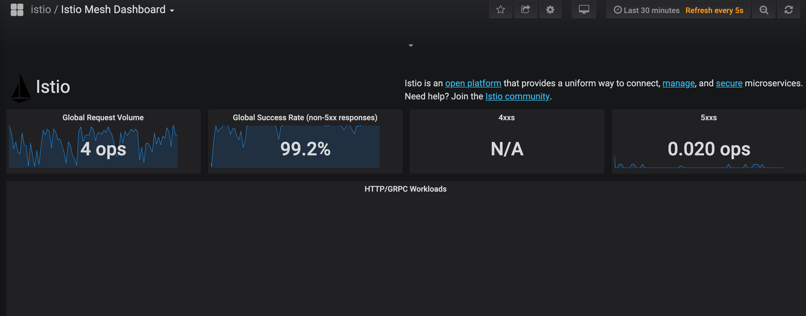
- 单个服务视图

	此部分提供有关网格中每个服务（HTTP/gRPC 和 TCP）的请求和响应的度量标准，同时还提供了有关此服务的客户端和服务工作负载的指标。

	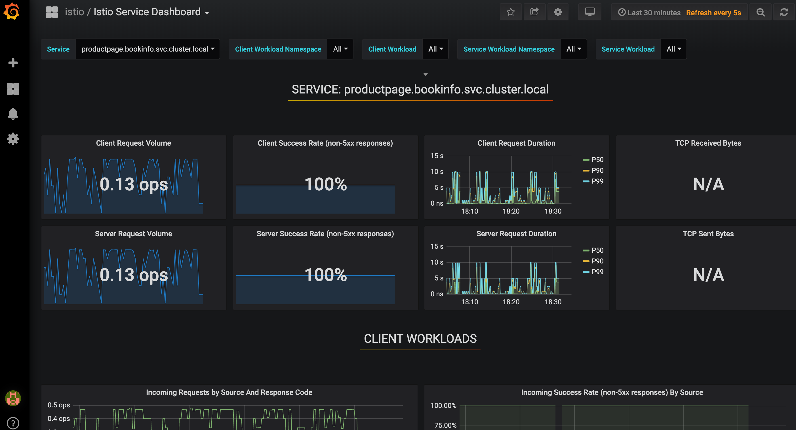
- 单个工作负载视图

	此部分提供有关网格内每个工作负载（HTTP/gRPC 和 TCP）的请求和响应的指标，同时还提供了有关此工作负载的入站工作负载和出站服务的指标		
		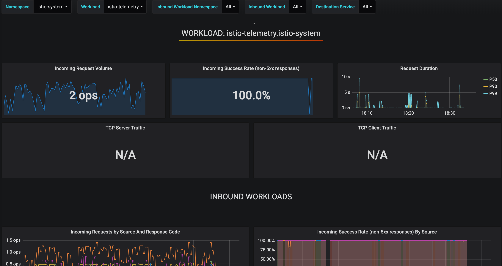
			
### 2.6 网格可视化
openshift istio 默认组件就带了 kiali ，这里会简单介绍 kiali 网格视图的使用。

- 登录 openshift 的 istio-system 项目查询 kiali 地址

	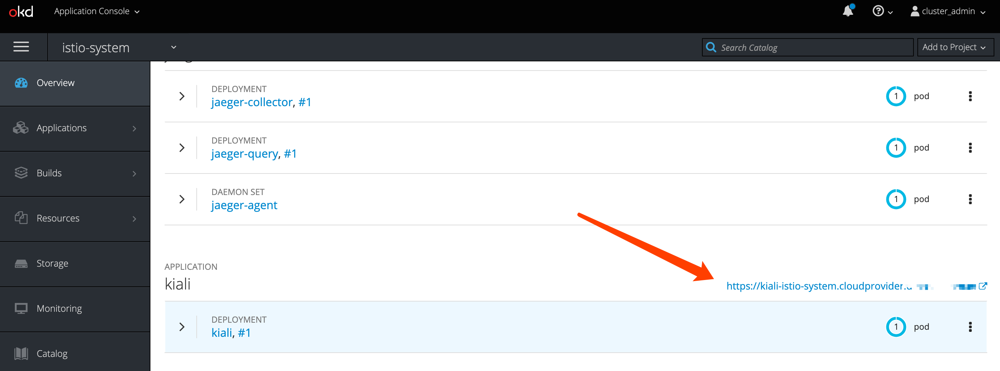
- 登录 kiali 主页，账户密码查询[安装文档](https://pangzheng.gitbook.io/memory/ji-shu/openshift/istio/she-qu-ban-openshiftistio-an-zhuang),登录后 Overview 页面中会显示网格里所有命名空间中的服务。

	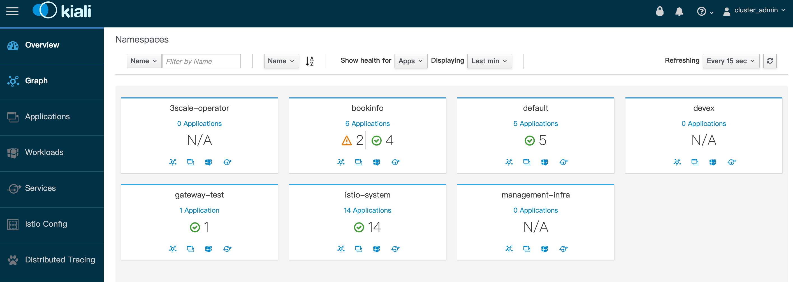
- 要查看指定命名空间的服务图，可以点击 Bookinfo 命名空间卡片，会显示类似的页面

	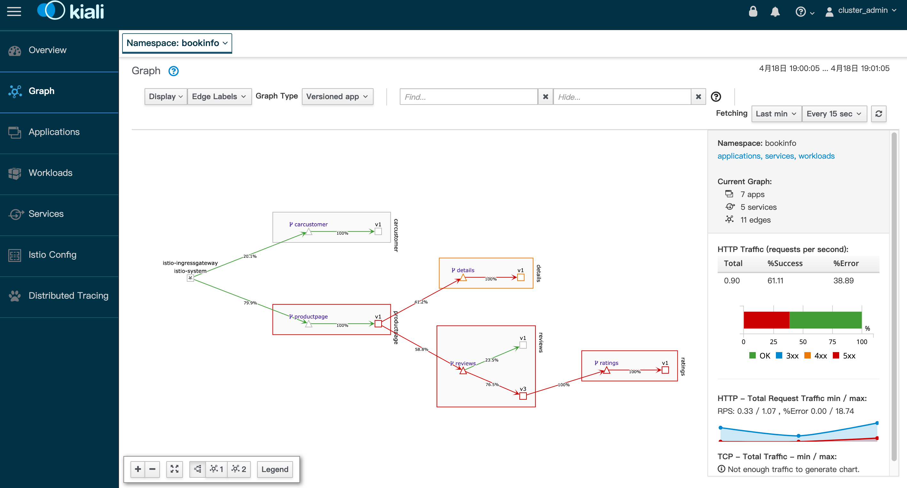
- 如果希望用不同的图形方式来查看服务网格，可以从 Graph Type 下拉菜单进行选择。有多种不同的图形类别可供挑选：
	- App 

		该模式会将同一应用的所有版本的数据聚合为单一的图形节点，下面的例子展示了一个 reviews 节点，其中包含三个版本的 Reviews 应用：		
		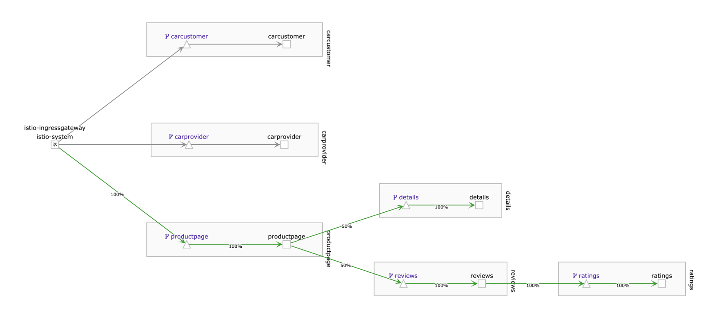
	- Versioned 

		App 类型会把一个 App 的每个版本都用一个节点来展示，但是一个应用的所有版本会被汇总在一起，下面的示例中显示了一个在分组框中的 reviews 服务，其中包含了两个节点，每个节点都代表 reviews 应用的一个版本
		
	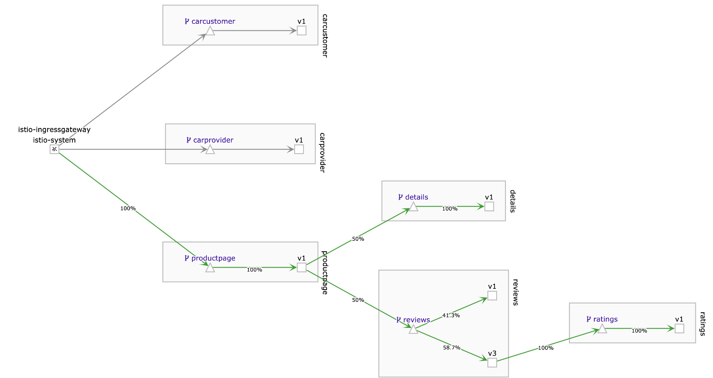
	
	- Workload 

		该模式图会将网格中的每个工作负载都呈现为一个节点。这种类型的图不需要读取工作负载的 app 和 version 标签。所以如果工作负载中没有这些标签，这种类型就是个合理选择了。
		
		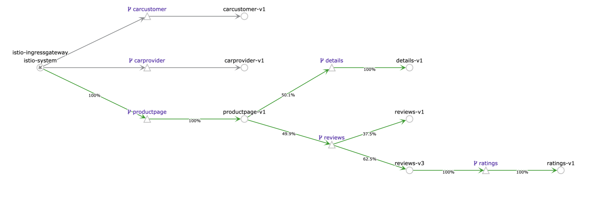
	
	- Service 

		该模式类型为网格中的每个服务生成一个节点，但是会排除所有的应用和工作负载。	
		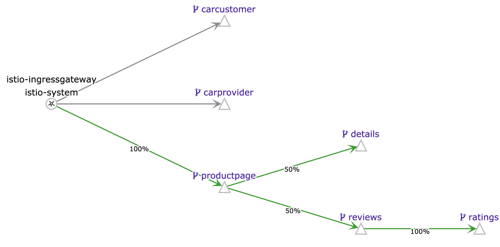

[Kiali API](https://www.kiali.io/api/) 提供了为服务图以及其它指标、健康状况以及配置信息生成 JSON 文件的能力。例如可以用浏览器打开 `$KIALI_URL/api/namespaces/bookinfo/graph?graphType=app`，会看到使用 JSON 格式表达的 app 类型的服务图,这样可以更好的进行二次开发嵌套使用。

Kiali API 的数据来自于 Prometheus 查询，并依赖于标准的 Istio 指标配置。它还需要调用 Kubernetes API 来获取关于服务方面的附加信息。为了获得 Kiali 的最佳体验，工作负载应该像 Bookinfo 一样使用 app 和 version 标签。

## 使用 Istio 网关配置 Ingress	
为 Gateway 在 HTTP 80 端口上配置流量		

## 删除BOOKINFO应用程序
完成 Bookinfo 应用程序后，可以通过运行清理脚本将其删除。本文档中的其他几个教程也使用Bookinfo应用程序。如果您打算继续使用其他教程，请不要运行清理脚本。

- 下载清理脚本

		$ curl -o cleanup.sh https://raw.githubusercontent.com/Maistra/bookinfo/master/cleanup.sh && chmod +x ./cleanup.sh

- 删除 Bookinfo 虚拟服务，网关，并通过运行清理脚本终止 pod

		$ ./cleanup.sh
		namespace ? [default] bookinfo
- 通过运行以下命令确认关闭

		$ oc get virtualservices -n bookinfo
		No resources found.
		
		$ oc get gateway -n bookinfo
		No resources found.
		
		$ oc get pods -n bookinfo
		No resources found.

## 参考
[istio-learning](https://github.com/cnych/istio-learning/blob/master/install/1.Docker%20for%20Mac%E5%AE%89%E8%A3%85istio.md)

[安装Red Hat OpenShift Service Mesh](https://github.com/pangzheng/BOOK/blob/master/%E6%8A%80%E6%9C%AF/openshift/3.11%E5%AE%98%E6%96%B9%E6%96%87%E6%A1%A3/%E6%9C%8D%E5%8A%A1%E7%BD%91%E6%A0%BC/%E5%AE%89%E8%A3%85Red%20Hat%20OpenShift%20Service%20Mesh.md)

[Istio 1.0学习笔记(三)：使用Istio对服务进行流量管理 - 配置请求路由](https://blog.frognew.com/2018/08/learning-istio-1.0-3.html#1%E5%B0%86%E8%AF%B7%E6%B1%82%E8%B7%AF%E7%94%B1%E5%88%B0%E5%9B%BA%E5%AE%9A%E7%89%88%E6%9C%AC%E7%9A%84%E6%9C%8D%E5%8A%A1%E4%B8%8A)

[istio 官方文档](https://istio.io/zh/docs/setup/kubernetes/install/kubernetes/)		
				