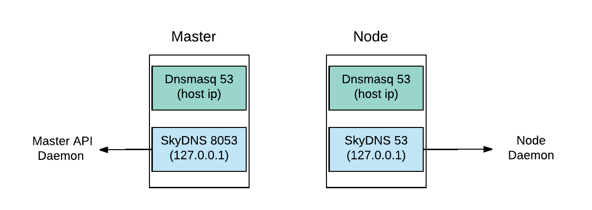
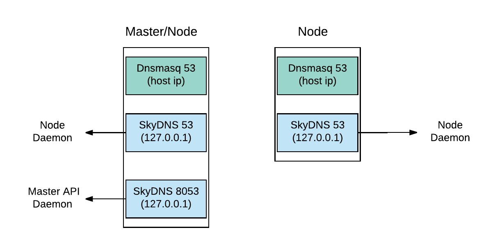
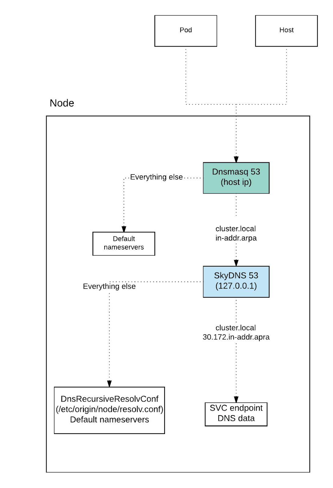
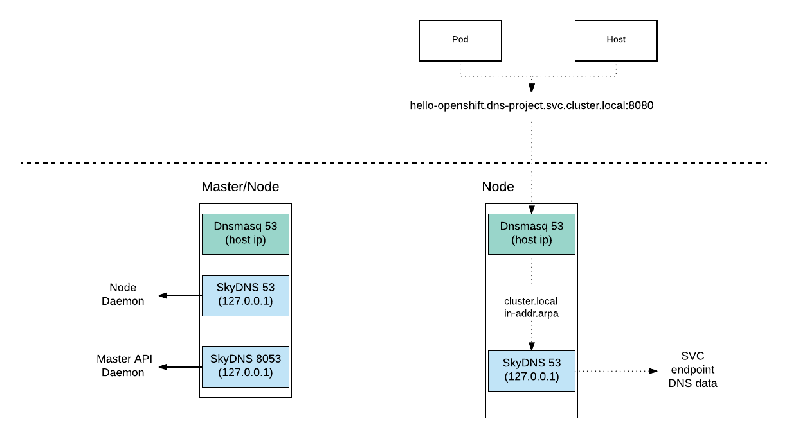

# openshift 中的 dns
翻译者

普罗-pangzheng@hotmail.com

[翻译取自](https://www.redhat.com/en/blog/red-hat-openshift-container-platform-dns-deep-dive-dns-changes-red-hat-openshift-container-platform-36)

关于 openshift 容器平台，有两个 dns 解析需要关注的地方：

- 外部 dns（openshift 之外）用于 master 内外部主机名通讯以及对 边缘网络设备对外通讯，包含 router 等。
- openshift 内部的 dns，用于东西流量服务之间的通讯。

这片文章主要讨论后者，它是基于[skyDNS](https://github.com/skynetservices/skydns)实现的。

出于展示目的，将会使用简单的 `hello openshift`，部署的方法内容如下:

		# 创建 dns 演示项目
		$ oc new-project dns-project
		
		# 部署 hello world pod
		$ curl https://raw.githubusercontent.com/openshift/origin/release-3.6/examples/hello-openshift/hello-pod.json|oc create -f -
		
		# 检查 svc
		$ oc get svc
		No resources found.
		
		# 查询演示 pod ip 地址 
		$ oc get pod -o wide
		NAME             READY     STATUS    RESTARTS   AGE              IP                NODE
		hello-openshift   1/1         Running             0            5s        10.130.2.13         XXXX
		
		$ curl 10.130.2.13:8080
		Hello OpenShift!
		
		# 用命令行获取 ip 并访问结果
		$ curl $(oc get pod hello-openshift --template '{{ .status.podIP}}):8080
		Hello OpenShift!
		
		# 创建 svc
		$ oc expose pod hello-openshift 
		service "hello-openshift" exposed
		
		$  oc get svc
		NAME              CLUSTER-IP     EXTERNAL-IP   PORT(S)    AGE
		hello-openshift   172.30.12.46   <none>
## 集群内部 dns ,我们为什么需要它？
为了回答这个问题，我们将使用一个简单的例子。其中会涉及到 vm(vmware 等) 应用程序之间通讯时，每个程序都是用 `guest` 虚拟机 ip 地址，这通常是不会更改的。但是在容器系统中，容器的 ip 地址会随着容器的生命周期随时变动。

编排容器工具 k8s 需要给容器一个静态 ip，k8s中的 `service` 对象因此而创建。`serivce` 对象具有主机名和 ip 地址双重访问途径。主机名是不会改变的，但是如果重新创建 `service` 对象，ip 地址仍然会改变。使用 `service` 的主机名提供给应用程序使用的话，依然可以实现 pod 之间的内部稳定通讯。

由于 service ip 可以更改，因此我们不希望在应用程序或者 `DeploymentConfig` 环境中指定静态的 ip 地址。如果在没有通知应用程序团队的情况下重新创建了 `service` 对象，会发生什么？画面太美不敢想。

出于以上的原因，我们通常使用主机名来避免在应用程序中使用硬编码的 ip 地址。 openshift 容器平台中的内部 dns 提供了此功能。它是动态的 dns，因此无论何时重新创建 `service` 对象， dns 仍会提供服务，将地址解析到新的 ip 上。使用该功能，每个 `service` 对象必须具有唯一且动态的 `service` ip 地址，主机名格式具有特定格式，参考 [openshift dns](https://docs.openshift.com/container-platform/3.6/architecture/networking/networking.html#architecture-additional-concepts-openshift-dns)。
### 检查 pod ip 和 service ip /主机名

		# 检查 service ip
		$ oc get svc
		NAME       CLUSTER-IP       EXTERNAL-IP   PORT(S)   AGE
		hello-openshift   172.30.12.46     <none>        8080/TCP   7s
		
		$  dig hello-openshift.dns-project.svc.cluster.local
		
		;; QUESTION SECTION:
		;hello-openshift.dns-project.svc.cluster.local. IN A
		
		;; ANSWER SECTION:
		hello-openshift.dns-project.svc.cluster.local. 30 IN A 172.30.12.46
		
		;; Query time: 1 msec
		;; SERVER: 10.10.181.97#53(10.10.181.97)
		;; WHEN: Mon Oct 30 15:56:58 EDT 2017
		;; MSG SIZE  rcvd: 79
		
		
		# 使用 serivce ip 访问 pod
		# 另一个应用程序可以访问 hello openshift 应用可以使用 service ip   
		$ curl 172.30.12.46:8080
		Hello OpenShift!
		
		
		# 使用 service 主机名访问 pod
		# 除了使用 service ip 外，还可以使用主机名访问
		
		$ curl hello-openshift.dns-project.svc.cluster.local:8080
		
		Hello OpenShift!
	
## 内部 dns 到底在哪里？
- dnsmasq 现在是强制性部署
- skydns 在 master 和 node 都运行
	- master 运行端口是 8053
	- node 运行端口是 53
	- 监听 ip 都是 `127.0.0.1`
- dnsmasq 将 cluster.local和in-addr.arpa 查询路由全部转发到 127.0.0.1:53

### master 和 node 独立部署

### master和 node 混合部署
 

### 守护进程和端口映射
根据 <master和 node 混合部署>, master 服务器上有三个 dns 守护进程。分别是

- master-skydns:0.0.0.0:8053
- node-skydns:127.0.0.1:53
- dnsmasq:非 0.0 和 127 的网段监听 53，程序真实 dns 接口

		# Show daemons that listen on *53
		# netstat -tnlp|grep 53
			tcp        0      0 127.0.0.1:53            0.0.0.0:*               LISTEN      2120/openshift
			tcp        0      0 10.130.0.1:53           0.0.0.0:*               LISTEN      1341/dnsmasq
			tcp        0      0 172.17.0.1:53           0.0.0.0:*               LISTEN      1341/dnsmasq
			tcp        0      0 0.0.0.0:8053            0.0.0.0:*               LISTEN      1746/openshift
			tcp        0      0 192.168.1.237:53        0.0.0.0:*               LISTEN      1341/dnsmasq      
					….
		
		# Show process names that use *53 ports
		# ps -ef|grep openshift
		# ps -ef|grep openshift
		root      1746     1 10 8月14 ?       01:54:45 /usr/bin/openshift start master api --config=/etc/origin/master/master-config.yaml --loglevel=2 --listen=https://0.0.0.0:8443 --master=https://master237.dmos.dataman:8443
		root      2120     1 10 8月14 ?       01:58:38 /usr/bin/openshift start node --config=/etc/origin/node/node-config.yaml --loglevel=2

### dnsmasq 调度 nameserver
这么多的 dns 服务，都是通过 dnsmasq 负责将如 pod 内的查询分派给正确的 dns 服务器。dnsmasq 会将查询 `cluster.local` 的解析全部转发到 `127.0.0.1:53`上，所有的 skydns 在都会在节点服务器上监听。另外，如果它查询了 `in-addr.arpa` 反向解析，也会返回相对应的主机名。从 dnsmasq 的配置文件中，可以看到它将包含 `cluster.local`和 `in-addr.arpa` 查询全部转发到 `127.0.0.1:53`

		# grep . /etc/dnsmasq.d/*
		/etc/dnsmasq.d/node-dnsmasq.conf:server=/in-addr.arpa/127.0.0.1
		/etc/dnsmasq.d/node-dnsmasq.conf:server=/cluster.local/127.0.0.1
		/etc/dnsmasq.d/origin-dns.conf:no-resolv
		/etc/dnsmasq.d/origin-dns.conf:domain-needed
		/etc/dnsmasq.d/origin-dns.conf:no-negcache
		/etc/dnsmasq.d/origin-dns.conf:max-cache-ttl=1
		/etc/dnsmasq.d/origin-dns.conf:enable-dbus
		/etc/dnsmasq.d/origin-dns.conf:bind-interfaces
		/etc/dnsmasq.d/origin-dns.conf:listen-address=10.10.181.97 # default route interface IP
		/etc/dnsmasq.d/origin-upstream-dns.conf:server=10.10.182.21 # original name server IP
		
		# # Check if *.cluster.local can be resolved
		# dig hello-openshift.dns-project.svc.cluster.local
		
		;; QUESTION SECTION:
		;hello-openshift.dns-project.svc.cluster.local. IN A
		
		;; ANSWER SECTION:
		hello-openshift.dns-project.svc.cluster.local. 30 IN A 172.30.12.46
		
		;; Query time: 1 msec
		;; SERVER: 10.10.181.97#53(10.10.181.97)
		
		# # Check if *.in-addr.arpa  can be resolved
		#  dig -x 172.30.12.46
		
		;; QUESTION SECTION:
		;46.12.30.172.in-addr.arpa. IN PTR
		
		;; ANSWER SECTION:
		46.12.30.172.in-addr.arpa. 30 IN PTR hello-openshift.dns-project.svc.cluster.local.
		
		;; Query time: 1 msec
		;; SERVER: 10.10.181.97#53(10.10.181.97)
### NetworkManager与Dnsmasq
NetworkManager 调用 `99-origin-dns.sh` 脚本复制 NetworkManager 的 `dns=dnsmasq`。有了这个脚本，它使默认路由 ip 到 dnsmasq 监听 ip。容器使用此 ip 作为默认 dns 服务器。

`99-origin-dns.sh` 在 journald 的日志在单元 `NetworkManager-dispatcher` 中。这个调用脚本:

- 创建了 dnsmasq 的配置文件
	- node-dnsmasq.conf
	- origin-dns.conf
	- origin-upstream-dns.conf
- NetworkManager 启动时，默认启动 dnsmasq 守护进程。
- 将宿主机的默认路由 ip 设置为 dnsmasq 监听 ip
- 使用 host 默认路由 ip 更新 `/etc/resolv.conf`
- 创建 `/etc/origin/node/resolv.conf`  

### DNS 查询流方法

### DNS 查询流
请注意这个流程中，无需从 master 获取 svc dns 数据

### 使用 tcpdump 调试 dns 流
测试环境

- master 节点
	- ip 10.10.181.97
	- hostname:dhcp181-97.gsslab.example.com 
- node 节点
	- ip 10.10.181.96
	- hostname:dhcp181-96.gsslab.example.com 
- skydns
	- ip:127.0.0.1 
- 上游 dns 服务器
	- ip: 10.10.182.21

## 在 node 服务器上执行 dump 命令

	$ tcpdump -xx -vvvv -s 0 -l -n -i any port 53 -w test.pcap
### 场景1，从一个 node 节点解析 master 主机名
节点查询查询将转发到上游 dns 服务器

	# 命令行
	$ dig dhcp181-97.gsslab.example.com
	
	# dump 结果
	1 10.10.181.196   10.10.181.196  DNS  … dhcp181-97.gsslab.example.com OPT
	2 10.10.181.196   10.10.182.21   DNS ... dhcp181-97.gsslab.example.com OPT
	3 10.10.182.21    10.10.181.196   DNS ...  dhcp181-97.gsslab.example.com A 10.10.181.97 NS ns01.xxx.redhat.com NS ns02.xxx.redhat.com A x.x.x.x A x.x.x.x OPT
	4 10.10.181.196   10.10.181.196   DNS dhcp181-97.gsslab.example.com A 10.10.181.97 NS ns01.xxx.redhat.com NS ns02.xxx.redhat.com A x.x.x.x A x.x.x.x OPT
### 场景2.从一个 node 节点解析 svc 主机名

	# Command 
	$ dig  hello-openshift.dns-project.svc.cluster.local
	
	# dump 结果
	
	1 10.10.181.196 10.10.181.196DNS hello-openshift.dns-project.svc.cluster.local OPT
	2 127.0.0.1            127.0.0.1     DNS hello-openshift.dns-project.svc.cluster.local OPT
	3 127.0.0.1            127.0.0.1     DNS hello-openshift.dns-project.svc.cluster.local A 172.30.12.46
	4 10.10.181.196 10.10.181.196DNS hello-openshift.dns-project.svc.cluster.local A 172.30.12.46
### 场景3.从一个 node 内部的 docker 容器内部解析 svc 

		# 命令行进入容器内部解析 svc
		sh-4.2# ip a
		   ….
		   inet 10.131.2.17/23 scope global eth0
		  ...
		
		sh-4.2# dig  hello-openshift.dns-project.svc.cluster.local
		
		# Result
		1 10.131.2.17   10.10.181.196   DNS Standard query A hello-openshift.dns-project.svc.cluster.local OPT
		2 10.131.2.17   10.10.181.196   DNS Standard query A hello-openshift.dns-project.svc.cluster.local OPT
		3 127.0.0.1     127.0.0.1       DNS Standard query A hello-openshift.dns-project.svc.cluster.local OPT
		4 127.0.0.1     127.0.0.1       DNS Standard query response A hello-openshift.dns-project.svc.cluster.local A 172.30.12.46
		5 10.10.181.196 10.131.2.17     DNS Standard query response A hello-openshift.dns-project.svc.cluster.local A 172.30.12.46
		6 10.10.181.196 10.131.2.17     DNS Standard query response A hello-openshift.dns-project.svc.cluster.local A 172.30.12.46

