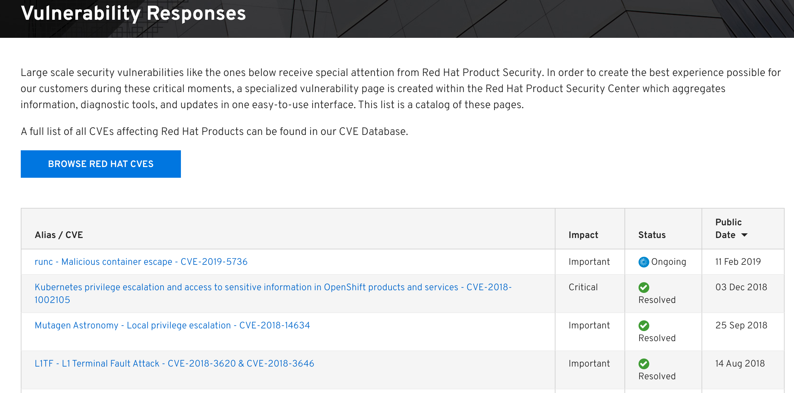
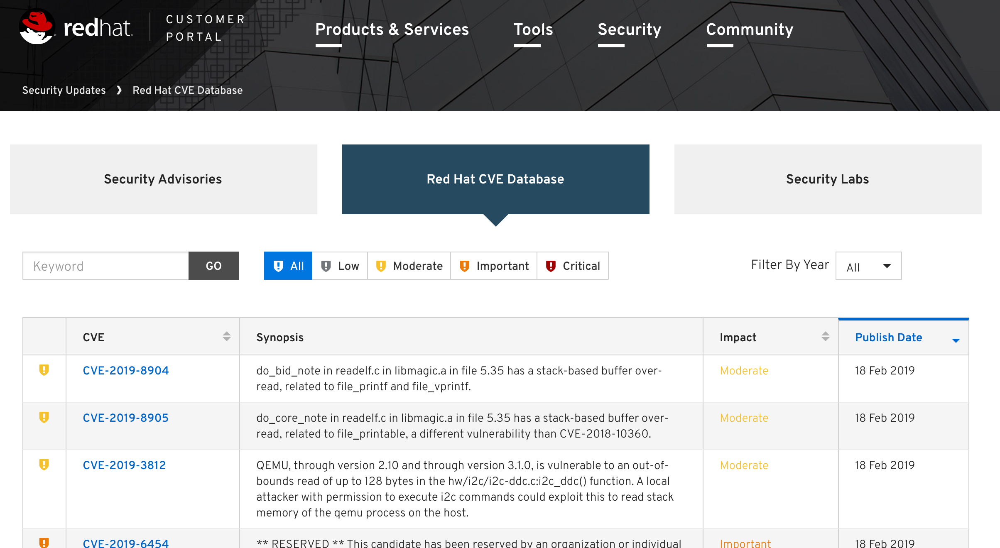
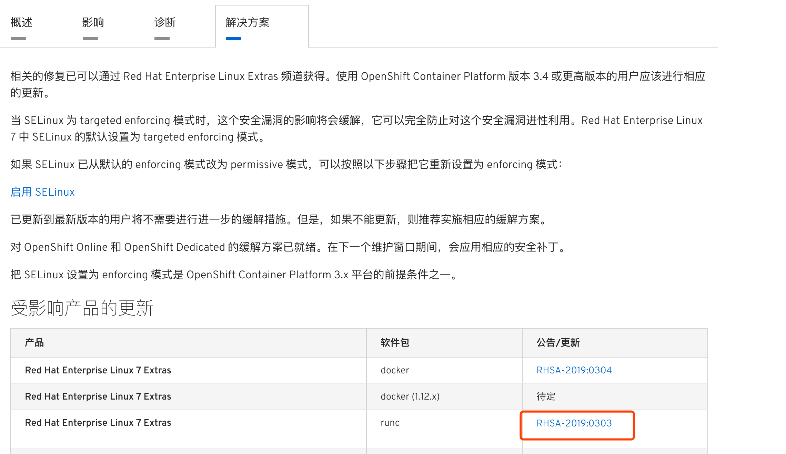

# openshift的漏洞修复流程(参见CVE-2019-5736)
kubernetes 和 docker 是一直在高速进化的技术，当然 docker 未来可能被 runc 代替掉，但是现在依然是大部分容器使用的底层引擎。 openshift 是红帽出的一款使用 kubernetes + docker 作为引擎的企业级 paas 平台。并且有一个开源版本，叫 okr 。因为迭代很快，所以出bug或者漏洞也在清理之中，那么 kuberentes 一般都会去社区寻找答案，而 openshift 虽然也可以，但是因为是企业版，所以一般修复的方案可以参考红帽企业版的资料。比如这次的 CVE-2019-5736 漏洞。

这次就用 CVE-2019-5736 漏洞来看下应该如何查找 openshift 可能的漏洞和修复。

## 问题发现
这次 CVE-2019-5736 漏洞是通过网络曝出的，但一般的问题基本上会在使用中出现。
## 找寻解决办法的地方
因为这次是安全事件，所以可以在以下两个地址查询，当然 google 搜索出来的

- [Vulnerability Responses](https://access.redhat.com/security/vulnerabilities)

	
	这里感觉是概览，可以链接到下面搜索，可以看见问题的列表，包含问题名称、重要等级、状态和发布时间
	
	
- [Red Hat CVE Database](https://access.redhat.com/security/security-updates/#/cve)

	
	这里是详细的数据存储，可以按照各种条件进行搜索，比如按照危险等级搜索

## 处理步骤
用 `Vulnerability Responses` 来做例子

- 找到问题点击进入详情页面

		runc - Malicious container escape - CVE-2019-5736
- 详情页面使用
	- 可以点击查看中文信息
	- 分为四大块
		- 概述

			通过这里了解问题情况
		- 影响

			通过这里了解影响
		- 诊断

			这里最重要，问题要解决需要先查找是否系统有问题，通过问题复现或者检查脚本。这个漏洞给出的是检测脚本。
			
			- 可公网链接节点
				- 进入测试集群服务器
				- 下载脚本
				- 执行(root 权限)
					- 注意因为是root执行，所以需要反复确认脚本安全性，可以使用签名验证
						- 没有问题的检测 

								# sh cve-2019-5736--2019-02-11-1257.sh
								
								This script (v1.0) is primarily designed to detect CVE-2019-5736 on supported
								Red Hat Enterprise Linux systems and kernel packages.
								Result may be inaccurate for other RPM based systems.
								
								Detected 'runc' package: runc-1.0.0-57.dev.git2abd837.el7.centos.x86_64
								Detected 'docker' package: docker-1.13.1-75.git8633870.el7.centos.x86_64
								Detected 'docker-latest' package:
								SELinux mode: enforcing
								SELinux policy: targeted
								
								'runc' package is NOT vulnerable
								'docker' package is NOT vulnerable
								There are NO vulnerable packages installed.
								
								For more information about the vulnerability see:
								https://access.redhat.com/security/vulnerabilities/runcescape
						- 有问题的检测报告

								# sh cve-2019-5736--2019-02-11-1257.sh
								
								This script (v1.0) is primarily designed to detect CVE-2019-5736 on supported
								Red Hat Enterprise Linux systems and kernel packages.
								Result may be inaccurate for other RPM based systems.
								
								Detected 'runc' package: runc-1.0.0-52.dev.git70ca035.el7_5.x86_64
								Detected 'docker' package: docker-1.13.1-75.git8633870.el7.centos.x86_64
								Detected 'docker-latest' package:
								SELinux mode: enforcing
								SELinux policy: targeted
								
								'runc' package is vulnerable   <- 这里
								'docker' package is NOT vulnerable
								Vulnerability is mitigated by SELinux and cannot be exploited.
								
								For more information about the vulnerability see:
								https://access.redhat.com/security/vulnerabilities/runcescape		
		- 解决方案
		
			按照报告给出的结果，在这里找到问题解决方案，上面的提示我们检测出的问题是 runc 有问题，但是因为强制开启了 SELinux,所以不会受到影响。并且这里我们使用的是 docker ，并没有使用 runc，所以也不会有影响。但是为了验证解决方案，这里还是进行了修复测试。
			
			点击这里
			
			 
			
			这里可以看到红帽内部对于这个问题修复编号 `BZ - 1664908`，可以点击进入查看具体的修复方法。这里就不需要详细查看了，点击升级包，查看升级包的版本，注意这里对应企业版和社区版升级包是一致的，一般重大问题社区版也会更新。小问题麽，你懂的。
			
			这里看到的 runc 的升级版本是 `runc-1.0.0-59.dev.git2abd837.el7.x86_64`，对比检查脚本的版本 `runc-1.0.0-52.dev.git70ca035.el7_5.x86_64`，明显版本更新了。
		- 升级
			- 继续登陆测试集群节点主机
			- 执行 yum install

					# yum install runc
					已加载插件：fastestmirror
					......
					--> 正在检查事务
					---> 软件包 runc.x86_64.0.1.0.0-57.dev.git2abd837.el7.centos 将被 升级
					---> 软件包 runc.x86_64.0.1.0.0-59.dev.git2abd837.el7.centos 将被 更新
					--> 解决依赖关系完成
					
					依赖关系解决
					
					==================================================================================================================================================================================
					 Package                           架构                                版本                                                             源                                   大小
					==================================================================================================================================================================================
					正在更新:
					 runc                              x86_64                              1.0.0-59.dev.git2abd837.el7.centos                               extras                              2.9 M
					
					事务概要
					==================================================================================================================================================================================
					....
			- 点安装即可升级
				- 注意1

					我们因为没有使用 runc 作为容器运行时环境，所以不会有影响。如果问题出的是 docker ,那么升级之前，请将该节点的服务迁移到其他节点，已避免服务收到影响。
				- 注意2

					如果是线下服务器，请下载 rpm ，并升级自己的线下服务器安装源。
			- 升级完成后检查
			
				升级完成后，再使用检查脚本进行检查，会发现问题已经修复。
				
## 希望可以帮助，本章完								

				
			
			

