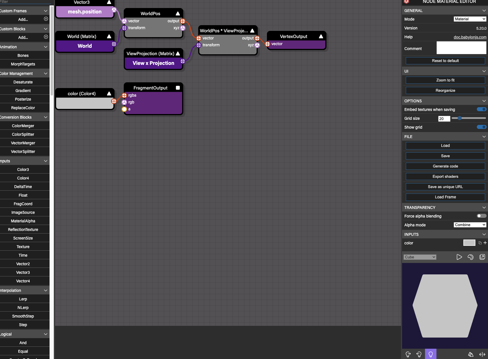

# [babylon 工具集](https://doc.babylonjs.com/toolsAndResources/tools)
本节包含有关 Babylon.js 中丰富工具箱的信息。无论是调试您的场景与检查器，或创建高级材料轻松使用节点材料编辑器，以及之间的一切，这一节有一切你可以想要知道的奇妙的工具，使您的开发过程更容易和更有趣。

### [Playground](https://playground.babylonjs.com/)
Playground 是 Babylon.js WebGL 3D 场景的实时编辑器。官方给出了很多 demo 的代码，并且可以实时查看

在 Playground 中试验和更改任何代码并单击 Run 按钮不会影响您当前使用的 Playground 中的任何原始代码。

可以使用 JavaScript 或 Typescript 编写代码。Playground 软件在渲染之前在后台将代码编译为 JavaScript。

本例中有很合格的 FPS 和载入场景，可以用来参考

#### 学习手册
[界面学习文档](https://doc.babylonjs.com/toolsAndResources/tools/playground)

### [Sandbox+inspect](https://sandbox.babylonjs.com/)(检查器)
Babylon.js 检查器是一个可视化调试工具，旨在帮助查明您在场景中可能遇到的问题。

可以达到完全的效果，[例子](https://www.babylonjs-playground.com/full.html#10D6YT#176)

检查员提供了多种工具，例如：

- 场景的分层视图
- 多个属性网格，让您动态更改对象属性
- 特定的助手，如骨架查看器等。

它的界面使用两个窗格：

- 场景资源管理器窗格
- 检查器窗格

#### 学习手册
[界面学习文档](https://doc.babylonjs.com/toolsAndResources/tools/inspector)

### 整合在 inspect 内的系统
#### [粒子编辑器](https://sandbox.babylonjs.com/)
Babylon.js 有一个功能丰富、强大的粒子编辑器。使利用这个强大的系统变得简单易行。内置于Inspector中，创建粒子系统现在就像右键单击一样简单！
##### 学习手册	
[界面学习文档](https://doc.babylonjs.com/toolsAndResources/tools/particleEditor)
#### [精灵编辑器](https://sandbox.babylonjs.com/)
Babylon.js 有一个包含许多特性和组件的精灵系统。Babylon.js 4.2 引入了一个新工具，使利用这个强大的系统变得简单易行。Babylon.js 精灵编辑器。内置于Inspector中，创建精灵管理器和控制精灵现在就像右键单击一样简单！
##### 学习手册	
 [界面学习文档](https://doc.babylonjs.com/toolsAndResources/tools/spriteEditor)
#### [动画曲线编辑器](https://sandbox.babylonjs.com/)
在 Babylon.js 5.0 中引入的动画曲线编辑器（简称 ACE）是一个强大的工具，它允许您在一个简单、有趣和直观的编辑器中创建和修改动画。内置于Inspector中。
##### 学习手册
[界面学习文档](https://doc.babylonjs.com/toolsAndResources/tools/animationCurveEditor)
#### [纹理检查器](https://sandbox.babylonjs.com/)
纹理检查器旨在使您能够在巴比伦内部调试纹理。用户经常加载纹理并发现它们没有按预期显示。意外结果可能与透明度、UV 或独特的纹理类型（如立方体贴图）有关。纹理检查器允许您调查问题，甚至在引擎中修复它们。
##### 学习手册
[界面学习文档](https://doc.babylonjs.com/toolsAndResources/tools/textureInspector)
#### [骨架检查器](https://sandbox.babylonjs.com/)
 Skeleton Viewer 内置于Inspector中，从渲染骨骼和关节，到可视化皮肤权重，Skeleton Viewer 确保可以快速轻松地调试场景中令人讨厌的装配问题
##### 学习手册
[界面学习文档](https://doc.babylonjs.com/toolsAndResources/tools/skeletonViewer)
#### [性能分析器](https://sandbox.babylonjs.com/)
在 Babylon.js 5.0 中引入的 Performance Profiler 是一个出色的可视化性能调试工具。随着您开发巴比伦体验，这个新工具可以帮助您轻松识别场景中的性能问题和小问题。
##### 学习手册
[界面学习文档](https://doc.babylonjs.com/toolsAndResources/tools/performanceProfiler)

### [gui.babylonjs.com](https://gui.babylonjs.com/)
在 Babylon.js 5.0 中引入的 GUI 编辑器是一个可视化编辑器，用于构建复杂而美观的图形用户界面。传统上，Babylon GUI 必须使用代码构建，这可能是一个乏味且令人困惑的过程。GUI 编辑器可让您在组装界面时查看界面，并可以轻松操作每个控件的所有参数。GUI 编辑器也可以在检查器的弹出窗口中打开，允许您在场景中编辑 GUI 并立即看到您的更改传播回来！

- [界面学习文档](https://doc.babylonjs.com/toolsAndResources/tools/guiEditor)
- [学习文档详情](https://doc.babylonjs.com/divingDeeper/gui/gui)

### [Node Material Editor](https://nme.babylonjs.com/)

Node Material Editor 编辑器、真正跨平台的 babylon 原生应用部署体验、层叠阴影、导航寻路、更强的 WebXR 虚拟现实及增强现实支持、更完美的 glTF 格式支持等新功能。

Node Material Editor 是一个强大而易用的材质编辑器，它以可视化的拖拽节点的方式来模拟 shader 编程，从而为每个从业者解锁了 GPU 的强大威力。从前，shaders (GPU 编程) 着色器编程对于普通程序员门槛很高，因为它过于偏向底层，虽然功能强大，但是晦涩难懂，而 Babylon 的 Node Material Editor可以实现与 shader 同样的效果，但是界面化操作，把难度降到了最低。让所有人都能使用这个编辑器来创建令人惊叹的视觉效果

- 材质节点

	
- 材质点

	

#### 学习手册
- [界面学习文档](https://doc.babylonjs.com/toolsAndResources/tools/nme)
- [学习文档详情]((https://doc.babylonjs.com/divingDeeper/materials/node_material/nodeMaterial))
	
### [Babylon Native](https://github.com/BabylonJS/BabylonNative) 
NATIVE 跨平台原生应用部署，它可以用原有的Babylon.js代码在任意平台构建一个原生应用，充分释放本机设备的性能优势。 已经支持DirectX on Windows、 Metal on iOS/MacOS、 OpenGL on Android，即将推出Vulkan支持。

Babylonjs 的原生打包部署是通过 react native 技术体系来实现的，这样就可以实现一份代码原生部署，同时保证原生性能。

- 跨平台原生 app

	使用 Babylon Native，你只需要编写一次代码，就能在网站和各种原生应用程序中重复执行，只需要用 JavaScript 编写代码，Babylon Native 的解释器就能把它运行在各种平台的图形API上（已经支持DirectX on Windows、 Metal on iOS/MacOS、 OpenGL on Android，即将推出Vulkan支持）。
- 使用所有功能

	使用 Babylon.js 编写的代码能够在 Babylon Native 中得到重用，这意味着 Babylon.js 所有的丰富功能都能在你的原生 app 或应用程序中开箱即用，包括：最新的 Physically Based Rendering (PBR)，动画，粒子系统，物理引擎。它还带来了一致性的 glTF 格式的3d文件渲染使用，让其在各个平台上的展示保持一致性、向后兼容性，
- 可优化安装包体积

	如果软件的安装包过大，会让它的推广使用遇到一些困难。例如在手机上通过应用程序商店下载 app 时，对于体积很大 app 用户总会收到的一个警告。而全功能的 Babylon.js 引擎是建立在 Web 之上的，它融入了 ES6 先进的包管理思想，你能按需安装使用到的功能，进而优化安装包的体积，Babylon Native 也继承了这个特性，所以你也可以优化自己的app安装包大小。
- 选择自己的 UI

	你可以在应用程序中自由选择使用任何 UI 技术，Babylon.js 附带一部分的UI功能，这些UI功能也是用 WebGL 实现，特别是用于VR、AR及其他方面的3D UI，它们也可以用在 Babylon Native 里。而 Babylon Native 不打算包含 HTML DOM 的 UI 实现，因此根据你的业务需求，可能还要结合其他的 UI 技术一起使用，例如React Native或原生UI。
- [体验XR功能](https://doc.babylonjs.com/how_to/introduction_to_webxr)

	由于层出不穷的创新应用、移动端支持以及呼之欲出的WebXR标准，增强现实AR、混合现实MR和虚拟现实VR的应用案例越来越多。Babylon Native 提供了一个强大的平台来构建这些创新性的应用，由于只使用 JavaScript和Babylon.js 引擎来开发，一次代码编程，任意平台使用，所以使得大量开发人员和内容生产者受益。Babylon Native原生应用部署的特性，使得 WedXR 功能可以超越 Web 的限制，直达你的手机App来构建一个AR应用程序。	
- [积极友善的开源社区](https://forum.babylonjs.com/)

	Babylon Native是Babylon.js家族的成员之一，所以它也继承了Babylon活跃而友善的开源社区，在社区里，大家相互扶持，共同钻研，创造出了一个又一个令人惊叹的应用案例。当你即将开启Babylon.js和Babylon Native之旅时，这群充满激情的小伙伴已经开始摩拳擦掌，随时准备好回答你提出的任何问题。	

### [批量托管和导航寻路](https://doc.babylonjs.com/extensions/navigationmesh)
Navigation Mesh system，导航寻路网格系统，它非常强大有趣，但是又那么简单易用。这个功能基于强大的开源库 Recast Navigation 并进行了深度改造，能够在你的游戏或互动场景中很简单的创造出更加真实的'AI非玩家角色'，我们只需要把物体进行代理托管，并设置导航网格参数，然后那些被托管的物体就会在定义好的导航网格内进行随机移动，就像 demo 中的鱼儿那样，它们在水中自由的游动，所以导航寻路在'AI非玩家角色'和运动路径查找方面非常有用，而且导航寻路在某些场景甚至可以取代物理碰撞检测，例如把某一个玩家限制在可以活动的区域内

### [支持 WebXR](https://doc.babylonjs.com/how_to/introduction_to_webxr) 
支持先进的WEBXR技术。毫无疑问，在web使用AR/VR技术非常有前景，Babylon最新版本在 WebXR 上做了进一步的优化和改进：带来了一个简单易用的体检帮助器，针对更高级用户的专用会话管理器，用 babylon 的相机功能来承载 WebXR 技术，全面支持任何接受 WebXR 会话的设备，完整的WebXR输入源支持，关于实验性AR功能、通信、场景交互、物理效果的整套API支持等。 

### editor.babylonjs.com
编辑器是一个社区项目，主要由 Julien Moreau-Mathis ( @luaacro ) 维护。强大的编辑器，这是 threejs 跟 playcanvas 无法比拟的,编辑器中，对粒子、碰撞、脚本、GUI、精灵图等等各方面功能集成得非常完善

- [基础学习](https://doc.babylonjs.com/extensions/editor)

## 资源库相关
一系列用于纹理、模型等的库，可加载到 Playground 中。这些可以帮助您说明您可能遇到的问题，而无需找到 COR 可接受的服务器来将您自己的资产加载到 Playground 中。还有一系列使用各种着色器构建的可编程纹理和材质。
### [大型资料库](https://github.com/BabylonJS/Assets.git)
Babylon.js 提供了一个包含免费模型、环境、纹理、材质、粒子、声音等的大型资源库。这些资源在 [Creative Commons 0](https://creativecommons.org/share-your-work/public-domain/cc0/)许可下免费供您使用。

在 Babaylon.js 5.0 中引入的 Asset Librarian 是一个非常简单的工具，允许您通过简单的代码行直接在 Playground 中访问这个完整的内容库。

### 分类 
- [网格库](https://doc.babylonjs.com/toolsAndResources/assetLibraries/availableMeshes)
- [纹理库](https://doc.babylonjs.com/toolsAndResources/assetLibraries/availableTextures)
- [材料库](https://doc.babylonjs.com/toolsAndResources/assetLibraries/materialsLibrary)
- [处理库](https://doc.babylonjs.com/toolsAndResources/assetLibraries/postProcessLibrary)
- [程序纹理库](https://doc.babylonjs.com/toolsAndResources/assetLibraries/proceduralTexturesLibrary)

## 实用工具
这些是 JavaScript 函数，如果它们有用，可以添加到您的 Babylon.js 项目中。每个都有一个简短的解释和一个 Playground 的使用示例。

- 网格表面积
- 解构网格
- 制作框架
- 增加方向
- 在网格内创建点
- 检查点何时在网格内
- 画一条具有设定宽度的线
- 强制共享顶点
- 带尖角的挤压
- 显示顶点法线
- 打开事件的 url
- 显示 path3d 的切线、法线和副法线
- 围绕一个点旋转和缩放
- 画一个圆的扇形
- 球面平移相机
- 在网格曲线面上绘点
- 显示轴

## [教程](https://doc.babylonjs.com/toolsAndResources/offsite)
在 Babylon.js 的整个历史中，编码人员和作者都编写了教程和文档，这些教程和文档存储在我们的主要文档站点以外的地方。

在本文档中，我们将尝试提供这些非现场文档的链接和信息。
## [Babylon.js 模板库](https://doc.babylonjs.com/toolsAndResources/templateRepositories)

