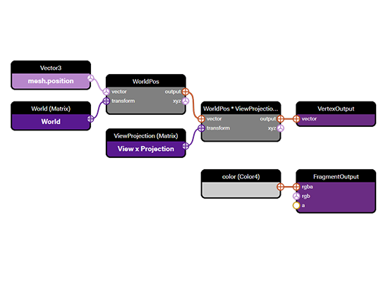
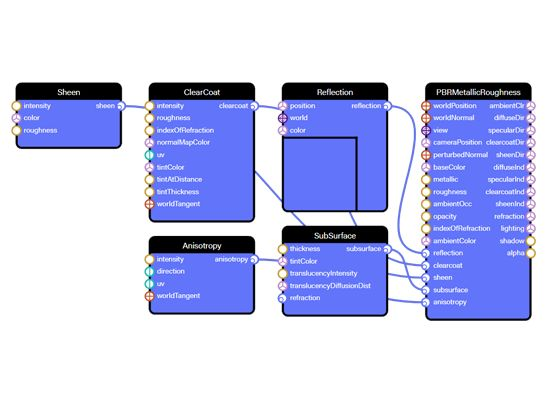

# babylon.js
## 简介
babylon.js的使命是创建世界上最强大、最惊艳、最易用、高性能的Web3D渲染引擎，并且我们坚持让它完全开源和免费，无论对任何人都如此。投资商微软同时还投资了 blender,它的代码功能结构很多参考 blender 技术体系，同时看了blender代码跟Babylonjs代码，你会发现很多地方都有共同点。

- 如果你项目必须是 webgl 且需要浏览器打开，webgl 技术风云录中提到的那些平台都无法满足你的需求，建议你用 Babylonjs，这是最好的平台，最好的框架。
- 如果想做 webgl 开发者，初学者请使用 threejs 学习，它是万金油
- 如果您是 webgl 方面创业公司，正在进行技术选型，请您选择 BabylonJS，你要研发自己的模型展示交付平台或者是要研发自己的场景漫游系统，通过BabylonJS引擎、以及他的 inspect 和编辑器，你可以快速拿出自己的产品，而且产品质量还不低。最后你要做的是业务逻辑开发以及界面美化定制。

## [工具集](https://doc.babylonjs.com/toolsAndResources/tools)
本节包含有关 Babylon.js 中丰富工具箱的信息。无论是调试您的场景与检查器，或创建高级材料轻松使用节点材料编辑器，以及之间的一切，这一节有一切你可以想要知道的奇妙的工具，使您的开发过程更容易和更有趣。

### [Playground](https://playground.babylonjs.com/)
Playground 是 Babylon.js WebGL 3D 场景的实时编辑器。官方给出了很多 demo 的代码，并且可以实时查看

### [Node Material Editor](https://doc.babylonjs.com/divingDeeper/materials/node_material/nodeMaterial)
Node Material Editor 编辑器、真正跨平台的 babylon 原生应用部署体验、层叠阴影、导航寻路、更强的 WebXR 虚拟现实及增强现实支持、更完美的 glTF 格式支持等新功能。

Node Material Editor 是一个强大而易用的材质编辑器，它以可视化的拖拽节点的方式来模拟 shader 编程，从而为每个从业者解锁了 GPU 的强大威力。从前，shaders (GPU 编程) 着色器编程对于普通程序员门槛很高，因为它过于偏向底层，虽然功能强大，但是晦涩难懂，而 Babylon 的 Node Material Editor可以实现与 shader 同样的效果，但是界面化操作，把难度降到了最低。让所有人都能使用这个编辑器来创建令人惊叹的视觉效果

- 材质节点

	
- 材质点

	

[官方工具地址](https://nme.babylonjs.com/)
	
### [Babylon Native](https://github.com/BabylonJS/BabylonNative) 
NATIVE 跨平台原生应用部署，它可以用原有的Babylon.js代码在任意平台构建一个原生应用，充分释放本机设备的性能优势。 已经支持DirectX on Windows、 Metal on iOS/MacOS、 OpenGL on Android，即将推出Vulkan支持。

Babylonjs 的原生打包部署是通过 react native 技术体系来实现的，这样就可以实现一份代码原生部署，同时保证原生性能。

- 跨平台原生 app

	使用 Babylon Native，你只需要编写一次代码，就能在网站和各种原生应用程序中重复执行，只需要用 JavaScript 编写代码，Babylon Native 的解释器就能把它运行在各种平台的图形API上（已经支持DirectX on Windows、 Metal on iOS/MacOS、 OpenGL on Android，即将推出Vulkan支持）。
- 使用所有功能

	使用 Babylon.js 编写的代码能够在 Babylon Native 中得到重用，这意味着 Babylon.js 所有的丰富功能都能在你的原生 app 或应用程序中开箱即用，包括：最新的 Physically Based Rendering (PBR)，动画，粒子系统，物理引擎。它还带来了一致性的 glTF 格式的3d文件渲染使用，让其在各个平台上的展示保持一致性、向后兼容性，
- 可优化安装包体积

	如果软件的安装包过大，会让它的推广使用遇到一些困难。例如在手机上通过应用程序商店下载 app 时，对于体积很大 app 用户总会收到的一个警告。而全功能的 Babylon.js 引擎是建立在 Web 之上的，它融入了 ES6 先进的包管理思想，你能按需安装使用到的功能，进而优化安装包的体积，Babylon Native 也继承了这个特性，所以你也可以优化自己的app安装包大小。
- 选择自己的 UI

	你可以在应用程序中自由选择使用任何 UI 技术，Babylon.js 附带一部分的UI功能，这些UI功能也是用 WebGL 实现，特别是用于VR、AR及其他方面的3D UI，它们也可以用在 Babylon Native 里。而 Babylon Native 不打算包含 HTML DOM 的 UI 实现，因此根据你的业务需求，可能还要结合其他的 UI 技术一起使用，例如React Native或原生UI。
- [体验XR功能](https://doc.babylonjs.com/how_to/introduction_to_webxr)

	由于层出不穷的创新应用、移动端支持以及呼之欲出的WebXR标准，增强现实AR、混合现实MR和虚拟现实VR的应用案例越来越多。Babylon Native 提供了一个强大的平台来构建这些创新性的应用，由于只使用 JavaScript和Babylon.js 引擎来开发，一次代码编程，任意平台使用，所以使得大量开发人员和内容生产者受益。Babylon Native原生应用部署的特性，使得 WedXR 功能可以超越 Web 的限制，直达你的手机App来构建一个AR应用程序。	
- [积极友善的开源社区](https://forum.babylonjs.com/)

	Babylon Native是Babylon.js家族的成员之一，所以它也继承了Babylon活跃而友善的开源社区，在社区里，大家相互扶持，共同钻研，创造出了一个又一个令人惊叹的应用案例。当你即将开启Babylon.js和Babylon Native之旅时，这群充满激情的小伙伴已经开始摩拳擦掌，随时准备好回答你提出的任何问题。	
	

### [批量托管和导航寻路](https://doc.babylonjs.com/extensions/navigationmesh)
Navigation Mesh system，导航寻路网格系统，它非常强大有趣，但是又那么简单易用。这个功能基于强大的开源库 Recast Navigation 并进行了深度改造，能够在你的游戏或互动场景中很简单的创造出更加真实的'AI非玩家角色'，我们只需要把物体进行代理托管，并设置导航网格参数，然后那些被托管的物体就会在定义好的导航网格内进行随机移动，就像 demo 中的鱼儿那样，它们在水中自由的游动，所以导航寻路在'AI非玩家角色'和运动路径查找方面非常有用，而且导航寻路在某些场景甚至可以取代物理碰撞检测，例如把某一个玩家限制在可以活动的区域内

### [支持 WebXR](https://doc.babylonjs.com/how_to/introduction_to_webxr) 
支持先进的WEBXR技术。毫无疑问，在web使用AR/VR技术非常有前景，Babylon最新版本在 WebXR 上做了进一步的优化和改进：带来了一个简单易用的体检帮助器，针对更高级用户的专用会话管理器，用 babylon 的相机功能来承载 WebXR 技术，全面支持任何接受 WebXR 会话的设备，完整的WebXR输入源支持，关于实验性AR功能、通信、场景交互、物理效果的整套API支持等。 

### gui.babylonjs.com

### editor.babylonjs.com
强大的编辑器，这是 threejs 跟 playcanvas 无法比拟的,编辑器中，对粒子、碰撞、脚本、GUI、精灵图等等各方面功能集成得非常完善

### inspect

### [sandbox](https://sandbox.cnbabylon.com/)

# 参考
- [babylon.js](https://www.babylonjs.com/)
- [webgl技术风云录之BabylonJS](https://zhuanlan.zhihu.com/p/341360474)

## 待学习
[Baked Lighting with Blender in BabylonJS](https://www.youtube.com/watch?v=jfWCLGREFt4)
[从 Blender 到 BabylonJS](https://www.nothing-is-3d.com/article27/from-blender-to-babylonjs)
