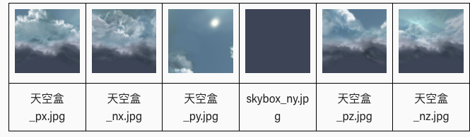

# babylon 官方入门教学(入门5-8)
## 第 5 章 - 更好的环境
### 更好的环境
我们的乡村世界有点平坦，没有气氛。让我们添加一些草、远处的山丘、天空和树木，所有这些都可以使用 Babylon.js 轻松完成，使用天空盒、纹理、使用高度图和精灵创建地面。
### 远山
我们想把村庄设置在山谷中。可以从网格创建山丘，但是还有另一种方法可以将垂直高度添加到地面网格。这是使用高度图来实现的，该高度图使用灰色阴影来确定地面的高度。白色区域是最高的部分，黑色区域是最低的。这个简单的高度图

中间有一个大的黑色区域来容纳村庄，白色区域创造了山丘，灰色区域创造了从山谷中出来的道路。

在这张图片中，相机被拉得更远，垂直高度被夸大了

	const largeGround = BABYLON.MeshBuilder.CreateGroundFromHeightMap("largeGround", "url to height map", 
	    {width:150, height:150, subdivisions: 20, minHeight:0, maxHeight: 10});
参数的 `subdivisions` 属性将地面分成 20 x 20 = 400 个部分。细分越多，高度计算的分级越精细。两个属性 `minHeight` 和 `maxHeight` 分别确定黑色和白色区域的垂直高度，灰色区域相应缩放。

- [高度图渲染](https://playground.babylonjs.com/#KBS9I5#39)

		const createScene =  () => {
		    const scene = new BABYLON.Scene(engine);
		    
		    // 为山谷环境创造广阔的地面
		    const largeGround = BABYLON.MeshBuilder.CreateGroundFromHeightMap("largeGround", "https://assets.babylonjs.com/environments/villageheightmap.png", {width:150, height:150, subdivisions: 20, minHeight:0, maxHeight: 10});
		    
		    /**** 设置相机和灯光 *****/
		    const camera = new BABYLON.ArcRotateCamera("camera", -Math.PI / 2, Math.PI / 2.5, 200, new BABYLON.Vector3(0, 0, 0));
		    camera.attachControl(canvas, true);
		    const light = new BABYLON.HemisphericLight("light", new BABYLON.Vector3(4, 1, 0));
		
		    return scene;
		}
- 我们可以以通常的方式添加纹理

	
- [带纹理的高度图](https://playground.babylonjs.com/#KBS9I5#40)

		const createScene =  () => {
		    const scene = new BABYLON.Scene(engine);
		    
		    //为山谷环境创造广阔的地面
		    // 创建纹理贴图
		    const largeGroundMat = new BABYLON.StandardMaterial("largeGroundMat");
		    largeGroundMat.diffuseTexture = new BABYLON.Texture("https://assets.babylonjs.com/environments/valleygrass.png");
		    
		    // 创建基于高度图的地面
		    const largeGround = BABYLON.MeshBuilder.CreateGroundFromHeightMap("largeGround", "https://assets.babylonjs.com/environments/villageheightmap.png", {width:150, height:150, subdivisions: 20, minHeight:0, maxHeight: 10});
		    largeGround.material = largeGroundMat;
		
		    /**** 设置相机和灯光 *****/
		    const camera = new BABYLON.ArcRotateCamera("camera", -Math.PI / 2, Math.PI / 2.5, 200, new BABYLON.Vector3(0, 0, 0));
		    camera.attachControl(canvas, true);
		    const light = new BABYLON.HemisphericLight("light", new BABYLON.Vector3(2, 1, 0));
		
		    return scene;
		}

- 最后，我们赋予村庄地面与大地面相似但更清晰的纹理。

		// 创建公路纹理
		const groundMat = new BABYLON.StandardMaterial("groundMat");
		groundMat.diffuseTexture = new BABYLON.Texture("url to ground texture");
		groundMat.diffuseTexture.hasAlpha = true;
		
		// 创建公里地面
		const ground = BABYLON.MeshBuilder.CreateGround("ground", {width:24, height:24});
		ground.material = groundMat;
		
		// 大地纹理
		const largeGroundMat = new BABYLON.StandardMaterial("largeGroundMat");
		largeGroundMat.diffuseTexture = new BABYLON.Texture("url to large ground texture");
		
		// 根据高度图创建地面
		const largeGround = BABYLON.MeshBuilder.CreateGroundFromHeightMap("largeGround", "url to heightmap", 
		    {width:150, height:150, subdivisions: 20, minHeight:0, maxHeight: 4});
		largeGround.material = largeGroundMat;
		// 设置大地高度，确保2个地面重叠后不会闪烁
		largeGround.position.y = -0.01;
- [大地纹理](https://playground.babylonjs.com/#KBS9I5#85)

		const createScene =  () => {
		    const scene = new BABYLON.Scene(engine);
		
		    const camera = new BABYLON.ArcRotateCamera("camera", -Math.PI / 2, Math.PI / 2.5, 15, new BABYLON.Vector3(0, 0, 0));
		    camera.attachControl(canvas, true);
		    const light = new BABYLON.HemisphericLight("light", new BABYLON.Vector3(1, 1, 0));
		    
		    //设置村庄地面
		    const groundMat = new BABYLON.StandardMaterial("groundMat");
		    groundMat.diffuseTexture = new BABYLON.Texture("https://assets.babylonjs.com/environments/villagegreen.png");
		    groundMat.diffuseTexture.hasAlpha = true;
		
		    const ground = BABYLON.MeshBuilder.CreateGround("ground", {width:24, height:24});
		    ground.material = groundMat;
		
		    //设置大地
		    const largeGroundMat = new BABYLON.StandardMaterial("largeGroundMat");
		    largeGroundMat.diffuseTexture = new BABYLON.Texture("https://assets.babylonjs.com/environments/valleygrass.png");
		    
		    const largeGround = BABYLON.MeshBuilder.CreateGroundFromHeightMap("largeGround", "https://assets.babylonjs.com/environments/villageheightmap.png", {width:150, height:150, subdivisions: 20, minHeight:0, maxHeight: 10});
		    largeGround.material = largeGroundMat;
		    largeGround.position.y = -0.01;
		    
		    return scene;
		}
- 我们[添加回住宅](https://playground.babylonjs.com/#KBS9I5#86)并创建一个文件以导入

		const createScene = function () {
		    
		    const scene = new BABYLON.Scene(engine);
		
		    const camera = new BABYLON.ArcRotateCamera("camera", -Math.PI / 2, Math.PI / 2.5, 15, new BABYLON.Vector3(0, 0, 0));
		    camera.attachControl(canvas, true);
		    const light = new BABYLON.HemisphericLight("light", new BABYLON.Vector3(1, 1, 0));  
		
		    // 导入村庄
		    BABYLON.SceneLoader.ImportMeshAsync("", "https://assets.babylonjs.com/meshes/", "valleyvillage.glb");
		
		    return scene;
		};
- 然后我们可以[加回汽车](https://playground.babylonjs.com/#KBS9I5#87)，但这次要经过村庄
		
		// 创建场景函数
		const createScene = function () {
		    
		    const scene = new BABYLON.Scene(engine);
		
		    const camera = new BABYLON.ArcRotateCamera("camera", -Math.PI / 2, Math.PI / 2.5, 15, new BABYLON.Vector3(0, 0, 0));
		    camera.attachControl(canvas, true);
		    const light = new BABYLON.HemisphericLight("light", new BABYLON.Vector3(1, 1, 0)); 
			
		    // 载入村庄和车辆模型		
		    BABYLON.SceneLoader.ImportMeshAsync("", "https://assets.babylonjs.com/meshes/", "valleyvillage.glb");
		    BABYLON.SceneLoader.ImportMeshAsync("", "https://assets.babylonjs.com/meshes/", "car.glb").then(() => {
		        const car = scene.getMeshByName("car");
		        car.rotation = new BABYLON.Vector3(Math.PI / 2, 0, -Math.PI / 2);
		        car.position.y = 0.16;
		        car.position.x = -3;
		        car.position.z = 8;
		
			// 创建汽车动画
		      const animCar = new BABYLON.Animation("carAnimation", "position.z", 30, BABYLON.Animation.ANIMATIONTYPE_FLOAT, BABYLON.Animation.ANIMATIONLOOPMODE_CYCLE);
		      // 设置汽车动作
		      const carKeys = []; 
		
		      carKeys.push({
		        frame: 0,
		        value: 10
		      });
		
		
		      carKeys.push({
		        frame: 200,
		        value: -15
		      });
		      // 绑定动作到动画
		      animCar.setKeys(carKeys);
		 
		      // 绑定动画到汽车
		      car.animations = [];
		      car.animations.push(animCar);
		      //  播放动画
		      scene.beginAnimation(car, 0, 200, true);
		      
		      //车轮动画
		      const wheelRB = scene.getMeshByName("wheelRB");
		      const wheelRF = scene.getMeshByName("wheelRF");
		      const wheelLB = scene.getMeshByName("wheelLB");
		      const wheelLF = scene.getMeshByName("wheelLF");
		      
		      scene.beginAnimation(wheelRB, 0, 30, true);
		      scene.beginAnimation(wheelRF, 0, 30, true);
		      scene.beginAnimation(wheelLB, 0, 30, true);
		      scene.beginAnimation(wheelLF, 0, 30, true);
		    });
		
		    return scene;
		};

### 天空盒
我们可以通过将六个合适的图像应用到一个大型天空盒立方体的内部来模拟天空的外观。（图像比 3D 对象更容易和更快地渲染，并且同样适用于远景。）

Skybox 图像通常使用 `CubeTexture` 加载。`CubeTexture` 的构造函数采用基本 URL 并（默认情况下）附加

- “_px.jpg”
- “_nx.jpg”
- “_py.jpg”
- “_ny.jpg”
- “_pz.jpg”
- “_nz.jpg”

来加载 `+x、-x、+y、-y、+z、 -z` 面向立方体的侧面。

即使天空盒不是反射贴图，也必须使用[反射纹理](https://doc.babylonjs.com/divingDeeper/materials/using/reflectionTexture)应用立方体纹理。将 [坐标](https://doc.babylonjs.com/typedoc/classes/babylon.texture#coordinatesmode) 模式设置为 `SKYBOX_MODE` 会直接在立方体上绘制纹理，而不是模拟反射。

	const skybox = BABYLON.MeshBuilder.CreateBox("skyBox", {size:150}, scene);
	const skyboxMaterial = new BABYLON.StandardMaterial("skyBox", scene);
	skyboxMaterial.backFaceCulling = false;
	skyboxMaterial.reflectionTexture = new BABYLON.CubeTexture("textures/skybox", scene);
	skyboxMaterial.reflectionTexture.coordinatesMode = BABYLON.Texture.SKYBOX_MODE;
	skyboxMaterial.diffuseColor = new BABYLON.Color3(0, 0, 0);
	skyboxMaterial.specularColor = new BABYLON.Color3(0, 0, 0);
	skybox.material = skyboxMaterial;
我们还限制了相机，使其不能移动到地面以下。

	camera.upperBetaLimit = Math.PI / 2.2;	
-  [添加天空盒的小镇](https://playground.babylonjs.com/#KBS9I5#88) 

		const createScene = function () {
		    
		    const scene = new BABYLON.Scene(engine);
		
		    const camera = new BABYLON.ArcRotateCamera("camera", -Math.PI / 2, Math.PI / 2.5, 15, new BABYLON.Vector3(0, 0, 0));
		    camera.upperBetaLimit = Math.PI / 2.2;
		    camera.attachControl(canvas, true);
		    const light = new BABYLON.HemisphericLight("light", new BABYLON.Vector3(1, 1, 0));
		    
		    //加入天空盒
		    const skybox = BABYLON.MeshBuilder.CreateBox("skyBox", {size:150}, scene);
			  const skyboxMaterial = new BABYLON.StandardMaterial("skyBox", scene);
			  skyboxMaterial.backFaceCulling = false;
			  skyboxMaterial.reflectionTexture = new BABYLON.CubeTexture("textures/skybox", scene);
			  skyboxMaterial.reflectionTexture.coordinatesMode = BABYLON.Texture.SKYBOX_MODE;
			  skyboxMaterial.diffuseColor = new BABYLON.Color3(0, 0, 0);
			  skyboxMaterial.specularColor = new BABYLON.Color3(0, 0, 0);
			  skybox.material = skyboxMaterial;
		
		    BABYLON.SceneLoader.ImportMeshAsync("", "https://assets.babylonjs.com/meshes/", "valleyvillage.glb");
		    BABYLON.SceneLoader.ImportMeshAsync("", "https://assets.babylonjs.com/meshes/", "car.glb").then(() => {
		        const car = scene.getMeshByName("car");
		        car.rotation = new BABYLON.Vector3(Math.PI / 2, 0, -Math.PI / 2);
		        car.position.y = 0.16;
		        car.position.x = -3;
		        car.position.z = 8;
		
		        const animCar = new BABYLON.Animation("carAnimation", "position.z", 30, BABYLON.Animation.ANIMATIONTYPE_FLOAT, BABYLON.Animation.ANIMATIONLOOPMODE_CYCLE);
		
		      const carKeys = []; 
		
		      carKeys.push({
		        frame: 0,
		        value: 10
		      });
		
		
		      carKeys.push({
		        frame: 200,
		        value: -15
		      });
		
		      animCar.setKeys(carKeys);
		
		      car.animations = [];
		      car.animations.push(animCar);
		
		      scene.beginAnimation(car, 0, 200, true);
		      
		    	//车轮动画
		      const wheelRB = scene.getMeshByName("wheelRB");
		      const wheelRF = scene.getMeshByName("wheelRF");
		      const wheelLB = scene.getMeshByName("wheelLB");
		      const wheelLF = scene.getMeshByName("wheelLF");
		      
		      scene.beginAnimation(wheelRB, 0, 30, true);
		      scene.beginAnimation(wheelRF, 0, 30, true);
		      scene.beginAnimation(wheelLB, 0, 30, true);
		      scene.beginAnimation(wheelLF, 0, 30, true);
		    });
		
		    return scene;
		};

### 精灵树
我们将在我们的世界中种植几棵树林，每棵树林都包含 500 棵树。为了保持渲染速度，我们将使用精灵。这些是始终面向相机的二维图像。

我们正在使用这张图片

对于树精灵，我们为它设置了一个精灵管理器。

	const spriteManagerTrees = new BABYLON.SpriteManager("treesManager", "url to tree image", 2000, {width: 512, height: 1024}, scene);
参数是管理器的名称、图像的 url、精灵的最大数量、指定精灵的宽度和高度的对象，在这种情况下是图像的宽度和高度。

	for (let i = 0; i < 500; i++) {
	    const tree = new BABYLON.Sprite("tree", spriteManagerTrees);
	    tree.position.x = Math.random() * (-30);
	    tree.position.z = Math.random() * 20 + 8;
	    tree.position.y = 0.5;
	}
	
	for (let i = 0; i < 500; i++) {
	    const tree = new BABYLON.Sprite("tree", spriteManagerTrees);
	    tree.position.x = Math.random() * (25) + 7;
	    tree.position.z = Math.random() * -35  + 8;
	    tree.position.y = 0.5;
	}
- [添加精灵树的小镇](https://playground.babylonjs.com/#KBS9I5#89)

		const createScene = function () {
		    
		    const scene = new BABYLON.Scene(engine);
		
		    const camera = new BABYLON.ArcRotateCamera("camera", -Math.PI / 2, Math.PI / 2.5, 15, new BABYLON.Vector3(0, 0, 0));
		    camera.upperBetaLimit = Math.PI / 2.2;
		    camera.attachControl(canvas, true);
		    const light = new BABYLON.HemisphericLight("light", new BABYLON.Vector3(1, 1, 0));
		
		    // 精灵树模型
		    const spriteManagerTrees = new BABYLON.SpriteManager("treesManager", "textures/palm.png", 2000, {width: 512, height: 1024}, scene);
		
		    //我们采用2套随机位置创建树
		    for (let i = 0; i < 500; i++) {
		        const tree = new BABYLON.Sprite("tree", spriteManagerTrees);
		        tree.position.x = Math.random() * (-30);
		        tree.position.z = Math.random() * 20 + 8;
		        tree.position.y = 0.5;
		    }
		
		    for (let i = 0; i < 500; i++) {
		        const tree = new BABYLON.Sprite("tree", spriteManagerTrees);
		        tree.position.x = Math.random() * (25) + 7;
		        tree.position.z = Math.random() * -35  + 8;
		        tree.position.y = 0.5;
		    }
		    
		    //天空盒
		    const skybox = BABYLON.MeshBuilder.CreateBox("skyBox", {size:150}, scene);
			  const skyboxMaterial = new BABYLON.StandardMaterial("skyBox", scene);
			  skyboxMaterial.backFaceCulling = false;
			  skyboxMaterial.reflectionTexture = new BABYLON.CubeTexture("textures/skybox", scene);
			  skyboxMaterial.reflectionTexture.coordinatesMode = BABYLON.Texture.SKYBOX_MODE;
			  skyboxMaterial.diffuseColor = new BABYLON.Color3(0, 0, 0);
			  skyboxMaterial.specularColor = new BABYLON.Color3(0, 0, 0);
			  skybox.material = skyboxMaterial;
		
		    // 载入小镇模型
		    BABYLON.SceneLoader.ImportMeshAsync("", "https://assets.babylonjs.com/meshes/", "valleyvillage.glb");
		
		    return scene;
		};

还可以使用精灵图中的图像集合来生成动画。

上面的地图由相同大小的单元格框组成，5 横和 4 向下。这次在管理器中给出的宽度和高度是一个单元格的宽度和高度。

	const spriteManagerUFO = new BABYLON.SpriteManager("UFOManager","url to ufo image", 1, {width: 128, height: 76});
通过给出要使用的第一个和最后一个单元格来设置精灵的动画，无论它是否循环（真）以及单元格帧之间的时间

	const ufo = new BABYLON.Sprite("ufo", spriteManagerUFO);
	ufo.playAnimation(0, 16, true, 125);

- [带飞碟的小镇](https://playground.babylonjs.com/#KBS9I5#90)

		// 创建场景函数
		const createScene = function () {
		    
		    const scene = new BABYLON.Scene(engine);
		
		    const camera = new BABYLON.ArcRotateCamera("camera", -Math.PI / 2, Math.PI / 2.5, 15, new BABYLON.Vector3(0, 0, 0));
		    camera.upperBetaLimit = Math.PI / 2.2;
		    camera.attachControl(canvas, true);
		    const light = new BABYLON.HemisphericLight("light", new BABYLON.Vector3(1, 1, 0));
		    
		    // 创建 ufo 精灵精图管理器
		    const spriteManagerUFO = new BABYLON.SpriteManager("UFOManager","https://assets.babylonjs.com/environments/ufo.png", 1, {width: 128, height: 76});
		    // 创建精灵实体
		    const ufo = new BABYLON.Sprite("ufo", spriteManagerUFO);
		    // 动画设置
		    ufo.playAnimation(0, 16, true, 125);
		    ufo.position.y = 5;
		    ufo.position.z = 0;
		    ufo.width = 2;
		    ufo.height = 1;
		    
		    //天空盒
		    const skybox = BABYLON.MeshBuilder.CreateBox("skyBox", {size:150}, scene);
			  const skyboxMaterial = new BABYLON.StandardMaterial("skyBox", scene);
			  skyboxMaterial.backFaceCulling = false;
			  skyboxMaterial.reflectionTexture = new BABYLON.CubeTexture("textures/skybox", scene);
			  skyboxMaterial.reflectionTexture.coordinatesMode = BABYLON.Texture.SKYBOX_MODE;
			  skyboxMaterial.diffuseColor = new BABYLON.Color3(0, 0, 0);
			  skyboxMaterial.specularColor = new BABYLON.Color3(0, 0, 0);
			  skybox.material = skyboxMaterial;
		    // 加载小镇
		    BABYLON.SceneLoader.ImportMeshAsync("", "https://assets.babylonjs.com/meshes/", "valleyvillage.glb");
		
		    return scene;
		};

## 第 6 章 - 构建粒子喷泉
### 粒子喷泉
每个村庄都需要水，所以让我们安装一个喷泉。我们将使用一个旋转对称的网格来创建它。细颗粒将被回收以产生水效果。为了不浪费水，让我们添加一个开关事件来打开或关闭它。
### 加工的喷泉
是时候介绍创建网格的众多方法中的另一种了，即 `CreateLathe` 方法。我们从喷泉的轮廓开始。
	

使用 3D 矢量的 x 和 y 分量在数组中描述轮廓。
	
	const fountainProfile = [
		new BABYLON.Vector3(0, 0, 0),
		new BABYLON.Vector3(10, 0, 0),
		new BABYLON.Vector3(10, 4, 0),
		new BABYLON.Vector3(8, 4, 0),
		new BABYLON.Vector3(8, 1, 0),
		new BABYLON.Vector3(1, 2, 0),
		new BABYLON.Vector3(1, 15, 0),
		new BABYLON.Vector3(3, 17, 0)
	];
该数组用于 `CreateLathe` 方法中 `options` 参数的 `shape` 属性。

	const fountain = BABYLON.MeshBuilder.CreateLathe("fountain", {shape: fountainProfile, sideOrientation: BABYLON.Mesh.DOUBLESIDE}, scene);
和以前一样，场景参数是可选的。在这种情况下，网格设置为双面，因为由于顶部的斜率和中空的中间，内部是可见的。
	
- [喷泉实体](https://playground.babylonjs.com/#TC31NV#3)

		const createScene = function () {
			const scene = new BABYLON.Scene(engine);
		
			const camera = new BABYLON.ArcRotateCamera("Camera", 3 * Math.PI / 2, Math.PI / 2.5, 70, BABYLON.Vector3.Zero());
			camera.attachControl(canvas, true);
		
			const light = new BABYLON.HemisphericLight("hemi", new BABYLON.Vector3(0, 1, 0));
		
			// 描述喷泉林廓
			const fountainProfile = [
				new BABYLON.Vector3(0, 0, 0),
				new BABYLON.Vector3(10, 0, 0),
		        	new BABYLON.Vector3(10, 4, 0),
				new BABYLON.Vector3(8, 4, 0),
			      new BABYLON.Vector3(8, 1, 0),
			      new BABYLON.Vector3(1, 2, 0),
				new BABYLON.Vector3(1, 15, 0),
				new BABYLON.Vector3(3, 17, 0)
			];
			
			// 创建喷泉
			const fountain = BABYLON.MeshBuilder.CreateLathe("fountain", {shape: fountainProfile, sideOrientation: BABYLON.Mesh.DOUBLESIDE}, scene);
			
			return scene;
		}
- 规模和定位的适当变化，这被[添加到村庄中](https://playground.babylonjs.com/#KBS9I5#91)。

		const createScene = function () {
		    
		    const scene = new BABYLON.Scene(engine);
		
		    const camera = new BABYLON.ArcRotateCamera("camera", -Math.PI / 1.5, Math.PI / 2.2, 15, new BABYLON.Vector3(0, 0, 0));
		    camera.upperBetaLimit = Math.PI / 2.2;
		    camera.attachControl(canvas, true);
		    const light = new BABYLON.HemisphericLight("light", new BABYLON.Vector3(1, 1, 0));
		
		    // 描述喷泉林廓
		    const fountainOutline = [
				new BABYLON.Vector3(0, 0, 0),
				new BABYLON.Vector3(0.5, 0, 0),
		        new BABYLON.Vector3(0.5, 0.2, 0),
				new BABYLON.Vector3(0.4, 0.2, 0),
		        new BABYLON.Vector3(0.4, 0.05, 0),
		        new BABYLON.Vector3(0.05, 0.1, 0),
				new BABYLON.Vector3(0.05, 0.8, 0),
				new BABYLON.Vector3(0.15, 0.9, 0)
			];
			
			//创建喷泉方法
		    const fountain = BABYLON.MeshBuilder.CreateLathe("fountain", {shape: fountainOutline, sideOrientation: BABYLON.Mesh.DOUBLESIDE});
		    fountain.position.x = -4;
		    fountain.position.z = -6;
		      
		    //Skybox
		    const skybox = BABYLON.MeshBuilder.CreateBox("skyBox", {size:150}, scene);
			  const skyboxMaterial = new BABYLON.StandardMaterial("skyBox", scene);
			  skyboxMaterial.backFaceCulling = false;
			  skyboxMaterial.reflectionTexture = new BABYLON.CubeTexture("textures/skybox", scene);
			  skyboxMaterial.reflectionTexture.coordinatesMode = BABYLON.Texture.SKYBOX_MODE;
			  skyboxMaterial.diffuseColor = new BABYLON.Color3(0, 0, 0);
			  skyboxMaterial.specularColor = new BABYLON.Color3(0, 0, 0);
			  skybox.material = skyboxMaterial;
		
		    BABYLON.SceneLoader.ImportMeshAsync("", "https://assets.babylonjs.com/meshes/", "valleyvillage.glb");
		
		    return scene;
		};
			
### 粒子喷雾
在这种情况下，粒子是在集群或云中发出的小精灵，用于模拟用于模拟火、烟、水甚至仙尘。

粒子云的基础是 `ParticleSystem`。有了这个，我们指定要使用的粒子数

	const particleSystem = new BABYLON.ParticleSystem("particles", 5000, scene);  //场景是可选的
粒子从特定定义的区域发射。每个粒子都有一个生命周期，当达到它时，它会被重复使用并重新发射。

它们被赋予一种质地，这显然决定了它们的外观，

	particleSystem.particleTexture = new BABYLON.Texture("url to image", scene);
基本的发射极区域是一个围绕指定点的给定尺寸的盒子；

	particleSystem.emitter = new BABYLON.Vector3(-4, 0.8, -6); // 喷泉顶端的尖
	particleSystem.minEmitBox = new BABYLON.Vector3(-0.01, 0, -0.01); // 最小的盒子尺寸
	particleSystem.maxEmitBox = new BABYLON.Vector3(0.01, 0, 0.01); // 最大的盒子尺寸
对于红色、绿色、蓝色和 alpha，最多可以以 (r, g, b, a) 的形式给出三种颜色。Alpha 从 0（完全透明）到 1（完全不透明）。

- 前两者组合或混合以设置粒子的颜色。可以指定混合方法。
- 第三个具有属性 `colorDead` 并且在粒子的回收设置为关闭时使用。

我们的喷泉不需要第三个属性。

	particleSystem.color1 = new BABYLON.Color4(0.7, 0.8, 1.0, 1.0);
	particleSystem.color2 = new BABYLON.Color4(0.2, 0.5, 1.0, 1.0);
	particleSystem.blendMode = BABYLON.ParticleSystem.BLENDMODE_ONEONE;
粒子的大小及其寿命在最小值和最大值设定的范围内。

	particleSystem.minSize = 0.01;
	particleSystem.maxSize = 0.05;
	
	particleSystem.minLifeTime = 0.3;
	particleSystem.maxLifeTime = 1.5;	
我们还需要设置每秒发射的粒子数。过快的发射率和较长的寿命会导致粒子发射出现间隙

	particleSystem.emitRate = 1500;
我们还为粒子设置了两个可能的方向，并通过给出最小和最大功率值以及更新速度来影响粒子行进的速度。

	particleSystem.direction1 = new BABYLON.Vector3(-1, 8, 1);
	particleSystem.direction2 = new BABYLON.Vector3(1, 8, -1);
	
	particleSystem.minEmitPower = 0.2;
	particleSystem.maxEmitPower = 0.6;
	particleSystem.updateSpeed = 0.01;
在 y 分量中为 `graving` 设置负值可确保粒子向下落。

	particleSystem.gravity = new BABYLON.Vector3(0, -9.81, 0);
终于可以启动喷泉了

	particleSystem.start();
这是我们[喷泉的一个例子](https://playground.babylonjs.com/#TC31NV#4)

	const createScene = function () {
		const scene = new BABYLON.Scene(engine);
	
		const camera = new BABYLON.ArcRotateCamera("Camera", 3 * Math.PI / 2, Math.PI / 2, 70, BABYLON.Vector3.Zero());
		camera.attachControl(canvas, true);
	
		const light = new BABYLON.HemisphericLight("hemi", new BABYLON.Vector3(0, 1, 0));
	      
	      // 喷泉形状描述
		const fountainProfile = [
			new BABYLON.Vector3(0, 0, 0),
			new BABYLON.Vector3(10, 0, 0),
	        new BABYLON.Vector3(10, 4, 0),
			new BABYLON.Vector3(8, 4, 0),
	        new BABYLON.Vector3(8, 1, 0),
	        new BABYLON.Vector3(1, 2, 0),
			new BABYLON.Vector3(1, 15, 0),
			new BABYLON.Vector3(3, 17, 0)
		];
		
		//创建喷泉
		const fountain = BABYLON.MeshBuilder.CreateLathe("fountain", {shape: fountainProfile, sideOrientation: BABYLON.Mesh.DOUBLESIDE}, scene);
		fountain.position.y = -5;
	    
	    // 创建一个粒子系统
	    var particleSystem = new BABYLON.ParticleSystem("particles", 5000, scene);
	
	    //创建粒子贴图
	    particleSystem.particleTexture = new BABYLON.Texture("textures/flare.png", scene);
	
	    // 粒子从何而来
	    particleSystem.emitter = new BABYLON.Vector3(0, 10, 0); // 起始对象，发射器
	    particleSystem.minEmitBox = new BABYLON.Vector3(-1, 0, 0); // 开始从
	    particleSystem.maxEmitBox = new BABYLON.Vector3(1, 0, 0); // 到
	
	    // 所有粒子的颜色
	    particleSystem.color1 = new BABYLON.Color4(0.7, 0.8, 1.0, 1.0);
	    particleSystem.color2 = new BABYLON.Color4(0.2, 0.5, 1.0, 1.0);
	    particleSystem.colorDead = new BABYLON.Color4(0, 0, 0.2, 0.0);
	
	    // 每个粒子的大小(随机在…0.1-0.5)
	    particleSystem.minSize = 0.1;
	    particleSystem.maxSize = 0.5;
	
	    //每个粒子的生命时间(随机在…之间)
	    particleSystem.minLifeTime = 2;
	    particleSystem.maxLifeTime = 3.5;
	
	    // 发射率
	    particleSystem.emitRate = 1500;
	
	    //混合模式:BLENDMODE_ONEONE 或 BLENDMODE_STANDARD
	    particleSystem.blendMode = BABYLON.ParticleSystem.BLENDMODE_ONEONE;
	
	    // 设置所有粒子的重力
	    particleSystem.gravity = new BABYLON.Vector3(0, -9.81, 0);
	
	    // 每个粒子发射后的方向
	    particleSystem.direction1 = new BABYLON.Vector3(-2, 8, 2);
	    particleSystem.direction2 = new BABYLON.Vector3(2, 8, -2);
	
	    // 以弧度为单位的角速度
	    particleSystem.minAngularSpeed = 0;
	    particleSystem.maxAngularSpeed = Math.PI;
	
	    // 速度
	    particleSystem.minEmitPower = 1;
	    particleSystem.maxEmitPower = 3;
	    particleSystem.updateSpeed = 0.025;
	
	    // 启动粒子系统
	    particleSystem.start();
	
	
		return scene;
	}

### 开启事件
当我们单击喷泉上的屏幕指针时，我们希望它开始。我们通过向 `onPointerObservable` 添加一个函数来处理指针向下事件，该事件在停止和启动之间切换粒子系统。

	let switched = false;  // 开关
	
	scene.onPointerObservable.add((pointerInfo) => {      		
	    switch (pointerInfo.type) {
			case BABYLON.PointerEventTypes.POINTERDOWN:
				if(pointerInfo.pickInfo.hit) {
	                pointerDown(pointerInfo.pickInfo.pickedMesh)
	            }
			break;
	    }
	});
	
	const pointerDown = (mesh) => {
	    if (mesh === fountain) { // 检查一下，挑出来的网格就是喷泉
	        switched = !switched;  // 拨动开关
	        if(switched) {
	            particleSystem.start();
	        }
	        else {
	            particleSystem.stop();
	        }
	    }
	}

- [添加开关喷泉](https://playground.babylonjs.com/#TC31NV#5)

		const createScene = function () {
			const scene = new BABYLON.Scene(engine);
		
			const camera = new BABYLON.ArcRotateCamera("Camera", 3 * Math.PI / 2, Math.PI / 2, 70, BABYLON.Vector3.Zero());
			camera.attachControl(canvas, true);
			const light = new BABYLON.HemisphericLight("hemi", new BABYLON.Vector3(0, 1, 0));
		
		    // 打开和关闭喷泉
		    let switched = false;
		    const pointerDown = (mesh) => {
		        if (mesh === fountain) {
		            switched = !switched;
		            if(switched) {
		                // 打开粒子系统
		                particleSystem.start();
		            }
		            else {
		                // 关闭粒子系统
		                particleSystem.stop();
		            }
		        }
		
		    }
		    
		    // 触发监测
		    scene.onPointerObservable.add((pointerInfo) => {      		
		        switch (pointerInfo.type) {
					case BABYLON.PointerEventTypes.POINTERDOWN:
						if(pointerInfo.pickInfo.hit) {
		                    pointerDown(pointerInfo.pickInfo.pickedMesh)
		                }
						break;
		        }
		    });
			// 喷泉描述
			const fountainProfile = [
				new BABYLON.Vector3(0, 0, 0),
				new BABYLON.Vector3(10, 0, 0),
		        new BABYLON.Vector3(10, 4, 0),
				new BABYLON.Vector3(8, 4, 0),
		        new BABYLON.Vector3(8, 1, 0),
		        new BABYLON.Vector3(1, 2, 0),
				new BABYLON.Vector3(1, 15, 0),
				new BABYLON.Vector3(3, 17, 0)
			];
			
			//构建喷泉
			const fountain = BABYLON.MeshBuilder.CreateLathe("fountain", {shape: fountainProfile, sideOrientation: BABYLON.Mesh.DOUBLESIDE}, scene);
			fountain.position.y = -6;
		
		    
		    // 创建粒子系统
		    var particleSystem = new BABYLON.ParticleSystem("particles", 5000, scene);
		
		    //粒子系统贴图
		    particleSystem.particleTexture = new BABYLON.Texture("textures/flare.png", scene);
		
		    // 粒子从何而来
		    particleSystem.emitter = new BABYLON.Vector3(0, 10, 0); // 起始对象，发射器
		    particleSystem.minEmitBox = new BABYLON.Vector3(-1, 0, 0); // 开始从
		    particleSystem.maxEmitBox = new BABYLON.Vector3(1, 0, 0); // 到
		
		    // 所有粒子的颜色
		    particleSystem.color1 = new BABYLON.Color4(0.7, 0.8, 1.0, 1.0);
		    particleSystem.color2 = new BABYLON.Color4(0.2, 0.5, 1.0, 1.0);
		    particleSystem.colorDead = new BABYLON.Color4(0, 0, 0.2, 0.0);
		
		    // 每个粒子的大小(随机在…
		    particleSystem.minSize = 0.1;
		    particleSystem.maxSize = 0.5;
		
		    // 每个粒子的生命时间(随机在…之间)
		    particleSystem.minLifeTime = 2;
		    particleSystem.maxLifeTime = 3.5;
		
		    // 发射率
		    particleSystem.emitRate = 1500;
		
		    // 混合模式:BLENDMODE_ONEONE或BLENDMODE_STANDARD
		    particleSystem.blendMode = BABYLON.ParticleSystem.BLENDMODE_ONEONE;
		
		    // 设置所有粒子的重力
		    particleSystem.gravity = new BABYLON.Vector3(0, -9.81, 0);
		
		    // 每个粒子发射后的方向
		    particleSystem.direction1 = new BABYLON.Vector3(-2, 8, 2);
		    particleSystem.direction2 = new BABYLON.Vector3(2, 8, -2);
		
		    // 以弧度为单位的角速度
		    particleSystem.minAngularSpeed = 0;
		    particleSystem.maxAngularSpeed = Math.PI;
		
		    // 速度
		    particleSystem.minEmitPower = 1;
		    particleSystem.maxEmitPower = 3;
		    particleSystem.updateSpeed = 0.025;
	
		return scene;
		}

- [添加到村庄世界中](https://playground.babylonjs.com/#KBS9I5#93)

		const createScene = function () {
		    
		    const scene = new BABYLON.Scene(engine);
		
		    const camera = new BABYLON.ArcRotateCamera("camera", -Math.PI / 1.5, Math.PI / 2.2, 15, new BABYLON.Vector3(0, 0, 0));
		    camera.upperBetaLimit = Math.PI / 2.2;
		    camera.attachControl(canvas, true);
		    const light = new BABYLON.HemisphericLight("light", new BABYLON.Vector3(1, 1, 0));
		
		    //喷泉粒子系统开关
		    let switched = false;
		    const pointerDown = (mesh) => {
		        if (mesh === fountain) {
		            switched = !switched;
		            if(switched) {
		                // Start the particle system
		                particleSystem.start();
		            }
		            else {
		                // Stop the particle system
		                particleSystem.stop();
		            }
		        }
		
		    }
		
		    scene.onPointerObservable.add((pointerInfo) => {      		
		        switch (pointerInfo.type) {
					case BABYLON.PointerEventTypes.POINTERDOWN:
						if(pointerInfo.pickInfo.hit) {
		                    pointerDown(pointerInfo.pickInfo.pickedMesh)
		                }
						break;
		        }
		    });
		    
		    // 创建粒子系统
		    const particleSystem = new BABYLON.ParticleSystem("particles", 5000);
		
		    //粒子系统贴图
		    particleSystem.particleTexture = new BABYLON.Texture("textures/flare.png");
		
		    // 粒子从那里来到哪里去
		    particleSystem.emitter = new BABYLON.Vector3(-4, 0.8, -6); // 从喷泉的顶部喷出的
		    particleSystem.minEmitBox = new BABYLON.Vector3(-0.01, 0, -0.01); // 启动从何而来
		    particleSystem.maxEmitBox = new BABYLON.Vector3(0.01, 0, 0.01); // 到
		
		    // 粒子系统颜色
		    particleSystem.color1 = new BABYLON.Color4(0.7, 0.8, 1.0, 1.0);
		    particleSystem.color2 = new BABYLON.Color4(0.2, 0.5, 1.0, 1.0);
		
		    //每个粒子的大小，从这里随机
		    particleSystem.minSize = 0.01;
		    particleSystem.maxSize = 0.05;
		
		    // 每个粒子的声明周期，从这里随机
		    particleSystem.minLifeTime = 0.3;
		    particleSystem.maxLifeTime = 1.5;
		
		    // 发射率
		    particleSystem.emitRate = 1500;
		
		    // 混合模式 : BLENDMODE_ONEONE, or BLENDMODE_STANDARD
		    particleSystem.blendMode = BABYLON.ParticleSystem.BLENDMODE_ONEONE;
		
		    // 粒子系统重力设置
		    particleSystem.gravity = new BABYLON.Vector3(0, -9.81, 0);
		
		    // 每个粒子发射后的方向
		    particleSystem.direction1 = new BABYLON.Vector3(-1, 8, 1);
		    particleSystem.direction2 = new BABYLON.Vector3(1, 8, -1);
		
		    // 粒子力量和速度
		    particleSystem.minEmitPower = 0.2;
		    particleSystem.maxEmitPower = 0.6;
		    particleSystem.updateSpeed = 0.01;
		
		    const fountainProfile = [
				new BABYLON.Vector3(0, 0, 0),
				new BABYLON.Vector3(0.5, 0, 0),
		        new BABYLON.Vector3(0.5, 0.2, 0),
				new BABYLON.Vector3(0.4, 0.2, 0),
		        new BABYLON.Vector3(0.4, 0.05, 0),
		        new BABYLON.Vector3(0.05, 0.1, 0),
				new BABYLON.Vector3(0.05, 0.8, 0),
				new BABYLON.Vector3(0.15, 0.9, 0)
			];
			
			//创建喷泉
			const fountain = BABYLON.MeshBuilder.CreateLathe("fountain", {shape: fountainProfile, sideOrientation: BABYLON.Mesh.DOUBLESIDE});
		    fountain.position.x = -4;
		    fountain.position.z = -6;
		    
		    //Skybox
		    const skybox = BABYLON.MeshBuilder.CreateBox("skyBox", {size:150}, scene);
			  const skyboxMaterial = new BABYLON.StandardMaterial("skyBox", scene);
			  skyboxMaterial.backFaceCulling = false;
			  skyboxMaterial.reflectionTexture = new BABYLON.CubeTexture("textures/skybox", scene);
			  skyboxMaterial.reflectionTexture.coordinatesMode = BABYLON.Texture.SKYBOX_MODE;
			  skyboxMaterial.diffuseColor = new BABYLON.Color3(0, 0, 0);
			  skyboxMaterial.specularColor = new BABYLON.Color3(0, 0, 0);
			  skybox.material = skyboxMaterial;
		
		    BABYLON.SceneLoader.ImportMeshAsync("", "https://assets.babylonjs.com/meshes/", "valleyvillage.glb");
		
		    return scene;
		};

## 第 7 章 - 点亮夜晚
### 点亮村庄
村子里的常亮灯会让人很难入睡，所以我们将通过调暗灯光来介绍夜间时间。当然，人们不想在晚上完全黑暗中行走，所以我们会添加一些路灯。由于永夜并不比永昼好，我们将添加一个界面以从一个更改为另一个。我们想在晚上把灯关掉，白天把它打开。让我们添加一个 GUI 控件来执行此操作。有光的地方也有阴影，Babylon.js 也可以添加它们
### 路灯
到目前为止，我们只是在所有场景中使用了半球光。有一系列灯，但目前我们将介绍的唯一新灯是聚光灯。这可以放置在任何地方，并给出一个发光的方向。光的传播由一个以弧度表示的角度给出，角度越大，传播越广。最后一个参数表示光线消失的速度，数字越大，光线照射的距离越短。聚光灯可以被赋予颜色。

	const lampLight = new BABYLON.SpotLight("name", position, direction, angle_of_spread, speed_of_disipation);
	lampLight.diffuse = BABYLON.Color3.Yellow();
我们将为路灯添加聚光灯。为了创建灯柱，我们介绍了另一种通过沿路径挤出形状来创建网格的方法。

我们仅使用 x、y 平面中的点创建形状轮廓，以使用一系列 vector3 进行拉伸。

	const lampShape = [];
	    for(let i = 0; i < 20; i++) {
	        lampShape.push(new BABYLON.Vector3(Math.cos(i * Math.PI / 10), Math.sin(i * Math.PI / 10), 0));
	    }
	lampShape.push(lampShape[0]); //关闭的形状
然后，我们再次使用 vector3s 设置拉伸路径。路径不必局限于 x、y 平面，它可以使用完整的 3D 空间来描述。

	const lampPath = [];
	lampPath.push(new BABYLON.Vector3(0, 0, 0));
	lampPath.push(new BABYLON.Vector3(0, 10, 0));
	for(let i = 0; i < 20; i++) {
	    lampPath.push(new BABYLON.Vector3(1 + Math.cos(Math.PI - i * Math.PI / 40), 10 + Math.sin(Math.PI - i * Math.PI / 40), 0));
	}
	lampPath.push(new BABYLON.Vector3(3, 11, 0));
稍微调整形状

	const lamp = BABYLON.MeshBuilder.ExtrudeShape("lamp", {cap: BABYLON.Mesh.CAP_END, shape: lampShape, path: lampPath, scale: 0.5});
为了使灯光更明显，我们调低了半球光的强度，

	light.intensity = 0.5;

- [创建路灯](https://playground.babylonjs.com/#4G38H4#6)

		var createScene = function () {
			const scene = new BABYLON.Scene(engine);
		
		    const camera = new BABYLON.ArcRotateCamera("Camera", 3 * Math.PI / 2, Math.PI / 2.2, 50, BABYLON.Vector3.Zero(), scene);
		    camera.attachControl(canvas, true);
			const light = new BABYLON.HemisphericLight("hemi", new BABYLON.Vector3(0, 50, 0));
		    light.intensity = 0.5
		
		    //添加一个聚光灯，然后创建一个网格灯柱和一个灯泡
		    //然后将 post 作为灯泡的父元素，灯泡作为父元素
		 
		    // 创建灯光
		    const lampLight = new BABYLON.SpotLight("lampLight", BABYLON.Vector3.Zero(), new BABYLON.Vector3(0, -1, 0), Math.PI, 1, scene);
		    lampLight.diffuse = BABYLON.Color3.Yellow();
		
		    // 电线杆粗细
		    const lampShape = [];
		    for(let i = 0; i < 20; i++) {
		        lampShape.push(new BABYLON.Vector3(Math.cos(i * Math.PI / 10), Math.sin(i * Math.PI / 10), 0));
		    }
			lampShape.push(lampShape[0]); //关闭突出
		
		    // 电线杆头部的弧度
		    const lampPath = [];
			lampPath.push(new BABYLON.Vector3(0, 0, 0));
			lampPath.push(new BABYLON.Vector3(0, 10, 0));
		    for(let i = 0; i < 20; i++) {
		        lampPath.push(new BABYLON.Vector3(1 + Math.cos(Math.PI - i * Math.PI / 40), 10 + Math.sin(Math.PI - i * Math.PI / 40), 0));
		    }
		    lampPath.push(new BABYLON.Vector3(3, 11, 0));
		
		    const yellowMat = new BABYLON.StandardMaterial("yellowMat");
		    yellowMat.emissiveColor = BABYLON.Color3.Yellow();
		
		    // 创建电线杆
		    const lamp = BABYLON.MeshBuilder.ExtrudeShape("lamp", {cap: BABYLON.Mesh.CAP_END, shape: lampShape, path: lampPath, scale: 0.5});
			
		    // 创建灯泡
		    const bulb = BABYLON.MeshBuilder.CreateSphere("bulb", {diameterX: 1.5, diameterZ: 0.8});
		    // 灯泡材质
		    bulb.material = yellowMat;
		    // 灯泡的父级
		    bulb.parent = lamp;
		    bulb.position.x = 2;
		    bulb.position.y = 10.5;
		    
		    // 灯光的父级是灯泡
		    lampLight.parent = bulb;
		    // 创建地面
		    const ground = BABYLON.MeshBuilder.CreateGround("ground", {width:50, height: 50})
		
			return scene;
		}
	
我们出口合适大小的灯，在村里使用。由于我们需要不止一个路灯，一旦灯被加载，我们将对其进行多次克隆。对于每个路灯，我们将添加灯光。在任何场景中，灯光通常限制为四个。任何更多，只有最后创建的 4 个处于活动状态。为了扩展使用的灯的数量，我们设置了要点亮的任何材料所需的数量。

- [村庄添加路灯](https://playground.babylonjs.com/#KBS9I5#94)

		const createScene = function () {
		    const scene = new BABYLON.Scene(engine);
		
		    const camera = new BABYLON.ArcRotateCamera("camera", -Math.PI / 2.2, Math.PI / 2.2, 15, new BABYLON.Vector3(0, 0, 0));
		    camera.upperBetaLimit = Math.PI / 2.2;
		    camera.attachControl(canvas, true);
		    const light = new BABYLON.HemisphericLight("light", new BABYLON.Vector3(1, 1, 0));
		    
		    // 场景灯光
		    light.intensity = 0.1;
		
		    // 加载电线杆
		    BABYLON.SceneLoader.ImportMeshAsync("", "https://assets.babylonjs.com/meshes/", "lamp.babylon").then(() =>{
		    	  //加载灯光
		        const lampLight = new BABYLON.SpotLight("lampLight", BABYLON.Vector3.Zero(), new BABYLON.Vector3(0, -1, 0), 0.8 * Math.PI, 0.01, scene);
		        // 加载颜色
		        lampLight.diffuse = BABYLON.Color3.Yellow();
		        // 加载灯光的父级
		        lampLight.parent = scene.getMeshByName("bulb")
		
			  // 获取电线杆
		        const lamp = scene.getMeshByName("lamp");
		        lamp.position = new BABYLON.Vector3(2, 0, 2); 
		        lamp.rotation = BABYLON.Vector3.Zero();
		        lamp.rotation.y = -Math.PI / 4;
		        
		        // 克隆电线杆3
		        lamp3 = lamp.clone("lamp3");
		        lamp3.position.z = -8;
		
			  // 克隆电线杆1
		        lamp1 = lamp.clone("lamp1");
		        lamp1.position.x = -8;
		        lamp1.position.z = 1.2;
		        lamp1.rotation.y = Math.PI / 2;
		
			  // 克隆电线杆2
		        lamp2 = lamp1.clone("lamp2");
		        lamp2.position.x = -2.7;
		        lamp2.position.z = 0.8;
		        lamp2.rotation.y = -Math.PI / 2;
		
		    });
		    
		    //天空盒
		    const skybox = BABYLON.MeshBuilder.CreateBox("skyBox", {size:150}, scene);
			  const skyboxMaterial = new BABYLON.StandardMaterial("skyBox", scene);
			  skyboxMaterial.backFaceCulling = false;
			  skyboxMaterial.reflectionTexture = new BABYLON.CubeTexture("textures/skybox", scene);
			  skyboxMaterial.reflectionTexture.coordinatesMode = BABYLON.Texture.SKYBOX_MODE;
			  skyboxMaterial.diffuseColor = new BABYLON.Color3(0, 0, 0);
			  skyboxMaterial.specularColor = new BABYLON.Color3(0, 0, 0);
			  skybox.material = skyboxMaterial;
		
		   // 加载小镇
		    BABYLON.SceneLoader.ImportMeshAsync("", "https://assets.babylonjs.com/meshes/", "valleyvillage.glb").then(() => {
		        scene.getMeshByName("ground").material.maxSimultaneousLights = 5;
		    });
		    
		    return scene;
		};

### 昼夜
向场景添加图形用户界面的一种有用方法是 Babylon.js GUI。在虚拟现实中工作时，这个 GUI 是必要的，因为它被设计为 Babylon.js 场景画布的一部分，而不是 HTML 文档。此 GUI 已预加载到 Playground 中，但它是一个附加脚本，可加载到您自己的项目中

	
对于乡村世界，我们将使用一个 GUI 堆栈面板来包含两个 GUI 元素。标题的文本块和滑块，通过设置光的强度来改变白天和黑夜。

我们需要做的第一件事是创建一个特殊的纹理，称为 `AdvancedDynamicTexture`，将在其上绘制 GUI 元素。

	const adt = BABYLON.GUI.AdvancedDynamicTexture.CreateFullscreenUI("UI");
对于我们的世界，GUI 将是基于全屏的。

我们创建容器面板来保存屏幕右下角的其他元素。然后将其添加到高级动态纹理中。

	const panel = new BABYLON.GUI.StackPanel();
	panel.width = "220px";
	panel.top = "-50px";
	panel.horizontalAlignment = BABYLON.GUI.Control.HORIZONTAL_ALIGNMENT_RIGHT;
	panel.verticalAlignment = BABYLON.GUI.Control.VERTICAL_ALIGNMENT_BOTTOM;
	adt.addControl(panel);
接下来创建文本块并将其添加到面板

	const header = new BABYLON.GUI.TextBlock();
	header.text = "Night to Day";
	header.height = "30px";
	header.color = "white";
	panel.addControl(header);
我们创建滑块并将其添加到面板。

	const slider = new BABYLON.GUI.Slider();
	slider.minimum = 0;
	slider.maximum = 1;
	slider.borderColor = "black";
	slider.color = "#AAAAAA";
	slider.background = "#white";
	slider.value = 1;
	slider.height = "20px";
	slider.width = "200px";
	panel.addControl(slider);
我们需要向滑块添加一个可观察的事件以改变光强度。

	slider.onValueChangedObservable.add((value) => {
	    if (light) {
	        light.intensity = value;
	    }
	});
现在我们可以控制村庄世界的光了

- [gui 滑块](https://playground.babylonjs.com/#KBS9I5#95)

		const createScene = function () {
		    const scene = new BABYLON.Scene(engine);
		
		    const camera = new BABYLON.ArcRotateCamera("camera", -Math.PI / 2.2, Math.PI / 2.2, 15, new BABYLON.Vector3(0, 0, 0));
		    camera.upperBetaLimit = Math.PI / 2.2;
		    camera.attachControl(canvas, true);
		
		    const light = new BABYLON.HemisphericLight("light", new BABYLON.Vector3(1, 1, 0));
		    light.intensity = 1;
		
		    // 声明GUI
		    const adt = BABYLON.GUI.AdvancedDynamicTexture.CreateFullscreenUI("UI");
		   
		    // 创建面板
		    const panel = new BABYLON.GUI.StackPanel();
		    panel.width = "220px";
		    panel.top = "-25px";
		    panel.horizontalAlignment = BABYLON.GUI.Control.HORIZONTAL_ALIGNMENT_RIGHT;
		    panel.verticalAlignment = BABYLON.GUI.Control.VERTICAL_ALIGNMENT_BOTTOM;
		    // 添加控制
		    adt.addControl(panel);
		
		    // GUI 文字块
		    const header = new BABYLON.GUI.TextBlock();
		    header.text = "Night to Day";
		    header.height = "30px";
		    header.color = "white";
		    panel.addControl(header); 
		    
		    // gui 滑动控制 
		    const slider = new BABYLON.GUI.Slider();
		    // 最小值
		    slider.minimum = 0;
		    // 最大值
		    slider.maximum = 1;
		    // 边框颜色
		    slider.borderColor = "black";
		    // 滑块颜色
		    slider.color = "gray";
		    // 背景颜色
		    slider.background = "white";
		    // 默认值
		    slider.value = 1;
		    //高度
		    slider.height = "20px";
		    //宽度
		    slider.width = "200px";
		    // 监控操作
		    slider.onValueChangedObservable.add((value) => {
		        if (light) {
		            light.intensity = value;
		        }
		    });
		    panel.addControl(slider);
		    
		    
			// 读取路灯模型
		    BABYLON.SceneLoader.ImportMeshAsync("", "https://assets.babylonjs.com/meshes/", "lamp.babylon").then(() =>{
		        //设置路灯灯光
		        const lampLight = new BABYLON.SpotLight("lampLight", BABYLON.Vector3.Zero(), new BABYLON.Vector3(0, -1, 0), 0.8 * Math.PI, 0.01, scene);			
		        lampLight.diffuse = BABYLON.Color3.Yellow();
		        lampLight.parent = scene.getMeshByName("bulb")
			  
			  // 设置电线杆位置
		        const lamp = scene.getMeshByName("lamp");
		        lamp.position = new BABYLON.Vector3(2, 0, 2); 
		        lamp.rotation = BABYLON.Vector3.Zero();
		        lamp.rotation.y = -Math.PI / 4;
			  
			  // 复制1个
		        lamp3 = lamp.clone("lamp3");
		        lamp3.position.z = -8;
		
			  // 复制2个
		        lamp1 = lamp.clone("lamp1");
		        lamp1.position.x = -8;
		        lamp1.position.z = 1.2;
		        lamp1.rotation.y = Math.PI / 2;
		
			  // 复制3个
		        lamp2 = lamp1.clone("lamp2");
		        lamp2.position.x = -2.7;
		        lamp2.position.z = 0.8;
		        lamp2.rotation.y = -Math.PI / 2;
		
		    });
		    
		    //天空盒
		    const skybox = BABYLON.MeshBuilder.CreateBox("skyBox", {size:150}, scene);
			  const skyboxMaterial = new BABYLON.StandardMaterial("skyBox", scene);
			  skyboxMaterial.backFaceCulling = false;
			  skyboxMaterial.reflectionTexture = new BABYLON.CubeTexture("textures/skybox", scene);
			  skyboxMaterial.reflectionTexture.coordinatesMode = BABYLON.Texture.SKYBOX_MODE;
			  skyboxMaterial.diffuseColor = new BABYLON.Color3(0, 0, 0);
			  skyboxMaterial.specularColor = new BABYLON.Color3(0, 0, 0);
			  skybox.material = skyboxMaterial;
		
		    // 加载小镇
		    BABYLON.SceneLoader.ImportMeshAsync("", "https://assets.babylonjs.com/meshes/", "valleyvillage.glb").then(() => {
		        scene.getMeshByName("ground").material.maxSimultaneousLights = 5;
		    });
		    
		    return scene;
		};

### 添加阴影
到目前为止，我们一直在使用的光，HemisphericLight 提供环境背景光，不适合产生阴影。我们可以使用灯聚光灯，但它们产生的阴影可能很微弱，因此我们将引入定向光。

	const  light = new BABYLON.DirectionalLight("dir", direction, scene);
像往常一样，方向是向量3，场景参数是可选的。设置其位置将影响任何已创建阴影的方向和长度。

	light.position = new BABYLON.Vector3(0, 15, -30);
阴影只会在创建 `ShadowGenerator` 对象时出现，给定一个投射阴影的网格，并将投射阴影的网格设置为接收阴影。

	const shadowGenerator = new BABYLON.ShadowGenerator(1024, light);
第一个参数是阴影贴图的大小和产生阴影的光线。我们还需要添加一个可以投射阴影的网格。

	shadowGenerator.addShadowCaster(casting_mesh, true);
可选的第二个参数，默认值为 false，会将网格的任何子对象添加到阴影投射器。最后，我们还必须告诉被投射阴影的网格来接收它。

	receiving_mesh.receiveShadows = true
在我们的情况下，我们需要在适当的位置

	const shadowGenerator = new BABYLON.ShadowGenerator(1024, light);
	
	shadowGenerator.addShadowCaster(dude, true);
	
	ground.receiveShadows = true;
- [添加基础阴影](https://playground.babylonjs.com/#4G38H4#7)

		var createScene = function (engine) {
		    const  scene = new BABYLON.Scene(engine);
		
		    const camera = new BABYLON.ArcRotateCamera("Camera", -3 * Math.PI / 4, Math.PI / 3, 50, BABYLON.Vector3.Zero(), scene);
		    camera.attachControl(canvas, true);
		    
		    const  light = new BABYLON.DirectionalLight("dir01", new BABYLON.Vector3(0, -1, 1), scene);
		    light.position = new BABYLON.Vector3(0, 15, -30);
		    
		    // 创建地面
		    var ground = BABYLON.Mesh.CreateGround("ground", 100, 100, 1, scene, false);
		    // 打开地面阴影效果
		    ground.receiveShadows = true;
		
		    // 创建阴影
		    const shadowGenerator = new BABYLON.ShadowGenerator(1024, light);
		    
		    // 载入 dude    
		    BABYLON.SceneLoader.ImportMesh("him", "/scenes/Dude/", "Dude.babylon", scene, function (newMeshes2, particleSystems2, skeletons2) {
		        var dude = newMeshes2[0];
		        dude.scaling = new BABYLON.Vector3(0.2, 0.2, 0.2);
		            
		        //添加 dude，true 也意味着添加添加
		        shadowGenerator.addShadowCaster(dude, true);
		        // 播放动画        
		        scene.beginAnimation(skeletons2[0], 0, 100, true);
		    });
		
		    return scene;
		};
- [村子的阴影](https://playground.babylonjs.com/#KBS9I5#96)

		const createScene = function () {
		    const scene = new BABYLON.Scene(engine);
		
		    const camera = new BABYLON.ArcRotateCamera("camera", 0, Math.PI / 4, 15, new BABYLON.Vector3(0, 0, 0));
		    camera.upperBetaLimit = Math.PI / 2.2;
		    camera.attachControl(canvas, true);
		
		    const  light = new BABYLON.DirectionalLight("dir01", new BABYLON.Vector3(0, -1, 1), scene);
		    light.position = new BABYLON.Vector3(0, 50, -100);
		
		    // 创建阴影
		    const shadowGenerator = new BABYLON.ShadowGenerator(1024, light);
		    
		    // 创建行走
		    const walk = function (turn, dist) {
		        this.turn = turn;
		        this.dist = dist;
		    }
		    
		    // 创建跟踪
		    const track = [];
		    track.push(new walk(86, 7));
		    track.push(new walk(-85, 14.8));
		    track.push(new walk(-93, 16.5));
		    track.push(new walk(48, 25.5));
		    track.push(new walk(-112, 30.5));
		    track.push(new walk(-72, 33.2));
		    track.push(new walk(42, 37.5));
		    track.push(new walk(-98, 45.2));
		    track.push(new walk(0, 47));
		
		
		    // Dude
		    // 载入 dude
		    BABYLON.SceneLoader.ImportMeshAsync("him", "/scenes/Dude/", "Dude.babylon", scene).then((result) => {
		        const dude = result.meshes[0];
		        dude.scaling = new BABYLON.Vector3(0.008, 0.008, 0.008);
			  // 在这个子对象上添加阴影
		        shadowGenerator.addShadowCaster(dude, true);
		
		        dude.position = new BABYLON.Vector3(-6, 0, 0);
		        dude.rotate(BABYLON.Axis.Y, BABYLON.Tools.ToRadians(-95), BABYLON.Space.LOCAL);
		        const startRotation = dude.rotationQuaternion.clone();    
		            
		        scene.beginAnimation(result.skeletons[0], 0, 100, true, 1.0);
		
		        let distance = 0;
		        let step = 0.01;
		        let p = 0;
		
		        scene.onBeforeRenderObservable.add(() => {
				    dude.movePOV(0, 0, step);
		            distance += step;
		              
		            if (distance > track[p].dist) {
		                    
		                dude.rotate(BABYLON.Axis.Y, BABYLON.Tools.ToRadians(track[p].turn), BABYLON.Space.LOCAL);
		                p +=1;
		                p %= track.length; 
		                if (p === 0) {
		                    distance = 0;
		                    dude.position = new BABYLON.Vector3(-6, 0, 0);
		                    dude.rotationQuaternion = startRotation.clone();
		                }
		            }
					
		        })
		    });
		    
		    //天空盒
		    const skybox = BABYLON.MeshBuilder.CreateBox("skyBox", {size:150}, scene);
			  const skyboxMaterial = new BABYLON.StandardMaterial("skyBox", scene);
			  skyboxMaterial.backFaceCulling = false;
			  skyboxMaterial.reflectionTexture = new BABYLON.CubeTexture("textures/skybox", scene);
			  skyboxMaterial.reflectionTexture.coordinatesMode = BABYLON.Texture.SKYBOX_MODE;
			  skyboxMaterial.diffuseColor = new BABYLON.Color3(0, 0, 0);
			  skyboxMaterial.specularColor = new BABYLON.Color3(0, 0, 0);
			  skybox.material = skyboxMaterial;
		
		    BABYLON.SceneLoader.ImportMeshAsync("", "https://assets.babylonjs.com/meshes/", "valleyvillage.glb").then(() => {
		        // 添加地面阴影
		        scene.getMeshByName("ground").receiveShadows = true;
		    });
		
		    return scene;
		};
		
## 第 8 章 - 看世界的方式
### 不同的观点
到目前为止，我们只是从远处看这个村庄，就像天空中的间谍一样。我们的最后一步是靠近一点。我们在角色身后安装了一个摄像头，以获得村庄的过肩视角，并在他走路时环顾四周。我们还可以更换摄像头，像间谍无人机的目标一样跟随他。最后一件事是向您展示 Babylon.js 可以使用现代 3D 查看器来提供我们世界的完整 3D 视图。
### 环顾四周
目前我们正在使用 `ArcRotateCamera`，它让我们从远处环绕村庄世界。从村里看风景怎么样？让我们将相机设置为在村子里走来走去的角色，并对值进行一些调整，然后从他的肩膀上环顾四周。ArcRotateCamera 的创建有这种形式，

	const camera = new BABYLON.ArcRotateCamera("name", alpha_angle, beta_angle, radius, target_position);
与所有相机一样，为了响应用户输入移动它，我们需要将它附加到画布上。

	camera.attachControl(canvas, true);
将这台相机想象成一个围绕其目标位置运行的摄像机，或者更富有想象力地想象成一颗围绕地球运行的间谍卫星。它相对于目标（地球）的位置可以通过三个参数来设置，

- alpha（弧度）是纵向旋转
- beta（弧度）是纬度旋转
- radius 是到目标位置的距离。

在我们的例子中，我们希望将相机作为角色的父级

	camera.parent = dude;
并且，因为dude的大小是按比例缩放的，所以我们使用一个大半径，作为父级的dude将按比例缩小。为了跟踪他，我们使用

	const camera = new BABYLON.ArcRotateCamera("camera", Math.PI / 2, Math.PI / 2.5, 150, new BABYLON.Vector3(0, 60, 0));
由于角色即时转动相机也可以。为了使观看更流畅，需要让角色跟随更流畅的轨迹。

- [第三人称](https://playground.babylonjs.com/#KBS9I5#97)

			const createScene = function () {
			    
			    const scene = new BABYLON.Scene(engine);
			    
			    // 第三人称优化摄像头参数
			    const camera = new BABYLON.ArcRotateCamera("camera", Math.PI / 2, Math.PI / 2.5, 150, new BABYLON.Vector3(0, 60, 0));
			    camera.upperBetaLimit = Math.PI / 2.2;
			    // 摄像机控制
			    camera.attachControl(canvas, true);
			    
			    const light = new BABYLON.HemisphericLight("light", new BABYLON.Vector3(1, 1, 0));
			
			    const walk = function (turn, dist) {
			        this.turn = turn;
			        this.dist = dist;
			    }
			    
			    const track = [];
			    track.push(new walk(86, 7));
			    track.push(new walk(-85, 14.8));
			    track.push(new walk(-93, 16.5));
			    track.push(new walk(48, 25.5));
			    track.push(new walk(-112, 30.5));
			    track.push(new walk(-72, 33.2));
			    track.push(new walk(42, 37.5));
			    track.push(new walk(-98, 45.2));
			    track.push(new walk(0, 47))
			
			    // Dude
			    BABYLON.SceneLoader.ImportMeshAsync("him", "/scenes/Dude/", "Dude.babylon", scene).then((result) => {
			        var dude = result.meshes[0];
			        dude.scaling = new BABYLON.Vector3(0.008, 0.008, 0.008);
			            
			        dude.position = new BABYLON.Vector3(-6, 0, 0);
			        dude.rotate(BABYLON.Axis.Y, BABYLON.Tools.ToRadians(-95), BABYLON.Space.LOCAL);
			        const startRotation = dude.rotationQuaternion.clone();    
				  // 设置相机父级
			        camera.parent = dude;
			        scene.beginAnimation(result.skeletons[0], 0, 100, true, 1.0);
			
			        let distance = 0;
			        let step = 0.015;
			        let p = 0;
			
			        scene.onBeforeRenderObservable.add(() => {
					    dude.movePOV(0, 0, step);
			            distance += step;
			              
			            if (distance > track[p].dist) {
			                    
			                dude.rotate(BABYLON.Axis.Y, BABYLON.Tools.ToRadians(track[p].turn), BABYLON.Space.LOCAL);
			                p +=1;
			                p %= track.length; 
			                if (p === 0) {
			                    distance = 0;
			                    dude.position = new BABYLON.Vector3(-6, 0, 0);
			                    dude.rotationQuaternion = startRotation.clone();
			                }
			            }
						
			        })
			    });
			
			    const spriteManagerTrees = new BABYLON.SpriteManager("treesManager", "textures/palm.png", 2000, {width: 512, height: 1024}, scene);
			
			    //自动创建精灵数
			    for (let i = 0; i < 500; i++) {
			        const tree = new BABYLON.Sprite("tree", spriteManagerTrees);
			        tree.position.x = Math.random() * (-30);
			        tree.position.z = Math.random() * 20 + 8;
			        tree.position.y = 0.5;
			    }
			
			    for (let i = 0; i < 500; i++) {
			        const tree = new BABYLON.Sprite("tree", spriteManagerTrees);
			        tree.position.x = Math.random() * (25) + 7;
			        tree.position.z = Math.random() * -35  + 8;
			        tree.position.y = 0.5;
			    }
			    
			    //天空盒
			    const skybox = BABYLON.MeshBuilder.CreateBox("skyBox", {size:100}, scene);
				  const skyboxMaterial = new BABYLON.StandardMaterial("skyBox", scene);
				  skyboxMaterial.backFaceCulling = false;
				  skyboxMaterial.reflectionTexture = new BABYLON.CubeTexture("textures/skybox", scene);
				  skyboxMaterial.reflectionTexture.coordinatesMode = BABYLON.Texture.SKYBOX_MODE;
				  skyboxMaterial.diffuseColor = new BABYLON.Color3(0, 0, 0);
				  skyboxMaterial.specularColor = new BABYLON.Color3(0, 0, 0);
				  skybox.material = skyboxMaterial;
			
			    BABYLON.SceneLoader.ImportMeshAsync("", "https://assets.babylonjs.com/meshes/", "valleyvillage.glb");
			    return scene;
			};
			
### 跟随那个角色
在不使用 parenting 的情况下，我们也可以使用 `FollowCamera` 跟踪角色的移动。

我们给 `FollowCamera` 一个起始位置和一个要跟随的目标，以及一个从中查看目标的目标位置。

我们使用名称、起始位置和可选的场景参数创建 FollowCamera 。

	const camera = new BABYLON.FollowCamera("FollowCam", new BABYLON.Vector3(-6, 0, 0), scene);
然后我们设定目标：目标中心以上的高度；

	camera.heightOffset = 8;
与目标的径向距离加上高度偏移；

	camera.radius = 1;
旋转，以弧度为单位，xy 平面中的目标中心；

	camera.rotationOffset = 0;
从当前位置移动到目标位置的加速度；

	camera.cameraAcceleration = 0.005
停止加速的速度

	camera.maxCameraSpeed = 10
当然我们也将相机附加到画布上

	camera.attachControl(canvas, true);
最后我们设定目标

	camera.lockedTarget = targetMesh;
	
- [跟踪相机](https://doc.babylonjs.com/start/chap8/follow)

		const createScene = function () {
		    
		    const scene = new BABYLON.Scene(engine);
		
		    // 这创建和最初的位置跟踪相机	
		    const camera = new BABYLON.FollowCamera("FollowCam", new BABYLON.Vector3(-6, 0, 0), scene);
			
			// 摄像机到目标的目标距离
			camera.radius = 1;
			
			// 摄像机高于目标局部原点(中心)的目标高度
			camera.heightOffset = 8;
			
			// 相机在xy平面上围绕目标的局部原点(中心)的目标旋转
			camera.rotationOffset = 0;
			
			// 相机从当前位置移动到目标位置时的加速度
			camera.cameraAcceleration = 0.005
			
			// 停止加速的速度
			camera.maxCameraSpeed = 10
			
			// 相机 Target在创建目标器后设置
		    
			// 这样就把相机固定在画布上了
		    camera.attachControl(canvas, true);
		
		    const light = new BABYLON.HemisphericLight("light", new BABYLON.Vector3(1, 1, 0));
		
		    const walk = function (turn, dist) {
		        this.turn = turn;
		        this.dist = dist;
		    }
		    
		    const track = [];
		    track.push(new walk(86, 7));
		    track.push(new walk(-85, 14.8));
		    track.push(new walk(-93, 16.5));
		    track.push(new walk(48, 25.5));
		    track.push(new walk(-112, 30.5));
		    track.push(new walk(-72, 33.2));
		    track.push(new walk(42, 37.5));
		    track.push(new walk(-98, 45.2));
		    track.push(new walk(0, 47))
		
		    // Dude
		    BABYLON.SceneLoader.ImportMeshAsync("him", "/scenes/Dude/", "Dude.babylon", scene).then((result) => {
		        var dude = result.meshes[0];
		        dude.scaling = new BABYLON.Vector3(0.008, 0.008, 0.008);
		            
		        dude.position = new BABYLON.Vector3(-6, 0, 0);
		        dude.rotate(BABYLON.Axis.Y, BABYLON.Tools.ToRadians(-95), BABYLON.Space.LOCAL);
		        const startRotation = dude.rotationQuaternion.clone();    
		
			  // 相机锁定目标
		        camera.lockedTarget = dude;
		        scene.beginAnimation(result.skeletons[0], 0, 100, true, 1.0);
		
		        let distance = 0;
		        let step = 0.015;
		        let p = 0;
		
		        scene.onBeforeRenderObservable.add(() => {
				    dude.movePOV(0, 0, step);
		            distance += step;
		              
		            if (distance > track[p].dist) {
		                    
		                dude.rotate(BABYLON.Axis.Y, BABYLON.Tools.ToRadians(track[p].turn), BABYLON.Space.LOCAL);
		                p +=1;
		                p %= track.length; 
		                if (p === 0) {
		                    distance = 0;
		                    dude.position = new BABYLON.Vector3(-6, 0, 0);
		                    dude.rotationQuaternion = startRotation.clone();
		                }
		            }
					
		        })
		    });
		
		    const spriteManagerTrees = new BABYLON.SpriteManager("treesManager", "textures/palm.png", 2000, {width: 512, height: 1024}, scene);
		
		    //自动生成精灵树
		    for (let i = 0; i < 500; i++) {
		        const tree = new BABYLON.Sprite("tree", spriteManagerTrees);
		        tree.position.x = Math.random() * (-30);
		        tree.position.z = Math.random() * 20 + 8;
		        tree.position.y = 0.5;
		    }
		
		    for (let i = 0; i < 500; i++) {
		        const tree = new BABYLON.Sprite("tree", spriteManagerTrees);
		        tree.position.x = Math.random() * (25) + 7;
		        tree.position.z = Math.random() * -35  + 8;
		        tree.position.y = 0.5;
		    }
		    
		    //Skybox
		    const skybox = BABYLON.MeshBuilder.CreateBox("skyBox", {size:100}, scene);
			  const skyboxMaterial = new BABYLON.StandardMaterial("skyBox", scene);
			  skyboxMaterial.backFaceCulling = false;
			  skyboxMaterial.reflectionTexture = new BABYLON.CubeTexture("textures/skybox", scene);
			  skyboxMaterial.reflectionTexture.coordinatesMode = BABYLON.Texture.SKYBOX_MODE;
			  skyboxMaterial.diffuseColor = new BABYLON.Color3(0, 0, 0);
			  skyboxMaterial.specularColor = new BABYLON.Color3(0, 0, 0);
			  skybox.material = skyboxMaterial;
		
		    BABYLON.SceneLoader.ImportMeshAsync("", "https://assets.babylonjs.com/meshes/", "valleyvillage.glb");
		
		    return scene;
		};

### 走向虚拟
在 XR 中查看我们的虚拟乡村世界，再简单不过了——我们移除当前的相机并将其替换为

	const xr = scene.createDefaultXRExperienceAsync();
这将使 WebXR在 VR 沉浸式模式下启用，包括会话初始化、输入源、相机、远程传输和场景交互。全部使用我们的 [WebXR 默认体验助手](https://doc.babylonjs.com/divingDeeper/webXR/webXRExperienceHelpers#the-basic-experience-helper)。

			
	
	
		
				
	
		

	

	    