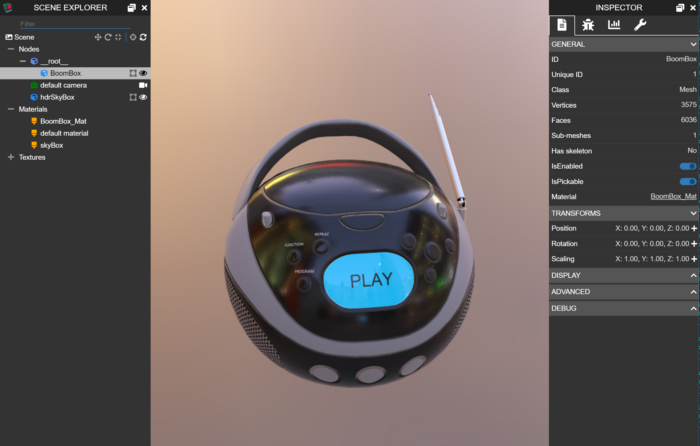
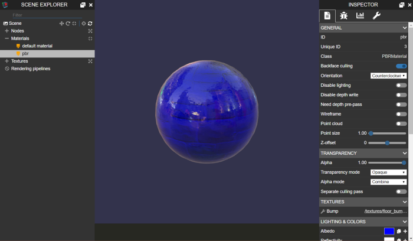
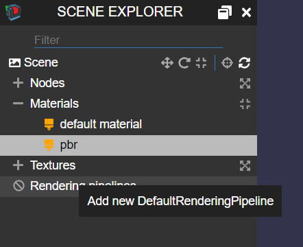
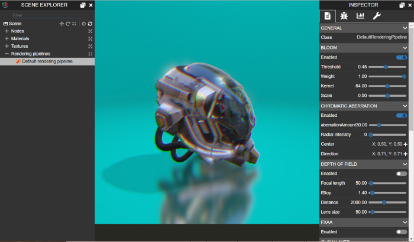

# 检查器还是编辑器？
[场景检查器](https://doc.babylonjs.com/toolsAndResources/tools/inspector)的总体目标是帮助开发人员和艺术家设置或调试场景。例如，[他们可以将glTF文件](https://www.khronos.org/gltf/)拖放到[沙箱中](https://sandbox.babylonjs.com/)，然后通过单击页脚栏中的编辑按钮打开场景检查器，以了解场景是如何构建的。

我们计划在场景检查器中添加尽可能多的工具，以便用户找到他们需要的所有武器来杀死场景中的错误。

我们还计划让场景检查器帮助艺术家设置他们的场景，以便能够测试纹理、材质、照明、环境和后期处理效果。这应该有助于他们确定场景的最终外观，并为他们提供一个快速简便的工具来测试和验证他们的资产。

例如，这里是用于配置我们强大的基于物理的材质的各个方面的[PBR属性面板](https://doc.babylonjs.com/how_to/physically_based_rendering)：

您可以尝试这个 [PBR 材质](https://www.babylonjs-playground.com/full.html#YACNQS#4) 场景，以了解场景检查器为您提供了多少控制以快速尝试材质变化。

关于我们想要添加以帮助艺术家的功能，我们最近遇到了一个有趣的困境：我们是否想让艺术家向场景中添加新元素，而不是仅仅配置已经存在的元素？这导致我们将这个问题重新表述为：编辑和检查员之间的界限在哪里？

这个问题很重要，因为设计编辑器与创建调试工具是完全不同的任务。对于编辑器，您必须为引擎的几乎每一个功能提供创建用户界面（相信我们，我们有很多！）。因此，重要的是要划清界限并设定期望，以免用户失望。

在我看来，这些极端之间的界线是检查器允许您查看和调整场景中已经存在的元素的参数，其中编辑器（例如出色的 [Babylon.js 编辑器](http://editor.babylonjs.com/)，它是 Babylon.js 的社区驱动编辑器）允许您向场景中添加新元素。

但是，和往常一样，事情并不是那么简单。在与团队，主要是与Patrick（我们的创意总监）详细讨论后，我最终改变了想法，考虑了一些可以帮助艺术家测试其资产的特定功能。

这就是为什么检查器很快就会支持向最初没有包含默认[渲染管道的场景添加默认渲染管道](https://doc.babylonjs.com/how_to/using_default_rendering_pipeline)的原因。您可以通过右键单击 Scene Explorer 上的渲染管道节点并选择 `Add new DefaultRenderingPipeline` 来添加一个：

然后通过使用属性面板，您可以控制渲染管道的所有可用功能并相应地设置您的场景：

随意[尝试](https://www.babylonjs-playground.com/full.html#10D6YT#176)这里的演示。

检查器是一个活生生的实体，它将随着 Babylon.js 不断发展。例如，我们最近添加了对突出显示用户界面元素的支持，以引起人们对新功能的注意。来吧，试试我们新的[透明涂层系统](https://www.babylonjs-playground.com/full.html#T7RUPD)。但我知道，我们将始终必须在完全从头开始创建场景和使用此工具调整现有场景的参数之间谨慎平衡。我们希望为我们的用户提供足够的功能来解除对调试和验证的阻止，但太过分会导致该工具不得不承受与功能齐全的编辑器的比较，这不是场景检查器的目的。

## 参考
[Inspector or editor?](https://babylonjs.medium.com/inspector-or-editor-6fed01781a1f)