# oncyber 文档
## 什么是oncyber？
建立自己的世界并与他人一起体验。oncyber 是一个[多元宇宙](https://oncyber.io/explore)。

作为您的 PFP 探索并与空间中的其他人联系

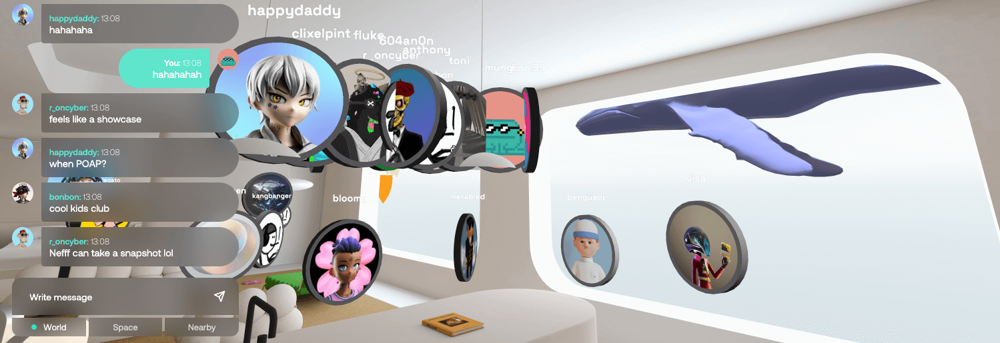
想要更改您的头像或查看世界控制？请查看下一章 [游客指南](https://docs.oncyber.io/visitors)

### 设置自己的空间
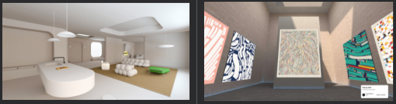

- [了解](https://docs.oncyber.io/curators/)有关策划空间的基础知识或……
- 直接进入并[建立](http://oncyber.io/create)一个免费的公寓或画廊！

### 通过沉浸式空间建立社区
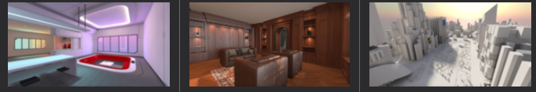

仅在 2022 年，RTFKT、Autograph 和 OM 等社区就在共享体验方面花费了 100 万多小时。

[了解](https://docs.oncyber.io/spaces/)如何创建共享的沉浸式体验来建立社区。

### 作为 3D 艺术家建造和销售空间
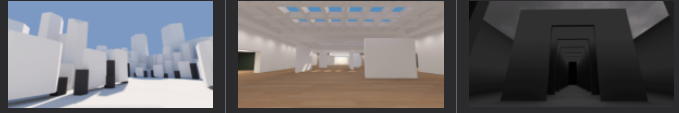

您可以自己设计和销售空间，也可以为他人建造空间。

了解如何构建网络空间,请查看[建筑家指南](https://docs.oncyber.io/architects/)。

了解如何提交网络空间,请查看[自我提交](https://docs.oncyber.io/spaces/self-publishing)。

## 游客指南
### 主页 
在主页上，oncyber 提供了许多您可以查看的体验！

- 受欢迎的空间

	其他人访问和消磨时间的热门空间
- 最近流行的空间

	最近流行的趋势空间
- 最新发布的空间

	刚刚发布的最新空间

### 头像/PFP
您可以将您的头像更改为任何 NFT！

- 连接你的钱包（它是安全的！）登录
- 点击右上角的账户设置
- 选择您的 PFP 并保存——您现在将由该 NFT 代表！

### 在世界
在世界上，访问者有一些基本的控制：

- 使用鼠标/触控板环顾四周
- 使用 WASD 或箭头移动
- 按空格跳跃
- 您可以打开门户并检查艺术品以获取更多详细信息。

	按“E”在桌面上进行交互或在移动设备上点击。
- 要打开返回门户

	请按“F”或在移动设备上点击返回中心
- 访问者可以输入 `/join [用户名]`

	从他们当前的坐标传送到在同一空间/服务器中的指定用户的坐标
- 访问者可以输入 `/feedback` 或 `/devsdosomething` 

	向 oncyber 团队提供反馈

### 亮模式/暗
默认情况下，oncyber 处于光照模式。您可以通过单击右上角的更改为灯光模式。

## 布展览人(馆长)
oncyber 提供身临其境的空间和策展工具，因此任何人都可以创建世界以与他人联系

- 登陆

	使用智能钱包（如 Metamask）登录。

	如果您没有智能钱包或想了解有关智能钱包的更多信息，您可以加入 [oncyber discord](https://discord.gg/tGJRdvZTjM)，团队成员可以帮助您跟上进度。

	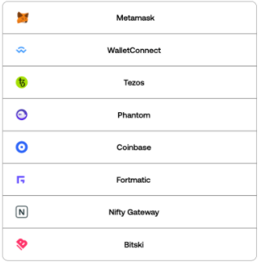
- 选择一个空闲空间

	您可以购买限量版空间，但我们建议您开始免费试用。

	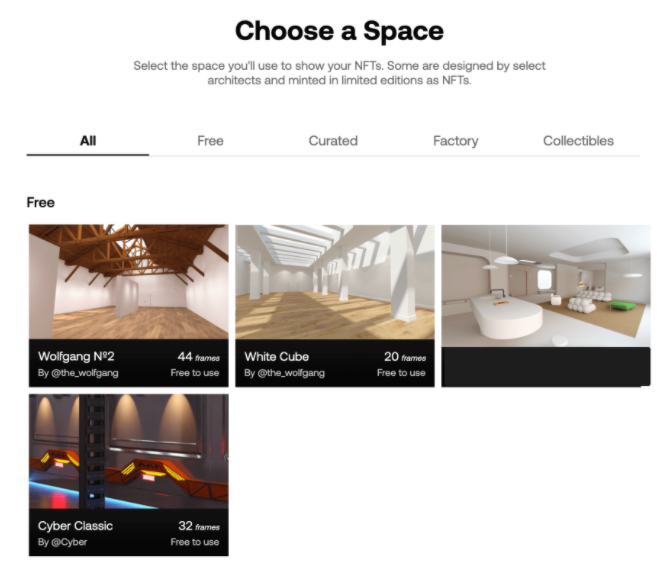
- 设置您的空间

	单击方块以从您登录的钱包中添加 NFT

	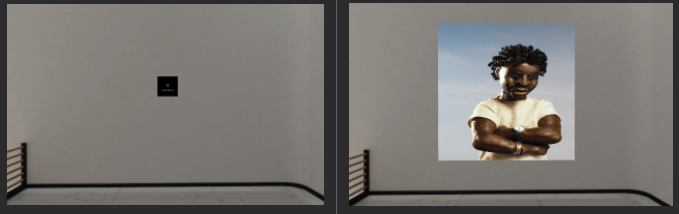
- 分享空间

	选择并保存自定义 URL，分享到朋友圈，并使用您的空间进行链接

	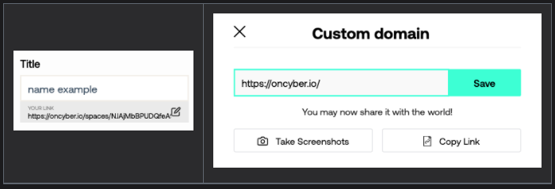

	

### 快速入门
免费建立和发布您自己的展馆。

1. 连接你的钱包

	通过此链接使用您的首选钱包登录 oncyber：[oncyber.io/create](https://oncyber.io/create)
2. 选择空间

	选择一个空闲空间并继续！
3. 挂你的作品

	单击任何 placeholder (占位符)以挂起您辛苦赚来的 NFT。
4. 给空间起名字
	- 给你的空间一个标题和一个简短的描述
	- 认领你的 oncyber.io/handle
	- 与世界分享🌐
5. 接下来的步骤

	恭喜您创建了第一个空间！

	我们几乎没有触及您可以使用 oncyber 平台构建的内容。您可以从我们的社区中发现一些令人惊叹的空间，或在此处了解有关我们功能的更多信息。
	
### 3D 工作室
我们的 3D Studio 功能的文档。

- 合作

	您可以邀请其他创作者共享您的画廊的访问权限，邀请基于钱包地址。
	
	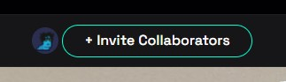
	
	您可以授予 3 种不同类型的邀请：

	|邀请|描述|
	---|---
	联合策展人|邀请某人进入您的空间来悬挂他们的 NFT
	委托人|邀请某人分享他们的 NFT 供给您的展馆。
	策展管理员|被邀请者可以访问你的 NFT，可以邀请其他人，更新空间元数据等。
	
	- 信息

		您可以通过将鼠标悬停在协作者图标上并单击“删除”来立即撤销对任何协作者的访问权限。
- 连接另一个钱包

	如果您在其他钱包上拥有其他 NFT，您可以通过将鼠标悬停在您的个人资料上并单击“连接另一个钱包”轻松地将它们链接到您的主要网络帐户。

	存储在您其他钱包中的所有资产都可以通过 3D 工作室侧边栏在您的画廊中使用。

	- 技巧

		我们支持链接不同链的钱包，您可以使用此功能将不同链的资产挂在同一个图库中。
- 高级
	1. 高级

		您可以使用高级位置将资产放置在空间中您喜欢的任何位置。

		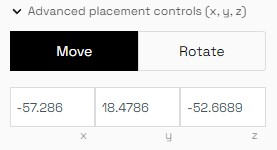

		选择您的资产，然后单击“高级位置”以在空间的任何位置移动和旋转您的作品。
	2. 定位	
		
		如果您的作品有声音，您可以控制在您的空间内可以听到音频的距离。

		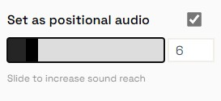

	- ONCYBER​​ 专业提示

		如果您希望整个画廊都能听到您的音乐，您可以将声音范围增加到最大。	
### 常见问题
- 我在哪里可以购买网络画廊

	您可以从免费空间开始，但如果您确实想要高级空间，您可以在 OpenSea 上购买！

	- 策划：  https ://opensea.io/collection/cyber-curated
	- 工厂：https ://opensea.io/collection/cyber-factory
	- oncyber 实验室：https ://opensea.io/collection/oncyber
- 一个画廊可以使用多个钱包

	是的！点击屏幕右上角下拉菜单中的“连接另一个钱包”，连接一个新钱包。在您单击添加艺术品后的编辑器中，您可以选择要从哪个钱包中选择。
- 如何邀请人们参观我的画廊
	- 在 3D Studio 中单击顶部栏中的预览
	- 复制链接
	- 与世界分享
	- 您还可以在编辑详细信息中自定义链接
- 我可以邀请其他人将 NFT 添加到我的画廊

	是的！

	- 点击顶部栏中的“编辑信息”
	- 在左侧边栏中，单击“协作者”旁边的“+邀请”
	- 选择您要发送的邀请类型
	- 添加您要邀请的艺术家的钱包地址（或 ENS）并生成邀请链接
	- 将邀请链接发送给您的合作者，他们只需点击几下即可加入
- 如何将音频添加到我的画廊

	将您的音频 NFT 放在您的画廊中！
- 我可以显示我铸造并已售出的资产

	是的！为此，请单击 placeholder(占位符)，然后单击侧边栏中的铸造选项卡。某些平台可能会在您铸造时使用他们自己的钱包地址，不幸的是，在这种情况下，我们无法显示这些 nft。
- 您可以连接到您的 Nifty Gateway 帐户

	是的，您可以，只需点击连接您的钱包并选择 Nifty Gateway 登录！
- 我可以在我的画廊中展示 NBA 最佳射门

	我们正在研究如何支持 Flow 区块链，以允许 NBA Top Shot 收藏家在 oncyber 上展示他们的 NFT，但目前还不可能。
- 并不是我所有的作品都出现了。我该怎么办

	确保您正在寻找正确的钱包/区块链。如果是这种情况并且刷新无法解决，请加入我们的不和谐并给我们一个提示！
- 如何展示 Mintable 中的作品

	您需要将您的资产提取到您的元掩码中，因为 Mintable 我们与 OpenSea 不兼容。这是一个可能有用的指南：  [https ://docs.mintable.app/ethereum-version/your-profile/my-nfts](https://docs.mintable.app/ethereum-version/your-profile/my-nfts)
- 如何创建第二个空间

	当您在编辑器中时，单击左上角的更改显示，然后按创建新画廊！
- 如何删除我的画廊

	目前，您的网络帐户上不可能有零画廊。如果您只有一个画廊并且想要删除它，请先创建一个额外的画廊，然后首先删除您想要删除的画廊。
- 每个画廊有多少帧

	选择要使用的画廊时，您会在那里看到帧数！
- 来自 OpenSea 的作品出现在我的资产列表中，但无法正确加载

	最常见的是，您可以通过直接在资产的 Open Sea 页面上刷新这些资产的元数据或清除浏览器缓存来解决此问题。如果这些方法都不起作用，请在#support 中开票，我们会看看如何提供帮助！
- 最佳横幅尺寸/尺寸

	800 像素宽 x 300 像素高是最佳尺寸，这样链接可以随预览出现在任何地方（Twitter、Discord...）。
- 我可以在不同的画廊使用相同的域名

	不同的画廊不能同时使用相同的域名。要使域名再次可用，您必须删除初始相应的图库或更改其名称。
- 编辑画廊移动友好

	是的！虽然在桌面系统上可能更容易做到。
- 我如何获得更大的画廊

	oncyber 上的每个画廊都有一定数量的帧。如果您在免费画廊中找不到足够大的画廊，OpenSea 上有更大的画廊。
- 如果 NFT 被转移到另一个钱包，显示中的 NFT 会发生什么

	目前，它将保留在空间中，直到您手动将其取出。如果艺术品不再属于画廊所有者，我们正在研究将其从展览中移除的机制。
- 我可以在我的网站上嵌入链接

	这是可能的！我们已经看到一些用户通过使用 iFrame 取得了成功。您必须将 iframe 的来源作为您的网络体验的自定义链接

### 故障排除
- 如果我的 NFT 无法加载或动画，我该怎么办

	请清除缓存，刷新，然后重试！如果仍然无法正常工作，请加入我们的 Discord 并开票，我们将很乐意尽快修复。
- 我找不到我放置的一块。我该怎么办

	从编辑器转到左侧的统计信息部分。从那里，您可以通过单击“操作”列中的“删除”来删除资产。\
- 并非我所有的 NFT 都出现

	刷新页面可能会成功！如果您在不同的钱包中有 NFTS，请确保您已连接每个钱包并选择了正确的钱包，如果您仍然遇到问题，请跳入我们的不和谐并让我们知道

## 建筑师指南
- 建立网络空间

	oncyber 上的所有空间都遵循相同的标准，以确保它们具有浏览器性能，并且可以与 oncyber 上的所有其他空间“互操作”。
- 技术文档：要求和可用

	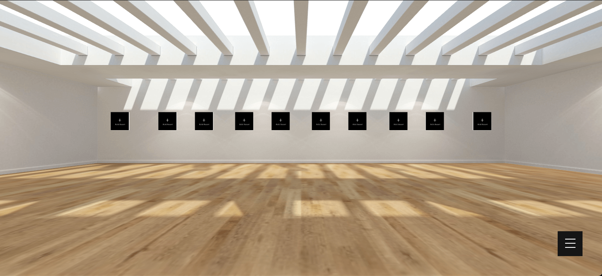

	Oncyber 空间必须满足某些技术标准——oncyber 还具有可供您用作构建者的功能，例如 NFT placeholder(占位符)，允许策展人将 NFT 添加到他们的空间和门户以创建更广阔的世界。

	阅读下一章[入门](https://docs.oncyber.io/architects/getting-started)技术文档。
- 测试

	转到 [oncyber.io/uploader](http://oncyber.io/uploader) 并将您的 GLB 放入以预览空间
- 出售

	我们正在采取措施让您在网络上出售空间。[在此处](https://docs.oncyber.io/spaces/self-publishing)查看我们的下一步。

### 入门
所有网络空间都必须遵循相同的批准标准。

- glb 文件类型
- <40mb 文件大小
- > 90fps 在一系列设备上。您必须使用纹理烘焙来满足性能需求。

#### 组织您的模型
目前，oncyber 支持 6 个根组件。

这些组件是空对象，场景中的所有网格都需要作为它们的父级，具体取决于您希望网格具有的行为和用途。

- display(展示)

	所有没有 behavior/interaction(行为/交互) 的网格都可以作为显示对象的父级。

	- 警告

		如果 collision 和 collision_invisible 没有子级，则显示中的所有网格都将用于碰撞。
- collision(碰撞)

	您需要碰撞以使访问者保持在设定的边界内。这将确保他们不会穿过物品或离开悬崖。

	当您只需要特定网格作为场景中的碰撞器时，您可以将它们添加到碰撞对象中。
- collision_invisible(碰撞_不可见)

	如果您有具有大量顶点的复杂网格，则需要将基本形状设置为碰撞。网格可以被一个盒子或任何其他基本形状包围，以便在我们的应用程序中获得更好的性能。

	- 警告

		此处添加的所有网格将在我们的应用程序中不可见。
- (Floor)地面

	在移动和编辑模式下，收藏家和参观者 `可以通过点击地板移动`。如果您想启用此功能，请在此处设置您的地板/地面网格。
- floor_invisible(地板_不可见)

	如果地板具有 `resolution/number` 高分辨率/顶点数，请创建一个简单的形状来代替。

	- 警告

		此处添加的所有网格将在我们的应用程序中不可见。
- placeholder(占位符)

	oncyber 最终用户可以在任何空间设置 NFT，但他们需要“Frames(框架)”或“Placeholders(占位符)”才能这样做。您需要将这些“Placeholders(占位符)”添加到您的构建中，方法是将它们作为占位符对象的父级。

	在建模软件中添加占位符的方法有 3 种：

	- 1.使用

		在您的建模软件中添加平面，并随心所欲地放置、旋转和缩放它们。
	- 2.启动

		在起始文件中，您可以复制占位符并根据您的选择放置、旋转和缩放它们。
- portal(传送门)

	在场景中，传送门只是简单的planes(平面)。要在我们的应用程序中启用它们的功能，您需要将它们作为portal object(传送门对象)的父级。

重要这些网格仍然需要添加到它们各自的父对象中。

#### 其他功能
为了在 onCyber​​ 中启用其他功能，我们遵循命名约定。以下是我们目前支持的一些功能的列表。

- PBR (网格后缀)

	您可以使用 pbr 作为网格名称的后缀。例如 `Pillar_001_pbr`。在 onCyber​​ 中启用 reflection(反射)。然后，您可以调整材质中的金属和粗糙度值，以获得您喜欢的效果。

	访问下面的链接并检查球体以获取使用具有不 metallic/roughness (同金属/粗糙度值) 的 pbr 的示例。

	[PBR 示例](https://oncyber.io/cybersample?coords=9.35x2.27x12.81x0.42)

	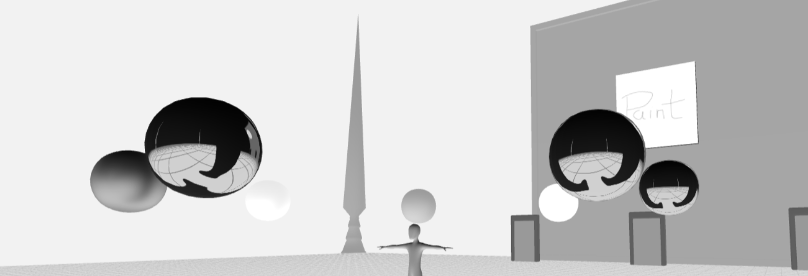
- Portal Doors (传送门)

	传送门是一个网格，将动画显示传送门的打开和关闭。

	访问下面的链接并按 E 打传送们并查看正在运行的传送门。

	[默认标准](https://oncyber.io/cybersample?coords=-14.66x2.27x-29.81x-0.39)

	要添加传送门，您需要将门网格放在显示父对象中并遵循括号中的命名约定：

	- Portal Door(传送门)(Portal_Door_001) - 一个网格，将动画显示门户的打开和关闭
	- Portal Animations(门户动画) (Portal_Close_001, Portal_Open_001) - 传送门门的打开和关闭动画。
	
### 最佳实践
- 实例

	任何具有相同几何形状和材质的网格都可以是实例网格。实例网格极大地优化了空间的性能，因此强烈建议使用它们。

	请在 blender 中创建实例网格，而不是使用 Shift+D 复制网格，请使用 alt+D。这将自动减小导出 glb 的文件大小，并允许我们检测实例化网格。
- 照明（和baking(烘焙))

	出于性能目的，我们不支持实时光照，因此任何光照都必须“烘焙”到纹理中。

	我们还支持 hdr 环境。最后，您的模型应该在我们的 [uploader](https://oncyber.io/uploader) 中提供完美的渲染。
- 🚀 导出 GLB

	在添加任何 placeholders (占位符)之前，请尝试 `添加一个 placeholders (占位符)` （如下所述），然后将 gltf（嵌入）文件上传到 oncyber [uploader](https://oncyber.io/uploader)

	我们还强烈建议您通过 [https://gltf.report/](https://gltf.report/) 运行您的模型进行压缩，  因为它会提高性能。您可以选择将纹理大小调整为 2048 像素，但出于文件大小和性能目的，我们建议使用 1024 像素。

- 🤖 大小限制(>小于40MB) 

	完成模型后，我们建议优化纹理，请尽量不要超过所有纹理的总像素数（一个大的 10k 纹理或多个小于 10k 的纹理），为了提高性能，请减小纹理大小（我们推荐 1024x1024 纹理）。

	[在此处查看示例和入门模型](https://docs.oncyber.io/architects/starter-models)。

	在 [oncyber.io/uploader](http://oncyber.io/uploader)上传以供测试和/或提交

### 样品和入门模型
#### 样品模型和
快速熟悉基础知识！

1. 在下载示例模型：

	[例子.glb](https://docs.oncyber.io/assets/files/example-a90b4ab396895a3e768e01e4aa5ccf29.glb)
2. 转到 [oncyber.io/uploader](http://oncyber.io/uploader) 并删除文件。您将在这里测试自己的构建（以 .glb 格式上传）

	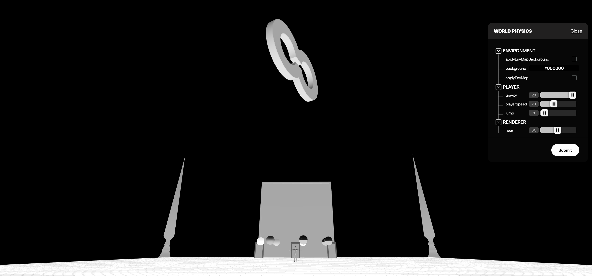
3. 打开Blender（或其他建模软件），点击导入glb

	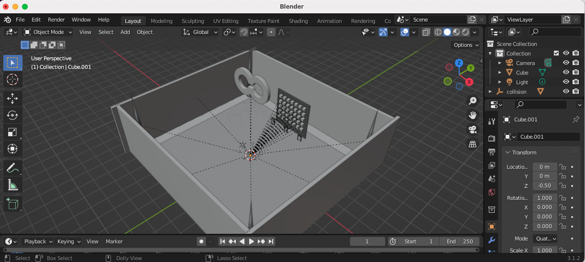

	你会注意到：

	- 比例模型
	- 将人们保持在特定水平的地板
	- 碰撞赋予对象生命并帮助您定义用户可以去哪里
	- 空间策展人可以用来放置艺术品和其他内容的占位符，以个性化空间
	- 您可以将其包含在您的空间中以自然地连接到其他空间的门户。最左侧的门户还具有一个动画门，以伴随最终用户打开门户。
	- 在显示集合中分组的对象
- 转到 [oncyber.io/cybersample](http://oncyber.io/cybersample)

	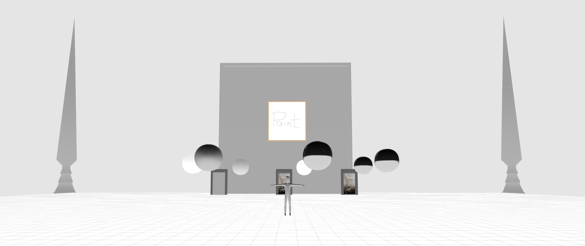

	你会注意到：

	- 观众规模
	- 阻止你跌倒的地板
	- 走到空间边缘时会发生碰撞
	- 2021 年初铸造的毕加索级艺术品，由空间策展人添加，参观者可以查看更多细节
	- 连接到空间管理员设置的其他空间的传送门，包括最左侧的动画传送门
	- 使用不同变化的 metal/metalic (金属/金属特征) 来反射人体模型周围的球体

	我们还在这里提供了一个初始构建，它只有一个碰撞平面和一个比例模型。

	使用示例文件或更空白的初始文件开始，并使用指南的其余部分获取更多战术提示！

	- [例子.glb](https://docs.oncyber.io/assets/files/example-a90b4ab396895a3e768e01e4aa5ccf29.glb)
	- [启动器.glb](https://docs.oncyber.io/assets/files/starter-6042f98189d1c45cace0574ccd11bd92.glb)

### 经常问的问题
- 什么是 oncyber，为什么需要 3D 建筑师

	oncyber 是一个世界构建引擎。个人、社区和品牌都想要自己的世界，需要 3D 建筑师的手来建造它们！
- 为什么 3D 架构师要在 oncyber 上构建

	建筑师可以将他们的创作货币化，建立他们的声誉，并发挥他们的创造力！
- 我在哪里可以申请成为网络架构师

	[在下一章](https://docs.oncyber.io/architects/design-philosophy)阅读有关成为建筑师所需条件的更多信息。
- 提交画廊的审核流程是什么样的？（测试版)

	我们正在处理提交过程的一些细微差别，但希望任何人都能够发布空间。现在，您将能够提交和使用您自己的自定义空间。我们将有一个审核流程，允许将这些空间带上链进行分发。

	每个空间都需要通过技术审查，审查文件大小（<40mb）和 FPS（在一系列设备上应该是 90+ FPS）。我们将来可能会调整此标准。
- 什么是烘焙，为什么建筑师需要了解它

	烘焙是一种允许我们通过采用低多边形方法来优化性能的技术，其中纹理被“烘焙”到模型中。所有纹理都必须烘烤。
- 建筑师目的地的文件大小限制是

	40mb。
- 必须提供什么类型的文件

	必须是 glb 格式。
- 构建网络画廊时需要考虑哪些最佳实践

	在[入门章节](https://docs.oncyber.io/architects/getting-started)查看我们的建筑指南。
- 一个目的地可以拥有多少艺术占位符是否有任何限制

	没有限制。有些空间可能只需要 1 个占位符，而其他空间可能需要 500 个。占位符是策展人向空间添加 NFT 的唯一方式。将太多的 placeholder(占位符)放在一起会鼓励用户设置税收绩效的体验。
- 我们如何对艺术进行实验，看看它会是什么样子并帮助描绘我们的愿景

	我们的团队正在寻找方法来帮助您在构建时更好地进行实验。目前，我们的审核流程不会因目的地而无法可视化艺术的影响。
- 建筑师如何确保他们创造出一个伟大的空间

	建筑师应该关注[收藏家](https://docs.oncyber.io/architects/design-philosophy)或世界建造者的需求，提供技术上合理的模型，并挖掘他们的创造力。
- 建筑师可以从哪里获得更多支持

	参与建筑师的网络 [discord](https://discord.gg/oncyber)谐频道！
	
### 建立艺术画廊时要考虑的事情
画廊空间帮助收藏家通过身临其境的 3D 体验将他们的 NFT 变为现实。在建造画廊空间时，需要考虑以下几点：

#### 1. 支持收藏家的
收藏家希望画廊足够简单，让收藏家的艺术成为展览的明星，但又足够鼓舞人心，足以成为艺术本身。

我们的精选系列提供了一个极好的参考点：每个目的地都有一个简单的设计和调色板，但呈现出令人惊叹的图像，包裹着有趣的概念。

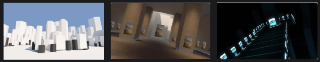

查看这些画廊中的每一个，并注意架构如何支持艺术体验，而不是试图独立成为体验：

- [创世纪的冯·米塞斯 Vault AB](http://oncyber.io/vonmisesvaultab)
- [寺庙的文森特范面团画廊](https://oncyber.io/vvd)
- [Cyber​​Kongz on Void](https://oncyber.io/coco__bear)

#### 2.想想收藏家可能希望如何强调和分组
通过为收藏家提供不同的结构和区域来使用，您可以帮助塑造收藏家可以构建的体验，使他们能够放置和强调不同类型的艺术品，并为他们提供在更广泛的收藏中策划迷你收藏展的机会。

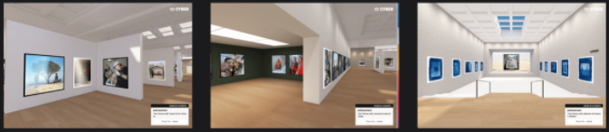

上面的画廊 Altitude 是一个很好的例子，它提供了一系列展示选项，使收藏家可以在不同的环境中展示艺术，允许收藏家将作品与其他相关作品进行分组，并使收藏家能够以不同的方式强调某些作品相对于其它的。

#### 3. 请记住，收藏家服务于参观者
画廊应该易于导航且有趣，而不是繁琐或错误！

参观者应该对建筑感到舒适和兴奋，他们应该能够轻松地导航和查看每件艺术品。建筑可以引导参观者以一种特殊的方式体验艺术，让策展人用他们的艺术讲述一个故事。

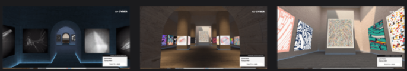

[Temple](https://opensea.io/assets/0xc86ca2bb9c9c9c9f140d832de00bfa9e153fa1e3/1) 是一个很好的例子，说明建筑如何使收藏家能够用他们的收藏品讲述故事：

寺庙画廊设有一个单独的神社，但在游客到达那里之前，他们必须沿着走廊穿过房间。他们可以看到远处的圣杯，所以他们自然会被吸引过来。Vincent Van Dough 使用圣殿的建筑来展示 Fidenza #460（见右图）。当游客在远处看到菲登扎时，他们会发疯！他们必须去看 FIDENZA。但一路上，他们穿过一个房间的聋牛作品和一个房间的ArtBlocks作品。哇！最后，他们达到了他们的目的，他们对更令人难以置信的艺术感到震惊。

寺庙建筑让 VVD 用他的艺术讲述一个故事，让来他画廊的人惊叹不已。
#### 最后
- 收藏家的艺术应该是现场的明星。专注于简单、优雅的设计，包含有趣的设置/概念。
- 收藏家有共同的模式，比如想要展示/强调他们最喜欢的作品，或者想要将同一收藏中的作品组合在一起。架构可以支持这一点！
- 建筑应该有助于创造画廊的自然流动，从而引导参观者穿过画廊，在最好的情况下，引导他们穿过一个奇妙的空间。

## 社区指南
创建和管理身临其境的体验以与您的社区互动。

3D 艺术家（metaverse 建筑师）可以在 oncyber 上为您腾出空间！空间将在发布之前进行审查，并且必须符合网络标准。您可以在此处查看和共享网络[技术文档](https://docs.oncyber.io/architects/)。

### 发布您拥有的和管理
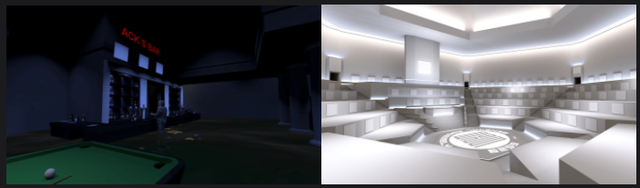

您可以发布和管理自己的 1/1 空间，为您的社区提供连接空间。

[自行发布空间以举办活动](https://docs.oncyber.io/spaces/self-publishing)

### 为您的社区成员
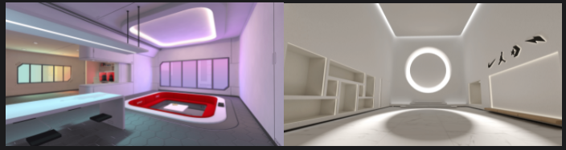

您可以空投和管理一组限量版空间，以参与和发展您的社区。

[发布和管理限量版空间常见问题解答](https://docs.oncyber.io/spaces/limited-space)

## 空间出版
空间提交概述

- 简介
	
	到目前为止，我们已经完全策划并与所有基地建设者密切合作。我们目前正在开放这个过程。作为第一步，任何人都可以使用我们的上传器提交空间并自己使用它与他人一起体验。

	很快，我们还将允许铸造和出售这些相同的空间。
- 上传者	

	前往 [oncyber.io/uploader](http://oncyber.io/uploader) 提交空间以在 oncyber 上发布。

	上传空间并单击提交后，系统会提示您提供一些详细信息。一切都应该很简单，尽管下面我们将讨论分发类型。
- 分销

	随着时间的推移，oncyber 预计将支持 3 个主要用例。选择分发类型时，您会看到三种类型：

	- 个人使用：供任何个人、社区或实体发布和使用自己的空间。
	- NFT 社区分配：供 NFT 社区向其持有者分配空间。
	- 待售清单：供 3D 艺术家向他人出售空间。

	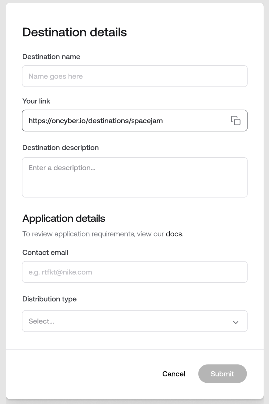

	空间出版的下一阶段将在很大程度上保持脱链，并且将是非常实验性的。

	某些 NFT 社区将有机会在短期内将空间作为 NFT 分配——这些是下一阶段将在链上存在的唯一空间。有关我们目前如何考虑 NFT 社区分布的更多详细信息，请参阅[此处](https://docs.oncyber.io/spaces/limited-space)。

	在空间发布的下一阶段，任何人都无法立即创建和销售空间，但任何人都可以使用自定义空间。oncyber 将评估自定义空间部署的使用情况，以了解可能出现的滥用情况以及可能需要哪些功能来最好地支持生态系统。

	在下一阶段使用的自定义空间将标有未经官方批准的标注。有关个人使用或列表出售选项的更多详细信息，请参阅[下一章自出版空间](https://docs.oncyber.io/spaces/self-publishing)。
	
### 自出版空间
随着时间的推移，我们希望全面开放我们的空间出版平台。

我们将采取措施以使我们能够灵活地实现这一目标，并做我们认为对我们整个由策展人、3D 艺术家、社区建设者和世界探索者组成的生态系统最有利的事情。

- 笔记

	我们在空间出版方面的下一步是实验性的

任何人都可以发布和管理自己的空间

- 转到 [oncyber.io/uploader](https://oncyber.io/uploader)
- 删除您的 glb 文件（请务必查看我们引擎的反馈）
- 提交包含您空间的详细信息
- 转到 [oncyber.io/create](https://oncyber.io/create)
- 转到上传的部分并选择该空间
- 您现在可以策划和管理空间

注意：在这个实验阶段，对于任何新提交的、非铸造的 1/1 空格，都会有一个标注，这些 1/1 空格是实验性的。oncyber 将审查该系统的使用方式并将进行调整。oncyber 目前的计划是允许用户将空间铸造为 1/1 NFT，以便完全用作普通空间。

### 发布和管理限量版空间常见问题解答
随着时间的推移，我们希望并计划全面开放空间出版和发行。

我们将采取措施以使我们能够灵活地实现这一目标，并做我们认为对我们整个由策展人、3D 艺术家、社区建设者和世界探索者组成的生态系统最有利的事情。

提供此概述是为了深入了解我们如何考虑推出下一阶段。oncyber 将在未来几周和几个月内改变这些流程。

在短期内，oncyber 将与拥有至少 1K E 数量、1K 唯一持有者和 .05E 地板的 NFT 社区合作，为他们的社区分配空间。

- 提交过程概述,提交您的构建并提供以下详细信息
	- 联系方式
	- 您的空间将如何分配
	- 链接到您的收藏页面
- 审查过程
	
	应用程序将由 oncyber 团队审查。

	为了使 NFT 社区空间有资格分发：

	- 提交的构建必须以 90+ FPS 运行，并且必须小于 40mb。
	- 您的 opensea 收藏品的交易量必须超过 1K E，拥有 1K+ 独特的持有者和 0.05E+ 的下限。

	您应该期望在提交后一周内收到 oncyber 团队的消息，以进一步讨论您的空间分配。
- 未来

	我们希望在空间出版的这一阶段能够快速学习，以便我们可以推出更开放和更接近自动化的流程。目前，我们将以非常手动的方式处理事情。

	加入我们的[discord](https://discord.gg/CXPZw4hCxt)，放下你的想法。

## 一般常见问题
- 什么是 oncyber 

	oncyber 是一个精心策划的虚拟世界，NFT 艺术家和收藏家将量身定制的沉浸式体验整合在一起供所有人探索！
- 什么是 NFT 

	NFT 是可用于表示独特物品所有权的代币。在 oncyber 的背景下，这些项目通常是数字艺术，如 JPEG 或 MP3！我们专门允许 NFT 的所有者/创建者展示他们的 NFT。
- 我在哪里可以买到 NFT 

	你可以在很多地方购买 NFT！开始的一种方法是浏览 oncyber 上的空间，找到您喜欢的 NFT，检查它以获取更多信息，您将能够在应用内购买它或重定向到其他地方购买它！
- 如何在 oncyber 上建立自己的体验

	它是免费的，而且非常易于使用！

	您只需访问 [oncyber.io](https://oncyber.io/)，点击“创建体验”并按照步骤操作即可！
- 将我的钱包连接到 oncyber 是否安全

	你打赌！我们只允许 NFT 所有者和创建者放置 NFT，因此我们验证钱包所有权以允许我们限制谁可以放置哪些 NFT！
- 虚拟现实可以体验 oncyber

	是的，oncyber 在支持 XR 的浏览器的 VR 中工作！
- 浏览 oncyber 时最好使用什么浏览器

	Chrome 是最好用的浏览器！
- 如何更改我的头像

	单击编辑信息侧栏中的编辑个人资料！
- 如果我的一个 NFT 无法加载或动画，我该怎么办

	请清除缓存，刷新，然后重试！
	
	如果还是不行，请在🎟│support-ticket中开一张票，分享您的空间链接以及相关 NFT 的链接，我们来看看！
- 我有一份来自 Foundation 的作品无法加载。什么鬼

	我们使用 OpenSea 的 API 来获取 Foundation 资产。有时你需要直接进入作品的OpenSea页面，点击右上角的“刷新元数据”，稍等片刻，应该可以添加你的Foundation作品了！
- 画廊创建后是否有时间限制

	没有！如果您愿意，您的画廊将永垂不朽。
- 我可以邀请其他人将 NFT 添加到我的画廊

	是的！

	- 点击顶部栏中的“编辑信息”
	- 在左侧边栏中，单击“协作者”旁边的“+邀请”
	- 选择您要发送的邀请类型
	- 添加您要邀请的艺术家的钱包地址（或 ENS）并生成邀请链接
	- 将邀请链接发送给您的合作者，他们只需点击几下即可加入
- 如何邀请人们参观我的画廊
	- 在 3D Studio 中，单击顶部栏中的“您的链接”
	- 自定义您自己的链接
	- 复制您的图库链接并与您的朋友分享
- 我找不到我放置的一块。我该怎么办

	从编辑器转到左侧的统计信息部分。从那里，您可以通过单击“操作”列中的“删除”来删除资产。
- 如何将音频添加到我的画廊

	将您的音频 NFT 放在您的画廊中！
- 我可以获取我铸造并已售出的资产

	是的！为此，请单击占位符，然后单击侧边栏中的铸造选项卡。某些平台可能会在您铸造时使用他们自己的钱包地址，不幸的是，在这种情况下，我们无法显示这些 NFT。
- 我在尝试放置资产时收到“加载资产失败”错误消息。我该怎么办

	如果资产来自 Foundation，请到 NFT 的 OpenSea 页面刷新元数据。否则请在🎟│support-ticket中开票并提醒我们！
- 您可以连接到您的 Nifty Gateway 帐户

	是的，您可以，只需点击连接您的钱包并选择 Nifty Gateway 登录！
- 我可以在我的画廊中展示 NBA 最佳射门

	我们正在研究如何支持 Flow 区块链，以允许 NBA Top Shot 收藏家在 oncyber 上展示他们的 NFT，但目前还不可能。
- 并不是我所有的作品都出现了。我该怎么办

	确保您正在寻找正确的钱包/区块链。如果是这样并且刷新没有解决，请在🎟│support-ticket开票
- oncyber 有 Twitter

	是的！@oncyber
- 一个画廊可以使用多个钱包

	是的！点击屏幕右上角下拉菜单中的“连接另一个钱包”，连接一个新钱包。在您单击添加艺术品后的编辑器中，您可以选择要从哪个钱包中选择。
- 我想创建另一个画廊。

	当您在编辑器中时，单击左上角的更改显示，然后按创建新画廊！
- 链支持

	目前您可以添加来自 Ethereum、Polygon、Klaytn、Tezos、Solana 的资产，我们的计划是随着时间的推移添加更多资产！
- 如何删除我的画廊

	目前，您的网络帐户上不可能有零画廊。如果您只有一个画廊并且想要删除它，请先创建一个额外的画廊，然后首先删除您想要删除的画廊。
- 为什么oncyber会滞后？开发者可以做点什么

	我们一直专注于提高 oncyber 的性能！短期内，您最好的方法是使用休息良好的电脑和 Chrome
- 每个画廊有多少帧

	选择要使用的画廊时，您会在那里看到帧数！
- 是否可以策划一个您不拥有的 NFT 画廊

	如果您正在与 NFT 的所有者合作，是的！您可以邀请他们合作或将作品委托给您展示。为此，请进入编辑器，并邀请他们作为合作者。
- 来自 OpenSea 的作品出现在我的资产列表中，但无法正确加载

	最常见的是，您可以通过直接在资产的 Open Sea 页面上刷新这些资产的元数据或清除浏览器缓存来解决此问题。如果这些方法都不起作用，请在#support 中开票，我们会看看如何提供帮助！
- 我的 NFT 不受支持。它出现在资产列表中，但当我单击

	我们目前支持 JPG/PNG/GIF/SVG、MP4、MP3、大多数 html 资产，但可能存在一些挂起资产失败的用例。如果您遇到问题，请在#support 中开票，我们会看看我们能做些什么！
- 我在哪里可以购买网络画廊

	opensea

	您可以在🌐│官方链接中找到我们的收藏和其他相关链接 什么是最佳横幅尺寸/尺寸 800 像素宽 x 300 像素高是最佳尺寸，以便链接可以在预览的任何地方出现（Twitter、Discord... ）。
- 我可以在不同的画廊使用相同的域名

	不同的画廊不能同时使用相同的域名。要使域名再次可用，您必须删除初始相应的图库或更改其名称。
- 编辑画廊移动友好

	是的！虽然在桌面上可能更容易做到。
- 画廊本身内置了什么软件

	这取决于艺术家，但通常是：Blender、Maya、Cinema 4D
- 如何在 oncyber 上建立画廊

	目前，我们正在与精选的元宇宙架构师合作，为未来的网络时代做准备。你可以在这里申请
- 如何更改我的头像

	单击编辑信息侧栏中的编辑个人资料！
- 我如何获得更大的画廊

	oncyber 上的每个画廊都有一定数量的帧。如果您在免费画廊中找不到足够大的画廊，那么在二级市场上可以找到更大的画廊。查看🌐│官方链接以找到我们的收藏。
- 如何获取我的画廊的自定义网址

	在编辑器中，您应该单击黑色顶部栏中的“您的链接”！
- 不是我所有的 NFT 都出现了

	刷新页面可能会成功！如果您在不同的钱包中有 NFTS，请确保您已连接每个钱包并选择了正确的钱包，如果您仍然遇到问题，请跳入我们的不和谐并让我们知道。
- 如果 NFT 被转移到另一个钱包，显示中的 NFT 会发生什么

	目前，它将保留在空间中，直到您手动将其取出。如果艺术品不再属于画廊所有者，我们正在研究将其从展览中移除的机制。
- 我可以在我的网站上嵌入链接

	这是可能的！我们已经看到一些用户通过使用 iFrame 取得了成功。您必须将 iframe 的来源作为您的网络体验的自定义链接
- 将我的钱包连接到 oncyber 是否安全

	你打赌！我们只允许 NFT 所有者和创建者放置 NFT，因此我们验证钱包所有权以允许我们限制谁可以放置什么 NFT！	
	

