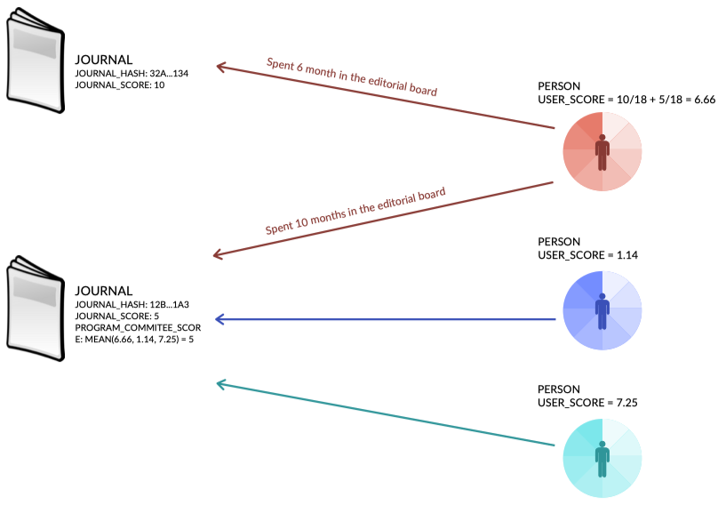
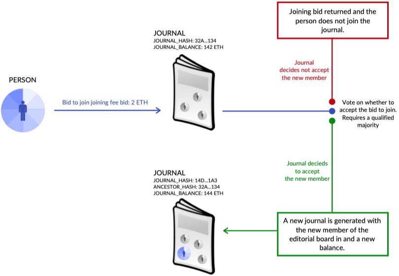
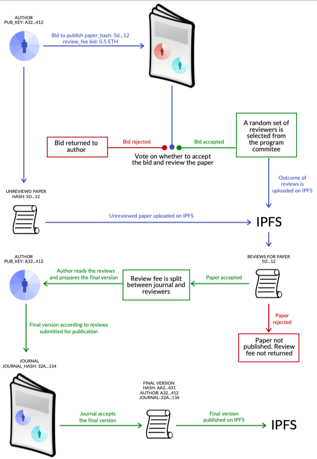
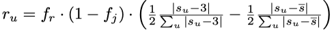
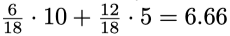
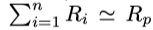

# PRINCIPIA(原则):一个分散的同行评审生态系统
(日期:2020年8月21日)

同行评审是现代科学事业的基石。然而，人们越来越一致地认为，当前同行评审制度的一些局限性，从对评审人员缺乏激励到缺乏透明度，有可能削弱其好处。在这里，我们介绍了用于科学成果(如论文、拨款提案或专利)同行评审的 `PRINCIPIA ab` 框架。该框架允许科学生态系统的关键参与者——包括现有的出版集团——通过为评论和出版建立一个自由的市场来创建和管理同行评审的期刊。《PRINCIPIA》的推荐人会根据他们的努力和评价的质量获得透明的奖励。《PRINCIPIA》 还自然地允许识别用户和期刊的信誉，它有一个内在的信誉系统，不依赖于第三方。《PRINCIPIA》重新平衡了研究人员和出版商之间的权力，促进了裁判员有价值的评价，有利于期刊之间的公平竞争，并降低了获取研究成果和发表的成本。
## 1 介绍
同行评审是由相关知识领域的专家评估科学成果的实践。它提供了一种验证机制，这对于减少发表误导性结果或虚假声明的可能性至关重要，从而为科学产出增加价值。同行评审的影响在科学过程的各个层面都至关重要。它可以影响学术生涯，并且通过顶级期刊和资助机构，它可能驱动学术趋势甚至研究领域的兴衰。

尽管其至关重要的作用，目前的同行评审有许多缺点，使其成为几十年来备受争议的问题(Culliton, 1996; Editorial, 2003; Tennant et al., 2017; Editorial, 2019a)。一个显著的例子是公众对美国国家科学基金会资助决定的批评，导致了对基础评估程序的统计分析，结果显示没有显著的证据影响资助(Cole et al.， 1977)。

使同行评审合理化是具有挑战性的:审稿人的工作本质上是基于自愿贡献的，几乎没有报告质量的激励。与此同时，学术出版是一个利润巨大的行业，在这里，劳动力

- 1) 免费生产有价值的内容
- 2) 无报酬地执行有价值的任务
- 3) 保证持续的需求

事实上，整个同行评审系统在个人层面上引发了一种社会困境，这种困境几乎无法被当前的激励因素(如期刊影响因子)平衡。

- 为什么同行要为了公共利益而合作?
- 如果他们的工作没有报酬，而出版商则从订阅或开放获取政策中获得所有利益，那么他们为什么要这么做呢?如果他们的同行可能选择不合作
- 为什么作者应该公平或产出高质量的科学成果?

对这些问题的任何理性回答都将导致次优的个人决策，导致不可靠的科学生态系统和公共悲剧。然而，行为组织和决策理论、实验经济学和调查研究几十年的结果表明，理性往往远远不是人类行为的良好模型。 (Loomes and Sugden, 1982; Simon, 1986; Tversky and Kahneman, 1989; Arthur, 1994; Simon, 1995; Kahneman, 2003).

一些研究表明，公共利益的增加，以及考虑信誉信息的编辑决策(信誉偏差)，可以帮助作者的高质量稿件的发展，而审稿人仍然缺乏正确的激励(Righi和Takács, 2017)。这是 Campanario(钟楼) 的挑衅性研究的象征，在同行评审期间，一些研究遇到了不合理的阻力，在所有时间被引用最多的文章中(Campanario, 1996)。

尽管如此，同行评审仍然被从作者到出版商的所有关键参与者视为一种通过集体努力来提高稿件质量的有效方式，而不是由少数权威个人进行的孤立的评审。事实上，只有当社会通过学术审查、精炼和验证达成共识时，知识才会成为科学的(Editorial, 2019a)。

### A. 同行评审状态
同行评审的潜在弊端已经被广泛讨论了几十年。1982年，12篇由美国著名的、高产的心理学部门的学者发表在备受推崇的美国心理学期刊上的文章，在改变作者和隶属关系后，被重新提交到18到32个月前发表过的同一家期刊上。结果是，12份报告中有9份没有被确认为重新提交，而9份研究中有8份因为严重的方法缺陷而被拒绝(Blissett, 1982)。十年后，一项精神类似的研究强调了医学研究同行评审中同样缺乏可靠性(Ernst et al.， 1993)。

最近，对同行评审的研究兴趣有所增加，但该领域在不同的研究社区中仍然是碎片化的(Grimaldo et al.， 2018)。由一个帮助学者跟踪和确认他们对科学努力的贡献的平台发布的《2013-2017年全球同行评审状况报告1》强调，这种贡献在国家和机构之间分布不均。

- 美国和日本等领先科学国家的学者在提交的文章中每人写2篇评论，
- 而中国和波兰等新兴国家的学者只写0.6篇评论。

此外，后者往往比前者更频繁地接受同行的评审请求，并更快地完成评审，尽管他们的评审平均比来自富裕地区的学者的评审短。根据同一份报告，

- 全球审稿人每年花费大约6850万小时
- 在16.4天(中值)内提供简短的评论(平均477个单词):
- 令人惊讶的是，10%的审稿人占同行评论的50%，
- 75%的编辑声称他们工作中最难的部分是找到愿意的审稿人。
- 对于41%的学者来说，同行评审似乎是他们工作的一部分，
- 尽管 71% 的研究人员不得不拒绝评审请求，因为文章不在他们的专业领域内，
- 42%的研究人员表示太忙。

过度的学术负担、缺乏审查培训和过多的请求，再加上潜在的人为偏见，可能会导致糟糕的审查，无法阻止不值得学术界考虑的研究的发表(Editorial，2019b)。同行评审过程中存在偏见的一个可能来源在于科学工作的创造者和评价者之间的联系——比如共同作者身份。有趣的是，即使属于不同的专业网络或“思想流派”，也可能导致科学家在同行评审过程中产生实质性分歧(Teplitskiy et al.， 2018)。解决这个问题的一个可能的办法是采用“双盲”同行评审，即审稿人不知道论文作者的姓名和所属单位，而不是只隐藏审稿人姓名的“单盲”系统。对于提交到计算机科学会议的论文，单盲审稿人被证明比双盲审稿人更有可能推荐著名作者、顶级大学和顶级公司的论文(Tomkins等人，2017年)。

即使是编辑，作为人类，也倾向于做出可能会受到他们当前负担影响的决定，这导致了一个弊大于利的同行评审系统，以及一个由错误激励支持的科学生态系统。这是一个典型的例子，缺乏政策来承认研究人员生产有价值的数据集。即使这种趋势正在慢慢改变( Gorgolewski et al., 2013)和可重复性研究，导致反对“数据掠夺者”研究人员使用其他同事生产和共享的数据，并将研究寄生定义为对科学的款待(Longo and Drazen, 2016)。在现实中，这些附带效应可能只是对自私的个人的一种对待，而整个集体只能从提高人类知识的可再现性和可复制性中受益(Bergstrom, 2016; Greene et al., 2017; Editorial, 2018a; Teytelman, 2018)。神经科学最近的定量证据支持这一观点((Milham et al., 2018)。

很明显，与同行评审有关的问题反映了影响科学生态系统的更普遍的问题。请注意，尽管存在所有的限制，但研究表明，资助申请的同行评审分数至少可以部分预测被资助项目的成功，通过它们的总时间调整引文输出来量化，而每个申请获得的资金数额则不等(Gallo et al., 2014)。因此，改善同行评审过程也将最终影响数十亿美元研究资金的分配。正如我们将看到的，开放整个同行评审过程并使其对任何人透明，可能只会改善目前的状态。值得注意的是，高信誉的期刊和研究团体已经意识到`数据共享是科学过程的一部分`，并要求访问他们发表的文章中使用的数据(Taichman et al., 2016; McNutt et al., 2016; Gewin, 2016; Editorial, 2018b)。

同样，开放同行评审系统以一种能够解释潜在的人类偏见和行为科学、博弈论和复杂性科学发现的方式似乎是正确的道路。开放这一过程的其他潜在好处包括，为早期职业学者提供有价值的例子，以及提供巨大的数据库，科学家可以通过分析这些数据库来发现潜在的偏见，并提出消除偏见的方法。

### B. 变体和替代方案
自2008年以来，美国物理学会对其优秀的评审人员的工作进行了认可，最近，Elsevier 和 Nature Publishing Group (Editorial, 2019c)也采用了类似的策略。

一些举措已经尝试了新颖和替代的同行评审方案，从发布报告(即评审内容)和评审人员身份(Editorial, 2018c)，即评审人员姓名，到基于群体的方法(List, 2017)。在后一种情况下，编辑提供稿件，公众有一定的时间做出回应。令人惊讶的是，每篇论文都收到了几条评论——甚至是隐藏在补充材料和支持信息中的细节——编辑认为这些评论内容丰富，可以迅速做出编辑反应。定量地说，人群的反应要快得多(几天而不是几个月)，并提供了更全面的集体反馈，得到了作者的赞赏(Editorial, 2019a)。

《eLife》期刊发表的其他举措，在精神上与之类似，也从研究界获得了对试点项目的良好回应，同时衡量了职业生涯后期的研究人员比职业生涯早期和中期的同事接受率更高。《欧洲神经科学期刊》报道称，2016年底的透明审查导致了更好、更快的报告。然而，来自不同学科的研究人员的反应不同，当有选择的时候，在进化和生态学中超过 70% 的人选择发表报告，而在物理学中只有 50% (Editorial, 2016)。一群生物学家建立了一个在线平台来跟踪这类实验，提供了一种直接的方式来比较多种标准下的试验。

一个常见的因素是同行评审报告的透明度，这可以避免来自推荐人或作者的肤浅评论或过于严厉的语气。通过开放评审过程，也可以避免编辑的滥用和出版商的掠夺性行为(例如，那些不把手稿送去评审或者即使是低质量/不可靠的评论也接受它，唯一的目的是收取费用)。此外，虽然许多研究人员支持公开评论，但公开身份被认为是潜在的危险，他们担心公开姓名可能会鼓励审稿人削弱批评或者作者可能会鼓励对他们进行报复(Ross-Hellauer et al., 2017)。然而，《英国医学期刊》(British Medical Journal)报道称，开放的评论和审稿人的身份，同时没有改变同行评论的质量，这表明审稿人没有被吓倒(van Rooyen et al.， 2010)。因此，`一个很好的折衷可能是在要求选择开放身份的同时开放评论`:事实上，匿名并不会影响这个过程(Bravo et al., 2019)，并可能避免在后续对作者的资助、工作、奖励或晋升的评估中不公平地使用。根据最近的一项研究，发表评论的潜在好处是多方面的(Polka et al.， 2018)，从鼓励有建设性的评论和为年轻研究人员提供培训的例子到保留代表领域发展的论点和观点，从建立基于透明度的信任到承认审稿人所做的重要工作。

一些期刊和平台正在以这样或那样的方式采用这些原则。Pubpeer 是一个专门讨论在期刊或预印本上发表的论文的平台。尽管大多数评论都是针对(仍然非常重要的)科学不端行为问题和改变研究结论的主要问题，但作者和读者之间仍有建设性的讨论空间，甚至还有对预印本的公开评论。这方面是至关重要的，一些期刊(包括像公共科学图书馆和ELife这样的主要媒体)现在正在接受对提交到期刊上并作为预印本发布的论文的评论，并将它们纳入编辑评估过程中。预印本和公开评论平台也可以用于覆盖期刊的目的，其中包括编辑委员会策划的已经公开、评论和修订的论文。

其他方法旨在将期刊的功能(最重要的是传播)与同行评审提供的认证分离开来。`一些平台，如 Peerage of Science  或 RUBRIQ ，提供同行评审服务，然后将修改后的稿件转发给期刊，以换取一定的费用或免费`。其他平台，如 F1000Research ，将开放的同行评审系统与出版服务结合起来，没有编辑偏见。然而，这些解耦方法的主要限制是缺乏过程中涉及的审查员的参与，这可能最终导致此类计划的失败。正如我们将在下面展示的，我们认为，开放、透明的同行评审过程的原则如果与一个稳固的信誉系统相结合，可以更好地发挥作用，通过该系统的参与者既得到奖励又承担责任。
### C. `PRINCIPIA` 的目的
《PRINCIPIA》旨在从以下几个方面改善现行的同行评审制度:

1. 裁判员有报酬。
2. 裁判员的报酬取决于其审查的质量。
3. 新期刊很容易开始，而且免费。
4. 新期刊将继承创始人(即编辑委员会)的信誉
5. 所有期刊都是开放获取的，具有成本效益。

- 第一点和第二点，将恢复研究人员和出版商之间的权力平衡，同时保证提高评价的质量和公平性。
- 第三点和第四点，将增加提供和灵活性的期刊景观，使它非常容易引导一个新的期刊。
- 最后第五点，为想要在期刊上发表论文的作者和对已发表论文感兴趣的科学家保证较低的进入门槛

## 2 同行评审市场
每个使用 `PRINCIPIA` 的人都由其 `RSA-4096` 公钥唯一标识。

任何团体的人都可以通过担任编委会成员的身份加入和组建期刊。因此，在 `PRINCIPIA` 中，一个期刊是由一组公钥识别的。

编委会有以下作用:

- 它会审查提交给期刊的论文，并决定论文是否应该被接受
- 它决定是否允许其他人加入编委会
- 它设定了期刊的规则(见第三章b节)

这些行动使用第四节解释的共识规则执行。

`PRINCIPIA` 框架根据参与编辑委员会的人给期刊分配信誉分数。第五节解释了其机理。

- 为了向期刊提交论文，作者必须发表它(参见第七节关于可能实现的细节)。
- 然后，他们通过附加论文的散列和对审议费的出价，向期刊执行发表请求。
- 编委会将采用第四节.C 中解释的协商一致机制进行投票并决定是否接受出价，并考虑对论文进行审查。
- 如果投票是正面的，那么从编辑委员会的人员中随机生成一组审稿人。审稿人将执行他们的评审并发布它。根据第四节.d中解释的规则，论文将被接受或拒绝。
- 在作者收到书面评论后，他们将撰写最终版本，发表它并再次提交给相同的审稿人进行最终的接受投票。
- 审议费将在期刊费和根据第四、e节所述的对优秀评论的奖励机制分配给审议员的数额之间进行分配。

### A.与现行同行评审制度的差异
现行的同行评审制度与 `PRINCIPIA` 有许多实质性的区别。《PRINCIPIA》期刊的编辑委员会对其进行了唯一的识别。这就创建了一个流动系统，在这个系统中，出版物的信誉由出版物发布时担任编委会的人员来确定。这比目前通过历史记录来确定期刊信誉的系统更加灵活，并且将有助于更容易创建新的高质量期刊，因为它将减少引导期刊信誉的难度。当然，拥有强大品牌的知名期刊也可以加入《PRINCIPIA》，他们的信誉仍然会在《PRINCIPIA》的系统之外得到认可。另一方面，在这个体系内，他们的信誉将仅仅基于他们编委会的信誉，就像其他任何期刊一样。

与现行制度的另一个显著区别是，裁判员不会免费工作。他们将获得部分审查费，他们所做的工作审查论文。此外，他们将根据第四. e节所述的制度编写详细和高质量的评论，以此来激励他们。

在《PRINCIPIA》中，作者和期刊之间重新建立了平衡。事实上，虽然作者可以寻找最合适的期刊来发表他们的工作，但我们设想了一个系统，在这个系统中，期刊对论文进行竞标，以吸引那些(最初被认为)具有高质量科学产品的作者。
### B.费用市场
在《PRINCIPIA》中，费用不是固定的，而是由市场决定的。有两种费用:

- 一种是审议费，由作者出价，让他们的论文被期刊审查;
- 另一种是入会费，由加入期刊编委会的人出价。

作者将不得不出价审查费，以使他们的论文被期刊审查。这与现行的论文发表时支付稿费、稿费固定的制度有所不同。我们认为，通过将报酬转移到评审级别，作者将受到激励，只提交他们有足够信心的论文。此外，这将阻碍期刊为了收取出版费而接受尽可能多的论文。我们相信该系统将提高提交的工作质量，并将使审稿人从审查许多低质量的论文中解放出来。此外，为评论付费而不是为发表付费，可以将一笔费用分配给完成大部分工作的阶段(事实上，一篇论文在经过审查后发表的成本比执行审查的成本低)。

保持评审费的可变，并通过竞标分配，创造了一个期刊争相获得最佳论文的市场。一个作者可能会向少数几家期刊提出同样质量的论文，最终决定把它提交给允许他出价最低审议费的期刊(或者甚至会付钱让他有机会审议稿)。当然，这也为低质量的论文被接受审查的可能性打开了大门，因为作者出价很高的审议费。这是可能的，但由于被接受审查并不保证发表，因此缺乏动力。事实上，如果论文不好，编委会就没有动力接受它发表，因为它会降低期刊的信誉(见第五节)。

类似的情况也发生在加入期刊编委会的费用上。一方面，如果一个名声不好的人出价很高，期刊可能会接受他/她进入编委会。另一方面，信誉系统会抑制这些行为。当然，以市场为基础的入会费将允许期刊竞争最优秀的人加入计划委员会。一个信誉低的人可能需要付费才能加入一个好的期刊，但一个信誉高的人可能最终会被付费加入一个期刊的计划委员会。

## 3 系统架构
在本节中，我们将详细描述 `PRINCIPIA` 框架的实体
### A  个人
在 `PRINCIPIA` 中，一个人就是一个公钥(ppk)。由于我们将在第五节中解释的信誉系统，因此每个公钥与一个真实的人强烈连接是非常重要的。因此，密钥需要由可靠的机构进行验证，这与政府发布的数字签名类似。
### B  期刊
期刊是公钥、对其祖先期刊的引用及其参数值的集合。期刊的参数包括:

- 保留在期刊上的审查费用百分比(Fj)
- 审查员是否应该匿名(aj)

下图 `PRINCIPIA` 中期刊和个人之间相互作用的示意图。

- 执行审查的最长时间 (t j)
- 每篇论文的审稿人数量（nj）
- 接受一篇论文进行审查所需的合格多数人数（r j ）
- 花费期刊余额所需的合格多数人数。 (pj)
- 修改期刊所需的合格多数人数 (mj) [这必须高于 p j ]

创建期刊时，它需要编辑委员会所有成员的签名。

可以通过创建新期刊并将旧期刊设置为其祖先期刊来更改期刊的任何元素。 为了使新期刊的创建有效，应根据第四节中所述的规则出现一定数量的祖先期刊成员的签名。 这意味着期刊参数或期刊编辑委员会的任何变化都会触发新期刊的创建。 不可能在祖先期刊上发表，但旧出版物仍将连接到旧期刊。 这样，每篇出版物总是与出版时的期刊状态相关联。

每个期刊都有一个期刊余额，包括来自审稿费的资金，不包括给审稿人的部分。 余额可用于支付期刊的费用（例如广告或邀请某人加入期刊）。 花费期刊钱包中的资金需要编辑委员会的合格多数成员的签名（由期刊的参数 pj指定）。 由于花费期刊帐余额所需的多数低于修改期刊所需的多数，因此每次创建新期刊时，其祖先的期刊钱包的余额可以（并且应该）转移到新期刊的钱包中 期刊。 示意见上图 。

### C. 论文
论文是由其哈希标识并由作者签名的已发布文档（有关可能实现的详细信息，请参见第 VII 节）。 一篇论文的审查和发表要经过第四节中解释的程序

下图 在 `PRINCIPIA` 中扩展现有编辑委员会的过程示意图。

## 4 共识
### A. 修改期刊
期刊的修改会触发以旧期刊为祖先的新期刊的创建（如第 3.B 节所述）。 修改由定义为期刊参数 mj的合格多数批准。 在编辑委员会中添加或删除人员是对期刊的修改。 更改期刊的参数之一（例如每篇论文的审稿人数量）也是对期刊的修改。 唯一不需要合格多数的期刊修改是当编辑委员会成员决定离开期刊时，可以单方面进行，无需获得期刊的任何批准。 有关此过程的示意图，请参见上图。
### B. 加入期刊
为了让一个人加入期刊，它需要支付加入费。 这将触发期刊修改事件，该事件需要得到期刊的合格多数 (m j) 的批准。 如果该人被允许加入期刊，投标金额将存入期刊的钱包，否则金额将退还给投标人。
### C. 接受论文进行审查
一个人可以通过支付审查费来要求期刊审查其论文。 一篇论文被定义为期刊参数 r j的合格多数接受审查。 如果论文被接受审稿，并且作者确认他想继续审稿，则随机选择 nj个审稿人，他们将对论文进行审稿。 如果期刊想保持审稿人的匿名身份（如参数 aj ），将使用基于环签名的系统来分配审稿人。
### D. 决定一篇论文是否应该发表
每个审稿人都会对论文进行审阅，并在 1 - 5 之间分配分数 u。如果平均分数 s 大于 3，则该论文被接受发表。

下图 PRINCIPIA 中的审稿人接受/拒绝论文和奖励的审阅过程示意图。

### E. 如何在审稿人之间分摊审稿费
审查拆分是这样划分的：

- fj 百分比进入期刊的钱包
- 其余部分在每个审阅者 u 之间分配。
- 每个审阅者收到的资金数量等于 r u 其中 ru 使用以下等式计算

	
	
这个想法是奖励“共识”，即奖励与其他审稿人的平均分数一致的审稿人，同时不鼓励分数接近 3 并迫使审稿人采取立场。(整个过程的示意图如上图所示)

## 五、信誉体系
`PRINCIPIA` 中的每个用户都有一个信誉分数，该分数取决于他/她担任编辑委员会成员的期刊。 同时，每个期刊都有一个信誉分数，这取决于它发表的研究的影响力。 由于对期刊的修改（包括编辑委员会的变化）会触发新期刊的创建，因此该期刊的分数将不依赖于其祖先期刊，我们还为编辑委员会定义了一个信誉分数，它将成为判断期刊质量的主要分数。

### A. 期刊分数
该期刊的评分灵感来自 (Alguliyev et al., 2015) 中描述的加权影响因子。 

- 分数的计算方法是该期刊上发表的所有论文的引用次数除以该期刊发表的论文数。 
- 被引次数由发表施引论文的期刊的编委分数加权（参见第 5.C 节）。

请注意，论文的修改会触发新期刊的创建（参见第 3.B 节），因此该分数仅考虑在该期刊上发表的论文，忽略了祖先和后代期刊。 另请注意，权重是使用编辑板分数计算的，而不是期刊的分数。

### B. 用户评分
作为审稿人的用户的得分是作为其担任编委成员的期刊的期刊得分的加权平均值计算的。 平均值由他或她在委员会中度过的时间加权。 因此，例如，在期刊中服务 6 个月且期刊得分为 10 且在期刊中服务 12 个月且得分为 5 的用户，其得分将为

### C. 编委评分
编辑委员会分数是分配给期刊编辑委员会的分数。 它是判断期刊质量的主要分数。 它计算为编辑委员会中服务的用户的平均分数。
### D. 信誉系统的激励/抑制
该信誉系统根据用户担任编委的期刊的信誉为用户提供信誉。 这会激励用户加入具有较高信誉的期刊。

同时，期刊的信誉取决于所发表论文的影响力，这应该鼓励期刊发表高质量的论文。

用户的信誉不取决于他/她作为作者发表的论文。` PRINCIPIA` 将一个人作为作者的信誉与他们作为审稿人的信誉分开。 我们希望专注于改进同行评审系统，并奖励能够区分高质量论文和低质量论文的用户。 我们相信这是使一个人成为优秀编辑委员会成员的原因，我们希望该系统能够在期刊之间进行竞赛，以充分利用它们。 我们相信这将提高出版作品的质量。

## 6  一个最小的去中心化同行评审系统
虽然期刊是同行评审生态系统的关键参与者并且需要成为其中的一部分，但一开始可能很难将它们纳入 `PRINCIPIA`。 因此，人们可能会考虑一个两步过程，其中 

- i) 同行评审系统是分散的，以及
- ii) 创建新期刊

在本节中，我们提出了一个与` PRINCIPIA `完全兼容的替代分散同行评审系统，而不包括新期刊的形成。

### A. 系统架构
该系统的体系结构类似于第 3节中提出的体系结构。 `PRINCIPIA` 中的每个人（科学家）都是一个公钥。 同行评审过程中的每位科学家都可以担任以下两种角色之一：

- 提交评审的论文的作者
- 或该论文的评审人。

每个科学家 i 都关联了几个关键字，表明他们的专长、信誉分数 RSi 和审查费用 R i 。 每位科学家的关键词最初通过他们的发表记录进行验证并根据所审查的论文进行更新。 

RS 最初对每个人都是平等的，并且完全独立于科学家的发表记录。 科学家 i 的审查费 R i 是他们要求进行审查的价格。 这将取决于他们的 RS i （参见第 VI.B 节）：RS i 越高，可以要求的 R i 费用越高。

论文是由其哈希标识并由作者签名的文档。 作者通过竞标论文评审费 R p 将论文提交给同行评审系统，并附上相关的关键字来指示该领域。

### B. 同行评审过程
提交论文后，系统会尝试将论文分配给潜在的审稿人，方法是将作者的 Rp 出价与科学家在市场上要求的论文领域的审稿费相匹配（即，还将论文的关键词与潜在的审稿人匹配） 审稿人的关键词）。 也就是说，系统尝试通过选择 n >= 3 个审阅者的池来求解方程 

 选择这些审稿人也是为了混合 RS，与作者的 Rp 投标兼容。 该系统还限制了分配给每个科学家的最大审稿数量，以避免给单个审稿人带来过多的负担，并避免审稿人要求低 R 费用来获得过多的审稿。 如果可能匹配，则接受该论文进行审查并分配给审稿人。

同行评审过程如下进行：

- 在步骤 1 中，选定的审稿人独立进行评审，并为论文打分，代表其质量。
- 在第 2 步中，选定的审稿人阅读其他审稿人的报告并给他们打分，判断报告的质量。
	- 对于每个审阅者 i，计算其平均报告分数。
		- 如果超过某个阈值，则审稿人收取所要求的 Ri费用。
		- 如果没有，则该 R i 费用将退还给论文的作者。

		这样，就没有动机对其他审阅者的报告给予低分或高分来收取费用。
- 然后，每个评论者的信誉分数 RS 会根据他们的报告获得的平均分数进行更新。

这样，审稿人就有动力产生高质量的报告，见第 4.C 节。请注意，相对于当前的同行评审过程，第 2 步对审稿人来说是一个额外的负担，但相对较轻，因为审稿人已经在第 1 步审阅过论文，因此他们可以轻松判断其他报告的质量。

一旦步骤 2 结束，就会计算论文 S p 的平均同行评审分数。 如果它高于某个阈值，`该阈值对于不同领域可能是不同的`，则该论文被系统接受为“同行评审”。 `否则它会被撤回并消失`。 如有必要，可以考虑作者和审稿人之间的进一步互动，就像在当前的同行评审过程中一样，以达成共识。

- 论文被接受后
	- 一旦一篇论文被系统接受，它连同它的相关分数 S p  、（匿名）报告、分配给每个报告的分数（表明其质量）以及 n 个审稿人的信誉分数 RS 一起公开。 这些要素（论文分数、报告、报告分数和审稿人的信誉分数）证明了论文的质量。 
	- 此时，作者可以将论文提交给期刊发表，期刊可以根据同行评审系统认证的论文质量竞标发表他们感兴趣的论文。 作者还可以决定将论文留在系统中，而不是在任何期刊上发表。

### C. 信誉系统和激励措施
每个科学家的 RS 是同行评审系统的核心。 它代表了他们作为审稿人的声望，就像 h-index 或引用次数可能代表他们作为作者的声望一样。
	
	请注意，这两个量是完全独立的。
科学家有动机增加他们的 RS 以要求更高的 R 费用，见下文。 如第 4.B 节所述，每次审查的 RS 都会根据审查员报告收集的平均分数增加。 因此，审稿人有两个动机来制作高质量的报告：

- i) 收取 R 费（低质量报告不支付），
- 以及 ii) 获得高分并增加他们的 RS。 

这些激励措施有望解决当前同行评审系统中最重要的问题之一，即低质量的报告。

与 `PRINCIPIA` 一致的是，R 费用和 R p 出价不是固定的，而是由市场决定的，也就是说，审稿人（作者）可以询问（出价）他们喜欢的任何费用。同行评审系统是一个真实的市场，将作者的同行评审服务的需求与审稿人提供的同行评审服务的供给相匹配。

审稿人有动机进行审阅以增加他们的 RS。为了获得论文供审阅，他们有动力要求低 R 费用与论文作者提供的 R p 费用轻松匹配。请注意，匹配关键取决于审稿人的 RS：如果审稿人要求的 R 费用与其 RS 不一致，他们就不会获得任何要审阅的论文。因此，审稿人有动力要求与他们的 RS 一致的 R 费用。一旦他们的 RS 增加，他们可以要求更高的 R 费用。

	请注意，系统限制了科学家的最大评论数量，因此没有人有动力要求太低的 R 费用。
综上所述，审稿人会要求根据市场确定他们的 RS 和专业领域（相关关键字）的 R 费。要求高于市场价值的 R 费用不会让任何论文进行审查。

同时，作者有动力出高 Rp 费来吸引高 RS 的审稿人，而审稿人可以收取高 R 费。 

	但是，请注意，这并不能保证获得积极的同行评审结果，并获得良好的论文分数。 
同样，作者将根据他们想要的审稿人的质量出价由市场确定的 Rp 费用，并由审稿人的 RS 认证。 低于市场价值的 Rp 费用出价不会获得任何审查者。

为了帮助匹配过程，系统可以根据市场上针对论文特定领域要求的当前 R 费用，建议与论文相关联的“公平” R p 出价，以确保审稿人的安全。

## 7 作为区块链解决方案的实施
实施 `PRINCIPIA` 需要解决以下问题：

- 如何处理费用支付（审稿费和期刊加入费）
- 在哪里存储论文和评论
- 如何实现以及在哪里运行协议的实现

一个可能的解决方案是建立一个处理上述所有方面的非营利基金会。 该基金会将开发代码、托管平台、处理文件存储以及审查和处理所有以主要货币支付的款项。 这将类似于 Wikipedia 背后的模型。

这种集中的方法将暴露出不小的财务问题，因为基金会必须处理大量的费用。 Morover 将整个学术出版系统掌握在基金会手中可能会导致基金会管理方式的利益冲突，这可能导致审查、破坏和缺乏透明度。

我们认为 `PRINCIPIA` 将受益于在支持智能合约的平台上运行的实现，例如以太坊，以及使用去中心化存储来存储论文和评论，例如 IPFS（Benet，2014）,哪些文件是通过哈希识别和检索的一个点对点分布式存储系统

如果该协议是在以太坊上使用智能合约实现的，则所有支付都可以使用以太坊平台支持的任何代币（包括以太币）自动处理，因此基金会不必处理支付处理。 此外，该过程将是完全透明的，因为可以检查智能合约的代码，并且协议的所有步骤都是公开的并且无限期地存储在区块链上。

基金会将无法控制该系统，从而避免权力集中和利益冲突。

区块链解决方案也有缺点，例如 性能、开发成本和灵活性． 仅当需要解决特定的信任问题时才应使用区块链。 我们设想 `PRINCIPIA` 成为整个同行评审系统可以在其上进行的系统，因此我们认为区块链解决方案将带来的额外复杂性通过系统变得抗审查、无需许可、透明和去中心化来平衡。

根据最近的一份报告（Science and van Rossum，2017 年），学术交流目前面临的一些最突出的问题——例如，成本、开放性和科学信息的普遍可访问性——可能会通过基于区块链的适当流程来解决。 事实上，最近已经提出了许多不同的基于区块链的同行评审。

`Pluto networks` 冥王星网络旨在提供一个可以发表和审查研究的生态系统。 论文可以由系统中的任何参与者发表，并且不存在期刊。 我们认为这个过程有局限性，因为它为审稿人提供了审阅其专业知识之外的作品的可能性。 此外，完全取消期刊的概念将不允许当前的编辑参与系统，导致系统引导困难。

`ScienceRoot`  旨在定义一个基于区块链的研究资助和出版物系统。 尽管与 `PRINCIPIA` 有一些共同点，但 ScienceRoot 并没有解决 PRINCIPIA 旨在解决的一些问题。 没有信誉系统，没有解决少数期刊权力集中的问题。 此外，ScienceRoot 缺乏激励良好评论和创建优秀期刊的激励机制。

`Blockchain For Peer Review`  也在开发基于区块链的同行评审系统。 此外，该系统并未解决 `PRINCIPIA` 旨在解决的所有问题，例如没有流动的信誉系统，并且该系统还缺乏重新计算审稿人的流程。

`Ledger Journal`  是一份同行评审期刊，发表有关加密货币主题的研究文章。 Ledger 的目标不是取代整个同行评审系统，尽管它包含一些有趣的元素，这些元素也包含在` PRINCIPIA` 中。 例如，论文由作者进行数字签名，发布时间戳发布在区块链上。 此外，评论与论文一起发表。

`PROBO` (Furlanello et al., 2017) 是一种基于区块链的解决方案，用于解决可重现数据分析的问题。 与 ScienceRoot 和 PLUTO 类似，PROBO 没有提供奖励/抑制系统来奖励良好行为。

(Extance, 2017) 中讨论了一些关于使用区块链改进科学过程的批评。这项工作主要对使用区块链存储和收集数据至关重要，因为“研究应用的成本将比加密货币增长得更快，因为现代科学产生了更多的数据。”。 `PRINCIPIA` 并不打算在区块链上发布任何数据，因为它只专注于提供一个透明的同行评审系统。区块链上的存储非常昂贵，`PRINCIPIA` 只会将评论和所有交易的结果存储在区块链上。评论本身和论文将存储在分布式存储系统上，因此可以限制维护系统的成本。

在`PRINCIPIA` 中，只有当提交的数量增加超过审稿人的数量时，出版成本才会增加。由于部分审稿费将归审稿人所有，这将激励更多审稿人在审稿成本增加时加入系统，从而以类似于共享经济应用中使用的动态定价系统的方式重新平衡需求和报价（ Uber、Airbnb、Deliveroo……）

文章还建议使用私有许可区块链来降低成本和功耗。这是一个不涉及特定应用程序的问题，而是安全性和功耗之间的权衡，它影响了大多数当前的区块链实现，并且超出了本文的范围。私有区块链并不能完全解决信任问题，因此不是实施 `PRINCIPIA` 等系统的可行解决方案。

文章还提到了存储不变性的问题，因为分布式存储上发布的内容无法删除。当发布敏感数据时，这可能会出现问题，但 `PRINCIPIA` 的情况并非如此，因为只有审查结果和交易才会存储在分布式存储中。
## 8 结论与展望
围绕同行评审系统的公开辩论蓬勃发展，引发了大量新提案，以改进当前模型并克服其局限性。 有趣的是，正如我们在此建议的那样，其中一些提议是由区块链技术实施的。 本白皮书远没有涵盖该领域广泛、快速增长的文献，而是提出了一个新颖的同行评审框架，对科学生态系统的所有关键参与者开放。 我们的建议是围绕着旨在为同行评审服务和出版物创造市场的一些原则而建立的。 `PRINCIPIA` 允许审稿人获得奖励，从而提高审稿质量，并通过降低准入门槛打开出版市场。 虽然我们在一个连贯的架构中巩固了这些原则，但这种实现的细节仍然有待讨论。

我们提出了两种不同但部分兼容的 `PRINCIPIA` 实现，

- 一个完整的系统，包括对新的流动期刊如何工作的详细描述
- 以及独立于新期刊创建的同行评审系统的最小实现。

这两项提案都围绕两个关键要素建立：

- 内在信誉系统
- 同行评审服务的分散市场

这些成分旨在克服当前系统的主要限制，以及其他框架的潜在限制。正如在引言中所讨论的，确实，一些提议包括至少部分地这里提出的原则，特别是透明、开放的同行评审系统的想法。虽然有些正在蓬勃发展，但其他一些，例如 Axios Review，`由于缺乏参与同行评审过程的科学家的参与而失败了`。我们相信，这里提出的内在信誉系统（奖励和责备审稿人）可以让科学家加入 `PRINCIPIA`。从长远来看，通过评论获得的信誉可以构成科学家整体信誉的一部分，就像引用与作者信誉相关一样。

另一方面，创建同行评审市场将激励 

- i) 审稿人提高其报告的质量，并因此获得奖励，以及 
- ii) 作者通过投标适当的审稿费来判断其论文的质量 . 

这是相对于当前系统的另一个有趣的差异，在当前系统中，作者的理性总是将论文提交给信誉最高的期刊，因为只有在接受的情况下才会收取费用，而同行评审过程不支付 - 在大多数与 STEM 相关的期刊中最少。

两种提议的架构以略微不同的方式实现这些成分，每一种都有自己的优势和局限性。 包括期刊在内的整个系统将用户的信誉与他们所服务的期刊的信誉联系起来，而这又取决于在这些期刊上发表的论文所收集的引文。 因此，用户的信誉最终取决于他们所服务的期刊上发表的论文的质量。 这种机制在原则上类似于当前的系统，而不同之处在于期刊现在是流动的并且更容易启动。 因此，预计用户可以随时自由加入和离开期刊的期刊市场会刺激用户加入提供更好同行评审服务的期刊，从而吸引更好的论文，最终提高用户加入的信誉。 

相反，在 `PRINCIPIA` 的最小版本中，独立于新期刊的创建与信誉系统是同行评审市场内生的，因此完全独立于发表论文的质量，仅取决于评论的质量。 一方面，这种内生机制存在自我参照的风险，这是基于审稿人为同事的报告分配公平分数的事实。 然而，这与同行评审本身的原则相同，评审者被信任公平地评估论文。 另一方面，用户的信誉得分与他们的报告质量直接相关这一事实激励了高质量报告的产生。

两个提案之间的同行评审市场的运作也有所不同。 虽然在这两种情况下，作者都被鼓励根据论文质量出价支付审稿费，但确保这种激励的机制略有不同。 在包括期刊在内的整个系统中，作者向期刊投稿，因此所提供的审稿费必须与期刊的信誉保持一致。 这里可能的限制是鼓励期刊接受许多投稿以收取审稿费（因为如果被拒绝，这笔费用不予退还），然后只发表好的论文，以保持较高的信誉。

相反，在最小的同行评审市场中，作者直接向市场提交论文，因此获得的审稿人的质量（由他们的信誉得分决定）直接取决于提供的审稿费。

最小同行评审系统的提议源于这样一个事实：包括期刊在内的整个系统

- 首先需要科学家创建期刊
- 其次是同行评审市场，因为审稿人是从期刊编辑委员会中选出的。 

因此，期刊市场的创建——至少在概念上——先于同行评审系统的创建。 这是一个可能的限制，因为为了加入期刊，用户需要支付期刊费用。 这可以看作是一种投资：提供的期刊费用越高，期刊加入的越好，因此将来作为编委会成员（作为审稿人时）收取更高的审稿费。 因此，通过期刊市场创建新的、流动性期刊的过程可能会很慢，还因为成为期刊编辑委员会的一员需要额外的同行评审工作（接受/拒绝论文和潜在的新成员）。

结合这两个建议的一个可能的解决方案是首先启动同行评审系统的最小版本，然后一旦科学家的信誉分数开始增加和多样化，科学家可以通过竞标他们的信誉分数来创建流动期刊。 这样，优秀的审稿人就会加入并形成高质量的期刊。

## 文章参考
- B. J. Culliton, Nature Medicine 2, 1161 (1996), URL https://doi.org/10.1038/nm1196-1161。
- 社论，自然免疫学 4, 297 (2003), URL https://doi.org/10.1038/ni0403-297。
- J.P.坦南特，J.M.杜根，D.格拉齐奥廷，D.C.雅克，F. Waldner, D. Mietchen, Y. Elkhatib, L. B. Collister, C. K. Pikas, T. Crick 等人，F1000Research 6, 1151 (2017), ISSN 2046-1402, URL https://f1000research.com/articles/ 6-1151/v2。
- 社论，自然催化 2, 279 (2019a)，网址 https://doi.org/10.1038/s41929-019-0276-9。
- S. Cole、L. Rubin 和 J. R. Cole，《科学美国人》237, 34 (1977), ISSN 00368733, 19467087, URL http://www. jtor.org/stable/24953961。
- G. Loomes 和 R. Sugden, The Economic Journal 92, 805 (1982), ISSN 00130133, 14680297, URL http://www. jtor.org/stable/2232669。
- H. A. Simon, The Journal of Business 59, S209 (1986), ISSN 00219398, 15375374, URL http://www.jstor.org/stable/2352757。
- A. Tversky 和 ​​D. Kahneman，使用微型计算机进行多标准决策和风险分析（Springer Berlin Heidelberg，1989 年），第 81-126 页，URL https://doi。 org/10.1007/978-3-642-74919-3_4。
- W. B. Arthur, The American Economic Review 84, 406 (1994), ISSN 00028282, URL http://www.jstor.org/stable/2117868。
- H. A. Simon, 政治心理学 16, 45 (1995), ISSN 0162895X, 14679221, URL http://www.jstor.org/stable/3791449。
- D. Kahneman，美国经济评论 93，1449 (2003)，网址 https://doi.org/10.1257/000282803322655392。
- S. Righi 和 K. Takács，Scientometrics 113, 587 (2017)，网址 https://doi.org/10.1007/s11192-017-2244-y。
- J. M. Campanario, 美国信息科学学会期刊 47, 302 (1996), URL https://doi.org/10.1002/(sici)1097-4571(199604)47: 4<302::aid-asi6>3.0 .co;2-0。
- M. Blissett，行为与脑科学 5, 203 (1982)，网址 https://doi.org/10.1017/s0140525x00011262。
- E. Ernst、T. Saradeth 和 K. L. Resch，Nature 363, 296 (1993)，网址 https://doi.org/10.1038/363296a0。
- F. Grimaldo、A. Marusic 和 F. Squazzoni，PLOS ONE 13, 1 (2018)，网址 https://doi.org/10.1371/journal.pone。 0193148。
- 社论，Nature Biomedical Engineering 3, 159 (2019b)，URL https://doi.org/10.1038/s41551-019-0374-7。
- M. Teplitskiy、D. Acuna、A. Elamrani-Raoult、K. Kording 和 J. Evans，研究政策 47，1825 (2018)，网址 https://ideas.repec.org/a/eee/respol/v47y2018i9p1825 -1841.html。
- A. Tomkins、M. Zhang 和 W. D. Heavlin，美国国家科学院院刊 114, 12708 (2017)，网址 https://www.pnas.org/content/114/48/12708。
- K. J. Gorgolewski、D. S. Margulies 和 M. P. Milham，《神经科学前沿 7》（2013 年），网址 https://doi.org/10。 3389/fnins.2013.00009。
- D. L. Longo 和 J. M. Drazen，新英格兰医学期刊 374, 276 (2016)，网址 https://doi.org/10。 1056/nejme1516564。
- C. Bergstrom，新英格兰医学期刊 374，1895 (2016)，网址 https://doi.org/10.1056/nejmc1602586。
- C. S. Greene、L. X. Garmire、J. A. Gilbert、M. D. Ritchie 和 L. E. Hunter，Nature Genetics 49, 483 (2017)，网址 https://doi.org/10.1038/ng.3830。
- 社论，Nature Communications 9 (2018a)，网址 https://doi.org/10.1038/s41467-018-05227-z。
- L. Teytelman, Nature 560, 411 (2018), URL https://doi.org/10.1038/d41586-018-06008-w。
- M. P. Milham, R. C. Craddock, J. J. Son, M. Fleischmann,J. Clucas, H. Xu, B. Koo, A. Krishnakumar, B. B. Biswal,F. X. Castellanos 等人，Nature Communications 9 (2018)，URL https://doi.org/10.1038/s41467-018-04976-1。
- S. A. Gallo、A. S. Carpenter、D. Irwin、C. D. McPartland、 J. Travis、S. Reynders、L. A. Thompson 和 S. R. Glisson，PLOS ONE 9, 1 (2014)，网址 https://doi.org/10.1371/journal.pone.0106474。
- D. B. Taichman、J. Backus、C. Baethge、H. Bauchner、P.W. de Leeuw, J. M. Drazen, J. Fletcher, F. A. Frizelle,T. Groves、A. Haileamlak 等人，新英格兰医学期刊 374、384 (2016)，网址 https://doi.org/10。 1056/nejme1515172。
- M. McNutt、K. Lehnert、B. Hanson、B. A. Nosek、A. M.Ellison 和 J. L. King，Science 351, 1024 (2016)，网址 https://doi.org/10.1126/science.aad7048。
- V. Gewin, Nature 529, 117 (2016), URL https://doi.org/10.1038/nj7584-117a。
- 社论，Nature Communications 9 (2018b)，网址 https://doi.org/10.1038/s41467-018-06012-8。
- 社论，Nature Physics 15, 199 (2019c)，URL https://doi.org/10.1038/s41567-019-0473-0。
- 社论, Nature 560, 527 (2018c), URL https://doi.org/10.1038/d41586-018-06045-5。
- B. 列表，Nature 546, 9 (2017)，网址 https://doi.org/10.1038/546009a。
- 社论，Nature Communications 7 (2016)，URL https://doi.org/10.1038/ncomms13626。
- T. Ross-Hellauer、A. Deppe 和 B. Schmidt，PLOS ONE 12，e0189311 (2017)，网址 https://doi.org/10.1371/journal.pone.0189311。
- S. van Rooyen、T. Delamothe 和 S. J. W. Evans，BMJ 341，c5729 (2010)，网址 https://doi.org/10.1136/bmj.c5729。
- G. Bravo、F. Grimaldo、E. López-Iñesta、B. Mehmani 和F. Squazzoni，Nature Communications 10 (2019)，网址 https://doi.org/10.1038/s41467-018-08250-2。
- J. K. Polka、R. Kiley、B. Konforti、B. Stern 和 R. D. Vale，Nature 560, 545 (2018)，网址 https://doi.org/10.1038/d41586-018-06032-w。
- R. M. Alguliyev、R. M. Aliguliyev 和 N. Ismayilova，CorR abs/1506.02783 (2015)，电子版 1506.02783，网址 http://arxiv.org/abs/1506.02783。
- J. Benet, CoRR abs/1407.3561 (2014), eprint 1407.3561, URL http://arxiv.org/abs/1407.3561。
- D. Science 和 J. van Rossum (2017)，网址 https://digitalscience.figshare.com/articles/Blockchain_for_Research/5607778。

## 参考
[PRINCIPIA: a Decentralized Peer-Review Ecosystem](https://arxiv.org/abs/2008.09011)

## 需求
- 双盲评测

