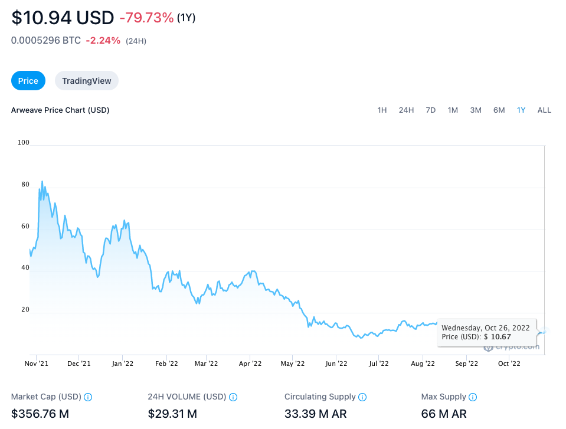
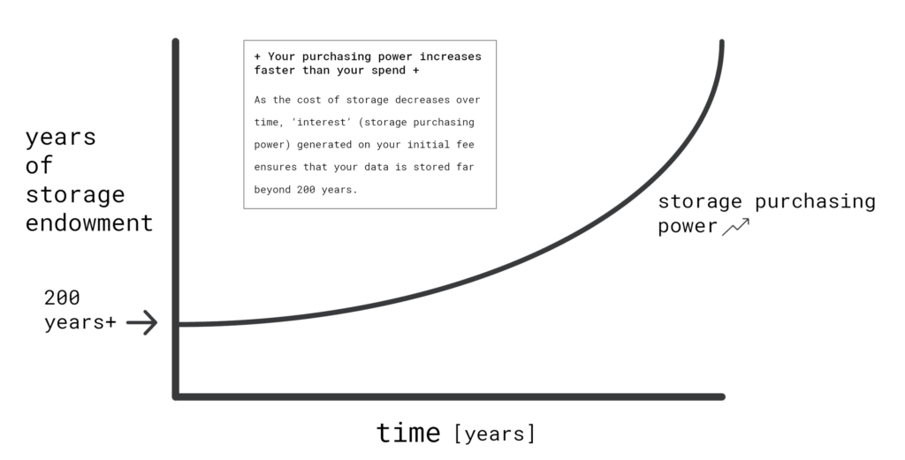

# 什么是Arweave (AR)?
## 币价格
文档当时价格 AR = 220 RMB

2022年10月27号价格

Arweave是一个分散的存储网络，允许用户和开发人员真正永久地存储数据,旨在为数据的无限存储提供一个平台。把自己描述为 “一个永远不会忘记的集体拥有的硬盘驱动器”，该网络主要托管“永久网络”——一个拥有许多社区驱动的应用程序和平台的永久的、去中心化的网络。

在 Arweave 网络之上生活着 permaweb：一个全球性的、社区拥有的网络，任何人都可以贡献或获得报酬来维护它。permaweb 看起来就像普通的网络，但它的所有内容——从图像到完整的网络应用程序——都是永久的、快速检索和去中心化的——永远。就像第一个网络连接远距离的人们一样，永久网络在极长的时间内连接人们。

Arweave 网络使用一种本地加密货币AR支付给“矿工”，让他们无限期地存储网络信息。

该项目于2017年8月首次宣布命名为 Archain，随后于2018年2月更名为 Arweave，并于2018年6月正式启动。
## Arweave 试图解决什么问题？
Arweave 最重要的是试图解决可靠的长期数据存储问题。市场上没有其他类似产品。这确实是一种与数据的新型关系。我们习惯于考虑使用旧 U 盘在短时间内将数据存储到较新的云存储服务，这些服务允许我按月订阅付费存储数据。但是，真正的长期数据存储有哪些选择？如果我想存储 20 年、50 年或 200 年怎么办？有什么可靠的选择呢？

我们的看法是，当我们将文件上传到互联网或云时，它会在那里存在很长时间。这确实是一种错误的看法，因为研究实际上恰恰相反——互联网是一个高度流动的实体，随着时间的推移会迅速变化。让我们看看目前的情况，看看万维网和云计算中的数据存储实际上是多么脆弱。

在 2014 年[哈佛法律研究](https://www.cambridge.org/core/journals/legal-information-management/article/abs/perma-scoping-and-addressing-the-problem-of-link-and-reference-rot-in-legal-citations/15A59548BF9882B06D3064DA7E290859)中发现，最高法院案件中大约 50% 的链接不再起作用。作者还发现，法律期刊中 70% 的链接不再按预期工作。

仅仅两年后，[存储在网络上的所有数据中有三分之一已经消失或发生了如此巨大的变化](https://www.newsbtc.com/all/preserving-the-digital-world-is-harder-than-it-seems-this-company-claims-to-have-made-a-breakthrough/)，以至于 URL 现在链接到其他东西。
### 大公司存储问题
- 无休止的每月付款
- 公司停止运作后的数据丢失

### Arweave 和亚历山大图书馆
由于当前网络上通常重要的历史、文化和个人信息的衰败和丢失问题，Arweave 团队制定了一项任务，即在一个地方创建一个永久的知识和历史记录。

Arweave 的愿景是创建亚历山大数字图书馆。亚历山大图书馆是一座在古代（公元前 200 年）设计的图书馆，旨在创建一个普遍的人类知识和理解的存储库。

图书馆在存在的最初数百年中给人留下了深刻的印象，但就像我们自己的互联网一样，随着时间的流逝，管理不善并经历了知识的流失。

尽管图书馆和（互联网）容易衰落，但 Arweave 解决了数据长期存在的问题，因此后代可以访问世界历史。
### Arweave 是如何解决长期存储问题的？
现在，我们将在这一点上尽量不要过于技术化，但我们将不得不复习一些（相信我们）不会太痛苦的术语。

我们需要谈论的第一个术语是协议这个词。现在，协议只是一组规则。

您甚至可能听说过在 Internet 中提到它，例如在 Internet 协议中。

我们今天使用的互联网是一个协议——一组控制它如何工作的规则，这样每个人都可以得到他们想要的东西，而且事情不会分崩离析。

blockweave 是一个扭曲的区块链。区块链是一种数据库，它使用“块”来不可变地存储数据，这意味着信息不会或不能改变。当新信息添加到该数据库中时，所有以前的信息都需要由社区验证，然后才能将任何新信息添加到该数据库中

- 区块链问题

	这是一个非常安全的过程，可确保信息保持不变，但它也非常耗时且耗能。
- 解决方案

	Arweave 重新构想了这个过程，因此不需要验证整个区块链，而只需验证之前随机选择的区块。前一个区块的召回形成了一种编织结构，因此 Arweave 将其称为区块编织而不是区块链。块编织解决了能够将信息存储在不会也无法更改的地方的问题，并允许在需要时快速调用它。
- 谁将长期存储这些信息？

	解决方案是 Arweave 需要拥有一个由 1000 和 1000 名独立人员组成的网络，他们将随着时间的推移存储这些信息。这是去中心化的过程，其中信息被分发给许多负责它的人，而不是集中化，您只是信任一个实体来照顾它。从长远来看，去中心化要可靠得多。在协议和区块链技术的世界中，存储数据的人被称为矿工。这些矿工将数据托管在他们的私有服务器、节点上，或者创建矿工池来存储被放入区块编织的信息。
- 为什么矿工会在他们的服务器上存储来自 Arweave 的信息？

	矿工将信息存储在他们的服务器上，因为他们被激励通过付款这样做。就像你没有得到报酬就不会去上班一样，除非他们得到报酬，否则他们不会将其存储在他们的服务器上。他们需要维护运行服务器的成本，如果支付的费用超过这些成本，他们将托管提供给他们的数据。
- Arweave 是如何设法支付这些矿工在如此长的时间内存储数据的呢？

	Arweave 使用一种收费结构，用户只需支付一次费用即可永久存储信息，而无需支付月费或年费。这也是一个真正的创新。
	
	- 出现的自然问题是，一次性付款是否需要非常大的付款才能支付如此长时间的成本？
	
		从我们对事物如何随着时间的推移变得更加昂贵的了解来看，情况似乎就是这种情况。然而，存储成本的不同之处在于，与其他大部分时间不同，存储价格逐年下降，而且不是一点点，而是很多。在过去 50 年中，数据的平均存储价格下降了 30.5%。
	- 答案
	
		Arweave 设计了一个系统，以便为将数据托管到 Arweave 网络而支付的所有成本都进入捐赠基金，该捐赠基金将能够根据捐赠基金产生的利息支付存储成本。想想大学或非营利组织的捐赠基金。捐赠基金将使用他们储蓄池中的利息来支付其组织的运营成本。与大多数成本不断上升的大学不同，Arweave 正在为迅速下降的存储成本买单。即使在不太可能的情况下数据存储成本保持不变，一次性存储费用也涵盖了 200 年的数据存储成本。	
	

### 谁需要数据持久性？
好吧，随着数据变得越来越广为人知，数据持久性的用途可能会爆炸式增长。然而，我们已经可以看到许多不同类型的数据存储在块状编织中。

个人已经将以下内容添加到 permaweb：

- 家族史——音乐、照片、文件
- 数字艺术
- 老电影
- 公共领域的书籍
- 重要文件
- 播客
- 博客

从业务、组织或文化方面来看，用例的数量似乎是无限的。

一些突出的是：

- 其他区块链技术的永久存储
- 法律文件（如最高法院记录）
- 政府数据，例如土地所有权或记录
- 建筑图纸
- 学术论文与研究
- 报纸和博客文章
- 财务分类帐

### 可以在 Arweave 之上构建什么？
已经有超过 300 个应用程序基于该系统构建。

起初，它们是简单的应用程序，例如国际象棋应用程序或待办事项列表。然而，在过去的一年中，许多令人兴奋的商业社区推出了应用程序，这些应用程序将真正改变人们和企业的日常生活。

例如，

- [ArDrive](https://ardrive.io/) - 像 Dropbox 这样的文件共享应用程序
- [ArGo](https://argoapp.net/) - 将整个网站放到 Arweave 上的能力
- [Pianity](https://pianity.com/) - 音乐分享和 NFT 应用
- [Redstone](https://redstone.finance/) - 可定制的 defi 数据集
- [Glass 协议](https://glass.xyz/)- 视频和直播

这些应用程序和其他应用程序弥合了 Arweave 和普通人之间的差距。

它们使可能永远不知道 Arweave 是什么的普通人能够以安全和永久的方式保存他们的信息。

未来，永久网很可能会延伸到生活的各个领域。从家谱到帮助银行保存永久记录再到促进企业对企业应用程序，将会有各种应用程序。

## 谁是 Arweave 的创始人?
Arweave 的创始人是肯特大学(University of Kent)的两位博士研究生山姆•威廉姆斯(Sam Williams)和威廉•琼斯(William Jones)。Williams 带着分散式和分布式系统的经验加入了这个项目，他已经开发了一个名为 HydrOS 的操作系统作为他研究的一部分，而 Jones 的重点是图论和神经网络。威廉姆斯从研究生院退学，专注于公司的发展，而琼斯则在 2018年年中早早地离开了这个项目，完成了博士学位。

据威廉姆斯说，他是在苏格兰登山时想到这个主意的，后来他把这个想法告诉了琼斯，并和琼斯一起开发了技术细节。在创建 Arweave 之后，威廉姆斯被任命为 Minespider 的顾问，Minespider 是一家为原材料行业提供基于区块链的供应链跟踪服务的公司，他还担任了 Techstars 加速器项目的导师。

虽然 Arweave 成立时采用的是集中式领导，但它在 2020年1月启动了一个由核心社区成员组成的 DAO，以进一步发展和扩展网络及其生态系统。
## 市面上有多少Arweave (AR)硬币?
根据其黄色文件，Arweave最大的 token 供应量为6600万AR。2018年6月创建区块编织的起源区块时，创造了5500万AR，另外 1100 万AR将逐渐引入作为区块奖励。

Arweave 在2017年8月举行了 token 预售活动，出售了10.8%的最初生成的 token 供应，并在2018年5月和2018年6月完成了两次公开销售，分别出售了7.1%和1.1%的供应。公司额外分配了

- 19.5%用于私人销售
- 2.9% 用于项目顾问
- 13% 用于团队(五年锁定，每年发布20%)
- 19.1% 用于生态系统开发
- 26.5% 用于未来的项目使用(五年锁定，每年发布20%)

## Arweave 网络是如何安全的?
Arweave 网络是建立在区块链技术 “blockweave” 的改进版本之上的，它使用了一种 “访问证明” 共识算法——一种工作证明的改进版本。对于 PoA，每个新块不仅链接到它之前的一个，而且也链接到一个随机的前一个块，两个块都被散列以生成新的块。矿工不需要存储整个区块链，但他们有动机存储更多的信息，以证明他们可以访问旧的块
## 那么需要多少一次性付款呢？
一次性付款仍然非常非常实惠。

通常，您最终会为 4-6 MB 的 permaweb 数据支付大约 1 美分。

例如，对于较小的文档（50 到 250 kb），这将是大约十分之一到百分之一美分，对于较大的音频文件（10 MB），大约是 2 美分。

与其他形式的数据存储相比，Arweave 最初看起来会更贵，但如果您随着时间的推移查看价格，那么即使在短短几年之后，Arweave 也将始终作为数据存储的低成本选择发挥作用。
## 你如何付费才能在 Arweave 和 permaweb 上获得一些东西？
放到 Arweave 上的所有东西都需要用 AR 代币支付。

在 Arweave 之上开发了许多应用程序，这些应用程序将使拥有各种不同类型数据需求的人能够使用这项技术。

但在查看这些应用程序之前，让我们先看看一些实际需要长期数据存储的案例。

## 参考
[what-is-arweave](https://ardrive.io/what-is-arweave/)