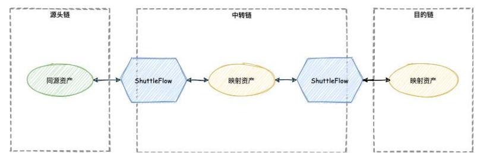
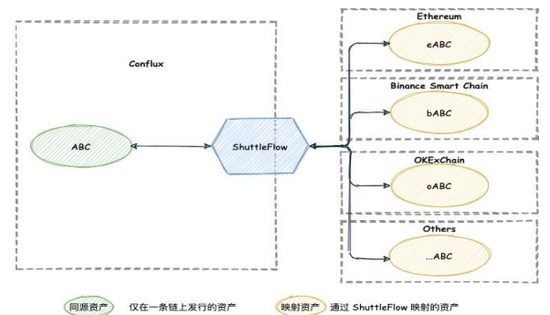
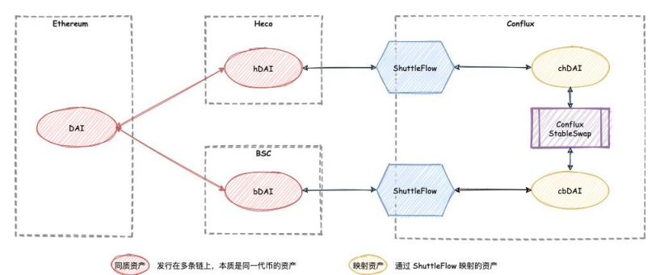

# Conflux 链产品分析
Conflux 要解决 Defi 生态项目的分散精力在多链发行同质资产，但同质资产在链间流通受阻的现状，实现低成本多链同质资产融合治理。

## 产品包括
### 链相关
- Conflux
	- 优点
		- 技术 
			- PoW 共识算法性能优化到 3000 TPS
			- 秒级交易上链
			- 分钟级确认
		- 运营
			- 基金会为链上的智能合约提供 Gas代付补贴，用户无需任何 CFX 免费使用 Conflux 
			  
### 围绕 Dapp
- 游览器[(ConfluxScan)](https://confluxscan.io/) 
- 钱包(Conflux Portal)
- WebIDE(web IDE)
- Conflux Truffle(命令行 IDE)
- 图形 IDE (Conflux)
- SDK

### Defi-[ShuttleFlow](https://shuttleflow.io/static/media/SF-whitepaper-zh-v1.0.75dc3b1e.pdf)

#### Defi 当前情况
- BTC

	BTC 作为市值最高的数字货币，将 BTC 资产跨入其他公链的服务已有不少，比如 wBTC、tBTC 和 renBTC 等方案
- ETH

	Ethereum 作为市值最高的智能合约公链，
支持 ETH 和 ERC20 资产跨链的服务也遍地开花，比如 Near 的 Rainbow Bridge, Binance 的 Binance Bridge 和 RenProject 的 RenEVM 等等。

#### 问题
当前跨链方案普遍聚焦于两两跨链且开放性不足，生态项目方无法在不经过许可的情况下增加新币种的跨链，而且随着优质公链的增加，我们面临的跨链需求不再是双链互通，而是 N 链互通。

使用双链互通方案去处理N 链互通是成本极高的，N 链互通需要支持 N^2 量级的双链跨链桥，随着 N 的增大，维护成本会不断增加。
#### 当前解决方案
由于以太坊生态的一家独大，各个公链和以太坊之间都有一定程度的互通，以太坊变相成为了各个项目方打通资产的中转链的选择。

- 方案问题

	如将以太坊作为中转链，将包括以太坊和其他多条公链上的同质资产全部打通就需要以太坊承载起代币转入转出的高频流转需求。但是以太坊底层性能的局限性导致常常发生交易拥堵，交易手续费激增的现象，始终难以成为高频枢纽。
	
	- 个人解读	
		- Eth 2.0 针对这个问题去解决的 TPS 不足问题
		- 因为 Gas 价格才导致 TPS 合理分配，但确实带来了用户使用不方便

#### ShuttleFlow 协议解决方案  
ShuttleFlow 多链同质资产融合治理分为如下两种典型类型

- 发行链和中转链相同时的同源资产跨链 

	项目方将代币原生发行在 Conflux(中转链)上，可以直接通过 ShuttleFlow 协议一键映射并跨链到别的公链上。
	
	
	
	- 原生资产 ABC 
	- ABC 可以经由 ShuttleFlow 在联盟的托管承兑下跨到 Ethereum 上以映射资产 eABC 的形式显示
	- 如果 Ethereum 的 eABC 有跨回到 Conflux 链上进行快速免费交易的需求，也可以通过 ShuttleFlow 跨回到 Conflux 链，以原生资产的形式参与到 Conflux 链上的项目中
	
	对于项目方来说，由于代币原生发行在 Conflux 链上，属于同源资产，跨链到别的公链上的映射资产与 Conflux 链上的原生资产 1:1 对应，项目方无需担心代币在其他公链上的流动性和承兑风险。
	
	代币的跨链申请是无需准入门槛的。对于新上线的项目，项目方可以直接申请成为其项目代币的跨链服务商，自行制定该代币的跨入跨出手续费规则。
- 发行链和中转链不同时的同质资产跨链

	这种场景下的跨链需要考虑同质资产在中转链上映射资产的兑换，较为复杂。项目方可能在同一条链上发行同源资产或者在多条链上同时发行同质资产。为了实现多链同质资产互通，需要将各条链上的映射资产映射到中转链（如 Conflux），然后借助类似 Curve 的 StableSwap 兑换服务，进行资产跨链。
	
	
	
	- Ethereum 链上有原生发行的资产 DAI
	- DAI 也被跨到了 Heco 和 BSC 链上，成为 hDAI 和 bDAI
	- 要将 Heco 上的 hDAI 跨链到 BSC 成为 bDAI
	- 首先需要在中转链 Conflux 上建立 Heco 和 BSC 上各自 DAI 的映射资产，Heco 的 chDAI 和 BSC 的 cbDAI
	- 然后在 Conflux 类 Curve 的 StableSwap 服务中注入 chDAI 和 cbDAI 交易对的流动性，这样用户可以一键完成 hDAI -> (ShuttleFlow) -> chDAI -> (Conflux Curve)
-> cbDAI -> (ShuttleFlow) -> bDAI 的兑换流程

	整个过程用户无需感知中间过程，且仅需支付 hDAI 和 bDAI 的转账手续费即可完成 Heco 到 BSC 的跨链
- 无许可的多链资产互通 

	ShuttleFlow 坚持无许可原则，任何人都可以成为 ShuttleFlow 已集成公链上任意币种
的跨链服务商。

	

	

## 底层系统
- [帮助中心](https://confluxscansupportcenter.zendesk.com/hc/zh-cn)

		https://confluxscansupportcenter.zendesk.com
		https://fluent-wallet.zendesk.com

## 参考
