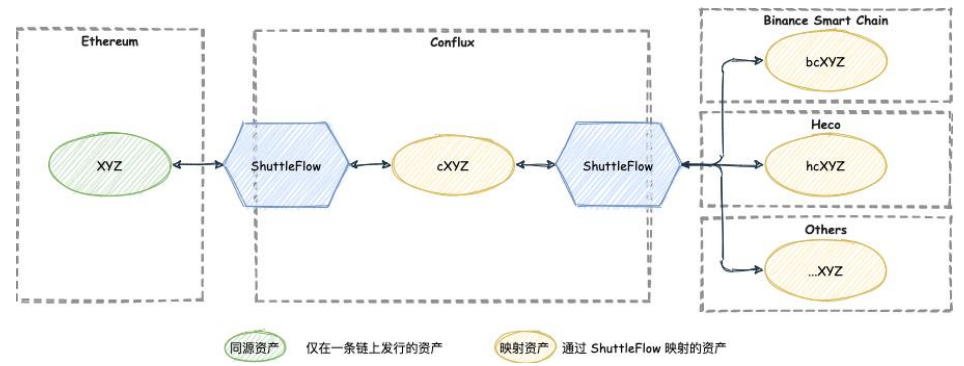
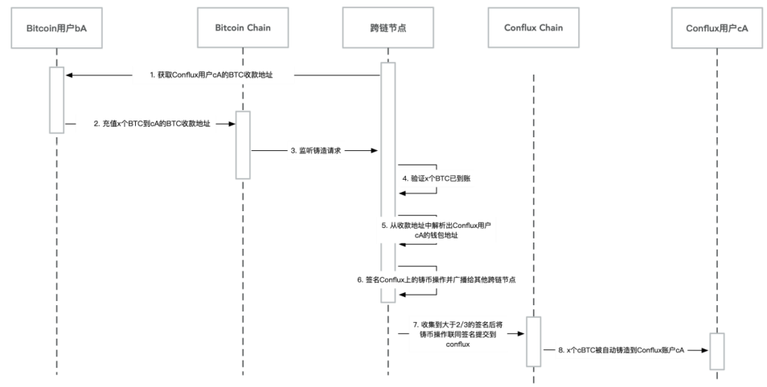
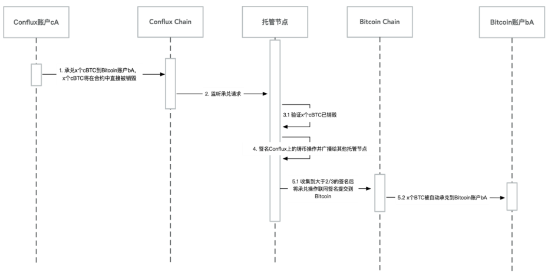

# Conflux 树图链产品分析
Conflux 要解决 Defi 生态项目的分散精力在多链发行同质资产，但同质资产在链间流通受阻的现状，实现低成本多链同质资产融合治理。
## 链 [Conflux Network](https://confluxnetwork.org/zh/)
- 优点
	- 技术 
		- PoW 共识算法性能优化到 3000 TPS
		- 秒级交易上链
		- 分钟级确认
	- 运营策略
		- 基金会为链上的智能合约提供 Gas 代付补贴，用户无需任何 CFX 免费使用 Conflux 
- 链业务构成
	- 链相关
		- 几条链 
			- 主链 
			- 测试链
		- 开放接口
			- http
			- ws
- 改进建议整套机制

- 代码地址	
	- [代码地址](https://github.com/Conflux-Chain) 
	- 技术栈

		rust
- [帮助中心](https://confluxscansupportcenter.zendesk.com/hc/zh-cn)

		https://confluxscansupportcenter.zendesk.com
		https://fluent-wallet.zendesk.com
			
##  Dapp 支撑体系
- [Infura Services](https://services.tokenview.com/cn/product/infura) 
	
	类似以太坊的 infra 服务，提供 dapp 开发商的链 rpc 接口服务，开发商无需自建节点    
	
	- [代码](https://github.com/Tokenview/api-demo)
- SDK
	- [JavaScript SDK](https://www.npmjs.com/package/js-conflux-sdk)
	- [Java SDK](https://github.com/Conflux-Chain/java-conflux-sdk)
	- [Golang SDK](https://github.com/Conflux-Chain/go-conflux-sdk)
-  [(ConfluxScan)](https://confluxscan.io/)  				  
## 开发工具
- [Conflux Truffle](https://github.com/Conflux-Chain/conflux-truffle/blob/conflux/ultimate-guide.md)(命令行 IDE)

	Truffle 移植 Conflux-Truffle
- Conflux ChainIDE(web IDE)

	提供调试、测试、部署一站式服务，开发者在开发智能合约时无需安装额外工具，支持以太坊、CocosBCX、IOST等多链开发环境支持联盟链，如 Diem 和 Fisco
- Conflux Studio

	Conflux Studio 是一个集成开发环境（IDE），由 [ObsidianLabs](https://www.obsidians.io/) 开发，使开发 Conflux 智能合约变得更快更容易。

	- [代码](https://github.com/ObsidianLabs/ConfluxStudio)
- 图形 IDE (Conflux)

## 类 Defi 闪电快速跨链资产桥梁-[ShuttleFlow](https://shuttleflow.io/static/media/SF-whitepaper-zh-v1.0.75dc3b1e.pdf)

### Defi 当前情况
- BTC

	BTC 作为市值最高的数字货币，将 BTC 资产跨入其他公链的服务已有不少，比如 wBTC、tBTC 和 renBTC 等方案
- ETH

	Ethereum 作为市值最高的智能合约公链，支持 ETH 和 ERC20 资产跨链的服务也遍地开花，比如 Near 的 Rainbow Bridge, Binance 的 Binance Bridge 和 RenProject 的 RenEVM 等等。

### 问题
当前跨链方案普遍聚焦于两两跨链且开放性不足，生态项目方无法在不经过许可的情况下增加新币种的跨链，而且随着优质公链的增加，我们面临的跨链需求不再是双链互通，而是 N 链互通。

使用双链互通方案去处理N 链互通是成本极高的，N 链互通需要支持 N^2 量级的双链跨链桥，随着 N 的增大，维护成本会不断增加
### 当前解决方案
由于以太坊生态的一家独大，各个公链和以太坊之间都有一定程度的互通，以太坊变相成为了各个项目方打通资产的中转链的选择。

- 方案问题

	如将以太坊作为中转链，将包括以太坊和其他多条公链上的同质资产全部打通就需要以太坊承载起代币转入转出的高频流转需求。但是以太坊底层性能的局限性导致常常发生交易拥堵，交易手续费激增的现象，始终难以成为高频枢纽。
	
	- 个人解读	
		- Eth 2.0 针对这个问题去解决的 TPS 不足问题
		- 因为 Gas 价格才导致 TPS 合理分配，但确实带来了用户使用不方便

### ShuttleFlow 协议解决方案  
#### ShuttleFlow 多链同质资产融合治理分为如下两种典型类型
- 发行链和中转链相同时的同源资产跨链 

	项目方将代币原生发行在 Conflux(中转链)上，可以直接通过 ShuttleFlow 协议一键映射并跨链到别的公链上。
	
	
	
	- 原生资产 ABC 
	- ABC 可以经由 ShuttleFlow 在联盟的托管承兑下跨到 Ethereum 上以映射资产 eABC 的形式显示
	- 如果 Ethereum 的 eABC 有跨回到 Conflux 链上进行快速免费交易的需求，也可以通过 ShuttleFlow 跨回到 Conflux 链，以原生资产的形式参与到 Conflux 链上的项目中
	
	对于项目方来说，由于代币原生发行在 Conflux 链上，属于同源资产，跨链到别的公链上的映射资产与 Conflux 链上的原生资产 1:1 对应，项目方无需担心代币在其他公链上的流动性和承兑风险。
	
	代币的跨链申请是无需准入门槛的。对于新上线的项目，项目方可以直接申请成为其项目代币的跨链服务商，自行制定该代币的跨入跨出手续费规则。
- 发行链和中转链不同时的同质资产跨链

	这种场景下的跨链需要考虑同质资产在中转链上映射资产的兑换，较为复杂。项目方可能在同一条链上发行同源资产或者在多条链上同时发行同质资产。为了实现多链同质资产互通，需要将各条链上的映射资产映射到中转链（如 Conflux），然后借助类似 Curve 的 StableSwap 兑换服务，进行资产跨链。
	
	
	
	- Ethereum 链上有原生发行的资产 DAI
	- DAI 也被跨到了 Heco 和 BSC 链上，成为 hDAI 和 bDAI
	- 要将 Heco 上的 hDAI 跨链到 BSC 成为 bDAI
		- 首先需要在中转链 Conflux 上建立 Heco 和 BSC 上各自 DAI 的映射资产，Heco 的 chDAI 和 BSC 的 cbDAI
		- 然后在 Conflux 类 Curve 的 StableSwap 服务中注入 chDAI 和 cbDAI 交易对的流动性，这样用户可以一键完成兑换流程
		
				hDAI -> (ShuttleFlow) -> chDAI -> (Conflux Curve)-> cbDAI -> (ShuttleFlow) -> bDAI 

	整个过程用户无需感知中间过程，且仅需支付 hDAI 和 bDAI 的转账手续费即可完成 Heco 到 BSC 的跨链
- 无许可的多链资产互通 

	ShuttleFlow 坚持无许可原则，任何人都可以成为 ShuttleFlow 已集成公链上任意币种的跨链服务商。

	某项目方在 Ethereum 发币 XYZ 后，希望将 XYZ 跨到 Heco 和 BSC 等其他链，但是部分公链的跨链网关有准入门槛，导致 XYZ 无法立刻登陆其他链。
	
	
	
	XYZ 可以先经由 Conflux 链上的 ShuttleFlow 以 cXYZ 的形式完成映射。cXYZ 可以通过进一步跨链到 BSC 链上，以 bcXYZ 的形式完成映射。

### 跨链基本原理
ShuttleFlow 基于跨链联盟节点 2/3 多签进行资产托管。跨链联盟核心操作可分为铸币和承兑两个环节，以 BTC 为例，联盟成员通过多签的形式，在 Conflux 上发行 1:1 锚定 BTC 的 cBTC，并提供铸币和承兑服务。具体操作如下
	
- 在 Bitcoin 上创建一个多签账户用来锁住铸造 cBTC 所需抵押的 BTC。
- 在 Conflux 上，部署一个智能合约用来管理和记录 cBTC 的铸造和承兑。
- 这个多签的 BTC 账户和 cBTC 的智能合约均由以上所说的联盟的成员共同管理。
- 该联盟将采用准入机制，新成员的加入由已在联盟的成员线下共同决定。
- 每个成员运行一个托管节点。该节点负责监听验证 Bitcoin 和 Conflux 链上的事件及提交事件发生后对应的交易操作。	

#### 铸币流程说明

1. 从应用场景中获取 Conflux 账户 cA 的收款地址。
2. 用户 A 从 Bitcoin 账户 bA 充值 x 个 BTC 到 cA 的 BTC 收款地址。
3. 联盟节点监听到 Bitcoin 上多签账户内的铸币请求。
4. 联盟节点监听到请求后，对请求进行验证：等待对应交易在 Bitcoin 上完成确认达到 finality，x 个 BTC 确认到账。
5. 联盟节点从收款地址中解析出 Conflux 账户 cA 的钱包地址。
6. 联盟节点对 conflux 上的铸币操作“铸造 x 个 cBTC 到 Conflux 账户 cA”进行签名并广播给其它联盟节点。
7. 当某托管节点收到大于 2/3 的节点对该操作的签名，就将该操作及收到的签名提交到 Conflux 上的 cBTC 智能合约中执行铸币操作，重复提交直接忽略。
8. 合约执行铸币操作后，x 个 cBTC 会自动增发到 Conflux 账户 cA。

#### 承诺流程说明
	

1. 某个联盟成员的 Conflux 账户 cA 向 cBTC 智能合约提交一个交易提出承兑请求“承兑 x 个 BTC 到 Bitcoin 账户 bA”，此交易中 cA 需要向该智能合约实际转入 x 个 cBTC，转入的 x 个 cBTC 将会直接被销毁。其中，Bitcoin 账户 bA 的信息在请求参数中指明。
2. 联盟中的托管节点监听到 Conflux 上 cBTC 合约内的承兑请求。
3. 托管节点监听到请求后，等待对应交易在 Conflux 上完成确认达到 finality，x 个 cBTC 确认销毁。
4. 若承兑请求验证无误，托管节点对 bitcoin 上的承兑操作“承兑 x 个 BTC 到 Bitcoin 账户 bA” 进行签名并广播给其它托管节点。
5. 各个托管节点都独立收集签名
	- 当某托管节点收到大于 2/3 的节点对该操作的签名，就将该操作及收到的签名提交到 Bitcoin 上的多签账户中执行承兑操作，重复提交直接忽略。
	- 多签账户执行承兑操作后，x 个 BTC 会自动承兑到 Bitcoin 账户 bA

#### 无需许可申请资产跨链
资产跨链申请是无需准入的，任何人或项目方都可以通过添加代币的合约地址方式向 ShuttleFlow 提出资产跨链申请 ，支持 Conflux 和任意链上的代币跨链，成为该代币的跨链服务商。每个代币只有一个服务商。

- 服务商的义务

	服务商需要抵押一定数量的代币，用于扣除用户每次跨链的链上实际成本。如跨链 ETH 链上的代币，需要抵押一部分 cETH。如果用户量比较大，服务商抵押的代币额度被扣完，则需服务商新增加抵押额度以保证该代币服务的正常运行。
- 服务商的权利

	服务商可以制定每次跨链向用户收取的手续费，并从中获益。用户跨链的手续费参数可以由服务商自行定义，如，跨入跨出的手续费金额，最小跨入跨出数量，创建新地址的手续费金额等。每次跨链的链上处理成本在服务商抵押的代币中扣除，用户跨链缴纳的手续费和新建地址费用最终会结算到代币服务商的钱包地址。
- 服务商竞选

	如果同一代币有多个项目方想成为跨链的服务商，则可以通过抵押代币数量高低进行竞选。抵押代币最多者可以成为该代币的跨链服务商。
	
### 联盟治理
- 联盟成员变动

	当有新的成员需要加入联盟的时候，所有现有成员合作完成一个多签交易，将当前多签账户中的 BTC 转入一个新的包括该新成员的多签账户。当有现有成员想要退出联盟的时候，所有其他现有成员合作完成一个多签交易，将当前多签账户中的 BTC 转入一个新的没有该退出成员的多签账户中。
- 联盟成员私钥管理

	对智能合约采用联盟节点多重签名机制进行防护。合约或资产的任何改变都需要经过联盟成员共同授权，当大于 2/3 节点共同签名达成共识后，跨链交易才能被确认，跨链交易才得以完成。为提升交易体验和效率，每位联盟成员都拥有两把私钥，分别在热钱包和冷钱包中存储，并分别用于小额和大额两种铸币承兑情形：
	
	- 小额铸币承兑行为，采用热钱包内私钥，联盟节点实时监听请求，自动验证链上数据，并自动执行签名，铸币承兑请求能即时得到反馈。
	- 大额铸币承兑行为，采用冷钱包内私钥，联盟节点自动监听验证请求后，需要人工二次审核，人工确认无误后手动执行签名，铸币承兑请求需等待人工审核完成。

## 参考
- [confluxnetwork 开发者指南](https://developer.confluxnetwork.org/)
- [ShuttleFlow 白皮书](https://shuttleflow.io/static/media/SF-whitepaper-zh-v1.0.75dc3b1e.pdf)