# DAO 知识
## DAO 基础
在 messari 的 [2022 年度报告](https://messari.io/pdf/messari-report-crypto-theses-for-2022.pdf) 中关于 Web3 叙述中说到目前3个领域特别不发达

- NFT 基础设施
- DAO 相关建设
- 还有就是跨链桥

### DAO 三个基本要素
- 具有与陌生人达成共识的组织目标和组织文化(组织的使命、愿景、价值观)
- 具有与陌生人达成共识的包含创立、治理、激励等内容的规则体系，且此规则通过区块链技术置于链上
- 具有与所有参与者形成利益关联的 Token 来实现全员激励

### DAO 的最终目的
随着 DAO 的越来越成熟，在未来或许公司会慢慢被 DAO 所替代，公司也不需要上市 IPO，股权直接以代币的形式体现，省去各种麻烦的事情。每一个 DAO 通过治理等方式不断完善， 最终都将通过为客户或用户提供有价值的服务创造自己的价值，最终来获取价值收益，该收益再与参与 DAO 的人按规则比例进行分享,代替当代的公司组织职能。
### The DAO
与以太坊的 DAO 项目实际上是 DAO 理念的一个实践，为了区分也叫 The DAO  ，BTC 和 ETH 社区本身便想的说也是 DAO 
### 简单 DAO 方案
如何创建自己的 DAO？如今，有众多开源解决方案可供您选择。其中，[Aragon](https://aragon.org/) 在以太坊区块链中是最热门的选择之一， [Snapshot](https://snapshot.org/#/)，[makerdao](https://makerdao.com/zh-CN/),[daomaker](https://daomaker.com/)

## DAO 历史
### 我们并不总是为公司工作
直到 1820 年，只有 20% 的美国人口为支付工资的组织工作。其余 80% 的人耕种、捕鱼、经营自己的生意或在这些活动之间分配时间。 

而在接下来的 130 年里，情况发生了迅速的变化。工业化提供了获得更多财富的机会，同时要求增加劳动力。这推动了具有集中式指挥系统的大型组织下的工人的整合。这些转变意味着到 1950 年，多达 90% 的人口依赖公司获取工资。 

那么，公司是一种现代现象，只是人类解决协调问题的一种尝试，至少在我们通常认为的方式上是这样。

一个更好的选择可能已经出现。尽管远非完美，但去中心化自治组织 (DAO) 试图在实现大规模人类协作的同时弥补公司的一些缺陷。这种互联网和加密原生结构旨在分散治理和所有权，让贡献者有机会确定项目的方向并从其成功中获利。 

虽然仍处于起步阶段，但对该组织框架的兴趣激增表明 DAO 是一个值得认真对待的想法。尤其是在过去的几个月里，新的 DAO 已经崭露头角，吸引了有意义的资本和高素质、有奉献精神的人才。从历史上看，那些关注加密领域这种混乱的人在多年后看起来很有先见之明——即使炒作似乎被夸大了。建筑商和投资者都应该适当考虑这个空间。 

除了潜在的财务收益之外，DAO 还可能预示着具有持久影响的社会转变。毕竟，受到我们经营所在组织的影响。社会学家查尔斯·佩罗 (Charles Perrow)在他的著作《组织协会》( A Society of Organizations) 中认为，组织解释了我们世界的大部分运作方式。他介绍了这个理论，如下： 

	[U]除非您是组织理论家……您的专业将被视为因变量；组织将是塑造政治和经济行为、分层系统、宗教、社会心理过程和一般历史的自变量。
作为一个新的自变量，DAO 将如何影响这些依赖项中的每一个？这种结构将对宗教、历史和政治产生什么影响？ 

	佩罗说：“我的主张是：组织是理解我们社会的关键，因为组织吸收了社会的大部分内容。” 
如果这个格言成立，那么 DAO 将吸收生活的哪些部分？如果公司侵入了在物理领域建立的关系和联系，那么随着时间的推移，DAO 可能会同化我们的数字生物。简而言之，它们可能会吸收互联网，成为我们新的 web3 社会的组成部分。 

我们将在今天的文章中探讨这个想法，同时解开 DAO 的当前状态。特别是，我们期待着回答下列问题（和你说一句话“道”那么，这么多的）：  

- 定义。解释什么是 DAO 以及我们如何看待它们。 
- 历史。新组织结构的起源。 
- 类别。存在的各种类型的 DAO。 
- 文化。支撑空间的价值观和理念。 
- 景观。主要参与者及其使用的工具。 
- 启动一个 DAO。探索去中心化的好处以及所需的策略。法律问题。怀俄明州有希望的发展和开放的问题。 
- 反对 DAO。结构的脆弱性及其未经证实的潜力。 
- 边界。探索未来可能发生的事情。

### 守护进程与白皮书
2006 年，科幻作家丹尼尔·苏亚雷斯 (Daniel Suarez) 出版了一本同名的书，可以将其视为 DAO 的一种原始文本。

	在《守护进程》中，苏亚雷斯描绘了一幅大规模计算机程序的图景，该程序编排了一个地下合作社会。虽然守护进程参与了许多我们不希望任何 web3 组织从中汲取灵感的不健康行为（想想自动驾驶摩托车刺客！），但它的基本操作与今天的 DAO 非常相似：
	
	- 支付赏金
	- 在社区中共享信息
	- 管理叙事货币
守护进程并没有创造 “DAO” 这个名字。但在以太坊白皮书发布之前曾写过关于 “去中心化自治组织” 的文章，但他在开创性工作中包含了一个整洁的定义： 

	[DAO 是] 一个虚拟实体，它拥有一组特定的成员或股东，其中可能有 67% 的多数，有权使用实体的资金并修改其代码。
与守护进程一样，以太坊 DAO 依赖于自我修改代码。然而，与苏亚雷斯的创建不同，白皮书将 DAO 设想为从根本上透明，具有明确的治理流程和建立共识的路径。 

在以太坊白皮书中有史以来第一个对 DAO 的描述的来源，解释不仅说明了区块链的模块化和力量，还暗示了它的智力影响。白皮书对两种类型的 DAO 的描述进一步说明了这一概念：（这些首字母缩略词是我们试图轻松区分它们的尝试，而不是规范。） 

- “去中心化自治公司”（DAC1）
- “去中心化自治社区”（DAC2）

白皮书将前者设想为具有可交易股份和股息的谋利实体，而后者则更像是一个民主实体，社区成员可以在其中对某些问题进行投票，例如增加或删除成员。实际上

- DAC1 

	以“1 股 = 1 票”
- DAC2 

	则以“1 名成员 = 1 票”

而守护进程的读者会记得这本书的近乎无所不知的程序没有如此清晰的结构。虽然白皮书在本节开头的引用可以被视为一种邀请，但它也是——至少在某种程度上——是一种挑衅。 

### The DAO
有人花了将近三年的时间来接受这个挑战。2016 年 4 月，The DAO 诞生了。该项目以最好的意图开始，希望成为以太坊社区事实上的风险基金，以去中心化的方式进行管理。社区成员共同投资 The DAO，并对潜在投资进行投票。

事实证明，这对许多人来说是一个诱人的提议。The  DAO 从 11,000 多个 LP 中迅速积累了 1270 万个 ETH，相当于当时的 1.5 亿美元。即使在传统的风险投资公司中，这种规模的公司也很有意义。在 The DAO 成立的同一年，传奇基金 Union Square Ventures 宣布关闭一个 1.66 亿美元的新基金，与以太坊原生工具相比并没有太多。 

对于那些知道接下来会发生什么的人来说，很难不花一点时间想象这个实体可能会取得多么神奇的成功。如果 The  DAO 只是坚持其 ETH，提供零 alpha，那么它今天管理的资产将相当于 520亿美元。如果 The  DAO 甚至选出了几个赢家——它肯定会拥有世界上最广泛的采购结构——总和可能会高得多。结果将是去中心化金融领域的老虎全球规模的参与者。 

然而

同年 6 月，The DAO 遭到黑客攻击。从实体中提取了整整 360 万个 ETH 并转移到一个持有账户。为了让 ETH 的所有者有机会收回他们的资金，以太坊经历了一次硬分叉。没有损失任何资金，但这次黑客攻击导致了以太坊社区内部的分裂，并说明了尚未完全成熟的 DAO 结构的危险。 随之而来的是一个 The  DAO 冬天，在更广泛的加密货币冷却之前并经历了这个冬天。

### DAO 的新生
尽管如此，即使在这个较慢的时期，专门的运营商仍在该领域进行建设。

- 由贡献者 Jorge Izquierdo 共同创立的 [Aragon](https://aragon.org/) 于 2016 年开始为 DAO 开发工具。
- [MakerDAO](makerdao.com) 成立于 2015 年，其声望继续增长，吸引了新的人才在该领域工作。 

在过去的 12 个月中，这些先行者已被证明至关重要。对 DAO 重新燃起的热情已经转化为切实的复兴，部分原因是因为新来者能够依赖 Aragon 和 Maker 等组织创建的基础设施和架构。 

在我们谈论游戏状态之前，我们会更深入地思考“DAO”的定义。

## 什么是 DAO
### 名词解释
- DAO 
	- 全称 Distributed Autonomous Organization 分布式自制组织(白皮书的第一种 DAC)或
	- 也被称为 DAC (Distributed Autonomous Corporation)分布式自制公司(白皮书的第二种)

### 定义
而当今称为 “DAO” 的实体很少真正符合这个定义，真正的去中心化很少见，尤其是一开始，因为大多数项目需要一定程度的中心化才能启动和运行，自主权也是如此。 至关重要的是，这些特征不应该被视为对和错的二元回答，而是一个程度的问题。不同的 “DAO” 在这个去中心化和自治的滑动尺度范围内以不同的方式定位不同。 

事实上，每个定义 DAO 的人都可能给你一个微妙或有意义的不同回应。例如，

- 将自己的 DAO 归类为共享银行账户的群聊
- 或归类为具有分布式所有权的社区
- 或简单地将其称为（梦幻般的）“氛围”

DAO 是群聊和社区，他们中的许多人通过他们的文化或氛围将自己分开。但尽管内容丰富，但这些描绘的某些东西却使这个想法显得很短视。 DAO 不仅仅是一个带有原生代币的 Discord 通道。相反，它们是面向共同目的的实体：创造价值。这是我们声明的表达方式的共同点。 

当然，价值创造的定义方式各不相同。一些专注于构建有形的数字产品，而另一些则着眼于积累和复合社会资本。尽管如此，这个基本目的仍然存在。 

这是对一个 DAO 最基本的描述，并不能令人满意。难道我们不能说几乎所有组织都致力于创造价值吗？公司不追求同样的目的吗？国家和宗教呢？ 

“价值”过于主观，无法给我们足够的清晰度。为了对 DAO 有更高的保真度理解，我们需要超越命名法，并查看将这种实体形式与其他实体区分开来的特征。

### 特征
要了解 DAO 与其他组织有何不同，我们只需要看看它们如何处理所有权和组织。

- 所有权

	DAO 不是将所有权集中到创始人和投资者手中而是将所有权分配给生态系统中的各种利益相关者，包括贡献者、用户、战略合作伙伴、供应商等。

	从本质上讲，DAO 由在其中创造价值的人拥有。这是一个激进的观念，而且具有真正的后果；通过超越谁应该 “拥有” 一个组织的传统概念，DAO 赋予广泛的生态系统以代表其采取行动和创造价值的能力。
- 组织

	如前所述，DAO 寻求“自治”。最初，这个术语指的是 DAO 希望在组织层面独立行动——不受国家或私营部门参与者的干扰。

	虽然某些 DAO 确实如此，但可以说，更重要的自治形式发生在个人层面。选民可以加入 DAO 并选择以他们认为最引人注目的方式做出贡献。可能有指导方针，但总的来说，利益相关者选择自己的劳动力并自我组织。

	同样，这很重要。传统上，个人贡献者和监督实体之间的关系是一种从属关系——工人按照公司的要求行事。这里不是这种情况。DAO “工人” 在他们认为可以增加价值并希望这样做的时间和地点加入。 

	通过采用这种方法，DAO 为紧急行为创造了条件。复杂系统的形成方式是任何个人或团体都无法自上而下协调的。 
	
### 组织构架
为了更好地理解 DAO 如何运作，我们可以将它们与预先存在的组织结构进行比较。尽管从根本上是不同的，但通过尝试将 DAO 视为公司、合作社和网络，我们可以学到很多东西。 

- DAO 作为公司

	尽管在所有权和组织方面存在差异，但公司仍然是理解 DAO 的有用框架。 事实上，较大的 DAO 通常以类似于公司的方式运作，具有明确的“部门”，例如产品、营销、工程和社区。这些部门通常有一个团队负责人来指导和支持其他成员，与经理没有什么不同。 

	一般来说，DAO 中的领导层往往是流动的和无等级的，类似于“青色组织”。正如管理理论家 Frederic Laloux 所定义的那样，Teal 组织是自治的且自然发展的。他们还鼓励员工将自己的全部精力投入到组织中。 
- DAO 作为合作社

	当然，DAO 还可能与公司无关特别是在所有权方面，上述框架仅到此为止。 而它作为合作社可能是一个更恰当的比较。合作社由为其做出贡献的工人拥有和控制。这类似于 DAO，在 DAO 中，利益相关者会收到授予治理权和分配所有权的代币。 
- 作为网络的 DAO

	尽管 coop 框架有助于对所有权进行建模，但 DAO 不仅将所有权分配给贡献者——合理地等同于员工。相反，他们将所有权分配给一系列不同的利益相关者。这可能包括用户（如果 DAO 正在构建产品）、战略合作伙伴、供应商、与任务一致的社区成员等。 

	结果与纯粹的合作社截然不同：网络。成员以自由形式相互交流，角色频繁而流畅地变化。 

	在许多方面，这是考虑 DAO 的最有用的框架。当然，虽然网络并不新鲜——当协调复杂性很大时，私营和公共部门的组织都依赖它们——它特别适合 web3 时代。随着 DAO 规模和复杂性的增长，网络模型允许以可扩展的方式进行协调和对齐。 

最终共享价值创造的基本目标可能会保持不变，但鉴于该领域的创新步伐，未来几年我们对 DAO 的看法可能会大不相同。

### DAO 的类型
很快可能会有太多的 DAO 进行分类而没有多大意义。毕竟，如果您问某人“存在哪些类型的有限责任公司？” 他们可能会觉得回答这个问题很棘手。我们可能会在不久的将来达到 DAO 具有同等多样性的地步。 

不过，就目前而言，我们仍然可以区分 DAO 的类型。在一个高的水平，大部分的 DAO 要么是

- 技术型

	以技术为导向的 DAO 倾向于专注于在加密领域进行构建。他们还倾向于在链上执行更多操作。
- 或面向社会 

 	面向社会的 DAO 的存在主要是为了将一群人聚集在一起，并为他们寻找新的互动和召集方式。治理更有可能是链下的，或者根本不存在。 

这些细分市场之间没有强硬的界限。正如 DAO 存在于去中心化和自治的范围内一样。 例如，MakerDAO 从根本上是面向技术的。但它具有极其强大的社会成分，具有很高的社区参与度和互动性。 

与此同时，有利益的朋友本质上是社交的。它充当艺术家、创始人和思想家的“文化会员”和数字聚集点。然而，它受益于强大的产品团队，该团队构建了有意义的工具，如事件令牌门控（“ Gatekeeper ”）、仪表板（“ Pulse ”）和编辑网站（“ WIP ”）。 

在这个范围内，有许多子类别值得分解。特别是，我们将重点关注：

- 协议 DAO
- 社交 DAO
- 投资 DAO
- 资助 DAO
- 服务 DAO
- 媒体 DAO
- 创作者 DAO 
- 收集者 DAO

#### 协议 DAO
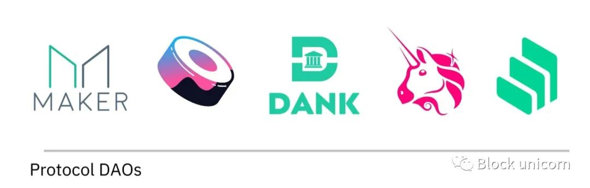

顾名思义，协议 DAO 是用于帮助构建协议的协作实体。一个例子是上面讨论的 MakerDAO 之类的东西。Maker 协议不是完全由集中式团队构建和管理，而是由相关 DAO 编排。 

事实上，在其多年的运营中，Maker 构建了一个由 15 个核心单元组成的复杂结构。每个单元都有任务和预算，由一个或多个协调人管理，协调和支付贡献者以实现 MakerDAO 内的长期目标。此外，每个部门都是一个独立的结构，由其自己的条款管辖，但仍然对 Maker 持有者做出回应。 

其他如 Sushi、Uniswap、Compound、DANK 也可以被视为协议 DAO，尽管每个都根据自己的结构运行。
#### 社交 DAO
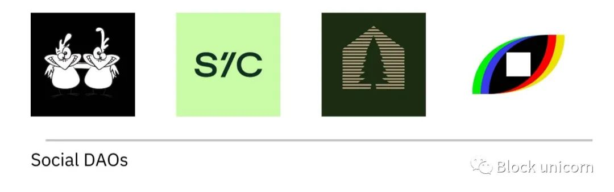

Friends with Benefits (FWB) 是一个经典的社交 DAO，尽管具有我们提到的工程技术。这里的目标是创建一个强大的社区。在这方面，最终结果与其他在线聚会并没有什么不同，尤其是那些有围墙花园的聚会。（一些 DAO 还专注于连接线上到线下，举办 IRL 聚会。）正如我们所讨论的，不同之处在于自治和所有权的概念。 

由撰稿人 Jess Sloss 创立的 Seed Club 是该领域的另一位参与者——尽管职责范围很广。CabinDAO 和 Bright Moments 是另外两个例子。 
#### 投资 DAO
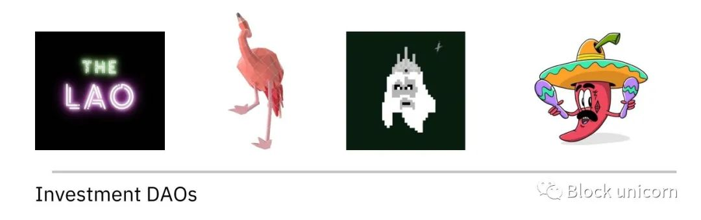

如果社交 DAO 主要是关于社区，那么投资 DAO 主要是关于回报。类似于 The DAO——第一个命运多舛的投资实体——这些项目的目标是聚集资本和投资者进行部署。与传统的风险投资公司不同，决策实际上是民主的，LP 对相关机会进行投票。 

通常，不同的投资 DAO 会有不同的侧重点。例如，一个人可能专门购买 ENS 名称，另一个人可能专注于区块链游戏，而第三个可能会资助加密初创公司。

由贡献者亚伦赖特创立的 LAO 是该领域的领导者。该母公司已经分拆出一些额外模块，包括火烈鸟和海王星。而 MetaCartel 是另一个值得注意的投资 DAO。 
#### 授予 DAO
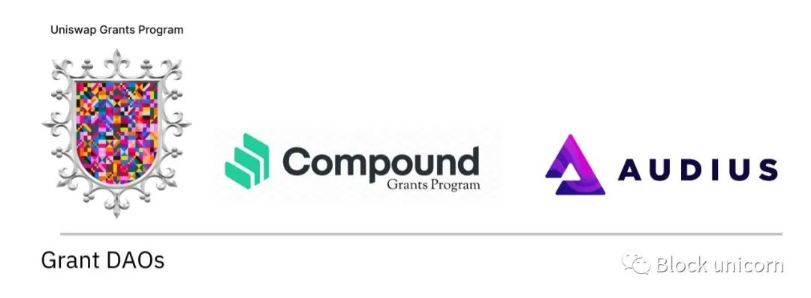

在上面提到的那篇文章中，Turley 指出，许多早期的 DAO 都是面向赞助的，作为 Grant DAO 运作。通常，这些存在于预先存在的项目之外，作为社区激励的一种形式。通过拨款，这些 DAO 寻求推进更广泛的生态系统，支持有前途的项目，并为新的 web3 贡献者开辟道路。

例如，Uniswap 运营 Uniswap Grants，Compound 和 Audius 也在做同样的事情。尽管在功能上与父实体不同，但它们仍然通过一种目的感联系在一起，并且通常是一个共同的社区。 
#### 服务 DAO
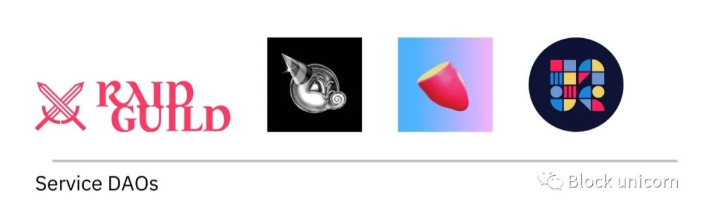

服务 DAO 在这个领域占据了一个独特的位置。具体而言，这些实体充当人才聚合器，将可用于某些项目的人力资本聚集在一起。 

例如，RaidGuild 称自己为“Web3 生态系统的首要设计和开发机构”。不过，与传统机构不同的是，Raid 没有正式员工或公司结构：它是一个 DAO。

Service DAO 与 1Up World、Tellor 和 Stake On Me 等客户合作。 PartyDAO、DAOhaus、Yam DAO和其他许多都属于这一类别。
#### 媒体 DAO
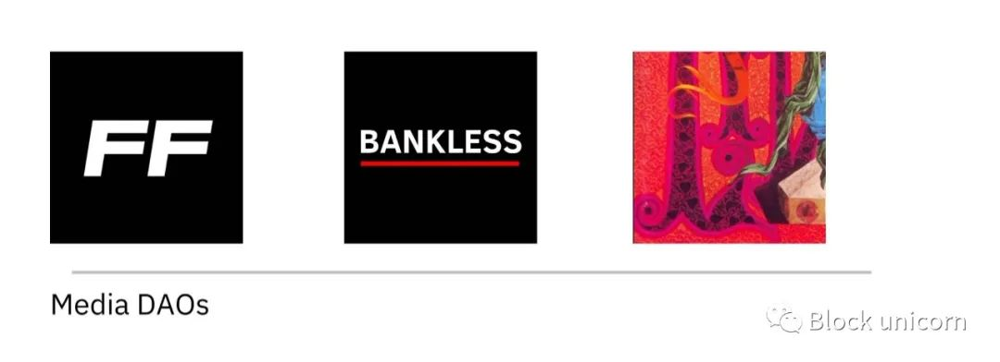

Forefront、Bankless 和 DarkStar 是 Media DAO。这些实体通常协作制作公共内容。来自该内容的奖励在整个团队中共享，而治理也是一项公共事务。利益相关者可以帮助决定要涵盖的主题以及管理资源。
#### 创建者 DAO
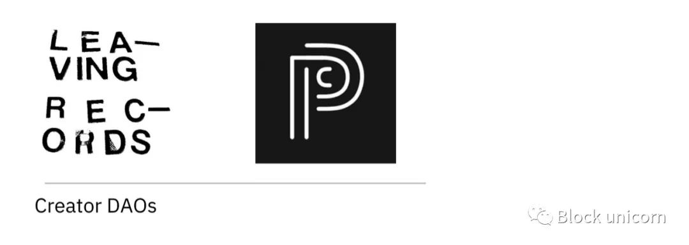

如果 Media DAO 经常关注出版物，那么 Creator DAO 则以个人为中心。就像一些粉丝俱乐部为影响者最热情的支持者提供消费和互动的机会一样，DAO 也有能力这样做。除了纯粹的粉丝之外，利益相关者还可以积极贡献或为支持他们最热衷的创作者的组织工作。 

目前这是一种不太常见的结构，但可能会变得更受欢迎。我们已经看到许多创作者通过 Roll 等产品采用“社交代币” ，这为真正的 Creator DAO 奠定了基础。先行者包括 Leaving Records 和 Personal Corner。 
#### 收藏品 DAO
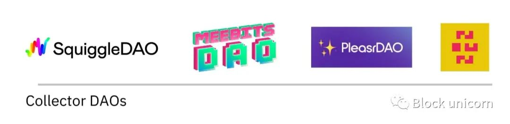

尽管与 Investor DAO 共享一些利润动机，但 Collector DAO 最终的定位略有不同。这些实体将贡献者围绕某些资产或收藏品联合起来。NFT 是一种常见的选择。 

虽然 NFT 的积累也可能产生极其有利的财务回报，但这些社区通常无意出售他们的物品，至少在中短期内是这样。对 NFT 和其他收藏品的收购也有一个根本不同的基调——参与与粉丝和亲和力一样多，甚至更多，因为它与阿尔法有关。 

这些团体也经常担任某些项目的策展人的角色，增加了一种机构寿命和支持。 

例如，SquiggleDAO 的存在是为了支持和收集生成艺术，而 MeebitsDAO 收集 Meebits NFT。PleasrDAO 充当跨项目的“艺术收藏帝国”。NounsDAO 是 Noun NFT 持有者的聚集点，他们在未来的 Noun 销售中获得份额。

当然，DAO 可以存在于这些类别之外或之间。例如，Krause House 是一个 DAO，它既是一种投资工具，也是一种社会倡议：它的组装目标是共同购买一支 NBA 球队。 

展望未来，值得重申的是，虽然上述类别具有指导意义，但我们才刚刚开始。许多未来的伟大 DAO 将在这些界限之外进行绘制。 

## 哲学与文化
DAO 代表了大规模人类协调的新框架，而人类协调的核心无论是否去中心化都是是组织文化。 

与早期初创公司的公司文化或未被发现的音乐场景中的社区文化没有什么不同，文化可以定义为个体群体之间出现的行为、模式和价值观。在他们的开创性文章“ Squad Wealth ”中，研究组织其他互联网指出，文化可以由任何东西组成，从“模因、热门话题、内部语言、𝓪𝓮𝓼𝓽𝓱𝓮𝓽𝓲𝓬𝓼，到只能被制定为一个群体的人工制品。”

虽然每个 DAO 都找到了自己的方式来产生具有视觉、语言和行为规范的文化，但在整个 DAO 环境中，两个特征似乎特别普遍：

- 成员行为的倾向

	"像老板一样行事" 

	当谈到 DAO 的文化时，所有权具有巨大的影响力。 它不仅激励个人参与，而且从根本上改变了贡献者对他们的努力和劳动的看法。所有的工作都建立在追求更大的目标之上，其中的好处是共享的。所有权充满了创造、成功和~共鸣~的感觉。与传统工人相比，老板自然会在经济和心理上更有动力支持同龄人，提升他人的工作，将自我放在门外，并尽其所能。

	投资公司 Variant 的联合创始人杰西·瓦尔登 (Jesse Walden) 在这个问题上特别有先见之明。在这篇名为“所有权经济”的文章中，瓦尔登指出： 

	随着个人在价值创造中的作用变得越来越普遍，下一个演进步骤是朝着不仅由个人用户构建、运营和资助——而且也由用户拥有的软件发展。
	从某种意义上说，DAO 正是这种“软件”。他们提升了个人，让用户有机会贡献和拥有。那是强大的。
- 以及对彻底透明的期望

	“彻底透明”

	透明度在任何组织文化中都起着至关重要的作用，因为它可以在所有参与者之间建立信任。由于区块链上任何 DAO 的 ETH 地址的公开和不可变活动，DAO 以前所未有的水平实现了这一点。这创建了一种隐式和显式的制衡机制，允许利益相关者社区随时了解 DAO 如何行使其资本，同时确保领导团队根据社区做出决策。

	这种彻底的透明度会激励合作而不是竞争，并且由于个人对组织环境的深刻理解，因此他们能够对自己的工作拥有自主权。

	最终，DAO 的文化由个人群体之间形成的一对一关系定义，这些关系可以提炼为一组可重复的行为和模式。 

	通过新形式的分散所有权和透明度，DAO 有可能创建新的组织结构，使用户不再是平台上的被动参与者，而是积极的、受到适当激励的网络所有者——以信任和协调为中心。这种权力和文化的分配会带来更多的敏捷性、弹性和反脆弱性，这有助于创造一个世界，在这个世界中，互联网上的大量人群甚至可以与最强大的中心化公司抗衡。

## 视图
DAO 已成为整个 web3 世界的核心组织原语。与此同时，一个新兴的生态系统已经出现，以支持这些组织的核心功能。 

下面，我们将重点介绍 DAO 领域中具有影响力的利益相关者。我们应该注意，Web3 发展迅速，每天都在变化，新进入者不断改变空间的面貌。 不过，我们将概述以下职能领域的参与者： 

- 组织
- 沟通
- 社区
- 治理
- 赔偿
- 金库

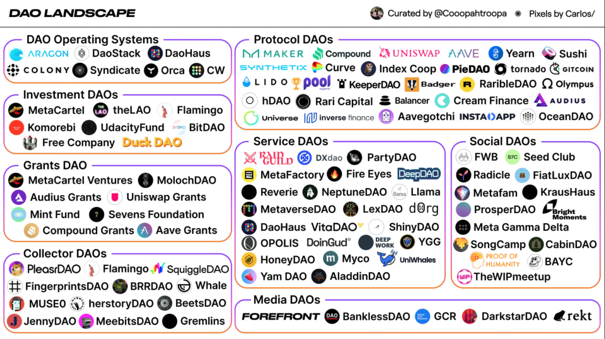

### 组织
为了参与一个 DAO，首先必须有一个 DAO。 目前有几个项目在争夺霸权，包括 Aragon、Syndicate、Orca、Tribute 和 Colony。这些并不总是直接竞争，因为每个解决方案都提供独特的价值主张和功能集。 

这些项目有什么作用？一种简单的方法是将它们视为 Stripe Atlas 的加密原生版本——它们允许 DAO 起步。这包括

- 会员管理
- 财务工具
- 治理基础设施等 

在未来几年，我们应该会看到更多的产品进入市场以支持 DAO 的形成。正如白标解决方案用于处理内容管理等任务一样，我们很快就会达到新的 DAO 构建者有多种选择的地步。 

- Aragon（阿拉贡）

	Aragon 成立于 2016 年，提供一套应用程序来大规模创建、管理和治理 DAO。这包括 
	
	- Aragon Court
	- Aragon Govern
	- Aragon Voice
	- Aragon Client

	作为最早致力于 DAO 基础设施的团队之一，Aragon 协会已成为 DAO 的重要服务提供商，并声称拥有 LidoDAO 等知名项目的用户。
- Syndicate

	贡献者 Will Papper 是 Syndicate 的联合创始人，Syndicate 是一个专注于投资 DAO 的去中心化投资协议和社交网络。它的使命是通过允许个人和社区比传统基金更快、更便宜地推出投资工具，从而使投资世界民主化。Syndicate 的解决方案包括法律支持和社交网络协议，允许投资社区召集、交流和部署资本。
- Orca（基于Solana的DEX）

	DAO 通常发现难以大规模维持高参与率。Orca 协议对此有一个聪明的解决方案，同时也减少了资金和资源部署的瓶颈。 

	具体来说，Orca 利用“ Pod 模型”，其中单个单一的金库被较小的 “Pod” 取代，每个 “Pod” 都有自己的子会员和钱包。本质上，每个 pod 都充当更大 DAO 结构中的迷你 DAO。 

	这是一个很大的解锁，通过为 pod 创建基础设施来根据需要附加和分离，为 DAO 带来可组合性，有点像 DAO-lego。它还使小组更小，使协调和参与更容易。
- Tribute

	作为 MolochDAO 生态系统的一部分，Tribute 提供了一个开源解决方案框架，DAO 可以利用这些框架来更好地扩展。它的技术堆栈包括
	
	- 取消提案
	- 创建无投票权股份
	- 踢出成员
	- 使用 NFT 成为会员
	- 白名单代币等的解决方案

	Tribute 基本上是模块化的，允许 DAO 挑选他们需要的解决方案。
- Colony

	受蚁群的启发，Colony 提供了一系列以太坊智能合约，无需任何编码即可启动 DAO。Colony 简化了治理、权限、补偿等。 

	Colony 本身由 Metacolony 维护—— 一个尚未公开的 DAO。Metacolony 将不断开发和维护工具，供那些利用 Colony 基础设施的人使用。 
	
### 沟通
一旦 DAO 成立，它需要促进其成员之间的沟通。当然，健康的讨论是信息共享的关键，它开启了良好的投票实践、资金管理和更广泛的协调。没有 DAO 想成为安静的地方。 

已经出现了许多促进对话的工具，其中包括 Discord、Telegram 和 Twitter。

- Discord

	可以说，DAO 的主要沟通和协调方式是 Discord。对于那些尚未进入令人眼花缭乱的 web3 服务器快速火力世界的人来说，Discord 是一个免费的语音、视频和文本聊天平台，在生态系统中迅速普及。 

	它的特性使其对 DAO 尤其有吸引力。一方面，启动 Discord 相对简单，而且由于其频道和子频道架构，组织沟通变得简单而灵活。（即使它并不能完全平息疯狂。） 

	至关重要的是，由于 Discord 已成为 web3 中的默认设置，因此出现了许多有用的机器人和插件来支持它。其中最主要的是
	
	- “令牌门控”功能

		如前所述，一些 DAO 限制对那些持有一定数量原生代币的访问。例如，如果我们要启动 RandomDAO，我们可能会坚持要求任何想要加入 Discord 的人都需要持有 420 个 $RANDOM 代币。 

		Collab.Land 之类的工具使 DAO 可以轻松确保仅向满足令牌要求的人授予对私人聊天的访问权限。其他广泛使用的机器人包括 MEE6 和 Statbot。 

	此外，值得注意的是，Discord 与现有站点集成良好；随着越来越多的社区过渡到 DAO，预计这将成为一个越来越重要的功能。 
- Telegram

	Discord 最常见的替代品是 Telegram。尽管在加密人群中很受欢迎，但聊天应用程序在 DAO 中的采用率与 Discord 不同。这在很大程度上是因为 Telegram 没有提供相同级别的粒度，特别是在机器人和子渠道方面。 

	它比较简单，也许是因为，然而，电报是经常对于那些刚刚起步的 DAO 
- Twitter

	“Twitter 怎么还免费？” 这是该平台最狂热的用户之间的一个笑话，这是有充分理由的。在许多方面，Twitter 已成为某种公共产品，尤其是在加密世界中。在特定日期流经该平台的信息和洞察量是惊人的，其作为行业事实上的社交图谱的至高无上地位巩固了其重要性。（当然，其他人会来争夺那个宝座。） 

	虽然 Twitter 没有解决 DAO 对私密、高容量聊天的需求，但它仍然是生态系统中的一个重要通信工具——特别是用于发现新项目——如果我们至少不承认这一点，我们就会失职。 	
	
### 协调
无论是当地社区还是跨国公司，任何集体面临的最大挑战之一是协调，尤其是在规模上。从历史上看，我们使用层次结构来管理这个问题，但是在扁平的、分散的结构中什么是最好的解决方案？

DAO 依靠许多不同的工具来管理他们的社区和优化协调，包括 Coordinape、Collab.Land、SourceCred 和 DAOhaus。 

- Coordinape

	通过 DEFI 蓝筹股协议，如向往和寿司使用，Coordinape 帮助的 DAO 协调和资源分配给贡献者。 

	例如，Coordinape 的“ Circle ”产品允许 DAO 贡献者“赠送”有限数量的 GIVE 代币给他们认为正在为组织带来价值的人。虽然这样做的好处是有趣和奖励参与，但它也创建了一个事实上的“薪酬地图”，说明谁在推动项目向前发展。此外，补偿过程在功能上是分散的，因为任何人都可以选择奖励任何人。 

	这种机制的批评者认为，p2p 补偿会导致人气竞赛，其中最响亮、最外向的成员获得超额分配。 
- Collab.Land

	Collab.Land 为 Discord 和 Telegram 提供了一个令牌门控机器人。它在为任一平台上的 DAO 成员分配角色时也很有用。由于其相对易用性，Collab.Land 已成为业界常用的工具，随着 DAO 数量的增加，其使用率应该会上升。 

	Guild 虽然尚未完全启动，但它是具有类似功能集的替代方案。 
- SourceCred

	DAO 使用 SourceCred 来衡量和奖励个人对项目的贡献。那些通过努力为 DAO 带来价值的人会根据组织设定的参数获得“信誉”。Cred 是一种简单量化贡献者声誉和工作的强大方法。 

	DAO 还可以发行带有信用的“ Grain ”，它可以用作工资等价物。SourceCred 区分令牌，注意： 

	如果 cred 回答“谁提供了价值？”这个问题，Grain 会回答“我们应该如何奖励人们提供的价值？”
- DAOhaus

	DAOhaus 是一个“无代码平台”，用于基于 MolochDAO 构建的框架启动和运行 DAO。该平台允许用户通过一个中央枢纽进行协调，在那里他们可以检查活动、治理建议和财务状况。会员资格也可以从这里管理。 

	由于该平台基于 MolochDAO 的结构，DAOhaus 用户可以访问该父组织提供的所有工具，并具有用户友好的包装器的好处。 

### 补偿
让我们换个角度谈谈 DAO 如何补偿贡献者。正如我们所提到的，一些提供支付功能作为更大的 DAO 套件的一部分，但也存在专门的产品。Superfluid 和 Sablier 尤其引人注目。 

将这些工具视为 “DAO 的工资单” 的一种方式。他们帮助 DAO 在区块链上以最少的 gas 费用定期处理付款。

对于那些刚接触加密货币的人来说，该领域的许多术语可能听起来令人困惑。关于这些项目需要注意的重要一点是，它们使 DAO 可以轻松地向区块链上的贡献者付款。

- Superfluid

	Superfluid 是一种允许可编程现金流的协议。使用其独特的 ERC-777 标准，您可以定义“价值流”，以便补偿自动不断地流向 DAO 的贡献者。这有点像设置您公司的工资单，这样，您的员工就可以根据他们工作的每一秒获得实时报酬，而不是每月获得两次报酬。所有这些都无需您进一步干预。 
- Sablier

	与 Superfluid 一样，Sablier是一个金融流媒体平台。Sablier 创建于 2019 年，支持任何 ERC-20 代币，并且不收取使用合约的费用。 

	Sablier 的一个显着特点是它真正具有自主性。创建该项目的团队销毁了控制第 1 层合约的管理密钥。这意味着 Sablier 的制造商不再有能力阻止新流的创建。用创始人保罗·拉兹万·伯格 (Paul Razvan Berg) 的话来说，它是“100% 去中心化的公共产品”。
	
	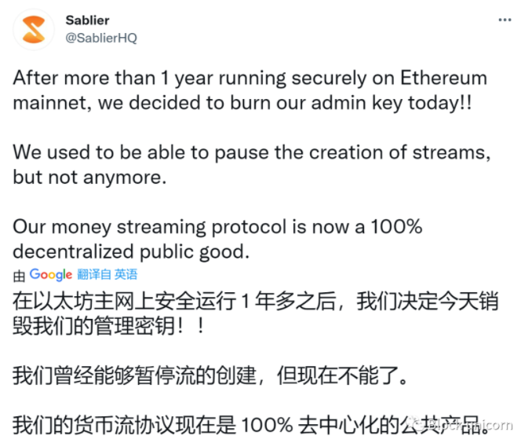

### 治理
大规模解决治理和协调决策是 DAO 当今面临的最困难的问题之一。为什么这么难？ 

web3 的一大亮点是其抗审查性和“无需许可的可访问性”。换句话说，任何人在任何地方都可以在不受第三方干扰的情况下相互交易或参与去中心化的协议和应用程序。例如，没有政府能够阻止你加入 DAO。（至少，理论上是这样。） 

这种无需许可的访问有时可能是一把双刃剑，尤其是随着 DAO 的增长和扩展。如果成员没有硬性上限，DAO 通常会随着时间的推移变得更大和更加多样化。最终，流行的 DAO 可能拥有数以万计的成员，每个人都会带来不同的技能、经验、价值观、观点和背景。 

web3 使个人能够从劳动者转变为所有者是其最基本、最引人注目的属性之一。但随着社区变得越来越去中心化，对稳健治理的需求也随之增加——否则，你最终可能会得到一个支离破碎的组织，其中每个参与者都只是在风中尖叫。 

几个团队正在疯狂地解决这个问题，构建有助于组织和激励成员的工具。Snapshot 和 Discourse 是两个在空间中广泛使用的看似强大的产品。 	

- Snapshot

	Snapshot 是一个链下、无气体投票平台，主要由发行 ERC-20 和 ERC-721 治理代币的 DAO 使用。以太坊上昂贵的 gas 费用排除了除最大代币持有者之外的所有人的链上治理。 

	Snapshot 通过提供一种易于使用且成本低廉的治理参与方法而大受欢迎。本质上，DAO 贡献者可以前往他们组织的快照页面，查看要投票的主题并进行权衡。例如，以下是 Sushi 社区最近投票的提案。 
	
	- Sushi Snapshot 页面

		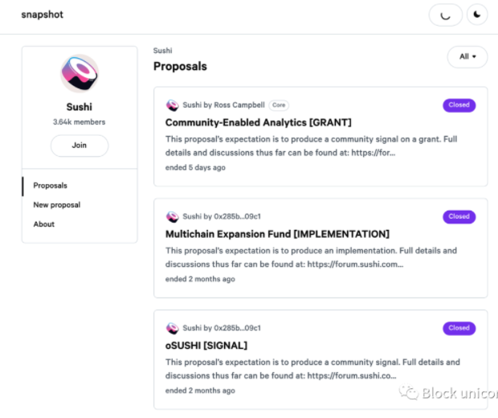
		
	举几个值得注意的例子，比如 MakerDAO，大多数代币 DAO 现在将 Snapshot 投票集成到他们的治理过程中。需要注意的是，Gnosis 生产的产品“ SafeSnap ”（下文讨论）允许链上执行链下投票。它通过利用 Snapshot 和 Gnosis Safe 的组合功能来实现这一点.
	
	基本上，DAO 参与者仍然可以在链外投票——节省燃料费——随后的结果，并在以后无缝地在链上制定，没有干扰的可能性
- Aave	
	
	Aave 话语论坛就像 DAO 的“参议院”，代表了对提案进行正式讨论和反馈的场所。围绕治理提案的讨论和辩论可能会在 Discord、Telegram 甚至 Twitter 等后台渠道中进行，但通常提交的内容最终会在 Discourse 上进行，以便进行更有针对性的长篇幅讨论。由于其功能更加正式，Discourse 论坛还充当与 DAO 相关的讨论和提案的档案。
	
### Treasury 金库
许多社区 DAO 要求成员投入前期资金才能参与。然后，这笔资金将汇集到 DAO 的“金库”中。与传统公司一样，DAO 希望有效地管理他们的资产，并希望增加他们的持股。为此，许多人将他们的资金投资于整个数字生态系统的资产，包括 NFT、社交代币、加密项目等。实际上，它们充当分散的投资基金。

为了避免您认为此类实验在规模上微不足道，值得注意的是，今天 DAO 共同管理着数百亿美元，这些是具有复杂需求且有意义的组织。 

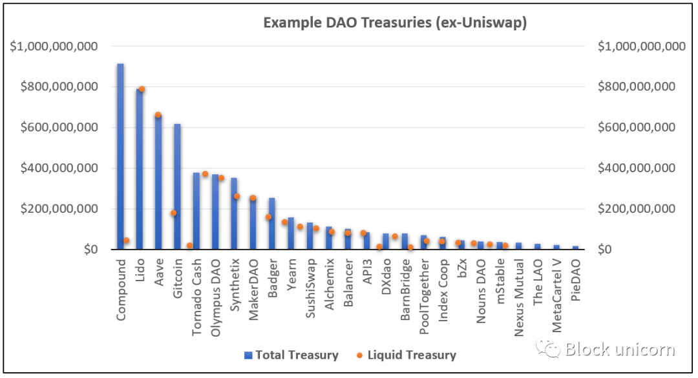	

开放组织

大多数 DAO 都有雄心勃勃的计划，但精明的管理可能很困难。首先，加密行业非常不稳定。随着资产价格的上涨和下跌，DAO 的资产在某一天可能会波动 20% 或更多。为了防止这些波动，DAO 必须多样化。

Llama、Parcel 和 Gnosis 旨在为财务经理提供处理此类动荡所需的工具

- Llama

	Llama 是一个 DAO，专注于协助其他 DAO（元宇宙）进行资金管理。LlamaDAO 已经通过 Gitcoin 赠款协调了一些大客户。它为 Aave、PoolTogether、Uniswap、Gitcoin 和 FWB 等协议创建了仪表板、报告、资金管理指南、协调的销售和财务报表。
- Parcel

	Parcel 是 DeFi 中一些最大的 DAO 使用的财务套件，包括 Aave Grants、Compound Grants 和 Synthetix。目前处于封闭测试阶段，Parcel 为 8 个 DAO 提供服务，并已被用于为各种程序批量支付 300 万美元。随着 DAO 的扩展，他们将需要 Parcel 提供的解决方案来管理资金流，以有效地授予接受者、支付贡献者和部署资金。
- Gnosis Safe

	Gnosis Safe 是 GnosisDAO 开发的一项服务，可为 DAO 多重签名钱包提供更好的用户体验。 

	- 什么是“多重签名”？

		它只是一个需要多个签名才能批准交易的钱包。不是一个人能够批准付款，而是需要多方。DAO 传统上使用此框架来管理资金、防止滥用和权力下放。 

		与某些替代解决方案不同，Gnosis Safe 支持 ERC-20s 和 ERC-721s 资产，允许 DAO 将 NFT 保存在多重签名钱包中。由于许多 NFT 的价格大幅上涨，强大的资金工具在这里变得越来越重要。 

### 其他著名组织
DAO 有机会将接下来的 1 亿或更多用户带入 web3。作为组织发展和部署的基础结构，DAO 将揭示协调个人和专业参与的新方法，重新思考我们作为一个集体的运作和决策方式。 

当上面提到的工具和策略结合在一起时，值得强调一些使它们栩栩如生的流行项目。

- PartyDAO

	PartyDAO 是设计和构建 DAO 工具的开发人员、作家、工程师和设计师的分散集合。他们的第一个产品“ PartyBid ”允许用户汇集资金来竞标 NFT。用户已经使用 PartyBid 汇集资金来竞标 Cryptopunks、Andrew Yang 的 NFT 和 CrypToadz。随着9 月底“ Party Splits ”的发布，PartyDAO 现在可以实现 NFT 的碎片化，分配所有权。 
- Mirror（镜子）

	Mirror 由 Denis Navaroz 创立，是一个去中心化的出版网络。通过 WRITE 代币的中介，用户可以支付 WRITE 来创建自己的镜像域，他们可以向该域发布文章并通过他们的投票权影响新成员的批准。 

	很快，Mirror 已成为发布关于 web3 的想法和启动社区工作的事实上的地方。例如，Mirror 的 CTO 发起的“Crypto, Culture, & Society”利用该平台勾勒出一个加密学习 DAO，在此过程中筹集了 25 个 ETH。
- Seed Club

	种子俱乐部是一个建立、支持和投资代币化社区的 DAO。该社区包括社交令牌空间中的许多顶级影响者和创始人。种子俱乐部已经与著名的 DAO 和社区合作，包括 PartyDAO、Forefront、The Generalist 和 SquiggleDAO。
- FWB

	我们已经谈到了 FWB，但 DAO 的影响值得稍微讨论一下。就在本周，大型社交 DAO 宣布已从 a16z、Pace 和其他公司筹集了 1000 万美元的资金。 

	FWB 是最大的加密思想家集合之一，并主持广泛的讨论。Discord 的一个频道可能会谈论音乐，另一个频道可能会谈论 NFT，而第三个频道可能会谈论投资。除了作为一种 web3 社交俱乐部，FWB 成员还积极为社区构建产品，正如所讨论的。简而言之，它正在成为加密货币真正的文化、生成之家。 
- LAO

	根据定义，LAO 不完全是一个 DAO。相反，创始人亚伦赖特的实体是一个“有限责任自治组织”。尽管保留了 DAO 的许多特征，但 LAO 是一个真正的特拉华州合并实体。通过将产品置于传统的法律世界，LAO 力求为其成员理顺和简化棘手的法律和税务问题。 
	
	除了其差异化的结构之外，LAO 在投资 DAO 领域的影响力也非常出色。它不仅收到了超过 6500 万美元的捐款，还催生了一波子公司。这包括 
	
	- Flamingo（一个 NFT 集体)
	- Red DAO（一个数字时尚 DAO）
	- Neon（一个元节 DAO）
	- Neptune（一个 DeFi 流动性 DAO）等等
	
	正如前面提到的 DAO 的多样性所指出的，有限责任结构可以在整个加密相关项目范围内提供帮助。

	鉴于这些实体在过去几年中一直在加密领域非常活跃，纸面回报几乎肯定是疯狂的。赖特本人在推特上表示，火烈鸟的资产管理规模有望达到 10 亿美元：
	
	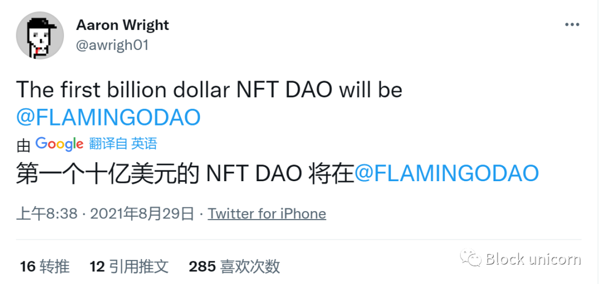
- MetaCartel

	MetaCartel 是一个去中心化的建设者团体，他们最初致力于支持 Dapp 开发，但后来转向孵化 DAO。MetaCartel 对人们进行 DAO 教育，对现实世界的 DAO 进行案例研究，并协助与新 DAO 的开发和引导相关的所有事情。

	MetaCartel 还成立了一个名为 MetaCartel Ventures 的投资部门。反过来，它又投资了其他几个 DAO。 
- Moloch DAO

	Moloch DAO 最初成立是为了资助与 ETH 2.0 相关的以太坊公共基础设施的开发。从那时起，Moloch 已扩展为 Grants DAO，通过其赠款支持 Tornado Cash、Lodestar 和 Dapp 节点等项目。已经创建了许多子行会来评估申请资助的项目。 

	此外，MolochDAO 提供了一个带有 v2 智能合约的开源 DAO 框架。我们之前注意到 Tribute 和 DAOhaus 都从 Moloch 的工作中受益。 
- Rabbithole

	Rabbithole 是一个学会赚钱的 DAO，它为消费者提供了一条了解加密货币的途径，同时还能获得奖励。 

	在此过程中，Rabbithole 提供具有用户获取功能的加密协议。在过去的一年里，加密协议和产品的数量呈爆炸式增长，这使得一些项目很难找到并留住积极、熟练的参与者。 

	通过“任务”，Rabbithole 帮助协议获得训练有素的社区成员，他们在此过程中展示了自己的能力。Aave、Opensea、Matcha、Perpetual Protocol 和 PoolTogether 已经与 Rabbithole 合作。

随着新的 DAO 日益受到关注，预计这份有影响力的组织名单将在未来几个月和几年内迅速增长。	
## DAO 的优势
像我们在上一节中所做的那样概述环境使一些事情变得非常清楚：DAO 很难。即使在最好的时候，也很难协调一大群人朝着一个共同的目标前进。DAO 接受了这一挑战，增加了技术和社会复杂性的层（和层），并引入了巨大的经济波动。 

结果就像试图在一个新星球上建立一个国家，那里的人口每年增长 5,000%，而您的自然资源每天都在发生巨大变化。 

### 那么，为什么会有人想要创建 DAO？
除了享受真正新颖且仍然具有革命性的事物之外，创建 DAO 的核心原因有以下三个：

- 易于资本形成
- 共享优势
- 透明度

### 易于资本形成
简而言之，DAO 是汇集可由团体管理的资金的最简单方法之一。例如，它比建立一家传统的投资公司要简单得多，也便宜得多。 

由于 DAO 建立在公共区块链上，因此从一开始就受益于全球金融基础设施。启动由集体控制的共享钱包很简单。尽管加密入门仍有很多不足之处，但一旦您拥有钱包和一些代币，您就可以将这些代币转移到世界上的任何其他帐户，无论它们位于何处。从本质上讲，DAO 允许您创建具有协作功能的跨境基金。 

资本形成很重要，因为它使社区能够投资于他们关心的项目。在过去的几个月里，DAO 筹集了资金来收集 NFT、构建软件、创建互联网原生社交俱乐部、制作音乐、促进碳清除等等。
### 共享优势
正如我们所概述的，DAO 成员资格通常由加密代币强制执行。对于许多 DAO，如果您持有特定的 NFT 或一定数量的 ERC20 代币，您将被视为“官方”成员。这些代币可以提供许多与治理、访问、状态、价值捕获等相关的功能。最后一点——价值捕获——至关重要，因为它允许人们通过为 DAO 做出贡献来谋生。 

从历史上看，项目的财务收益主要集中在创始人、早期员工和投资者身上。加密代币提供了一种奖励一系列利益相关者的流畅方式，包括自由职业者、服务提供商，甚至客户。 

应该说，对某些令牌缺乏可访问性存在合理的担忧。随着一些 DAO 变得越来越流行，它们的代币价格上涨，使得事实上的会员资格变得昂贵。

许多 DAO 开始通过引入资助计划和奖学金来解决这个问题，这些计划和奖学金资助经济能力有限的高潜力成员。随着时间的推移，我们希望看到更多这样的举措。
### 透明度
正如我们在“哲学”部分所指出的，大多数 DAO 都具有很强的透明度文化。为此，许多 DAO 感觉更像是开源项目而不是公司。除了只是在公共场合构建之外，DAO 还可以在公共场合进行交流、加入、交易和治理。这有助于产生有意义的不同交互和行为。 透明度将在以下的沟通、成员资格和治理方面的表现。

- 沟通

	如上所述，DAO 倾向于使用 Discord 或 Telegram 进行同步通信。通常，任何人都可以加入公共渠道以了解有关该项目的更多信息。  

	也有私人会员专用频道，虽然它们不会散发出最透明的氛围，但它们仍然是 DAO 历史和决策的重要记录。
- 会员资格

	由于 DAO 成员资格通常以加密代币计价，因此任何人都可以查看相关信息。在链上，你可以看到有多少代币持有者，发现会员的价值，并检查随着时间的推移谁购买或出售了代币。 

	有趣的是，由于加密代币用于会员身份，DAO 可以根据其代币持有量奖励其他 DAO 的成员。例如，Rabbithole 可以向钱包中持有 $FWB 代币的任何人提供奖励。这可能会在未来几年迎来“成员可组合性”，允许社区以更亲社会的方式进行协作。 
- 治理

	DAO 的决策和资金流动也是透明的。社区成员可以提出新的倡议并对关键决策进行投票。这将治理变成了一种社会特征。

	例如，Nouns DAO 在过去三个月中从 NFT 拍卖中筹集了超过 5000 万美元，成员投票通过捐赠给慈善机构、构建 iOS 应用程序和出版漫画系列来花费这笔资金。尽管绝非万能药，但 DAO 结构确实有明显的好处。
	
## 如何建立自己的 DAO
如果上面的部分激起了你的兴趣，你可能想知道如何开始一个 DAO。 虽然不是小事，形成一个DAO时创建一个DAO的多，更难的任务比较容易持久的价值。坦率地说，这个领域的新生意味着我们仍然不知道一个持久异常的 DAO 是什么样子。

如果你只是希望旋转了一个 DAO 结构的缘故吧，在 PlayBook 可能类似于下面的叫杰西斯洛斯列出的一个 ：

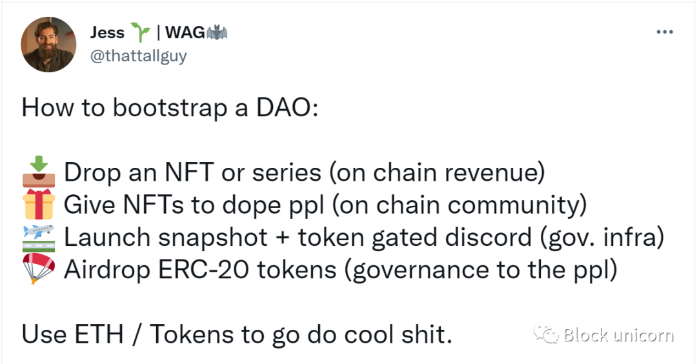

出售一些 NFT，在您的社区中培养很酷的人，关闭 Discord，并丢弃一些代币。任务完成。 

但这实际上只是未来任务的开始。要了解如何构建具有真正价值的 DAO，缩小并查看大多数 DAO 发布涉及的四个阶段会很有帮助。 

1. 召唤冒险

	与“使命”或“愿景”等术语相比，对冒险的呼吁更准确地描述了参与者对 DAO 的购买。 

	当然，加入是朝着一个目标前进，但前方的道路尤其朦胧且真正未曾涉足。那些加入的人正在报名参加逆境、潜在的失败以及在动态、流动的结构中与困难作斗争。 

	来自 DAO 的一些奇妙的冒险：

	- KrauseHouse 寻求成为第一个由 DAO 拥有和管理的 NBA 特许经营权。 
	- GitCoin，正在建设和资助“数字公共产品”。 
	- FWB，它正在文化和加密的交叉点建立强大的影响力。 
2. 所有权分配

	在吸引真正信徒的注意力后，DAO 需要分配所有权。 这是一项重要的任务，也是一项关键的设计决策。
	
	- 一些 DAO 从一开始就通过代币分配所有权，就像 NFTx 和 Sushi 一样。
	- 其他人选择用较小的团队进行构建，然后在产品或社区证明需求和动力后分配所有权。Uniswap 和 Compound 就是这里的例子。

	归根结底，DAO 可以通过多种方式将所有权分配给贡献者。
	
	- 一种方法是“空投”，即根据之前的操作（例如购买 NFT）将代币分发给成员。
	- 另一种是通过“赏金”；例如，当用户在其平台上了解加密项目时，Rabbithole 会提供代币。其他人通过去中心化交易所开放代币购买，例如 Uniswap。

	如果做得好，所有权分配会将代币交到具有一致价值观的个人和组织手中，这将有助于并帮助 DAO 向前发展。 

	几个不同的 DAO 如何分配所有权的例子： 
	
	- Squiggle DAO 要求你拥有一个 Squiggle NFT 才能加入 Discord。后来，$SQUIG 代币被空投。 
	- SuperRare 向使用其 NFT 平台的艺术家和收藏家分发了 $RARE 代币。 
	- FWB 要求会员拥有 75 美元的 FWB 代币。这些可以在 Uniswap 上购买，也可以通过赠款获得
3. 治理

	决定如何作为一个群体做出决策是 DAO 启动过程的一个重要阶段。处理这种决策的团体通常被称为“治理结构”。web3 的一个有意义的部分非常关注这个主题，并不断研究新的方法论和方法。即使复仇创始人维塔利克·巴特林最近权衡的问题。

	在最简单的形式中，治理是在 DAO 或在 DAO 内运营的团队做出的决策中建立合法性的过程。 

	治理结构有很多种，但最常见的决策方法是“代币加权投票”。 在这个系统中，一个代币代表一票。成员提出的提案和工具（如 Snapshot）允许用户表明他们对手头主题的偏好。这些投票的结果要么自动执行，要么由多重签名的签名者确认。

	一些治理结构最终看起来更像是直接民主国家，成员对大多数提案进行投票，而其他治理结构则充当代议制民主国家，其中具有授权的核心团队代表集团投票。治理结构通常会随着时间的推移而演变。 

	“法案如何成为法律”的 DAO 版本可能是这样的：

	1. 讨论和塑造。一个成员在 Discord 中提出一个想法，这个想法是通过对话形成的，并建立了早期的共识。 
	2. 提案的正式化。提案可能会发布在 Discourse 上，从而导致更正式的对话和评论。在此过程中，可以改进提案。 
	3. 对该提案进行投票。使用 Snapshot，DAO 授权代币持有者在规定的时间内对提案进行投票。 
	4. 提案的执行。一旦投票结束，多重签名者就会执行交易或操作。 

	治理的重点是做出正确的决策并推动项目向前发展。善治确保声音被听到，合法性得到管理并建立势头。
4. 激励和奖励

	DAO 协调努力以实现目标；激励措施推动了这种努力。DAO 提供的第一个奖励通常是原生治理代币，它赋予早期贡献者所有权。

	虽然这些代币在市场上可能没有直接价值，但它们代表了个人为新组织做出贡献的相对价值，以及 DAO 集体价值的共享所有权。 

	当然，并非所有奖励都是财政奖励。DAO 激励的类型包括： 

	- 代币奖励。这些是上面提到的代币类型，赋予持有者所有权和影响力。 
	- 社会资本。有价值的成员可能会在 Discord 上或通过 NFT 获得正式头衔。作为“主持人”或“领导者”可以授予 DAO 范围内的社会地位。 
	- 账单支付代币。贡献者可能会获得更广泛流通的货币，如 USDC 或 ETH。这更类似于工资，因为流动性更高，并且持有的资产可以轻松兑换为当地法定货币。 

	虽然这些奖励可能很强大，但要达到真正的规模，DAO 需要找到方法向贡献者支付足够的报酬，以便他们能够支付账单。 

	一种方法是为 DAO 治理代币创建市场。Uniswap 和 Sushi 等工具使这成为可能，但它们使用起来可能很复杂。此外，只有非常成熟的组织才有可能在这里看到有意义的交易量。 

	相反，大多数 DAO 需要将 USDC 或 ETH 存入他们的国库，作为支付贡献者努力的一种方式。DAO 可以通过在可能的情况下交换治理代币或产生链上收入来做到这一点。例如，DAO 可能会选择以 ETH 出售 NFT，可以将其添加到国库中，然后根据贡献者的贡献支付给他们。DAO 也可能同意为组织提供某些服务——比如区块链开发——以换取报酬。 

	如何构建奖励的问题是大多数 DAO 花费大量时间的问题。DAO 在这方面的定义通常不太明确。没有老板，没有结构化的薪酬计划，甚至没有明确的角色。没有中央人力资源部门可以就工资做出决定。

	如果没有这种控制，DAO 会通过不同的机制奖励贡献者，其中一些我们已经讨论过：

	- 赏金奖励那些使用一定数量的代币完成明确定义的任务的贡献者。 
	- 补助奖励贡献者为开展一个更大，更小良好定义的挑战与令牌的一组数。 
	- Coordinape Circles 用其他贡献者众筹的代币奖励工作组的努力。 
	- 可以定期向核心团队成员发放薪水，以奖励他们的努力。这通常以 USDC、ETH 和原生代币的混合形式支付。 
	
	DAO 模型、流程和工具每天都在构建，通常是由需要它们的社区构建的。目前还没有真正的剧本，尽管 Sushi 和 Index Coop 都制定了结构化的招聘和薪酬方法。 

	最终，如上所述，在许多情况下，目前针对 DAO 需求的每个阶段只有一两个常用的技术解决方案——与竞争服务于每个细分市场的丰富 SaaS 工具相去甚远。 

	虽然参与像 DAO 这样的新兴模型有其挑战，但它带来了塑造下一个互联网的巨大机会。   

## 为 DAO 工作
如果你还没有准备好开始一个 DAO，那些对这个领域感兴趣的人可以通过为一个人工作来赢得他们的支持。为了了解如何解决这个问题，我们将通过一个假设的招聘流程并解开不同的步骤，包括： 

- 选择你的职业
- 寻找合适的角色
- 入职
- 合作 
- 获取报酬 
- 选择你的职业

当谈到为 DAO 工作时，可能很难知道从哪里开始。DAO 中有哪些角色？真正需要什么样的人才？ 

好消息是它比您想象的更简单。虽然根据 DAO 本身的重点肯定会有很多变化，但有一些共同的角色。 

- 社区管理者

	DAO 是社区，使得这个角色特别重要——版主和经理是将项目凝聚在一起并帮助其向前推进的粘合剂。 
- 招聘人员和发起人

	尤其是在早期，DAO 需要传福音，吸引优秀的人加入项目。招聘人员在这里很有价值。 
- 作家

	通过 DAO 创建和传播大量信息。作家可以在清楚地记录这些信息方面产生影响，并为营销和知识做出贡献。 
- 艺术家

	NFT 已成为 DAO 赚取收入的一种流行方式。因此，艺术能力和情感可能会受到高度追捧。 
- 工程师

	一些 DAO 已经开始在 web3 领域构建自己的工具或其他产品。如果您是一名程序员，或者想成为一名程序员，DAO 提供了一个学习的机会。 
- 财务运营

	正如我们所提到的，DAO 管理大型 AUM。他们需要精明的财务运营商来帮助有效管理和部署支出。 

当然，这远非详尽无遗。游戏设计师、数字营销人员和各种其他功能对 DAO 很有用。

### 寻找合适的角色
您如何在 DAO 世界中找到空缺？ 事实是，没有正式的发现过程，大多数机会都是在 Twitter、封闭式 Discord 聊天或加密播客上偶然出现的。尽管这种不透明性使得闯入变得更加困难，但缺乏“工作板”可能让人感觉像是一个功能而不是一个错误。人们首先通过与他们信任的社区互动来找到他们关心的机会。
### 入职
一旦你找到了一个你想加入的 DAO，然后呢？ 入职体验往往因 DAO 的不同而有很大差异，尽管高质量的组织通常在这方面表现出色。毕竟，如果新成员有合适的背景和支持，他们就能更好地做出贡献。 

为此，一些 DAO 组织了结构化的新成员入职电话会议，类似于大学开放日。Index Coop 是一家创建加密指数产品的去中心化资产管理公司，每周举办新加入者会议，并提供名为 “Cooper Owl Quest” 的详细指南，了解如何开始。

像 NounsDAO 这样以用户生成的创造力为中心的 DAO 采用了不同的方法。Nouns 创建了一个游乐场并开放了工具，因此成员可以开始参与社区的工作，并随后获得社区资金的资助。 
### 合作
一旦您进入，就可以开始增加价值。  对于 DAO，其中大部分是通过协作实现的。DAO 的决策权是分布式的，而不是定义工作流的集中管理团队。每个人都有权表达他们对未来的愿景，领导团队通常来自能够识别社区需求并努力解决这些需求的人。

这种自下而上的方法在整个 DAO 环境中都是可见的。例如，一个由六名专门的 Sushi 贡献者组成的团队申请了一项资助，以帮助解决用户故障并创建一个多语言客户服务门户。这样的举措在 DAOS 中很经典——贡献者发现了 Sushi 生态系统中的一个痛点，主动提出了一个解决方案，请求和接收资源，并开始构建。 

- 这项工作在哪里完成？

	正如我们所提到的，Discord 和 Discourse 是流行的对话场所。剩下的大部分合作发生在 Google Docs、Notion、Airtable、Figma 和 Github 等地方。虽然强大的平台，但没有一个是为 web3 异常流畅的团队构建的。 

	一方面，这些平台将用户信息存储在集中式数据库上，并且通常根据个人在组织中的角色分配访问权限。DAO 的运作方式不同，角色和贡献者可能希望保持匿名。 

	我们应该期待在未来几年出现原生的 web3 生产力堆栈。这可能会根据社区内的代币持有量和过去的贡献授予权限。 

### 获取报酬 
我们主要介绍了 DAO 贡献者为换取他们的努力而获得的不同类型的奖励。 另一个值得注意的主题是 DAO 有时将补偿与某些 KPI 联系起来。UMA 项目创建了一个框架，如果 DAO 在给定的到期日期之前达到预定目标，则该框架将支付更多合成代币。

虽然这可能是一种激励，但存在社区对错误指标过度编制索引的风险。此外，不良行为者可能会想方设法玩弄系统，从而最大限度地提高对某些 KPI 的贡献，但却避开有意义的工作。任何时候算法或程序控制对花环的访问，都不可避免地有人会试图操纵它。 

## 法律问题 
在最好的意义上，区块链和基于区块链的系统（如 DAO）旨在在法律范围之外运行。由于部署了技术，这些实体遵守封装为基于区块链的代码的自治规则。尽管如此，该技术是可调节的。

今天与许多传统法律实体和其他商业协会相比，DAO 以不同的假设运作。DAO 是流动的设计，不是由董事会或经理管理，而是旨在由民主或高度参与的流程或算法管理。与扎根于某个司法管辖区的传统组织不同，DAO 遍布全球，将成千上万的成员拼接在一起，无论他们住在哪里；唯一的要求是互联网连接。DAO 通常试图避免书面协议或其他形式的法律手续，成员主要同意使用软件和代码规则来遵守和管理他们的事务。

虽然在大多数司法管辖区没有定义，但怀俄明州（有限责任公司的原始创建者）最近通过了一项法律，授予在区块链上运营的 DAO 具有合法公司地位，前提是它们被组织为怀俄明州有限责任公司。“平等国家”的这种颇具前瞻性的观点为 DAO 成员提供了责任保护。如果没有这样的保障措施，DAO 可以被视为普通合伙企业，如果出现问题，则让成员承担个人责任。虽然怀俄明州是先行者，但我们看到许多其他司法管辖区正在深入思考 DAO 的未来。利用有限责任状态结构的 DAO 示例包括前面提到的 LAO（基于风险的 DAO）及其一些相关结构。 

Tribute Labs（前身为 OpenLaw）一直在探索替代结构，包括“非法人非营利组织”或 UNA。当一群人想要组建一个协会而不必通过注册将其正式化时，可以创建这种方式。UNA 结构被用于数字博物馆 MUSE0 的建设，收藏家和艺术家在这里捐赠 NFT，社区决定是否应该进入永久收藏。 

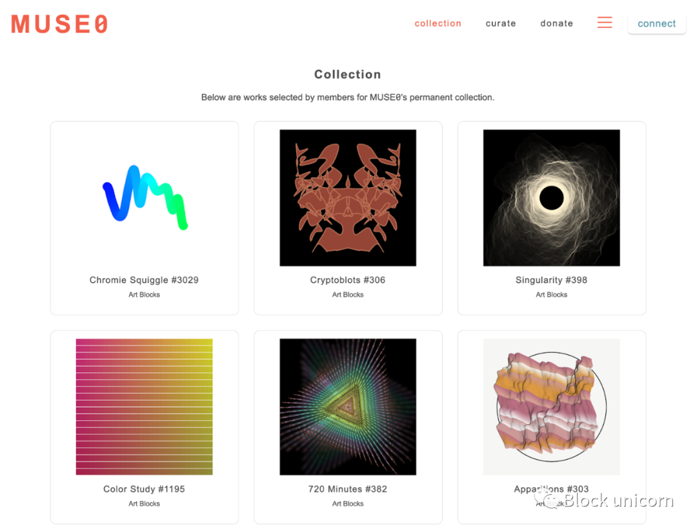
虽然启动 UNA 不需要任何文书工作，但如果非法人协会的目的包括盈利意图，那么就已经创建了普通合伙企业。实际上，UNA 非常适合想要采取非盈利性质的行动并需要制定指导原则的团体。

DAO 的重要性日益增加，并且有早期迹象表明，基于区块链的治理将对公司的治理方式产生重大影响——无论是通过数字化传统治理机制还是提供从根本上组织企业的新方法。

从法律上讲，前进的道路正在明确，支持者应该对未来的道路保持谨慎乐观。

## 反对 DAO
虽然有很多理由看好 DAO，但这是一个处于起步阶段的空间。实现大规模部署和采用需要时间和精力。 

即使考虑到这一点，DAO 也并不完美。尽管现代公司有其问题，DAO 是对它们缺陷的回应，但我们不应该假装公司结构一无是处。这样做将无视数百年来吸取的教训。  

例如，管理合理的公司在其运营中承担两项关键责任。 

1. 信托责任。

	公司所有权和管理很少完全重叠。因此，负责公司决策的人（想想高管或董事会）必须以股东（真正的所有者）的最佳利益而非他们自己的最佳利益行事。 
2. 小股东保护。

	不同的股东群体通常在一家公司拥有不同的股份。公平公司的运作必须使公司相对于所有股东的股份平等地受益。大股东群体不能强迫其他股东遵守以牺牲少数人为代价，不成比例地奖励多数人的要求。 

这些是健全企业的基本运营，不遵守这些规则的企业将面临法律诉讼的可信威胁。但是，很难在 DAO 中重新创建类似的操作，至少不进行权衡。 

一方面，在违约的情况下，没有传统的法院可以依靠。此外，由于 DAO 本质上是作为智能合约运行的无需信任的计算机程序，因此它无法确定某个提案是否满足了信托责任，或者小股东是否得到了充分保护。这种判断从根本上是主观的，不能被软件很好地解释。 

大多数时候这可能并不重要，但如果 DAO 的投票权落入坏人之手，这将变得非常重要。例如，如果一个不良行为者（或恶意团体）成功地获得了 51% 的投票权重（或超过了设定的任何阈值），他们可能会提议并批准对组织进行不成比例地奖励他们的变革，代价是社区的其他成员。 

DAO 可能没有能力阻止这种情况，尤其是在软件级别。对于 DAO 的代码，合法的提议和威胁组织存在的提议看起来完全一样。由于社区内的人在上述情况下将无法保护自己，因此解决问题需要来自能够进行此类评估的可信外部来源的输入。

化名使问题进一步复杂化。许多人使用“丢弃身份”为 DAO 做出贡献，这意味着不良行为者的声誉风险很小。在一个完全对抗性的环境中，DAO 对任何人都开放，违反上述属性几乎没有什么阻碍——至少没有任何外部激励。如果有机会，一些人可能认为泄露 DAO 的资源是值得的，特别是因为它们可以在没有归属的情况下运行。 

### 为什么我们没有看到更多这样的攻击？
在某种程度上，这可能是由于其他激励因素在起作用。在许多 DAO 中，代币供应集中在少数创始人或信誉良好的投资者手中。这些人通常会考虑长远并披露了他们的身份，这意味着声誉风险受到威胁。任何攻击都可能被这些鲸鱼击落，即使它们的理性经济决策是支持它。这种可能性甚至阻止了此类操作的尝试。 

在许多情况下，那些负责管理 DAO 多重签名的人也可能相对容易地违背社区的利益。然而，随着 DAO 和 web3 规范的世界积累的社会资本阻止了这种行为，即使没有什么能阻止他们自私地行事。 

已经提出了其他方法来解决这些风险，包括愤怒戒烟和否决。 
### 愤怒退出
Moloch DAO 具有“愤怒退出”机制，允许代币持有者以其资产的比例份额退出 DAO。至关重要的是，愤怒退出者会带着他们在提案正式通过之前所拥有的份额离开，除非他们投票赞成。本质上，如果您不喜欢 DAO 刚刚做出的决定，您可以打包并随身携带您的代币。 

对于潜在的攻击者来说，这种退出机制的存在是一个主要障碍。如果贡献者认为攻击正在进行，他们可以带着自己的资金离开，而不是被迫加入。即使潜在的强盗积累了 51% 的多数，他们也可能无法获得任何资金。 

愤怒退出机制的缺点是它是一种非常核方法。此外，它对于持有 NFT 等不可替代资产的 DAO 并不是特别好。如果你、我和我们的 98 位朋友每人投入 1 ETH 购买一些无聊的猿，并且你决定愤怒退出，我们如何允许你带着你的部分股份离开？没有简单的答案。 

最终，任何使用这种方法的大型 DAO 都会将其与对成员的全面审查过程结合起来。这确保了社会资本处于危险之中，从一开始就阻止了流氓提议的发生。
### 否决
一些 DAO 不是愤怒地退出，而是通过否决来防止攻击。在这种情况下，受信任的实体或机制会介入以确保提案的合法性并关闭恶意行为。 

例如，Nouns DAO 的创始人可以否决恶意提案，但他们计划随着时间的推移“可证明撤销”该权利。同样，这里的方法依赖于社会资本而不是代码。 

一些协议试图通过提供主观输入来正面解决问题。例如，阿拉贡法院通过“监护人”网络帮助处理此类纠纷。当出现问题时，可以将判决推迟到这个独立的法院，他们的公正努力会得到奖励。Kleros 的“正义协议”是一个类似的解决方案。 

除了攻击威胁之外，DAO 还必须解决一些围绕其结构有效性的悬而未决的问题。分散的方法可能会产生最好的结果吗？ 

高影响力的初创公司已经融合在一个相当默认的运营手册上，其中高层领导推动组织的方向，知识产权是专有的，招聘是结构化的，保密是至关重要的。在过去的几十年里，这种方法产生了一些非常出色的结果。

当然，DAO 的行为有所不同，它们倾向于完全透明的扁平结构。虽然这种模型在去中心化至关重要的情况下被证明非常有效（比特币和以太坊可以被认为是 DAO），但尚不清楚它是否适合其他类型的组织。 

看到 DAO 与特定市场中的中心化团队竞争，并观察该模型的相对优势和劣势所在，将会非常有趣。 
## 边界
或许 DAO 世界最令人兴奋的地方在于，我们几乎没有触及它潜力的表面。尽管新技术在部署的方式、地点和原因方面不可避免地让我们感到惊讶，但尝试并设想它们可能预示的未来还是值得的。 

在这个主题上，我们将涉及 DAO 对我们未来的重要性、所有权和创造力的变化概念以及潜在的新组织时代。 
### DAO 的重要性
不断扩大的贫富差距是我们作为一个社会面临的最大逆风之一，而 COVID-19 的后果只会加剧这一问题。这不仅仅是一个道德问题，也是一个经济问题。残酷的事实是，劳动力和工资并不是建立可持续财富的最佳解决方案；资产所有权和获得资本是。从历史上看，那些拥有资本的人与提供劳动力的人相比，通常会获得不成比例的收益，这通常是为了换取固定工资。再说一遍，如果你想变得富有并获得财务自由，你需要拥有资产——资本>劳动力。

Web3 对很多人来说意义重大，但正如我们所讨论的，它的核心支柱之一是所有权的概念。通过更广泛地传播这种资本，该空间有可能将数百万人从传统的雇佣劳动中拖出并转向所有权。 

货币贬值的背景只会强化这种感觉，即在世界需要加密货币的那一刻，它正在成为一种可广泛投资的资产类别。 

DAO 是这一运动的关键部分。它们不仅本身就是创造财富的机会，而且还可能在进入生态系统的人的教育和技能提升方面发挥主导作用。 
### 创造力
正如我们许多人所知，所有阶层的公民都越来越担心自动化、人工智能和机器人技术的进步将取代当今的许多工作，而这种担心并非完全错误。然而，web3 和相关 DAO 的爆炸式增长可能会催生数百个新行业、数千个新组织和数百万个以前不存在的新工作。

创造力可能会受到特别的影响。随着死记硬背的劳动被自动化，敏锐度更高的人才可能会脱颖而出。一个日益机械化的世界也可能鼓励连接，即使是通过数字领域。 

DAO 是这两种趋势的完美体现。Creator DAO 将使艺术家能够与粉丝互动，并在许多情况下创造世代财富。反过来，其中大部分内容将与帮助生成它的人共享。 

Micah Johnson 就是这种可能性变为现实的例子。约翰逊，前 MLB 球员和活跃艺术家，是一个名为 Aku 的基于 NFT 的角色的创造者。阿库不仅成为了一个受欢迎的化身，约翰逊的作品也得到了 Visa 的赞助。不难想象 “Akuverse” 在未来几年可能会如何扩展，产生一个真正的 DAO 和一个参与社区。 
### 新的组织结构
截至目前，所有传统资产都是有效的法律结构，资产持有人的权利由法院强制执行。 

随着越来越多的资产在链上转移，智能合约和程序化激励将取代法律体系作为保证所有权的一种方式。同样，DAO 将取代法人实体，成为围绕这些资产进行协调的主要方法。个人不是组建公司，而是创建 DAO 来管理链上资产。 

正如我们所提到的，DAO 是对传统公司的范式转变，因为它们从一开始就可以是全球性的，无需许可即可加入或贡献，并最大限度地减少诸如身份、雇佣合同、工作面试甚至实时赔偿。虽然今天这个过程中有很多问题，但我们有充分的理由相信，随着时间的推移，这些问题会得到解决。 

简而言之，加密为产权和全球“无需许可”的金融体系提供了更强大的保护，任何人都可以利用它以比当今过时的替代方案更有效的方式将资产转换为资本。

DAO 是否会兑现其非凡的承诺还有待观察，过去的十年比我们想象的更陌生、更黑暗、更神奇，下一次可能会带来更大的转变。 

不过，相信强大的、积极的变化是合理的。如果您免费、开放地访问一个充满远见的新领域，有些人会找到一种方法来改善许多人的生计。少数人和多数人可能会发现自己不是为公司工作，而是为 DAO 工作——一个流动的、不断变化的数字空间角落，吸收了互联网。

## 参考
- [如何在aragon中创建DAO](https://www.bilibili.com/s/video/BV1jZ4y127bU)
- [如何创建DAO](https://www.it1129.com/2022/04/07/%e5%a6%82%e4%bd%95%e5%88%9b%e5%bb%badao/)
- [DAOs: Absorbing the Internet](https://www.readthegeneralist.com/briefing/dao)
