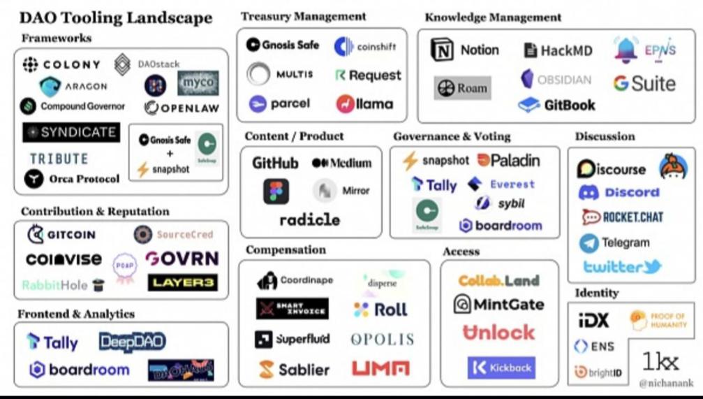
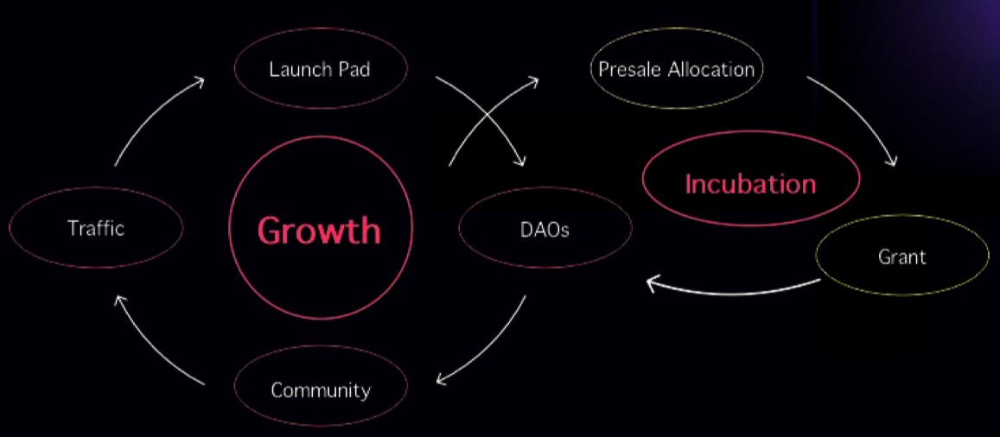

# HotPot-PPT 帮助 DAO 启动的工具包
## 问题
DAO 的快速增长要求公平、轻松的给出解决方案

- 定价的公平性问题
- 由于技术原因， dao 缺乏社区外的应用
- Liquidity 池子或者 NFT DAO 需要花费大量的金钱和精力

DAO 有 4228 个

## 我们是谁
Hotpot 是一个无代码的 Dao 启动工具，可以帮助新的 DAO 基于债卷曲线创建

- 债卷曲线是一个自动市场商人(Aotomate Market Makers-AMMs) 的特例
- DAO 的价值需要得到社区参与和支持
- 适合早期的 DAO 项目 

## 为什么债卷曲线对 DAO 很重要
- 灵活的定价机制
- 社区支持
- 高流动性

  
 
##  解决方案
### 启动工具
- 无代码
- 债券曲线
- 零成本
- 一分钟启动 DAO

### Dao 插件
- 兼容管理系统
- 生态聚合器

### 债券交换
- 无恶意市场操作
- 无永久损失

  
 
##  如何做到
- 通过无代码启动方式缩小技术差距
- 针对由 AI 支持的 DAO 代币启动进行了优化
- 只需点击几下即可设置 DAO，无需任何费用

## 收入可预期
可扩展&可持续的收入来源

 - 服务费

	HOTPOT 将对已启动的 DAO 收取交易费用（例如 0.1%）。 这些资金将进入社区国库。
- 孵化与投资

	HOTPOT 将为 DAO 提供孵化服务，提供社区和资金支持，以换取早期投资份额。

## 机会
HOTPOT 在成为一个无代码工具包

- Dao 工具处在"狂野的西部时代"
- 根据 Messari 的报告，由2025 年，最活跃和最活跃的一年之一，最大的 AUM 风险投资家将是 DAO。

  
 
##  市场空间
客户来源两种:

- socialfi 
	-  twitter 每年创建的社区价值为 1800w  美元
- 资本管理
	- dao 的资本管理价值增长 26亿  美元

## 战略
目标是 100w 美元
## 飞轮效应
我们的成长飞轮

  

- 成长飞轮
	- 发射台
	- dao
	- 社区
	- 流转
- 孵化
	- 预售分配
	- 授予
	- dao

## 方案	 
社交媒体转变为 DAO

- 客户介绍

	tom 重度社交媒体用户，有1000+的追随者，对区块链和加密货币知之甚少，从未听说过 DAO
- 需求
	- Tom 想让社交媒体账户更专业并从中获利,1000 + 粉丝信誉良好专门的社区主题
	- 需要资金来支付运营成本
		- 例如 1 w 美金
- 如何做
	- 将社交转化为 DAO (完美的 DAO 场景)
	- 社区已经存在
	- 给予利益的共同社区目标
	- 核心成员有意愿推进
	- 缺乏技术支持   
	 

###  DAO 工具集类型
- 开发框架
	- colony
	- daostack
	- myco
	- openlaw
	- gnosis safe+snapshot
	- aracon
	- compound governor
	- syndicate
	- tribute
	- orca protocol
- 贡献与荣誉
	- gitcoin
	- coiavise
	- rabbithole
	- sourcecred
	- ovrn
	- layer3 
- 前端分析
	- tally
	- deepdao
	- boardroom 
- 财务管理
	- gnosis safe
	- moltis
	- parcel
	- coinshift
	- request
	- llama 
- 知识管理
	- notion
	- hackmd
	- roam
	- obsidian
	- gitbook
	- suite
	- epns
- 内容/产品
	- github
	- medium
	- mirror
	- radicle 
- 治理/投票
	- snapshot
	- paladin
	- tally
	- everest
	- sybil
	- boardroom
- 赔偿(compensation)
	- coordinape
	- disperse
	- roll
	- opolis
	- umm
	- sablier
	- superflurd
	- shart invoice 	 
- 权限服务
	- collab.land
	- mintgate
	- unlock
	- kickback 
- 讨论服务
	- iscourse
	- discord
	- rocket.chat
	- telegram
	- twitter 
- 身份服务
	- idx
	- ens
	- brightid 

 
 
## 参考
[HotpotDAO_Pitch.pdf](https://hotpot.network/HotpotDAO_Pitch.pdf)