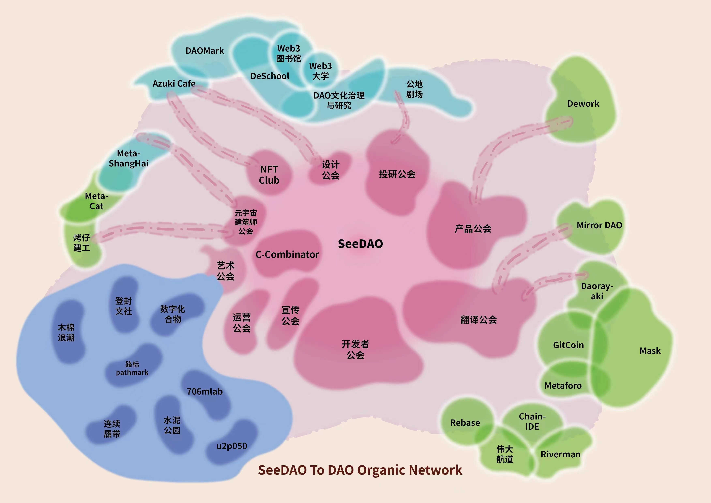

# SeeDAO 分析
## 简介
### SeeDAO 计划目标
- 产品层面
	- 成员身份上链
	- 教育信息上链
	- 活动与项目信息上链
	- 治理信息流通
	- 重要信息深度触达
- 内容层面
	- 不同城市 seedao 成员分享生活
	- web3 氛围
	- 分享知识，相互教学
- 开放3个板块
	- 全球概览征文
		- 聊生活、就业、web3 行业情况
	- 城市联络员
		- 招募
		- <活动发起指南>鼓励相同城市成员线下聚会
	- 发起知识共享计划
		- 鼓励大家在 DeSchool 上分享知识、交流学习
- 孵化项目
	- 去中心化教育平台 Deschool
	- SBT 发行工具 Ensoul
	- 元宇宙互动平台 DAO link
	- web3 权限管理平台 Octopus3    

### SeeDAO 治理体系演进
- 2021.11-2022.2 成立公司负责运营
- 2022.2-5 半公司半DAO 运营
- 2022.6-7 解散公司，融资打入 DAO 金库
- 2022.7-10 成立9人小组起草元立法规则
- 2022.10-11 元规则出炉，筹备第一节节点共识大会
- 2022.11- 第一节大会召开，dao 进入自治社区阶段	

## [SeeDao 元规则](https://seedao.notion.site/SeeDAO-SIP-2-a4720f18c068455785a7a9ee5fd626ee)(基础规则)
基础规则分为8章部分

- 第一章：**SeeDAO 成员的权利与义务**
- 第二章：SeeDAO 的治理原则及架构
- 第三章：节点共识大会
- 第四章：市政厅
- 第五章：战略孵化器
- 第六章：公会与项目
- 第七章：SeeDAO 代币经济模型
- 第八章：元规则实行及修改

## 官网分析
### [Home](https://seedao.xyz/home)
该页就是首页，主要宣传 SeeDAO 是什么，现在正在干什么
#### 左边
- 创建你自己的 DAO 
	- [Start](https://seedao.xyz/start)
		- 一个欢迎广告页，包含
			- 你能做
			- 你能得到
		- 引导
			- 步骤一

				进入学校学习
				
				- [学校 SeeDao 进入](https://deschool.app/courses/course/62f0adc68b90ee1aa913a965/62f0adc68b90ee1aa913a966/learning/Video/63a46ae99ce6e09dd4811471)
				- [SeeDao Discord](https://discord.com/invite/seedao)
			- 步骤二

				打开 Seedao 城邦广场，找寻自己想要参加的 Dao 信息，然后加入
				
				- 城邦服务
					- 看类似治理？ 
				- 活跃工会
					- Dao 
				- 城邦项目
					- Seedao 的项目 
				- 孵化项目
					- 各 DAO 自己的项目 
				- 传送门
					- 各种平台链接
- 数据统计
	- 人数 1w+
	- token 1238.7 w+
	- 5% NFT
	- 15 个项目
- [路线图](https://seedao.xyz/home/roadmap)
- [关于我们](https://seedao.xyz/home/about)
- 社交信息
	- [twitter](https://mobile.twitter.com/see_dao) 
	- [Discord](https://discord.com/invite/seedao)
	- [notion](https://seedao.notion.site/SEEDAO-WIKI-f57031667089473faa7ea3560d05960c)
	- [opensea](https://opensea.io/collection/seedaogenesis)
	- [微信](http://weixin.qq.com/r/3DgbA--EXaIirbtg923O) - 不知道是什么
	- [mirror](https://mirror.xyz/seedao.eth)

#### 右边
分几个部分

- 第一个部分，欢迎信息加上 [LEARN MORE](https://seedao.xyz/home/about)，还是一个欢迎信息
- 第二部分，活动

	一个市政厅活动的展板，包含两种信息
	
	- 市政厅每次互动活动的 Discord 
	- 以及其他公告信息，这个一般使用 Mirror，比如[Move 语言共学#4](https://mirror.xyz/seedao.eth/tUO9PhGK6Thkz89H3T5sQOU-wYAYj6UJCAXosTNijcA)
- 第三部分，工会

	分很多工会，这里感觉是 SeeDao 产品自身的工作组，负责 SeeDao 的产品整个生命周期工作，使用 [Notion 白板](https://seedao.notion.site/26f704935d464b2f8a17601f69ec8ea7)来进行工作任务管理
	
	- 翻译

		翻译海外资料
	- 宣传实验室	
	- 投研
	
		投资调研？
	- 产品	
	- 研发
		
		负责开发
		
		- 前端
		- 后端
		- 合约
		- 运维 
	- 运营(治理)
	- 设计
	- 艺术
	
		二创/宣传？ 
	- NFT
- 第四个部分，孵化项目
	- [DeSchool](https://deschool.app/)

		Web3 P2P 视频学习网站   	
	- [DAO Link](https://www.daolink.world/)

		将 Discord 导出一个2d世界，并支持音视频通讯，让 dao 游戏化可视化，增强 DAO 的互动感
	- [Ensoul](https://www.ensoul.io/)

		面向 DAO 的 SBT 发行管理工具，提供权限管理方案，可以用于成员声望、角色、权限等管理
	- [八爪鱼3](https://seedao.octopus3.xyz/)

		后台操作系统，实现个人数据隐私的去中心化保护，集成 DAO web2,web3 工具，打通个人账户系统
- 第五部分

	SeeDAO 的一些信息公布，全部使用 Mirror 作为信息公开载体，比如[月财报](https://mirror.xyz/seedao.eth/3ttD0pFXe55i74gfu_D4JSVPPPsO8VCBQokGtYYrml8)
	
### [活动](https://seedao.xyz/event)
该页面引导到 google 日历，主要是 seedao 日常工作讨论相关的，看起来是每周多次，当前活动看到有 运营组、投研组、研发组、翻译组，内容格式

- 标题
- 时间
- 说明
	- 简介
	- 会议地点，一般在腾讯会议
	- 议程 
	- [会议记录](https://seedao.notion.site/2b62d6e0a5d647df8c14199908baae6e)

### [DeSChool](https://seedao.xyz/deschool) 也就是入口模块或者叫新手帮助模块或者叫快速启动模块
使用内嵌的方式，将 [DeSchool 的产品](https://deschool.app/landing)页面与首页强制绑定，当然这个本质上就是另一个产品， SeeDAO 用它来做成员入口与学习平台，这个再分析

### [govern](https://seedao.xyz/govern)
也是使用内嵌的方式，SeeDao 的 [治理模块](https://forum.seedao.xyz/)，基于 [Metaforo](https://metaforo.io/) 的 web3 原生社区的治理模块完成，而 Metaforo 里面集成了 

- snapshot 用于治理投票， 如 [SeeDao](https://snapshot.org/#/seedao.eth) 
- opensea 用于 DAO NFT 管理

### SGN
Seedao Genesis NFT ，象征的是 SeeDao 正式成员身份，也代表授予 SeeDao 的治理权和被选举权，暂停发布 1w 枚，仅颁发给社区贡献者， pow 原则

- 权利
	- 治理
		- 可以深度参与各工会核心事务
	- 孵化
		- 只要持有者提出想法，才会被 seedao 投资孵化，社区基金会支持
	- 空投
		- 未来 seedao 发行治理代笔，sgn 就是空投依据，另一个依据是 MSN ，memory of seedao nft
- 如何得到
	- [pow 工作量证明](https://discord.com/invite/seedao)

		大胆参与 seedao 各工会活动，通过 pow 获取
	- [市场购买](https://opensea.io/collection/seedaogenesis)

		直接到二级市场购买
		
### [C-Combinator](https://beta.seedao.cc/)
C-Combinator 是 SeeDAO 推出的战略孵化器，另一个工具。以 Web3 项目融资工具与多家 web3 合办，开放条件

- 2022 年 1 月底以 3000 万美元“估值”完成 A 轮融资
- SeeDAO 已经拥有了超 1 万名社区成员、800 名贡献者和 60 名核心贡献者

孵化器以比赛赛季的形式筛选出合适的项目来进行投资，第一期分了 6 种类型，分别是

- Dao(18)
- Dao tools(4)
- NFT(7)
- NFT Tools(2)
- Public goods(2)
- research(0)		    

[孵化器说明](https://seedao.gitbook.io/c-combinator/)

工作坊计划整体周期为：2023.1.16-2023.3.23，分为三个部分：

- 报名（1.16-2.15）
	- 报名条件：

		任何持有 SGN、MSC 身份 POAP 或 SeeDAO Onboarding SBT 的 SeeDAO [成员](https://seedao.gitbook.io/c-combinator/seedao-shen-fen-shuo-ming/seedao-cheng-yuan)均可由 C-Combinator 官网 链接钱包，按照报名[指南](https://seedao.notion.site/SeeDAO-Workshop-883c575bae6e418289d00114a6f7e442)填写报名信息，在本季工作坊[主题](https://seedao.gitbook.io/c-combinator/di-er-ji-fu-hua-zhu-ti-shuo-ming/zhu-ti-list)中选择一个作为项目方向，完成报名。
	- 报名要求：

		已有成熟产品或者研究项目的团队不能以现有产品或者研究来报名，但是可以选主题报名做新项目，若产生分歧，具体情况以专家组判断为准。
	- 报名反馈：

		工作坊期间，SeeDAO 会设置一个 7 人专家委员会，筛选报名项目，并在当周日前邮件通知报名结果。

		报名结果会在[ SeeDAO Discord](https://discord.com/channels/841189467128594442/977436830947475506)#孵化器公告 频道公示。
	- 注意事项
	
		如果有 DAO 相关创意但不在主题 list 中，或有其他问题，请发邮件至 networkpolis@seedao.xyz。
- 制作（2.16-3.15）
	- 成功收到邮件通知进入工作坊的项目，可以免费享受 SeeDAO 孵化器为工作坊项目准备的系列辅导和 SeeDAO 资源支持。
	- 工作坊安排

		入营项目会收到一份活动安排 List ，并由工作人员组织后续活动。

		在这一环节，成功进入 Workshop 的项目和团队将接受为期 4 周的制作辅导。导师和板块教学，将帮助你拨开Web3创业的迷雾；还会帮你调度 SeeDAO 内社区资源，帮助你在正确的轨道上行驶，做出产品 Demo 或完成研究报告。
	
		- SeeDAO辅助服务
			- 4 周专业辅导课程

				邀请共 7 位专家教授 7 个专题，内容涵盖：以 Gitcoin Grants 申请为例讲社区项目如何获得资助、创作者经济共创模式、DAO 治理与游戏机制设计、如何使用DAO 工具优化社区治理、智能钱包、Web3 新消费模式、SeeDAO 的实践分享等。
			- 组织社区路演

				扩大项目传播及影响力，帮助项目在 SeeDAO 社区凝聚共识。
			- 每周 1 小时 Advisor 答疑辅导。
			- 组织项目沙龙

				让优秀的项目方一起头脑风暴，互相协作，并与其他创业者共同形成一个强大的校友网络。
			- 参加 SeeDAO 当季 Demo Day，获得奖金 Grants。
			- 联合举办方 集智俱乐部、独立之光、Rebase、ChainIDE、DAOSpace、Greenpill CN项目和开发项目提供专业指导服务。

				NFTScan 作为数据基础设施赞助伙伴为孵化项目提供三个月专业版 nft api 使用权以及一对一技术交流。
- 展示（3.16-3.23

	在这一环节，完成了 MVP 的创造者将来到我们最终的展示舞台 —— Demo Day！

	C-Combinator 将组织社区成员和业内专家检阅营员们的成果，并投票。各个项目将根据各自排名解锁 C-Combinator 配套 Grants 奖励。Grants 奖励由 SeeDAO 与 伟大航道 共同设立的 TAO 基金提供支持。

	- 成功制作出交付物并通过 7 人专家委员会的项目或团队，可参加最后社区 Demoday ，由 SeeDAO 社区成员票选出前 6 名，并发放奖金和 SeeDAO Season2 SBT。
	- 团队须及时了解大赛进展，参加社区路演，争取选票。秉持公平竞争原则，不得以任何形式贿选。
	- 投票员避免跟风，鼓励多参加项目社区路演会，充分与项目发起人沟通，了解项目信息后，分散化投票。
	
	投票规则
	
	- 任何持有 SeeDAO SGN 的成员均可参与投票
	- 一地址 6 票；最后按得票前 6 名依次获奖。
	- 孵化器特邀嘉宾只提供专业项目点评和建议，不参与投票。

	- 第一名为一等奖，3000 USDT 奖金；
	- 第二和第三名为二等奖，2000 USDT 奖金；
	- 第四至六名为三等奖，1000 USDT 奖金。

	从这里走出去的项目将有计划进入 SeeDAO 有机生态网络。
	

## SeeDAO 身份和获取说明
### SeeDAO 身份分为三级
- 第一级 SBT 持有者

	Onboarding SBT Holder（SBT 持有者）
- 第二级 SGN 持有者/共创者

	积累到一定积分，会被提名 SGN holder(SeeDAO Genesis NFT, 贡献者身份，暂定1w枚)（SGN 持有者/共创者）
- 第三级 共识节点

	SGN holder 累计贡献，就有机会成为有投票权的共识节点
	
### [新人登船指南](https://mp.weixin.qq.com/s/XJzbqgn92PoBMLTsCZpGcA)，获取 SBT
- 获取 SBT
- Discord 活动
	- 周五晚 20:00 信任 AMA
	- 周六晚 20:00 翻译工会周会+ 20:30 共读会
	- 周一晚 21:00 夜聊 
	- 周一 12:00 或 20:00 市政厅通气会
	- 周二晚 20:00 投研工会周会+ 21:00 白皮书共读
	- 周三晚 社区大会 21:00 共学
	- 周四晚 20:00 研发工会周会

### 参与方式
- 创业者

	通过[报名工作坊](https://seedao.gitbook.io/c-combinator/fu-hua-liu-cheng-yu-gui-ze/bao-ming-jie-duan)，最高赢取3000 usdt
- 专业技能人才

	官方招募 [产品经理和前端开发者](https://mp.weixin.qq.com/s/LbYGou8hCpyxGn73GWm_Ig)
- 社区投票员

	获取 [SGN](https://seedao.gitbook.io/c-combinator/seedao-shen-fen-shuo-ming/sgn-holder) 对 Demoday 投票
- 外部合作者

	[填写合作表](https://tally.so/r/wAr0Q0) 或 [SeeDAO Discord](https://discord.com/channels/841189467128594442/973213151317331998) 
 
### 个人如何使用和如何赚钱
#### 如何增加积分
- 参加工会完成任务
- 参加市政厅的公共职务竞选或者实习生计划
- 参与当地地区的线下活动

#### 如果使用 seedao 赚取收益
- 提案项目
	- 在草案许愿池发布自己想法和提案，邀请更多人加入
	- 成立公共项目，在工会层面立项
		- 如果重要项目可以申请市政厅治理小组帮助完善提案
		- 与财务小组沟通如何获取相应预算
	- 完成项目可以发起回溯性提案，分享成果
		- 财务小组会评定价值和奖励的数额  
- 孵化项目
	- 第一种，加速营

		第一期需要 3% 的项目 token 融资，胜出有1-2w usdt
	- 第二种 项目孵化

		第一期需要 8-10% 的项目 token 融资，胜出有4-6w usdt
		 
## SeeDAO 汇总结构架构图

		
		
			   		
         