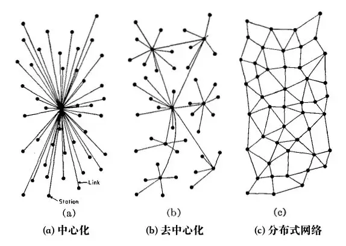
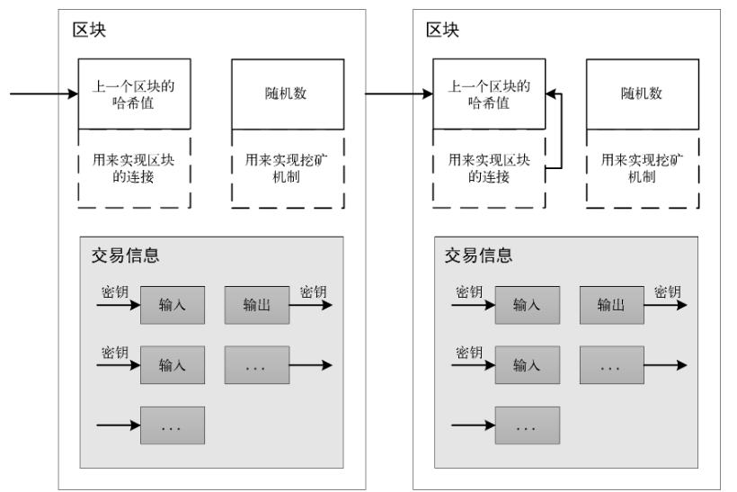
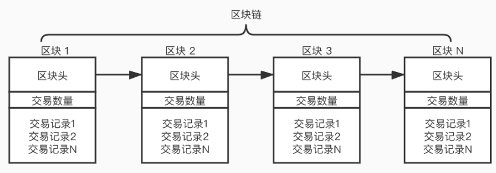
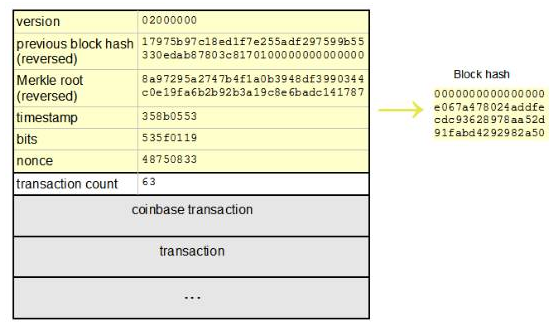
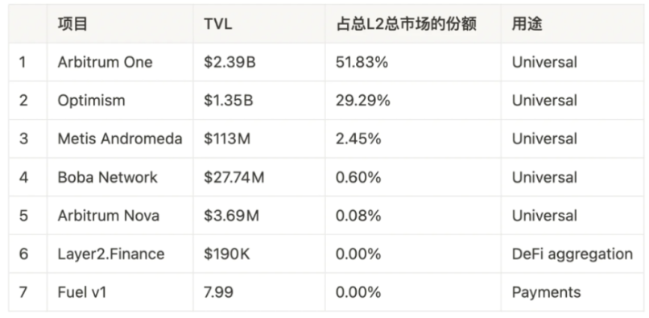
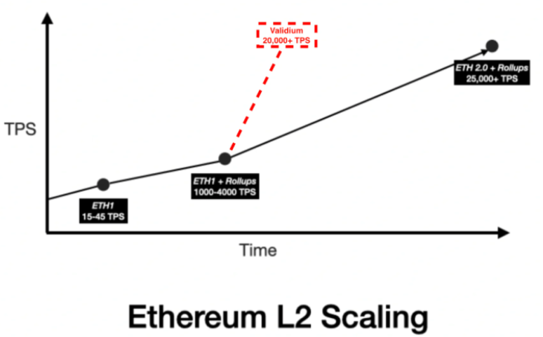
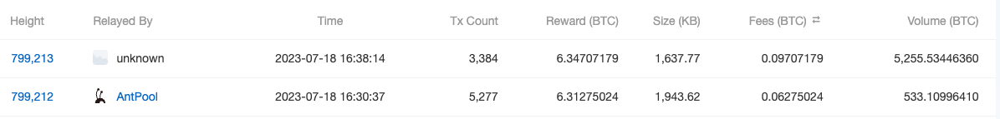
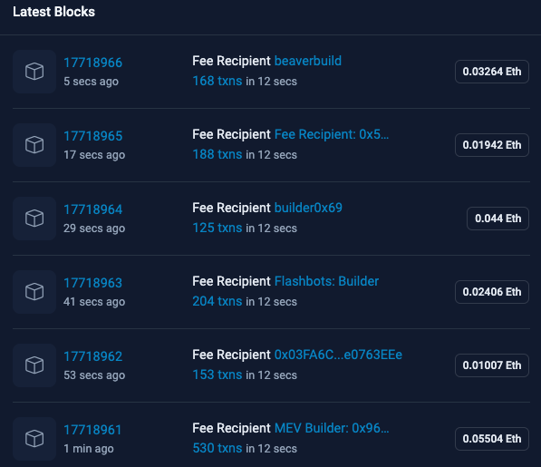

# SeeDAO 区块链基础共学小组-课程1
	是什么？为什么？怎么做？

	What?Why?How
## 区块链是什么(What)？
区块链是基于密码学和分布式系统构建的数据库，它使用去中心化思想设计的分布式节点和 P2P网络来存储和传输数据，因此具有去中心化、不可篡改、安全和透明等特点。
### 什么是去中心化系统？

- 什么是中心化系统？
- 什么是分布式系统？
- 中心化系统和分布式系统与中心化系统的区别？
- 各系统的优缺点是什么？
- 区块链是第一个去中心化系统麽？
- 还有那些去中心化系统？

### 区块链的定义是什么？
区块链是一种基于密码学和分布式系统设计思想构建的数据库账本系统。单个全节点上包含所有这个区块链系统的交易，记录的方法是使用多个区块组成，每个区块包含一些交易和一个唯一的哈希值。区块链的设计使得它可以确保数据的安全性和可靠性，因为每个区块都包含前一个区块的哈希值，这意味着一旦一个区块被添加到区块链中，它就不可能被篡改。

- 什么是节点？
- 什么是区块？
- 什么是链？
- 什么是交易？
- 什么是哈希值？
- 为什么不可篡改？
- 绝对不能篡改麽？
- 区块链的钱包地址到底是什么？
- 区块链的资产真的在钱包中麽？

### 什么是节点？
- 区块链常见的节点类型
	- 全节点（Full Node）：全节点是拥有完整区块链数据的节点，它可以验证交易和区块的真实性，并向其他节点广播交易和区块信息。全节点可以参与共识算法，对区块链网络的安全性和稳定性发挥着重要作用。
	- 轻节点（Light Node）：轻节点是只保存区块链头信息的节点，它可以通过查询其他节点来获取交易和区块信息。轻节点不需要拥有完整的区块链数据，因此可以在资源有限的设备上运行。
	- 矿工节点（Miner Node）：矿工节点是参与共识算法的节点，它们通过解决数学难题来创建新的区块，并获得新的加密货币作为奖励。矿工节点的存在确保了区块链网络的安全性和稳定性。
	- 验证节点（Validator Node）：验证节点是参与共识算法的节点，它们负责验证交易和区块的真实性，并决定哪些交易和区块将被添加到区块链中。验证节点对区块链网络的安全性和稳定性发挥着重要作用。
	- 路由节点（Routing Node）：路由节点是负责将交易和区块信息从一个节点传递到另一个节点的节点。它们确保区块链网络中的信息能够有效地传递和广播。
	- 存档节点（Archive Node）：存档节点是拥有完整历史区块链数据的节点，它们可以提供历史交易和区块信息的查询服务，对区块链应用程序的开发和测试非常有用。

### 什么是区块？
区块（Block）是区块链技术中的一个基本概念，是指一组已经验证的交易记录的集合。每个区块都包含了一定数量的交易记录，以及一个指向前一个区块的链接。区块链是由一个个区块按照时间顺序链接形成的，因此每个区块都能够追溯到最初的创世区块。

### 什么是区块链？

### 什么是交易？
通过区块链对账本的状态数据进行所有写操作，都被称之为交易（Transaction）

- 区块链的交易的一般分为几个步骤？
	- 创建交易：当用户想要发送一个交易时，他们需要用自己的钱包地址密钥创建一个数字签名，这个数字签名将被添加到交易中。
	- 验证交易：当交易被创建后，它将通过与区块链网络中的1个节点连接并通过这个节点验证后，这个节点将会将交易广播到整个网络中的所有节点。每个节点都会验证交易的有效性，确保它是真实的，不会被篡改。
	- 打包交易：一旦交易被验证通过，它将被挖矿节点打包成一个区块并添加到区块链中。每个区块包含一些交易和一个唯一的哈希值。

### 什么是哈希算法
哈希算法（Hash Algorithm），也称为散列算法。哈希算法通过对消息进行一系列的数学运算和变换，生成一个唯一的固定长度的输出，称为哈希值（Hash Value）或摘要（Digest）。

哈希算法有许多不同的实现方式，如SHA-256、MD5、SHA-1等
#### 哈希算法的特点
- 不可逆性

	哈希算法生成的摘要信息是不可逆的，即无法从哈希值反推出原始数据。这种特性使得哈希算法常用于加密和数据完整性验证等领域。
- 相同数据生成相同的哈希值

	对于同一份数据，使用相同的哈希算法和相同的输入参数，得到的哈希值总是相同的，这是哈希算法的一个基本特性。
- 不同数据生成不同的哈希值

	对于不同的数据，即使只有一个字节的差异，也会生成完全不同的哈希值。这种特性使得哈希算法在数据完整性验证方面非常有用。
- 散列性

	哈希算法的输出具有高度的随机性和不可预测性，即使输入数据只有微小的变化，输出也会发生巨大的变化。这种特性使得哈希算法非常难以被破解和攻击。
- 哈希冲突

	由于哈希算法的输出空间是有限的，不同的输入数据可能会生成相同的哈希值，这被称为哈希冲突。好的哈希算法应该尽可能地避免哈希冲突的发生，以提高哈希算法的安全性和可靠性。
- 哈希的安全性问题
	- 哈希碰撞
	- MD5 破解
	- 简单数据的破解方法

#### 哈希算法在区块链中的应用有哪些？
- 交易哈希

	每个交易都有一个唯一的哈希值，它是由交易中的所有数据计算而来。交易哈希值用于确认交易的唯一性和完整性，如果交易中的任何数据发生变化，它的哈希值也会发生变化，从而可以检测到交易是否被篡改。
- Merkle树

	Merkle树是一种基于哈希算法的数据结构，它可以将大量的数据快速且安全地验证和同步到区块链中。Merkle树将所有交易哈希值按照一定的规则组织成一个树形结构，每个节点的哈希值是由它的子节点哈希值计算而来，最终形成一个根节点的哈希值，这个根节点哈希值可以用来验证整个交易数据的完整性和一致性。
- 区块哈希
	
	每个区块都包含一个哈希值，它是由区块中的所有交易数据和一些元数据计算而来。区块哈希值用于确认区块的唯一性和完整性，如果区块中的任何数据发生变化，它的哈希值也会发生变化，从而可以检测到区块是否被篡改。
- 数字签名

	数字签名是一种基于哈希算法的加密技术，用于保证交易的安全性和可靠性。数字签名包含了交易的哈希值和交易发起方的私钥，用于验证交易的真实性和完整性，防止交易被篡改或伪造。

### 什么机制保证了它不能被篡改？
- 技术手段
	- 区块结构
	
		区块链中的数据以区块的形式存储，每个区块包含了前一块的哈希值，这种结构保证了数据的连续性和完整性。如果有人想要篡改数据，就必须修改前一块的哈希值，这会导致整个区块链的哈希值都发生变化，从而被其他节点验证错误而拒绝。
	- 共识机制
	
		区块链采用共识机制，即通过网络中的节点之间相互确认和验证交易的合法性，保证了数据的一致性和真实性。这种机制可以有效地防止恶意攻击和篡改。
		
		通俗的讲就是每个节点相互不信任，都是通过拿到所有数据后，自己再把数据从新算一遍，确认无误后才会合并到自己维护的的区块链数据中去。
	- 加密算法
	
		区块链使用了高强度的加密算法，不同的区块链技术，使用的加密算法也不尽相同，如 SHA-256、RSA、ECC等，对数据进行加密和签名，保证了数据的机密性和完整性。这种加密算法具有不可逆性和难以破解的特点，使得数据无法被篡改。
	- 分布式存储
	
		区块链采用分布式存储技术，将数据分散存储在网络中的众多节点上。这使得区块链没有中心化的单点故障，即使某些节点出现故障或被攻击，也不会影响整个网络的运行和数据的安全。
- 经济手段
	- 经济激励

		区块链采用了经济激励机制，即通过代币奖励和交易手续费等方式，激励节点参与共识机制的运行和维护区块链的安全性。这种经济激励机制可以有效地防止节点作恶和攻击，从而保证了数据的安全性和不可篡改性。
	- 社会信任

		区块链是一个去中心化的分布式系统，其中的节点来自于不同的机构和个人。这些节点之间通过共识机制达成共识，从而建立了互相信任的关系。这种社会信任可以使得数据经过验证和确认后被认为是真实的和可信的，从而减少了数据被篡改的可能性。
	- 治理机制

		区块链采用了一些形式的治理机制，如DAO（去中心化自治组织）和DAO（去中心化自治组织），使得社区中的参与者可以共同决定和管理区块链的发展和运行。这种治理机制可以有效地保护区块链的安全性和稳定性，从而减少了数据被篡改的可能性。		

### 绝对不能篡改麽？
任何信息系统都是可以被篡改的

- 51%攻击

	区块链系统中的共识机制通常是基于工作量证明（PoW）或权益证明（PoS）等机制实现的。如果攻击者能够控制超过51%的节点，就可以通过篡改交易或者阻止交易被打包来实现攻击和篡改。但这种攻击方式需要投入大量的计算资源和算力，且攻击成功后可能会导致整个区块链系统的崩溃，因此风险较高。
- 入侵节点

	攻击者可以入侵区块链节点，从而获取节点的私钥或者篡改节点的软件，以实现对区块链系统的攻击和篡改。但这种攻击方式需要攻击者具备较高的技术水平和攻击能力，且容易被其他节点发现和排除。
- 漏洞攻击

	区块链系统中可能存在漏洞，攻击者可以通过利用这些漏洞来实现攻击和篡改。但这种攻击方式需要攻击者具备深入的了解和分析区块链系统的能力，且漏洞往往会被团队发现并修复。
- 社交攻击

	攻击者可以通过社交工程等手段获取区块链系统的关键信息，从而实现对系统的攻击和篡改。但这种攻击方式需要攻击者具备一定的社交技能和信息收集能力，且容易被其他节点发现和排除。

### 钱包地址到底是什么？
钱包地址是用于标识区块链数字资产所有权的一串由数字和字母组成的字符串。每个钱包地址都对应着一个公钥和一个私钥

- 公钥用于接收数字资产
- 私钥用于管理数字资产，包括转移和消费等操作。

### 什么是公钥，什么是私钥？
- 非对称加密

	非对称加密算法的原理是基于数学问题，例如大整数分解或离散对数等数学难题。公钥和私钥是通过数学函数相互生成的，并且满足只有私钥能够逆向计算出公钥。因此，非对称加密算法具有很高的安全性和可靠性。
- 非对称加密用法
	- 加解密数据(公钥加密、私钥解密)

		非对称加密算法可以用于加密和解密数据。在加密数据时，使用接收方的公钥进行加密，只有接收方的私钥才能解密数据。这种方式可以保证数据传输的安全性和可靠性。在解密数据时，使用自己的私钥进行解密，从而获得原始数据。
	- 数字签名验签(私钥加密、公钥验证)

		数字签名是一种用于验证数据完整性和真实性的技术。在使用数字签名时，发送方使用自己的私钥对数据进行签名，接收方使用发送方的公钥对签名进行验证。只有发送方才能够生成签名，接收方通过验证签名来确认数据的真实性和完整性。
		
		在钱包中对应的就是公钥加密：每个钱包地址都对应着一个公钥和一个私钥。公钥是用于接收数字资产的地址，私钥则是用于管理数字资产的关键。在进行交易时，用户需要将自己的公钥提供给交易对方，以便对方将数字资产转移至该地址。
- 资产真的在钱包中麽？

	数字资产并不是实际存在于钱包中的，而是存储在区块链网络中的分布式数据库中。钱包只是一个工具，用于管理用户的私钥和对区块链网络进行交互。
	
	当用户需要进行数字资产的转移或者消费时，
	
	- 钱包会使用私钥对交易进行签名
	- 然后将签名广播到区块链网络中进行确认和记录，完成资产交易，进使用对方的公钥进行声明，并不会与对方钱包进行数据交互。
	- 这个过程是通过区块链网络中的节点进行共识机制来保证交易的可靠性和安全性
	- 而整个这个过程就称为交易

### 钱包的种类有哪些？(根据存储密钥方法分类)
- 纸钱包

	纸钱包是一种将私钥印在纸上的数字资产存储工具，通常具有安全、离线、便携等特点。纸钱包可以通过生成公私钥对，将私钥印在纸上，然后保存在安全的地方。纸钱包通常不支持转账和查询，需要导入到其他钱包中才能进行操作。
- 硬件钱包

	硬件钱包是一种基于物理设备的数字资产存储工具，通常具有离线、安全、可靠等特点。常见的硬件钱包品牌有Ledger、Trezor等。
- 软件钱包

	软件钱包是一种基于软件应用程序的数字资产存储工具，可以安装在桌面电脑、移动设备等各种平台上。软件钱包通常具有易用、兼容性、可扩展等特点。常见的软件钱包包括Jaxx、MyEtherWallet、Electrum等。
- 在线钱包

	在线钱包是一种基于互联网的数字资产存储工具，可以通过浏览器访问。在线钱包通常具有易用、便捷、跨平台等特点。常见的在线钱包包括 Blockchain.info、Coinbase、Binance 等，对中心化交易所也是在线钱包的一种。
- 多重签名钱包

	多签名钱包常被缩写为 “Multisig wallet” 是一种需要多个私钥共同签名才能发起交易的数字资产存储工具，通常具有安全、可靠、防抢劫等特点。多重签名钱包可以通过设置多个私钥，只有在满足指定条件时才能发起交易。
	
	- 多签规则
	
		用户可以根据自己的需求设置这样的规则：
	
		- 1-2 多签
		
			两个很要好的朋友相互信任，希望有一个共享的账户。设置 1-2 多签钱包之后，他们都可以凭各自的私钥访问同一批资金。两个人都可以独立发起交易（类似于合伙账户）。
		- 2-2 多签
		
			你可以把一个私钥保存在手机里，另一个保存在笔记本电脑上。需要两个私钥才能转移资金。
		- 2-3 多签
			
			Bitrated 是一个为买家和卖家安排仲裁的平台。它会创建一个三方参与的多签名钱包，释放资金需要且仅需要两个签名。假如买家和卖家都满意，那交易可以直接完成，不需要仲裁员介入。如果某一方请求调解，那仲裁员就介入，评判对错侯参与分割资金。
		- 还可以有 5-8 多签名钱包、3-6 多签名钱包，等等。1-1 的就是单签名钱包啦。

	多签钱包实现技术不同种类有很多，比如
	
	- 合约钱包
	
		通过智能合约来实现多签验证
	- 软件钱包

		通过软件来实现多签验证	
	- 在线钱包

		通过在线服务端通讯和算法来实现多签验证

### 共识算法是什么？
共识算法旨在解决分布式系统中的数据一致性问题，因为在分布式系统中，多个节点同时参与数据的写入和更新，如果没有一个规范的机制，就可能出现数据不一致的情况。共识算法通过实现一定的规则和协议，让所有节点对于账本的状态达成一致，从而保证数据的一致性。

在区块链中，共识算法是保证区块链网络中的所有节点对于交易的可靠性和安全性达成一致的关键。在一个区块链网络中，每个节点都可以对交易进行验证和记录，但是节点之间可能存在不同的数据状态和交易记录，这就需要共识算法来解决。
#### 共识算法的历史？
- 分布式系统如何解决数据一致性的
	- PBFT

		拜占庭将军问题（Byzantine Generals Problem）是分布式计算领域中的一个经典问题，用于描述在分布式系统中存在恶意节点时如何达成一致性的问题。问题的名称源自拜占庭帝国，即现今的土耳其地区，拜占庭帝国的将军们需要协调行动来攻打敌人，但其中有些将军是叛徒，会发送虚假的指令来破坏协调行动，因此如何在叛徒存在的情况下达成一致就成为了一个问题。

		在拜占庭将军问题中，假设有多个将军，他们要决定是攻击还是撤退，每个将军可以向其他将军发送消息，但有些将军是叛徒，可能会发送虚假的消息来破坏协调行动。问题的关键是如何在叛徒存在的情况下达成一致性，即如何保证所有忠诚的将军都采取相同的行动。

		为了解决拜占庭将军问题，需要采用拜占庭容错算法，其中最著名的算法是 PBFT（Practical Byzantine Fault Tolerance）。在 PBFT 算法中，假设最多有 f 个节点是恶意的，那么只要有 2f+1 个节点达成一致，就可以保证数据的一致性和可靠性。消息认证和数字签名等技术来保证安全性，最终保证忠诚的将军达成一致
	- Paxos 算法

		Chubby 是使用基于 Paxos 算法的一个分布式锁服务，Chubby 在 Google 内部被广泛应用于各种分布式系统中，如 Bigtable、GFS。
		
		在 Paxos 算法中，假设最多有 f 个节点是故障的，那么只要有 2f+1 个节点达成一致，就可以保证数据的一致性。Paxos 算法通过引入提案编号、提案值和提案接受者等概念，保证了算法的正确性和一致性。

		Paxos 算法包括三个阶段：准备阶段、接受阶段和学习阶段。
		
		- 在准备阶段，节点向其他节点发送准备请求，并等待其他节点的响应；
		- 在接受阶段，节点向其他节点发送提案，并等待其他节点的响应；
		- 在学习阶段，节点将最终的提案广播给所有节点，从而达成一致性。 
	- ZAB 算法

		ZooKeeper 是由雅虎公司开发的一个开源分布式协调服务框架，最初于2006年由雅虎公司的一组工程师开发出来。随后，ZooKeeper 于2010年5月成为 Apache 的顶级项目。它可以协调多个节点之间的操作，比如领导者选举、分布式锁、分布式队列等。ZooKeeper 使用 ZAB（ZooKeeper Atomic Broadcast）协议来实现数据的一致性。

		ZAB 协议是一种基于原子广播的协议，它可以保证在多个节点之间实现数据的原子广播和同步。对于 ZooKeeper 节点之间的数据更新操作，ZAB 协议主要分为以下两个阶段：
		
		- Leader election (选举阶段)

			在集群中选举出一个领导者（Leader），领导者负责处理客户端请求，并将数据同步给其他节点。在这个阶段，ZooKeeper 采用一种类似于 Paxos 协议的投票机制来选举出领导者，保证只有一个领导者负责处理客户端请求。
		- Atomic broadcast (工作阶段)

			领导者将客户端请求转化为事务（Transaction），并将事务广播给其他节点。其他节点接收到事务后，需要进行投票，确认事务的顺序和有效性。如果事务被大多数节点接受，那么它就被认为是有效的，并被应用到节点的状态机中。这个阶段由领导者负责，保证了数据的原子性和一致性。
	- Raft 

		Raft 是一种领导者选举算法，它可以保证在任何时候只有一个领导者负责处理客户端请求，并且在其他节点之间进行复制和同步。Raft 协议的核心是保证数据在所有节点之间的强一致性，这是通过以下方式实现的：

		- Leader election 阶段

			在集群中选举出一个领导者（Leader），领导者负责处理客户端请求，并将数据同步给其他节点。在这个阶段，Raft 采用投票机制来选举出领导者，保证只有一个领导者负责处理客户端请求。
		- Log replication 阶段

			领导者将客户端请求转化为日志项（Log Entry），并将日志项发送给其他节点。接收到日志项的节点需要对其进行确认，并进行复制和同步。如果大多数节点确认了日志项，那么它就被认为是已提交的，并被应用到节点的状态机中。这个阶段由领导者负责，保证了数据的强一致性和可靠性。

#### 去中心化系统共识算法-POW 工作量证明
为了确保区块链的安全性和可靠性，需要使用共识算法来确认新添加的区块。去中心化系统共识算法有很多，我们只讲比较简单的
	
- POW 工作量证明

	工作量证明（POW）从字面意思就知道，就是证明一个人干了这份活，得到大家认可之后，产生一个新区块，然后给干这份工作的人一定的比特币作为报酬。

	工作量证明一开始被提出是用于解决诸如垃圾邮件问题，使用工作证明作为发送电子邮件的善意标志，至于工作量证明能不能解决垃圾邮件问题有待商榷，但是工作量证明在区块链中保证了区块链的安全。
	
	有两类证明工作协议。（略枯燥，可简单浏览）

	- Challenge-response 协议
	- Solution-verification 协议(BTC 使用)

		给定的一个基本的字符串 "Hello, world!"，我们给出的工作量要求是可以在这个字符串后面添加一个整数值（在比特币中为nonce的标记），对变更后的字符串进行 SHA256 哈希运算，如果得到的哈希结果（以16进制的形式表示）是以"0000"开头的，则验证通过。
		
		为了达到这个工作量证明的目标。我们需要不停的递增值，对得到的新字符串进行 SHA256 哈希运算。按照这个规则，我们预计需要经过4251次计算才能找到恰好前4位为0的哈希散列。

	
			"Hello, world!0" => 1312af178c253f84028d480a6adc1e25e81caa44c749ec81976192e2ec934c64
			"Hello, world!1" => e9afc424b79e4f6ab42d99c81156d3a17228d6e1eef4139be78e948a9332a7d8
			...
			"Hello, world!4249" => c004190b822f1669cac8dc37e761cb73652e7832fb814565702245cf26ebb9e6
			"Hello, world!4250" => 0000c3af42fc31103f1fdc0151fa747ff87349a4714df7cc52ea464e12dcd4e9
		在这个例子中，数学期望的计算次数，就是我们要求的“工作量”，重复多次进行的工作量证明会是一个符合统计学规律的概率事件。
	- BTC 中的工作量证明

		比特币网络中任何一个节点，如果想生成一个新的区块并写入区块链

		关键的三个要素是
		
		- 工作量证明函数
		- 区块
		- 难度值

		工作量证明函数是计算方法，区块决定了输入数据，难度值决定了所需要的计算量。
		
		1. 工作量证明函数

			用的 SHA256			
		2. 区块

			比特币的区块由区块头及该区块所包含的交易列表组成。
			
			
			
			- 区块头(黄色部分)

				区块头的大小为总共 80 字节，由
				
				- 4字节的版本号
				- 32字节的上一个区块的散列值
				- 32字节的 Merkle Root Hash
				- 4字节的时间缀（当前时间）
				- 4字节的当前难度值
				- 4字节的随机数组成
		3. 难度值

			难度值（difficulty）是矿工们在挖矿时候的重要参考指标，它决定了矿工大约需要经过多少次哈希运算才能产生一个合法的区块。

			比特币的区块大约每10分钟生成一个，新区块的产生保持都基本这个速率，难度值必须根据全网算力的变化进行调整。简单地说，难度值被设定在无论挖矿能力如何，新区块产生速率都保持在10分钟一个。

			每 2016 个区块，所有节点都会按统一的公式自动调整难度，这个公式是由最新 2016 个区块的花费时长与期望时长（期望时长为20160分钟即两周，是按每10分钟一个区块的产生速率计算出的总时长）比较得出的，根据实际时长与期望时长的比值，进行相应调整（或变难或变易）。也就是说，如果区块产生的速率比10分钟快则增加难度，比10分钟慢则降低难度。

			这个公式可以总结为如下形式：

				新难度值 = 旧难度值 * ( 过去2016个区块花费时长 / 20160 分钟 )

			工作量证明需要有一个目标值。比特币工作量证明的目标值（Target）的计算公式如下：

				目标值 = 最大目标值/难度值
			其中最大目标值为一个恒定值：

				0x00000000FFFFFFFFFFFFFFFFFFFFFFFFFFFFFFFFFFFFFFFFFFFFFFFFFFFFFFFF
			目标值的大小与难度值成反比。比特币工作量证明的达成就是矿工计算出来的区块哈希值必须小于目标值。也可以简单理解成，比特币工作量证明的过程，就是通过不停的变换区块头（即尝试不同的 nouce 值）作为输入进行SHA256 哈希运算，找出一个特定格式哈希值的过程（即要求有一定数量的前导0）。而要求的前导0的个数越多，代表难度越大。

#### 去中心化系统共识算法-POS 权益证明
2011 年，Bitcointalk 论坛提出了一种新方法，以解决 PoW 共识机制的低效率问题，并降低运行区块链网络所需的计算资源量。这个概念不是执行有形的工作，而是基于生态系统中可验证的利益的存在。

POS的工作原理是，节点需要在网络中锁定一定数量的加密货币，这些加密货币作为节点的“权益”，并且需要存储在一个特殊的钱包地址中。节点可以将这些锁定的加密货币用作抵押，以参与记账和新块的生成。节点在生成新块时，需要将自己的权益作为抵押，以保证自己不会作恶，否则可能会失去抵押的加密货币。

换句话说，要验证加密网络上的交易，用户只需证明他们拥有特定数量的区块链原生加密货币代币。区块链网络用来实现分布式共识的这种共识机制称为权益证明共识机制。

例如，

- 矿工 A 质押 30 个币
- 矿工 B 质押 50 个币
- 矿工 C 质押 75 个币
- 矿工 D 质押 15 个币。

在这种情况下，矿工 C 将被赋予写入和验证以下块的优先权。与工作量证明中的区块奖励相比，矿工 C 将收取交易费用，即网络费用。

			
- 以太坊的危机

	既然有了 POW 共识算法，为什么还设计 POS 共识算法
	
	- Layer2 二层解决方案
	
		基本想法是链下计算 / 执行，结果上链；数据离线批量处理。这种方式是直接从第一层以太坊共识中获得安全性，方案有很多
		
		- Channel 通道
	
			这是一个非常早期、存在已久的区块链扩展方案，他最出名的应用是比特币的闪电网络。更注重安全性，而非可用性。
	
			参与者必须将以太坊的一部分状态，如 ETH 存款，锁定在一个多签合约中。锁定初始状态是第一个交易，并打开了通道。然后参与者可以在链下快速自由地进行交易。当互动结束后，把最终状态提交上链，关闭通道。
			
			- 优点
				- 适合高频、小额支付
				- 交易成本低
				- 状态有效性高
				- 隐私性强
				- 具有即时的最终确定性
			- 缺点
				- 提币慢
				- 不适用于偶尔转账给对方的用户
				- 不支持开放参与
				- TPS 一般
				- 不支持智能合约
				- 所有者需100%在线
				- 不能用于表示没有明确逻辑所有者的对象
		- Plasma
	
			由于 Channel「无法支撑大规模、大资金和复杂交易」的局限性，Plasma 方案应运而生。其结合了侧链的一些设计，解决了将资产发送给任意目标人的问题，同时也能够确保 TPS 的提升。事实上在开发者们研究 Layer2 解决方案的开始很长一段时间里，Plasma 一度被认为就是「the right one」。 
			
			Matic 最早期就是使用 plasma，区块链研究人员此后不久发现了数据可用性问题（后面会在报告中进一步讨论），导致 Plasma 被其他解决方案弃用。改名后，polygon 项目就转为全方面，全站式扩容方案。
			
			- 优点
				- 吞吐量高
				- 交易成本低
				- 适用于任意用户之间的交易
				- 不需要提前锁定资金
				- 安全性高
			- 缺点
				- 无法运行智能合约
				- 固定提交周期
				- 提款慢
				- 需要定期观察网络
				- 依靠一个或多个运营商来存储数据并根据要求提供服务
				- 大规模退出问题
		- Roll-Up
	
			Rollup 是目前最主流的扩容方案，可以算是原始主链处理方式和 Plasma 方式的折中：他和 plasma 一样在以太坊主链（也就是一层）之外执行交易，然后将多个交易成批处理在一起，最后将它们的状态发送回以太坊主网络。但是不同之处在于，
			
			 - roll-up 也会将交易数据提交给主链
			 - rollup 会最大限度压缩这些交易数据，同时基于 Rollup 本身的特性适当删除和缩减一部分数据，只要保证最终的提交能够上主链从而供任何人验证即可。 
			 
			 Rollup 的安全性要比 Plasma 高。而他的核心优势也就是同时保证了状态有效性 + 数据可用性。
			 
			 而如何验证提交信息，根据解决方案的不同，rollup 也被分成了两类：
			 
			- Optimistic rollup 乐观卷叠
	
				
					
				- 优点
					- 灵活性高：Optimistic Rollup采用了乐观执行的方式，可以支持任意的智能合约和优化。
					- 安全性高：Optimistic Rollup的验证过程是去中心化的，可以避免中心化风险。
					- 可扩展性好：Optimistic Rollup可以支持更高的交易吞吐量，降低了交易费用。
				- 缺点
					- 需要时间确认：Optimistic Rollup的确认时间比较长，需要等待一段时间才能确认交易。
					- 存在纠纷风险：Optimistic Rollup中，如果出现了纠纷，需要进行链下解决，可能会影响用户体验。
			-  Zero-knowledge (ZK) rollup 零知识证明卷叠
	
					
				
				- 优点
					- 确认时间短：(ZK) Rollup中，交易可以通过零知识证明实现快速确认，提高了用户体验。
					- 安全性高：(ZK) Rollup采用了零知识证明，可以确保交易的安全性。
				- 缺点
					- 灵活性较差：(ZK) Rollup的智能合约需要预先定义，不够灵活。
					- 计算成本高：(ZK) Rollup的零知识证明需要大量计算，需要消耗大量的计算资源。
			
			与主网相比，Optimistic rollup 可以实现 25 倍的可扩展性升级，zk rollup 可以实现 100 倍，约 3000 TPS。
			
				
	- 側链
	
		侧链是独立运行的区块链，其安全性全靠自身协议机制。这也是侧链和目前主流链下扩容方案 layer2 二层扩容最大的区别。
	
		而侧链作为一条独立的链和一些 layer1 公链相比，区别在于侧链专门用于处理以太坊的过剩容量，而不是与整个以太坊竞争。这些生态系统与以太坊社区紧密结合，以互补的方式托管以太坊应用。
		
	- 优点
		- 兼容性高，支持智能合约
		- 性能高，TPS高
		- 低费用
		- 用于探索和测试	
	- 缺点
		- 安全性不受保障
		- 去中心化程度低
		- 隐私性较弱
					
#### POS 与 POW 对比
世界上第二市值的以太坊在 2022年9月15日 完成了巴黎升级（Merge），此次是直接修改以太坊执行层和共识层的升级，EIP3675 将以太坊 POW 共识升级为 POS 权益证明

对比两种共识算法的优缺点
	
- BTC Pow

	
- Eth PoS
	
			
- POW 的优点包括：
	- 安全性高

		POW 算法要求矿工必须进行大量的计算，才能生成符合条件的哈希值，这确保了比特币网络的安全性。
	- 去中心化程度高

		POW 算法没有中心化节点，任何人都可以成为矿工，从而保证了比特币网络的去中心化程度。
- POW 的缺点包括：
	- 能源消耗高

		POW 算法需要大量的计算能力和电力，因此能源消耗非常高，这不利于环境保护。
	- 交易处理速度慢

		POW 算法的计算过程需要时间，因此交易处理速度较慢，不利于大规模应用。
	- 实时性

		POW 因为全网挖矿节点参与，导致固定时间内交易量小，所以交易实时性很低
- POS 的优点包括
	- 能源消耗低

		POS 算法不需要进行大量的计算，因此能源消耗较低，有利于环境保护。
	- 交易处理速度快

		POS 算法的交易处理速度较快，有利于大规模应用。
	- 实时性

		对比 POW ，POS 因为无需全网节点参与，导致固定时间内交易量有显著提高，所以交易实时性很高
- POS 的缺点包括
	- 安全性相对较低

	
		POS 算法要求持有大量加密货币的节点才能参与记账，这可能会导致寡头垄断，从而降低网络的安全性。
	- 中心化程度高

		POS 算法的记账节点只有少数几个，因此比较容易中心化，从而降低了网络的去中心化程度。

#### 除了 POW 和 POS 的其他共识算法
- POA 

	POA（Proof of Authority）共识算法是一种基于身份认证的区块链共识算法。与其他共识算法不同，POA算法中，节点的记账权不是由算力或者持有加密货币的数量来决定，而是由节点的身份认证来决定。POA算法假设网络中的节点都是可信的，因此节点可以通过身份验证来获得记账权。

	- 优点包括
		- 可扩展性好：由于POA算法中，记账权由少数几个节点掌握，因此网络的吞吐量和交易速度可以得到很好的提升。
		- 安全性高：由于POA算法中，节点必须通过身份认证和授权才能参与记账和交易，因此网络的安全性得到了很好的保障。
		- 能源消耗低：由于POA算法不需要进行大量的计算，因此能源消耗较低，有利于环境保护。
	- 缺点
		- 中心化程度高：由于POA算法中，只有少数几个节点具有记账权，因此可能会导致网络的中心化程度较高。
		- 依赖可信机构：POA算法中，节点需要通过身份认证和授权才能参与记账和交易，因此需要依赖可信机构来进行身份认证和授权。
- DPOS

	DPOS（Delegated Proof of Stake）是一种基于委托的区块链共识算法，它是POS算法的一种变体。在DPOS中，持币者可以将自己的代币委托给其他节点，让这些节点代表自己进行记账和交易。被委托的节点被称为“代理人”（Delegate），代理人可以通过获得更多的投票来提高自己的记账权和奖励。
	
	- 优点
		- 高速度和高吞吐量：由于DPOS算法中，每个节点都不需要进行大量的计算，因此交易处理速度和吞吐量都很高，可以满足大规模应用的需求。
		- 防止51%攻击：由于DPOS算法中，代理人需要获得持币者的投票才能获得记账权和奖励，因此攻击者要想控制网络需要拥有大量代币和投票，成本较高，从而降低了51%攻击的风险。
		- 去中心化程度高：在DPOS中，持币者可以自由选择代理人，代理人也可以自由竞选和退出，保证了网络的去中心化程度
	- 缺点
		- 寡头垄断：由于DPOS算法中，代理人越多的节点越容易获得记账权和奖励，因此可能会导致网络的寡头垄断。
		- 可信度低：在DPOS中，持币者需要选择代理人来进行委托，但是代理人可能存在作恶的情况，从而降低网络的安全性。
- 其他....

### 区块链都分哪些种类
#### 按照使用用户范围分
- 公链（Public Blockchains）
	- 公共链是指开放的区块链网络，任何人都可以加入，参与记账和交易。比特币和以太坊是两个常见的公共链。
	- 比较有名
		- BTC
		- ETH
		- Polygon 
		- ...
- 联盟链（Consortium Blockchains）
	- 联盟链是指由多个组织或企业共同控制的区块链网络，只有授权用户可以参与记账和交易。联盟链通常用于跨组织的应用，例如跨境支付和物流管理等。
		- Hyperledger Fabric
		- Quorum
		- ... 
- 私有链（Private Blockchains）
	- 私有链是指由特定组织或企业控制的区块链网络，只有授权用户可以参与记账和交易。私有链通常用于企业内部应用，例如供应链管理和资产管理等。

#### 区块链分类的区别
- 根据参与者的身份
	- 公链是一种完全开放的区块链网络，任何人都可以参与其中，例如比特币和以太坊。
	- 联盟链是一种限制参与者的区块链网络，只有经过授权的成员才能参与，例如R3 Corda和Hyperledger Fabric
	- 私有链也是一种限制参与者的区块链网络，但是限制的范围更小，通常只允许内部成员参与。
- 权限控制
	- 公链中的交易和数据都是公开透明的，所有参与者都可以查看和验证。
	- 联盟链和私有链中的交易和数据则具有更高的隐私和权限控制，只有经过授权的成员才能查看、验证和执行交易。
- 共识机制
	- 公链中通常采用工作量证明（PoW）或权益证明（PoS）等共识机制
	- 而联盟链和私有链则可以采用其他的共识机制，例如权威证明（PoA）和委托权益证明（DPoS）等。
- 应用场景
	- 公链的应用场景主要是加密货币和去中心化应用（DApp），例如比特币和以太坊。
	- 联盟链和私有链则主要用于企业级应用场景，例如供应链管理、数字身份验证、金融结算等。
	
### 区块链的应用领域
区块链可以用于各种应用，包括数字货币、智能合约、供应链管理、身份认证和数据隐私等领域。

- 加密货币：比特币、以太坊等加密货币是最早被区块链技术应用的领域，它们利用区块链技术实现了去中心化的数字货币。
- 供应链管理：区块链技术可以实现供应链的透明化和可追溯性，从而提高供应链的效率和安全性。
- 数字身份认证：区块链技术可以实现数字身份的安全验证和授权，从而保护个人隐私和数据安全。
- 版权保护：区块链技术可以记录数字内容的版权信息和使用情况，从而保护知识产权和数字版权。
- 金融结算：区块链技术可以实现快速、安全的跨境支付和结算，从而提高金融交易的效率和安全性。
- 医疗保健：区块链技术可以实现医疗数据的安全共享和管理，从而提高医疗保健的效率和安全性。
- 物联网：区块链技术可以实现物联网设备的安全互联和管理，从而保护物联网设备的安全性和隐私性。
- 游戏行业：区块链技术可以实现游戏虚拟物品的交易和管理，从而保护游戏玩家的权益和游戏的可持续发展。

### 区块链的优点和局限性和挑战
- 优点
	- 去中心化：区块链技术可以实现去中心化的数据存储和交易，从而消除了中心化机构的垄断和风险。
	- 不可篡改：区块链技术的数据是通过密码学算法加密保护的，一旦数据写入区块链，就无法被篡改或删除，保证了数据的安全和完整性。
	- 透明性和可追溯性：区块链技术可以实现数据的透明和可追溯，从而增加了数据的信任度和可信度。
	- 高效性：区块链技术可以实现快速的数据交易和处理，从而提高了业务的效率和速度。
	- 安全性：区块链技术采用了密码学算法和共识机制等技术，保证了数据的安全性和防篡改能力。
- 局限性和挑战
	- 性能和扩展性：区块链技术的性能和扩展性仍然存在问题，例如比特币网络的交易速度和吞吐量较低。
	- 稳定性和安全性：区块链技术在网络稳定性和安全性方面仍然存在问题，例如51%攻击和双花攻击等问题。
	- 隐私保护：区块链技术在隐私保护方面仍然存在问题，例如个人身份信息的泄露和数据隐私的保护等。
	- 法律和监管：区块链技术的法律和监管环境尚未完全成熟，存在法律风险和监管挑战。
	
## 为什么会有区块链这个技术(Why)
这个故事需要从 BTC 开始讲起

- 2008年9月，以雷曼兄弟的倒闭为开端，金融危机在美国爆发并向全世界蔓延。

	为应对危机，世界各国政府和中央银行采取了史无前例的财政刺激方案和扩张的货币政策并对金融危机提供紧急援助。这些措施同时也引起了广泛的质疑。
- 2009年1月3日，中本聪在位于芬兰赫尔辛基的一个小型服务器上挖出了比特币的第一个区块——创世区块(Genesis Block)，并获得了首批“挖矿”奖励——50个比特币。	
	- 创世区块的原始版本

			00000000   01 00 00 00 00 00 00 00  00 00 00 00 00 00 00 00   ................
			00000010   00 00 00 00 00 00 00 00  00 00 00 00 00 00 00 00   ................
			00000020   00 00 00 00 3B A3 ED FD  7A 7B 12 B2 7A C7 2C 3E   ....;£íýz{.²zÇ,>
			00000030   67 76 8F 61 7F C8 1B C3  88 8A 51 32 3A 9F B8 AA   gv.a.È.ÈŠQ2:Ÿ¸ª
			00000040   4B 1E 5E 4A 29 AB 5F 49  FF FF 00 1D 1D AC 2B 7C   K.^J)«_Iÿÿ...¬+|
			00000050   01 01 00 00 00 01 00 00  00 00 00 00 00 00 00 00   ................
			00000060   00 00 00 00 00 00 00 00  00 00 00 00 00 00 00 00   ................
			00000070   00 00 00 00 00 00 FF FF  FF FF 4D 04 FF FF 00 1D   ......ÿÿÿÿM.ÿÿ..
			00000080   01 04 45 54 68 65 20 54  69 6D 65 73 20 30 33 2F   ..EThe Times 03/
			00000090   4A 61 6E 2F 32 30 30 39  20 43 68 61 6E 63 65 6C   Jan/2009 Chancel
			000000A0   6C 6F 72 20 6F 6E 20 62  72 69 6E 6B 20 6F 66 20   lor on brink of 
			000000B0   73 65 63 6F 6E 64 20 62  61 69 6C 6F 75 74 20 66   second bailout f
			000000C0   6F 72 20 62 61 6E 6B 73  FF FF FF FF 01 00 F2 05   or banksÿÿÿÿ..ò.
			000000D0   2A 01 00 00 00 43 41 04  67 8A FD B0 FE 55 48 27   *....CA.gŠý°þUH'
			000000E0   19 67 F1 A6 71 30 B7 10  5C D6 A8 28 E0 39 09 A6   .gñ¦q0·.\Ö¨(à9.¦
			000000F0   79 62 E0 EA 1F 61 DE B6  49 F6 BC 3F 4C EF 38 C4   ybàê.aÞ¶Iö¼?Lï8Ä
			00000100   F3 55 04 E5 1E C1 12 DE  5C 38 4D F7 BA 0B 8D 57   óU.å.Á.Þ\8M÷º..W
			00000110   8A 4C 70 2B 6B F1 1D 5F  AC 00 00 00 00            ŠLp+kñ._¬....
	- 创世区块包含的内容		
			
			The Times 03/Jan/2009 Chancellor on brink of second bailout for banks
			
			“2009年1月3日，首相第二次对处于崩溃边缘的银行进行紧急救助”，这句话正是泰晤士报当天的头版文章标题
		 
		
## 区块链的应用(How 怎么做)
区块链可以用于各种应用，包括数字货币、智能合约、供应链管理、身份认证和数据隐私等领域。它能够提供更安全、更高效、更透明和更可靠的解决方案。

## 参考文档
- [比特币历史](https://zh.wikipedia.org/zh-sg/%E6%AF%94%E7%89%B9%E5%B9%A3%E6%AD%B7%E5%8F%B2)
- [创世区块](https://www.528btc.com/baike/GenesisBlock.html)
- [Genesis_block](https://en.bitcoin.it/wiki/Genesis_block)
- [What is Multi-Signature Wallet? 5 Best Multisig Wallets](https://coincodecap.com/multi-signature-wallet)
- [区块链之工作量证明，挖矿是什么？](https://zhuanlan.zhihu.com/p/33114775)
- [坎昆升级即将来临，盘点以太坊历史上重要的12次升级](https://www.binance.com/zh-CN/feed/post/684733)
- [一文详解以太坊扩容全方案](https://www.8btc.com/article/6783962)
- GPT 3.5 && GPT4