# SeeDao 新手营4期区块链基础小队提案和审批流程文档
## 1 注意事项
- 当前 kugga 工具提案通过最多5人，按照 1/3 人数设置提案通过
- 遇到与小队无关的提案，队长有一票否决权
- 队长有发布通知的权利(不经过投票)
- 当前 kugga 工具，仅可以使用 pc 进行提案和审批，移动端可以查看

## 2 工具改进
- 提案过半数和提案过 1/3 通过正在开发中
- 邮件通知开发中
- 超过10人成员异常问题已经修复

## 3 查看通过提案
- 进入小队营地

	[https://www.kugga.com/space/35](https://www.kugga.com/space/35)

	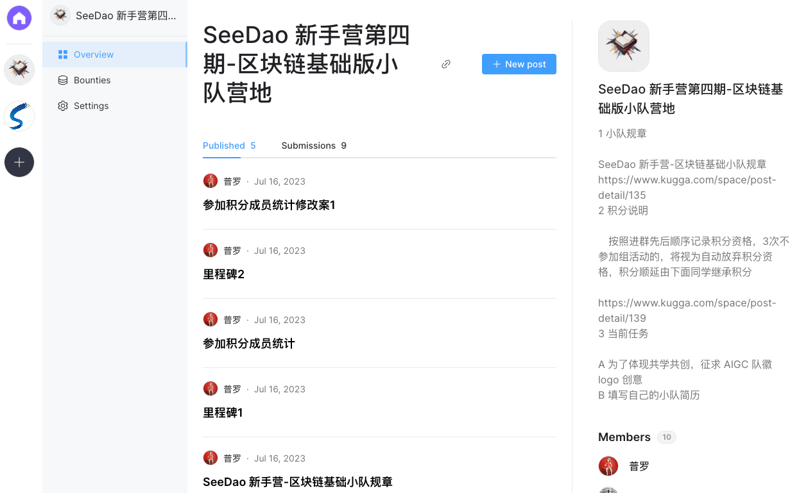
- 查看当前通过的提案

	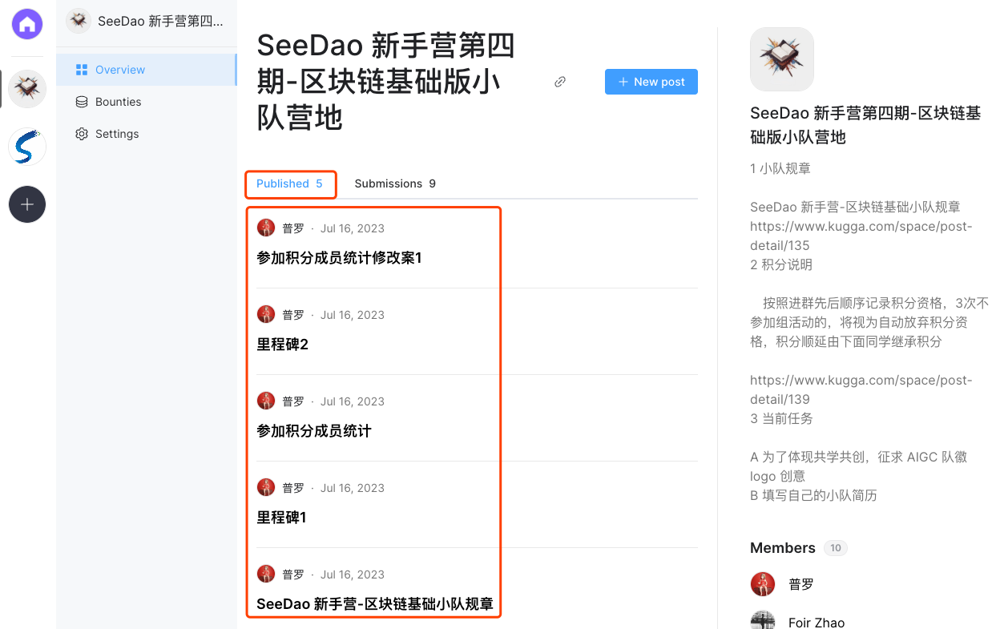
- 提案详情

	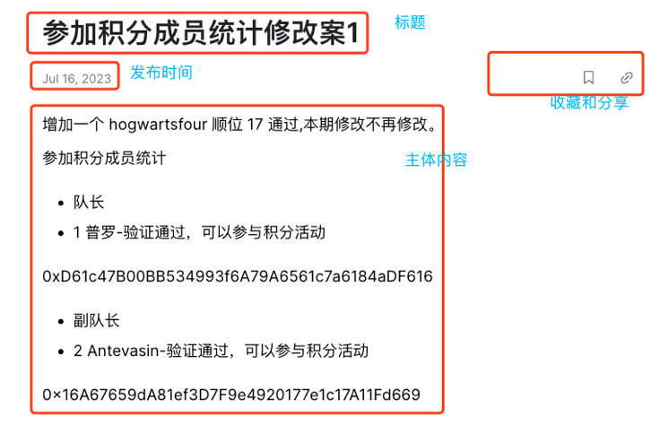	
	
	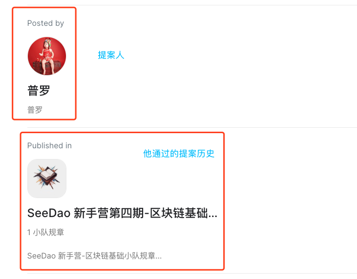

## 4 提案方法
### 4.1 发布新提案
- 登录小队营地，点击新提案

	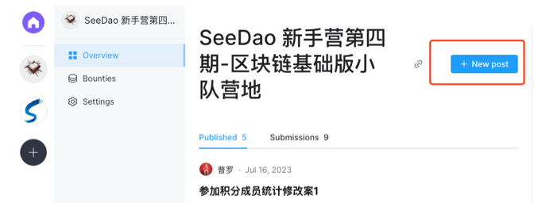
- 新提案编写，写好后点击 Publish 发布

	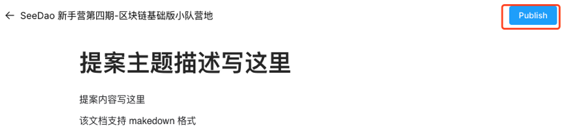
- 编写技巧1，可以通过选中来弹出格式菜单

	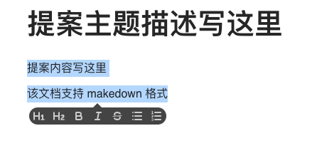
- 编写技巧2, 可以通过行首输入 "/" 符号调出格式菜单

	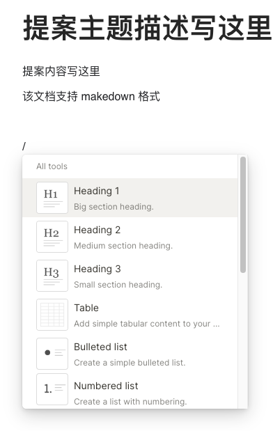

### 4.2 查看发布提案
- 返回小队营地，点击子任务提案

	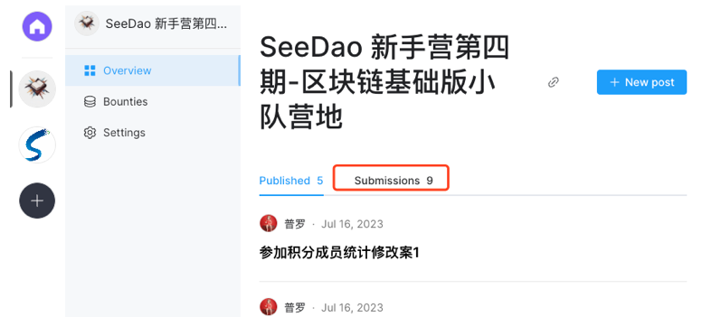
- 可以看到别人和自己发布待投票的提案

	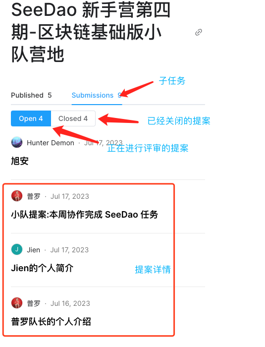	
- 查看自己的提案分三个部分，投票详情、投票汇总、建议提交
	- 投票详情
	
		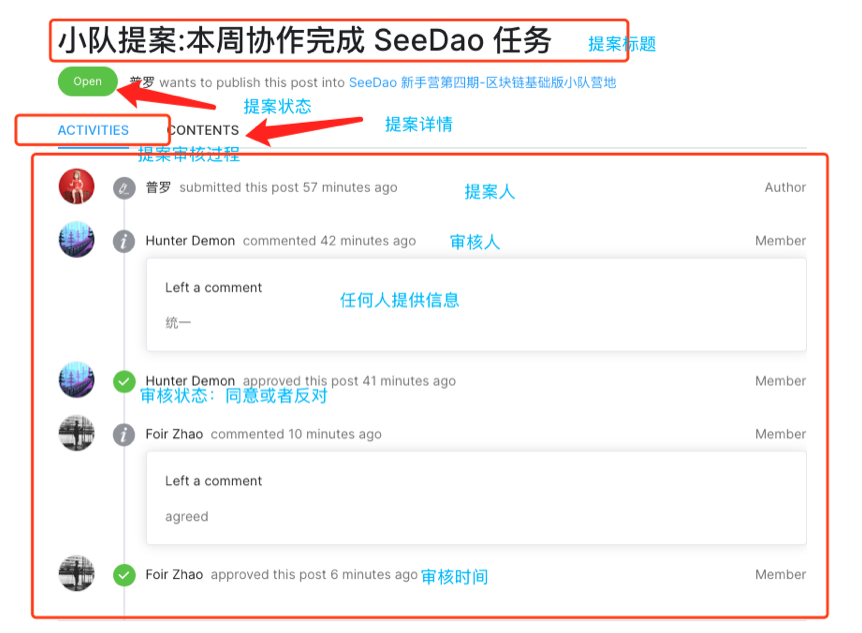
	- 投票汇总
	
		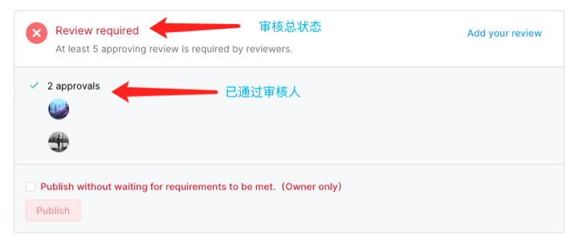
	- 建议提交
	
		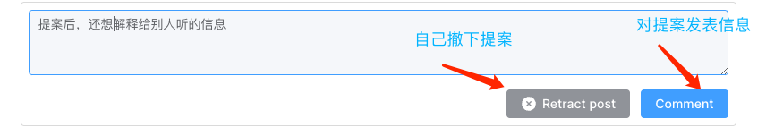
- 点击 CONTENTS ，查看提案详情

	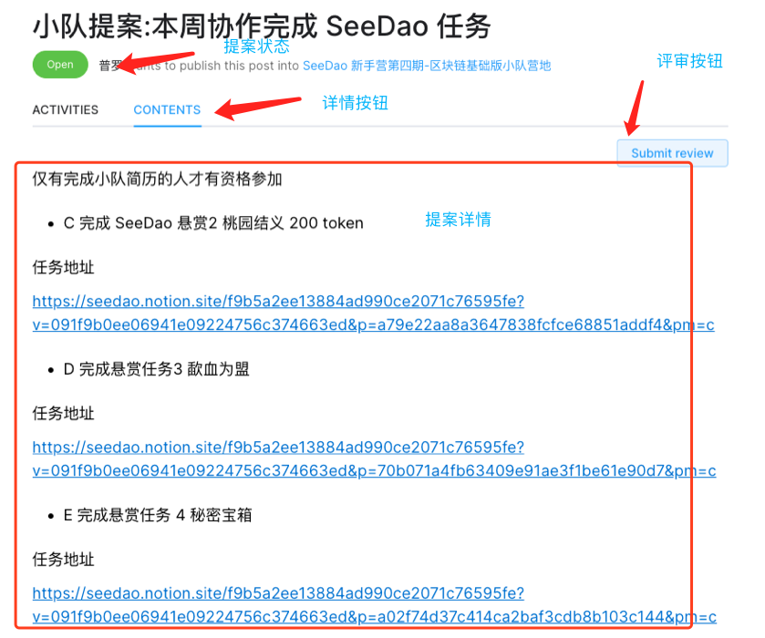
		
## 5 提案投票
- 查询待投票的提案
	- 在营地主页点击 Submissions
	- 查看 Open 中的提案 

	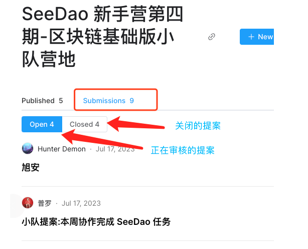					
- 点击一个提案详情
	- 提案状态

		查询提案当前状态是否是 open 中的
	- ACTIVIES

		默认查看提案进程，可以看到两部分信息
		
		- 投票详情，比如
			- 谁的提案
			- 谁赞成
			- 谁反对
			- 谁反馈了什么信息
			- 什么时间投票
			- 投票人身份
		- 投票总结，比如
			- 投票状态，比如 5 个人投票算确认	
			- 投赞成票的人员记录
	
				
				
				
	- CONTENTS
	
		提案详情+投票窗口
		
		 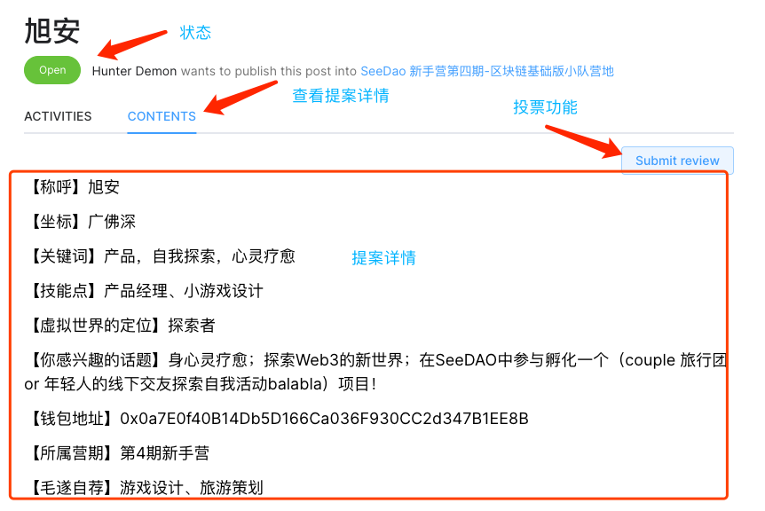	
		 
		- 投票

			查看详情后，点击 Submit review 进行投票
			
			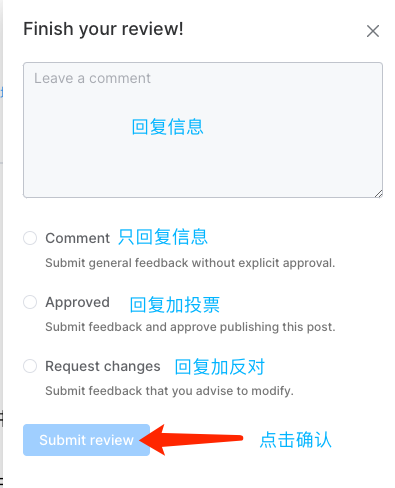 
		- 投票赞成
			- 投票信息填写

				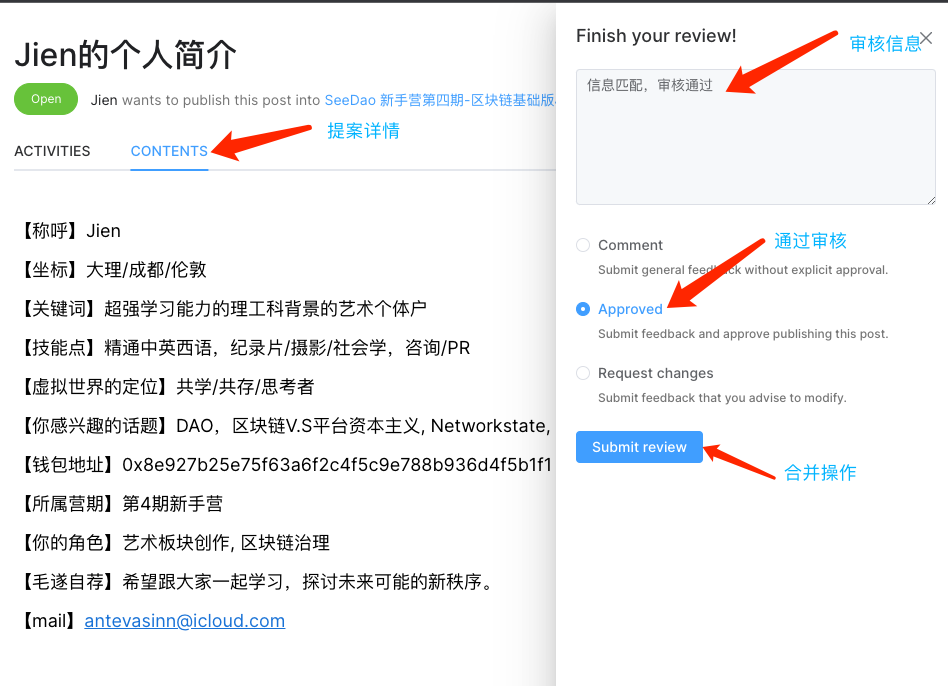 	
			- 查看提案信息
				
				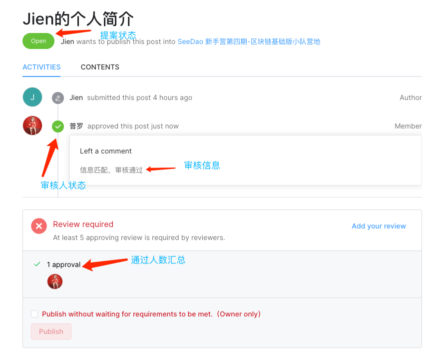 	
			- 通过提案有两种
				- 投票通过

					 	
				- 管理员强制通过(仅非提案信息可以管理员介入通过)，但管理员对所有提案信息抱有一票否决权
				
					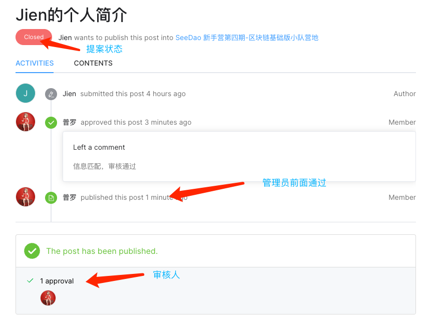 	
			- 查看营地，发表成功

				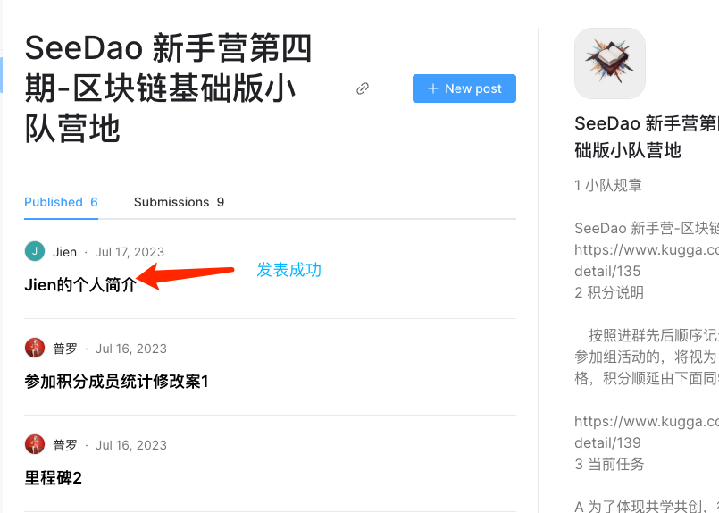 		
		- 投票反对例子
			- 投票信息填写

				 		
			- 查看提案状态
				
				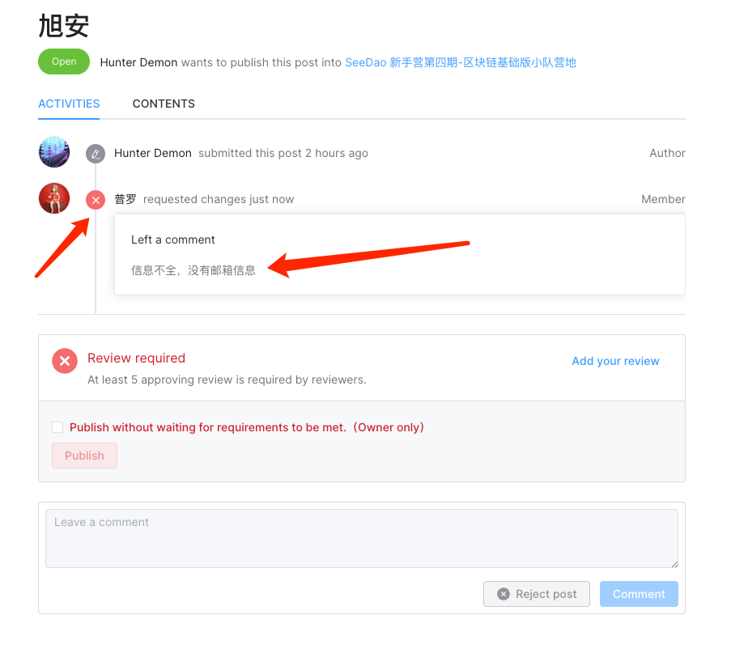
				
				用户看到这个驳回建议有两种操作
				
				- 等待其他人审批
				- 或者自己撤回修改
			- 超时被管理员关闭的提案或者用户自己撤回提案，均从 open 状态转成 close 状态 
				
				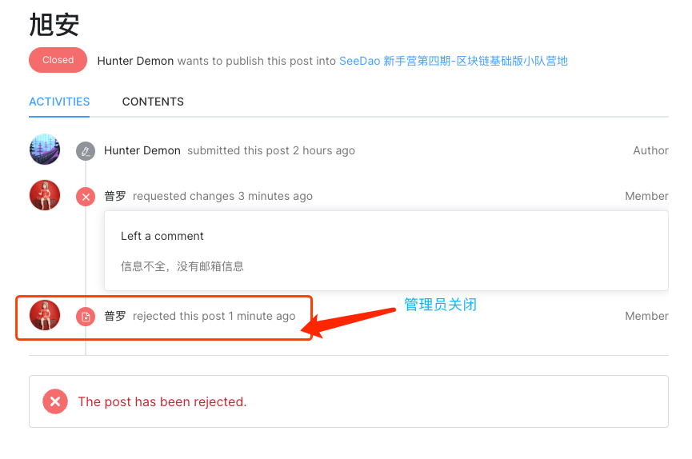 
			- 不管是管理员关闭还是用户自己撤回，一旦自己的提案被关闭，用户就可以提起新提案来修改旧提案
			
				
		- 不投票，仅回复例子

			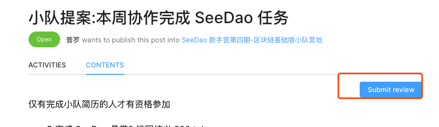
			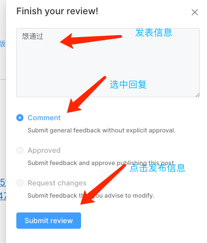	
		 

		 	
		 	 

		 		 
		 	 	
			
	
				