# SeeDao+Deshool Token  SBT NFT 在 metamask(狐狸钱包)的检查方法
加入 SeeDao 后，大家都想在钱包(Metamask)上查询自己的 SeeDao Token、SBT 证书、Deshool 学习证书、线下会议的 NFT 证书等，那么下面就由我用图文简单介绍下方法。

	为了防止歧义，以下所说钱包均代表 Metamask
## 1 准备工作
需要将这些 Token 增加到钱包中，首先确定您的钱包可以访问 ETH  主网和 Polygon 主网

### 1.1 相关知识
- ETH  主网
	- SeeDao Token SCR 合约部署在这里
- Polygon 主网
	- SeeDao 的 SBT & Deshool 的相关 NFT 部署在这里

### 1.2 钱包切换区块链网络测试
- 进入钱包

	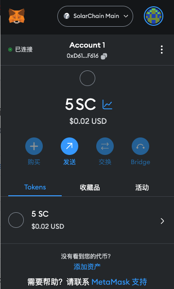
- 点击切换网络按钮

	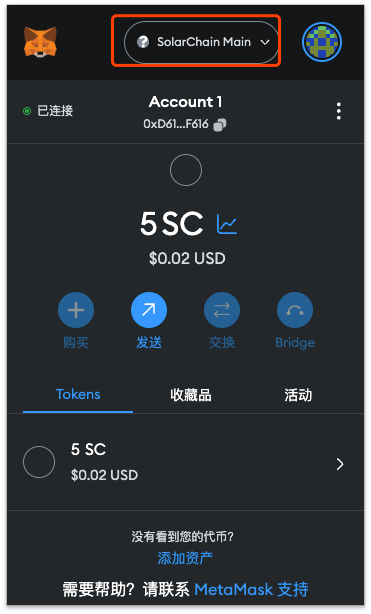
- 测试切换网络
	- ETH
		- 网络选择
		
			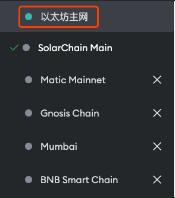
		- 等待界面

			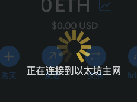
		- 切换结果
			- 成功

				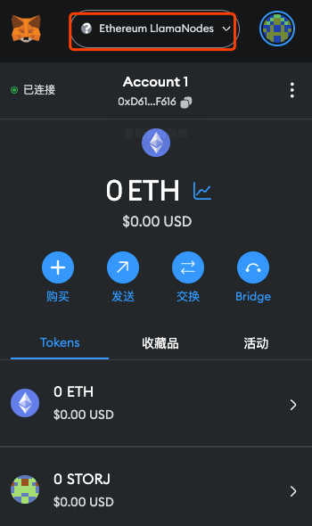	 	
			- 失败,网络超时
	
				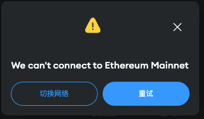	
			
					如果网络失败或找不到网络，请查看下面一章
					
### 1.3 添加适合自己网络的区块链网络 RPC 接口
- 进入 [https://chainlist.org/](https://chainlist.org/) 网站

	添加与你本地网络亲和区块链网络 RPC 数据接口

	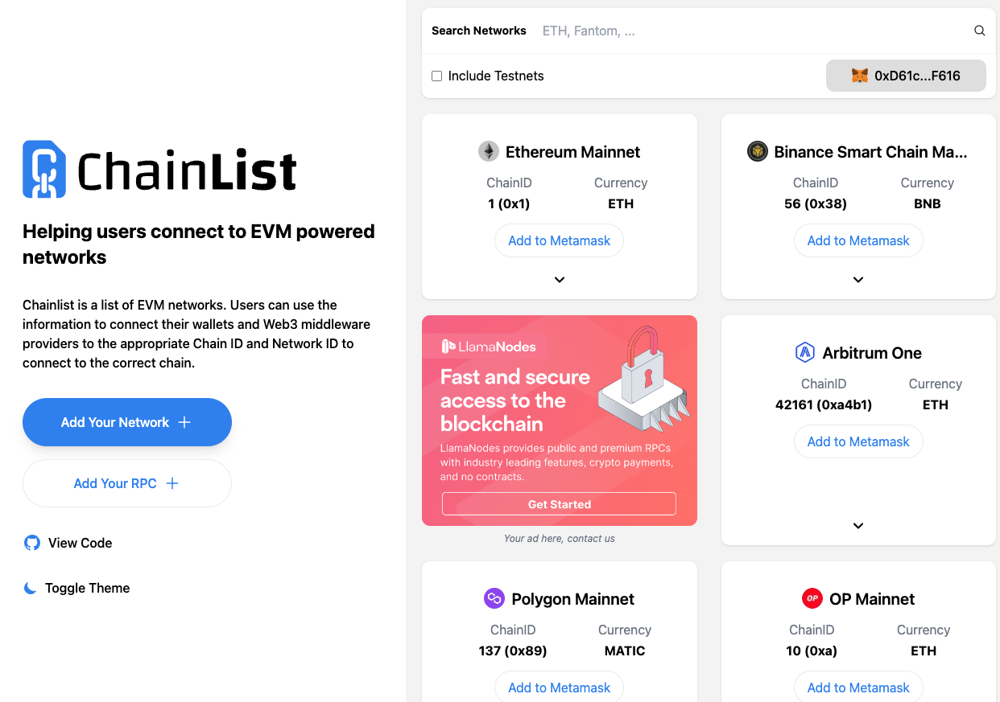
- 通过搜索找到 Eth 主网和 Polygon 主网
	- ETH
		- ChainID(唯一识别码)
			- 1(0x1)  

		 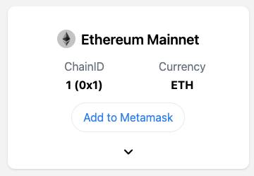
	- Polygon
		- ChainID(唯一识别码)
			- 137(0x89)   

		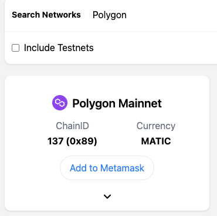 
- 查询与自己网络适配的接口

		以 Polygon 为例，因为 ETH Metamask 自带，如果适配也可以不用添加，如果链接不上，可以参考这个方法添加新的链接口
	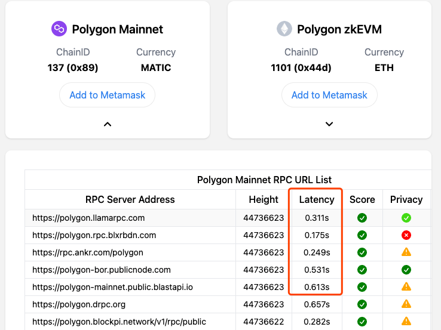
		
		这里简单做一个列表翻译 		
	列表名|详情解释
	---|---
	RPC Server Address| 链接链 http RPC 节点地址
	Height|区块高度，这个数字越大越好
	Latency|网络延迟延迟|这个数字越低越好
	Score|分数
	Privacy|隐私性
- 点击加入钱包

	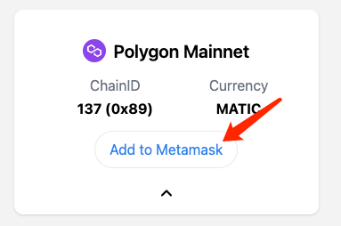	
- 钱包跳出界面，点击所有详情查看，注意这里信息是安全必要比对

	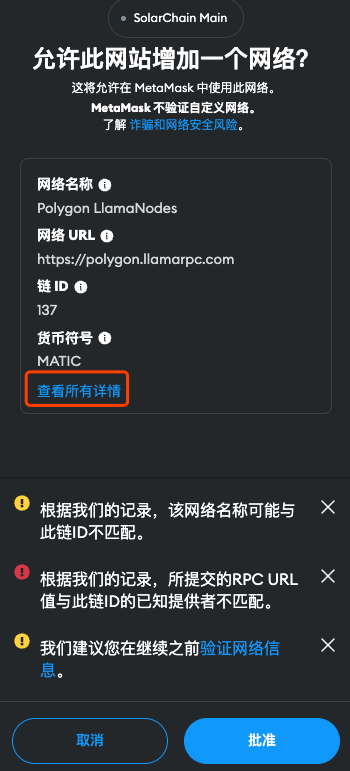
- 比对链网络信息

	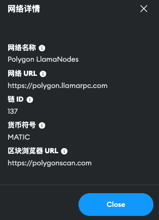
	
	- 网络名称
	
		一会在钱包中找寻链节点使用的
	- 网络 URL

		一般会自动获取最适配你的网络，也就是上面列表第一条
	- 链 ID

		这里是 Polygon ，所以是 137，这个非常重要，如果写错，你签名的数据如果被劫持会被其他人转发到其他链
	- 货币符号

		这里是 Polygon 链的 Token 符号， MATIC ，一般用来做 Gas 使用
	- 区块链游览器 URL

		注意这个非常重要，一则是安全性，所有交易可以通过游览器进行验证，会用到它查询自己地址信息
	
		- polygon
		
			[https://polygonscan.com](https://polygonscan.com	)	
		- eth

			[https://etherscan.io/](https://etherscan.io/)
	- 检查完毕后，关闭并点击批准

		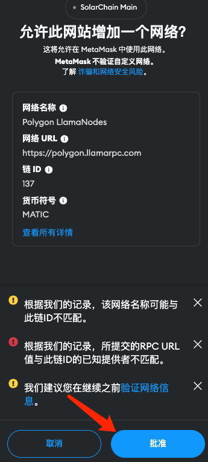
	- 钱包就会自动记录并切换到刚才添加的网络

		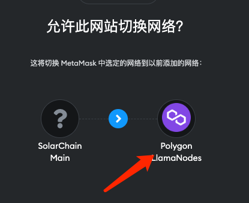
	- 点击切换，并重新打开钱包查看

		可以看到网络名称已经切换过来
		
		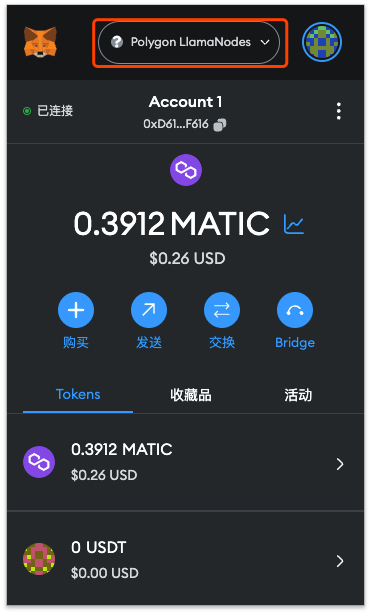
		
## 2 添加对应 Token
### 2.1 SeeDao SBT
在 Deshool 完成新手任务后，SeeDao 将在 Polygon 上颁发新手 SBT 给大家，大家可以将这个 SBT 添加到自己钱包中
#### 2.1.1 前置信息
想要查询 SBT 信息，首先需要知道信息

- 自己的钱包地址
- Polygon 的游览器使用方法

#### 2.1.2 钱包地址获取
- 打开钱包界面，并切换到 Polygon

	
- 点击复制钱包地址
	
	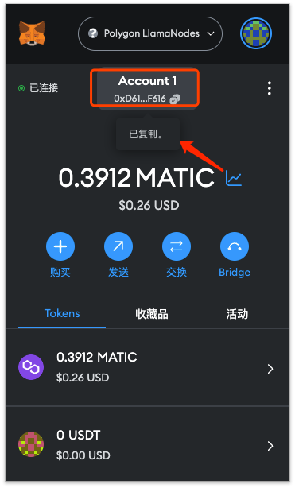		
- 看到复制就说明已经获取到钱包地址了

注意事项:

因为 Metamask 是多地址钱包，所以请复制的时候检查是否是你登录 Deshool 还有认证 SeeDao 的地址，否则后面将无法获取到数据
			
#### 2.1.3 Polygon 的游览器使用方法
- 跳转到 Polygon 主网游览器

	在上一个步骤，我们已经切换到了 Polygon 链了，所以只需要点击
	
	- 复制账户旁边的三个点操作按钮扩展
	- 以及点击里面的 

			在 Explorer 中查看账户
	
	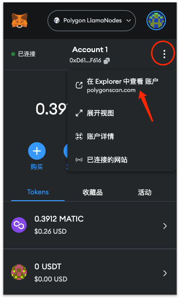				
- 游览器界面
	
	确认两端信息，保证一定的安全性
	
	- 前段域名信息将确定你访问的网站，该域名是 polygon 主网游览器官方地址

			https://polygonscan.com/
	- 后段信息是可以看到你钱包的地址，保证你查看的页面对应的数据为你钱包数据

		
	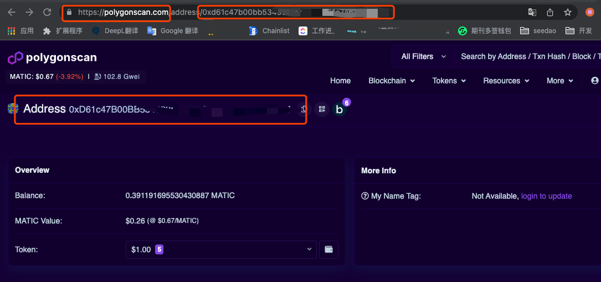

#### 2.1.4 查看 SBT 信息
- 点击游览器 Token 总汇

	可以看到在 ERC-1155 Token 中有信息

	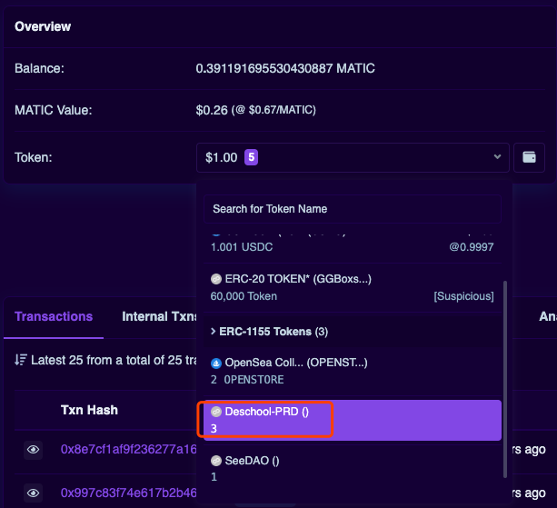
	
	如果没有，那么你将没有获取到 SeeDao SBT ，这里情况可能有很多，比如延迟发放、比如发放系统故障，但只要你通过了，理论上就应该发放，有问题可以找 SeeDao 社区小伙伴咨询
- 点击打开 Deshool-PRD 查看信息

	更多游览器信息，我将不在这里展开，我们简单看2个信息来确定页面准确性
	
	- 左上角的 `Deschool-PRD `

		确定选择的 Token 名称
	-  `View NFT` 是可以看到铸造 SBT 的详情按钮	
	
		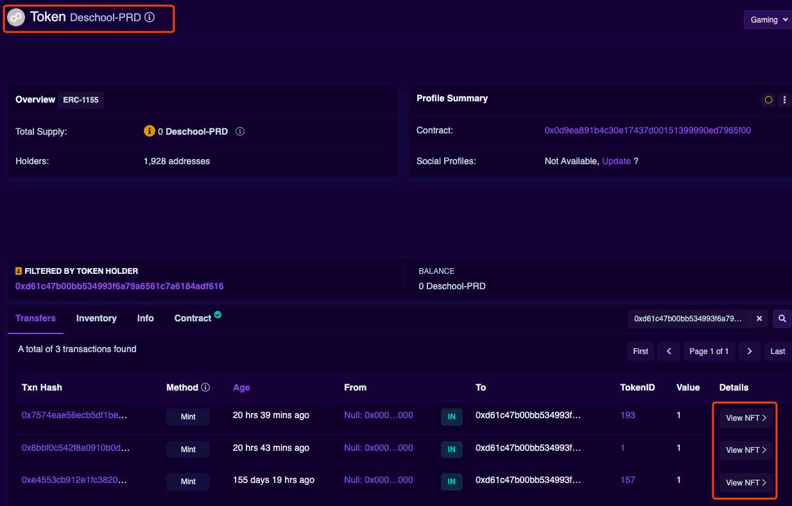
	- 点击  `View NFT` 获取添加到钱包的2个信息
		- `Contract Address:`
		- `Token ID`
	
		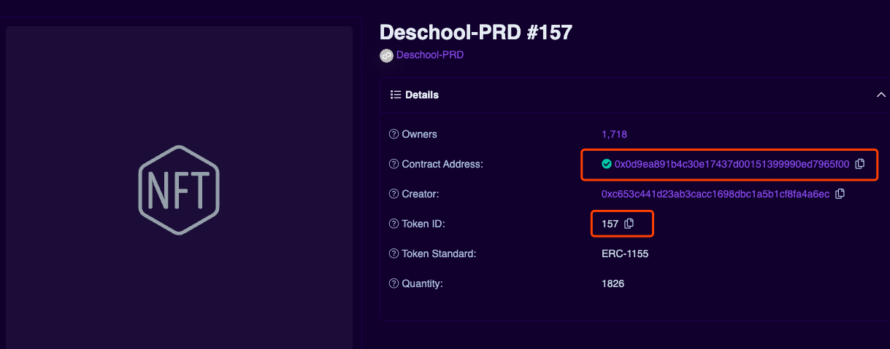
#### 2.1.5 钱包添加 SBT		
好了我们拥有了全部信息，这样我们就可以回到我们的钱包添加了
	
- 打开钱包

	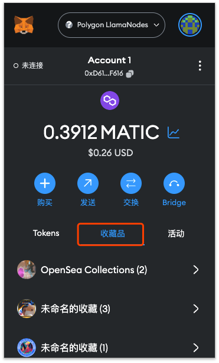	
- 鼠标向下滚动，点击添加收藏品

	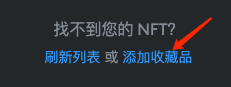
- 将刚才收集的2个信息添加在这里，点击添加

	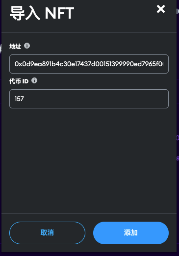
- 等待后提示添加成功		
	 
	 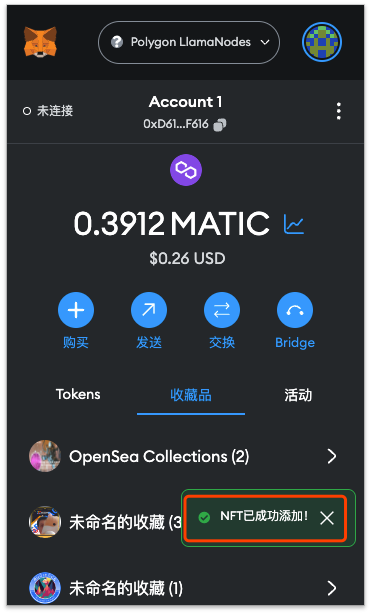
- 添加其他 Deshool 的课程 NFT 同样如此

#### 2.1.6 查看 SBT
- 点击查看收藏品

	可以看到 SBT 就在这里了
	
	 	 		 

### 2.2 SeeDao Token
- 切换钱包到 ETH 主网

	上面提过 SeeDao Token 在 ETH 主网，所以我们先切换
	
	 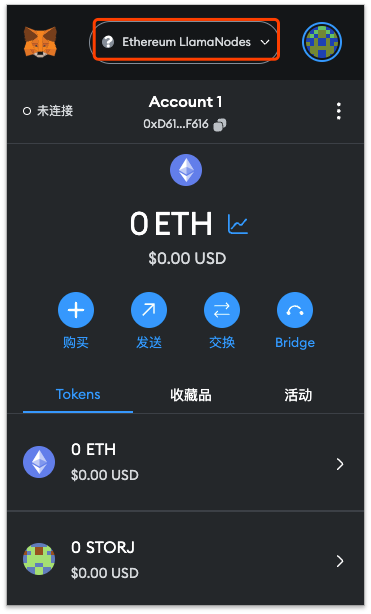	 	
- 点击 Tokens 类并向下混动鼠标，找到添加资产，并点击，类 SBT

		
	 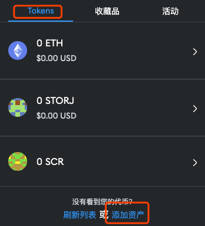	 
	
- 点击自定义代币，并添加 SeeDao 代币合约地址 

		SeeDao 代币合约地址
		0xc74DEE15a4700D5df797bDD3982EE649A3Bb8c6C
		
	 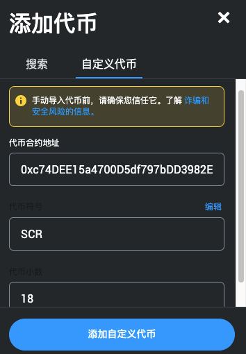	 
- 检查信息，并点击添加

	 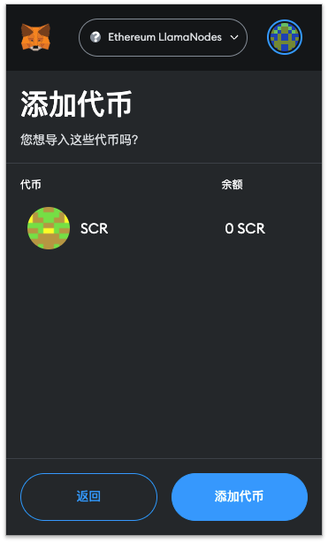	 
- 查看 SeeDao Token 信息

	 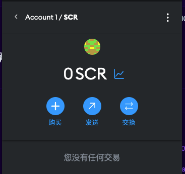	 	 
			
	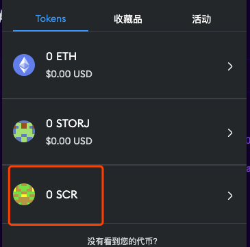
- 还可以查看游览器

	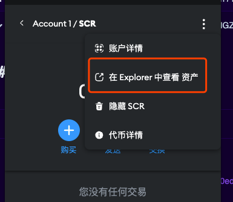			
- 查看合约情况			
	
	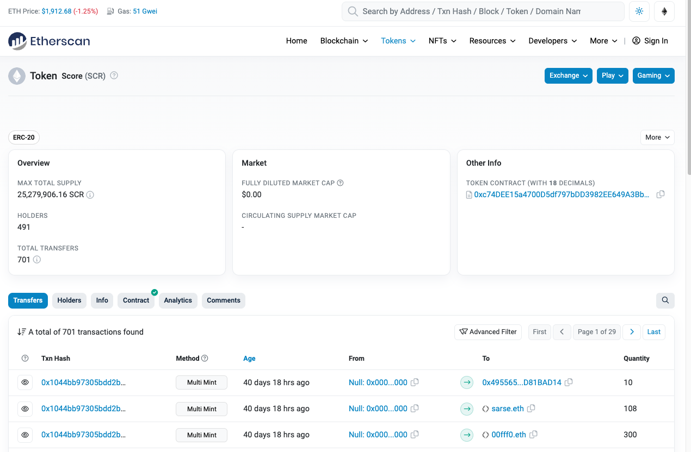
	
## 3 简单问答
### 3.1 问题1
- 问

		SeeDao 代币在 Discord 领取后，为什么没显示或添加失败？
- 答
		
		1. 可能因为你查询的链不正确
		2. 可能因为 SeeDao 代币发放会通过 SeeDao 流程，走 SeeDao 审批，所以会有延迟 
		3. 你添加错了钱包地址 
		
### 3.2 问题2
- 问

		SeeDao SBT 为什么没显示或添加失败 
- 答
	
		1. 可能因为你查询的链不正确
		2. 可能因为发放的 Deshool 后台异常
		3. 你没有真正完成新手训练流程
		4. 你添加错了钱包地址

### 3.3 问题3
- 问

		钱包切换区块链网络总是超时
- 答

		1. 请检查自己的网络情况，
		2. 使用上面 1.3 以及以后方法添加合适自己的网络 