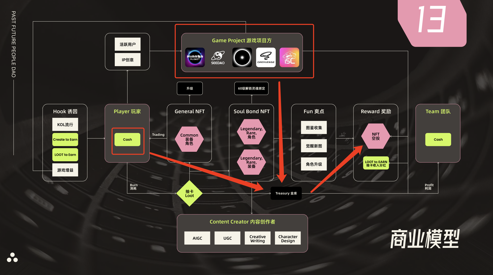

# PFP 经济模型
共创让社区来设计英雄，最后一起持有和分享收入
## 合约地址
- 抽卡合约

		https://polygonscan.com/address/0xe9728ed5e1fd05665c44a17082d77049801435f0
- NFT 合约
	- 人物 

			https://polygonscan.com/address/0xbe0a8ce3ca98d5806b7f8da015eabcfb4738592a
	- 装备

			https://polygonscan.com/token/0x2871e92209d9b0936fbbb178483877f51c7c9321
	
- 
	-  游戏项目方(甲方)
		-  支付
			-  广告费、赞助费、购买
		-  获得
			-  衍生游戏，电影电视剧动漫，或者赞助活动
	- 经济模型(传统博彩机制)
		- 资金入口
			
			玩家出钱来抽卡 
		- 资金出口
	 		
	 		部分玩家分成和团队分成
- 传媒媒介
	- dc
		- seedao 一个子集页面
		- 人数未知
	- 微信群
		- PFP-DAO    	

