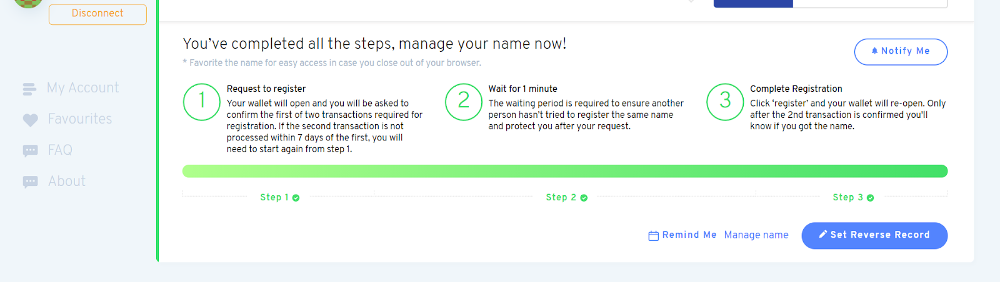
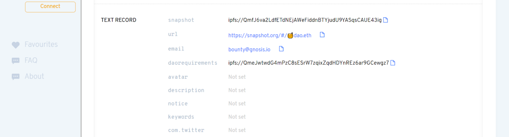
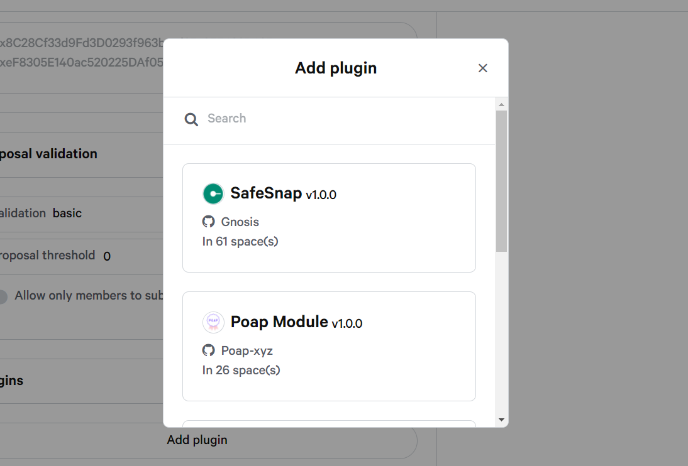
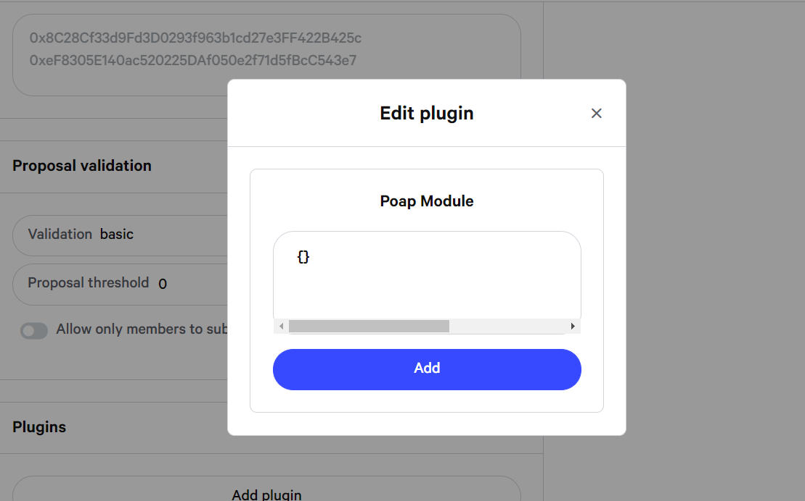
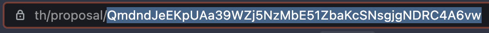

# snapshot
## 什么是 Snapshot
### 介绍
Snapshot 是一个去中心化的投票系统。它在如何计算投票的投票权方面提供了灵活性。Snapshot 支持各种投票类型，以满足组织的需要。在 Snapshot 上创建提案和投票是用户友好的，而且由于该过程是在链下进行的，所以不需要花费汽油。

简而言之，Snapshot 是一款易于验证且难以质疑结果的脱链无气多治理客户端。

### 关键特性
- 免费(无气体)创建提案并进行投票
- 投票是很容易在网上验证的签名信息
- 多重投票系统-单一选择，批准投票，二次投票，等等
- 灵活的投票策略来计算投票结果——用erc20、NFTs、其他合同投票，等等
- 空间可以有他们的品牌与自定义配色方案和域名
- 完全开源，MIT许可

## 空间
### 准备工作
要在 Snapshot 上创建空间，您需要有一个 ENS 域。本页面将带您完成创建 ENS 域的步骤。

	你需要在以太坊主网上有一个 ENS 域，即使你想使用以太坊测试网或任何其他网络(币安智能链，xDAI…等等)。
如果你已经有一个 ENS 域，请随意跳过这一点，并遵循下面的[指南](https://docs.snapshot.org/spaces/create)。
#### 创建 ENS 域
1. 通过以下链接 [https://app.ens.domains/](https://app.ens.domains/) 搜索你的名字在 ENS 的可用性
2. 如果名称是可用的，您将能够看到3个步骤和注册费用。请注意，3 或 4 个字符的名称比 5 个以上字符的名称成本要高得多。

	
3. 通过按下屏幕左上角的连接键连接您的钱包。确保你的钱包有足够的余额来完成交易。
4. 从您选择的钱包中确认三个步骤的所有交易。

	 
5. 现在你已经成功在ENS注册了!此外，您还可以通过点击“设置反向记录”或进入“我的账户”，然后选择“反向记录”，并完成交易，从而使您的以太坊地址指向一个ENS名称。

恭喜你!您已经在 ens 上创建了域，现在可以开始在 Snapshot 上创建空间了。

如果你想注册一个你已经拥有的自定义域，请查看这个指南 [https://docs.ens.domains/dns-registrar-guide](https://docs.ens.domains/dns-registrar-guide)

### 创建一个空间
1. 为您的空间设置一个ENS域

	如果你还没有，按照这个指南- [https://docs.snapshot.org/spaces/before-creating- your-space](https://docs.snapshot.org/spaces/before-creating-your-space) 获得你的ENS域名。

	现在你有了 ENS 的地址，继续在 [snapshot.org](https://snapshot.org/#/setup) 上设置你的空间
	
	 
2. 设置 ENS text-record

	 
	
	输入要设置为空间控制器的钱包地址，点击“设置控制器”。

	您需要在以太坊主网上签署交易以设置 ENS 文本记录。
3. 创建空间

	 
	 
	要创建您的空间，您将需要输入一个名称，符号和选择的网络。可以在您的空间设置中更改这些设置。

4. 自定义您的空间设置

	如果你没有找到设置页面，你可以手动导航到它:

		https://snapshot.org/#/<ENS DOMAIN>/settings

	- 配置文件
	
		
		
		- `Name` 是将显示在您的空间中的名称,必填
		- `About` 是对治理目的的描述。
		- `Avatar` 是你的项目标志。
		- `Network` 是选择相对于您的令牌的网络,必填
	
			
		- `Symbol` 是将在您的空间中显示的主要标记符号,必填
		- `Skin` 可以保留为默认值，作为现有的皮肤使用，也可以[创建自己的皮肤](https://docs.snapshot.org/spaces/add-skin)。
	
			
		- `Twitter`和 `Github` 只需添加一个用户名链接到您的不同帐户
		- `Domain name` 为可选项，可[自定义域名](https://docs.snapshot.org/spaces/add-custom-domain)。
		- `Terms` 链接到您的网站的条款和条件。
		- `Hide space from homepage` 如果你想保持你的空间“私有”。
	- 策略(Strategies)

		策略是一个 JavaScript 函数，它定义如何计算投票权。你需要为你的提案添加一个投票策略。`Erc20-balance-of` 是最常用的策略。您可以有多种策略，也可以有自定义策略。

		
		
		你可以在你的空间中添加5种策略。

		一旦选中，如果您想添加自己的令牌，就可以通过单击它来编辑策略。更多信息查看 [https://docs.snapshot.org/strategies](https://docs.snapshot.org/strategies)
		
		
	- 管理员(Admins)

		管理员将能够编辑空间设置和修改提案。每行必须添加一个地址。
		
		
	- 过滤器 (Filters)
		- 提议阈值(Proposal threshold)是创建提议所需的最小令牌数量。
		- 提案验证(Proposal validation ) 是一个自定义功能，用于验证某人是否可以发布提案。您可以默认使用基本验证，它利用空间策略获取您的投票权，并检查您是否通过了定义的阈值。	

				
			
			- 只允许作者提交提案（Allow only authors to submit a proposal），作者将能够创建提案而不受过滤器的限制。每行必须添加一个地址。确保只有在 authors 字段中指定的成员才允许提交提案,类似提案白名单

				
	- 插件（Plugins）

		插件为你的空间提供额外的功能。更多信息:	[https://docs.snapshot.org/plugins](https://docs.snapshot.org/plugins)
5. 保存您的设置

	点击“保存”，然后确认您钱包中的操作。

	你都准备好了!您可以访问 `https://snapshot.org/#/<ENS_DOMAIN>` 查看自己的空间。
	
### 创造空间的另一种方式
如果您不想让钱包控制您的设置，您可以按照以下步骤在 `Snapshot` 上创建空间。

- 缺点
	- 您将无法从 `UI` 更改设置
	- 每次想要更改设置时，都需要广播一个新的事务
- 如何创造空间
	- 为您在Snapshot上的设置创建一个 JSON 文件。JSON 文件的格式如下:

		[https://github.com/snapshot-labs/snapshot.js/blob/master/test/examples/space.json](https://github.com/snapshot-labs/snapshot.js/blob/master/test/examples/space.json)
	- 将 JSON 文件存储在 IPFS 上
	- 在 ENS 文本记录上使用 IPFS 链接。这将使 ENS 所有者成为设置的唯一控制器。

			
	- 你可以在 `https://github.com/snapshot-labs/snapshot.js/blob/a0adc547aa0922aa6abd35708a4a292048bca6a2/test/schema.ts#L4` 下面的 github 链接中检查你的空间是否有效
	- 一旦上面的事务成功，转到下面的链接来更新 Snapshot 中的空间:

			https://hub.snapshot.org/api/spaces/<ENS DOMAIN>/poke

### 验证
为了让你的空间在官方快照列表上得到验证，你需要:

	

- avatar 的形象
- 提案验证的最小阈值
- 该空间的成员超过 1000 人
- 至少5个已关闭的提案
- 来自官方网站的链接，GitHub 组织或确认快照空间所有权的推文
- 要求得到一个管理员在 [discord](https://discord.snapshot.org/) #helpdesk 频道验证
			
### 把你的空间转移到 ENS
如果在 Snapshot 中已经有一个没有 ENS名 称的空间，您需要将您的空间迁移到 ENS.下面的指南将介绍如何成功迁移您的空间到 ENS。

1. 与ENS创造一个空间

	要迁移你的空间，你首先需要用 ENS 创建空间。您可以使用这个 url 在表单中填充以前的空间设置:
	
		https://snapshot.page/#/<ens_space_id>/settings/<previous_space_id>
	例如
	
		https://snapshot.page/#/yam.eth/settings/yam
2. 声明新的空间别名

	要添加新的空间别名，你需要在这个 github 存储库上做一个 pr
	
	[https://github.com/snapshot-labs/snapshot-spaces](https://github.com/snapshot-labs/snapshot-spaces)
	
	遵循快照空间目录树
	
		└── spaces
	    			└── aliases.json
	必须在别名中添加新别名 [aliases.json](https://github.com/snapshot-labs/snapshot-spaces/blob/master/spaces/aliases.json) 文件。 
	
		{
		  "my-space": "my-space.eth"
		}   			
3. 迁移提案、投票和 url

	提案、投票和 url 的迁移是手动完成的，一旦您与 ENS 的空间准备好了，请在 [Discord](https://discord.snapshot.page/) 的“帮助台”频道给我们发送消息，以便进行更改。
	
### 添加自定义域
- 什么是自定义域?

	因为您已经有了 ENS 的域，所以添加自定义域是可选的。自定义域允许您在自定义域上显示您的空间(且仅显示您的空间)。
	
	例如 [https://vote.balancer.fi/#/](https://vote.balancer.fi/#/)
- 创建一个 pr

	要添加一个自定义域，你需要在这个存储库上做一个 pr:
	
	[https://github.com/snapshot-labs/snapshot-spaces](https://github.com/snapshot-labs/snapshot-spaces)
	
	遵循快照空间目录树
	
		└── spaces
		    └── domains.json
- 添加自定义域
	- 在域名字段中设置它

		要添加自定义域，请在设置中填写“域名”字段。
		
			
	- 将它插入到 `domains.json` 文件列表

		要将子域添加到 Snapshot，您需要编辑 domains.json文件。
		
		[https://github.com/snapshot-labs/snapshot-spaces/blob/master/spaces/domains.json](https://github.com/snapshot-labs/snapshot-spaces/blob/master/spaces/domains.json)

		为了防止冲突，建议在两个现有域之间添加子域，而不是在列表的末尾或开头添加子域，如下面的示例所示。
		
			{
			  ...
			  "other.domain.com": "ens.eth",
			  "my.custom.url": "my-space.eth",
			  "other.domain.com": "ens.eth",
			  ...
			}		    
	- 配置您的DNS

		您将需要在您的域名 DNS 中添加  `cname.snapshot.org`  作为CNAME

		提交 PR 后，你将不得不等待合并。这个过程可能需要几个小时。
- 激活自定义域

	一旦PR合并，你可以去这里激活域:

	[https://ina9pk8175.execute-api.us-west-2.amazonaws.com/dev?domain=example.com](https://ina9pk8175.execute-api.us-west-2.amazonaws.com/dev?domain=example.com)(将“example.com”替换为您的自定义域)。

	注意，在这一步，返回的消息可能包含警告，如果域 DNS 区域尚未完全解析或者您已经成功激活了域，就可能发生这种情况。底线是，如果你已经正确设置了CNAME记录，你根本不应该担心。

	在目前的流程下，我们仍然要合并一个提交，从我们的一方最后确定部署你的PR，以能够得到你的域生活。这个过程可能会持续好几天

### 添加一个皮肤(skin)
皮肤允许您使用自定义域为您的空间定义配色方案。它不会影响你在 Snapshot.org 上的空间

先决条件:添加自定义域

- 创建一个 PR

	要创建你自己的皮肤，你需要在这个仓库上做一个PR:
	
	[https://github.com/snapshot-labs/snapshot-spaces](https://github.com/snapshot-labs/snapshot-spaces)
	
	遵循 Snapshot 目录树
	
		└── skins
		    └── my-space.scss
- 添加你的皮肤

	要添加你的皮肤，你需要创建一个“my-space.scss” 文件在 “skins” 目录中
	
		.my-space {
		  --primary-color: #384aff;
		  --bg-color: white;
		  --text-color: #586069;
		  --link-color: #111111;
		  --heading-color: #111111;
		  --border-color: #d1d5da;
		  --header-bg: white;
		  --block-bg: transparent;
		}
	修改文件名 `my-space.scss` 和 CSS选择器`.my-space` 与您的空间名称。

	然后您还需要在这个文件中列出您的皮肤文件: [https://github.com/snapshot-labs/snapshot-spaces/blob/master/skins/index.js](https://github.com/snapshot-labs/snapshot-spaces/blob/master/skins/index.js)

	然后在空间设置中的皮肤字段中选择您的皮肤。
	
	
	提交你的PR后，你必须等待合并和部署你的PR，才能选择你可用的皮肤。这个过程可能会持续好几天。

### 空间的角色
在一个空间中可以有 3 种不同的角色:

- 控制器(Controller)

	空间控制器可以编辑空间设置，包括管理员。
- 管理员(Admins)

	管理员可以编辑空间设置(除了管理员列表)和存档建议。
- 作者(Authors)

	作者可以发布提案，不管他们的投票权是多少
	
### 删除一个空间
目前，删除空间仍然需要一些手工工作。为了确保删除空间的请求是合法的，请从该空间的管理员帐户中创建一个标题为“删除此空间”的建议。

将来，在设置中将会有一个选项，用来删除一个空间。

## 提案
### 创建一个提议
学习如何创建提案。

- 如何创建提案?
	- 转到一个项目空间，点击右上角的 `connect wallet`
	- 与您持有相关代币的钱包提供商连接，并单击“新提议”
	- 填写你的提案的标题和摘要。
	- 转到“启动(Actions)”框，选择 [voting typen](https://docs.snapshot.org/proposals/voting-types) 的开始日期和结束日期。确保你有足够的时间来投票。
	- 使用默认的 Snapshot 块号，也可以根据需要更改它。区块数是统计选民余额的快照。
	- 点击“发布(Publish)”，你的提案就创建好了!
- 添加快照块号

	这个数字对于锁定能够投票的社区成员的状态非常重要。请注意，只有在创建  Snapshot 区块号(`Snapshot block number`)时持有相关令牌数量的社区成员才能对提案进行投票。

	当您创建一个提议时，默认情况下，“快照块号” 将使用来自我们节点的最新块同步填充。您可以在创建提议时使用这个默认数字，也可以只查看 [https://etherscan.io/blocks](https://etherscan.io/blocks) 并使用最后一个块数字。

	根据空间的设置，要么快照时刻，每个持有足够数量代币的人都可以投票，要么只有持有足够数量代币的成员才能提交提案。
- 建议限制
	- 建议的内容有 6400 个字符的限制
	- 策略限制 8 种
	- 当您使用多链策略时，还应该尊重这个限制

### 对一项提案进行表决。
为了对给定的提议进行投票，您需要在创建块时拥有足够数量的令牌。这意味着，如果您试图对一个提案进行投票，其中所配置的区块号是过去的，并且您当时没有持有所需的令牌，您的投票将不会被统计。

- 转到项目的快照页面
- 点击右上角的“连接钱包”按钮
- 与持有相关代币的钱包提供商连接
- 单击您想要投票的选项
- 通过您的钱包签署消息，然后完成

### 投票系统
Snapshot 支持许多不同的投票类型，我们计划在未来支持更多。如果您想请求一个新的投票类型，请在这里打开一个功能请求 [https://features.snapshot.org/feature-requests](https://features.snapshot.org/feature-requests)

投票系统表示基于投票权计算投票结果的方法。投票策略计算投票权，投票系统计算投票结果。

根据你的提案，不同的投票系统还允许用户:

- 只选择一个选项(单一选择投票)
- 将他们的选票分散到多个选项中(加权投票)
- 根据个人地址和投票权对结果进行权衡(二次投票)
- 批准一定数量的选项(批准投票)
- 将不同的选择按其优先顺序排序(排名选择投票)
- 可以在达到法定人数的情况下弃权(基本投票)

让我们更深入地看看每种投票类型:

- 单一选择投票(Single choice voting)

	每位选民只选择一个选项。结果将以百分比的形式反映这些投票。从众多选项中选择一个的理想选择。

	例子:你的社区需要做出选择
- 投票批准(Approval voting)

	每个选民可以选择(“批准”)任何数量的选择，每个被选中的选择将获得同等的投票权。
- 二次投票

	每个选民可以在任意数量的选择中分配投票权。结果是二次计算的，您可以在这里[https://wtfisqf.com/](https://wtfisqf.com/)验证这些计算 
- 排名选择投票(IRV)

	每个选民可以对任意数量的选择进行排名。
	
	- 首先计算的是每位选民的首选票。
		- 如果一个候选人的第一选择获得超过半数的选票，这个选择就获胜。
		- 否则，得票最少的选项将被淘汰。
			- 那些把失败的选择作为第一选择的选民，他们的选票会被加到下一个选择的总数中。
			
			这个过程会一直持续下去，直到选出的候选人获得超过半数的选票。当参选人数减少到两名时，这就变成了一场“即时决选”，可以对两名候选人进行正面交锋的比较。
- 加权投票

	每个选民可以在任意数量的选择中分配投票权。这种投票方法最早是由[https://scattershot.page/](https://scattershot.page/) Float Protocol(快照的一个分支)引入的。
	
## 策略
### 了解策略
#### 如何使用策略
如果您想要投币投票（1 个代币 = 1 票），您可以使用 “erc20-balance-of”，但是您可能想要：

- 使用委托策略委托投票权
- 使用二次策略加权投票权
- 使用基于 ERC-721 或 ERC-1155 的策略进行 NFT 投票
- 仅允许某些成员使用白名单策略进行投票
- 使用多链策略计算来自多条链的投票权

您可以在单个提案中组合多达 8 个策略（投票权是累积的）

在撰写本文时，快照有超过 150 种投票策略。在此处 [https://snapshot.org/#/strategies](https://snapshot.org/#/strategies) 探索它们

您甚至可以使用 Playground 按钮预览操作。

#### 什么是策略
策略是一个 JavaScript 函数，它返回一组地址的分数。在快照上使用策略来计算提案的结果。一个提案可以有多个策略。默认策略是为每个选民计算一个 ERC20 的余额。策略可以向节点或子图发送调用。
#### 示例策略
这是一个最常见的策略示例，称为 `erc20-balance-of`.

[https://github.com/snapshot-labs/snapshot-strategies/blob/master/src/strategies/erc20-balance-of/index.ts](https://github.com/snapshot-labs/snapshot-strategies/blob/master/src/strategies/erc20-balance-of/index.ts)
	
	import { formatUnits } from "@ethersproject/units";
	import { multicall } from "../../utils";
	import { abi } from "./TestToken.json";
	
	export async function strategy(
	  space,
	  network,
	  provider,
	  addresses,
	  options,
	  snapshot
	) {
	  const blockTag = typeof snapshot === "number" ? snapshot : "latest";
	  const response = await multicall(
	    network,
	    provider,
	    abi,
	    addresses.map((address: any) => [options.address, "balanceOf", [address]]),
	    { blockTag }
	  );
	  return Object.fromEntries(
	    response.map((value, i) => [
	      addresses[i],
	      parseFloat(formatUnits(value.toString(), options.decimals)),
	    ])
	  );
	}	
策略在您的空间设置 `https://snapshot.page/#/<SPACE ADDRESS>/settings` 中定义。这是一个如何添加一个策略来计算 BAL 和 Balancer 池中的投票权的例子，在那里他们提供流动性。

- 策略设置的 `erc20-balance-of`

		{
		  "address": "0xba100000625a3754423978a60c9317c58a424e3D",
		  "symbol": "BAL",
		  "decimals": 18
		}
- 策略设置 `balancer `

		{
		  "address": "0xba100000625a3754423978a60c9317c58a424e3D",
		  "symbol": "BAL BPT"
		}

策略可以用来从链上数据创建一个分数，数据不一定是货币，你可以想象一个策略，计算你拥有多少 POAP 或使用任何其他可用的链上数据来发布一个分数。

#### 其他常见的策略
- `Erc20-with-balance`

	 是一个策略的例子，它检查参与者是否拥有投票所需的最小数量的令牌，并将所有选票分配给1。您需要添加参数 “minBalance”，并将其设置为对提案进行投票所需的最小余额。该值默认为 0。
- `erc20-balance-of-delegation`

	如果您想在使用与 `erc20-balance-of` 的授权合同

在这里找到更多的策略:

[https://github.com/snapshot-labs/snapshot-strategies/tree/master/src/strategies](https://github.com/snapshot-labs/snapshot-strategies/tree/master/src/strategies)

### 制定新策略
为了在 Snapshot 上添加你自己的策略，你需要 fork `Snapshot -strategies` 存储库并创建一个PR。

[https://github.com/snapshot-labs/snapshot-strategies](https://github.com/snapshot-labs/snapshot-strategies)

1. 导航到 `src\strategies`

		└── src
		    └── strategies
		        └── erc20-balance-of
2. 创建一个 `erc20-balance-of strategy` 文件夹的副本，并将其重命名为您的策略的名称
3. 写你的策略的逻辑，包括它在 `**src\strategies\index.ts`，用

		npm run test --strategy=<STRATEGY NAME> // replace <STRATEGY NAME>
4. 确保你通过了检查清单

	在这里查看添加新策略的要求，并确保您完全填写了清单中的要点:[https://github.com/snapshot-labs/snapshot-strategies#checklist-for-adding-a-new-strategy](https://github.com/snapshot-labs/snapshot-strategies#checklist-for-adding-a-new-strategy)
5. 创建一个 PR

	然后团队将审查你的PR，在它被批准并合并后，它将在你的空间设置中可用。

## 插件
### 创建一个插件
- 什么是插件?

	Snapshot 中的插件扩展了提案功能，比如添加额外的信息或链上解决。从本质上讲，插件可以向提案中添加额外的、自定义的数据，这些数据可以在渲染提案或处理结果时使用。
- 例子
	- Yam 右边的 “Quorum” 块就是一个插件的例子

		[https://snapshot.org/#/yam.eth/proposal/QmRLiSZdXJLNaejrgpAL5bqzYefMxc4JJJ1GZSg9GtiCSW](https://snapshot.org/#/yam.eth/proposal/QmRLiSZdXJLNaejrgpAL5bqzYefMxc4JJJ1GZSg9GtiCSW)
	- 另一个插件的例子是一个名为 Gnosis Impact 的模块

		[https://snapshot.org/#/gnosis.eth/proposal/QmdjWuBnBnPUafW9jBNNsJJvaeQAVExGcFZ7zB38VtNuu4](https://snapshot.org/#/gnosis.eth/proposal/QmdjWuBnBnPUafW9jBNNsJJvaeQAVExGcFZ7zB38VtNuu4)
	- 你可以在这里找到现有的插件实现:

		[https://github.com/snapshot-labs/snapshot/tree/mkt/migrate-safesnap/src/plugins](https://github.com/snapshot-labs/snapshot/tree/mkt/migrate-safesnap/src/plugins)

	为了避免混淆，这里值得一提的是，插件系统并不打算支持和提供任何现成的插件。相反，它是一个可选核心功能的精选列表，遵循一个常见的模式。新插件的开发应该与快照团队协调。
- 创建一个新的插件

	要创建一个插件，首先要创建一个插件。在 `src/plugins` 的新目录(camelCased)中创建一个 `plugin.json`。

		mkdir src/plugins/myPlugin && echo '{
		  "name": "My Snapshot Plugin",
		  "description": "A plugin to show how plugins are built."
		}' > src/plugins/myPlugin/plugin.json
	该插件现在可以在空间设置中使用，并可以启用。但到目前为止，它什么都没做。接下来，我们将为提议页面添加一个组件。

### 组件
在插件目录中添加一个 `Proposal.vue`，并从一个基本的单一文件组件开始。

	
	
	<template>
	  <h1>My Plugin</h1>
	  
{{ msg }}

	</template>
对于启用插件的空格，组件现在会自动呈现在提议内容的下方。

下面是当前可用的插件组件列表:

插件组件|将在这里渲染:
---|---
myPlugin/Proposal.vue |提案上下文内容
myPlugin/ProposalSidebar.vue | 提案栏
myPlugin/Create.vue|提案创建，插件步骤	

在这些组件中，您可以执行在任何其他 Vue 3 组件中可以执行的所有操作。您可以将代码拆分到多个组件中，并将它们导入到上述一个组件中，还可以创建自己的可组合文件或其他帮助文件，以按您喜欢的方式组织代码。

这在技术上不是必需的，但建议使用 Vue 3 的组合 API 和 `
		
		<template>
		  <a :href="'https://...' + id"> ...
		</template>
	下面是所有的属性，它们将被传递到插件的主要组件中:
	
	文本|创建表单|提案页面
	---|---|---
	proposal|表单内容|当前的提案
	space|空间设置|空间设置
	preview|preview 打开|-
	id|-|提案 id 路由参数
	results|-|目前的投票结果
	loadedResults|-|投票结果是否加载完毕
	votes|-|个人投票名单
	strategies|-|使用的策略
	
	只有主要组件(Create.vue, Proposal.vue, ProposalSidebar.vue)在你的插件根目录将自动接收这些属性。当然，您可以根据需要将这些属性进一步传递给其他组件。

### 现有组件/可组合
`src/components` 中现有的 UI 组件、`src/composables` 中的可组合组件或已安装包(如 [snapshot.js](https://docs.snapshot.org/snapshot.js))都可以正常使用。

	
	
	<template>
	  <Block title='My Plugin'>
	    <h2>Your Account: {{ web3Account }}</h1>
	  </Block>
	</template>
#### 配置默认值
大多数插件都需要一些配置选项，以便空间管理员可以输入它们的令牌地址、API 端点等。默认值可以在插件中定义 `plugin.json` 如下:

	{
	  "name": "My Snapshot Plugin",
	  "description": "A plugin to show how plugins are built.",
	  "defaults": {
	    "space": {
	      "someURL": "https://..."
	    },
	    "proposal": {
	      "someParam": true
	    }
	  }
	}
在“space”键下，您可以定义全局配置选项。然后可以在空间设置页面的插件部分设置它们。

“proposal” 键允许您定义特定于单个提案的选项。必须按创建的顺序设置此键 `Create.vue` 组件将显示在提议创建过程中。
#### 本地化
snapshot.org  接口支持多种语言，构建新插件时应该考虑到这一点。不要在插件的组件中直接使用原始文本字符串，而是使用 `t` 函数

	<template>
	  <h1>{{ $t('myPlugin.hello') }}</h1>
	</template>
实际的字符串需要添加到 `src/locales/default.json` 中。为了更新特定于语言的文件，例如 `de-DE.json`。您可以在默认情况下将字符串添加到最高级别。`default.json`，在唯一的键下，例如你的插件的目录名。

	{
	  "myPlugin": {
	    "hello": "Hello World!"
	  }
	}
更多本地化信息在 [这里](https://vue-i18n.intlify.dev/)

- 数字和相对时间

	除了 `vue-i18n` 之外，在 `useIntl` 组合中还有自定义的数字和时间格式化器。

		
		
		<template>
		  

		    {{ formatRelativeTime(1643350286) }} <!-- "5 minutes ago" -->
		    {{ formatDuration(654) }}            <!-- "11 minutes" --> 
		    {{ formatNumber(1643350) }}          <!-- "1,643,350" -->
		    {{ formatCompactNumber(1643350) }}   <!-- "1.6M" -->
		    {{ formatPercentNumber(0.86543) }}   <!-- "86.54%" -->
		  

		</template>

### SafeSnap
结合Gnosis安全与快照,在 safsnap 和 Gnosis Safe 的帮助下，您可以进行无信任的链上执行链下投票

[介绍safsnap: Gnosis Safe的第一个去中心化治理工具套件](https://blog.gnosis.pm/introducing-safesnap-the-first-in-a-decentralized-governance-tool-suite-for-the-gnosis-safe-ea67eb95c34f?gi=df5760264d6e)

#### 安装
下面是如何为你的项目设置 safsnap 的官方指南:

- `Zodiac App/UI` 安装

	[https://gnosis.github.io/zodiac/docs/tutorial-module-reality/get-started/](https://gnosis.github.io/zodiac/docs/tutorial-module-reality/get-started/)
- 命令行安装

	[https://github.com/gnosis/zodiac-module-reality/blob/main/docs/setup_guide.md](https://github.com/gnosis/zodiac-module-reality/blob/main/docs/setup_guide.md)
- safesnap 视频

	[GnosisDAO Community Call 25/03/2021 - SafeSnap Demo](https://github.com/gnosis/zodiac-module-reality/blob/main/docs/setup_guide.md)
	
### POAP
POAP 是不可替代代币(NFT)的标识。每次参与事件时，POAP 收集器都会获得一个由加密记录支持的惟一徽章。有了 POAP 插件，你可以在你的空间中为你在Snapshot 上的每个提案提供一个独特的 POAP 来奖励投票者。

- 开始

	下面是一个在 Snapshot 空间上安装 POAP 插件的教程:

	- 转到 Snapshot 的[设置页面](https://snapshot.org/#/domain.eth/settings) ，点击添加插件。

		
	- 搜索 POAP 模块并单击它。您不需要在其中添加任何东西。让它保持原样，然后按“添加”。

		
	- 现在从右上角保存设置，并对事务进行签名以保存设置。现在已经成功添加了 POAP 插件。POAP 插件将自动添加到您创建的所有新提议中。不需要手动添加。
	- 每当您创建一个新的提议时，您必须从该提议的 url 中保存您的 Snapshot 提议ID。

		
	- 通过转到链接 [https://app.poap.xyz/admin/events](https://app.poap.xyz/admin/events) 创建一个 POAP 事件。点击“创建新的 POAP”。确保你符合所有的形象要求。在 POAP 数量中输入“0”。
	- 通过转到链接 [https://app.poap.xyz/admin/events](https://app.poap.xyz/admin/events) 创建一个POAP事件。点击“创建新的 POAP”。确保你符合所有的形象要求。创建 POAP 活动后，您将收到一封确认邮件，该邮件将指示您回复活动参与者所需的代码数量。这对于插件的工作并不是必需的。

		
	- 按照以下指南将您的 POAP 事件 ID 链接到快照提议 ID:[https://intercom.help/poap/en/articles/5857145-how-do-i-set-up-the-poap-snapshot-plugin](https://intercom.help/poap/en/articles/5857145-how-do-i-set-up-the-poap-snapshot-plugin)
	- 一旦事件和提案联系起来，每个选民都可以申请他们的特别 POAP。
	- 通过 discord 或 telegram 联系 POAP 团队，将您的 POAP 事件ID与快照提议ID联系起来。
	- 一旦事件和提案联系起来，每个选民都可以申请他们的特别 POAP。

	您还可以查看关于为快照空间设置 POAP 插件的教程指南[https://help.poap.xyz/en/articles/5857145-how-do-i-set-up-the-poap-snapshot-plugin](https://help.poap.xyz/en/articles/5857145-how-do-i-set-up-the-poap-snapshot-plugin)

##### 技术支持
- Join POAP Discord: [http://poap.xyz/discord](http://poap.xyz/discord)
- Join Snapshot Discord: [https://discord.snapshot.org](https://discord.snapshot.org)

### Aragon 协议
还在开发中，[查看](https://blog.aragon.org/)

## 网络
Snapshot 支持基于 evm 的网络。目前支持的所有网络都可以在这里看到: [https://snapshot.page/#/networks](https://snapshot.page/#/networks)
### 添加一个新的网络
- 在这个文件上做一个PR:

	[https://github.com/snapshot-labs/snapshot.js/blob/master/src/networks.json](https://github.com/snapshot-labs/snapshot.js/blob/master/src/networks.json)

	确保 RPC 节点是存档节点，这是必需的。Snapshot 使用归档节点来计算特定块时间的投票权。您还需要添加一个地址。
- 在这个文件夹中添加一个网络图标 [https://github.com/snapshot-labs/snapshot.js/tree/master/src/networks](https://github.com/snapshot-labs/snapshot.js/tree/master/src/networks)

## GraphQL API
可以使用 GraphQL API 为需要与 Snapshot 集成的数据创建灵活的查询。

### 游览器
可以使用 GraphQL Explorer 对 Snapshot 数据运行查询。

我们已经在浏览器中公开了一个集成的开发环境，其中包括文档、语法高亮显示和验证错误。单击下面的链接访问该接口。

[https://hub.snapshot.org/graphql](https://hub.snapshot.org/graphql)
### Endpoints
- 生产 hub

		https://hub.snapshot.org/graphql
- Demo hub

		https://testnet.snapshot.org/graphql

### 查询
- 查询一个空间，[尝试](https://hub.snapshot.org/graphql?query=query%20%7B%0A%20%20space(id%3A%20%22yam.eth%22)%20%7B%0A%20%20%20%20id%0A%20%20%20%20name%0A%20%20%20%20about%0A%20%20%20%20network%0A%20%20%20%20symbol%0A%20%20%20%20members%0A%20%20%7D%0A%7D)
	- 参数
		- `id` 类型 `string`
	- 例
		- 请求
		
				query {
				  space(id: "yam.eth") {
				    id
				    name
				    about
				    network
				    symbol
				    members
				  }
				}
		- 响应

				{
				  "data": {
				    "space": {
				      "id": "yam.eth",
				      "name": "Yam Finance",
				      "about": "",
				      "network": "1",
				      "symbol": "YAM",
				      "members": [
				        "0x683A78bA1f6b25E29fbBC9Cd1BFA29A51520De84",
				        "0x9Ebc8AD4011C7f559743Eb25705CCF5A9B58D0bc",
				        "0xC3edCBe0F93a6258c3933e86fFaA3bcF12F8D695",
				        "0xbdac5657eDd13F47C3DD924eAa36Cf1Ec49672cc",
				        "0xEC3281124d4c2FCA8A88e3076C1E7749CfEcb7F2"
				      ]
				    }
				  }
				}
- 查询多个空间，[尝试](https://hub.snapshot.org/graphql?query=%0Aquery%20Spaces%20%7B%0A%20%20spaces(%0A%20%20%20%20first%3A%2020%2C%0A%20%20%20%20skip%3A%200%2C%0A%20%20%20%20orderBy%3A%20%22created%22%2C%0A%20%20%20%20orderDirection%3A%20asc%0A%20%20)%20%7B%0A%20%20%20%20id%0A%20%20%20%20name%0A%20%20%20%20about%0A%20%20%20%20network%0A%20%20%20%20symbol%0A%20%20%20%20strategies%20%7B%0A%20%20%20%20%20%20name%0A%20%20%20%20%20%20params%0A%20%20%20%20%7D%0A%20%20%20%20admins%0A%20%20%20%20members%0A%20%20%20%20filters%20%7B%0A%20%20%20%20%20%20minScore%0A%20%20%20%20%20%20onlyMembers%0A%20%20%20%20%7D%0A%20%20%20%20plugins%0A%20%20%7D%0A%7D)
	- 参数
		- `first` 类型 `number`
		- `skip` 类型 `number`
		- `where`
			- `id` 类型 `string`
			- `id_in` 类型 `array`
			- `orderBy`类型 `string`
			- `orderDirection`  值 `asc` 或者 `desc`
	- 例
		- 请求
		
				query {
				  spaces(
				    first: 20,
				    skip: 0,
				    orderBy: "created",
				    orderDirection: asc
				  ) {
				    id
				    name
				    about
				    network
				    symbol
				    strategies {
				      name
				      params
				    }
				    admins
				    members
				    filters {
				      minScore
				      onlyMembers
				    }
				    plugins
				  }
				}
		- 响应 

				{
				  "data": {
				    "spaces": [
				      {
				        "id": "bonustrack.eth",
				        "name": "Fabien",
				        "about": "",
				        "network": "1",
				        "symbol": "TICKET",
				        "strategies": [
				          {
				            "name": "erc20-balance-of",
				            "params": {
				              "symbol": "DAI",
				              "address": "0x6B175474E89094C44Da98b954EedeAC495271d0F",
				              "decimals": 18
				            }
				          }
				        ],
				        "admins": [],
				        "members": [
				          "0x24A12Fa313F57aF541d447c594072A992c605DCf"
				        ],
				        "filters": {
				          "minScore": 0,
				          "onlyMembers": false
				        },
				        "plugins": {
				          "quorum": {
				            "total": 500,
				            "strategy": "static"
				          }
				        }
				      }
				    ]
				  }
				} 

- 获取一个提案，[尝试](https://hub.snapshot.org/graphql?operationName=Proposal&query=query%20Proposal%20%7B%0A%20%20proposal(id%3A%22QmWbpCtwdLzxuLKnMW4Vv4MPFd2pdPX71YBKPasfZxqLUS%22)%20%7B%0A%20%20%20%20id%0A%20%20%20%20title%0A%20%20%20%20body%0A%20%20%20%20choices%0A%20%20%20%20start%0A%20%20%20%20end%0A%20%20%20%20snapshot%0A%20%20%20%20state%0A%20%20%20%20author%0A%20%20%20%20space%20%7B%0A%20%20%20%20%20%20id%0A%20%20%20%20%20%20name%0A%20%20%20%20%7D%0A%20%20%7D%0A%7D)
	- 参数
		- `id` 类型 `string`
	- 例
		- 请求

				query {
				  proposal(id:"QmWbpCtwdLzxuLKnMW4Vv4MPFd2pdPX71YBKPasfZxqLUS") {
				    id
				    title
				    body
				    choices
				    start
				    end
				    snapshot
				    state
				    author
				    created
				    scores
				    scores_by_strategy
				    scores_total
				    scores_updated
				    plugins
				    network
				    strategies {
				      name
				      network
				      params
				    }
				    space {
				      id
				      name
				    }
				  }
				}
		- 响应
		
				{
				  "data": {
				    "proposal": {
				      "id": "QmWbpCtwdLzxuLKnMW4Vv4MPFd2pdPX71YBKPasfZxqLUS",
				      "title": "Select Initial Umbrella Metapool",
				      "body": "Eventually, we hope that anyone will be able to create a metapool and fund a protection market for their project, but right now we want to start small and pick one pool that we will debut as a beta launch for Umbrella that will help us gather information and insight into the state of the market. In the future we can have all of these and more. Here are the choices:\n### Option 1: BlueChips MetaPool\n\nYou might consider this the safest of the pools. It contains a collection of different “blue-chip projects” across multiple verticals that have proven track records and are considered industry leaders. These include:\n\n* (3) Bluechip protocols: MakerDAO, Compound, and Uniswap. These are commonly seen as the most battletested and trusted DeFi projects on Ethereum.\n* (2) Centralized exchanges: Coinbase and Binance. These are the most popular and generally considered to be most reputable exchanges around. *note: Payout occurs only if Safu funds or the exchange’s insurance do not cover losses.\n* (2) Hardware Wallet companies, Ledger and Trezor, including the Ledger Nano S and X, and the Trezor Model T and One. This would cover large scale exploits in their hardware or firmware and would not cover individual loss due to phishing or poor security.\n\n### Option 2: Hot New Projects MetaPool\n\nThis pool targets newer projects on Ethereum that are considered reputable and have high TVL but are less battle tested and therefore may be more risky. While they may be more risky, this may mean that there is more demand for coverage for them in the market. This list is preliminary but internal discussions considered including:\n\n * Alchemix\n*  OHM\n*  Liquity\n*  FEI\n*  Integral\n*  Reflexer\n\n### Option 3: Integrated DegenV2 MetaPool\n\nThis last option focuses more closely on YAM products, specifically DegenV2 and the constituent protocols that it uses. This option would let us insure our own users and potentially test out our products in a more limited environment. The covered protocols would be:\n\n * UMA\n * Sushiswap/Uniswap depending on where our pools live\n * Any YAM contracts that are used\n *  Any future contracts included in future versions of Degen.\n\n### Choose wisely!\n",
				      "choices": [
				        "Option 1: BlueChips MetaPool",
				        "Option 2: Hot New Projects MetaP",
				        "Option 3: Integrated DegenV2 Met"
				      ],
				      "start": 1620676800,
				      "end": 1620806400,
				      "snapshot": "12408670",
				      "state": "closed",
				      "author": "0xEC3281124d4c2FCA8A88e3076C1E7749CfEcb7F2",
				      "space": {
				        "id": "yam.eth",
				        "name": "Yam Finance"
				      }
				    }
				  }
				}
- 获取提案，[尝试](https://hub.snapshot.org/graphql?operationName=Proposals&query=query%20Proposals%20%7B%0A%20%20proposals%20(%0A%20%20%20%20first%3A%2020%2C%0A%20%20%20%20skip%3A%200%2C%0A%20%20%20%20where%3A%20%7B%0A%20%20%20%20%20%20space_in%3A%20%5B%22yam.eth%22%5D%2C%0A%20%20%20%20%20%20state%3A%20%22closed%22%0A%20%20%20%20%7D%2C%0A%20%20%20%20orderBy%3A%20%22created%22%2C%0A%20%20%20%20orderDirection%3A%20desc%0A%20%20)%20%7B%0A%20%20%20%20id%0A%20%20%20%20title%0A%20%20%20%20body%0A%20%20%20%20choices%0A%20%20%20%20start%0A%20%20%20%20end%0A%20%20%20%20snapshot%0A%20%20%20%20state%0A%20%20%20%20author%0A%20%20%20%20space%20%7B%0A%20%20%20%20%20%20id%0A%20%20%20%20%20%20name%0A%20%20%20%20%7D%0A%20%20%7D%0A%7D)
	- 参数
		- `first` 类型 `number`
		- `skip` 类型 `number`
		- where:
		    - `id`  类型 `string`
		    - `id_in` 类型 `array`
		    - `space` 类型 `string`
		    - `space_in` 类型 `array`
		    - `author` 类型 `string`
		    - `author_in` 类型 `array`
		    - `network` 类型 `string`
		    - `network_in` 类型 `array`
		    - `state` 类型 `array`
		- `orderBy` 类型 `string`
		- `orderDirection` 值 `asc` 或 `desc`
	- 例子
		- 请求

				query {
				  proposals (
				    first: 20,
				    skip: 0,
				    where: {
				      space_in: ["yam.eth"],
				      state: "closed"
				    },
				    orderBy: "created",
				    orderDirection: desc
				  ) {
				    id
				    title
				    body
				    choices
				    start
				    end
				    snapshot
				    state
				    scores
				    scores_by_strategy
				    scores_total
				    scores_updated
				    author
				    space {
				      id
				      name
				    }
				  }
				}
		- 响应

				{
				  "data": {
				    "proposals": [
				      {
				        "id": "QmWbpCtwdLzxuLKnMW4Vv4MPFd2pdPX71YBKPasfZxqLUS",
				        "title": "Select Initial Umbrella Metapool",
				        "body": "Eventually, we hope that anyone will be able to create a metapool and fund a protection market for their project, but right now we want to start small and pick one pool that we will debut as a beta launch for Umbrella that will help us gather information and insight into the state of the market. In the future we can have all of these and more. Here are the choices:\n### Option 1: BlueChips MetaPool\n\nYou might consider this the safest of the pools. It contains a collection of different “blue-chip projects” across multiple verticals that have proven track records and are considered industry leaders. These include:\n\n* (3) Bluechip protocols: MakerDAO, Compound, and Uniswap. These are commonly seen as the most battletested and trusted DeFi projects on Ethereum.\n* (2) Centralized exchanges: Coinbase and Binance. These are the most popular and generally considered to be most reputable exchanges around. *note: Payout occurs only if Safu funds or the exchange’s insurance do not cover losses.\n* (2) Hardware Wallet companies, Ledger and Trezor, including the Ledger Nano S and X, and the Trezor Model T and One. This would cover large scale exploits in their hardware or firmware and would not cover individual loss due to phishing or poor security.\n\n### Option 2: Hot New Projects MetaPool\n\nThis pool targets newer projects on Ethereum that are considered reputable and have high TVL but are less battle tested and therefore may be more risky. While they may be more risky, this may mean that there is more demand for coverage for them in the market. This list is preliminary but internal discussions considered including:\n\n * Alchemix\n*  OHM\n*  Liquity\n*  FEI\n*  Integral\n*  Reflexer\n\n### Option 3: Integrated DegenV2 MetaPool\n\nThis last option focuses more closely on YAM products, specifically DegenV2 and the constituent protocols that it uses. This option would let us insure our own users and potentially test out our products in a more limited environment. The covered protocols would be:\n\n * UMA\n * Sushiswap/Uniswap depending on where our pools live\n * Any YAM contracts that are used\n *  Any future contracts included in future versions of Degen.\n\n### Choose wisely!\n",
				        "choices": [
				          "Option 1: BlueChips MetaPool",
				          "Option 2: Hot New Projects MetaP",
				          "Option 3: Integrated DegenV2 Met"
				        ],
				        "start": 1620676800,
				        "end": 1620806400,
				        "snapshot": "12408670",
				        "state": "closed",
				        "author": "0xEC3281124d4c2FCA8A88e3076C1E7749CfEcb7F2",
				        "space": {
				          "id": "yam.eth",
				          "name": "Yam Finance"
				        }
				      },
				      ...
				    ]
				  }
				}
-  获取一个投票 [尝试](https://hub.snapshot.org/graphql?operationName=Vote&query=query%20Vote%20%7B%0A%20%20vote%20(%0A%20%20%20%20id%3A%20%22QmeU7ct9Y4KLrh6F6mbT1eJNMkeQKMSnSujEfMCfbRLCMp%22%0A%20%20)%20%7B%0A%20%20%20%20id%0A%20%20%20%20voter%0A%20%20%20%20created%0A%20%20%20%20proposal%20%7B%0A%20%20%20%20%20%20id%0A%20%20%20%20%7D%0A%20%20%20%20choice%0A%20%20%20%20space%20%7B%0A%20%20%20%20%20%20id%0A%20%20%20%20%7D%0A%20%20%7D%0A%7D)

		选择是基于1建立索引的。第一个选项的索引是1。
	- 参数
		- `id`  类型 `string`‌ 
	- 例子
		- 请求

				query {
				  vote (
				    id: "QmeU7ct9Y4KLrh6F6mbT1eJNMkeQKMSnSujEfMCfbRLCMp"
				  ) {
				    id
				    voter
				    vp
				    vp_by_strategy
				    vp_state
				    created
				    proposal {
				      id
				    }
				    choice
				    space {
				      id
				    }
				  }
				}
		- 响应 

				{
				  "data": {
				    "vote": {
				      "id": "QmeU7ct9Y4KLrh6F6mbT1eJNMkeQKMSnSujEfMCfbRLCMp",
				      "voter": "0x96176C25803Ce4cF046aa74895646D8514Ea1611",
				      "created": 1621183227,
				      "proposal": {
				        "id": "QmPvbwguLfcVryzBRrbY4Pb9bCtxURagdv1XjhtFLf3wHj"
				      },
				      "choice": 1,
				      "space": {
				        "id": "spookyswap.eth"
				      }
				    }
				  }
				} 
- 获取投票 [尝试](https://hub.snapshot.org/graphql?operationName=Votes&query=query%20Votes%20%7B%0A%20%20votes%20(%0A%20%20%20%20first%3A%201000%0A%20%20%20%20skip%3A%200%0A%20%20%20%20where%3A%20%7B%0A%20%20%20%20%20%20proposal%3A%20%22QmPvbwguLfcVryzBRrbY4Pb9bCtxURagdv1XjhtFLf3wHj%22%0A%20%20%20%20%7D%0A%20%20%20%20orderBy%3A%20%22created%22%2C%0A%20%20%20%20orderDirection%3A%20desc%0A%20%20)%20%7B%0A%20%20%20%20id%0A%20%20%20%20voter%0A%20%20%20%20created%0A%20%20%20%20proposal%20%7B%0A%20%20%20%20%20%20id%0A%20%20%20%20%7D%0A%20%20%20%20choice%0A%20%20%20%20space%20%7B%0A%20%20%20%20%20%20id%0A%20%20%20%20%7D%0A%20%20%7D%0A%7D%0A)
	- 参数
	
		选择是基于1建立索引的。第一个选项的索引是1。
		
		- `first` 类型 `number`
		- `skip` 类型 `number`
		- where:
		    - `id` 类型 `string`
		    - `id_in` 类型 `array`
		    - `space` 类型 `string`
		    - `space_in` 类型 `array`
		    - `voter` 类型 `string`
		    - `voter_in` 类型 `array`
		    - `proposal` 类型 `string`
		    - `proposal_in` 类型 `array`
		- `orderBy` 类型 `string`
		- `orderDirection` 值  `asc` 或 `desc`		
	- 例子
		- 请求

				query {
				  votes (
				    first: 1000
				    skip: 0
				    where: {
				      proposal: "QmPvbwguLfcVryzBRrbY4Pb9bCtxURagdv1XjhtFLf3wHj"
				    }
				    orderBy: "created",
				    orderDirection: desc
				  ) {
				    id
				    voter
				    vp
				    vp_by_strategy
				    vp_state
				    created
				    proposal {
				      id
				    }
				    choice
				    space {
				      id
				    }
				  }
				}
		- 响应

				{
				  "data": {
				    "votes": [
				      {
				        "id": "QmeU7ct9Y4KLrh6F6mbT1eJNMkeQKMSnSujEfMCfbRLCMp",
				        "voter": "0x96176C25803Ce4cF046aa74895646D8514Ea1611",
				        "created": 1621183227,
				        "proposal": {
				          "id": "QmPvbwguLfcVryzBRrbY4Pb9bCtxURagdv1XjhtFLf3wHj"
				        },
				        "choice": 1,
				        "space": {
				          "id": "spookyswap.eth"
				        }
				      },
				      {
				        "id": "QmZ2CV86QH6Q6z7L6g7yJWS3HfgD9aQ3uTYYMXkMa5trHf",
				        "voter": "0x2686EaD94C5042e56a41eDde6533711a4303CC52",
				        "created": 1621181827,
				        "proposal": {
				          "id": "QmPvbwguLfcVryzBRrbY4Pb9bCtxURagdv1XjhtFLf3wHj"
				        },
				        "choice": 1,
				        "space": {
				          "id": "spookyswap.eth"
				        }
				      },
				      ...
				    ]
				  }
				}					  
- 获取地址跟踪的项目 [尝试](https://hub.snapshot.org/graphql?query=query%20%7B%0A%20%20follows(%0A%20%20%20%20first%3A%2010%2C%0A%20%20%20%20where%3A%20%7B%0A%20%20%20%20%20%20follower%3A%20%220xeF8305E140ac520225DAf050e2f71d5fBcC543e7%22%0A%20%20%20%20%7D%0A%20%20)%20%7B%0A%20%20%20%20follower%0A%20%20%20%20space%20%7B%0A%20%20%20%20%20%20id%0A%20%20%20%20%7D%0A%20%20%20%20created%0A%20%20%7D%0A%7D)
	- 参数
		- `first` 类型 `number`
		- `skip` 类型 `number`
		- where:
		    - `ids` 类型 `string`
		    - `id_in` 类型 `array`
		    - `space` 类型 `string`
		    - `space_in` 类型 `array`
		    - `follower` 类型 `string`
		    - `follower_in` 类型 `array`
		- `orderBy` 类型 `string`
		- `orderDirection` 值 `asc` 或 `desc`
	- 例子
		- 请求

				query {
				  follows(
				    first: 10,
				    where: {
				      follower: "0xeF8305E140ac520225DAf050e2f71d5fBcC543e7"
				    }
				  ) {
				    follower
				    space {
				      id
				    }
				    created
				  }
				}
		- 响应
	
				{
				  "data": {
				    "follows": [
				      {
				        "follower": "0xeF8305E140ac520225DAf050e2f71d5fBcC543e7",
				        "space": {
				          "id": "gnosis.eth"
				        },
				        "created": 1629732280
				      },
				      {
				        "follower": "0xeF8305E140ac520225DAf050e2f71d5fBcC543e7",
				        "space": {
				          "id": "aavegotchi.eth"
				        },
				        "created": 1629725098
				      },
				      {
				        "follower": "0xeF8305E140ac520225DAf050e2f71d5fBcC543e7",
				        "space": {
				          "id": "yam.eth"
				        },
				        "created": 1629723970
				      },
				      {
				        "follower": "0xeF8305E140ac520225DAf050e2f71d5fBcC543e7",
				        "space": {
				          "id": "balancer.eth"
				        },
				        "created": 1629723960
				      }
				    ]
				  }
				}
- 获取用户
	- 参数
		- `first` 类型 `number`
		- `skip` 类型 `number`
		- where:
		    - `id` 类型 `string`
		    - `id_in` 类型 `array`
		- `orderBy` 类型 `string`
		- `orderDirection` 值 `asc` 或 `desc`
	- 例子
		- 请求

				query {
				  users(first: 10, where: { id_in: ["0xF78108c9BBaF466dd96BE41be728Fe3220b37119"] }) {
				    id
				    name
				    about
				    avatar
				  }
				}
		- 响应

				{
				  "data": {
				    "users": [
				      {
				        "id": "0xF78108c9BBaF466dd96BE41be728Fe3220b37119",
				        "name": "John Doe",
				        "about": "Lorem ipsum dolor sit amet consectetur adipisicing elit. Assumenda asperiores a quis accusamus tenetur sed",
				        "avatar": "ipfs://QmNXTswsKJEHHEmGCgQKEAqbq3ib1eBCd4U8SRPgcuVJBX"
				      }
				    ]
				  }
				}
- 别名
	- 暂无 

## Webhooks
使用 webhook 接收事件通知

当事件发生时，`Snapshot` 使用 `webhooks` 通知你的应用程序。`webhook`对于异步事件特别有用，比如当一个提议被创建、开始或结束的时候。

`webhook` 服务器发送一个请求任何新的事件，该请求被发送到配置的 URL 的 `POST` 方法和事件对象作为主体。

下面是一个事件对象的例子:

	{
	  id: 'proposal/QmZ21uS8tVucpaNq2LZCbZUmHhYYXunC1ZS2gPDNWwPWD9',
	  event: 'proposal/created',
	  space: 'yam.eth',
	  expire: 1620947058
	}
以下是可能发生的事件:

- 提案/创建 `proposal/created`

	当创建一个新的提议时
- 提案/启动 `proposal/start`

	当提案的投票期开始时。
- 提案/结束 `proposal/end`

	当提案的表决期结束时。
- 提案/删除 `proposal/deleted`

	当一个提案被作者或空间管理员删除时。

### 订阅事件
如果你想订阅 webhooks，请在 Discord 或 Telegram 的 #helpdesk 频道联系我们。你需要提供一个 URL 来接收 webhook 请求。

## 机器人
通知机器人

以下是接收新提案通知的不同现有解决方案。

- Snapshot Discord 机器人
	- 适用:Discord
	- 状态:准备好了
	- 安装
		- 用这个链接邀请 Discord 机器人: [https://discord.com/oauth2/authorize?client_id=892847850780762122&permissions=83968&scope=bot](https://discord.com/oauth2/authorize?client_id=892847850780762122&permissions=83968&scope=bot)
		- 类型 `!snapshot` 查看命令(需要管理员角色)
		- 需要帮助吗? 回答在 [Discord](https://discord.snapshot.org/)
- HAL
	- 适用:Discord, Telegram, Twitter, Email, Slack, Webhook
	- 状态:准备就绪(所有空间)
	- 安装
		- [https://9000.hal.xyz/recipes/snapshot-follow-new-proposals](https://9000.hal.xyz/recipes/snapshot-follow-new-proposals) 
- propbot
	- 适用:Discord
	- 状态:准备好了
	- 安装
		- [https://twitter.com/proposalbot](https://twitter.com/proposalbot) 
- Boto
	- 适用:Telegram
	- 状态:准备好了
	- 安装
		- [https://medium.com/boto-corp/telegram-bot-for-snapshot-no-code-353e7f3e2dc8](https://medium.com/boto-corp/telegram-bot-for-snapshot-no-code-353e7f3e2dc8) 
- Snapshot Events
	- 适用:Email
	- 状态:准备好了
	- 安装
		- [https://snapshot.events/](https://snapshot.events/) 

## Snapshot.js
官方JavaScript客户端，用于构建快照应用。

[https://github.com/snapshot-labs/snapshot.js](https://github.com/snapshot-labs/snapshot.js)

- 初始化客户端

		import snapshot from '@snapshot-labs/snapshot.js';
		
		const hub = 'https://hub.snapshot.org'; // or https://testnet.snapshot.org for testnet
		const client = new snapshot.Client712(hub);
- 投票

		import { Web3Provider } from '@ethersproject/providers';
		
		const web3 = new Web3Provider(window.ethereum);
		const [account] = await web3.listAccounts();
		
		const receipt = await client.vote(web3, account, {
		  space: 'yam.eth',
		  proposal: '0x21ea31e896ec5b5a49a3653e51e787ee834aaf953263144ab936ed756f36609f',
		  type: 'single-choice',
		  choice: 1,
		  metadata: JSON.stringify({})
		});
- 创建提案

		import { Web3Provider } from '@ethersproject/providers';
		
		const web3 = new Web3Provider(window.ethereum);
		const [account] = await web3.listAccounts();
		
		const receipt = await client.proposal(web3, account, {
		  space: 'yam.eth',
		  type: 'single-choice',
		  title: 'Test proposal using Snapshot.js',
		  body: '',
		  choices: ['Alice', 'Bob', 'Carol'],
		  start: 1636984800,
		  end: 1637244000,
		  snapshot: 13620822,
		  network: '1',
		  strategies: JSON.stringify({}),
		  plugins: JSON.stringify({}),
		  metadata: JSON.stringify({})
		});			
- 创建或编辑一个空间
- 加入一个空间

### Utils
- getScores

	计算选聘列表的投票权

		import snapshot from '@snapshot-labs/snapshot.js';
		
		const space = 'yam.eth';
		const strategies = [
		  {
		    name: 'erc20-balance-of',
		    params: {
		      address: '0x6B175474E89094C44Da98b954EedeAC495271d0F',
		      symbol: 'DAI',
		      decimals: 18
		    }
		  }
		];
		const network = '1';
		const voters = [
		  '0xa478c2975ab1ea89e8196811f51a7b7ade33eb11',
		  '0xeF8305E140ac520225DAf050e2f71d5fBcC543e7',
		  '0x1E1A51E25f2816335cA436D65e9Af7694BE232ad'
		];
		const blockNumber = 11437846;
		
		snapshot.utils.getScores(
		  space,
		  strategies,
		  network,
		  voters,
		  blockNumber
		).then(scores => {
		  console.log('Scores', scores);
		});
- getProvider

	返回连接到存档节点的 Ethers.js JsonRPCProvider。
	
		import snapshot from '@snapshot-labs/snapshot.js';
		
		const network = '1';
		const provider = snapshot.utils.getProvider(network);
- 集成商名单
	- 集成:

		Boardroom, Decentraland, Pancake, Synthetix, Commonwealth, Guild.xyz
	- 数据聚合:
		
		Messari, DeepDAO		

## Gnosis Safe
您可以使用 Gnosis Safe 来投票、创建提案或在 Snapshot 上设置空间。为此，您可以通过添加一个安全应用程序从 Gnosis 安全 UI 登录到 [https://snapshot.org/](https://snapshot.org/) 。当您将尝试一个操作，如投票，它将在您的安全事务队列中创建一个待处理的事务。此交易必须在 48 小时内由外管局签署人确认。一旦交易确认，投票结果将被发送并出现在提案中。目前只支持主网。
## 问答
点击这里[https://github.com/snapshot-labs/snapshot/discussions/categories/q-a](https://github.com/snapshot-labs/snapshot/discussions/categories/q-a)

## 手册
### 委托(Delegation)
- 委托合同

	Snapshot 在这里使用了 Gnosis 的“委托注册表”契约:[https://github.com/gnosis/delegate-registry](https://github.com/gnosis/delegate-registry)
	
	合同部署在以下地址: [0x469788fE6E9E9681C6ebF3bF78e7Fd26Fc015446](https://etherscan.io/address/0x469788fE6E9E9681C6ebF3bF78e7Fd26Fc015446#code)(也可在 Rinkeby 和 Kovan 网站上找到，地址相同)
	
	委托存储在这个子图中:[https://thegraph.com/explorer/subgraph/snapshot-labs/snapshot](https://thegraph.com/explorer/subgraph/snapshot-labs/snapshot)

	在统计委托投票之前，必须向 Snapshot 空间添加委托投票策略。
- 委托投票权
	- 从 Snapshot 接口
		- 从 [https://snapshot.page/#/delegate](https://snapshot.page/#/delegate)
		- 键入要委托的地址。
		- 输入您希望委托生效的空格键。(如果没有选择空间，则所有空间都会出现此效果)
		- 单击 confirm 以保存您的委托。
	- 智能合约

		您需要调用方法  `setDelegate`
		
		- 第一个参数为空格 `id`
		- 第二个参数为委托的地址
		
		下面是一个在 solid 合约中集成的例子
		
		[https://github.com/convex-eth/platform/blob/d3061c19b5e01a4e562c8121b08c44f1b42f0b85/contracts/contracts/BasicCvxHolder.sol#L49-L53](https://github.com/convex-eth/platform/blob/d3061c19b5e01a4e562c8121b08c44f1b42f0b85/contracts/contracts/BasicCvxHolder.sol#L49-L53)
- 支持网络

	Mainnet, Rinkeby, Matic(Polygon), Binance Smart Chain, Kovan, Gnosis Chain
	

## 参考
- [https://snapshot.org/#/](https://snapshot.org/#/)
- [https://docs.snapshot.org/#/](https://docs.snapshot.org/#/)
- [Snapshot Labs](https://github.com/orgs/snapshot-labs/repositories?type=all)

	

		
		
	
				        

				 

			

			
		
		
	
	
	

		 