# 如何使用 Snapshot 创建和使用 DAO(原创)
## 测试目标
- 了解 snapshot 页面使用逻辑
- 通过页面使用逻辑，进一步理解架构逻辑
- 了解 snapshot 的使用成本

## 为什么使用 Snapshot 
- 价格便宜

	Aragon 需要至少 0.2ETH（存款）才能设置

## 创建治理空间
### 准备工作
提前需要准备 metamask 狐狸或其他 snapshot 支持的钱包，然后申请测试网络 rinkeby 的测试 eth, 比如

- [官方](https://faucet.rinkeby.io/)

	需要海外的社交网络才可以
- [https://rinkebyfaucet.com/](https://rinkebyfaucet.com/)

	不注册可以给 0.1 个	
- [metamask](https://faucet.metamask.io/)	

	狐狸自家
- [水龙头平台](https://faucetlink.to/)

### 创建空间
- 打开首页

	[https://demo.snapshot.org/#/](https://demo.snapshot.org/#/)

	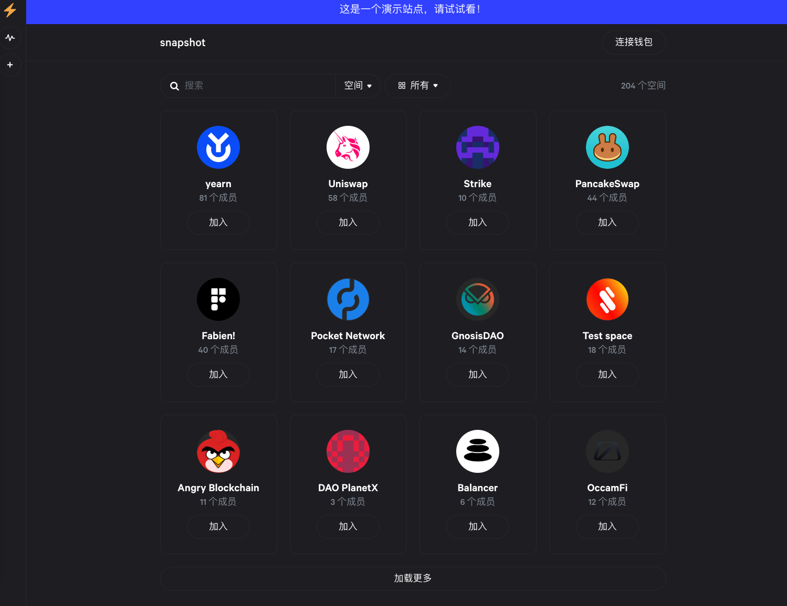
- 点击登陆钱包

	
- 点击创建 DAO

	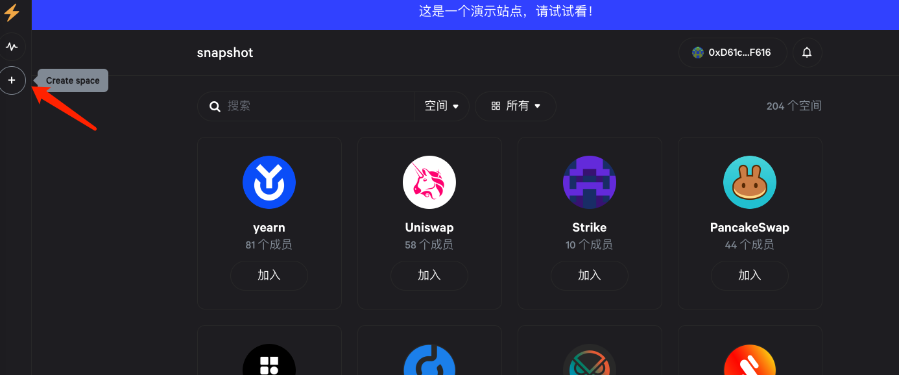
- 点击注册新的 ENS, 注意这里输入域名需要带 `.eth` 后缀

	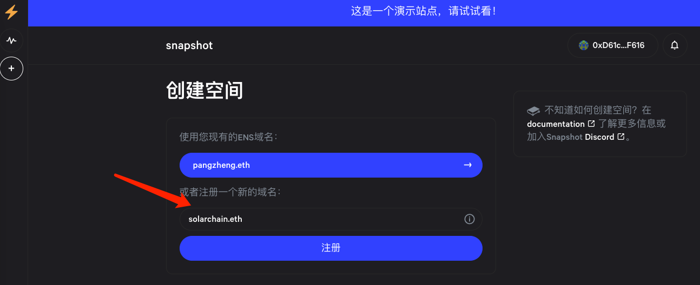
- 在 ENS 上注册域名，注意这里年份和收费不是正比关系，建议10年起

	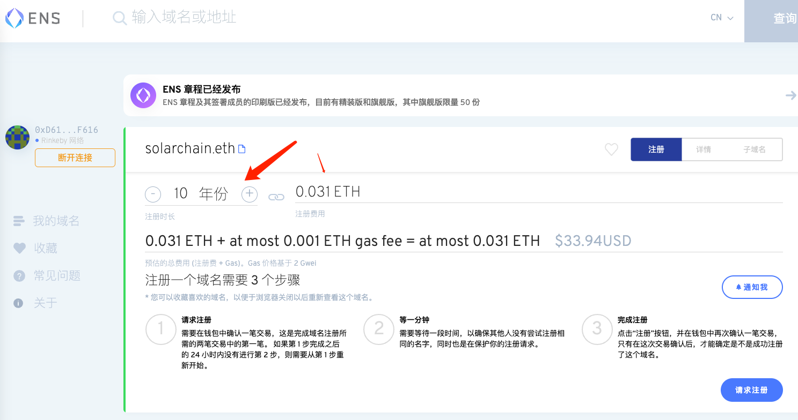		
- 查看 ens 注册结果
	- 域名
	- 到期时间 

	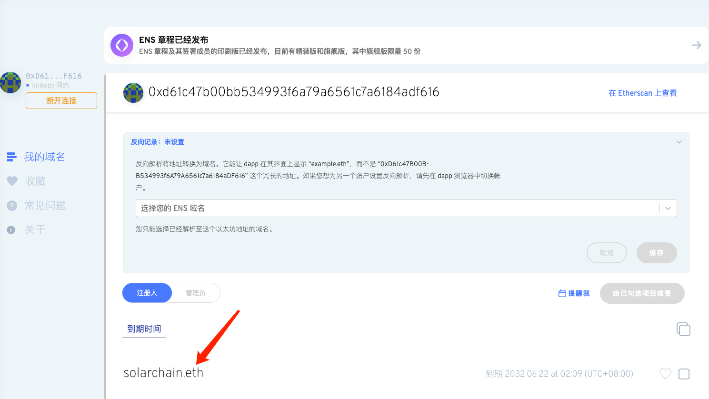
- 返回页面点选 ENS 域名创建空间

	
- 控制人设置，默认使用登陆钱包地址，确认点击设置	
	- 
	- 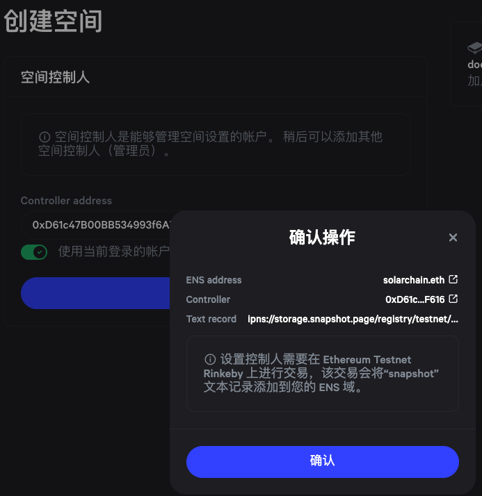	
	- 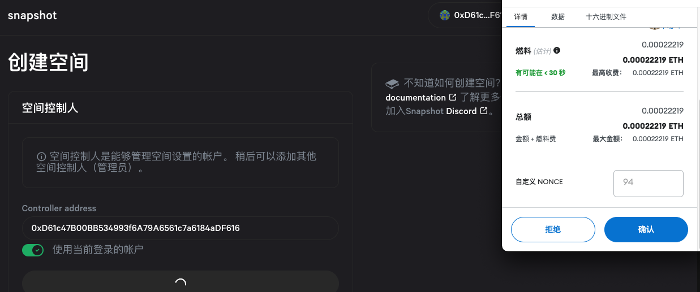	
- 空间信息
	- 用户信息
		- 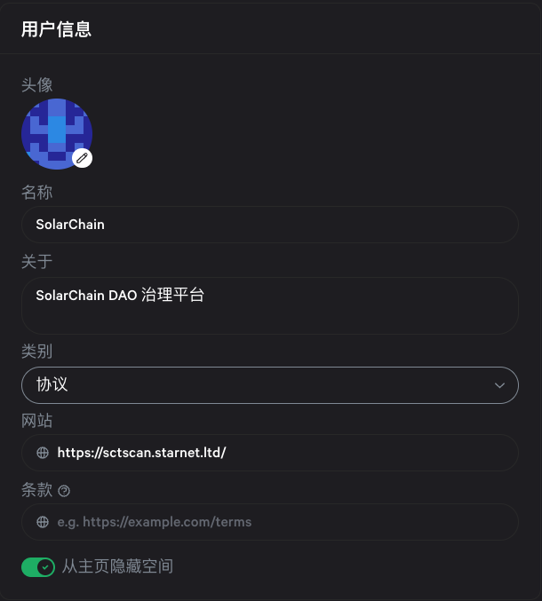
			- 头像
			- 名称，必填
			- 关于
			- 类型
				- 协议
				- 社交媒体
				- 投资
				- 服务
				- 创作者
				- 拨款项目
				- 文化传媒
				- 收藏夹 
			- 网站
			- 条款
			- 隐藏主页
	- 社交账户
		- 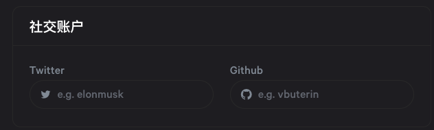
			- twitter
			- github
	- 投票策略
		- 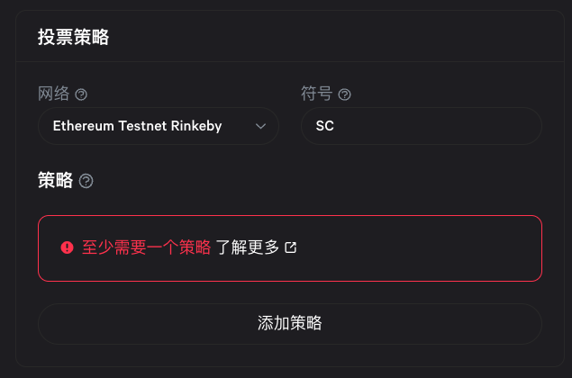 
			- 网络

				用于此空间默认网络，网络也可以在个别策略中指定
			- 符号
			
				空间使用的默认符号，通常是代币符号
			- 策略

				用于确认用户投票权或提案权，最多并行5个策略
				
				- erc20-balance-of(我们选择之前DAO工具创建)
					-  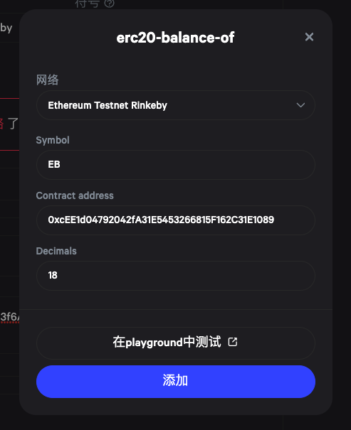 
					-  点击测试，可以查看合约是否正常，以及下面地址的余额
						- 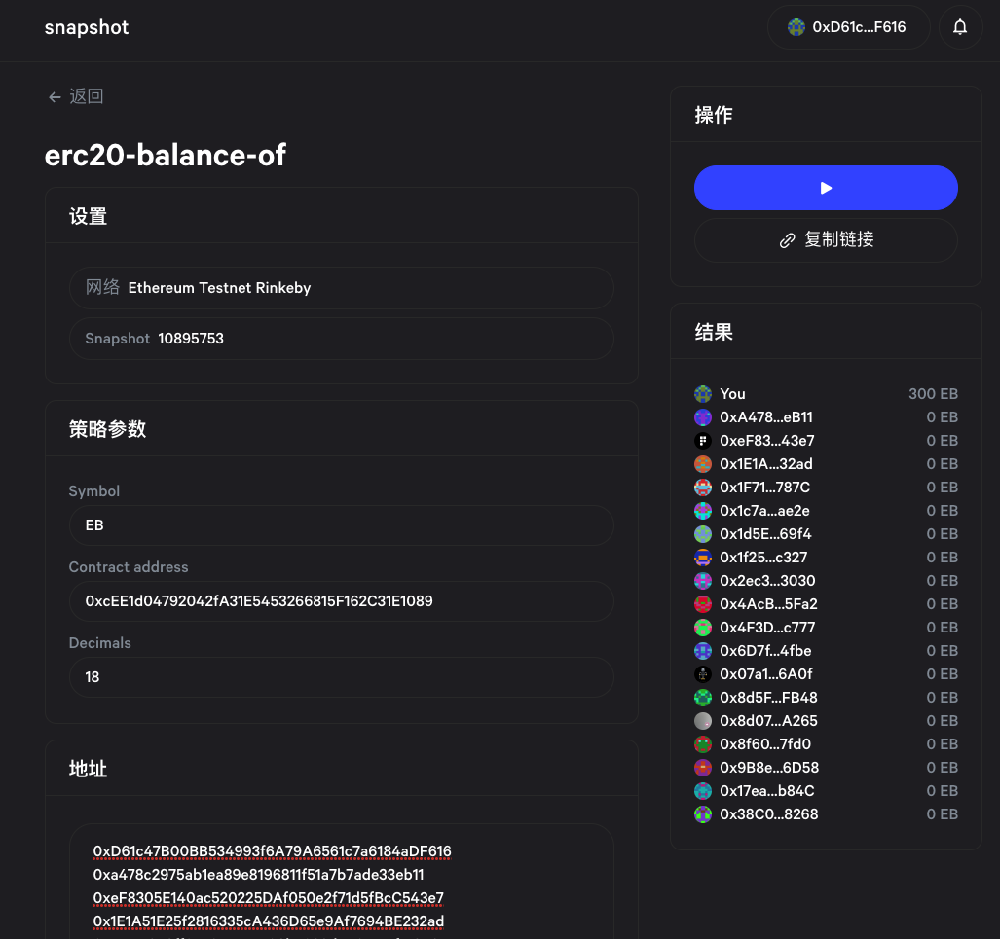 
					- 参数
						- Symbol
							- EB
						- Contract address
							- 0xcEE1d04792042fA31E5453266815F162C31E1089
						- Decimals
							- 18    
				- ticket
					-   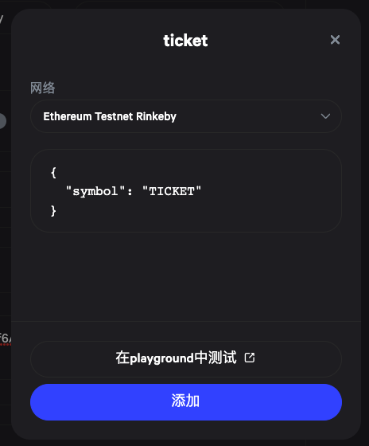
					-  点击测试，可以查看合约是否正常，以及下面地址一人一票？
						-  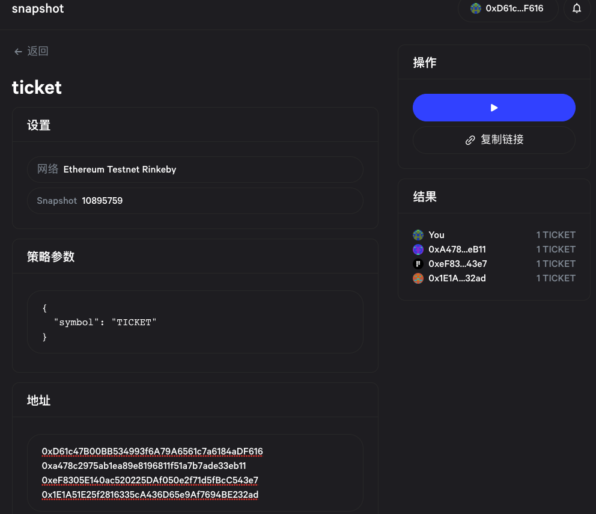
					- 参数
					
							{
							  "symbol": "TICKET"
							}  
				- delegation

						{
						  "symbol": "YFI (delegated)",
						  "delegationSpace": "yam.eth",
						  "strategies": [
						    {
						      "name": "erc20-balance-of",
						      "params": {
						        "address": "0xBa37B002AbaFDd8E89a1995dA52740bbC013D992",
						        "symbol": "YFI",
						        "decimals": 18
						      }
						    },
						    {
						      "name": "yearn-vault",
						      "params": {
						        "address": "0xBA2E7Fed597fd0E3e70f5130BcDbbFE06bB94fe1",
						        "symbol": "YFI (yYFI)",
						        "decimals": 18
						      }
						    }
						  ]
						}
				- multichain

						{
						  "symbol": "MULTI",
						  "strategies": [
						    {
						      "name": "erc20-balance-of",
						      "network": "137",
						      "params": {
						        "address": "0xB9638272aD6998708de56BBC0A290a1dE534a578",
						        "decimals": 18
						      }
						    },
						    {
						      "name": "erc20-balance-of",
						      "network": "56",
						      "params": {
						        "address": "0x0e37d70b51ffa2b98b4d34a5712c5291115464e3",
						        "decimals": 18
						      }
						    }
						  ]
						}
				- contract-call

						{
						  "address": "0x0e09fabb73bd3ade0a17ecc321fd13a19e81ce82",
						  "symbol": "Cake",
						  "decimals": 18,
						  "methodABI": {
						    "inputs": [
						      {
						        "internalType": "address",
						        "name": "account",
						        "type": "address"
						      }
						    ],
						    "name": "balanceOf",
						    "outputs": [
						      {
						        "internalType": "uint256",
						        "name": "",
						        "type": "uint256"
						      }
						    ],
						    "stateMutability": "view",
						    "type": "function"
						  }
						}
				- erc721(我们选择之前opensea创建的)
					- 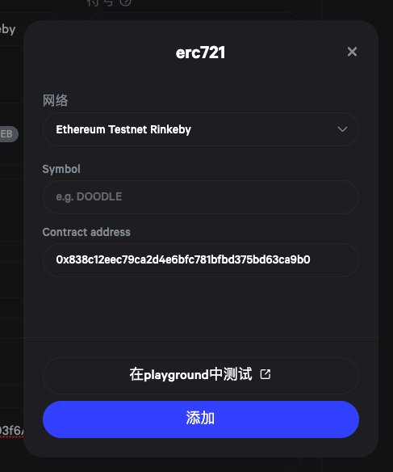
					- 点击测试，可以查看合约是否正常，以及下面地址合约拥有多少 NFT
						-  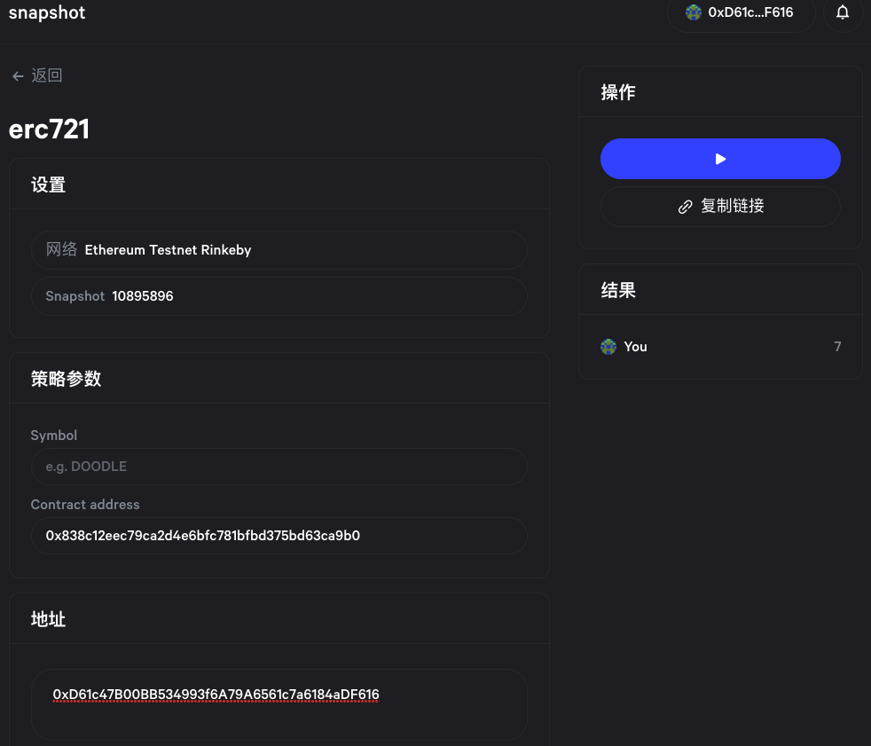
					- 参数
						- Symbol 空
						- Contract address

								0x838c12eec79ca2d4e6bfc781bfbd375bd63ca9b0
				- eth-balance
					- 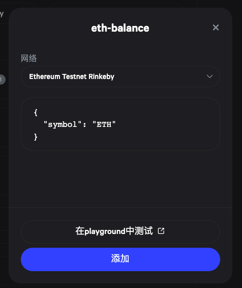
					- 点击测试，可以查看合约是否正常，以及下面地址拥有多少 ETH
						- 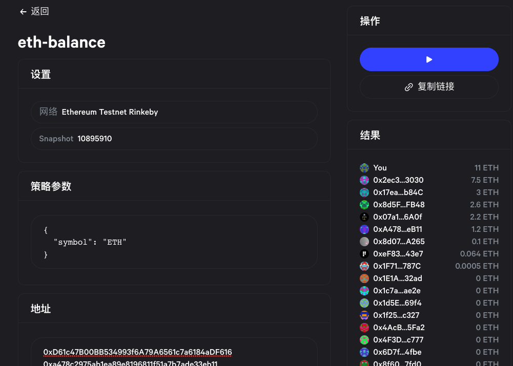
					- 参数

							{
							  "symbol": "ETH"
							} 
				- whitelist
					- 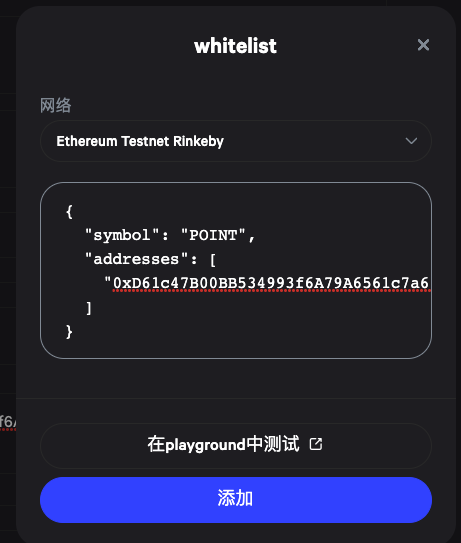
					- 点击测试，可以查看合约是否正常，以及下面地址是否在白名单中
						- 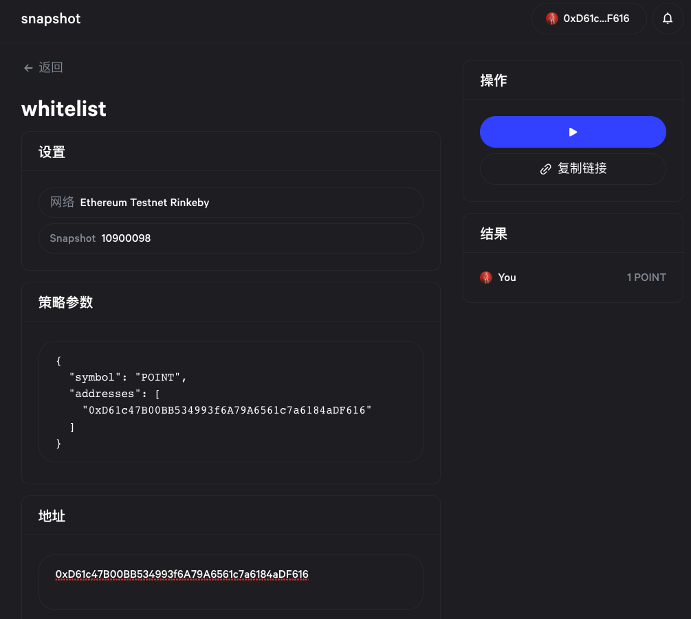
					- 参数
					
							{
							  "symbol": "POINT",
							  "addresses": [
							    "0xD61c47B00BB534993f6A79A6561c7a6184aDF616"
							  ]
							}
				- erc1155-balance-of
					-  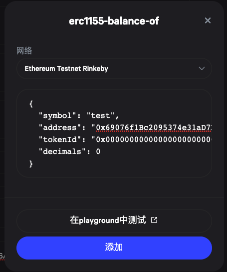
					- 点击测试，可以查看合约是否正常，以及下面地址持有该 1155 tokenID 的数量 
						- 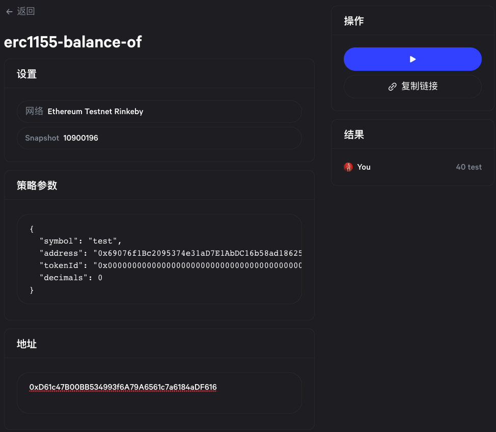
					- 参数

							{
							  "symbol": "",
							  "address": "0x69076f1Bc2095374e31aD7E1AbDC16b58ad18625",
							  "tokenId": "0x000000000000000000000000000000000000000000000000000000000000138b",
							  "decimals": 0
							}
				- 其他可能是自定义(测试失败)
					- erc20-balance-of-delegation
						- 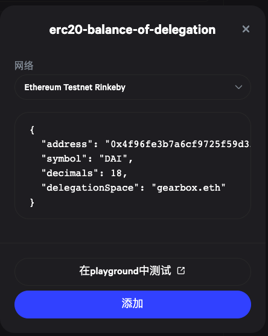
						- 点击测试，可以查看合约是否正常，以及下面地址拥有多少 DAI
							- 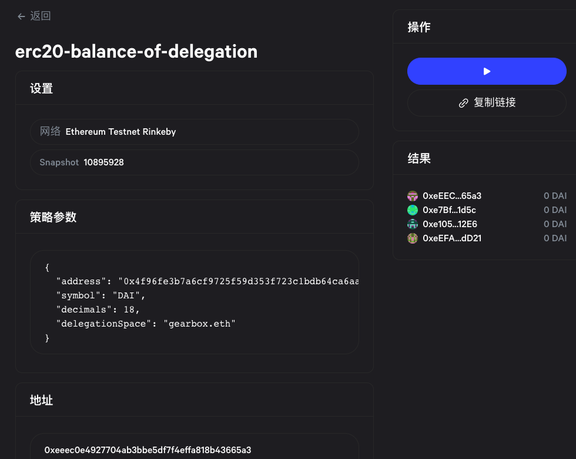
					- hopr-bridged-balance
	
							{
							  "symbol": "HOPR",
							  "xHopr": "0xd057604a14982fe8d88c5fc25aac3267ea142a08",
							  "wxHopr": "0xD4fdec44DB9D44B8f2b6d529620f9C0C7066A2c1",
							  "hopr": "0xf5581dfefd8fb0e4aec526be659cfab1f8c781da"
							} 
					- synthetix
	
							{
							  "address": "0x023c66b7e13d30a3c46aa433fd2829763d5817c5",
							  "symbol": "WD"
							}
					- pagination
	
							{
							  "symbol": "DAI",
							  "strategy": {
							    "name": "erc20-balance-of",
							    "params": {
							      "address": "0x6b175474e89094c44da98b954eedeac495271d0f",
							      "decimals": 18
							    }
							  }
							}
					- balacer
	
							{
							  "address": "0xba100000625a3754423978a60c9317c58a424e3D",
							  "symbol": "BAL BPT V1+V2",
							  "decimals": 18
							}
					- uniswap
					
							{
							  "address": "0x6b175474e89094c44da98b954eedeac495271d0f",
							  "symbol": "DAI"
							}
					- erc20-with-balance
	
							{
							  "address": "0x84cA8bc7997272c7CfB4D0Cd3D55cd942B3c9419",
							  "symbol": "DIA",
							  "decimals": 18
							}		
	- 角色定义
	
		
		
		- 管理员
			- 能够编辑空间设置和管理提案
			- 可以设置多个
		- 作者
			- 可以创建提案而不需要验证
			- 可以设置提案只有作者可以添加
			- 可以设置多个
	- 自定义域名
		
		需要到 github 提交 pr
		
		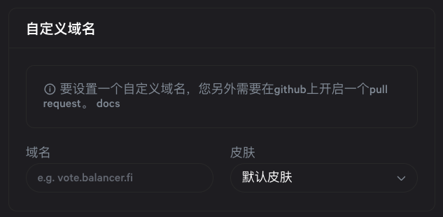
		
		- 域名
		- 皮肤
			
			可选已经提交的pr方案
	- 提案验证
	
		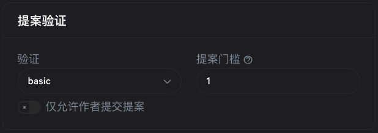
		
		- 验证
			- basic
			- aave
			- nouns 
		- 提案阈值
		
			创建提案所需的最低投票权数
		- 仅允许作者提交提案	
	- 投票		 		 
	
		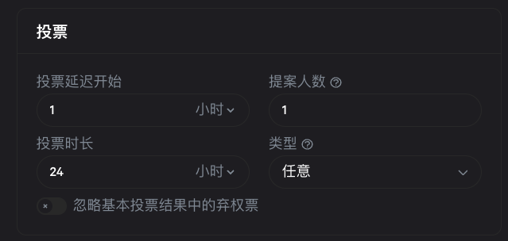
		
		- 投票延迟开始(最低1小时)
			- 单位 
				- 小时
				- 天 
		- 提案人数
			
			提案获得通过所需的最低投票数 
		- 投票时长(最低1小时)
			- 单位 
				- 小时
				- 天
		- 类型
		
			选择该空间内的投票方式，这个方式将应用到这个空间的所有提案
			
			- 任意
				- 以下投票方式全部包含 
			- 单选投票
				- 每个投票人只选择一个选项 
			- 赞成投票
				- 每选民都可以选择任意数量的选项 
			- 二次投票
				- 每个选民都可以在任何数量的选择中分配投票权，结果按四舍五入计算 
			- 排序选择投票
				- 每个选民都可以选择和排列任何数目的选择，通过计算得到结果 
			- 加权投票
				- 每个选民都可以在任何选择中分散投票权 
			- 基本投票
				- 支持
				- 反对
				- 弃权
		- 忽略 `基本投票` 类型的弃权票 
	- 插件

		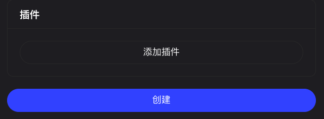
		
		- Gnosis SafeSnap

				{
				  "safes": [
				    {
				      "network": "CHAIN_ID",
				      "realityAddress": "0xSWITCH_WITH_REALITY_MODULE_ADDRESS"
				    }
				  ]
				}

		- Quorum

				{
				  "strategy": "static",
				  "total": 1234
				}
		- 其他自定义
			- Poap Module
			- Comment Box
			- Gnosis Impact
			- HAL		
- 签名创建空间钱包显示内容

		from:
		0xd61c47b00bb534993f6a79a6561c7a6184adf616
		space:
		solarchain.eth
		timestamp:
		1655957451
		settings:
		{"strategies":[{"name":"erc20-balance-of","network":"4","params":{"address":"0xcEE1d04792042fA31E5453266815F162C31E1089","decimals":18,"symbol":"EB"}},{"name":"ticket","network":"4","params":{"symbol":"TICKET"}},{"name":"erc721","network":"4","params":{"address":"0x838c12eec79ca2d4e6bfc781bfbd375bd63ca9b0"}},{"name":"eth-balance","network":"4","params":{"symbol":"ETH"}},{"name":"whitelist","network":"4","params":{"symbol":"POINT","addresses":["0xD61c47B00BB534993f6A79A6561c7a6184aDF616"]}},{"name":"erc1155-balance-of","network":"4","params":{"symbol":"test","address":"0x69076f1Bc2095374e31aD7E1AbDC16b58ad18625","tokenId":"0x000000000000000000000000000000000000000000000000000000000000138b","decimals":0}}],"categories":["protocol"],"treasuries":[],"admins":["0xD61c47B00BB534993f6A79A6561c7a6184aDF616"],"members":["0xD61c47B00BB534993f6A79A6561c7a6184aDF616"],"plugins":{},"filters":{"minScore":1,"onlyMembers":false},"voting":{"delay":3600,"hideAbstain":false,"period":86400,"quorum":1},"validation":{"name":"basic","params":{}},"name":"SolarChain","about":"SolarChain DAO 治理平台","network":"4","symbol":"SC","private":false}

	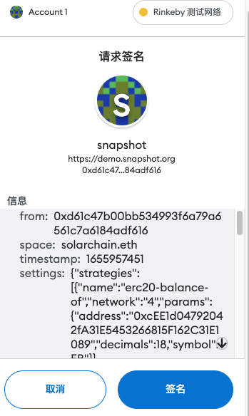

## 使用治理空间
- 游览地址

	[https://demo.snapshot.org/#/solarchain.eth](https://demo.snapshot.org/#/solarchain.eth)
- 治理空间创建成功

	注意，虽然你是管理员和作者，但你不是成员，可以点击加入成员
	
	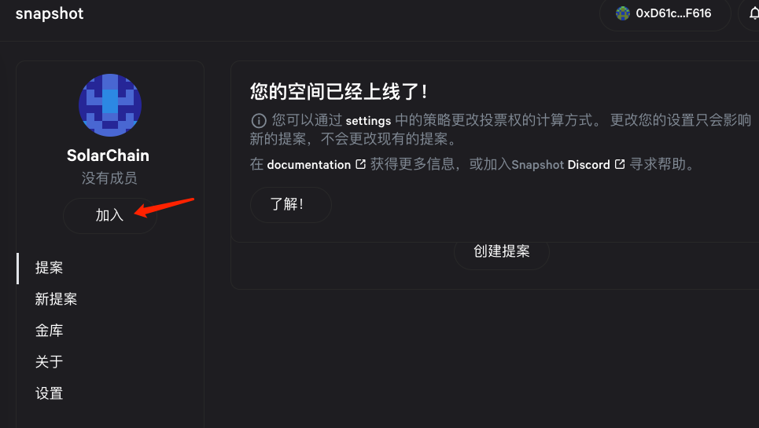
- 治理空间页面

	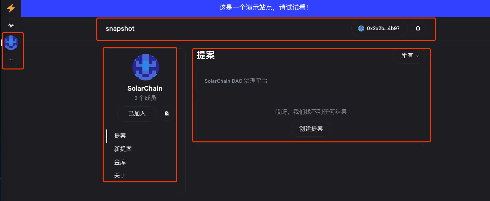

	 从左到右
	 
	- 空间切换控
		- 时间线
		- 已经加入治理的空间
		- 创建新空间
	- 用户界面
		- snapshot 用户信息
			- 查看设置
			- 切换钱包
			- 登出
		- 通知按钮
			- 全部
			- 未读
			- 全部标记为已读
			- 通知列表
	- 治理空间选项
		- 空间基础信息 
			- 头像
			- 名称
			- 成员数量
			- 当前登陆地址是否加入

				注意这里选择加入不加入只和左侧显示已加入项目有关，和有没有投票权和有没有创建提案权无关。
				
				- 已加入
				- 未加入
					- 加入操作
						- 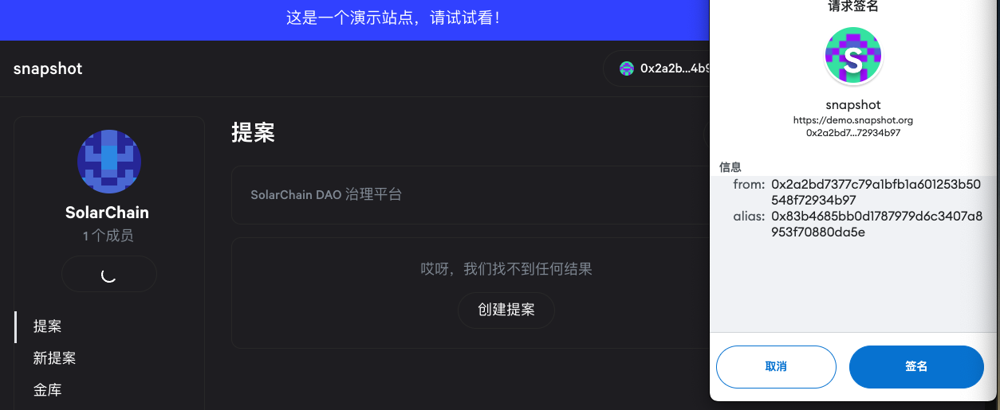
						- 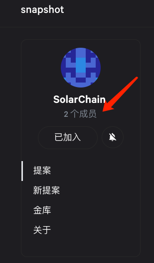 
				- 退出
					- 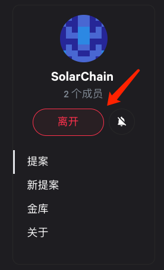          
		- 设置游览器通知
			- 默认关闭，点击设置游览器通知弹窗
	- 治理选项
		- 普通用户 
			- 提案
			- 新提案
			- 金库
			- 关于	    
		- 管理员
			- 设置(比普通用户多) 

### 新提案
- 创建新提案

	点击 `新提案` 选项或者在提案右侧点击`创建提案` 按钮，进入创建提案导航页
	
	- 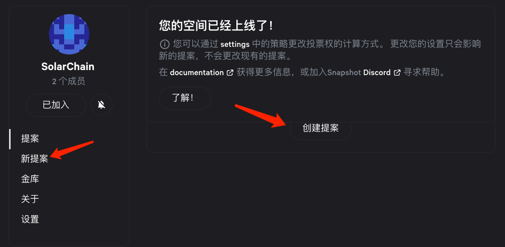    
- 新提案编辑内容

	- 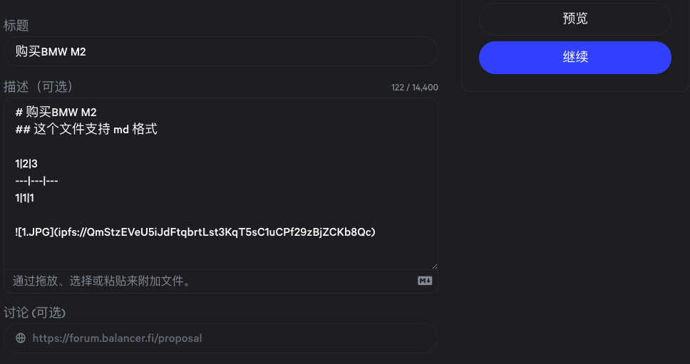  
		- 标题
		- 描述
			- 限制字符串数量，最大 14400 个字符 
			- 可选
			- 支持 md 格式
			- 可以通过拖拽上传附件到 ipfs (可以使用 https://gateway.pinata.cloud/ipfs/QmStzEVeU5iJdFtqbrtLst3KqT5sC1uCPf29zBjZCKb8Qc 查看)
		- 讨论
			- 可选
			- 一个可以讨论提案 bbs 对应的议题链接，如 [https://forum.balancer.fi/about](https://forum.balancer.fi/about ) 
	- 操作区
		- 预览按钮
			- 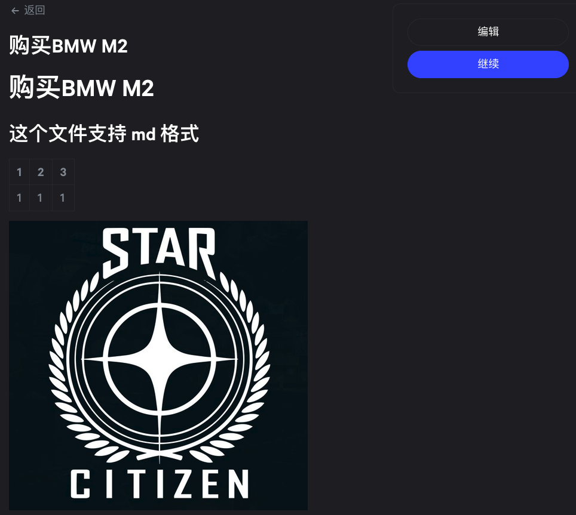
		- 继续按钮
	
			跳转下一步
	- 当用户少于提交验证要求时，无法提交，即使管理员也不行，必须是作者才可以
		- 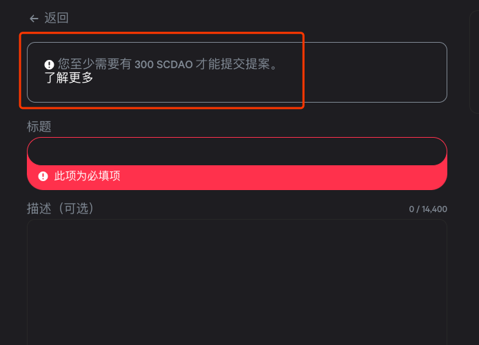
- 新提案治理策略选择	
	- 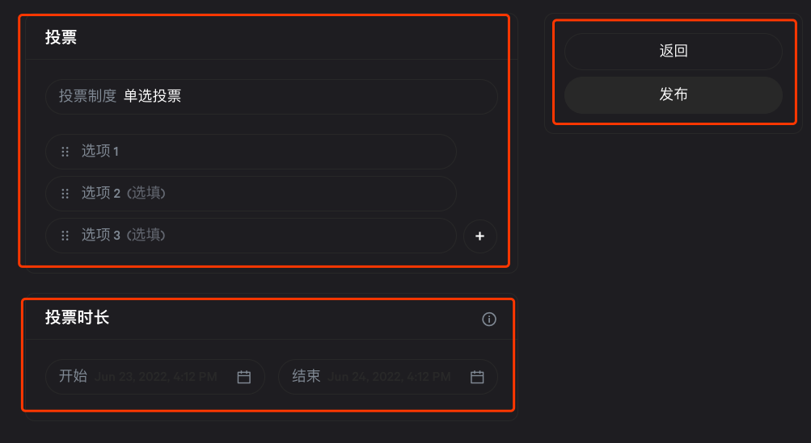
		- 投票区
			- 投票制度(选择投票策略，这里可以选择创建治理空间时选择的投票策略)
				- 单选投票
				- 赞成投票
				- 二次投票
				- 排序选择投票
				- 加权投票
				- 基本投票
			- 选项区
				
				可以制定选择内容，每个选项最多填写 32 个字符
			- 投票时长

				选择开始和结束时间，当前是强制 
	- 操作区
		- 返回
		- 发布
			- 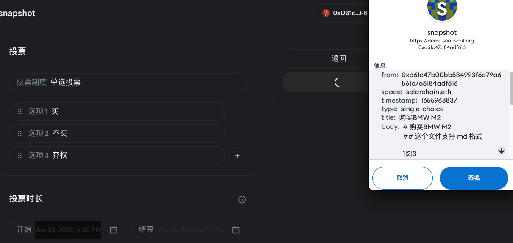 
			- 钱包签名内容
			
					from:
					0xd61c47b00bb534993f6a79a6561c7a6184adf616
					space:
					solarchain.eth
					timestamp:
					1655968837
					type:
					single-choice
					title:
					购买BMW M2
					body:
					# 购买BMW M2
					## 这个文件支持 md 格式
					
					1|2|3
					---|---|---
					1|1|1
					
					
					discussion:
					choices:
					0:
					买
					1:
					不买
					2:
					弃权
					start:
					1655972437
					end:
					1656058837
					snapshot:
					10901037
					plugins:
					{}
- 已生成提案
	- 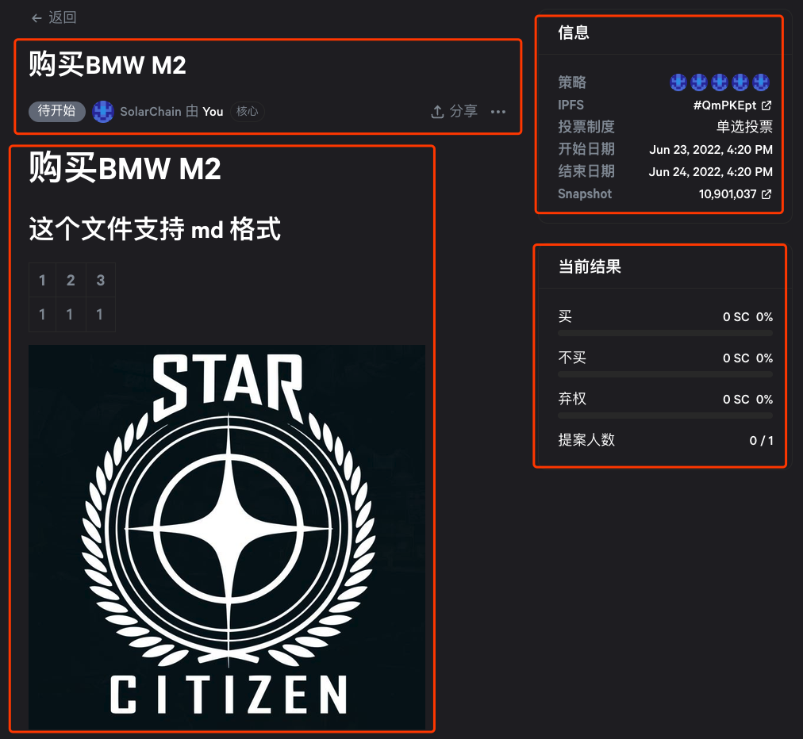 
	- 区域包含
		- 提案标题
			- 名称
			- 状态
				- 待开始
				- 活跃
				- 已关闭
				- 核心  
			- 治理简介
				- 头像
				- 名称
			- 创建者
				
				鼠标放在上面跳出标签页
				 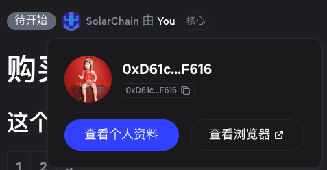 
				
				- 名称
				- 类型
					- 核心(管理员？)
			- 分享
				- twitter
				- facebook
				- 复制链接 
			- 提案操作
				- 删除
				- 复制 
	- 提案内容
		
		可以折叠收起
	- 提案信息
		- 策略
			- 这里策略是之前创建空间选择的5个策略 
		- IPFS
			- 点击可以打开整个提案的 json 信息对应的 ipfs ，注意提供商是彩虹马。
		- 投票制度
			- 当前是单选投票 
		- 开始日期
		- 结束如器
		- snapshot
			- 点击链接可以查看快照块高度对应的游览器
	- 提案 IPFS json

		[https://snapshot.mypinata.cloud/ipfs/QmPKEpt3V4RkKG5SboX8eeW4jBa655GmxcMye2JL7RVwL5](https://snapshot.mypinata.cloud/ipfs/QmPKEpt3V4RkKG5SboX8eeW4jBa655GmxcMye2JL7RVwL5)

			{
			address: "0xD61c47B00BB534993f6A79A6561c7a6184aDF616",
			sig: "0x0e20687311d1b137c73cb1b8ad5721fc682fdfbe2a68a1900bb1c48aa6d2426a021d4552d1c9d2ff05de312be33540d39eba83b3d00372fb72320e1cadfbda061c",
			data: {
			domain: {
			name: "snapshot",
			version: "0.1.4"
			},
			types: {
			Proposal: [
			{
			name: "from",
			type: "address"
			},
			{
			name: "space",
			type: "string"
			},
			{
			name: "timestamp",
			type: "uint64"
			},
			{
			name: "type",
			type: "string"
			},
			{
			name: "title",
			type: "string"
			},
			{
			name: "body",
			type: "string"
			},
			{
			name: "discussion",
			type: "string"
			},
			{
			name: "choices",
			type: "string[]"
			},
			{
			name: "start",
			type: "uint64"
			},
			{
			name: "end",
			type: "uint64"
			},
			{
			name: "snapshot",
			type: "uint64"
			},
			{
			name: "plugins",
			type: "string"
			}
			]
			},
			message: {
			space: "solarchain.eth",
			type: "single-choice",
			title: "购买BMW M2",
			body: "# 购买BMW M2
			## 这个文件支持 md 格式
			
			1|2|3
			---|---|---
			1|1|1 
			
			
			    ",
			discussion: "",
			choices: [
			"买",
			"不买",
			"弃权"
			],
			start: 1655972437,
			end: 1656058837,
			snapshot: 10901037,
			plugins: "{}",
			from: "0xD61c47B00BB534993f6A79A6561c7a6184aDF616",
			timestamp: 1655968837
			}
			}
			}
### 提案
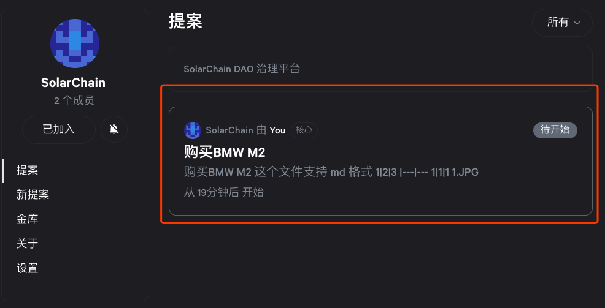 

- 简介

	创建完提案后，就可以在提案选项看到提案的简介。简介内容包含
	
	- 空间名
	- 创建提案用户信息
		- 名称
		- 类型
	- 标题
	- 内容简介
	- 创建操作距现在的时间
	- 状态
		- 待开始
			- 等待开始，时间在设置中的`投票延迟开始时间`设置
		- 活跃
			- 延迟时间过后，就进入了投票开放的活跃状态，会在3个地方有提示
				- 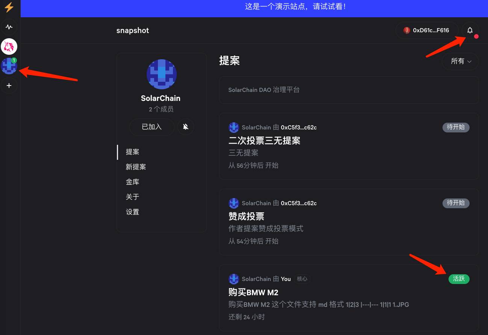   
		- 已关闭
		- 核心     
- 详情

	点击简介可以进入提案详情。
	
	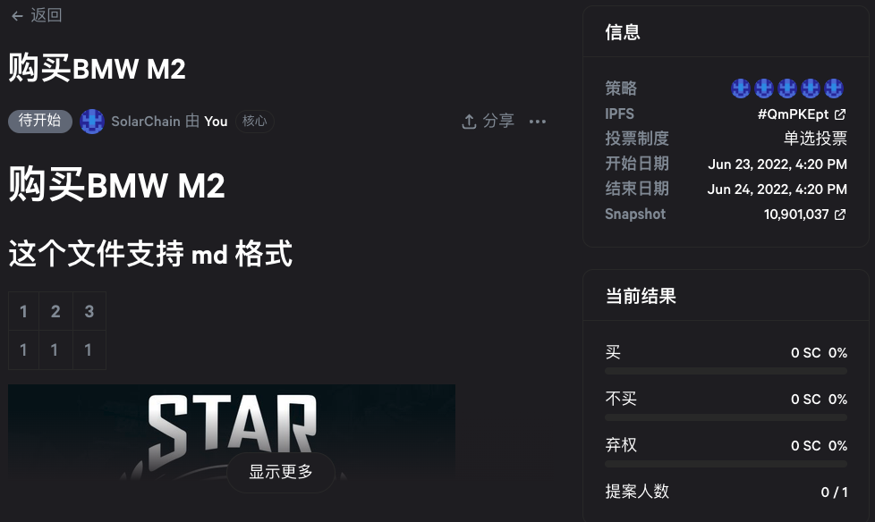
- 点击通知

	可以查看通知提示提案已经开始，点击通知进入提案详情
	
	 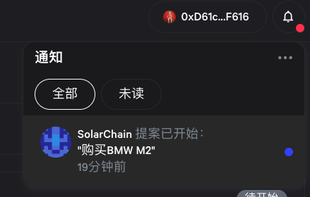
	
#### 投票
选择活跃状态提案，投票的形式与选择投票制度有关

	注意，因为没有上链，所以在投票没有结束前，可以多次修改投票结果。

- 投票制度与投票方式
	- 单选投票
	
		只能在多个选项中选一个选项
		
		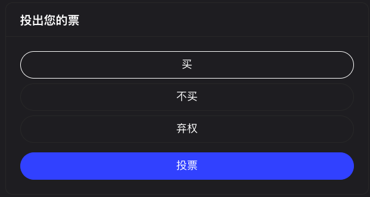 
		
		- 钱包签名数据

				from:
				0xc5f3ee2c41a3c01d9f5be5b65a97321b9e87c62c
				space:
				solarchain.eth
				timestamp:
				1655978485
				proposal:
				0x43de325294052b8be547f371425eee4c517798ba2029857e4bfb6b0037badb35
				choice:
				1
				
		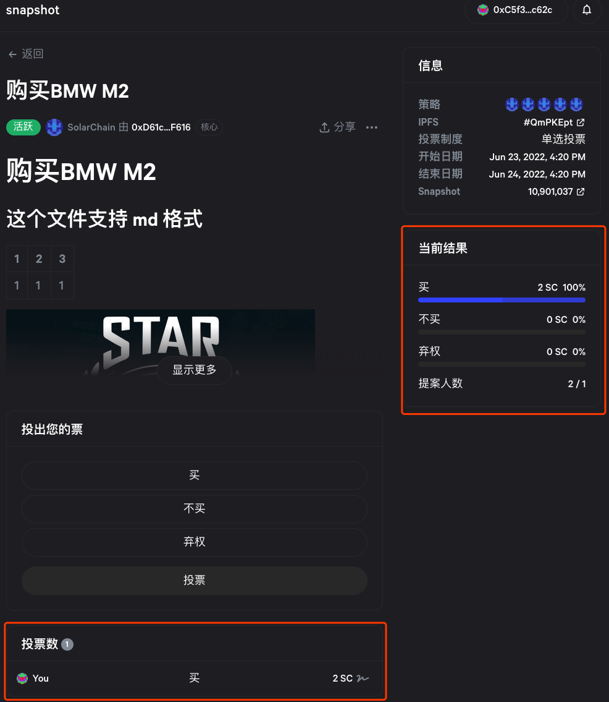  
	- 赞成投票

		可以在多个选项中选择多个选项，每个选项都按照投票权数额投票
		
		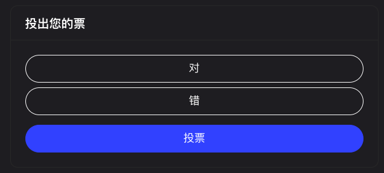
		
		- 钱包签名数据

				from:
				0x2a2bd7377c79a1bfb1a601253b50548f72934b97
				space:
				solarchain.eth
				timestamp:
				1655980643
				proposal:
				0xc7c708864418ecfda1df2c7d72016b95a683294270830d9b925568c7c5b6dda1
				choice:
				0:2
				1:1 
				
		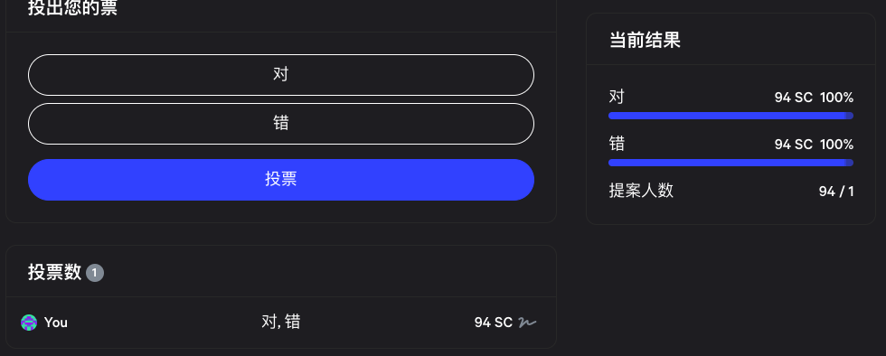  		
	- 二次投票

		可以在多个选项中选择多个选项，每个选项按照投票权比例投票，票数四舍五入
		
		- 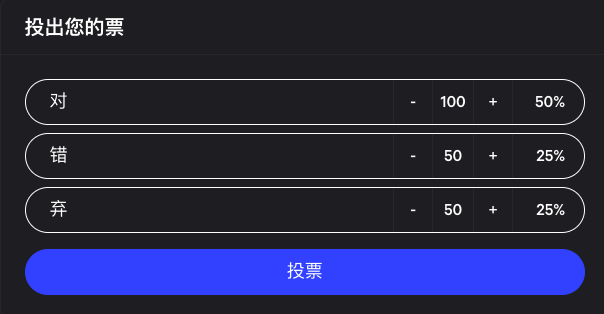
		- 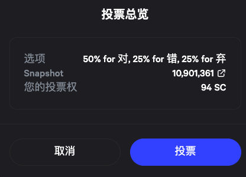
		- 钱包签名数据

				from:
				0x2a2bd7377c79a1bfb1a601253b50548f72934b97
				space:
				solarchain.eth
				timestamp:
				1655981253
				proposal:
				0x588453fbd793bfc5bcfa9cde1f336abc6a3a6f646ca7677b40a24a0f47361114
				choice:
				{"1":100,"2":50,"3":50}
		
		 		
	- 排序选择投票

		每个选民都可以选择和排列任何数目的选择，通过计算得到结果
		
		-  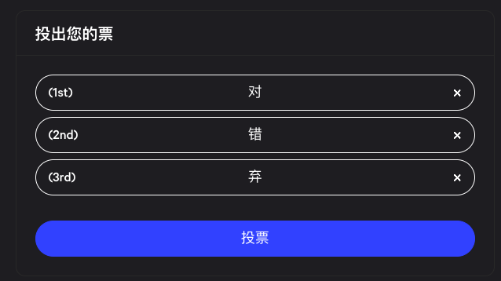
		-  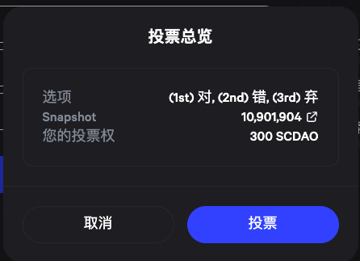
		-  钱包签名数据

				from:
				0xd61c47b00bb534993f6a79a6561c7a6184adf616
				space:
				solarchain.eth
				timestamp:
				1655986047
				proposal:
				0x09a43836ebb83baf8cabd025c15c6871cc1fcd1719552e5a5083cef5018b3225
				choice:
				0:1
				1:2
				2:3
		
		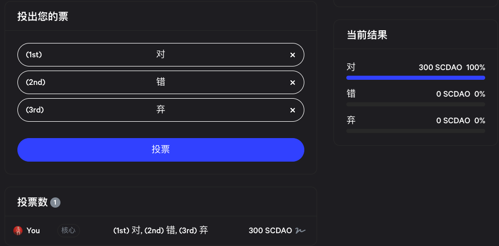			 
	- 加权投票

		每个选民都可以在任何选择中分散投票权
		
		- 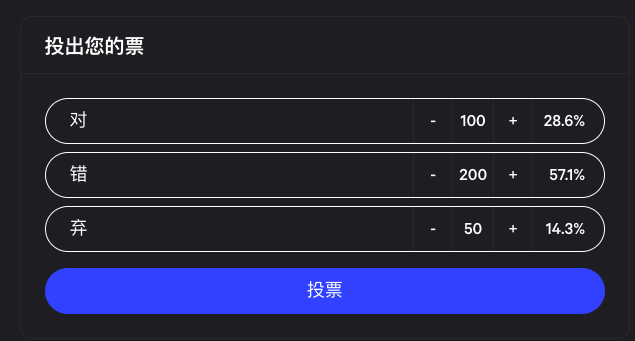 
		- 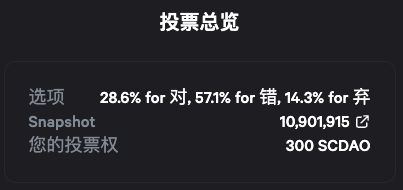 
		- 钱包签名数据

				from:
				0xd61c47b00bb534993f6a79a6561c7a6184adf616
				space:
				solarchain.eth
				timestamp:
				1655986308
				proposal:
				0x068e3bc4e1ab632b59f7dc070c301f0a4cb7d2ba82596c21b091997d29f7b653
				choice:
				{"1":100,"2":200,"3":50}
		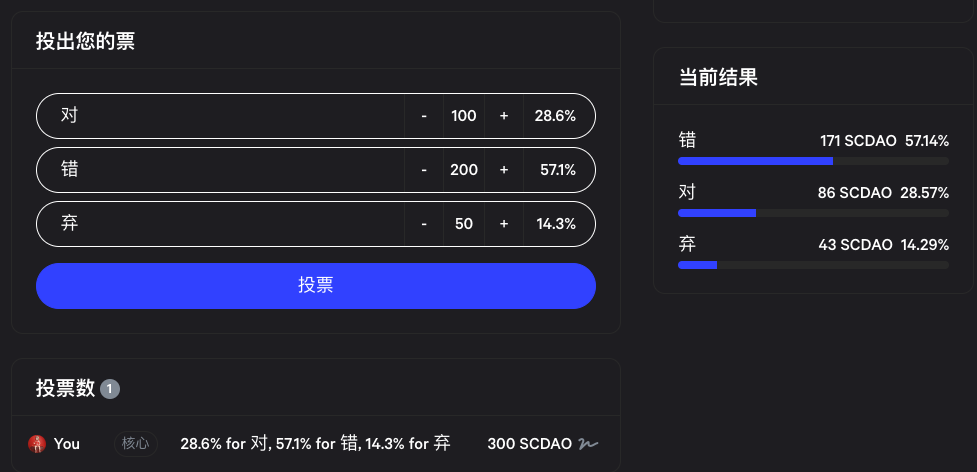 			
	- 基本投票
		
		支持:反对:弃权

		-  	
		- 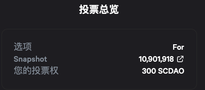 
		- 钱包签名数据

				from:
				0xd61c47b00bb534993f6a79a6561c7a6184adf616
				space:
				solarchain.eth
				timestamp:
				1655986467
				proposal:
				0x8e72e979a41a6034da9775ec5c47eebe644007bcac4e3c28bd7b1593c02091cc
				choice:
				1
		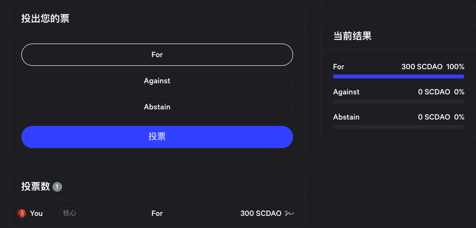 	 			
- 投票确认

	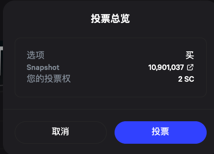 
	
	- 用户选择的选项
	- snapshot 区块高度，可以点击外链，链接到区块链游览器对应区块高度中
	- 投票权
- 钱包签名

	
 
	
- 投票数结果

	投票后会多出一个菜单投票数，显示已经投票的用户信息
	
	  
	
	- 用户
		- 头像
		- 名称
	- 投票选项
	- 投票数量
		- 数量   
	
			鼠标放在上面可以显示多种策略中该地址投票权的统计，比如例子中的地址在本次投票中，一人一票加拥有1个eth，总记两票
			
			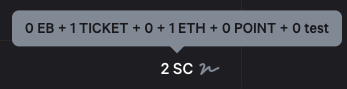 
		- 凭证
			- 作者
				- 显示保存在 IPFS 的 json 投票信息，类似

						{
						address: "0xC5f3Ee2C41a3C01d9F5be5B65A97321b9E87c62c", <- 投票用户地址
						sig: "0xa9c492d8fbd7c48fbd443e615be566fa8af0ea5ce4a146f37f13547c2f0e510a581743e224d0500ff7990672b8a1462c5c6ed97956c32be74a187b86195959cc1b", <- 签名信息 
						data: {
						domain: {
						name: "snapshot", <- 软件
						version: "0.1.4" <- 版本
						},
						types: {
						Vote: [
						{
						name: "from",
						type: "address"
						},
						{
						name: "space",
						type: "string"
						},
						{
						name: "timestamp",
						type: "uint64"
						},
						{
						name: "proposal",
						type: "bytes32"
						},
						{
						name: "choice",
						type: "uint32"
						}
						]
						},
						message: {
						space: "solarchain.eth", <- 空间名
						proposal: "0x43de325294052b8be547f371425eee4c517798ba2029857e4bfb6b0037badb35", <- 提案id
						choice: 1, <- 投票制度类型
						from: "0xC5f3Ee2C41a3C01d9F5be5B65A97321b9E87c62c", <- 投票用户地址
						timestamp: 1655978579 <- 投票时间戳
						}
						}
						}
			- 在 signator.io 验证

				在 signator.io 网站验证签名信息是否正确
				
				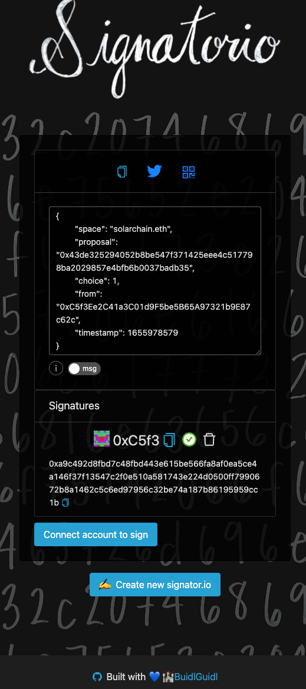 	 
- 当前结果

	当前结果简介描述了投票简介情况，结果根据投票的多少排序，包括
	
	- 选项名称
	- 投票数量
	- 投票占本次投票的比例
	- 提案是否通过书比，比如本次是 2/1  

### 投票关闭
- 简介

	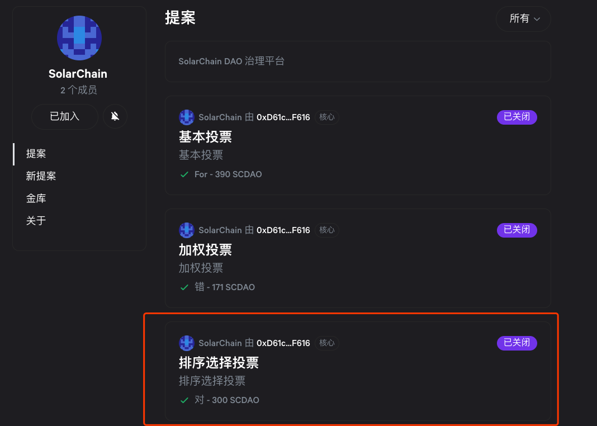 
	
	- 比其他状态多了一个对勾
	- 状态从活跃变更成了 `已关闭`
- 详情

	和活跃中的状态不同的地方就是状态转成已关闭，并且投票区没有，其他一致。
	
	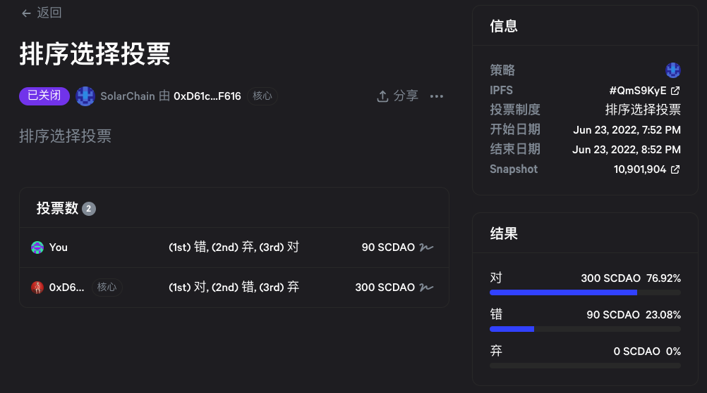  
	
### 关于
现实治理空间的基础信息

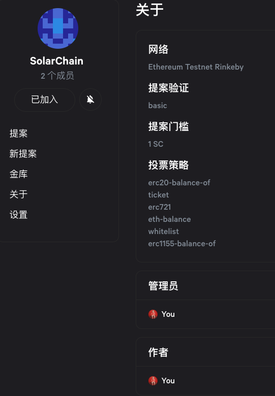 

- 基础信息	 
	- 网络
	
		哪个链
	- 提案验证
	- 提案门槛
	- 提案策略
- 控制信息
	- 管理员
	- 作者

#### 设置/金库
设置和金库设置相同，同创建新空间时候的编辑信息，可以编辑空间所有信息，注意只有管理员才可以编辑

比创建空间多出来的设置是金库

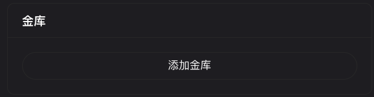 

## 费用
- 申请 ens 费用	0.031 eth + 46267 gas

	需要两次交易，第一笔是确认域名没有被抢占，第二次是续费
- 续费 ens 0.031 + 83956 gas

	续费只需要1次交易
			
## 参考
- 测试网站 [https://demo.snapshot.org/](https://demo.snapshot.org/)
	- 网路当前仅支持 rinkeby 